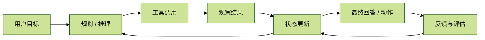
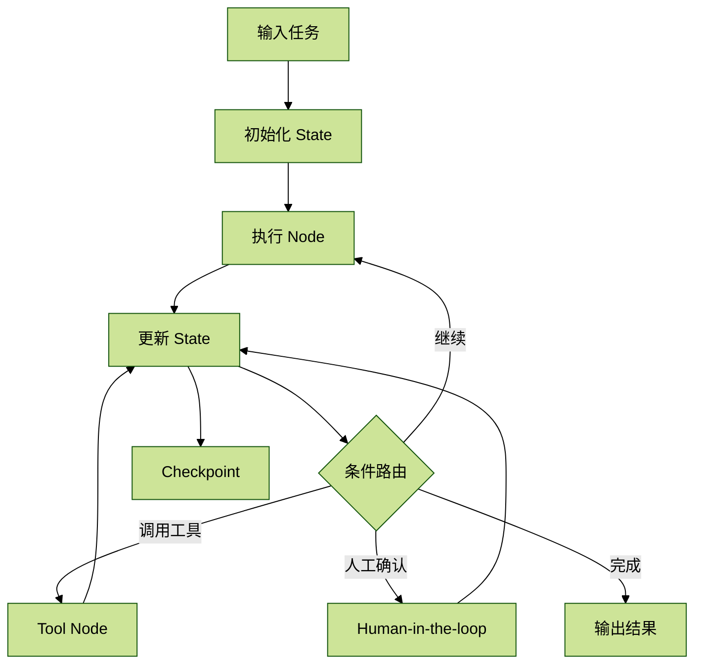
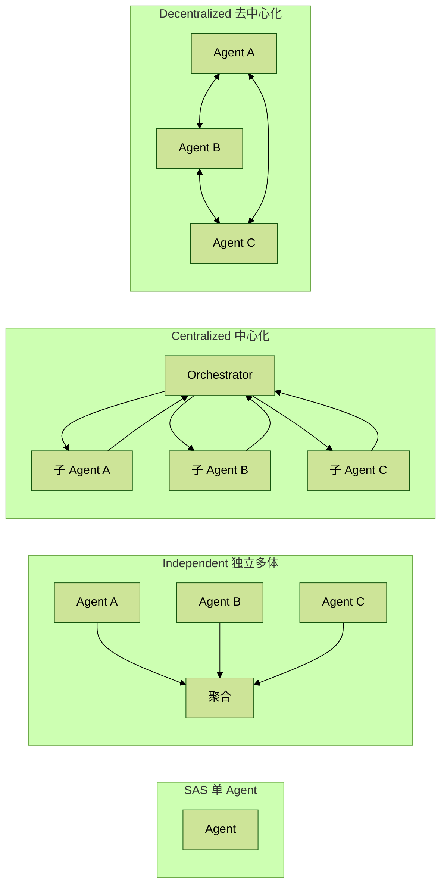

## For future Claude

这是一份面向 AI Agent 面试复习的结构化笔记，主要覆盖 Agent 开发框架、[[LangChain]] / [[LangGraph]]、[[Function Calling]]、Agent 评估、[[MCP]]、Agent 记忆机制和 [[Multi-Agent]] 架构设计。原始材料带有较多口语化提示和面试备考语气，本次整理保留其“面试可回答”的用途，同时补充了更清晰的结构、工程解释和常见追问入口。涉及框架版本、MCP 传输协议等易变化内容时，应以后续官方文档为准。

# Agent 面试知识结构化笔记

## 0. 总览：Agent 到底在考什么

Agent 面试题通常不是单纯问“会不会调用大模型”，而是在考察候选人是否理解下面四件事：

1. **编排能力**：能否把一个开放任务拆成可执行步骤。
2. **工具能力**：能否让模型稳定调用外部工具、接口、数据库或 MCP Server。
3. **状态能力**：能否管理短期上下文、长期记忆、任务进度和中间结果。
4. **评估能力**：能否判断 Agent 是否真的变好，而不是只看一次 demo。

可以把 Agent 理解成一个带工具、记忆和反馈回路的推理系统：

面试回答时，尽量不要只背框架名。更好的回答结构是：

- 先说明问题属于哪类 Agent 能力。
- 再说明为什么要这样设计。
- 最后结合项目说明如何落地、如何评估、如何处理失败。

## 1. Agent 开发框架

### 1.1 常见 Agent 框架对比

| 框架 | 核心定位 | 适合场景 | 面试回答关键词 |
| --- | --- | --- | --- |
| AutoGPT | 自主型 Agent 框架 | 开放式任务探索、自动规划 demo | 自主循环、任务拆解、可控性较弱 |
| LangChain | LLM 应用组件库 | RAG、工具调用、快速原型 | 组件丰富、生态强、抽象多 |
| LangGraph | 图式 Agent 编排框架 | 多步骤、可控工作流、多 Agent | 状态机、有向图、可恢复、可观测 |
| Dify | AI 应用构建平台 | 低代码工作流、产品化应用 | UI 化、工作流、模型与工具管理 |
| CrewAI | 多 Agent 角色协作框架 | 多角色分工、开放式协作 | 角色、任务、团队协作 |
| AutoGen | 多 Agent 对话协作框架 | 人机协作、多 Agent 对话流 | 对话控制、可调试、多 Agent |
| Semantic Kernel | 微软的 AI 编排 SDK | 企业系统集成、插件化技能 | Plugin、Planner、Memory、企业集成 |

面试里不需要把所有框架都讲深。真正要讲清楚的是：**项目用了哪个框架，为什么用它，它解决了什么问题，又带来了什么限制。**

### 1.2 LangChain：核心设计理念

[[LangChain]] 的核心思想是把 LLM 应用拆成可复用组件，例如 Prompt、Model、Tool、Retriever、Memory、Chain / Agent。它的价值在于让开发者快速把模型、外部数据源、工具和业务逻辑组合起来。

面试可回答为：

> LangChain 更像一个 LLM 应用开发工具箱。它把 Prompt、模型、工具、检索器、记忆和链式流程封装成统一接口，方便快速搭建 RAG、工具调用和 Agent 原型。它的优势是生态丰富、集成多；缺点是抽象层较厚、版本变化快，在复杂状态管理和强可控工作流里不如 LangGraph 清晰。

#### LangChain 的优点

- 集成丰富：支持大量模型、向量数据库、工具和评估组件。
- 原型速度快：RAG、工具调用、Agent demo 可以快速搭起来。
- 生态成熟：社区资料、案例和第三方集成比较多。

#### LangChain 的不便之处

1. **依赖复杂**：集成面很广，项目容易引入较多间接依赖。
2. **接口变化快**：历史版本迭代频繁，迁移和维护成本较高。
3. **调试链路长**：链式调用里每一步都可能出错，定位问题需要日志和可观测性。
4. **复杂状态不够直观**：线性 Chain 或简单 Agent 对条件分支、循环、恢复和人类介入支持不如图式框架清楚。

#### LangChain v1.0 的新口径

截至 2026-06-28，LangChain v1.0 的官方文档强调 `create_agent`、middleware、结构化输出和更稳定的 Agent 构建方式。面试中可以这样回答：

> 我了解 LangChain v1.0 以后更强调标准化 Agent 创建方式和 middleware。middleware 类似 Web 框架里的中间件，可以在 Agent 执行链路中插入动态提示词、上下文裁剪、工具访问控制、状态管理和 guardrails。结构化输出也更体系化，可以通过模型原生能力或工具调用策略生成符合 schema 的结果。对于新项目，我会优先看 v1 的写法；对于老项目，则要结合历史版本和迁移成本。

### 1.3 LangGraph：为什么需要图式 Agent

[[LangGraph]] 解决的是 LangChain 在复杂任务里的一个核心问题：**任务流程不总是线性的。**

复杂 Agent 往往需要：

- 条件分支：不同输入走不同路径。
- 循环：工具结果不够好时继续搜索或重试。
- 并行：多个子任务同时执行。
- 中断与恢复：等待人工确认，或失败后从 checkpoint 恢复。
- 共享状态：多个节点读取和更新同一份任务状态。

LangGraph 把任务建模为有向图：

| 概念 | 含义 | 类比 |
| --- | --- | --- |
| Graph | 整体工作流 | 一张流程图 |
| Node | 计算单元 | 一个函数、Agent 或工具步骤 |
| Edge | 控制流 | 下一步走向 |
| State | 共享状态 | 工作流里的上下文对象 |
| Checkpoint | 状态快照 | 可恢复的存档点 |
| Store | 长期存储 | 跨会话记忆或知识库 |

#### LangGraph 的流转过程

面试可回答为：

> LangGraph 的执行过程可以理解为状态机。用户输入先写入 State，然后图中的节点按 Edge 执行。每个节点读取当前 State，完成模型调用、工具调用或业务处理后返回增量更新。条件边根据 State 决定下一步走哪个节点。因为 State 可以 checkpoint，所以它比普通链式调用更适合长流程、可恢复和人类介入的 Agent 系统。

### 1.4 Semantic Kernel：核心设计理念

[[Semantic Kernel]] 是微软推出的 AI 编排 SDK，更偏企业应用集成。它的核心概念包括：

- **Plugin / Skill**：把外部函数、API 或业务能力封装成模型可调用的插件。
- **Planner**：根据用户目标自动选择插件并生成执行计划。
- **Memory**：保存和检索历史信息。
- **Connector**：连接不同模型、向量数据库和外部系统。

面试可回答为：

> Semantic Kernel 更偏企业级 AI 编排。它强调把已有业务能力封装成 Plugin，让模型通过 Planner 调用这些能力。相比 LangChain，它的微软生态和企业系统集成味道更重；相比 LangGraph，它不是单纯的图式工作流框架，而更强调插件化能力组织和计划执行。

## 2. Function Calling

### 2.1 Function Calling 是什么

[[Function Calling]] 是让 LLM 不只输出自然语言，而是输出符合工具 schema 的结构化调用请求。它本质上是把“语言意图”转成“可执行动作”。

典型流程是：

1. 开发者提供函数名、描述和 JSON Schema。
2. 模型根据用户意图判断是否需要调用函数。
3. 模型生成函数名和参数。
4. 系统执行函数。
5. 工具结果返回模型，模型继续推理或生成最终答案。

### 2.2 Function Calling 能力如何训练出来

面试可回答为：

> Function Calling 能力来自多阶段训练和对齐。预训练阶段让模型理解自然语言和代码 / JSON 等结构化文本；SFT 阶段用标注样本教模型在什么场景下调用什么函数、如何生成参数；RLHF 或偏好优化阶段进一步让模型的工具调用更符合人类期望。工程上真正影响稳定性的，不只有模型能力，还包括函数设计、schema 描述、提示词和失败重试机制。

需要注意：面试中不要把 Function Calling 说成模型“真的执行函数”。模型只是生成调用意图和参数，真正执行函数的是外部运行时。

### 2.3 工具调用失败如何避免

常见失败包括：不该调用时调用、该调用时没调用、参数缺失、参数类型错误、枚举值乱填、工具结果无法继续推理。

工程优化方法：

1. **减少参数数量**：工具入参越多，模型填错概率越高。
2. **拆分工具职责**：一个工具只做一类明确动作，避免“万能工具”。
3. **优化 schema**：写清类型、必填字段、默认值、枚举范围和约束。
4. **优化命名**：函数名和参数名要贴近业务语义。
5. **给调用示例**：复杂工具可以在 prompt 中加入少量示例。
6. **前置校验**：工具执行前校验参数，失败后把错误反馈给模型。
7. **重试与降级**：参数修复失败时，可以要求用户澄清或走人工兜底。

面试一句话总结：

> 工具调用稳定性不是只靠模型，而是靠“工具接口设计 + schema 约束 + 参数校验 + 失败反馈 + 重试降级”共同保证。

## 3. Agent 性能评估

### 3.1 如何评价一个 Agent

Agent 评估要同时看传统工程指标和 Agent 特有指标。

| 维度 | 指标 | 说明 |
| --- | --- | --- |
| 体验 | 延迟 | 端到端耗时、首 token 延迟、工具调用耗时 |
| 成本 | Token / API 成本 | 输入输出 token、工具调用次数、外部服务成本 |
| 稳定性 | 错误率 / 超时率 | 工具失败、解析失败、循环失控、异常退出 |
| 输出质量 | 正确性 / 相关性 / 完整性 | 最终答案是否解决问题 |
| 过程质量 | 轨迹评估 | 工具选择、调用顺序、是否走了合理路径 |
| RAG 质量 | 忠实度 / 召回 / 引用 | 答案是否基于证据，引用是否可追溯 |
| 业务效果 | 解决率 / 转化率 / 人工接管率 | 结合具体业务 KPI |

### 3.2 传统工程指标

#### 延迟

延迟是请求到输出的耗时。Agent 的延迟不只来自模型，还来自检索、工具调用、网络请求、重试和多轮推理。

工程落地：

- 记录端到端耗时。
- 记录每个节点或工具的耗时。
- 设置超时和降级策略。
- 对慢调用做 trace 分析。

#### 资源与成本

LLM 成本通常和 token、模型价格、调用次数、工具成本相关。

工程落地：

- 记录每轮输入 / 输出 token。
- 统计每个 Agent、每类任务、每个用户的成本。
- 对高成本路径做 prompt 压缩、检索裁剪或模型分层。

#### A/B 测试

不同 Prompt、模型、工具策略、RAG 参数或 Agent 架构都可以通过 A/B 测试比较。

工程落地：

- 固定流量分桶。
- 对比解决率、满意度、延迟和成本。
- 避免只看主观样例。

### 3.3 Agent 特有指标

#### 响应质量

响应质量关注最终答案是否相关、正确、完整、可执行。

常见方法：

- 规则匹配：适合分类、抽取等确定性任务。
- 语义相似度：适合开放问答，但要避免只看相似不看事实。
- LLM-as-a-Judge：适合主观维度，但必须有清晰 rubric。

#### 轨迹评估

轨迹评估不只看最终答案，还看 Agent 的过程是否合理。

可以评估：

- 是否调用了正确工具。
- 工具调用顺序是否合理。
- 是否满足工具前置条件。
- 是否做了必要澄清。
- 是否出现无意义循环。

典型评分方式：

- 精确匹配：实际步骤必须完全等于标准步骤。
- 顺序匹配：关键步骤顺序正确即可。
- 集合匹配：该用的工具都用到了，不强求顺序。
- 查准率 / 查全率：评估工具和步骤命中情况。

#### RAG 系统评测

RAG Agent 还要额外关注：

- Context Precision：检索内容是否精准。
- Context Recall：关键证据是否被召回。
- Faithfulness：回答是否忠实于证据。
- Answer Relevance：回答是否真正回应问题。
- Citation Accuracy：引用是否可追溯。

### 3.4 美团龙猫论文的评估思路

美团龙猫的核心价值在于把本地生活任务抽象为可交互工具环境，用更接近真实业务的方式评估 Agent。

它可以拆成两部分理解：

#### 数据集制作

将外卖、到店、旅行等真实业务场景抽象为：

- 工具集合。
- 工具依赖图。
- 用户模拟器。
- 单场景任务。
- 跨场景任务。

这比静态问答更接近真实 Agent，因为 Agent 必须在工具环境中连续决策。

#### 性能评测

评测维度包括：

1. **推理维度**：能否在信息不完备时整合线索并做决策。
2. **工具维度**：能否选择正确工具、满足前置条件、填对参数。
3. **交互维度**：能否处理模糊意图、主动澄清、维持上下文一致。

最终输出不只是“任务是否成功”，还包括工具命中率、步骤评分和失败归因。

### 3.5 项目中如何回答 Agent 评估

如果项目没有完整企业级评估，也不要硬说“已经非常完善”。可以回答为：

> 项目里主要用离线测试和在线追踪两类方法。离线测试会构造 JSONL 数据集，每条样本包含用户输入、期望输出、期望工具路径和关键检查点。评估时分别看响应质量、工具轨迹和效率指标。响应质量可以用规则或 LLM Judge，轨迹评估则比较实际工具调用是否符合预期。在线追踪会记录端到端延迟、每一步 token、工具调用耗时和失败原因，并上传到可观测平台做趋势分析和告警。

这套回答的优点是：既承认评估分层，又能落到工程实现。

## 4. MCP

### 4.1 MCP 和 Function Calling 的区别

[[MCP]] 和 Function Calling 容易混淆，但它们不在同一层。

| 对比项 | Function Calling | MCP |
| --- | --- | --- |
| 层级 | 模型调用工具的输出格式 | 工具 / 资源 / Prompt 暴露协议 |
| 关注点 | 模型如何生成函数名和参数 | 客户端如何发现、连接和调用外部能力 |
| 作用范围 | 单个模型或 SDK 内部 | 跨客户端、跨工具服务的标准协议 |
| 类比 | “我要调用哪个函数，参数是什么” | “有哪些工具服务，如何连接和调用” |

面试可回答为：

> Function Calling 更像模型侧的工具调用格式，解决模型如何表达调用意图的问题；MCP 更像工具生态协议，解决工具如何被发现、描述、连接和调用的问题。实际系统里，两者可以配合：MCP Server 暴露工具，客户端把这些工具转成模型可理解的 tool schema，模型再通过 Function Calling 触发调用。

### 4.2 MCP 本地 Server 和远端 Server

| 类型 | 通信方式 | 优点 | 风险 / 限制 |
| --- | --- | --- | --- |
| 本地 MCP Server | 通常通过 stdio | 简单、低延迟、适合本机文件和开发工具 | 依赖本地环境，分发和权限管理较麻烦 |
| 远端 MCP Server | Streamable HTTP 等 | 易共享、易集中部署、适合 SaaS 工具 | 需要认证、网络稳定性、安全边界 |

本地 Server 更像“客户端旁边的工具进程”，远端 Server 更像“可被多个客户端访问的工具服务”。

### 4.3 MCP 传输协议

截至 2026-06-28，MCP 官方规范中常见传输包括：

- **stdio**：常用于本地 MCP Server，客户端通过标准输入 / 输出与 Server 通信。
- **Streamable HTTP**：远端 Server 的主流方式，使用 HTTP POST / GET，SSE 可以作为可选流式增强。

面试中可以这样说：

> 早期很多资料会把远端 MCP 简化为 HTTP + SSE，但后续规范更推荐 Streamable HTTP。SSE 不再是唯一核心，而是可选的流式能力。这个变化让远端 MCP 更接近标准 HTTP 服务，也更利于认证、恢复和基础设施集成。

注意：如果面试官问到具体版本，不要死背日期，应回答“以官方 MCP specification 为准”。

### 4.4 MCP Server Tool 设计原则

MCP Tool 设计的关键不是“工具越多越好”，而是让 LLM 容易理解、容易调用、容易恢复。

#### 入参设计

- 必填参数尽量少。
- 能默认就默认。
- 用枚举收敛选择空间。
- 类型和约束写进 schema。
- 参数描述要业务化，不要只写技术字段名。

#### 工具粒度

- 不要把多个动作塞进一个工具。
- 不要设计过于碎片化的工具，让模型每一步都要猜。
- 常见粒度是“一个明确业务动作一个工具”。

#### 返回值设计

- 返回结构化结果，不只返回一段自然语言。
- 明确 success / error / data 字段。
- 错误信息要能指导模型修复下一次调用。
- 大结果要分页、摘要或按需返回，避免污染上下文。

#### 安全与权限

- 写操作要有确认机制。
- 高风险工具要做权限校验和审计日志。
- 对文件、数据库、外部 API 的访问范围要最小化。

面试一句话总结：

> MCP Tool 的设计原则是：schema 对模型友好，权限对系统安全，返回值对后续推理有用。

## 5. Agent 记忆机制

### 5.1 短期记忆与长期记忆

Agent 记忆可以分为短期记忆和长期记忆。

| 类型 | 作用范围 | 存储内容 | 常见实现 |
| --- | --- | --- | --- |
| 短期记忆 | 当前会话 / 当前任务 | 对话历史、当前状态、中间结果 | 上下文窗口、State、Checkpoint |
| 长期记忆 | 跨会话 / 跨任务 | 用户偏好、事实、项目经验、历史摘要 | 数据库、向量库、知识图谱、文件系统 |

短期记忆解决“当前任务做到哪一步了”，长期记忆解决“以前发生过什么、用户偏好是什么、哪些经验应该复用”。

### 5.2 LangChain 中的记忆

传统 LangChain 里常见记忆方式包括：

- `ConversationBufferMemory`：保存对话历史。
- 摘要式记忆：用 LLM 压缩历史对话。
- `VectorStoreRetrieverMemory`：把历史信息写入向量库，通过语义检索找回。

面试回答要点：

> LangChain 的记忆更像组件化封装。短期记忆可以直接把历史对话放入上下文，或者用摘要压缩；长期记忆通常借助向量数据库，把历史片段 embedding 后检索回来。但生产环境里不能无限追加，需要做摘要、裁剪、去重和权限隔离。

### 5.3 LangGraph 中的记忆

LangGraph 官方文档把持久化能力分成两类：

- **Checkpointer**：保存图状态，用于短期记忆、恢复、中断续跑。
- **Store**：保存跨会话信息，用于长期记忆。

面试可回答为：

> LangGraph 的短期记忆通常通过 State 和 Checkpoint 实现。每个线程或会话有自己的 thread_id，图在执行过程中不断更新 State，并通过 checkpointer 保存状态快照。长期记忆则通过 Store 实现，可以按用户、项目或业务命名空间保存信息，并支持后续检索。它和普通对话 buffer 的区别是，LangGraph 的记忆天然服务于图执行和状态恢复。

### 5.4 长期记忆的应用场景

1. **聊天机器人**：保存用户偏好、历史摘要和关键话题。
2. **个性化服务**：保存用户画像、行为模式和推荐偏好。
3. **智能客服**：保存历史工单、解决方案和满意度反馈。
4. **开发 Agent**：保存项目约定、代码风格、历史 Bug 和架构决策。
5. **研究 Agent**：保存资料来源、阅读记录、假设和结论演化。

长期记忆的关键不是“全都记”，而是“只记未来会复用的信息”。

## 6. Multi-Agent 架构

### 6.1 为什么需要 Multi-Agent

[[Multi-Agent]] 的价值在于把复杂任务拆给多个具备不同角色、工具或视角的 Agent。

它适合：

- 任务可拆分。
- 子任务可以并行。
- 需要多视角互相校验。
- 单 Agent 上下文或能力不够。

它不适合：

- 强顺序长链推理。
- 工具调用非常密集且预算有限。
- 单 Agent 已经能稳定完成。
- 协调成本大于收益。

一句话：

> 多 Agent 不是越多越强，它是在“并行收益、分工收益、互评收益”大于“通信成本、协调成本、错误放大”时才值得使用。

### 6.2 典型 Multi-Agent 架构

#### SAS：单 Agent 架构

特点：

- 一个 Agent 完成感知、推理、工具调用和输出。
- 结构简单，调试容易。
- 无通信成本。

适合：

- 顺序推理任务。
- 工具密集任务。
- 单 Agent baseline 已经较高的任务。

风险：

- 上下文压力大。
- 单点能力瓶颈。
- 难以并行探索。

#### Independent MAS：独立多体

特点：

- 多个 Agent 独立完成同一任务或不同样本。
- 最后统一聚合、投票或综合。
- 并行度高，协调成本低。

适合：

- 多方案生成。
- 并行评审。
- 批处理任务。

风险：

- 缺少过程互相纠错。
- 聚合阶段可能放大错误。
- 各 Agent 口径不一致。

#### Centralized MAS：中心化架构

特点：

- 一个 Orchestrator 负责拆解、分派、验收和收敛。
- 子 Agent 负责各自专业任务。
- 更容易做质量门控和统一口径。

适合：

- 财务分析。
- 数据清洗。
- 报告生成。
- 流程规范、可拆分的业务任务。

风险：

- Orchestrator 成为瓶颈。
- 主管 Agent 判断错误会影响全局。
- 编排轮次过多会增加成本和延迟。

#### Decentralized MAS：去中心化架构

特点：

- Agent 之间点对点通信、辩论、互相质询。
- 更适合高不确定性探索。

适合：

- 复杂检索。
- 网页导航。
- 多视角推理。
- 策略博弈。

风险：

- 通信开销高。
- 容易讨论发散。
- 需要明确停止条件。

#### Hybrid MAS：混合架构

特点：

- 有中心 Orchestrator 控制目标和验收。
- 子 Agent 之间允许有限通信。
- 兼顾统一收敛和横向协作。

适合：

- 大型复杂项目。
- 多阶段任务。
- 既需要中心控制又需要专家互通的场景。

设计时要加通信限额、白名单和阶段性验收，避免消息爆炸。

### 6.3 Agent 架构设计原则

面试可以按下面顺序回答：

#### 第一步：先判断是否需要 Multi-Agent

不要默认上多 Agent。先判断：

- 任务能否自然拆分？
- 子任务是否能并行？
- 是否需要不同专家视角？
- 单 Agent baseline 是否已经足够？
- 预算是否允许多轮通信？

如果任务强顺序、工具密集、预算固定，单 Agent 往往更稳。

#### 第二步：根据任务属性选架构

| 任务属性 | 推荐架构 | 原因 |
| --- | --- | --- |
| 强顺序、工具密集 | 单 Agent | 减少协调成本和错误传播 |
| 多方案生成 / 批量评审 | Independent MAS | 并行度高，聚合简单 |
| 流程规范、可拆分 | Centralized MAS | 方便统一调度和验收 |
| 高不确定探索 | Decentralized MAS | 多视角互相纠偏 |
| 大型复杂任务 | Hybrid MAS | 中心收敛 + 局部协作 |

#### 第三步：控制通信与状态

多 Agent 最大的问题通常不是“不会分工”，而是：

- 谁拥有最终决策权？
- 子 Agent 之间共享多少上下文？
- 中间结果如何验收？
- 失败如何回滚？
- 什么时候停止？

一个成熟的 Multi-Agent 设计必须明确这些规则。

### 6.4 单 Agent 和多 Agent 对比

| 维度 | 单 Agent | 多 Agent |
| --- | --- | --- |
| 架构复杂度 | 低 | 中到高 |
| 调试难度 | 较低 | 较高 |
| 并行能力 | 弱 | 强 |
| 上下文压力 | 集中在一个 Agent | 可拆分到多个 Agent |
| 协调成本 | 无 | 明显存在 |
| 错误传播 | 单链路传播 | 可能被聚合放大 |
| 适合任务 | 顺序、工具密集、确定流程 | 可拆分、多视角、并行探索 |

面试可回答为：

> 单 Agent 的优势是简单、稳定、可控，适合顺序推理和工具密集任务。多 Agent 的优势是分工、并行和互相校验，适合复杂任务。但多 Agent 会引入通信成本、协调成本和一致性问题，如果架构选错，反而会放大错误。

### 6.5 Agent 间通信与状态管理

#### 通信模式

1. **Handoff**

一个 Agent 把上下文和控制权交给另一个 Agent，自身退出。适合明确阶段切换，例如客服转人工、规划 Agent 转执行 Agent。

2. **Tool Call**

主管 Agent 把子 Agent 当成工具调用，自己保留控制权。适合中心化架构，便于验收和收敛。

3. **Message Collaboration**

多个 Agent 通过共享消息、事件总线或黑板持续协作。适合去中心化探索，但需要控制通信量。

#### 共享什么状态

| 策略 | 优点 | 缺点 |
| --- | --- | --- |
| 共享完整过程 | 透明、利于互相纠错 | 上下文膨胀，隐私和噪声风险 |
| 只共享最终结果 | 简洁、成本低 | 难以审查过程 |
| 共享结构化摘要 | 平衡成本和可解释性 | 需要设计摘要 schema |

工程上通常推荐共享结构化摘要，而不是把所有中间推理都塞给所有 Agent。

#### 通信介质

- **内存返回**：子 Agent 输出作为 tool result 返回主 Agent。
- **文件邮箱**：Agent 把消息写入文件或 inbox，其他 Agent 按需读取。
- **事件总线**：适合更复杂的异步协作。
- **数据库 / 黑板**：适合持久化任务状态和多人协作。

### 6.6 架构设计实战题

#### 动态网页搜索任务

题目：

> 找到某公司 2024 年可持续发展报告中关于碳排放的数据，并给出来源。

推荐架构：去中心化或混合式。

原因：

- 网页路径不唯一。
- 信息源可能分散在官网、PDF、新闻和 ESG 页面。
- 多个 Agent 可以并行探索。

设计：

- 规划 Agent：拆解目标和验收标准。
- 官网搜索 Agent：查找公司官网和报告页。
- 文档解析 Agent：下载 / 解析 PDF。
- 交叉验证 Agent：用其他来源验证数据。
- 汇总 Agent：整理最终答案和引用。

停止条件：

- 找到原始报告。
- 提取到目标指标。
- 引用可追溯。
- 验收 Agent 确认可信。

#### 金融估值任务

题目：

> 设计一个 Agent 系统分析某上市公司的估值。

推荐架构：中心化。

原因：

- 金融估值流程相对规范。
- 子任务可拆分但最终口径必须统一。
- 需要严格质量门控。

设计：

- Orchestrator：拆解任务、分派、验收。
- 财报 Agent：读取财务报表。
- 市场 Agent：收集股价、行业和宏观数据。
- 可比公司 Agent：寻找 peer company。
- 估值 Agent：执行 DCF、PE、PS 等估值。
- 风险 Agent：识别假设和风险。
- 汇总 Agent：生成报告。

#### 行程冲突检测任务

题目：

> 用户创建一个行程后，判断是否和已有行程冲突，并给出重新规划建议。

推荐架构：中心化。

原因：

- 本质是约束满足和调度问题。
- 需要统一判断时间、地点、偏好和优先级。
- 可以局部并行，但最终必须一个口径。

设计：

- Orchestrator：读取新行程并控制流程。
- 日程 Agent：整理已有日程。
- 时间 Agent：检测时间窗口冲突。
- 地点 Agent：计算通勤和位置约束。
- 偏好 Agent：读取用户偏好和优先级。
- 规划 Agent：生成调整方案。
- 验收 Agent：检查方案是否仍有冲突。

#### 中心 Agent 下子 Agent 膨胀问题

问题：

> 中心化架构中子 Agent 越来越多，会有什么问题？如何避免？

风险：

- Orchestrator 负担过重。
- 子 Agent 职责重叠。
- 工具和消息数量膨胀。
- 验收成本增加。
- 延迟和 token 成本上升。

解决：

- 按能力域分组，而不是每个小功能一个 Agent。
- 把稳定能力下沉为普通工具，不一定都做成 Agent。
- 为子 Agent 定义清晰输入输出 schema。
- 设置并发窗口和最大编排轮次。
- 引入分层 Orchestrator，但要控制层级深度。

## 7. 高频追问清单

1. LangChain 和 LangGraph 的区别是什么？
2. 为什么复杂 Agent 更适合用状态机或图结构？
3. Function Calling 失败通常有哪些原因？
4. MCP 和 Function Calling 是同一个东西吗？
5. MCP 本地 Server 和远端 Server 的区别是什么？
6. 如何设计一个对 LLM 友好的 Tool schema？
7. Agent 评估为什么不能只看最终答案？
8. 什么是轨迹评估？
9. RAG Agent 应该如何评估忠实度和引用准确性？
10. 短期记忆和长期记忆分别解决什么问题？
11. LangGraph 的 checkpoint 和 store 有什么区别？
12. 多 Agent 一定比单 Agent 好吗？
13. 中心化、多体独立、去中心化、多 Agent 混合架构分别适合什么场景？
14. 子 Agent 太多时如何控制复杂度？
15. 项目里如果没有完整评估，如何诚实又有工程感地回答？

## 8. 面试回答模板

### 8.1 解释概念

> 这个概念可以从三层理解：第一，它解决什么问题；第二，它在工程上怎么实现；第三，它有什么边界和风险。以 MCP 为例，它解决的是外部工具能力如何标准化暴露给模型客户端的问题；工程上通过 Server 暴露 tools、resources 和 prompts，客户端发现后转成模型可调用能力；风险在于权限、安全、远端认证和工具 schema 设计。

### 8.2 解释项目落地

> 在项目里我不会直接说“用了 Agent 就完了”，而是会拆成任务编排、工具调用、状态管理和评估。比如用户请求进来后，先由 Orchestrator 判断任务类型，再调用检索、工具或子 Agent；每一步都会记录 trace、token、耗时和工具结果；如果工具调用失败，会做参数校验、错误反馈和重试；最终通过离线测试集和在线日志评估效果。

### 8.3 解释架构取舍

> 我不会默认选择多 Agent。会先看任务是否可拆分、是否能并行、是否需要多视角校验，以及单 Agent baseline 是否已经足够。如果任务是强顺序、工具密集，我倾向单 Agent；如果任务是规范流程且可拆分，我倾向中心化；如果任务是开放探索，我会考虑去中心化或混合式。

## 9. 参考资料

- LangChain v1 官方文档：`https://docs.langchain.com/oss/python/releases/langchain-v1`
- LangChain structured output 官方文档：`https://docs.langchain.com/oss/python/langchain/structured-output`
- LangGraph persistence 官方文档：`https://docs.langchain.com/oss/python/langgraph/persistence`
- MCP transport 官方规范：`https://modelcontextprotocol.io/specification/2025-03-26/basic/transports`
- MCP tools 官方规范：`https://modelcontextprotocol.io/specification/2025-06-18/server/tools`
- Agentic Design Patterns 中文资料：`https://github.com/fzy2012/rhzl-Agentic-Design-Patterns-cn`
- Multi-Agent 架构参考论文：`https://arxiv.org/pdf/2512.08296v1`
