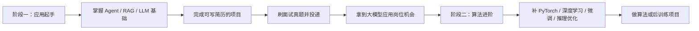

## For future Claude

这是一份根据原始口语稿润色整理的大模型应用开发学习路线。原文来自“骑猪撞宝马”的自学与面试经验分享，核心观点是：对多数转行或自学入行者来说，先从大模型应用开发切入，再根据目标补算法、推理、部署和后训练，比一开始就深挖算法更现实。文中关于 offer、公司、时间线等内容属于作者自述，未做外部核验。

# 骑猪撞宝马：大模型应用与算法学习路线

## 前言

这份资料的目标，是记录一条从零自学进入大模型应用开发的完整路线。

它不是单纯的知识点合集，也不是把网上资料搬到一起，而是围绕一个很现实的问题展开：

> 一个普通自学者，如何用尽量清晰、可执行、面向面试的方式，进入大模型行业？

作者自述从零开始学习，累计自学 200 多天，经历约 2 个月面试，最终拿到多个 offer。这个过程中的学习路线、复习资料、面试题、项目实战、简历包装和面试反思，都沉淀到了这套笔记里。

这份路线最重要的价值，不只是告诉读者“学什么”，而是解释：

- 哪些内容是高频重点。
- 为什么这些内容值得优先学。
- 学到什么深度就够用。
- 如何把知识转化成项目和面试表达。
- 如何根据岗位目标调整学习投入。

## 适用人群

这份路线主要适合以下几类人：

- 想自学进入大模型行业的社招同学。
- 希望补齐大模型应用能力的校招同学。
- 有传统开发背景，想转向 Agent、RAG、大模型应用开发的人。
- 已经了解一点大模型，但不知道如何组织学习顺序和面试重点的人。
- 想先入行，再逐步补算法、后训练、推理优化等进阶能力的人。

如果目标是纯算法研究、顶会论文、模型底层创新，这份路线不是最直接的路线。它更偏向求职和落地，尤其适合大模型应用开发方向。

## 为什么建议从应用入手？

对多数转行者和自学者来说，大模型应用开发是更容易入行的入口。

大模型岗位大致可以分为几类：

| 岗位方向 | 主要工作 | 入门难度 | 对转行者友好度 |
| --- | --- | --- | --- |
| 大模型应用开发 | Agent、RAG、工具调用、业务系统集成 | 中等 | 高 |
| 推理 / 部署工程 | 模型服务、推理框架、性能优化、GPU 资源管理 | 较高 | 中 |
| 算法 / 后训练 | SFT、LoRA、RLHF、DPO、评测、数据构造 | 高 | 中低 |
| 数据工程 | 数据清洗、标注、评测集构建、训练数据管线 | 中等 | 中 |

算法和 Infra 的门槛更高，通常需要更扎实的机器学习、深度学习、系统工程和硬件资源背景。很多岗位也会更偏好论文、竞赛、训练经验或大厂背景。

应用开发的优势在于：

- 能更快做出可展示项目。
- 更容易写进简历。
- 面试问题更集中在 Agent、RAG、工程实践、模型调用、提示词、评测和业务落地。
- 对传统开发、产品、测试、数据背景的人更友好。
- 入行后仍然可以继续补算法和系统能力。

所以更稳妥的路线是：

> 先用应用开发入行，再根据目标补算法和系统能力。

这并不意味着算法不重要。相反，算法、推理、微调、量化、后训练等知识会提高上限。但对第一阶段求职来说，它们不一定需要一开始就学到很深。

## 学习路线总览

整条路线可以拆成两个阶段。

阶段一的目标是入行，阶段二的目标是提高上限。

对很多人来说，阶段一做扎实就已经可以开始投递；阶段二并不是必须项，而是为了进入更高薪、更偏算法或更综合的大模型岗位。

## 阶段一：应用起手

阶段一的核心目标是：先具备能面试、能做项目、能讲清楚大模型应用的能力。

### 1. 学习核心知识

阶段一建议重点学习以下内容：

- Agent。
- RAG。
- LLM 基础结构。
- 模型微调的基本概念。
- 推理加速和量化的基本概念。
- AI 工具使用能力，例如 Vibe Coding、Claude Code、Cursor、Skill 等。
- 大模型应用工程化，包括评测、日志、工具调用、记忆、权限、安全边界等。

其中，最重要的是 Agent 和 RAG。

RAG 是大模型应用里最常见的工程模式之一，涉及文档解析、切分、向量化、召回、重排、上下文构造、答案生成和评测。Agent 则更偏向任务规划、工具调用、多步骤执行和复杂业务流程。

如果要分优先级，可以这样看：

| 优先级 | 内容 | 学习深度 |
| --- | --- | --- |
| 必学 | Agent、RAG、AI 通用素养 | 要能深入讲项目、讲缺陷、讲优化 |
| 重要 | LLM 结构、微调、推理加速、量化 | 要理解概念和流程，能回答常见面试题 |
| 加分 | 论文阅读、后训练、评测体系 | 能作为面试亮点，但不必一开始过深 |
| 可选 | 多模态、复杂后端、底层训练框架 | 根据岗位和个人方向补充 |

学习时不要只背八股。更好的方式是围绕真实问题学习：

- RAG 为什么会召回不准？
- Chunk 怎么切？
- 向量召回和关键词召回如何组合？
- Agent 为什么容易失控？
- 工具调用失败怎么处理？
- 如何判断一个大模型应用效果好不好？
- 面试官为什么会问这个问题？

能回答这些问题，才说明知识真的被用起来了。

### 2. 做一个能写进简历的项目

转行和自学最缺的不是“看过资料”，而是“做过东西”。

大模型岗位非常看重项目。没有项目，简历很难证明候选人真的具备相关能力。即使原来是 C++、Java、前端、测试或产品背景，也需要至少一个能和大模型岗位相关的项目。

原路线中重点提到一个 RAG-Agent 项目。这个项目的价值在于：

- 可以直接写进简历。
- 有完整设计文档。
- 有源码和讲解视频。
- 代码按多个 commit 节点拆解，每个节点完成一个小目标。
- 支持根据不同业务场景进行扩展。
- 可以用来练习项目讲解、模拟面试和简历包装。

好的项目不只是“跑起来”，还要能讲清楚：

- 为什么做这个项目？
- 解决了什么业务问题？
- 系统架构是什么？
- RAG / Agent 链路怎么设计？
- 做过哪些优化？
- 遇到过哪些问题？
- 如何评测效果？
- 如果重新做，会怎么改？

面试真正考察的不是项目名字，而是候选人能不能从项目里讲出工程判断。

### 3. 用面试真题校验学习效果

这套路线强调“面向面试”，所以真题不是最后才看的，而是贯穿整个学习过程。

建议做法是：

1. 学一个知识点。
2. 看对应面试题。
3. 自己口头复述答案。
4. 对照笔记修正表达。
5. 回到项目里找对应实践。

面试题的作用不是让人机械背诵，而是反推重点：哪些内容经常被问，哪些内容只是看起来很重要。

如果某个知识点在面试中频繁出现，就应该深入理解；如果很少出现，可以先做到了解，避免在低频内容上投入过多时间。

## 阶段二：算法进阶

阶段二面向已经完成应用学习、想继续提高上限的人。

算法进阶的目标不是立刻成为研究员，而是理解大模型训练和后训练的基本流程，具备与算法、部署、推理相关岗位沟通和面试的能力。

建议补充的内容包括：

- PyTorch 基础。
- 深度学习基础。
- Transformer 和大模型结构。
- SFT、LoRA、QLoRA。
- 模型量化和推理加速。
- RLHF、DPO、PPO、GRPO 等后训练概念。
- 数据构造、评测集、偏好数据。
- 开源项目阅读和复现。

阶段二的学习原则是：

> 不必一开始追求底层创新，但要把完整流程跑通，并用项目证明自己理解了。

也就是说，不需要马上手搓一个完整训练框架，也不需要做算法创新。更现实的目标是：

- 知道微调流程怎么走。
- 知道数据怎么准备。
- 知道 LoRA 为什么省资源。
- 知道量化会影响什么。
- 知道 DPO 和 RLHF 的区别。
- 能用专业显卡或云资源完成一次小规模训练或微调实验。
- 能把算法项目包装到简历和面试表达里。

## 应用、算法、后端该怎么取舍？

很多人会纠结：要不要学后端？要不要学算法？要不要做多模态？

更务实的回答是：看目标岗位。

如果目标是大模型应用开发，优先级通常是：

1. Agent / RAG / 大模型应用项目。
2. AI 工具链和工程化能力。
3. 基础后端能力。
4. 微调、推理、部署等算法工程常识。

后端很重要，但不是所有大模型应用岗位的必要门槛。不会后端不一定妨碍入行，但会影响可选岗位范围和项目复杂度。

算法也很重要，但如果没有基础，一开始就深挖算法容易卡住。更合理的方式是先把应用做扎实，再补算法；或者在项目中逐步引入微调、评测、推理优化等内容。

如果目标是更偏算法工程或后训练岗位，那么阶段二必须深入：

- PyTorch 不能只停留在看教程。
- 微调和训练流程要能实际跑通。
- 论文和开源项目要能读懂关键思路。
- 简历里最好有对应项目。

## 为什么有些内容没有展开？

### 强化学习为什么不多？

原路线里强化学习内容不多，原因很明确：这份路线首先面向大模型应用岗位，而不是强化学习研究岗位。

对应用岗位来说，RLHF、DPO、PPO 等概念需要了解，但通常不需要在第一阶段深挖所有数学细节。更高性价比的做法是：

- 知道 RLHF 的流程。
- 知道奖励模型的作用。
- 知道 PPO 为什么用于稳定策略更新。
- 知道 DPO 为什么能简化偏好优化。
- 能把这些概念和项目中的微调、推理优化、评测联系起来。

如果后续目标变成算法岗，再系统补强化学习和后训练。

### 多模态为什么不多？

多模态当然是重要方向，但不是所有应用岗位的硬性要求。

如果岗位 JD 明确写了视觉理解、多模态 RAG、图文问答、视频理解等要求，就需要单独补。否则，对第一阶段求职来说，多模态可以先作为加分项，而不是主线。

### 参考资料是不是必须看？

参考资料是辅助，不是任务清单。

如果笔记已经讲清楚，可以先不看参考资料；如果某个知识点理解不了，再去看推荐视频、文章、论文或书。学习的目标不是把所有链接刷完，而是把关键问题弄懂，并能在项目和面试中讲出来。

对英文视频或论文，可以借助字幕、翻译和 AI 工具辅助理解。重点是形成自己的理解，不是机械收藏资源。

## 推荐学习顺序

如果从零开始，可以按下面顺序走。

### 第一步：理解路线和岗位

先了解大模型岗位大致分布，判断自己更适合应用、算法、推理部署还是数据方向。

这一阶段不需要深入技术细节，重点是建立地图：知道行业里有哪些岗位、分别考察什么、自己应该先走哪条路。

### 第二步：学习应用核心知识

重点学习 Agent、RAG 和 AI 通用工程能力。

学习目标不是“看完教程”，而是能解释：

- 一个 RAG 系统从文档到回答的完整链路。
- 一个 Agent 如何规划、调用工具、处理失败和返回结果。
- 大模型应用如何评测效果。
- 如何处理幻觉、上下文长度、召回质量和工具调用失败。

### 第三步：完成项目

至少做一个能写进简历的 RAG 或 Agent 项目。

项目应该包含：

- 明确业务场景。
- 清晰架构图。
- 可运行代码。
- 关键模块说明。
- 评测或优化过程。
- 面试讲解稿。

项目做完后，简历才有真正的支点。

### 第四步：刷真题并模拟面试

围绕项目和高频知识点刷题。

重点不是背答案，而是练表达。很多候选人其实懂一点，但讲不清楚；面试里讲不清楚，效果就等于不会。

可以用 AI 做模拟面试，让它追问：

- 这个项目为什么这样设计？
- 你做过哪些优化？
- 如果召回不准怎么办？
- 如果 Agent 调错工具怎么办？
- 你的系统如何评测？
- 这个项目和普通 Demo 有什么区别？

### 第五步：投递、面试、复盘

开始投递后，要把面试当成学习反馈系统。

每次面试后记录：

- 问了哪些题。
- 哪些回答卡住了。
- 哪些问题被追问。
- 哪些内容简历写了但讲不深。
- 哪些岗位更匹配自己。

然后把这些反馈补回笔记、项目和简历。

## 路线的核心方法论

这条路线背后的方法其实很简单：

> 先抓高频重点，用项目承载知识，用面试题校验理解，再用复盘迭代路线。

不要试图一次学完所有大模型知识。大模型行业本身变化很快，资料也很多。真正有效的学习不是“收藏更多”，而是围绕目标岗位不断做取舍。

对第一阶段求职来说，最重要的是：

- 有一个清晰方向。
- 有一套可讲的知识体系。
- 有一个能写进简历的项目。
- 有一批高频面试题练过表达。
- 能根据面试反馈持续修正。

## 一句话总结

对多数自学者来说，大模型学习可以先走一条更现实的路线：

> 应用先行，项目落地，面试驱动，算法进阶。

先用 Agent 和 RAG 建立求职抓手，再根据目标补微调、推理、部署、后训练和算法项目。这样既能更快入行，也能为后续冲击更高阶岗位留下空间。
