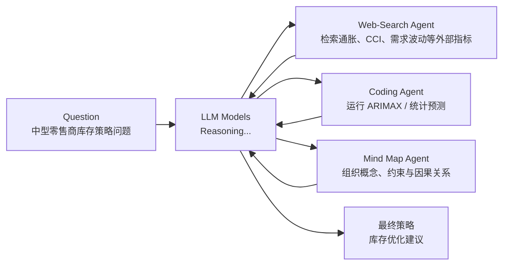

# 【论文精读】Agentic Reasoning: Reasoning LLMs with Tools for the Deep Research

论文链接：https://arxiv.org/abs/2502.04644

> 🎉 作者提出了 **Agentic Reasoning** 框架，用于增强大型语言模型（LLM）的推理能力。与仅依赖模型内部推理的传统方法相比，Agentic Reasoning 借助外部工具代理来完成更复杂的任务，包括：
>
> 1. **Mind Map Agent**
>    - 通过构建结构化的知识图谱来记录和跟踪逻辑关系，从而改进推理过程的连贯性和准确度。
>
> 2. **Web-Search Agent 和 Coding Agent**
>    - 实时检索外部信息、执行代码分析，扩展了模型在信息搜集和计算分析方面的能力。
>
> 实验结果表明：
>
> - 在高难度的科学推理（GPQA）和特定领域的深度研究任务上，Agentic Reasoning 明显优于现有的检索增强生成（RAG）系统以及一些闭源大型语言模型。
> - 该框架能够显著改善专家级知识的综合能力，在测试时具有更好的可扩展性，并且在结构化问题求解方面表现突出。
>
> 更多技术细节和代码可在 GitHub 获取：https://github.com/theworldofagents/Agentic-Reasoning

## 1. Introduction

近年来，**大型推理模型（large reasoning models）**，例如 OpenAI 的 o1、Qwen-QwQ 以及 DeepSeek-R1，通过大规模强化学习在长序列中展现出了令人印象深刻的逐步推理能力。这些进展为复杂推理任务提供了前景，并激发了在更广泛模型上复现 o1 式推理模式的基础性研究。

以 DeepSeek-R1 为例，它在训练过程中完全依赖基于规则的结果回报（rule-based outcome rewards），例如判断数学答案是否正确或某段代码能否成功运行。虽然这种方法取得了非凡的推理能力，在数学和编程领域可与 o1 的表现相媲美，但也存在显著的权衡取舍。正如作者所说，这种训练方式会削弱模型解释其推理过程的能力。DeepSeek-R1 的回答通常逻辑合理且准确，但缺乏关于想法之间转变或论点细节联系的详细说明。

### 提出一个目前存在的问题（Motivation）

虽然当前的推理方法在数学和编程等结构化领域表现优异，因为其结果易于验证，但将这些技术应用到不那么结构化或更具主观性的任务中依然是一个挑战。**如何让模型适应那些答案并不天然确定的领域是一个重要的研究空白。换言之，如何训练模型去处理需要判断、解释或微妙理解，而非简单二元正确性的任务？**

此外，并非所有问题都适合形式化推理（formal reasoning）方法。许多领域（例如社会科学、伦理学或体验式学科）依赖抽象概念、约定俗成的知识、事实核查、对复杂逻辑关系的理解或道德推理。当模型试图将数学或编程式的推理强行应用到这些领域时，往往会产生错误或过于死板的结果。针对这些领域的独特需求进行方法上的改进，对于扩展推理模型在更多场景的适用性至关重要。

### 思考解决的路径（Motivation）

深度而周全地回答开放性问题通常需要广泛的研究、多次验证、信息检索、计算分析以及对复杂逻辑关系的组织，这些步骤是人类推理的基础。在此过程中，人类往往会大量依赖外部工具：

- 通过网络搜索获取信息。
- 使用计算工具进行量化分析。
- 在白板上进行头脑风暴或绘制思维导图（Mind Maps）来组织想法。

这就引出了一个有趣的问题：**大型语言模型能否同样利用外部工具来增强其推理能力，并处理多领域的高强度知识工作？**

先前的一些研究尝试将搜索或检索增强生成（Retrieval-Augmented Generation, RAG）整合到推理过程中，其中一个典型示例是 Gemini 的 Deep Research。然而，这些模型是闭源的，其具体方法并未公开。相比之下，开源模型通常仅在推理过程中侧重于检索或网络搜索，这导致它们与闭源模型相比在性能上仍存在较大差距。

### 本篇解决方案

作者提出了 **Agentic Reasoning 框架**，通过将基于大型语言模型（LLM）的外部代理（agents）作为工具集成到推理过程中，来增强推理能力。该方法使得 LLM 可以执行多步推理，并通过将特定任务委派给辅助代理来更高效地处理复杂问题。

该框架使用了三个代理：

1. **Web-Search Agent**：可以从互联网检索相关信息来扩充模型知识。
2. **Code Agent**：负责执行计算分析与编程任务，以支持定量推理。
3. **Memory Agent / Mind Map**：基于推理上下文构建知识图谱（knowledge graphs），从而以类似人类思维导图的方式组织复杂的逻辑关系。

三者结合显著提升了模型在处理复杂问题时的效率和准确度。

当该框架与当前的推理 LLM 结合时，Agentic Reasoning 通过使模型能够**自主规划并执行多步策略**，彻底改变了模型的解题能力。这些模型可以识别并检索所需数据，动态适应实时信息，并进行定量分析以生成精准结果。该框架还使得 LLM 能够输出类似研究分析报告般的综合性文本，或**提供与博士水平解决方案相当的答案**。

### 刷榜结果

作者在需要复杂推理能力的通用知识密集型基准上评估了模型表现，并将这些基准分为两个主要类别：

1. 解决专家级问题。
2. 对真实世界的专家级任务进行深度研究。

在专家级问题方面，作者在 **GPQA 数据集** 上对模型进行了测试。该数据集是一个博士级科学多项选择题基准，题目由物理、化学和生物领域的专家撰写。**Agentic Reasoning 框架取得了令人瞩目的准确率：化学领域 58%，物理领域 88%，生物领域 79%，与最佳且最新的闭源推理模型 OpenAI o1 的表现相当。**

对于实际的专家级任务，领域专家的评估显示，Agentic Reasoning 可以有效自动化耗时数小时的繁重手动研究工作，突出其在知识密集型领域中简化流程并提升生产力的潜力。

此外，作者还在测试时采用该框架作为验证器来评估模型在推理可扩展性方面的表现。结果显示，Agentic Reasoning 在测试时的计算效率上有显著提升，体现了该框架在优化推理流程方面的能力。这进一步表明，Agentic Reasoning 框架也很有潜力用作强化学习的回报模型（reward model），从而进一步推进推理模型的训练研究。

综上，**Agentic Reasoning 是一个功能强大且通用的框架**，能够深度应对并精准解决复杂的领域挑战。它在深入研究、处理复杂逻辑结构以及有效整合信息方面展现的能力，充分说明了其在解决知识密集型问题以及推动深度分析探索方面的潜力。

## 2. Method

### 示例问题与整体结构

示例 question：

> 在当前高通胀、消费者信心指数下行以及需求存在不确定性的背景下，作为一家中型零售商，应该如何制定下一季度的库存策略，以平衡库存成本和顾客服务水平？



1. **左侧：Mind Map**
   - 图中绘制了一个知识图或思维导图，其中包含与问题相关的核心概念及其关联关系。
   - 主题包括高通胀（High Inflation）、消费者信心（Consumer Confidence）、需求波动（Demand Volatility）、库存策略（Inventory Strategy）等关键节点，并用连线说明这些节点之间可能存在的影响或因果关系。
   - Mind Map 作为一种结构化记忆或知识库，在整个推理过程中为模型提供上下文和先前思考过的推理线索，方便后续调用或查询。

2. **中间：LLM Models 的推理过程**
   - 图中以对话或文字形式示例了一个大型语言模型在处理问题时的思路。
   - 最开始，模型识别到需要外部经济指标，于是插入 `[Web-Search]` 标记，表示要调用搜索代理获取最新通胀率、消费者信心指数等信息。
   - 收到搜索结果后，模型继续思考：想要进一步分析在通胀环境和消费者信心变化下的销售数据，就再次调用搜索代理检索相关历史销售数据及经济指标。
   - 在收集完相关信息后，LLM 认为可以用统计或机器学习模型（ARIMAX）来预测销售和库存需求，于是在推理中插入 `[Code]` 标记，请求 Coding Agent 编写并执行预测模型代码。
   - 最后，模型将一切信息整合，对应到 Mind Map 中的各要点，从而提出下一季度库存优化策略的完整思路。

3. **右侧：外部工具（Tools）**
   - 图中列出两个主要工具：搜索（Search）和代码（Code）。
   - 当 LLM 生成带有 `[Web-Search]` 标签的查询时，系统会把查询发送到搜索引擎以获取外部信息。
   - 当 LLM 生成带有 `[Code]` 标签的请求时，系统会请求交给编程代理执行代码逻辑，例如运行 ARIMAX 模型进行预测，并将结果返回给主模型。

### Agentic Reasoning Pipeline

下面是一个多步推理、外部工具调用、Mind Map 整合的完整示例。整个流程大致分为以下七个阶段：

#### 1. 接收问题与初始化上下文

1. **接收问题（user query）**：系统先从用户处接收一个复杂问题。
2. **组合初始上下文**：系统会将用户问题与任务指令（task instruction）相结合，形成初步上下文信息。
3. **Mind Map 初始化**：如果系统中已经有一些结构化历史知识，则会加载进 Mind Map 中，方便后续检索。

#### 2. 模型开始推理

1. **生成推理链（reasoning tokens）**：主模型根据输入上下文开始一步步用自然语言或内部 token 进行推理。
2. **判断是否需要外部信息**：如果模型发现自己缺乏关键数据，就会决定调用外部工具。
3. **插入特定标记**：一旦识别到需要搜索、编程或 Mind Map，模型就在推理文本中插入 `[Web-Search]`、`[Code]` 或 `[Mind-Map]` 等特殊 token，并附带明确的查询或需求。

#### 3. 外部工具调用与交互

1. **Web-Search Agent**
   - 当模型插入 `[Web-Search]` 标记时，系统会把该标记及其关联查询发送给搜索代理。
   - 搜索代理会检索若干网页或数据，之后调用 LLM 或算法模块对搜索结果进行压缩，提取关键内容，只返回和当前推理紧密相关的摘要给主模型。

2. **Coding Agent**
   - 当模型插入 `[Code]` 标记时，系统会把代码任务和上下文发送给编程代理。
   - 编程代理根据说明写出脚本，运行后将结果以自然语言或简要数值形式返回给主模型。

3. **Mind Map Agent**
   - 当模型插入 `[Mind-Map]` 标记时，会将对应问题发送给 Mind Map 代理。
   - Mind Map 代理本质上是一个基于知识图（GraphRAG）的检索模块，能够从已有结构化记忆中找出相关概念和关系，并把结果总结后返回给主模型。

#### 4. 将外部信息整合回推理链

1. **接收外部结果**：无论是搜索摘要、代码执行结果，还是 Mind Map 中的检索信息，最终都以一段“文本回复”返回主模型。
2. **继续推理**：主模型将这些外部回复视为新的上下文，继续生成后续推理 token。
3. **更新 Mind Map**：若推理中出现新的重要概念或关系，可以再由图构建 LLM 把它们添加到知识图中，以便后续查询或回顾。

#### 5. 多轮迭代

1. **动态迭代**：只要主模型认为还需要更多外部辅助，就可以多次插入 `[Web-Search]` 或 `[Code]` 等标记。
2. **检验前后逻辑**：推理后期如果发现某些假设或数据可疑，模型可以再次调用搜索或编程进行验证。
3. **多个工具之间自由切换**：整个过程不是严格线性的，可以先搜索数据，再做代码预测，再搜索更多信息，然后把新信息整合回 Mind Map。

#### 6. 生成最终答案

1. **完成推理链**：在获得足够信息、反复思考后，主模型结束推理链，进入答案生成阶段。
2. **提炼输出**：将推理中形成的结论、外部工具提供的关键数字或证据总结为最终答案。
3. **输出答案**：系统返回结构化、条理清晰的文本段落，可能包含事实依据、计算结果以及 Mind Map 全局脉络。

#### 7. 后续应用与复用

1. **结果可复用**：主模型产生的推理链和更新后的 Mind Map 在系统内部持续保存，可供后续相似问题直接检索，减少重复查询。
2. **验证与改进**：如果用户对答案不满意，可以追问或提出新需求，系统会在已有 Mind Map 与外部工具基础上再次推理改进。

小结：

- **核心思想**：让一个“主推理 LLM”在需要时自主决定调用外部搜索、编程执行、结构化记忆检索等工具，并把返回的信息无缝纳入推理链。
- **优势**：
  - 允许主模型开展更长、更深入的推理，而不会受限于 token 数或对特定技能的掌握。
  - 增强推理的可追溯性和可靠性：外部工具可提供实时数据或专门的算法模型。
  - Mind Map 能持续存储和梳理推理过程中的知识点，减少“忘记”或自相矛盾。

### 2.1 初步说明（Preliminary）

作者考虑一个需要多步复杂推理的专家级任务。在模型推理过程中，它可以**调用外部工具并使用其先前推理的结构化记忆**。目标是：**针对每个查询 \(q\)，生成一个逻辑推理链 \(r\) 和一个最终答案 \(a\)**。

为实现这个目标，推理模型会在动态推理过程中与外部工具 \(e\)（通常是网络搜索和 Python 编程）以及结构化知识 \(k\)（有组织的记忆）进行交互。

形式化地，问题求解过程的四个主要输入定义为：

- 任务指令 \(o\)（prompt）：定义总体任务目标。
- 查询 \(q\)：一个需要多步推理的复杂问题。
- 外部工具输出 \(e\)：推理过程中动态获取的内容，例如网络搜索或编程执行结果。
- 推理记忆 \(k\)：存储在有组织记忆结构（通常是知识图）中的内容。

目标是将 \(o, q, e, k\) 整合起来，生成连贯推理链 \(r\) 和最终答案 \(a\)。这一过程可表示为映射：

\[
(o, q, e, k) \mapsto (r, a)
\]

或在动态展开时表示为：

\[
(o, q, e, k) \mapsto (r, a), (o, q, e, k) \mapsto (r, a)
\]

联合概率可写为：

\[
P(r, a \mid o, q, e, k)
= \prod_{t=1}^{T_r} P(r_t \mid r_{<t}, o, q, e_{\le t}, k_{\le t})
\times \prod_{t=1}^{T_a} P(a_t \mid a_{<t}, r, o, q, e, k)
\]

其中 \(T_r\) 和 \(T_a\) 分别表示推理链 \(r\) 和最终答案 \(a\) 的长度（以 token 计）。\(r_t\) 表示推理序列在位置 \(t\) 的 token，\(r_{<t}\) 表示之前的所有推理 token；\(e_{\le t}\) 和 \(k_{\le t}\) 分别表示在第 \(t\) 步之前从外部工具和知识图中检索到的所有内容。同理，\(a_t\) 表示答案在位置 \(t\) 的 token，\(a_{<t}\) 表示之前的答案 token。

### 2.2 Agentic Reasoning Pipeline

核心思想是在模型推理过程中引入外部基于 LLM 的代理（agents），以增强推理能力。该框架允许推理 LLM 模型以“代理式”（agentic）的方式与外部信息进行交互。在推理的过程中，模型可以调用外部工具来帮助完成问题，也可以使用结构化记忆（Mind Map）来存储推理上下文。

只要模型在推理中识别到需要额外信息，就会在推理 token 中插入专门的标记，例如“web-search token”“coding token”以及“mind-map 调用 token”。同时，模型会根据当前推理上下文生成精确查询，与这些外部代理交互。

一旦检测到调用标记，推理过程会暂时停止，提取查询及推理上下文，然后发送给外部代理。外部代理生成相关内容后，会结合收到的查询消息和推理上下文，以确保返回内容最具相关性。之后，返回结果会被重新整合进推理链，模型可以继续推理，并在新的、更丰富的知识基础上进一步推断。

这种检索与推理的迭代会在需要时持续进行，让模型可以在整个流程中动态完善其结论，直到得到完整推理并给出最终答案。

### 2.3 Mind Map Agent

作者构建了一个称为 Mind Map 的结构化记忆，用来存储和组织推理模型的实时推理上下文。具体来说，系统将原始推理链转化为结构化知识图，然后用一个图构建 LLM（与 GraphRAG 方法类似）来识别和抽取推理链中的实体，并识别它们之间的语义关联。

该 Mind Map 主要有两个功能：

1. **对推理上下文进行聚类并归纳**：对知识图应用社区聚类算法，再用 LLM 为每个聚类生成简要总结，从而得到紧凑的主题概要。
2. **提供基于知识图的检索**：可以在知识图中进行特定问题查询，例如“Jason 的外祖父是谁？”。通过知识图上的常规 RAG，可以检索到相关信息并返回给用户或推理模块。

这些功能让 Mind Map 能在不同阶段融入 Agentic Reasoning 流程：

- 为外部工具提供上下文信息，使搜索结果、代码生成更加上下文相关。
- 当推理模型对自己的推断没有把握，或在长推理中丢失上下文时，可以将查询发往 Mind Map，把检索到的内容作为外部工具结果继续推理。

### 2.4 Web-search Agent

当需要检索信息时，系统会调用搜索代理（search agent）从网络中查找最相关的文档。为了保持推理的连贯性和相关性，搜索代理不会直接将原始搜索到的网页大段嵌入到推理链中，而是先对其进行临时保留和后处理。

具体来说，检索到相关网页后，系统会让一个 LLM 对这些网页进行提取与压缩，**生成简明摘要且与当前推理最相关的摘要**。这个摘要的格式和长度会根据当前推理任务自动调整：

- 对于“2024 年美国人口是多少？”这种较直接的查询，结果可能简单到只包含一个数字。
- 如果需要探讨某个主题的新视角，摘要可能更加细致。
- 对于假设验证任务，需要报告网页内容对某一假设的支持或反驳程度。

最终，这段与上下文紧密结合的压缩信息会在合适时机被并入主要推理链中，以提升推理准确性和连贯性。

### 2.5 Coding Agent

与其在推理模型中直接输出代码，作者发现将编程相关操作委托给专门的 Coding LLM 更有效。推理模型会将上下文和查询消息一并发送给 Coding LLM，由其编写相应代码、执行编译或运行，并返回结果，从而减少因 token 数过多而打断推理的情况。

具体实现上，编程请求会被格式化为类似说明：

> 请根据推理模型传来的上下文（）和问题（）写出并执行以下代码（）。

该 Coding LLM 被指示始终以自然语言返回输出，从而可以无缝地融合到推理模型的后续步骤中。

### 2.6 主要发现（Main Findings）

1. **Less is More**
   - 与一些通用 agentic 框架给模型提供大量外部工具不同，作者发现只提供两个工具（网络搜索和编程）就足以覆盖大部分任务，即便是那些需要专家级能力的复杂任务。
   - 增加更多工具可能会增加模型误使用工具的风险，也容易导致外部工具输出不准确，从而降低整体质量。

2. **将任务分配给基于 LLM 的代理**
   - 将计算工作分配给多个基于 LLM 的代理能提高效率。
   - 与让主推理模型自己写代码或直接调用非 LLM 工具相比，作者找到了 LLM 代理来做对应子任务的好处：
     - **减少主推理中的中断**：主模型可以保持更长、更连贯的推理，不被各种辅助任务打断或占用过多 token。
     - **利用不同 LLM 的特长**：不同 LLM 在不同任务上的表现更佳，例如 DeepSeek-R1 专注于逻辑推理，而 Claude-Sonnet 在编程上更擅长。

3. **Agentic Test-time Scaling**
   - 对同一个问题来说，如果推理链使用了更多工具调用，往往可以得到更好的答案；但若问题本身过于频繁、密集地调用工具，也可能说明初始推理存在虚义或不准确。
   - 可以通过挑选工具使用频率最高的推理链作为 best-of-N 的选择，或通过 beam search，让模型在需要多个步骤验证正确性时提升结果的准确率和鲁棒性。

### 医疗示例：COPD 合并心力衰竭

问题：

> 一名 68 岁男性，患有 12 年中重度 COPD（FEV1 = 45% 预测值，PaO2 = 58 mmHg，PaCO2 = 48 mmHg），新近诊断出心力衰竭（左心室射血分数 LVEF = 35%），现出现呼吸困难加重及运动耐力下降。如何在不加重心脏症状的同时改善肺功能？

主要病情要点：

- COPD 中重度，表现为呼吸功能下降（PaO2 偏低、PaCO2 较高）。
- 新增心力衰竭（LVEF = 35%）。
- 临床症状：呼吸困难加重、运动耐力下降。

核心需求：改善肺部氧合或通气功能，同时避免过度增加心脏负担。

#### Code 部分

> Target an Alveolar PAO2 of ~140 mmHg, calculate expected alveolar oxygen pressure...

这里使用了肺泡气体方程（Alveolar Gas Equation）来估算肺泡氧分压：

\[
PAO_2 = FiO_2 \times (P_{atm} - PH_2O) - \frac{PaCO_2}{R}
\]

将期望肺泡氧分压（PAO2）设为约 140 mmHg，即使考虑肺泡-动脉氧梯度（A-a gradient）损失后，动脉 PaO2 也可维持在约 65 mmHg 左右，从而改善低氧血症。

临床上，COPD 患者通常不追求过高 SpO2，以免抑制呼吸驱动或导致严重高碳酸血症。通常目标 SpO2 为 88-92% 之间，因此额外氧浓度多在 24-28% 区间调整。

#### Web-search 部分

> Optimal PEEP levels in COPD with heart failure... Low-to-moderate PEEP (5-10 cm H2O) is recommended to improve oxygenation without significantly reducing venous return in HF.

- 使用搜索代理查找“心衰合并 COPD 时可接受的 PEEP 水平”。
- 结果显示：低到中等水平的 PEEP（约 5-10 cmH2O）可提高氧合，但不会明显增加右心回流受阻。
- 对应做法：既要给够一定的呼吸支持（改善肺泡萎陷、提升氧合），也要避免过大 PEEP 造成心血管负担。

#### 综合结论与建议

> Administer ~28% FiO2, consider mild PEEP/CPAP of 4-5 cm H2O, increase alveolar ventilation modestly, and titrate diuretics to manage fluid overload...

1. **氧疗策略**：约 28% 的吸氧浓度，逐步调整，使血氧饱和度保持在 88-92% 范围。
2. **PEEP/CPAP**：轻中度，约 4-5 cmH2O 或 5-10 cmH2O 都是文献中可接受范围。
3. **通气调节**：适度增加肺泡通气量，防止二氧化碳潴留过高，但不能过度。
4. **心衰管理**：适当调整利尿剂剂量，控制过多的体液潴留，同时避免前负荷减得太低。

这是一个典型的综合性医疗决策示例：

- 在呼吸学上，需要改善 COPD 患者的通气/氧合。
- 在心血管上，需要避免过度增加心脏负担。
- 借助外部文献或数据库（`[Web-search]`）以及公式计算（`[Code]`）工具支持，最终给出相对平衡的处置方案。

> 注意：这是学术性示例，强调“多步推理”和“工具调用”的逻辑流程，并非直接用于临床诊断。

## 3. Experiments

### 3.1 解决高难度问题（Solving Hard Problems）

**数据集：GPQA**

- GPQA 是一个博/硕士级别的多选科学问答数据集，题目由专家编写，涵盖物理、化学和生物等领域。
- 核心实验集中在高质量的 **Diamond Set**（198 道题），同时也在 **Extended Set**（546 道题）上进行更大范围对比，可以与人类专家表现直接比较。

#### Table 1: Performance comparison on GPQA dataset across Physics, Chemistry, and Biology

| Method | Phy. | Chem. | Bio. |
|---|---:|---:|---:|
| **Direct Reasoning** |  |  |  |
| Qwen2.5-32B | 57.0 | 33.3 | 52.6 |
| Qwen2.5-Coder-32B | 37.2 | 25.8 | 57.9 |
| QwQ-32B | 75.6 | 39.8 | 68.4 |
| Qwen2.5-72B | 57.0 | 37.6 | 68.4 |
| Llama3.3-70B | 54.7 | 31.2 | 52.6 |
| GPT-4o | 59.5 | 40.2 | 61.6 |
| o1-preview | 89.4 | 59.9 | 65.9 |
| **Retrieve/Search in Reasoning** |  |  |  |
| RAG-Qwen2.5-32B | 57.0 | 37.6 | 52.6 |
| RAG-QwQ-32B | 76.7 | 38.7 | 73.7 |
| RAgent-Qwen2.5-32B | 58.1 | 33.3 | 63.2 |
| RAgent-QwQ-32B | 76.7 | 46.2 | 68.4 |
| Search-o1 | 77.9 | 47.3 | 78.9 |
| **Agentic Reasoning (Ours)** | **88.1** | **58.3** | **79.6** |

#### Table 2: Performance comparison with human experts on the GPQA extended set

| Method | Phy. | Chem. | Bio. |
|---|---:|---:|---:|
| **Human Experts** |  |  |  |
| Physicists | 57.9 | 31.6 | 42.0 |
| Chemists | 34.5 | 72.6 | 45.6 |
| Biologists | 30.4 | 28.8 | 68.9 |
| **Reasoning Models** |  |  |  |
| QwQ-32B | 61.7 | 36.9 | 61.0 |
| RAG-QwQ-32B | 64.3 | 38.3 | 66.7 |
| Search-o1 | 68.7 | 40.7 | 69.5 |
| Agentic Reasoning | 75.2 | 53.1 | 72.8 |

主要结果：

- 表 1 给出了在 GPQA 数据集上的表现，表 2 展示了与人类专家在 Extended Set 上的对比。
- 某些大型推理模型在结合链式思考后，能够显著胜过传统指令微调模型。
- 在允许检索/搜索辅助的情况下，RAgent-QwQ-32B、Search-o1 等模型因为会在推理中自动调用外部信息，准确率高于不使用搜索或检索的模型。
- **Agentic Reasoning** 在整合外部搜索与编程代理后优于单纯结合搜索的模型，在 GPQA 数据集上达到更高准确率，表明工具辅助推理能够发挥显著作用。
- 与人类专家对比时，模型在所有学科上都超过了人类专家，展示了在专门学科推理任务上达到或超过专家水平的潜力。

### 3.2 深度研究（Deep Research）

实验设计：

- 研究者让来自金融、医学和法律领域的博士级专家各自撰写 15-30 个专业研究问题（open-ended Q&A），这些问题都需要至少 20 分钟的深入检索或资料查询才能全面回答。
- 让 Agentic Reasoning 模型对这些问题生成完整研究报告，并由相应领域专家评估答案准确度和可靠性（pass rate）。

对比系统：

- 与 Gemini Deep Research 系统进行对比。
- 实验统计两种系统在金融、医学、法律三个领域上能被专家认可的答案比例。

结果：

- Agentic Reasoning 在所有三个领域都高于 Gemini Deep Research 的通过率。
- 说明结构化推理与工具增强框架能显著提高开放式深度研究任务的表现。

### 3.3 分析（Analysis）

#### 3.3.1 测试时多次调用工具（Test-time Scaling）

**同一道题，多次工具调用的影响**

- 在深度研究场景中，如果对同一问题多次推理，每一次都可能产生不同的工具调用次数。研究发现：对同一道题而言，**使用更多外部工具（搜索、编程等）往往能提高最终答案的准确率**。
- 因为更多检索或计算能让模型获得更充分的证据和推理深度。

**不同题目之间的对比**

- 如果某个问题本身非常模糊或难度极高，模型会倾向于大量调用工具，但最终正确率不一定高。
- 也就是说，“同一道题，工具调用次数越多，答案可能越好”；但“跨题比较时，工具调用次数多，可能是题目过难”。

应用：

- 可以在推理中多次运行同一个问题，然后根据“工具调用次数”挑选最佳回答，例如 best-of-N。
- 工具使用频率也可作为隐式奖励信号，用于后续在知识密集型领域中强化学习式地优化模型推理能力。

#### 3.3.2 Mind Map 的作用（The Role of Mind Map）

Mind Map 优势：

- 在推理过程中，使用 Mind Map（结构化知识图）可以帮助模型理清复杂逻辑关系，显著减少被误导性问题或逻辑陷阱欺骗的概率。
- 常见场景包括：
  - 解答容易误导的逻辑题：例如“某著名外科医生与男孩”的变体谜题。引入 Mind Map 的 Agentic Reasoning 可以在知识图中显式表示“外科医生-母亲-孩子”等概念间关系，从而得出正确结论。
  - 策略性推理：以桌游“狼人杀”为例，Mind Map 可以记录多轮对话中的身份、表态、投票模式等关联，实现更精细的策略与欺骗判断。

总结：

- Mind Map 不仅适用于传统逻辑谜题，还可在动态推理场景中帮助模型跟踪局内多角色的关系与行为，从而有更出色的策略与辨别能力。

## 4. 调用逻辑详解

下面给出代码中各函数返回的提示词（prompt）文本的中文解释，并对每个函数的适用场景和调用逻辑进行简要说明。翻译部分在保证原意的情况下使用自然中文表达，供参考与使用。

### 4.1 `get_hard_question_instruction(MAX_SEARCH_LIMIT)`

英文：

```text
You are a reasoning assistant with the ability to perform web searches and execute code to help you answer the user's question accurately. You have special tools:
To perform a search: write <begin_search_query> your query here <end_search_query>.
Then, the system will search and analyze relevant web pages, then provide you with helpful information in the format <begin_search_result> ...search results... <end_search_result>.
Make sure each search query is clear and concise.
To perform calculations or data processing, you can propose a code task using:
<begin_code_query> your code query here <end_code_query>.
The system will write the code and execute the code then return the results in the format <begin_code_result> ...execution results... <end_code_result>.
Make sure each code query is self-contained and does not require any external information.
To access your reasoning memory, you can query the automatically generated mind map of your previous thoughts using:
<begin_mind_map_query> your query here <end_mind_map_query>.
The system will then analyze your previous reasoning and answer your query in the following format:
<begin_mind_map_result> ...answer results... <end_mind_map_result>.
You can repeat calling the tools multiple times if necessary. The maximum number of search attempts is limited to {MAX_SEARCH_LIMIT}. The code attempts are unlimited.
Once you have all the information you need, continue your reasoning.
```

中文：

你是一个拥有执行网络搜索和运行代码能力的推理助手，可以帮助你更准确地回答用户的问题。你拥有以下专用工具：

- **执行搜索**：写 `<begin_search_query>` 查询内容 `<end_search_query>`，系统会搜索并分析相关网页，然后以 `<begin_search_result>` 搜索结果 `<end_search_result>` 返回有用信息。
- **执行计算或数据处理**：写 `<begin_code_query>` 代码请求 `<end_code_query>`，系统会编写并执行代码，然后以 `<begin_code_result>` 执行结果 `<end_code_result>` 返回。
- **访问推理记忆**：写 `<begin_mind_map_query>` 查询内容 `<end_mind_map_query>`，系统会分析你之前的推理内容，并以 `<begin_mind_map_result>` 查询结果 `<end_mind_map_result>` 返回。

你可以在必要时多次调用这些工具，但搜索次数上限是 `{MAX_SEARCH_LIMIT}` 次，代码执行次数不限制。一旦获得足够信息，就继续推理。

调用逻辑说明：

- 当需要同时执行网络搜索、调用代码执行以及调用心智图（推理记忆）的复杂场景提示时，可以使用该函数生成指令文本。
- `MAX_SEARCH_LIMIT` 参数用来设置搜索次数上限。

### 4.2 `get_math_search_o1_instruction(MAX_SEARCH_LIMIT)`

英文：

```text
You are a reasoning assistant with the ability to perform web searches to help you answer the user's question accurately. You have special tools:
To perform a search: write <begin_search_query> your query here <end_search_query>.
Then, the system will search and analyze relevant web pages, then provide you with helpful information in the format <begin_search_result> ...search results... <end_search_result>.
You can repeat the search process multiple times if necessary. The maximum number of search attempts is limited to {MAX_SEARCH_LIMIT}.
Once you have all the information you need, continue your reasoning.
```

中文：

你是一个能够执行网络搜索的推理助手，可帮助你准确回答用户的数学问题。你具备以下专用工具：

- **执行搜索**：写 `<begin_search_query>` 查询内容 `<end_search_query>`，系统会进行搜索并提供相关页面的分析结果，格式为 `<begin_search_result>` 搜索结果 `<end_search_result>`。

你可以根据需要多次重复搜索操作，搜索次数最大限制为 `{MAX_SEARCH_LIMIT}` 次。当你获取到所有所需信息后，请继续推理。

调用逻辑说明：

- 当只需要网络搜索来回答数学类型问题时，可以使用该函数。
- `MAX_SEARCH_LIMIT` 用于指定最大搜索次数。

### 4.3 `get_code_search_o1_instruction(MAX_SEARCH_LIMIT)`

英文：

```text
You are a reasoning assistant with the ability to perform web searches to help you answer the user's question accurately. You have special tools:
To perform a search: write <begin_search_query> your query here <end_search_query>.
Then, the system will search and analyze relevant web pages, then provide you with helpful information in the format <begin_search_result> ...search results... <end_search_result>.
You can repeat the search process multiple times if necessary. The maximum number of search attempts is limited to {MAX_SEARCH_LIMIT}.
Once you have all the information you need, continue your reasoning.
```

中文：

你是一个能够执行网络搜索的推理助手，可帮助你准确回答用户的编程或算法问题。你具备以下专用工具：

- **执行搜索**：写 `<begin_search_query>` 查询内容 `<end_search_query>`，系统会进行搜索并提供相关页面的分析结果。

调用逻辑说明：

- 当需要在算法、编程、计算机科学方向的问题上进行仅搜索的逻辑时，可以使用该函数。
- `MAX_SEARCH_LIMIT` 用于指定搜索次数上限。

### 4.4 `get_webpage_to_reasonchain_instruction(prev_reasoning, search_query, document)`

中文：

任务说明：

你需要根据以下输入信息来阅读并分析网页内容：

- 之前的推理步骤（Previous Reasoning Steps）
- 当前的搜索查询（Current Search Query）
- 搜索到的网页内容（Searched Web Pages）

目标是从搜索到的网页中提取对当前搜索查询有帮助的信息，并将这些信息无缝融入先前的推理过程，帮助解决最初的问题。

请注意：

1. **分析搜索到的网页**
   - 仔细阅读每个搜索结果网页的内容。
   - 找出与当前搜索查询直接相关，并能对解决原始问题提供帮助的事实性内容。
2. **提取有效信息**
   - 只提取对“之前的推理步骤”有直接贡献的内容。
   - 确保信息准确、相关。
3. **输出格式**
   - 如果网页提供了对当前查询有帮助的信息，则以 `**Final Information**` 开头来呈现，后接有帮助的信息。
   - 如果网页没有提供任何有用信息，则输出：

```text
**Final Information**

No helpful information found.
```

调用逻辑说明：

- 当多步搜索和推理过程中需要整合“已经搜索到的网页内容”与“先前推理内容”时，可使用该函数，让模型进一步提取与搜索查询相关的核心信息。

### 4.5 `get_singleqa_search_o1_instruction(MAX_SEARCH_LIMIT)`

中文：

你是一个拥有网络搜索能力的推理助手，可帮助你准确回答用户的单一问题。你拥有以下专用工具：

- **执行搜索**：写 `<begin_search_query>` 查询内容 `<end_search_query>`，系统会执行搜索并返回 `<begin_search_result>` 搜索结果 `<end_search_result>` 格式的信息。

你可以多次重复这一过程。搜索次数最大限制为 `{MAX_SEARCH_LIMIT}`。一旦获取了足够信息，请继续推理。

示例：

```text
<begin_search_query>first Nobel Prize in Physics winner<end_search_query>
```

调用逻辑说明：

- 用于单一问题的场景，主要通过搜索获取答案。
- `MAX_SEARCH_LIMIT` 表示允许搜索的次数。

### 4.6 `get_multiqa_search_o1_instruction(MAX_SEARCH_LIMIT)`

中文：

你是一个拥有网络搜索能力的推理助手，能够帮助你准确回答用户的复杂型问题（需要多次搜索）。你拥有以下专用工具：

- **执行搜索**：写 `<begin_search_query>` 查询内容 `<end_search_query>`，系统会执行搜索并返回 `<begin_search_result>` 搜索结果 `<end_search_result>` 格式的信息。

你可以多次重复这一过程。搜索次数最大限制为 `{MAX_SEARCH_LIMIT}`。一旦获取了足够信息，请继续推理。

示例：

```text
<begin_search_query>Alice David Lara Croft voice<end_search_query>
```

如果系统返回搜索结果后仍需进一步查询开发公司，可以继续：

```text
<begin_search_query>video game developed by Alice David Lara Croft<end_search_query>
```

调用逻辑说明：

- 用于多重搜索以回答多步问题的场景。
- `MAX_SEARCH_LIMIT` 用于限制最大搜索次数。

### 4.7 `get_singleqa_rag_agent_instruction(MAX_SEARCH_LIMIT, MAX_URL_FETCH)`

中文：

你是一个可以进行网络搜索并获取网页全文内容的推理助手，能够帮助你更精准地回答用户的问题。你拥有以下专用工具：

- **执行搜索**：写 `<begin_search_query>` 搜索内容 `<end_search_query>`，系统会调用搜索 API，并以 `<begin_search_result>` 搜索结果 `<end_search_result>` 形式返回。返回内容包含标题、URL 和摘要片段，而不是全文。
- **获取网页全文**：在得到搜索结果后，如果需要查看某些具体 URL 的全部信息，可以写 `<begin_url>` url1, url2, ... `<end_url>`，系统会将对应网页的完整内容以 `<begin_full_page>` 全文内容 `<end_full_page>` 返回。

你可以多次进行搜索，最多 `{MAX_SEARCH_LIMIT}` 次，并且可以最多获取 `{MAX_URL_FETCH}` 个链接的完整内容。一旦获取到所需信息，就可以继续推理。

调用逻辑说明：

- 适用于单一问题，但可能需要获取网页全文才能准确回答。
- `MAX_SEARCH_LIMIT` 为最大搜索次数，`MAX_URL_FETCH` 为能获取全文链接的最大数量。

### 4.8 `get_multiqa_rag_agent_instruction(MAX_SEARCH_LIMIT, MAX_URL_FETCH)`

该逻辑与 `get_singleqa_rag_agent_instruction` 类似，只是针对多步、多阶段的复杂问题。区别在于：在一个对话或推理中可能会发起多次搜索，并针对多个链接获取全文。

### 4.9 `get_gpqa_rag_agent_instruction(MAX_SEARCH_LIMIT, MAX_URL_FETCH)`

这是面向科研或科普性问题（例如“pp III neutrinos 的能量范围”）的多步搜索和全文获取场景。提示内容与 `get_singleqa_rag_agent_instruction` 类似，但示例不同。本质调用逻辑相同：使用 `<begin_search_query>` 搜索，用 `<begin_url>` 获取全文，然后结合结果推理。

### 4.10 `get_math_rag_agent_instruction(MAX_SEARCH_LIMIT, MAX_URL_FETCH)`

适用于数学问题的分步搜索与网页全文获取场景。内部提示文本与前面 RAG 类函数类似，只是示例换成了数学相关问题，例如“如何计算 \(e^{x^2}\) 的积分”。调用逻辑相同。

### 4.11 `get_code_rag_agent_instruction(MAX_SEARCH_LIMIT, MAX_URL_FETCH)`

适用于编程相关问题，需要搜索并可能获取某些网页的完整代码示例或文档。提示文本与前面 RAG 类函数相同，示例不同，例如“如何在 Python 中实现二分查找”。调用逻辑也相同：先搜索，若需要查看某 URL 的全文即可调用 `<begin_url>`。

### 4.12 `get_naive_rag_instruction(question, documents)`

英文原文示例：

```text
You are a knowledgeable assistant that uses the provided documents to answer the user's question.
Question:
{question}
Documents:
{documents}
```

中文翻译：

你是一个博学的助手，可以利用提供给你的文档来回答用户的问题。

问题：

```text
{question}
```

文档：

```text
{documents}
```

调用逻辑说明：

- 这是最简单的文档问答场景，没有搜索或代码执行。
- 只需要将用户的 `question` 和给定的 `documents` 合并成一个提示，让模型基于给定文档回答问题。

### 4.13 `get_task_instruction_openqa(question, model_name=None)`

英文原文（节选）：

```text
Please answer the following question. You should think step by step to solve it.
Provide your final answer in the format \boxed{YOUR_ANSWER}.
Question:
{question}
```

中文翻译：

请回答下列问题。你需要分步骤进行思考来解决它。最后用 `\boxed{你的答案}` 的形式给出结果。

调用逻辑说明：

- 开放性问答场景，要求最终答案使用 `\boxed{}` 包裹。
- 如果 `model_name == 'qwq'`，提示可能省略一些 “step by step” 或方法暗示，但核心仍是提示回答并用 `\boxed{}` 包裹答案。

### 4.14 `get_task_instruction_math(question, model_name=None)`

逻辑与上面类似，只是内容上说明这是一个数学问题，仍然要求用 `\boxed{}` 包裹答案。

### 4.15 `get_task_instruction_multi_choice(question, model_name=None)`

英文原文节选：

```text
Please answer the following multiple-choice question. You should think step by step to solve it.
Provide your final choice in the format \boxed{YOUR_CHOICE}.
...
```

中文翻译：

请回答以下多项选择题。你需要分步骤进行思考来解决它。最后用 `\boxed{你的选项}` 的形式给出答案。例如，如果选项是 A、B、C、D，则输出 `\boxed{A}`。

调用逻辑说明：

- 用于多项选择题场景。
- `model_name` 可能影响提示细节，如果是 `llama`，提示会更严格：只能输出 `\boxed{A}` 这样的格式，不要包含任何多余内容。

### 4.16 `get_task_instruction_code(question, question_title=None, model_name=None)`

英文原文节选：

```text
Generate a correct Python program that passes all tests for the given problem.
You should provide your final code within a Python code block using triple backticks.
Problem Title: {question_title}
Problem Statement:
{question}
```

中文翻译：

为给定的编程题生成一个正确的 Python 程序，通过所有测试。你应当将最终代码放在三引号 `python ...` 的代码块中。

问题标题：

```text
{question_title}
```

问题描述：

```text
{question}
```

调用逻辑说明：

- 适用于需要输出完整 Python 解法的情况。
- 如果 `model_name == 'qwq'`，提示内容会稍有不同，但本质都是写出 Python 代码并用 `python\n...\n` 包裹。

### 总体调用逻辑

1. **根据场景选择合适的指令生成函数**
   - 如果需要搜索 + 代码 + 心智图的高级用法：`get_hard_question_instruction`。
   - 如果需要只做搜索：`get_math_search_o1_instruction`、`get_code_search_o1_instruction`、`get_singleqa_search_o1_instruction`、`get_multiqa_search_o1_instruction` 等。
   - 如果需要搜索并获取网页全文：`get_*_rag_agent_instruction` 系列函数，例如 `get_singleqa_rag_agent_instruction`。
   - 如果不需要搜索，只有现成文档：`get_naive_rag_instruction`。
   - 如果是解题任务：`get_task_instruction_openqa`、`get_task_instruction_math`、`get_task_instruction_multi_choice`、`get_task_instruction_code`。

2. **传入必要参数**，例如 `MAX_SEARCH_LIMIT`、`MAX_URL_FETCH`、`question` 等，生成最终的提示词文本。

3. **将生成的提示词文本提供给大语言模型**，或在多轮对话中引导模型按指定格式进行搜索、代码执行或解题。

通过这种方式，可以灵活组合并实现各种复杂的“搜索-推理-解题”需求。

## 总体结论

1. **Agentic Reasoning** 在 GPQA 科学问答数据集上取得了优异表现，与人类专家相比也更具竞争力。
2. 在金融、医学、法律等博士级深度研究问题上，本框架比对照系统（Gemini Deep Research）更能给出准确、扎实的回答。
3. **工具调用（搜索、编程）和 Mind Map 的引入** 是提升推理深度与正确率的重要因素；当问题越难或越需要外部信息时，多次调用工具能带来更增益。
4. Mind Map 在处理复杂逻辑关系或多角色交互任务上表现出显著优势，既能减少常见推理陷阱，也能在动态场景中提高判断与策略能力。

这表明 Agentic Reasoning 框架在知识密集型、推理难度高的任务中具有可观的实际价值与扩展潜力。
