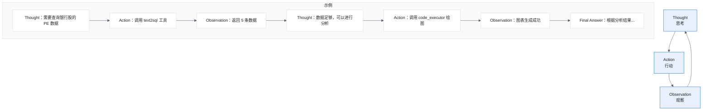
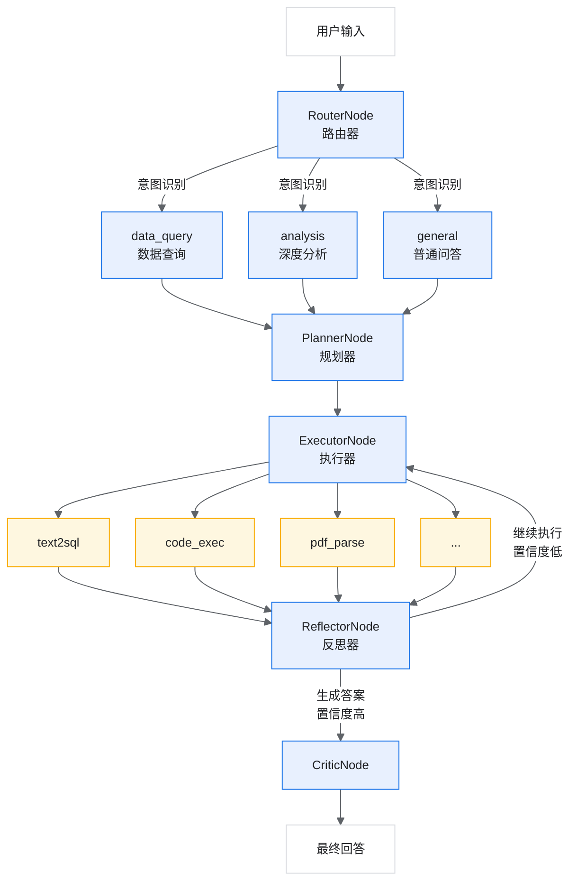
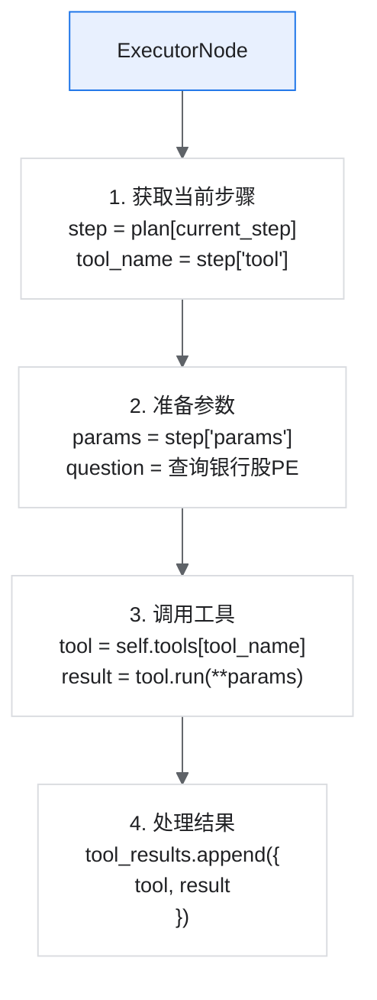

# 第三周-04：LangGraph Agent 学习指南

## 目录

1. [概述](#1-概述)
2. [核心概念](#2-核心概念)
3. [架构设计](#3-架构设计)
4. [节点详解](#4-节点详解)
5. [工具集成](#5-工具集成)
6. [代码阅读顺序](#6-代码阅读顺序)
7. [动手实践](#7-动手实践)

---

## 1. 概述

### 1.1 什么是 LangGraph？

LangGraph 是 LangChain 团队开发的一个框架，用于构建**有状态的、多步骤的 AI Agent**。

传统 LLM 调用和 LangGraph Agent 的区别：

```text
传统 LLM 调用： 用户问题 -> LLM -> 回答（一次性）

LangGraph Agent： 用户问题 -> [路由] -> [规划] -> [执行] -> [反思] -> [输出]
                                  ↑_______________________________↓
                                           （可循环迭代）
```

### 1.2 为什么需要 LangGraph？

| 场景 | 传统方式 | LangGraph |
| --- | --- | --- |
| 简单问答 | ✅ 足够 | 过度设计 |
| 需要查数据库 | ❌ 无法处理 | ✅ 调用工具 |
| 多步骤分析 | ❌ 无法处理 | ✅ 规划+执行 |
| 需要反思修正 | ❌ 无法处理 | ✅ 循环迭代 |

### 1.3 本项目功能

```text
金融研报自动化分析师
├── 数据查询（Text2SQL）
├── 数据分析（Code Executor）
├── 研报解析（PDF Parser）
├── 信息检索（Web Search / RAG）
└── 智能问答（LLM）
```

---

## 2. 核心概念

### 2.1 StateGraph（状态图）

LangGraph 的核心是 **StateGraph**，它定义了：

- **State（状态）**：在整个流程中传递的数据
- **Node（节点）**：处理状态的函数
- **Edge（边）**：节点之间的连接关系

```python
from langgraph.graph import StateGraph

# 1. 定义状态
class AgentState(TypedDict):
    query: str              # 用户问题
    intent: str             # 识别的意图
    plan: List[dict]        # 执行计划
    tool_results: List      # 工具执行结果
    final_answer: str       # 最终回答

# 2. 创建图
graph = StateGraph(AgentState)

# 3. 添加节点
graph.add_node("router", router_node)
graph.add_node("planner", planner_node)
graph.add_node("executor", executor_node)

# 4. 添加边
graph.add_edge("router", "planner")
graph.add_edge("planner", "executor")

# 5. 编译运行
app = graph.compile()
result = app.invoke({"query": "用户问题"})
```

### 2.2 条件边（Conditional Edge）

根据状态决定下一步走向：

```python
def should_continue(state):
    """决定是否继续执行"""
    if state["should_continue"]:
        return "executor"   # 继续执行
    else:
        return "critic"     # 生成答案

graph.add_conditional_edges(
    "reflector",            # 从哪个节点
    should_continue,        # 判断函数
    {
        "executor": "executor",
        "critic": "critic"
    }
)
```

### 2.3 ReAct 模式

ReAct = Reasoning + Acting（推理 + 行动）



---

## 3. 架构设计

### 3.1 整体流程图



### 3.2 状态定义

```python
# agents/nodes.py

class AgentState(TypedDict):
    """Agent状态 - 在所有节点间传递"""

    # 输入
    messages: List[Dict[str, str]]    # 对话历史
    query: str                        # 当前问题

    # 路由结果
    intent: str                       # 意图类型

    # 规划结果
    plan: List[Dict[str, Any]]        # 执行计划
    current_step: int                 # 当前步骤

    # 执行结果
    tool_calls: List[Dict]            # 工具调用记录
    tool_results: List[Dict]          # 工具执行结果

    # 反思结果
    reasoning_steps: List[str]        # 推理步骤记录
    reflections: List[Dict]           # 反思记录

    # 控制流
    should_continue: bool             # 是否继续
    iteration: int                    # 当前迭代次数
    max_iterations: int               # 最大迭代次数

    # 输出
    final_answer: str                 # 最终答案
    error: Optional[str]              # 错误信息
```

---

## 4. 节点详解

### 4.1 RouterNode（路由节点）

职责：分析用户意图，决定处理路径。

```python
class RouterNode:
    def __call__(self, state: AgentState) -> Dict[str, Any]:
        query = state["query"]

        # 让 LLM 分析意图
        prompt = f"""分析用户问题的意图：

用户问题：{query}

可选意图：
1. data_query - 需要查询数据库
2. analysis - 需要数据分析和可视化
3. research - 需要检索研报
4. general - 普通问答

返回JSON：{{"intent": "...", "reason": "..."}}
"""

        response = self.llm.simple_chat(prompt)
        result = json.loads(response)

        return {
            "intent": result["intent"],
            "reasoning_steps": [f"[路由] 识别意图：{result['intent']}"]
        }
```

输入输出：

```text
输入状态：{query: "银行股的PE是多少"}
输出更新：{intent: "data_query", reasoning_steps: [...]}
```

### 4.2 PlannerNode（规划节点）

职责：根据意图制定执行计划。

```python
class PlannerNode:
    def __call__(self, state: AgentState) -> Dict[str, Any]:
        query = state["query"]
        intent = state["intent"]

        # 如果是分析类任务，生成包含代码的计划
        if intent == "analysis":
            return self._plan_with_code(query, state)

        # 其他任务的规划
        prompt = f"""制定执行计划：

问题：{query}
意图：{intent}

可用工具：
- text2sql: 查询数据库
- code_executor: 执行Python代码
- pdf_parser: 解析PDF
- web_search: 搜索网络
- rag_search: 检索知识库

返回JSON：{{"plan": [...], "reasoning": "..."}}
"""

        response = self.llm.simple_chat(prompt)
        result = json.loads(response)

        return {
            "plan": result["plan"],
            "current_step": 0
        }
```

计划示例：

```python
plan = [
    {"step": 1, "action": "查询银行股PE数据", "tool": "text2sql",
     "params": {"question": "查询所有银行股的PE比率"}},
    {"step": 2, "action": "分析并绘图", "tool": "code_executor",
     "params": {"code": "...", "use_previous_data": True}}
]
```

### 4.3 ExecutorNode（执行节点）

职责：按计划执行工具调用。

```python
class ExecutorNode:
    def __init__(self):
        # 注册所有可用工具
        self.tools = {
            "text2sql": Text2SQLTool(),
            "code_executor": CodeExecutorTool(),
            "pdf_parser": PDFParserTool(),
            "web_search": WebSearchTool(),
            "rag_search": RAGSearchTool(),
        }

    def __call__(self, state: AgentState) -> Dict[str, Any]:
        plan = state["plan"]
        current_step = state["current_step"]

        # 获取当前步骤
        step = plan[current_step]
        tool_name = step["tool"]
        params = step["params"]

        # 执行工具
        tool = self.tools[tool_name]
        result = tool.run(**params)

        # 更新状态
        return {
            "current_step": current_step + 1,
            "tool_results": state["tool_results"] + [result],
            "should_continue": current_step + 1 < len(plan)
        }
```

数据传递（重点）：

```python
# 当 code_executor 需要使用上一步的数据时
if params.get("use_previous_data"):
    # 从 text2sql 结果中获取数据
    for prev_result in reversed(tool_results):
        if prev_result["tool"] == "text2sql":
            data = prev_result["result"]["raw_data"]
            break

# 将数据传递给 code_executor
result = code_executor.run(code, data)
```

### 4.4 ReflectorNode（反思节点）

职责：评估结果质量，决定是否继续。

```python
class ReflectorNode:
    def __call__(self, state: AgentState) -> Dict[str, Any]:
        prompt = f"""评估当前分析结果：

用户问题：{state['query']}
已获得结果：{state['tool_results']}

请回答：
1. 结果是否完整回答了问题？
2. 是否需要补充数据？
3. 置信度（0-1）？

返回JSON：{{
    "is_complete": true/false,
    "confidence": 0.85,
    "suggested_actions": [...]
}}
"""

        result = self.llm.simple_chat(prompt)
        parsed = json.loads(result)

        # 决定是否继续
        should_continue = (
            not parsed["is_complete"] and
            state["iteration"] < state["max_iterations"] and
            parsed["confidence"] < 0.85
        )

        return {
            "should_continue": should_continue,
            "iteration": state["iteration"] + 1,
            "reflections": state["reflections"] + [parsed]
        }
```

### 4.5 CriticNode（评估节点）

职责：整合所有结果，生成最终答案。

```python
class CriticNode:
    def __call__(self, state: AgentState) -> Dict[str, Any]:
        prompt = f"""根据以下信息生成最终回答：

用户问题：{state['query']}
收集到的数据：{state['tool_results']}
反思记录：{state['reflections']}

要求：
1. 专业准确
2. 数据具体
3. 包含风险提示
"""

        final_answer = self.llm.simple_chat(prompt)

        return {
            "final_answer": final_answer,
            "should_continue": False
        }
```

---

## 5. 工具集成

### 5.1 工具接口规范

所有工具都遵循统一接口：

```python
class BaseTool:
    name: str              # 工具名称
    description: str       # 工具描述（用于LLM选择）

    def run(self, **kwargs) -> Dict[str, Any]:
        """执行工具，返回结果字典"""
        return {
            "success": True/False,
            "data": ...,
            "error": ...
        }
```

### 5.2 工具列表

| 工具 | 用途 | 输入 | 输出 |
| --- | --- | --- | --- |
| text2sql | 数据库查询 | 自然语言问题 | SQL 结果 |
| code_executor | 代码执行 | Python 代码 + 数据 | 执行结果 + 图表 |
| pdf_parser | PDF 解析 | 文件路径 | 文本内容 |
| web_search | 网络搜索 | 搜索关键词 | 搜索结果 |
| rag_search | 知识检索 | 查询文本 | 相关文档 |

### 5.3 工具调用流程



---

## 6. 代码阅读顺序

### 6.1 推荐阅读顺序

```text
第一阶段：理解状态和节点
├── 1. agents/nodes.py            # AgentState 定义（第20-35行）
├── 2. agents/nodes.py            # RouterNode（第38-85行）
├── 3. agents/nodes.py            # PlannerNode（第88-220行）
└── 4. agents/nodes.py            # ExecutorNode（第223-310行）

第二阶段：理解工具
├── 5. tools/text2sql.py           # Text2SQL 工具
├── 6. tools/code_executor.py      # 代码执行器
└── 7. tools/pdf_parser.py         # PDF 解析器

第三阶段：理解图构建
├── 8. agents/graph.py             # StateGraph 构建
└── 9. main.py                     # FastAPI 集成

第四阶段：理解服务
├── 10. services/llm.py            # LLM 服务
└── 11. database/init_db.py        # 数据库初始化
```

### 6.2 关键代码片段

片段1：状态定义

```python
# agents/nodes.py:20-35
class AgentState(TypedDict):
    messages: List[Dict[str, str]]
    query: str
    intent: str
    plan: List[Dict[str, Any]]
    # ... 其他字段
```

片段2：条件路由

```python
# agents/graph.py（核心逻辑）
def route_by_intent(state):
    intent = state["intent"]
    if intent == "general":
        return "critic"     # 直接回答
    else:
        return "planner"    # 需要规划

graph.add_conditional_edges("router", route_by_intent)
```

片段3：循环控制

```python
# agents/graph.py（核心逻辑）
def should_continue(state):
    if state["should_continue"]:
        return "executor"
    return "critic"

graph.add_conditional_edges("reflector", should_continue)
```

---

## 7. 动手实践

### 7.1 练习1：运行测试

```bash
# 测试集成流程（不需要LLM）
python test_integration.py

# 测试完整流程（需要API Key）
export DASHSCOPE_API_KEY="your_key"
python test_code_executor.py
```

### 7.2 练习2：添加新节点

创建一个 `SummaryNode`，在最终回答前生成摘要：

```python
# 在 agents/nodes.py 中添加

class SummaryNode:
    """摘要节点 - 生成执行过程摘要"""

    def __init__(self):
        self.llm = get_llm_service()

    def __call__(self, state: AgentState) -> Dict[str, Any]:
        # 收集所有推理步骤
        steps = state.get("reasoning_steps", [])

        prompt = f"""将以下步骤总结为简洁的执行摘要：

{chr(10).join(steps)}

生成2-5句话的摘要。
"""

        summary = self.llm.simple_chat(prompt)

        return {
            "reasoning_steps": steps + [f"[摘要] {summary}"]
        }
```

### 7.3 练习3：添加新工具

创建一个 `StockInfoTool`，获取实时股票信息：

```python
# 在 tools/ 目录创建 stock_info.py

class StockInfoTool:
    name = "stock_info"
    description = "获取股票实时信息"

    def run(self, stock_code: str) -> Dict[str, Any]:
        # 这里可以调用真实API
        # 示例返回模拟数据
        return {
            "success": True,
            "data": {
                "code": stock_code,
                "name": "示例股票",
                "price": 10.5,
                "change": 0.5
            }
        }

# 在 ExecutorNode 中注册
self.tools["stock_info"] = StockInfoTool()
```

### 7.4 练习4：修改反思逻辑

修改 `ReflectorNode`，添加更严格的质量检查：

```python
def __call__(self, state: AgentState) -> Dict[str, Any]:
    # 检查是否有数据
    has_data = any(
        r.get("result", {}).get("success")
        for r in state.get("tool_results", [])
    )

    # 检查是否有图表
    has_chart = any(
        r.get("result", {}).get("figures")
        for r in state.get("tool_results", [])
    )

    # 如果是分析任务但没有图表，继续执行
    if state["intent"] == "analysis" and not has_chart:
        return {
            "should_continue": True,
            "reasoning_steps": state["reasoning_steps"] +
                ["[反思] 分析任务需要图表，继续执行"]
        }

    # ... 其他逻辑
```

### 7.5 练习5：追踪完整流程

在 `test_code_executor.py` 中添加详细日志：

```python
def test_with_logging():
    print("\n" + "="*60)
    print("追踪 Agent 完整执行流程")
    print("="*60)

    # 每个节点执行后打印状态
    for node_name in ["router", "planner", "executor", "reflector", "critic"]:
        print(f"\n>>> 执行节点: {node_name}")
        print(f"    当前状态: {state.keys()}")
        print(f"    plan: {state.get('plan', 'N/A')}")
        print(f"    current_step: {state.get('current_step', 'N/A')}")
        print(f"    should_continue: {state.get('should_continue', 'N/A')}")
```

---

## 附录

### A. 常见问题

**Q1：为什么需要 ReAct 反思？**

- 单次执行可能遗漏信息
- 反思可以发现错误并修正
- 提高回答的完整性和准确性

**Q2：如何控制循环次数？**

```python
state["max_iterations"] = 3  # 设置最大迭代次数
```

**Q3：工具执行失败怎么办？**

- ExecutorNode 会捕获错误
- 错误信息存入 `tool_results`
- ReflectorNode 可以决定是否重试

### B. 调试技巧

```python
# 打印完整状态
import json
print(json.dumps(state, indent=2, ensure_ascii=False, default=str))

# 追踪推理步骤
for step in state["reasoning_steps"]:
    print(step)

# 检查工具结果
for result in state["tool_results"]:
    print(f"Tool: {result['tool']}")
    print(f"Success: {result['result'].get('success')}")
```

### C. 扩展阅读

8. LangGraph 官方文档
9. ReAct 论文
10. LangChain 工具使用指南
