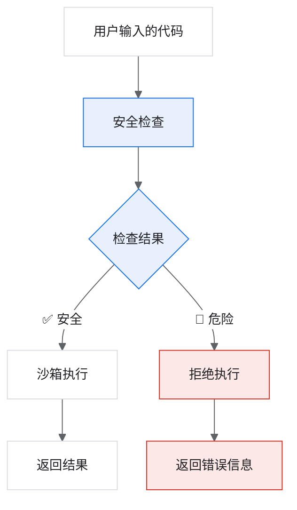

# 第三周-03：代码解释器（Code Interpreter）学习指南

> **核心理解**：代码解释器的本质：让代码在一个“隔离的小房间”里运行，它只能用我们给它的工具，出不去也碰不到外面的东西。

## 学习目标

学完本指南，你将掌握：

- 理解代码解释器是什么、能做什么
- 理解「沙箱」的概念及其必要性
- 掌握安全检查的实现原理
- 理解 `exec()` 如何在受限环境中执行代码
- 能够自己动手实验并验证学到的知识

## 学习路线

| 阶段 | 内容 | 你将学到 | 建议时长 |
| --- | --- | --- | --- |
| 1 | 快速体验 | 代码解释器能做什么 | 5 分钟 |
| 2 | 沙箱概念 | 为什么需要安全隔离 | 10 分钟 |
| 3 | 执行流程 | 从输入到输出的完整链路 | 10 分钟 |
| 4 | 源码解析 | 每个函数的作用 | 20 分钟 |
| 5 | 动手实验 | 验证你的理解 | 15 分钟 |

## 1. 快速体验：代码解释器能做什么？

先跑起来看效果，建立直观感受。

### 准备工作

```bash
cd Agent3
```

### 体验代码

```python
from tools.code_executor import CodeExecutorTool

executor = CodeExecutorTool()

# 一段数据分析代码
code = '''
import pandas as pd
import numpy as np

# 创建股票数据
data = {
    '股票': ['茅台', '工行', '招行', '宁德', '比亚迪'],
    'PE': [28, 5, 7.5, 25, 30],
    '市值': [22000, 15000, 9500, 11000, 7500]
}
df = pd.DataFrame(data)

print('股票数据:')
print(df)
print(f'\\n平均PE: {df["PE"].mean():.1f}')
print(f'总市值: {df["市值"].sum()} 亿')
'''

result = executor.run(code)
print(result['output'])
```

### 你应该看到

程序输出了股票数据表格、平均 PE 和总市值。

### 思考题

用户写的是 Python 代码，系统直接执行并返回结果。但如果用户写了恶意代码怎么办？

## 2. 理解「沙箱」：为什么需要安全隔离？

### 先想一个问题

如果用户输入这段代码会怎样？

```python
import os
os.system('rm -rf /')  # 删除系统所有文件！
```

如果不做任何限制，这段代码会直接在服务器上执行，后果不堪设想。

### 沙箱的作用

**沙箱（Sandbox）** 是一个安全的隔离环境。

- ✅ 允许：数据分析、数学计算、画图
- 🚫 禁止：文件操作、网络请求、系统命令

### 实验：测试安全拦截

```python
from tools.code_executor import CodeExecutorTool

executor = CodeExecutorTool()

# 这些危险操作会被拦截
dangerous_codes = [
    ("import os", "导入危险模块"),
    ("open('file.txt')", "文件操作"),
    ("import requests", "网络请求"),
    ("eval('1+1')", "动态执行"),
]

print("=== 安全检查演示 ===")
for code, desc in dangerous_codes:
    result = executor.run(code)
    status = "❌ 已拦截" if not result['success'] else "✅ 允许"
    print(f"{status} | {desc}: {code}")
    if not result['success']:
        print(f"  原因: {result['error']}")
```

### 你应该看到

所有危险操作都被拦截，并给出了拒绝原因。

### 沙箱工作流程



## 3. 执行流程：从输入到输出

流程图文件：`docs/code_interpreter_workflow.svg`

完整的 8 个步骤：

| 步骤 | 名称 | 做了什么 |
| --- | --- | --- |
| 1 | 用户请求 | 接收用户提交的 Python 代码 |
| 2 | LLM 生成代码 | 如果是自然语言，先让 LLM 转成代码 |
| 3 | 安全检查 | 扫描代码，检查是否有危险操作 |
| 4 | 代码预处理 | 移除冗余 import（因为库已预加载） |
| 5 | 沙箱执行 | 在受限环境中运行代码 |
| 6 | 捕获输出 | 收集 print 输出和错误信息 |
| 7 | 图表处理 | 把 matplotlib 图表转成 Base64 |
| 8 | 返回结果 | 打包结果返回给用户 |

### 关键步骤：3、4、5

这三步是代码解释器的核心，接下来我们逐一深入。

## 4. 源码解析：深入理解实现

核心文件：`tools/code_executor.py`

### 4.1 类的基本结构

位置：第 16-46 行

```python
class CodeExecutorTool:
    name = "code_executor"

    def __init__(self):
        self.timeout = 30          # 执行超时时间（秒）
        self.max_output = 10000    # 最大输出长度（字符）

        # ✅ 白名单：预加载的安全库
        self.safe_imports = {
            'pandas': 'pd',
            'numpy': 'np',
            'matplotlib.pyplot': 'plt',
            # ...
        }

        # 🚫 黑名单：禁止的危险模块
        self.forbidden_modules = {
            'os', 'subprocess', 'shutil',   # 系统操作
            'socket', 'requests',           # 网络请求
            # ...
        }
```

理解要点：

- 白名单：这些库是安全的，允许使用
- 黑名单：这些模块很危险，一律禁止

### 4.2 安全检查函数 ⭐

位置：第 108-129 行

```python
def _check_code_safety(self, code: str) -> Optional[str]:
    """检查代码安全性，返回错误信息或 None"""

    # 检查1：是否导入了禁止的模块
    for forbidden in self.forbidden_modules:
        if f"import {forbidden}" in code:
            return f"禁止导入模块: {forbidden}"

    # 检查2：是否使用了危险函数
    dangerous_patterns = [
        ('open(', '禁止使用 open() 函数'),
        ('eval(', '禁止使用 eval() 函数'),
        ('exec(', '禁止使用 exec() 函数'),
        ('__import__', '禁止使用 __import__'),
    ]

    for pattern, message in dangerous_patterns:
        if pattern in code:
            return message

    return None  # 通过检查，返回 None
```

理解要点：

- 用字符串匹配扫描代码
- 发现 `import os` -> 立即拒绝
- 发现 `open(` -> 立即拒绝
- 全部通过 -> 返回 `None`

### 4.3 创建安全环境 ⭐⭐ 核心！

位置：第 56-106 行

```python
def _create_safe_globals(self) -> Dict[str, Any]:
    """创建安全的全局变量环境"""
    import pandas as pd
    import numpy as np

    safe_globals = {
        # 🔒 限制内置函数：只保留安全的
        '__builtins__': {
            'print': print,
            'len': len,
            'range': range,
            'sum': sum,
            'min': min,
            'max': max,
            # ⚠️ 注意：没有 open, eval, exec, __import__
        },

        # 📦 预加载的库（用户可以直接使用）
        'pd': pd,
        'np': np,
        'plt': plt,
        'json': json,
        'math': math,
    }

    return safe_globals
```

理解要点：

- 这是沙箱的核心机制
- 创建一个“干净”的环境，只放我们允许的东西
- 用户代码只能访问这个字典里的内容
- 比如：用户可以用 `pd.DataFrame()`，但用不了 `open()`

### 4.4 代码预处理

位置：第 131-164 行

```python
def _preprocess_code(self, code: str) -> str:
    """移除已导入模块的 import 语句"""

    preloaded = {'pandas', 'numpy', 'matplotlib', ...}

    lines = code.split('\n')
    processed_lines = []

    for line in lines:
        # 如果是 import pandas，跳过（因为 pd 已经存在了）
        if line.strip().startswith('import '):
            for module in preloaded:
                if module in line:
                    continue  # 跳过这行

        processed_lines.append(line)

    return '\n'.join(processed_lines)
```

理解要点：

- 沙箱环境里已经有 `pd`、`np` 等变量
- 用户写的 `import pandas as pd` 是多余的
- 这个函数把这些多余的 import 删除

### 4.5 主执行函数 ⭐⭐⭐

位置：第 166-257 行

```python
def run(self, code: str, data: Optional[Dict] = None) -> Dict:
    # 步骤1：安全检查
    safety_error = self._check_code_safety(code)
    if safety_error:
        return {"success": False, "error": safety_error}

    # 步骤2：预处理
    code = self._preprocess_code(code)

    # 步骤3：创建安全环境
    safe_globals = self._create_safe_globals()

    # 步骤4：准备捕获输出
    stdout_capture = io.StringIO()

    try:
        # 步骤5：⚡ 在沙箱中执行代码
        with redirect_stdout(stdout_capture):
            exec(code, safe_globals)  # ← 关键！

        # 步骤6：收集输出
        output = stdout_capture.getvalue()

        # 步骤7：收集图表（转 base64）
        figures = [...]

        return {
            "success": True,
            "output": output,
            "figures": figures
        }

    except Exception as e:
        return {"success": False, "error": str(e)}
```

理解要点：

- `exec(code, safe_globals)` 是核心
- 第二个参数 `safe_globals` 限制了代码能访问什么
- `redirect_stdout` 捕获所有 `print` 输出

## 5. 动手实验：验证你的理解

### 实验 A：基础数据分析

```python
from tools.code_executor import CodeExecutorTool
executor = CodeExecutorTool()

code = '''
import pandas as pd

data = {'name': ['A', 'B', 'C'], 'value': [10, 20, 30]}
df = pd.DataFrame(data)
print(df)
print(f"总和: {df['value'].sum()}")
'''

result = executor.run(code)
print(result['output'])
```

预期结果：显示数据表和总和。

### 实验 B：生成图表

```python
code = '''
import matplotlib.pyplot as plt

x = ['银行', '白酒', '新能源']
y = [5, 25, 28]

plt.figure(figsize=(8, 5))
plt.bar(x, y, color=['blue', 'red', 'green'])
plt.title('各行业PE对比')
plt.ylabel('PE值')
'''

result = executor.run(code)
print(f"生成了 {len(result['figures'])} 个图表")
# result['figures'][0]['base64'] 是图片的 base64 编码
```

预期结果：生成 1 个图表。

### 实验 C：测试安全拦截

试试这些危险代码，观察返回的错误信息：

```python
dangerous_tests = [
    "import os\nos.listdir('.')",
    "open('test.txt', 'w').write('hacked')",
    "import subprocess\nsubprocess.run(['ls'])",
    "eval('1+1')",
    "__import__('os')",
]

for code in dangerous_tests:
    result = executor.run(code)
    print(f"代码: {code[:30]}...")
    print(f"结果: success={result['success']}")
    if not result['success']:
        print(f"错误: {result['error']}")
    print()
```

预期结果：全部被拦截，并显示拒绝原因。

## 知识点总结

| 概念 | 一句话解释 |
| --- | --- |
| 代码解释器 | 让 AI 能够执行 Python 代码来分析数据 |
| 沙箱 | 安全隔离环境，只允许执行安全操作 |
| 白名单 | 预加载的安全库：pandas、numpy、matplotlib |
| 黑名单 | 禁止的危险模块：os、subprocess、socket |
| 安全检查 | 用字符串匹配扫描危险代码 |
| safe_globals | 限制代码能访问的变量和函数 |
| `exec(code, safe_globals)` | 在受限环境中执行代码的核心 API |
| `redirect_stdout` | 捕获 print 输出 |

## 相关文件

| 文件 | 说明 |
| --- | --- |
| `tools/code_executor.py` | 代码执行器核心实现 |
| `docs/code_interpreter_workflow.svg` | 执行流程图 |

## 自测清单

学完后，你应该能回答这些问题：

- [ ] 代码解释器解决了什么问题？
- [ ] 为什么需要沙箱？不用会怎样？
- [ ] 安全检查是怎么实现的？
- [ ] `safe_globals` 是什么？为什么它能限制代码行为？
- [ ] `exec()` 函数的第二个参数有什么作用？
- [ ] 如果用户写了 `import pandas as pd`，预处理会做什么？
