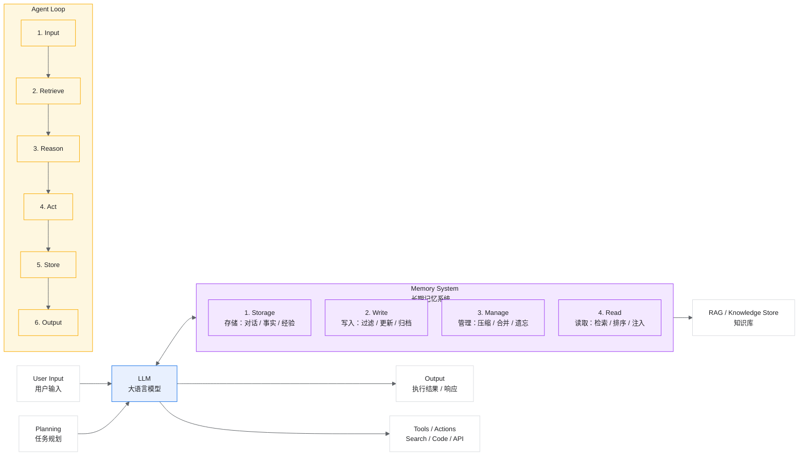
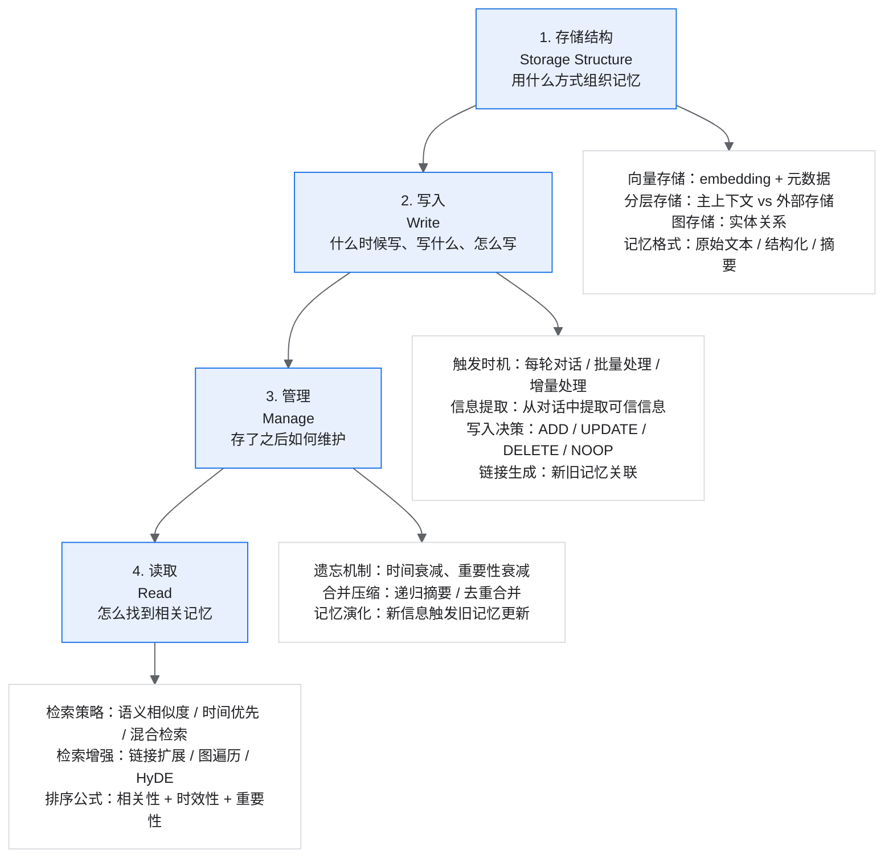
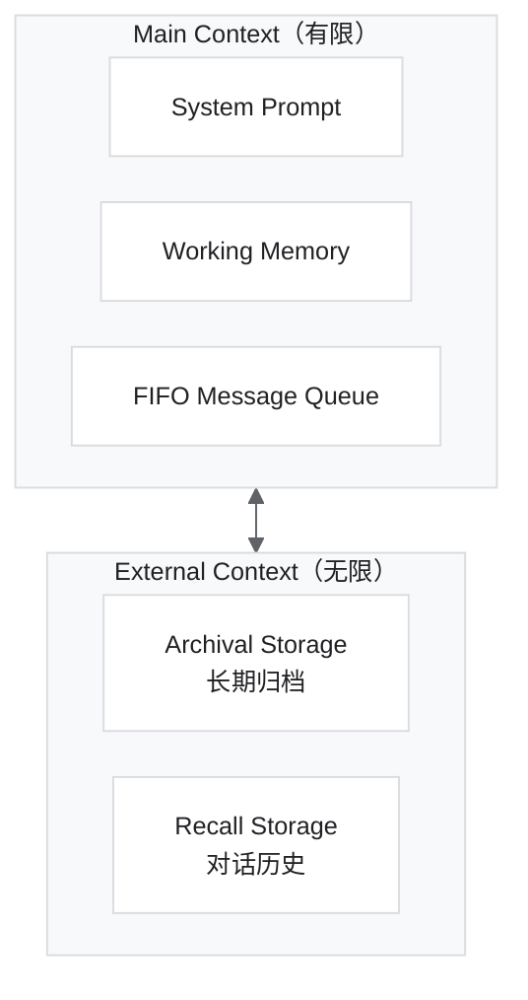
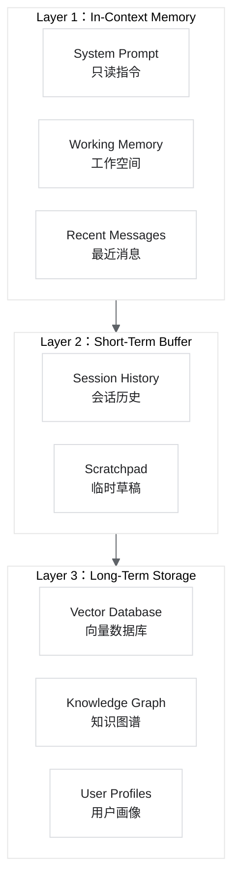
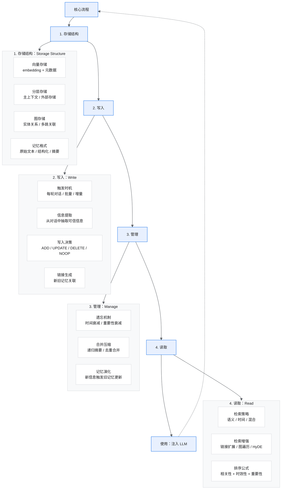

# 第四周-01 大模型 Agent 系统 Memory 模块深度教程

## 课程安排

1. 讲一下接下来的安排
   - 3 次课程
   - 校招：150 万-200 万 offer
   - 社招：15 * 12 约 30-40k * 15
   - 多模态 + RL、发布训练平台，集成了数据清洗、合成、过程监控、训练结果评估、问题定位等
2. 给大家演示一下 DeepResearch
   - 演示，核心讲解在第五周的下半节课 + 第六周
3. Agent memory 怎么做？

为什么要做 memory？

上下文窗口有限。

最核心的一定离不开我们今天讲解的 4 个流程：

1. 存储结构
2. 写入
3. 管理
4. 读取

## 第四周：Agent Memory 记忆系统

从理论到实践，全面掌握 LLM Agent 记忆系统的设计与实现。

核心关键词：

- Memory Stream
- 检索机制
- Reflection 反思
- 图谱存储
- 长期记忆
- 记忆强化

---

## 目录

第一章：为什么 Agent 需要 Memory

- 1.1 LLM 的固有局限性
- 1.2 Memory 如何赋能 Agent
- 1.3 Memory 在 Agent 架构中的位置

第二章：Memory 理论基础与分类

- 2.1 从认知科学到 AI：记忆的类型学
  - 按时间维度分类
  - 按内容维度分类
- 2.2 三维分类框架
- 2.3 Memory 生命周期

第三章：核心论文解读

- 3.1 奠基性工作
  - Generative Agents: Interactive Simulacra of Human Behavior
  - MemGPT: Towards LLMs as Operating Systems
- 3.2 最新进展（2024-2025）
  - A Survey on the Memory Mechanism of LLM-based Agents
  - Mem0: Building Production-Ready AI Agents with Scalable Long-Term Memory

第四章：Memory 系统架构设计

第五章：核心组件实现

第六章：高级 Memory 技术

第七章：评估与优化

---

## 第一章：为什么 Agent 需要 Memory

### 1.1 LLM 的固有局限性

大语言模型（LLM）虽然具备强大的语言理解和生成能力，但在实际应用中面临几个关键局限性：

| 局限性 | 描述 | 影响 |
| --- | --- | --- |
| 有限的上下文窗口 | 即使最先进的模型，上下文也有限制（如 128K tokens） | 无法处理超长对话或大规模文档 |
| 无状态性 | 每次调用都是独立的，无法自动记住之前的交互 | 缺乏跨会话的连续性 |
| 知识时效性 | 训练数据有截止日期 | 无法获取最新信息，也无法学习用户特定信息 |
| 缺乏个性化 | 无法根据特定用户的偏好进行响应 | 千人一面的交互体验 |

### 1.2 Memory 如何赋能 Agent

核心观点：Memory 模块是将 LLM 从“无状态函数”转变为“有状态智能体”的关键组件。正如人类的记忆系统支撑着我们的学习、决策和社交，Agent 的 Memory 系统同样是其智能行为的基石。

引入 Memory 系统后，Agent 可以实现：

- **持续学习**：从交互中积累经验，不断优化行为策略
- **长期连贯性**：维护跨会话的一致人设和知识状态
- **个性化服务**：记住用户偏好，提供定制化体验
- **复杂任务处理**：支持需要长期规划和多步推理的任务
- **知识整合**：将外部知识与对话历史有机结合

### 1.3 Memory 在 Agent 架构中的位置



Memory transforms Agent from “stateless tool” to “stateful intelligence”。

---

## 第二章：Memory 理论基础与分类

### 2.1 从认知科学到 AI：记忆的类型学

Agent 的 Memory 系统设计深受认知科学中人类记忆理论的影响。

#### 按时间维度分类

| 类型 | 描述 | Agent 中的实现 | 典型用途 |
| --- | --- | --- | --- |
| 感知记忆（Sensory） | 极短暂，毫秒级 | 当前输入的 token 序列 | 实时输入处理 |
| 短期记忆（Short-term） | 秒到分钟级，容量有限 | In-context 对话历史 | 当前会话上下文 |
| 工作记忆（Working） | 短期的活跃处理空间 | Scratchpad、思维链 | 推理中间步骤 |
| 长期记忆（Long-term） | 持久存储，大容量 | 外部向量数据库、知识图谱 | 持久化知识和经验 |

#### 按内容维度分类

1. **语义记忆（Semantic）**
   - 事实性知识、概念、规则
   - 例如：“巴黎是法国的首都”
   - 通常通过知识库或 RAG 实现

2. **情景记忆（Episodic）**
   - 具体事件和经历的记忆
   - 例如：“昨天用户说他喜欢咖啡”
   - 存储在对话历史中

3. **程序记忆（Procedural）**
   - 如何执行任务的知识
   - 例如：工作流模板、工具使用模式
   - 可通过经验学习积累

### 2.2 三维分类框架

基于最新研究，我们可以用三个维度来全面描述 Memory 系统：

**对象维度（Object）**：记忆存储什么？

- 个人记忆：特定用户的偏好、历史、画像
- 系统记忆：共享知识、全局配置、公共信息

**形式维度（Form）**：记忆如何存储？

- 非参数化记忆：显式存储（向量数据库、文本文件、图数据库）
- 参数化记忆：隐式编码在模型权重中（通过微调实现）

**时间维度（Time）**：记忆保持多久？

- 短期 / 工作记忆：会话内有效
- 长期记忆：跨会话持久化

### 2.3 Memory 生命周期



---

## 第三章：核心论文解读

相关阅读：

- 第四周-02 论文精读 1：Generative Agents: Interactive Simulacra of Human Behavior
- 第四周-03 论文精读 2：MemGPT: Towards LLMs as Operating Systems
- 第四周-04 论文精读 3：A Survey on the Memory Mechanism of Large Language Model based Agents
- 第四周-05 论文精读 4：Mem0: Building Production-Ready AI Agents with Scalable Long-Term Memory
- 第四周-06 论文精读 5：A-MEM: Agentic Memory for LLM Agents
- 第四周-00：Memory 架构

### 3.1 奠基性工作

#### Generative Agents: Interactive Simulacra of Human Behavior

Stanford & Google | UIST 2023 | 引用量：2000+

核心贡献：提出了完整的 Agent Memory 架构，包含 Memory Stream（记忆流）、Reflection（反思）和 Planning（规划）三大组件。

关键创新：

- **Memory Stream**：用自然语言存储所有 Agent 经历的完整记录
- **检索函数**：综合考虑 Recency（时间衰减）、Importance（重要性）、Relevance（相关性）
- **Reflection 机制**：当累积重要性超过阈值时，生成更高层次的抽象洞察

检索分数公式：

```text
Score = α × Relevance + β × Recency + γ × Importance
```

#### MemGPT: Towards LLMs as Operating Systems

UC Berkeley | NeurIPS 2023 | arXiv:2310.08560

核心思想：将操作系统的虚拟内存管理概念引入 LLM，通过分层存储实现“无限”上下文。

架构设计：



自管理机制：LLM 通过函数调用自主决定何时读写内存。

### 3.2 最新进展（2024-2025）

#### A Survey on the Memory Mechanism of LLM-based Agents

Zhang et al. | ACM TOIS 2024 | arXiv:2404.13501

首个全面综述 Agent Memory 机制的论文，提出了系统性分类框架，覆盖设计、评估和应用。

#### Mem0: Building Production-Ready AI Agents with Scalable Long-Term Memory

Mem0.ai | arXiv:2504.19413 | 2025

核心贡献：提出可扩展的生产级 Memory 架构，包括基于图的 Mem0g 变体。

关键指标：

- 相比 OpenAI 方案提升 26% 准确率
- 降低 91% p95 延迟
- 节省 90%+ token 成本

#### A-MEM: Agentic Memory for LLM Agents

arXiv:2502.12110 | 2025

创新点：借鉴 Zettelkasten 笔记方法，实现自组织的记忆网络，支持动态索引和链接。

---

## 第四章：Memory 系统架构设计

### 4.1 设计原则

1. **分层存储**：不同时间效性的记忆使用不同存储策略
2. **高效检索**：支持多种检索方式（语义、时间、重要性）
3. **动态演化**：记忆可更新、合并、遗忘
4. **可扩展性**：支持大规模记忆存储
5. **一致性**：保证记忆的逻辑一致性

### 4.2 分层 Memory 架构



### 4.3 核心数据结构

Memory Entry 结构：

```python
from dataclasses import dataclass, field
from datetime import datetime
from typing import List, Dict, Optional
import uuid

@dataclass
class MemoryEntry:
    """Memory系统的基本存储单元"""

    # 唯一标识
    id: str = field(default_factory=lambda: str(uuid.uuid4()))

    # 内容相关
    content: str = ""                         # 记忆的文本内容
    memory_type: str = "episodic"             # episodic/semantic/procedural

    # 元数据
    timestamp: datetime = field(default_factory=datetime.now)
    source: str = "conversation"              # 来源：conversation/reflection/tool

    # 重要性和相关性
    importance: float = 0.5                   # 重要性评分 [0,1]
    access_count: int = 0                     # 访问次数
    last_accessed: Optional[datetime] = None

    # 向量表示
    embedding: Optional[List[float]] = None

    # 关联信息
    linked_memories: List[str] = field(default_factory=list)
    tags: List[str] = field(default_factory=list)
    metadata: Dict = field(default_factory=dict)
```

### 4.4 检索策略设计

混合检索公式：

```text
综合分数 = α × 语义相关性 + β × 时间衰减 + γ × 重要性
```

其中：

- **语义相关性**：Query 与 Memory 的 embedding 余弦相似度
- **时间衰减**：`decay_rate ^ hours_passed`
- **重要性**：LLM 评估的重要性分数

检索策略枚举：

```python
from enum import Enum

class RetrievalStrategy(Enum):
    SEMANTIC = "semantic"       # 纯语义相似度
    TEMPORAL = "temporal"       # 时间优先
    HYBRID = "hybrid"           # 混合策略
    IMPORTANCE = "importance"   # 重要性优先
    GRAPH = "graph"             # 图关系检索
```

### 4.5 存储层选型

| 存储类型 | 推荐方案 | 适用场景 |
| --- | --- | --- |
| 向量数据库 | ChromaDB（轻量）、Pinecone（托管）、Milvus（高性能） | 语义检索、相似度匹配 |
| 图数据库 | Neo4j、Amazon Neptune | 关系建模、知识图谱、多跳推理 |
| 关系型数据库 | PostgreSQL（with pgvector）、SQLite | 元数据管理、结构化查询 |
| 缓存 | Redis | 热点数据、会话状态 |

---

## 第五章：核心组件实现

### 5.1 完整的 Memory Manager 实现

```python
"""
完整的Agent Memory管理系统实现
支持分层存储、混合检索、反思生成
"""

import json
import numpy as np
from datetime import datetime, timedelta
from typing import List, Dict, Optional, Tuple
from dataclasses import dataclass, field, asdict
import chromadb
from openai import OpenAI

@dataclass
class MemoryConfig:
    """Memory系统配置"""
    max_short_term_memories: int = 20
    importance_threshold: float = 0.7
    reflection_threshold: float = 10.0  # 累积重要性触发反思
    decay_rate: float = 0.99
    embedding_model: str = "text-embedding-3-small"
    llm_model: str = "gpt-4o-mini"

class MemoryManager:
    """
    Agent记忆管理器

    功能：
    - 分层存储（短期/长期）
    - 自动重要性评估
    - 混合检索（语义+时间+重要性）
    - 反思机制
    - 记忆遗忘
    """

    def __init__(self, config: MemoryConfig = None,
                 persist_path: str = "./memory_db"):
        self.config = config or MemoryConfig()
        self.client = OpenAI()

        # 初始化ChromaDB
        self.chroma_client = chromadb.PersistentClient(path=persist_path)
        self.collection = self.chroma_client.get_or_create_collection(
            name="agent_memories",
            metadata={"hnsw:space": "cosine"}
        )

        # 短期记忆缓冲区
        self.short_term_buffer: List[MemoryEntry] = []

        # 累积重要性（用于触发反思）
        self.accumulated_importance: float = 0.0

        # 用户画像
        self.user_profile: Dict = {}

    def add_memory(self, content: str, memory_type: str = "episodic",
                   source: str = "conversation",
                   metadata: Dict = None) -> MemoryEntry:
        """添加新记忆"""

        # 1. 评估重要性
        importance = self._assess_importance(content)

        # 2. 生成 embedding
        embedding = self._get_embedding(content)

        # 3. 创建记忆条目
        memory = MemoryEntry(
            content=content,
            memory_type=memory_type,
            source=source,
            importance=importance,
            embedding=embedding,
            metadata=metadata or {}
        )

        # 4. 添加到短期缓冲区
        self.short_term_buffer.append(memory)

        # 5. 累积重要性
        self.accumulated_importance += importance

        # 6. 检查是否需要触发反思
        if self.accumulated_importance >= self.config.reflection_threshold:
            self._trigger_reflection()

        # 7. 检查是否需要迁移到长期存储
        if len(self.short_term_buffer) > self.config.max_short_term_memories:
            self._consolidate_to_long_term()

        return memory

    def retrieve(self, query: str, k: int = 5,
                 include_short_term: bool = True,
                 time_window: Optional[timedelta] = None) -> List[MemoryEntry]:
        """混合检索记忆"""

        query_embedding = self._get_embedding(query)
        results = []

        # 1. 从长期存储检索
        long_term_results = self._retrieve_from_long_term(
            query_embedding, k=k*2, time_window=time_window
        )
        results.extend(long_term_results)

        # 2. 从短期缓冲区检索
        if include_short_term:
            short_term_results = self._retrieve_from_short_term(
                query_embedding, k=k
            )
            results.extend(short_term_results)

        # 3. 综合排序
        current_time = datetime.now()
        scored_results = []
        for memory in results:
            score = self._calculate_retrieval_score(
                memory, query_embedding, current_time
            )
            scored_results.append((memory, score))

        # 4. 去重并返回 top-k
        seen_ids = set()
        unique_results = []
        for memory, score in sorted(scored_results, key=lambda x: x[1], reverse=True):
            if memory.id not in seen_ids:
                seen_ids.add(memory.id)
                unique_results.append(memory)
                # 更新访问记录
                memory.access_count += 1
                memory.last_accessed = current_time
                if len(unique_results) >= k:
                    break

        return unique_results

    def get_context_for_prompt(self, query: str,
                               max_tokens: int = 2000) -> str:
        """获取用于prompt的记忆上下文"""

        memories = self.retrieve(query, k=10)

        context_parts = []
        total_tokens = 0

        for memory in memories:
            estimated_tokens = len(memory.content.split()) * 1.3
            if total_tokens + estimated_tokens > max_tokens:
                break

            context_parts.append(
                f"[{memory.timestamp.strftime('%Y-%m-%d %H:%M')}] "
                f"[{memory.memory_type}]: {memory.content}"
            )
            total_tokens += estimated_tokens

        return "\n".join(context_parts)

    # ==================== 内部方法 ====================

    def _assess_importance(self, content: str) -> float:
        """使用LLM评估记忆重要性"""

        prompt = f"""Rate the importance of the following memory on a scale of 0 to 1.
Consider factors like:
- Personal significance (preferences, relationships, important events)
- Factual importance (key information, decisions, commitments)
- Emotional weight (strong reactions, meaningful moments)

Memory: "{content}"

Respond with only a number between 0 and 1."""

        try:
            response = self.client.chat.completions.create(
                model=self.config.llm_model,
                messages=[{"role": "user", "content": prompt}],
                temperature=0,
                max_tokens=10
            )
            score = float(response.choices[0].message.content.strip())
            return max(0.0, min(1.0, score))
        except:
            return 0.5  # 默认中等重要性

    def _get_embedding(self, text: str) -> List[float]:
        """获取文本embedding"""
        response = self.client.embeddings.create(
            model=self.config.embedding_model,
            input=text
        )
        return response.data[0].embedding

    def _trigger_reflection(self):
        """触发反思机制，生成高层次洞察"""

        # 收集最近的重要记忆
        recent_memories = sorted(
            self.short_term_buffer,
            key=lambda x: x.importance,
            reverse=True
        )[:10]

        if not recent_memories:
            return

        memories_text = "\n".join([f"- {m.content}" for m in recent_memories])

        prompt = f"""Based on the following recent memories, generate 3 high-level insights:

{memories_text}

Format each insight as a single sentence starting with "Insight:".
Focus on patterns, preferences, important facts, or notable events."""

        response = self.client.chat.completions.create(
            model=self.config.llm_model,
            messages=[{"role": "user", "content": prompt}],
            temperature=0.7
        )

        # 解析并存储反思
        insights = response.choices[0].message.content
        for line in insights.split("\n"):
            if line.strip().startswith("Insight:"):
                insight_content = line.replace("Insight:", "").strip()
                self.add_memory(
                    content=insight_content,
                    memory_type="reflection",
                    source="reflection",
                    metadata={"source_memories": [m.id for m in recent_memories]}
                )

        # 重置累积重要性
        self.accumulated_importance = 0.0

    def _consolidate_to_long_term(self):
        """将短期记忆迁移到长期存储"""

        to_migrate = [
            m for m in self.short_term_buffer
            if m.importance >= self.config.importance_threshold
        ]

        if to_migrate:
            self.collection.add(
                ids=[m.id for m in to_migrate],
                embeddings=[m.embedding for m in to_migrate],
                documents=[m.content for m in to_migrate],
                metadatas=[{
                    "memory_type": m.memory_type,
                    "source": m.source,
                    "importance": m.importance,
                    "timestamp": m.timestamp.isoformat(),
                    "tags": json.dumps(m.tags)
                } for m in to_migrate]
            )

        # 清理短期缓冲区
        keep_count = self.config.max_short_term_memories // 2
        self.short_term_buffer = sorted(
            self.short_term_buffer,
            key=lambda x: x.timestamp,
            reverse=True
        )[:keep_count]

    def _calculate_retrieval_score(self, memory: MemoryEntry,
                                   query_embedding: List[float],
                                   current_time: datetime) -> float:
        """计算综合检索分数"""

        # 相关性
        relevance = self._cosine_similarity(
            query_embedding, memory.embedding
        ) if memory.embedding else 0

        # 时间衰减
        hours_passed = (current_time - memory.timestamp).total_seconds() / 3600
        recency = self.config.decay_rate ** hours_passed

        # 组合
        return 0.5 * relevance + 0.3 * recency + 0.2 * memory.importance

    @staticmethod
    def _cosine_similarity(a: List[float], b: List[float]) -> float:
        """计算余弦相似度"""
        a, b = np.array(a), np.array(b)
        return float(np.dot(a, b) / (np.linalg.norm(a) * np.linalg.norm(b)))
```

### 5.2 记忆压缩与摘要

```python
class MemoryCompressor:
    """记忆压缩器：将多条相关记忆合并为摘要"""

    def __init__(self, llm_client, model: str = "gpt-4o-mini"):
        self.client = llm_client
        self.model = model

    def compress_memories(self, memories: List[MemoryEntry],
                          max_output_tokens: int = 500) -> str:
        """将多条记忆压缩为简洁摘要"""

        memories_text = "\n".join([
            f"- [{m.timestamp.strftime('%Y-%m-%d')}] {m.content}"
            for m in memories
        ])

        prompt = f"""Compress the following memories into a concise summary.
Preserve key facts, preferences, and important events.

Memories:
{memories_text}

Provide a compressed summary:"""

        response = self.client.chat.completions.create(
            model=self.model,
            messages=[{"role": "user", "content": prompt}],
            max_tokens=max_output_tokens
        )

        return response.choices[0].message.content.strip()

    def hierarchical_compress(self, memories: List[MemoryEntry]) -> Dict[str, str]:
        """分层压缩：生成不同粒度的摘要"""

        return {
            "detailed": self.compress_memories(memories, max_output_tokens=1000),
            "medium": self.compress_memories(memories, max_output_tokens=300),
            "brief": self.compress_memories(memories, max_output_tokens=100)
        }
```

---

## 第六章：高级 Memory 技术

### 6.1 图记忆系统（Graph Memory）

基于 Mem0g 和知识图谱的思路，图记忆可以更好地捕捉实体间的关系。

```python
from neo4j import GraphDatabase

class GraphMemory:
    """基于图数据库的记忆系统"""

    def __init__(self, uri: str, user: str, pwd: str):
        self.driver = GraphDatabase.driver(uri, auth=(user, pwd))
        self._init_schema()

    def _init_schema(self):
        """初始化图模式"""
        with self.driver.session() as session:
            session.run("""
                CREATE CONSTRAINT memory_id IF NOT EXISTS
                FOR (m:Memory) REQUIRE m.id IS UNIQUE
            """)

    def add_memory_with_entities(self, memory: MemoryEntry,
                                 entities: List[Dict]) -> None:
        """添加记忆并建立实体关系"""

        with self.driver.session() as session:
            # 创建记忆节点
            session.run("""
                CREATE (m:Memory {
                    id: $id,
                    content: $content,
                    timestamp: $timestamp,
                    importance: $importance
                })
            """, id=memory.id, content=memory.content,
                 timestamp=memory.timestamp.isoformat(),
                 importance=memory.importance)

            # 创建实体节点和关系
            for entity in entities:
                session.run("""
                    MERGE (e:Entity {name: $name, type: $type})
                    WITH e
                    MATCH (m:Memory {id: $memory_id})
                    CREATE (m)-[:MENTIONS {role: $role}]->(e)
                """, name=entity["name"], type=entity["type"],
                     memory_id=memory.id,
                     role=entity.get("role", "mentioned"))

    def query_related_memories(self, entity_name: str,
                               depth: int = 2) -> List[Dict]:
        """基于实体查询相关记忆（支持多跳）"""

        with self.driver.session() as session:
            result = session.run("""
                MATCH (e:Entity {name: $name})
                MATCH path = (e)<-[:MENTIONS*1..{depth}]-(m:Memory)
                RETURN m.id AS id, m.content AS content,
                       m.timestamp AS timestamp, length(path) AS distance
                ORDER BY distance, m.timestamp DESC
                LIMIT 20
            """, name=entity_name)

            return [dict(record) for record in result]
```

### 6.2 自组织记忆（A-MEM 风格）

核心思想：借鉴 Zettelkasten 笔记方法，每条记忆都是一个“原子笔记”，通过语义相似性自动建立链接，形成知识网络。

```python
class SelfOrganizingMemory:
    """自组织记忆系统"""

    def __init__(self, memory_manager: MemoryManager,
                 link_threshold: float = 0.7):
        self.memory_manager = memory_manager
        self.link_threshold = link_threshold
        self.llm = OpenAI()

    def add_with_auto_linking(self, content: str) -> MemoryEntry:
        """添加记忆并自动建立链接"""

        # 1. 生成记忆的结构化属性
        attributes = self._generate_attributes(content)

        # 2. 创建记忆
        memory = self.memory_manager.add_memory(
            content=content,
            metadata={"attributes": attributes}
        )

        # 3. 查找相关记忆
        related = self.memory_manager.retrieve(content, k=10)

        # 4. 使用LLM判断是否建立链接
        for candidate in related:
            if self._should_link(memory, candidate):
                memory.linked_memories.append(candidate.id)
                candidate.linked_memories.append(memory.id)

        return memory

    def _generate_attributes(self, content: str) -> Dict:
        """为记忆生成结构化属性"""

        prompt = f"""Analyze this memory and extract structured attributes:

Memory: "{content}"

Return a JSON object with:
- keywords: list of 3-5 key terms
- category: one of [personal, factual, procedural, social]
- entities: list of mentioned people, places, or things
- sentiment: positive/neutral/negative
- context_description: brief contextual summary"""

        response = self.llm.chat.completions.create(
            model="gpt-4o-mini",
            messages=[{"role": "user", "content": prompt}],
            response_format={"type": "json_object"}
        )

        return json.loads(response.choices[0].message.content)

    def _should_link(self, memory1: MemoryEntry,
                     memory2: MemoryEntry) -> bool:
        """使用LLM判断两条记忆是否应该链接"""

        prompt = f"""Should these two memories be linked?

Memory 1: "{memory1.content}"
Memory 2: "{memory2.content}"

Consider: shared topics, causal relationships, complementary info.
Answer with just "yes" or "no"."""

        response = self.llm.chat.completions.create(
            model="gpt-4o-mini",
            messages=[{"role": "user", "content": prompt}],
            max_tokens=5
        )

        return "yes" in response.choices[0].message.content.lower()
```

### 6.3 遗忘机制

基于艾宾浩斯遗忘曲线的记忆管理：

```python
class EbbinghausForgetting:
    """基于艾宾浩斯遗忘曲线的记忆管理"""

    def __init__(self, base_retention: float = 0.9,
                 strengthening_factor: float = 1.5):
        self.base_retention = base_retention
        self.strengthening_factor = strengthening_factor

    def calculate_retention(self, memory: MemoryEntry,
                            current_time: datetime) -> float:
        """计算记忆保持率"""

        # 基于时间的遗忘
        hours_since_creation = (
            current_time - memory.timestamp
        ).total_seconds() / 3600

        # 访问次数的强化效应
        strength_multiplier = self.strengthening_factor ** memory.access_count

        # 艾宾浩斯曲线
        retention = self.base_retention ** (
            hours_since_creation / (24 * strength_multiplier)
        )

        # 重要性加成
        retention *= (0.5 + 0.5 * memory.importance)

        return max(0.0, min(1.0, retention))

    def cleanup_forgotten(self, memories: List[MemoryEntry],
                          threshold: float = 0.1) -> Tuple[List, List]:
        """清理低保持率的记忆"""

        current_time = datetime.now()
        retained, forgotten = [], []

        for memory in memories:
            retention = self.calculate_retention(memory, current_time)
            if retention >= threshold:
                retained.append(memory)
            else:
                forgotten.append(memory)

        return retained, forgotten
```

---

## 第七章：评估与优化

### 7.1 Memory 系统评估维度

| 评估维度 | 指标 | 测量方法 |
| --- | --- | --- |
| 检索质量 | Recall@K, Precision@K, MRR | 与 ground truth 比较 |
| 响应一致性 | Character Consistency Score | LLM 评判或人工评估 |
| 长期连贯性 | Multi-hop QA Accuracy | 跨会话问答测试 |
| 效率 | Latency, Token Usage | 系统监控 |
| 可扩展性 | Memory Count vs Performance | 压力测试 |

### 7.2 LOCOMO 基准测试

LOCOMO（Long-Context Conversation Memory）是目前最权威的 Agent Memory 评估基准：

- **Single-hop 问题**：直接事实检索
- **Multi-hop 问题**：需要关联多条记忆
- **时间敏感问题**：涉及时间顺序
- **Open-domain 问题**：开放式回答

### 7.3 优化策略

**检索优化**

- 使用混合检索（Dense + Sparse）
- 实现查询重写（HyDE）
- 动态调整权重参数

**存储优化**

- 分层压缩策略
- 智能遗忘机制
- 增量更新而非全量重建

**上下文优化**

- 动态调整记忆数量
- 按重要性排序
- 去重和合并相似记忆

### 7.4 常见问题与解决方案

| 问题 | 原因 | 解决方案 |
| --- | --- | --- |
| 检索不准确 | Embedding 质量差、单一检索策略 | 混合检索、HyDE、实体辅助 |
| 长期存储变慢 | 数据量过大 | 分区索引、HNSW 算法、定期归档 |
| 反思质量不稳定 | 触发时机不当、prompt 质量 | 调整阈值、优化 prompt、使用更强模型 |
| 记忆冲突 | 更新不一致 | 时间戳优先、置信度合并 |

---

## 总结与展望

### 核心要点回顾

1. **Memory 是 Agent 智能的基石**：使 LLM 从无状态函数进化为有状态智能体
2. **分层架构是关键**：短期 / 长期、In-context / External 的合理划分
3. **检索质量决定效果**：混合检索策略（语义 + 时间 + 重要性）
4. **反思机制提升智能**：从经验中抽象高层知识
5. **遗忘是必要的**：有效管理记忆容量和相关性

### 前沿研究方向

- **多模态记忆**：整合图像、音频等模态的记忆
- **联邦记忆**：多 Agent 共享记忆的隐私保护
- **参数化记忆**：通过微调将记忆编码到模型权重
- **因果记忆**：捕捉事件间的因果关系
- **持续学习**：在不遗忘旧知识的前提下学习新知识

大模型 Agent Memory 深度教程。  
基于 20+ 篇最新研究论文整理，2025 年 12 月。

---

## 第四周-00：Memory 架构

Agent 记忆系统可以抽象为“四层统一框架”，整合 MemGPT、Mem0、A-MEM、Memory Survey 等核心设计。



### 论文对应关系

| 论文 / 系统 | 存储结构 | 写入 | 管理 | 读取 |
| --- | --- | --- | --- | --- |
| MemGPT | 主上下文 / 外部上下文 | 控制函数写入 | 队列和虚拟内存控制 | 显式读取外部上下文 |
| Mem0 | 用户级长期存储 | 规则化写入 | 更新 / 删除 / noop | 向量 + 图检索 |
| A-MEM | 自组织记忆网络 | 自动属性抽取 | 动态链接 | 关联图检索 |
| Survey | 三维分类框架 | 写入定义 | 生命周期管理 | 检索范式 |

### 演进脉络

1. **Interactive Simulacra**：记忆流增量更新，反思、读取。人类在大脑中增量记录今天发生的事情，用这些记忆去知道下一步行为。
2. **MemGPT**：储存结构、管理（压缩、队列机制）朝着 LLM Agent 系统化方向演变。
3. **Survey**：写入、管理、读取（检索模式），明确地定义了 memory 和 Agent 的集成过程。
4. **Mem0**：进一步定义更新管理的操作规范，记忆的图储存。
5. **A-MEM**：检索和管理机制的优化。

### 4 步流程

1. **核心记忆结构定义**：什么样子的信息是 Agent 工作流最后输出需要的关键信息
2. **写入**
3. **管理**：add / update / delete / noop
4. **读取**
