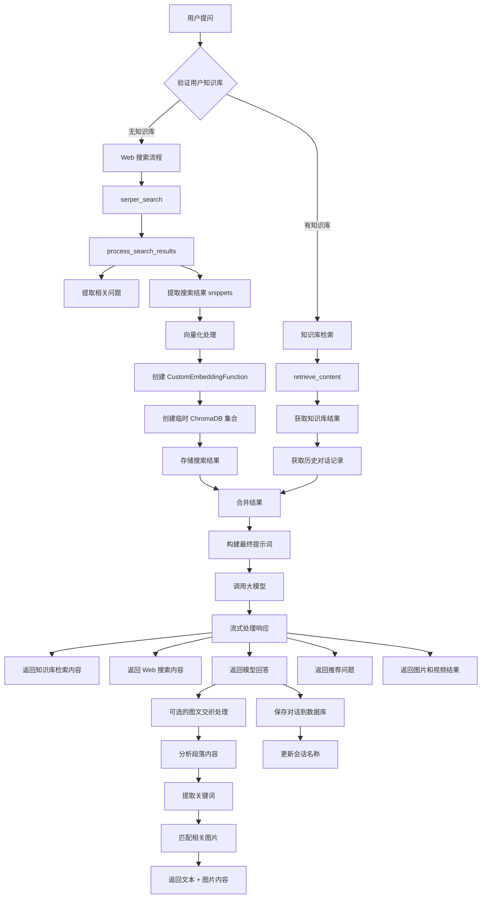
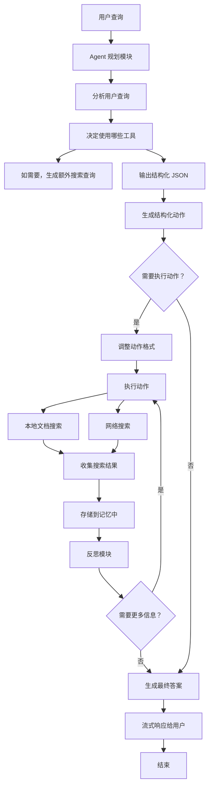

# 【Agent实战-第3天】代码结构详细解析

## 项目结构图

当前项目整体从用户提问进入，先判断用户是否有自己的知识库：如果没有知识库，则偏向 Web 搜索流程；如果有知识库，则进入知识库检索与 Web 搜索融合，最后生成答案并处理图文交织、会话保存等逻辑。



> 图中有部分节点在截图边缘被裁切，以上 Mermaid 仅保留当前批次可见结构。

## 项目入口

项目入口文件为 `app_main.py`，其中 FastAPI 集成了 3 个路由：用户、历史记录、AI 搜索。

```python
from fastapi import FastAPI
from router import history_rt, ai_search_rt, user_rt

app = FastAPI()

app.include_router(user_rt.router)
app.include_router(history_rt.router)
app.include_router(ai_search_rt.router)

if __name__ == "__main__":
    import uvicorn
    uvicorn.run(app, host="0.0.0.0", port=8000)
```

此处 FastAPI 集成 3 个路由，根据前端传递的路径，我们决定调用哪个路由。

- `user_rt` 核心关注用户登录注册。
- `history_rt` 关注对于历史消息的管理。
- 这里重点关注 `ai_search_rt`，可通过 `ctrl/command + 鼠标左键点击` 进入 `ai_research_rt.py`。

在 `ai_research_rt.py` 中，`create_session` 用于创建会话，`upload_files` 用于上传文档。详细解释参考【RAG实战-第8天】实战项目的简历准备、面试、运用（离线解析模块）中 1.2 模块。

本篇文档详细解析 `ai_search_rt.py` 中的两个核心接口：`ai_search` 和 `deep_research`。

## 1. AI 搜索接口 `/ai_search/`

当前端发送包含 `ai_search` 路径的请求时，会调用这个函数。

```python
@router.post("/ai_search/")
async def ai_search(
    session_id: str = Query(...),
    request: ChatRequest = Body(...),
):
```

这是一个混合搜索接口，结合了**本地知识库检索**和**网络搜索**，主要流程如下。

### 1.1 知识库检索

```python
# 验证用户知识库
has_knowledgebase = verify_user_knowledgebase(user_id)

if has_knowledgebase:
    # 执行知识库检索
    references = retrieve_content(user_id, question)
    knowledgebase_results = [ref["content_with_weight"] for ref in references]
```

- 首先验证用户是否有知识库。
- 如果有，从知识库中检索相关内容。

此处详细解释见：【RAG实战-第9天】实战项目的简历准备、面试、运用（在线召回模块）

### 历史上下文获取

```python
# 获取历史对话记录
history_questions = get_user_history_questions(session_id)
```

- 根据 `session_id` 获取历史对话内容。
- 用于维持对话的连续性。

### 1.2 Web 搜索集成

```python
# 执行网络搜索
top_snippets, related_questions = store_and_query_snippets(question)
web_results = [item["content"] for item in top_snippets]

# 合并搜索结果
final_reference = knowledgebase_results + web_results
```

- 执行网络搜索获取相关内容。
- 将知识库结果和网络搜索结果合并。

进入这个函数。

### 1.2.1 初始化阶段

```python
custom_embedding_fn = CustomEmbeddingFunction()
```

- 创建自定义嵌入函数实例，这个类实现了文本向量化功能。
- `CustomEmbeddingFunction` 内部使用 `generate_embedding` 函数将文本转换为向量。

### 1.2.2 搜索结果获取

```python
search_results = serper_search(question)
snippets, related_questions = process_search_results(search_results)
```

- 调用 `serper_search` 进行网络搜索。
- `process_search_results` 函数处理搜索结果，从代码可以看到它：
  - 提取 organic 搜索结果中的标题、链接和摘要。
  - 提取 peopleAlsoAsk 中的相关问题。
  - 返回两个列表：`snippets`（搜索结果）和 `questions`（相关问题）。

### process_search_results 函数说明

详细解释一下 `process_search_results` 这个函数。

#### 1. 函数功能

这个函数主要用于处理和解析 Serper API 返回的搜索结果，将其转换为更有用的格式。它从搜索结果中提取两类信息：

- 网页内容摘要（snippets）
- 相关问题（questions）

#### 2. 参数说明

```python
def process_search_results(search_results):
```

- `search_results`：一个字典类型参数，包含 Serper API 返回的原始 JSON 数据。

#### 3. 返回值

```python
return snippets, questions
```

返回一个元组，包含两个列表：

- `snippets`：包含网页内容摘要的列表。
- `questions`：包含相关问题的列表。

#### 4. 处理流程

##### a) 处理网页内容摘要

```python
if "organic" in search_results:
    for result in search_results["organic"]:
        message = {
            "title": result["title"],
            "url": result["link"],
            "content": result["snippet"]
        }
        snippets.append(message)
```

- 检查是否存在 `organic` 字段（这是 Serper API 返回的主要搜索结果）。
- 遍历每个搜索结果。
- 提取每个结果的关键信息：
  - `title`：网页标题。
  - `url`：网页链接。
  - `content`：网页内容摘要。
- 将提取的信息组织成字典并添加到 snippets 列表中。

##### b) 处理相关问题

```python
if "peopleAlsoAsk" in search_results:
    for question_data in search_results["peopleAlsoAsk"]:
        if "question" in question_data:
            questions.append(question_data["question"])
```

- 检查是否存在 `peopleAlsoAsk` 字段（这是 Serper API 返回的相关问题）。
- 遍历每个相关问题。
- 提取问题文本并添加到 questions 列表中。

#### 5. 使用示例

```python
# 假设这是 Serper API 返回的结果
search_results = {
    "organic": [
        {
            "title": "人工智能简介",
            "link": "https://example.com/ai",
            "snippet": "人工智能是计算机科学的一个分支..."
        }
    ],
    "peopleAlsoAsk": [
        {"question": "什么是机器学习？"},
        {"question": "人工智能的应用领域有哪些？"}
    ]
}

# 处理结果
snippets, questions = process_search_results(search_results)

# snippets 的结果将是：
# [
#     {
#         "title": "人工智能简介",
#         "url": "https://example.com/ai",
#         "content": "人工智能是计算机科学的一个分支..."
#     }
# ]
#
# questions 的结果将是：
# ["什么是机器学习？", "人工智能的应用领域有哪些？"]
```

#### 6. 实际应用

这个函数在系统中主要用于：

- 提取网页搜索结果的核心内容，用于 AI 回答的参考。
- 获取相关问题，用于生成推荐问题或扩展对话。
- 将非结构化的 API 响应转换为结构化的数据，便于后续处理。

#### 7. 数据格式说明

- `snippets` 列表中的每个元素是一个字典，包含：
  - `title`：网页标题。
  - `url`：网页链接。
  - `content`：网页内容摘要，用来存入 ChromaDB，做向量相似度排序。
- `questions` 列表中的每个元素是一个字符串，表示相关问题。

这个函数是整个搜索功能的重要组成部分，它通过结构化的方式处理搜索结果，使得后续的 AI 回答和用户交互能够更好地利用这些信息。

### 1.2.3 建立 ChromaDB 存储

```python
collection = chroma_client.create_collection(
    name="temp_snippets",
    embedding_function=custom_embedding_fn
)

for idx, snippet in enumerate(snippets):
    collection.add(
        documents=[snippet["content"]],
        metadatas=[{"title": snippet["title"], "url": snippet["url"]}],
        ids=[str(idx)]
    )
```

- 创建临时 ChromaDB 集合。
- 将每个搜索结果片段存入集合，包括：
  - 文档内容（content）
  - 元数据（标题和 URL）
  - 唯一 ID

### 1.2.4 相似度查询

```python
results = collection.query(
    query_texts=[question],
    n_results=top_k
)
```

- 使用原始问题在 ChromaDB 中进行相似度查询。
- 返回相似度最高的 `top_k` 条结果。

### 1.2.5 结果处理

```python
top_snippets = []
for i in range(len(results["ids"][0])):
    snippet_id = results["ids"][0][i]
    content = results["documents"][0][i]
    metadata = results["metadatas"][0][i]
    top_snippets.append({
        "title": metadata["title"],
        "url": metadata["url"],
        "content": content
    })
```

- 解析 ChromaDB 查询结果。
- 将结果重新组织成包含标题、URL 和内容的字典列表。

### 1.2.6 清理和返回

```python
chroma_client.delete_collection(name="temp_snippets")
return top_snippets, related_questions
```

- 删除临时 ChromaDB 集合以释放内存。
- 返回处理后的结果和相关问题。

### 1.3 大模型回答生成 `get_chat_completion`

```python
# 构建最终提示词
final_prompt = DirectAnswerPrompt % (
    final_reference,
    history_questions,
    question
)

# 返回流式响应
return StreamingResponse(
    get_chat_completion(
        session_id,
        question,
        knowledgebase_results,
        user_id,
        final_prompt,
        related_questions,
        top_snippets
    ),
    media_type="text/event-stream"
)
```

- 使用模板构建提示词。

```python
DirectAnswerPrompt = """
# Assistant Background

You are an assistant who can give accurate answers. Please give accurate
answers based on historical messages and Search results.

# General Instructions

Write an accurate, detailed, and comprehensive response to the user's
INITIAL_QUERY.
Additional context is provided as "USER_INPUT" after specific questions.
Your answer should be informed by the provided "Search results".
Your answer must be as detailed and organized as possible, prioritize the use
of lists, tables, and quotes to organize output structures.
Your answer must be precise, of high-quality, and written by an expert using
an unbiased and journalistic tone.

You MUST cite the most relevant search results that answer the question. Do
not mention any irrelevant results.
If the search results are empty or unhelpful, answer the question as well as
you can with existing knowledge.

You MUST ADHERE to the following formatting instructions:
- Use markdown to format paragraphs, lists, tables, and quotes whenever
  possible.
- Use headings level 4 to separate sections of your response, like "#### Header",
  but NEVER start an answer with a heading or title of any kind.
- Use single new lines for lists and double new lines for paragraphs.
- Use markdown to render images given in the search results.
- NEVER write URLs or links.

# Query type specifications

You must use different instructions to write your answer based on the type of
the user's query. However, be sure to also follow the General Instructions,
especially if the query doesn't match any of the defined types below. Here are
the supported types.

## Coding

You MUST use markdown code blocks to write code, specifying the language for
syntax highlighting, for example: javascript or python.
If the user's query asks for code, you should write the code first and then
explain it.

Don't apologise unnecessarily. Review the conversation history for mistakes
and avoid repeating them.

Before writing or suggesting code, perform a comprehensive code review of the
existing code.

You should always provide complete, directly executable code, and do not omit
part of the code.

## Search results

Here are the set of search results:

```
%s
```

## History Context

```
%s
```

Your answer MUST be written in the same language as the user question. For
example, if the user question is written in chinese, your answer should be
written in chinese too, if user's question is written in english, your answer
should be written in english too.
And here is the user's INITIAL_QUERY:

```
%s
```
"""
```

😎 以下是对该提示词（DirectAnswerPrompt）在结构和功能上的详细解释：

#### 提示词的目的

- **整体目的**：该提示词用来指导 AI 助手如何根据给定的搜索结果和历史上下文，为用户提供准确、详细且结构化的答案。它强调了答案的质量、内容的组织形式以及引用来源的方式。
- **目标场景**：当用户提出一个问题时，辅助系统会把搜索结果（如文档、网页信息）和历史信息提供给 AI 助手，然后 AI 助手根据提示词的规定，生成有引用来源且高质量的回复。

#### 提示词的结构

1. **Assistant Background**  
   说明了 AI 助手自身的身份，即“你是一个能给出准确答案的助手”。

2. **General Instructions**
   - 强调了要给出“准确、详细、有组织”的回答，引用相关来源。
   - 要用 markdown 进行排版，尤其在使用表格、列表和引用时。
   - 回答必须与搜索结果紧密结合，如有相关引用就要明确标注。

3. **Query type specifications**
   - 这是对“回答结构或格式”的进一步限制，根据不同类型的用户问题给出不同的排版格式。
   - 如果用户的问题与编程（Coding）相关，需要优先提供完整且可直接执行的代码，并用合适的语言标注代码块（例如 `python`、`javascript` 等）。
   - 如果搜索结果为空或与问题无关，也需要尽力回答，但仍要遵守通用格式要求。

4. **Search results**
   - 这里通常会放置搜索结果的文本内容，以便 AI 助手阅读并引用。
   - 提示词内用三重反引号包裹搜索结果，确保内容能够被助手识别并引用。

5. **History Context**
   - 这是提供给 AI 助手的对话或背景信息，可以让 AI 助手了解之前已经讨论过的内容，避免重复和冲突。

6. **User's INITIAL_QUERY**
   - 这是用户真正提出的问题。
   - 根据该问题，结合搜索结果和历史上下文，AI 助手要生成最终回答。

#### 关键的写作规则

- **语言一致性**：如果用户用中文提问，就必须用中文回答；如果用户用英文提问，就用英文回答。
- **Markdown 排版要求**：
  - 使用 `####` 级别的小标题分隔内容，但不能在答案开头就直接用标题。
  - 列表要使用单行换行，而段落间要空一行。
  - 对引用信息时建议用引号和 Markdown 格式。
- **引用搜索结果**：当某些信息在搜索结果中提供时，要在答案中引用这些结果，以示出处。例如在写完句子后，加上“（见搜索结果内容）”或直接提及来源，但不能写出 URL。
- **编写代码时**：
  - 一定要使用语言标注的 Markdown 代码块，如 `python`。
  - 保持代码可完整执行。
  - 先写代码，然后再进行解释说明。

> 通过流式响应返回大模型生成的回答。

详细解释一下 `get_chat_completion` 函数的实现和工作流程。

#### 1. 函数概述

`get_chat_completion` 是一个生成器函数，用于处理流式聊天响应。它实现了以下主要功能：

- 调用大语言模型进行对话。
- 处理流式响应。
- 返回知识库检索结果。
- 返回网络搜索结果。
- 生成推荐问题。
- 处理图片和视频搜索结果。

#### 2. 参数说明

```python
def get_chat_completion(
    session_id,          # 会话ID
    question,            # 用户问题
    retrieved_content,   # 知识库检索内容
    user_id,             # 用户ID
    final_prompt,        # 最终提示词
    related_questions,   # 相关问题
    snippets             # Web搜索片段
)
```

#### 3. 主要流程解析

##### 3.1 初始化和 API 调用

```python
client = OpenAI(
    api_key=os.getenv("DASHSCOPE_API_KEY"),
    base_url="https://dashscope.aliyuncs.com/compatible-mode/v1"
)

completion = client.chat.completions.create(
    model="deepseek-r1",
    messages=[{"role": "user", "content": final_prompt}],
    stream=True,
)
```

这里使用阿里云的 DashScope API，采用流式输出模式。

##### 3.2 返回检索内容

```python
# 返回知识库检索内容
message = {"documents": retrieved_content}
yield f"event: message\ndata: {json.dumps(message)}\n\n"

# 返回 web 搜索内容
message = {"web_search": snippets}
yield f"event: message\ndata: {json.dumps(message)}\n\n"
```

使用 Server-Sent Events（SSE）格式返回检索结果。

##### 3.3 处理流式响应

```python
model_answer = ""  # 存储完整回答
think = ""         # 存储思考过程

for chunk in completion:
    if chunk.choices[0].finish_reason == "stop":
        # 处理结束逻辑
        pass
    else:
        delta = chunk.choices[0].delta
        if delta.content:
            # 处理回答内容
            model_answer += delta.content
            message = {
                "role": "assistant",
                "content": delta.content,
                "thinking": False,
            }
            yield f"event: message\ndata: {json.dumps(message)}\n\n"
        else:
            # 处理思考过程
            think += delta.reasoning_content
            message = {
                "role": "assistant",
                "content": delta.reasoning_content,
                "thinking": True,
            }
            yield f"event: message\ndata: {json.dumps(message)}\n\n"
```

##### 3.4 完成时的处理

当响应完成时：

1. 返回推荐问题。
2. 进行图片搜索。
3. 进行视频搜索。
4. 将对话保存到数据库。
5. 更新会话名称。

```python
if chunk.choices[0].finish_reason == "stop":
    # 返回推荐问题
    yield f"event: message\ndata: {json.dumps({'recommended_questions': related_questions})}\n\n"

    # 返回图片和视频搜索结果
    image_results = serper_images(q=question, hl="zh-cn")
    video_results = serper_videos(q=question, hl="zh-cn")

    # 保存对话记录
    write_chat_to_db(
        session_id,
        question,
        model_answer,
        retrieved_content,
        related_questions,
        think
    )

    # 更新会话名称
    update_session_name(session_id, question, user_id)
```

#### 错误处理

```python
except Exception as e:
    error_message = {
        "role": "error",
        "content": str(e)
    }
    yield f"event: error\ndata: {json.dumps(error_message)}\n\n"
```

发生异常时，以 SSE 格式返回错误信息。

### 1.4 图文交织

> 🤔 **思考题：如果想做图文交织怎么办**  
> 即从检索到的图片中找到最合适的放到对应的段落后面。

主要思路是在大模型回答时，分析文本内容并在适当位置插入相关图片。以下是具体实现方案：

此处未在实战代码中，为延伸与拓展内容，需要用到第 10 周多模态理论基础。

#### 1. 修改 `get_chat_completion` 函数

```python
def get_chat_completion(session_id, question, retrieved_content, user_id,
                        final_prompt, related_questions, snippets):
    try:
        # ... 现有的初始化代码 ...

        # 提前获取图片结果
        image_results = serper_images(q=question, hl="zh-cn")

        # 处理流式响应
        model_answer = ""       # 用于存储大模型的回答
        think = ""              # 用于存储思考过程
        current_paragraph = ""  # 用于存储当前段落

        for chunk in completion:
            if chunk.choices[0].finish_reason == "stop":
                # 处理最后一个段落
                if current_paragraph:
                    final_content = process_paragraph_with_images(current_paragraph, image_results)
                    message = {
                        "role": "assistant",
                        "content": final_content,
                        "thinking": False,
                        "is_end_of_paragraph": True
                    }
                    yield f"event: message\ndata: {json.dumps(message)}\n\n"

                # ... 其他结束处理逻辑 ...
            else:
                delta = chunk.choices[0].delta
                if delta.content:
                    model_answer += delta.content
                    current_paragraph += delta.content

                    # 检查是否是段落结束
                    if delta.content.endswith("。") or delta.content.endswith("！") or delta.content.endswith("？"):
                        # 处理当前段落并插入图片
                        final_content = process_paragraph_with_images(current_paragraph, image_results)
                        message = {
                            "role": "assistant",
                            "content": final_content,
                            "thinking": False,
                            "is_end_of_paragraph": True
                        }
                        json_message = json.dumps(message)
                        yield f"event: message\ndata: {json_message}\n\n"
                        current_paragraph = ""  # 重置当前段落
                    else:
                        message = {
                            "role": "assistant",
                            "content": delta.content,
                            "thinking": False,
                            "is_end_of_paragraph": False
                        }
                        json_message = json.dumps(message)
                        yield f"event: message\ndata: {json_message}\n\n"
                else:
                    # ... 处理思考过程的代码 ...
```

#### 2. 添加段落处理和图片匹配函数

```python
import jieba
from collections import Counter

def process_paragraph_with_images(paragraph: str, image_results: list) -> dict:
    """
    处理段落并匹配相关图片

    :param paragraph: 文本段落
    :param image_results: 图片搜索结果列表
    :return: 包含文本和图片的字典
    """
    # 提取段落关键词
    keywords = extract_keywords(paragraph)

    # 匹配最相关的图片
    matched_image = match_image_for_keywords(keywords, image_results)

    return {
        "text": paragraph,
        "image": matched_image if matched_image else None
    }

def extract_keywords(text: str, top_k: int = 3) -> list:
    """
    提取文本中的关键词

    :param text: 输入文本
    :param top_k: 返回前 k 个关键词
    :return: 关键词列表
    """
    # 使用结巴分词进行分词
    words = jieba.cut(text)

    # 过滤停用词（这里可以加入自定义的停用词表）
    stop_words = {"的", "了", "和", "是", "在", "我们", "可以", "这个", "那个", "就是"}
    words = [w for w in words if len(w) > 1 and w not in stop_words]

    # 统计词频
    word_freq = Counter(words)

    # 返回出现频率最高的 top_k 个词
    return [word for word, _ in word_freq.most_common(top_k)]

def match_image_for_keywords(keywords: list, image_results: list) -> dict:
    """
    根据关键词匹配最相关的图片

    :param keywords: 关键词列表
    :param image_results: 图片搜索结果
    :return: 最匹配的图片信息
    """
    if not image_results:
        return None

    best_match = None
    highest_score = -1

    for image in image_results:
        score = calculate_relevance_score(
            keywords,
            image.get("title", ""),
            image.get("snippet", "")
        )
        if score > highest_score:
            highest_score = score
            best_match = {
                "url": image.get("imageUrl"),
                "title": image.get("title"),
                "source": image.get("source")
            }

    return best_match if highest_score > 0 else None

def calculate_relevance_score(keywords: list, title: str, snippet: str) -> float:
    """
    计算关键词与图片的相关性得分

    :param keywords: 关键词列表
    :param title: 图片标题
    :param snippet: 图片描述
    :return: 相关性得分
    """
    score = 0
    text = (title + " " + snippet).lower()

    for keyword in keywords:
        if keyword.lower() in text:
            score += 1
            # 标题匹配给予更高权重
            if keyword.lower() in title.lower():
                score += 0.5

    return score / len(keywords)
```

#### 3. 前端处理修改

在前端需要相应地处理包含图片的消息格式：

```vue
<template>
  <div class="chat-message">
    <div v-for="(content, index) in message.content" :key="index">
      <!-- 文本内容 -->
      <div v-if="content.text" class="message-text">
        {{ content.text }}
      </div>

      <!-- 图片内容 -->
      <div v-if="content.image" class="message-image">
        
        <div class="image-caption">{{ content.image.title }}</div>
      </div>
    </div>
  </div>
</template>

<style scoped>
.chat-message {
  margin: 10px 0;
}

.message-text {
  margin-bottom: 10px;
}

.message-image {
  margin: 10px 0;
  max-width: 100%;
}

.message-image img {
  max-width: 300px;
  border-radius: 8px;
  cursor: pointer;
}

.image-caption {
  font-size: 12px;
  color: #666;
  margin-top: 4px;
}
</style>
```

#### 4. 使用说明

这个实现方案的主要特点：

1. **分段处理**：
   - 按照句子结束符（。！？）分割文本。
   - 每个段落单独处理并匹配相关图片。
2. **智能匹配**：
   - 使用结巴分词提取关键词。
   - 根据关键词与图片标题、描述的匹配度选择最相关的图片。
3. **流式处理**：
   - 保持了原有的流式输出特性。
   - 在段落结束时才插入图片，保证阅读流畅性。
4. **灵活配置**：
   - 可以调整关键词提取数量。
   - 可以自定义相关性评分算法。
   - 可以设置图片匹配阈值。

#### 5. 优化建议

1. **缓存优化**：
   - 可以缓存已处理的图片匹配结果。
   - 预加载下一段可能用到的图片。
2. **相关性算法优化**：
   - 可以引入更复杂的 NLP 算法。
   - 考虑使用向量相似度计算。
3. **用户体验优化**：
   - 添加图片加载状态。
   - 支持图片预览和放大。
   - 允许用户关闭图文混排功能。

## 2. 深度研究接口 `/deep_research/`

这是一个专门用于深度分析的接口，相比普通搜索可能进行更深入的推理。



> 深度研究流程图在当前截图中上下均有裁切，Mermaid 保留了可见的主干：规划、动作执行、搜索、记忆、反思、生成最终答案。

```python
@router.post("/deep_research/")
async def deep_research(
    session_id: str = Query(...),
    request: ChatRequest = Body(...),
):
    try:
        question = request.message
        return StreamingResponse(
            final_answer(question),
            media_type="text/event-stream"
        )
```

下面的讲解会从代码函数的角度逐步分析执行流程，并解释它们在流程中的位置与作用。请同时参考前面的流程图以及代码本身，以便更好地理解。

### 1. 入口：`final_answer(user_query)`

从最外层来看，整个流程的入口是 `final_answer(user_query)` 这个函数。它做了以下几件事情。

#### 1. 初始化 OpenAI 客户端

```python
client = OpenAI(
    api_key=os.getenv("DASHSCOPE_API_KEY"),
    base_url="https://dashscope.aliyuncs.com/compatible-mode/v1"
)
```

这里用的是一个类似 OpenAI 接口的客户端对象 `OpenAI()`，可以与大模型进行对话，指定模型参数等。

#### 2. 调用规划模块获取初步动作 `agent_plan`

```python
action_tool = agent_plan(user_query)
```

- `agent_plan` 是规划模块，会根据用户的查询决定后续要使用哪些工具（“本地文档搜索”/“网络搜索”）以及要提哪些子问题（prompts）。

#### 3. 如果返回了动作，格式调整后再去执行

```python
if action_tool:
    adjusted_tools = adjust_format(action_tool)
    actions = adjusted_tools
else:
    actions = []
```

- 如果 `agent_plan` 返回了结构化 JSON，就会对该 JSON 进行“扁平化”处理（一个 prompt 对应一条动作），得到新的 `actions` 列表。
- 如果没有动作（返回 `None` 或空），则跳过搜索阶段。

#### 4. 对每个动作进行 SSE（Server-Sent Events）通知，并执行搜索

```python
for action in actions:
    # 先把“将要执行的动作”通过 SSE 通知
    message = {
        "role": "agent",
        "content": f"正在执行{action_name}: '{prompt}'"
    }
    json_message = json.dumps(message)
    yield f"event: message\ndata: {json_message}\n\n"
    memory_new = process_actions(actions)
```

- 这里先把“我接下来要执行什么动作”通过流式消息（`yield`）的方式发给前端（或调用方）。
- 然后调用 `process_actions(actions)` 依次执行动作（无论是“本地文档搜索”还是“网络搜索”）。

#### 5. 将刚才的搜索结果保存到 `memory_global`

```python
memory_global = []
memory_global.extend(list(memory_new)[1:])
```

- 这里拿到了 `process_actions(actions)` 返回的搜索结果，放进一个全局记忆列表里，供后续回答之用。

#### 6. 反思模块 `reflection`

```python
action_reflect = reflection(user_query, memory_global)
if action_reflect:
    # 如果需要更多信息，再执行一次额外搜索
    memory_new = process_actions(actions)
    memory_global.extend(memory_new)
```

- 这一步再次调用 `reflection(user_query, memory_global)`，让大模型判断是否需要补充更多信息。
- 如果又返回了新的搜索动作，就继续调用 `process_actions`，并把结果加到 `memory_global`。

#### 7. 构造最终回答的提示并调用大模型进行回答

```python
final_prompt = f'''
    你是一个星辰电动ES9的智能销售助手...
    参考内容:
    {memory_global}

    用户问题: {user_query}
'''
```

- 这里将所有记忆中的搜索结果和用户原始问题拼成一个大字符串作为 prompt，最终用大模型生成回答。
- 返回的回答在这里以流式的形式（`stream=True`）输出，每次拿到一小段就用 `yield` 传给调用方。
- 当回答结束时，会发送结束事件 `event: end\ndata: [DONE]\n\n`。

### 8. 规划模块：`agent_plan(query)`

这是 Agent 规划模块的核心函数，用于根据用户的查询决定要执行哪些动作。它内部做了以下事情。

#### 1. 构造提示并调用大模型

```python
prompt = '''
汽车销售助手Agent的Plan模块
你是一个专业的汽车销售助手的规划模块...
'''.format(query)
result = middle_json_model(prompt)
```

- 这段提示（prompt）内容包含了工具选择规则（本地文档/网络搜索），以及如何把问题拆解成子问题并输出 JSON。

#### 2. 解析返回的 JSON

```python
json_list = extract_json_content(result)
try:
    structure_output = json.loads(json_list)
except:
    structure_output = None
return structure_output
```

- `middle_json_model` 返回的是一段文本，其中嵌着 `[...]` 形式的 JSON。
- 这里用 `extract_json_content` 去提取最外层 `[` 与 `]` 之间的字符串，然后再用 `json.loads` 尝试解析成 Python 对象。
- 如果解析失败，说明这次返回不可用数据，就记为 `None`。

在得到这个结构化数据之后，后续才知道要不要搜索、搜索什么。

### 2. “中间模型”调用：`middle_json_model(prompt)`

这里看到的“中间模型”函数是：

```python
def middle_json_model(prompt):
    client = OpenAI(...)
    completion = client.chat.completions.create(
        model="qwen-plus",
        messages=[
            {"role": "system", "content": "You are a helpful assistant."},
            {"role": "user", "content": prompt},
        ],
        response_format={"type": "json_object"}
    )
    return completion.choices[0].message.content
```

- 这个函数是对大模型的封装，把我们编好的 `prompt` 发给模型 `qwen-plus`。
- 由于指定了 `response_format={"type": "json_object"}`，模型会倾向于返回 JSON 结构。
- 最终返回的文本一般会是一段包含 JSON 的字符串。

### 3. JSON 提取：`extract_json_content(input_str)`

```python
pattern = r'(\[[\s\S]*\])'
match = re.search(pattern, input_str)
return match.group(1) if match else None
```

- 简单的正则函数，从一段文本里提取第一个 `[` 到最后一个 `]` 之间的所有内容。
- 这一步通常是为了应对大模型输出里可能有额外文本或前后缀，只想取中间的 JSON。

### 4. 调整动作格式：`adjust_format(original_data)`

#### 为什么需要它？

我们提到，在规划模块的输出中，`prompts` 往往是一个数组，包含多个子问题，但我们执行动作时想让**一个问题对应一次执行**，方便统一处理。

#### 函数逻辑

```python
def adjust_format(original_data):
    adjusted_data = []

    for item in original_data:
        action_name = item["action_name"]
        prompts = item["prompts"]

        # 为每个 prompt 创建一个新的字典
        for prompt in prompts:
            adjusted_item = {
                "action_name": action_name,
                "prompt": prompt
            }
            adjusted_data.append(adjusted_item)

    return adjusted_data
```

- 遍历每一个动作对象 `item`，比如其中有 `"action_name": "本地文档搜索"`、`"prompts": ["问题1", "问题2"]`。
- 对每个子问题分别生成一条新的动作记录。
- 最终返回一个列表，其格式类似：

```python
[
    {"action_name": "本地文档搜索", "prompt": "问题1"},
    {"action_name": "本地文档搜索", "prompt": "问题2"},
]
```

### 5. 执行动作：`process_actions(actions)`

这是执行所有搜索动作的核心逻辑。

```python
def process_actions(actions):
    memory = []

    for action in actions:
        action_name = action["action_name"]
        prompt = action["prompt"]

        print(f"正在执行{action_name}: '{prompt}'")

        try:
            if action_name == "本地文档搜索":
                result = rag(prompt)  # 调用本地 RAG 搜索
            elif action_name == "网络搜索":
                result = web_search_answer(prompt)  # 调用网络搜索
            else:
                result = f"未知的动作类型: {action_name}"

            memory_item = {
                "提问": prompt,
                "结果": result
            }
            memory.append(memory_item)

            # 下面是一些打印用于调试和查看输出
            print(f"提问: {prompt}")
            print(f"结果: {result}")
            print("---------------------")

        except Exception:
            # 如果执行过程中出错，先跳过
            print("---------------------")
            continue

    print("所有执行动作已完成，结果已添加到 memory 中。")
    return memory
```

- 初始化 `memory = []`，用来收集搜索过程中的问答对。
- 循环遍历每个动作：
  - 如果 `action_name == "本地文档搜索"`，就调用 `rag(prompt)`。
  - 如果 `action_name == "网络搜索"`，就调用 `web_search_answer(prompt)`。
- 把搜索结果保存成：

```python
memory_item = {
    "提问": prompt,
    "结果": result
}
memory.append(memory_item)
```

- 返回给上层，供后续合并到全局记忆中（`memory_global`）。

### 6. 本地文档搜索：`rag(query)`

这是一个封装了“检索增强生成（RAG）”或简单“文档检索”的函数：

```python
def rag(query):
    indexNames = "1"
    rag_results = retrieve_content(indexNames, query)
    return rag_results
```

- 它内部调用了 `retrieve_content`，传入一个 `indexNames` 和 `query`。
- `retrieve_content` 才是真正在本地的索引里搜索。理论上，这里可能有一个向量数据库或倒排索引之类，把和“星辰电动 ES9”相关的文档都存好了，做全文检索并返回最相关片段。

### 7. 网络搜索：`web_search_answer(query)`

这是一个封装了网络搜索的函数：

```python
def web_search_answer(query):
    web_results, related_questions = store_and_query_snippets(query)
    return web_results
```

- 通过 `store_and_query_snippets(query)` 调用一个类似搜索引擎的工具，从互联网上收集匹配信息，然后只返回 `web_results`。

### 8. 反思模块：`reflection(user_query, memory_global)`

这是一个**再次调用大模型**来判断是否需要更多查询的地方。

```python
def reflection(user_query, memory_global):
    prompt = '''
    你是一个专业的汽车销售助手...
    '''.format(user_query, memory_global)

    result = middle_json_model(prompt)
    json_list = extract_json_content(result)
    try:
        structure_output = json.loads(json_list)
    except:
        structure_output = None
    return structure_output
```

- 构造 prompt，把当前已经获得的 `memory_global`（所有搜索结果）一起发给大模型，让它知道我们已经掌握了哪些信息。
- 让模型判断是否需要更多搜索。如果需要，它会像之前一样，输出一个 JSON，例如：

```json
[
  {
    "action_name": "网络搜索",
    "prompts": ["特斯拉Model Y自动驾驶功能"]
  }
]
```

- 如果返回 `None` 或空，说明我们已经足够回答问题，不需要再搜索。

### 9. 最终回答：在 `final_answer` 的最后部分

如果不需要再搜或者完成了追加搜索，就会把 `memory_global` 中所有的信息拼接成一个更大的 prompt，再次调用大模型生成面向用户的自然语言回答。核心代码片段如下：

```python
final_prompt = f'''
    你是一个星辰电动ES9的智能销售助手...
    参考内容:
    {memory_global}

    用户问题: {user_query}
'''
completion = client.chat.completions.create(
    model="deepseek-r1",
    messages=[
        {"role": "user", "content": final_prompt}
    ],
    stream=True,
)
```

- 这个时候，大模型已经可以看到所有的搜索结果（也就是 `memory_global` 中的内容）。
- 将这部分信息作为“上下文”，让大模型在回答时参考它们，并针对用户的问题给出最准确的解答。
- 接下来就用流式的方式把回答返回给前端或调用方。

### 10. 流式输出（SSE）

在 `final_answer` 里，我们看到类似下面的结构：

```python
for chunk in completion:
    if chunk.choices[0].finish_reason == "stop":
        yield "event: end\ndata: [DONE]\n\n"
        break
    else:
        # 实时输出
        delta = chunk.choices[0].delta
        if delta.content:
            message = {
                "role": "assistant",
                "content": delta.content,
                "thinking": False,
            }
            json_message = json.dumps(message)
            yield f"event: message\ndata: {json_message}\n\n"
```

- `for chunk in completion`：会不断从大模型接口获取下一段生成的文本。
- 每次拿到数据，就用 SSE 的格式 `event: message\ndata: ...\n\n` 返回给客户端，这样用户就会看到一行行文字逐渐出现。
- 当检测到 `finish_reason == "stop"`，说明大模型已经输出完毕，就发送 `event: end\ndata: [DONE]\n\n` 表示流式输出结束。

## 总结

从代码层面，大体可以分为以下几个核心点：

1. **入口函数 `final_answer(user_query)`**：
   - 初始化大模型客户端；
   - 调用规划模块 `agent_plan`，拿到动作；
   - 如果有动作，用 `adjust_format` 扁平化后，通过 `process_actions` 一一执行；
   - 收集执行结果到 `memory_global`；
   - 使用反思模块 `reflection` 检查是否需要再次搜索；
   - 最后组合所有已知信息生成最终回答，并以流式形式输出。

2. **规划模块 `agent_plan(query)`**：
   - 调用中间模型 `middle_json_model`，用事先写好的模板让模型输出 JSON 格式的搜索动作；
   - 提取 JSON，返回结构化数据或返回 None。

3. **工具执行 `process_actions(actions)`**：
   - 对于每条动作，判断 `action_name`，调用对应函数：
     - `"本地文档搜索"` -> `rag()`
     - `"网络搜索"` -> `web_search_answer()`
   - 把提问和搜索结果存入 `memory`，最后返回。

4. **本地搜索 `rag(query)` & 网络搜索 `web_search_answer(query)`**：
   - 这两个函数做实际的检索或网络查询，返回对应的内容。

5. **反思模块 `reflection(user_query, memory_global)`**：
   - 与规划模块类似，也是调用 `middle_json_model` 来判断需不需要额外搜索。

6. **最终回答**：
   - 将 `memory_global` 与用户问题打包成一个提示，调用大模型生成完整回答；
   - 以 SSE 方式将回答逐渐返回给用户，直到结束。

因此，从代码层面去理解，这套逻辑就是：

- 先由大模型生成“要搜什么、怎么搜”的指令 ->
- 再去执行本地或网络搜索 ->
- 将搜索结果放到 `memory_global` ->
- 可选地再次反思/重复搜索 ->
- 最终由大模型基于所有资料进行答复。
