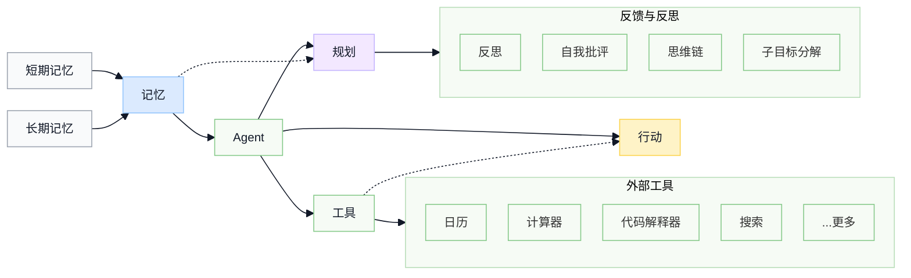
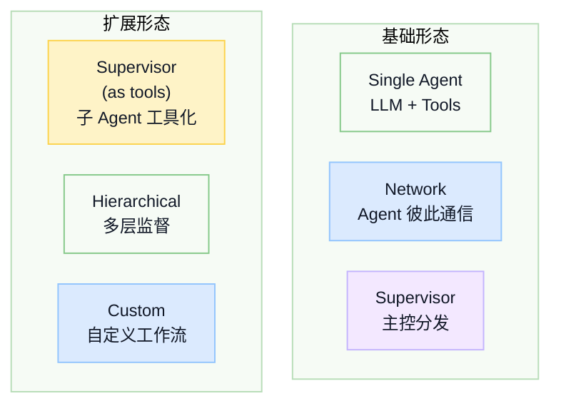
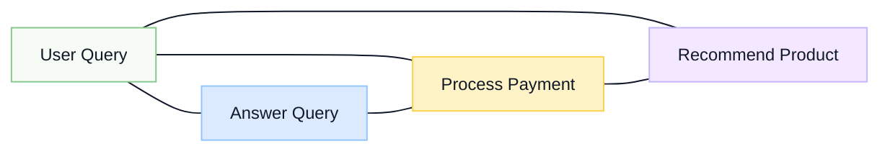
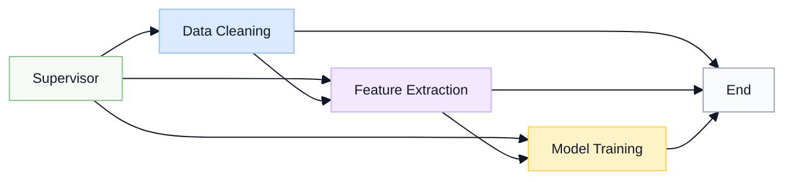
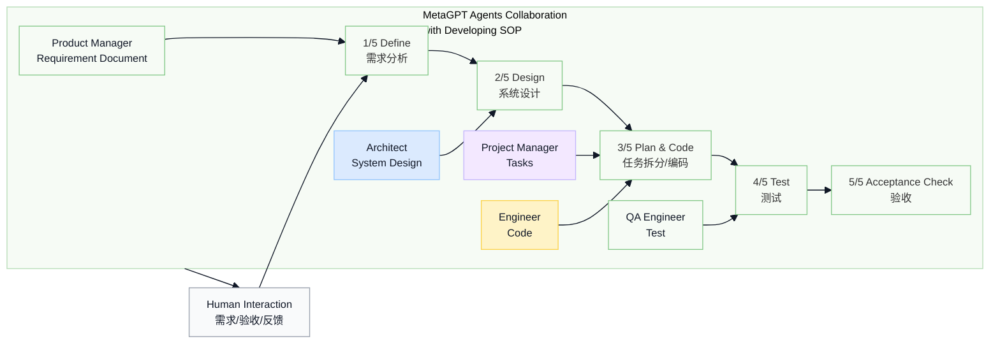

# 【第三周】技术破局：Agent 最新框架性技术与强化学习（RL）综述

> 🏅 **2025 大模型算法工程师求职关键词：Agent**
>
> - **Multi-Agent 架构**：不同的场景如何选择架构
> - **上下文工程**：牛逼的提示词工程师是怎么重要，是基于对业务的深度理解
> - **Memory**：如何设计系统化的分层记忆系统
> - **Agent + SFT**：下节课直接上手
> - **Agent + RL**：牛逼的提示词工程师也没辙了怎么办
>
> 多智能体架构到记忆/技能规划、奖励设计。  
> 无论是写简历、面试、算法工作，都是遵循我们今天讲解的框架。

## 1. 什么是 Agent

### 1.1 什么是 LLM Agent

- **定义与作用**：LLM Agent 是在大型语言模型（Large Language Model，简称 LLM）之上构建的智能系统，它不仅仅回复文本，还能根据目标进行推理、规划并调用工具来完成任务。NVIDIA 技术博客指出，尽管目前尚无统一定义，但 LLM Agent 可被描述为一种系统，它利用 LLM 来分析问题，制定解决计划，并借助工具执行这些计划。TrueFoundry 在 2025 年的介绍中进一步指出，LLM Agent 可以**计划、推理、调用工具、维护记忆，并自主完成多步骤任务**，把被动的语言模型转变为目标驱动的 AI 实体。

- **区别于普通 LLM**：普通 LLM 接收单个提示并生成一次性文本，而 LLM Agent 具有目标和循环过程：它评估任务，决定下一步动作（如调用工具或检索数据），观察结果，然后继续执行，直到达到目标。因此，LLM Agent 可以对复杂问题进行分解，逐步解决并整合结果。

- **关键能力**：
  - **推理与规划**：代理需要对用户问题进行推理并规划任务步骤。
  - **记忆**：代理拥有短期与长期记忆，用于记录对话内容和历史动作，使其能够维持上下文、适应用户需求。
  - **工具调用**：代理可以调用外部 API、代码解释器、搜索引擎等工具执行子任务。
  - **自我反思**：通过 ReAct、Reflexion 等框架，代理可以根据观察到的结果反思并改进计划。

Agent 的核心思路是以 LLM 作为“中央计算引擎”，通过合理的提示、记忆模块和工具调用来解决需要多步骤推理和信息检索的任务。这使 Agent 能够处理比简单查表更复杂的提问。

> 🏅 **以后有人问你 Agent 是什么，你就说这两句话**
>
> 1. 能够端到端地去替代人完成一个多步骤的任务，**完整地结合行业 know-how**。
> 2. 具有**规划、工具调用、记忆、行动、反思**的能力。

### 1.2 构成与工作机制

LLM Agent 通常采用模块化架构，每个模块承担不同职责：

| 模块 | 作用 |
| --- | --- |
| Agent Core（核心） | 使用 LLM 作为“决策大脑”，定义代理的总体目标、可用工具和计划策略。 |
| Memory（记忆模块） | 用于存储代理的内部日志与用户交互，包括短期记忆（单次任务的思路轨迹）和长期记忆。记忆通过重要性、语义相似度和时间等指标检索。 |
| Tools（工具模块） | 代理可调用的可执行工作流，例如搜索 API、数据库查询、代码解释器或数学计算。 |
| Planning（规划模块） | 帮助代理将复杂问题分解为多个子任务，并确定执行顺序。常用 Tree-of-Thoughts 推理方法和自我反思机制。 |
| Observation & Feedback（观察反馈） | 在执行任务过程中，代理获取工具输出并判断是否满足目标，不满足则重新规划。 |

### 1.3 工作流程

1. **接受任务**：代理接收用户的请求或目标，并通过提示模板定义角色、可用工具和行为原则。请求越详细，代理的表现通常越好。
2. **分析与计划**：代理使用 LLM 对请求进行理解和推理，可能将任务分解为多个步骤，并选择合适的策略。指出代理会规划、它将目标分解为可执行步骤。
3. **调用工具**：代理在决策过程中会判断是否需要调用外部工具，如检索知识数据库、运行代码、查询 API 等。TrueFoundry 文库总结了典型的流程：任务初始化、生成计划、选择并调用工具、观察结果、持续迭代，直到完成目标。
4. **维护记忆与适应**：代理在执行中维护短期和长期记忆，以便在对话中保持上下文、学习用户偏好，并在需要时利用以往经验。
5. **反思和迭代**：复杂任务常需要多次迭代。规划模块可使用反思（Reflection）或批判机制对输出进行评估并调整下一步计划。

### 1.4 架构图示

#### 基础 Agent 架构

#### Memory-Enhanced AI Agent Architecture

```mermaid
%%{init: {"theme": "base", "flowchart": {"nodeSpacing": 22, "rankSpacing": 30, "padding": 10}, "themeVariables": {"fontSize": "12px", "primaryColor": "#F6FBF5", "primaryBorderColor": "#86C98A", "clusterBkg": "#F6FBF5", "clusterBorder": "#B8DDB8", "lineColor": "#111827"}}}%%
flowchart LR
    User["User Request"]:::neutral
    Core["Agent Core<br/>(LLM + Enhanced Prompt)<br/>- 理解用户意图<br/>- 生成记忆上下文<br/>- 生成执行策略"]:::green
    Planning["Planning Module"]:::purple
    Tools["Tool(s)<br/>APIs / Functions / Databases / Services"]:::yellow

    subgraph Memory["Memory Module"]
        direction LR
        Extractor["Memory<br/>Extractor"]:::blue
        Retriever["Memory<br/>Retriever"]:::blue
    end

    subgraph Details["Memory System Details"]
        direction TB
        D1["1. Memory Storage<br/>User preferences<br/>Conversation history<br/>Task context"]
        D2["2. Memory Processing<br/>Extraction information<br/>Selective retrieval<br/>Context enhancement"]
    end

    subgraph Workflow["Workflow Process"]
        direction TB
        W1["1. User sends request"]
        W2["2. Retrieve relevant memory"]
        W3["3. Process with context"]
        W4["4. Plan & execute actions"]
        W5["5. Store new information"]
    end

    User -->|"Query"| Core
    Core -->|"Response"| User
    Memory <-->|"Store/Retrieve<br/>Context"| Core
    Core -->|"Task<br/>Strategy"| Planning
    Core -->|"Execute"| Tools
    Details -.-> Memory
    Workflow -.-> Core

    classDef green fill:#F6FBF5,stroke:#86C98A,color:#111827;
    classDef blue fill:#DBEAFE,stroke:#93C5FD,color:#111827;
    classDef purple fill:#F3E8FF,stroke:#C4B5FD,color:#111827;
    classDef yellow fill:#FEF3C7,stroke:#FCD34D,color:#111827;
    classDef neutral fill:#F9FAFB,stroke:#9CA3AF,color:#111827;
```

> 🏅 **所以，Agent 开发、算法的核心就 3 个：**
>
> 1. 系统化的工程，如何规划得好、并且不冗余（好、准、快），整体任务能够跑通的核心。
> 2. 长短期记忆怎么实现，如何更新、复用“用户”。
> 3. toolcall，工具怎么调用地准。

> 🏅 **到这里，就是你简历上要写的，面试中要讲的内容框架，是什么？**
>
> 1. 端到端的系统工程的设计：业务的深度理解（专家是怎么做的）。
> 2. 系统层面的优化 + 评估（上下文工程，Memory，工具的设计）：传统开发可 plan，Agent 是不可 plan，**Agent 有非常明显的跳跃性**。
> 3. 怎么把工具调准（提示词 + SFT + RL）。

## 2. Agent 架构

> 🏅 **现在最好用的 AI coding 是什么？**
>
> 1. 如果从 0-1 搭建系统，或者写代码，一定是 Claude Code，断层领先。
> 2. 如果读代码，Cursor 很方便。

### 2.1 Multi-Agent 架构

参考：[Anthropic Multi-Agent Research System](https://www.anthropic.com/engineering/multi-agent-research-system)

> 🏅 从一个**牛逼的 AI 原型（多智能体系统）**到一个可靠、可扩展的生产级产品之间存在的**巨大鸿沟**。多智能体系统是扩展 AI 能力以解决复杂、开放式问题的强大范式，但其成功在很大程度上依赖于：
>
> - 精密的系统架构。
> - 巧妙的提示工程。
> - 严格的评估方法。
> - 定制化的模型训练。
> - 稳健的软件工程。

系统设计：`xx 是核心，xx 是灵魂？`

- 提示词工程
- 评估方法

#### 2.1.1 为什么要多 Agent

**Agent 系统：**

Agent（代理）是一个使用大语言模型（LLM）来决定应用程序控制流的系统。随着系统的发展，可能会遇到以下问题：

- Agent 拥有过多的工具，导致它在决定调用哪个工具时做出不佳的决策。（2000 个工具）
- 上下文、任务场景变得过于复杂，单个 Agent 无法处理。
- 系统需要多个专门化的领域（例如，规划者、研究员、数学专家等）。

为了解决这些问题，可以考虑将应用程序拆分成多个较小的、独立的 Agent，并将它们组合成一个多 Agent 系统。这些独立的 Agent 可以简单到仅仅是一个提示和 LLM 调用，也可以复杂到类似于 ReAct Agent（反更多）。

**使用多 Agent 系统的主要优势：**

1. **模块化**：将 Agent 分离可以更容易地开发、测试和维护 Agent 系统。
2. **专门化**：可以创建专门的 Agent，专注于特定领域，从而提升系统整体性能。
3. **控制**：可以显式地控制 Agent 之间的通信（而不是依赖于函数调用）。

#### 2.1.2 多 Agent 架构有哪些

- **网络架构**：每个 Agent 可以与所有其他 Agent 进行通信，任何 Agent 都可以决定调用下一个 Agent。适用于没有明确 Agent 顺序或依赖关系的问题。
- **监督架构**：每个 Agent 只与一个监督 Agent 通信，监督 Agent 决定下一个调用哪个 Agent。
- **监督（工具调用）**：在这种变体中，监督 Agent 负责调用子 Agent。子 Agent 作为工具暴露给监督 Agent，监督 Agent 决定调用哪个工具。监督 Agent 通常运行在一个 `while` 循环中，调用工具直到决定停止。
- **层次化架构**：随着 Agent 数量的增加，单个监督 Agent 可能会变得难以管理。这时可以设计层次化系统，例如，可以创建专门化的 Agent 团队，每个团队由一个监督 Agent 管理，最上层的监督 Agent 管理这些团队。
- **自定义多 Agent 工作流**：每个 Agent 只与部分 Agent 通信，部分控制流是确定的，只有部分 Agent 决定调用其他 Agent。

**这些架构分别什么时候使用？**

### 2.2 典型多 Agent 架构与适用场景

#### 1. 网络架构（Network Architecture）

适用场景：

- **问题特性**：当系统中没有明确的顺序或依赖关系时，适合使用网络架构。在这种架构下，任何 Agent 都可以选择调用任何其他 Agent，且顺序是动态的。
- **示例**：
  - 多轮对话系统：比如在客户服务的 AI 系统中，多个 Agent（如查询数据库、订单处理、推荐系统等）互相通信，但没有固定的顺序。系统需要根据当前的用户需求动态选择调用哪个 Agent。
  - 智能搜索系统：一个搜索引擎可以根据用户的查询动态选择调用多个分析、提取或推荐系统中的任何一个 Agent，而不需要固定顺序。

落地场景：

- **智能客服系统**：系统需要根据用户的问题自动选择不同的 Agent，如问题解答 Agent、推荐 Agent、处理支付的 Agent 等。用户的需求变化决定了哪个 Agent 会被调用。

#### 2. 监督架构（Supervisor Architecture）

适用场景：

- **问题特性**：当多个 Agent 需要由一个主控 Agent 来协调时，适合使用监督架构。在这种架构中，所有 Agent 将只与一个监督 Agent 通信，监督 Agent 决定接下来该调用哪个 Agent。
- **示例**：
  - 项目管理系统：多个 Agent 负责不同任务（如进度跟踪、文档审查、任务分配等），但是这些 Agent 的调用顺序和选择由一个主控 Agent（如项目经理 Agent）决定。
  - 金融数据分析：当不同的 Agent 分析不同的数据源时（如股票价格分析、财报解读、行业趋势分析），监督 Agent 根据当前的需求（如分析目标或数据源）决定下一个调用的 Agent。

落地场景：

- **智能数据分析平台**：有多个分析任务（如数据清洗、特征提取、模型训练等），监督 Agent 负责调度这些任务，根据数据的不同需求调用不同的处理 Agent。

#### 3. 监督（工具调用）架构（Supervisor with Tool-Calling Architecture）

适用场景：

- **问题特性**：当多个子 Agent 被视为工具，并且由一个监督 Agent 来决定调用哪些工具时，适用这种架构。监督 Agent 运行在一个循环中，根据任务的变化不断调用子 Agent 直到任务完成。
- **示例**：
  - 自动化办公系统：多个子 Agent 分别负责处理不同的任务（如文档生成、排程安排、邮件发送等），而监督 Agent（如智能助手）根据用户需求调用适当的工具（Agent）完成任务。
  - 智能家居系统：不同的 Agent 控制家庭设备（如空调、灯光、音乐播放器等），监督 Agent 根据用户需求（如温度调节、娱乐模式等）调用相应的工具 Agent。

落地场景：

- **智能家居控制系统**：智能助手通过不断地调用不同的家居控制 Agent 来调节温度、照明、窗帘等设备，根据用户指令实时选择工具 Agent。

#### 4. 层次化架构（Hierarchical Architecture）

参考：

- <https://github.com/FoundationAgents/MetaGPT>
- <https://arxiv.org/abs/2308.00352>

适用场景：

- **问题特性**：当系统的复杂度增加时，单个监督 Agent 可能无法管理所有的 Agent。此时，可以设计**层次化系统**，创建多个专门化的 Agent 团队，每个团队由一个主管监督 Agent 管理，最上层的监督 Agent 管理这些团队。

示例：

在 **Code Agent** 的开发过程中，可以根据项目的需求和开发阶段，创建不同层次的 Agent 来完成每个环节的任务。这些 Agent 的工作流包括需求分析、系统设计、前后端接口开发、测试、以及部署。

- **需求分析层**：首先，产品经理和业务人员定义产品需求。此时，需求分析的 Agent 会负责与产品经理和业务人员沟通，分析和整理需求，生成产品需求文档（PRD）并进行初步评估。
- **系统设计层**：在需求确定后，设计 Agent 负责根据需求文档进行系统设计，包括系统架构、数据库设计、API 设计等。设计 Agent 还会协助评审设计方案，并确保设计符合项目需求。
- **前后端开发层**：一旦设计完成，前后端开发 Agent 分别负责开发各自的模块。前端开发 Agent 会根据 UI/UX 设计与接口文档开发用户界面，后端开发 Agent 则负责实现业务逻辑和数据库交互。
- **测试层**：开发完成后，测试 Agent 负责自动化测试、单元测试、集成测试等工作。它们会根据需求文档和开发完成的代码执行测试用例，确保系统稳定运行并且符合需求。
- **部署与运维层**：最后，部署 Agent 负责将代码部署到生产环境中，并且对系统进行监控与维护，确保系统的健康状态。

落地场景：

- **Code Agent 在产品研发中的应用**：假设我们正在开发一个电商平台，产品需求由产品经理和业务人员提出，系统设计由架构师和开发团队完成。前后端开发 Agent 根据系统设计文档开始各自的开发工作，而测试 Agent 在开发过程中执行自动化测试并提供反馈。最后，部署 Agent 负责将所有功能模块整合后部署到生产环境并进行运维。

这种架构通过层次化的方式分配不同任务给不同的 Agent，每个 Agent 专注于自己的任务并与其他 Agent 协同工作，从而提升开发效率和系统的可维护性。

#### 5. 自定义多 Agent 工作流 & 有向图（Custom Multi-Agent Workflow）

> 🧰 **特定领域的 toc/tob 的场景中核心的落地方法**
>
> 顺序是可以改变的，或者说原来的 1-2-3-4-5，实际场景可能是 1-2-3-4-2-3-5。

适用场景：

- **问题特性**：这种架构适用于那些需要定义明确、精确控制的工作流，其中 Agent 之间的通信是有序的，但不必完全依赖于一个固定的顺序。部分控制流是确定的，部分 Agent 决定调用哪些其他 Agent。
- **示例**：
  - **自动化流水线**：在自动化制造或软件部署过程中，多个 Agent 负责不同阶段的工作（如质量检查、数据迁移、代码测试等）。每个 Agent 有自己独立的工作流程，但必须按照顺序执行。
