# 【第三周】技术破局：Agent 最新框架性技术与强化学习（RL）综述

> 🏅 **2025 大模型算法工程师求职关键词：Agent**
>
> - **Multi-Agent 架构**：不同的场景如何选择架构
> - **上下文工程**：牛逼的提示词工程师是怎么重要，是基于对业务的深度理解
> - **Memory**：如何设计系统化的分层记忆系统
> - **Agent + SFT**：下节课直接上手
> - **Agent + RL**：牛逼的提示词工程师也没辙了怎么办
>
> 多智能体架构到记忆 / 技能规划、奖励设计。  
> **无论是写简历、面试、算法工作，都是遵循我们今天讲解的框架。**

## 目录

- [1. 什么是 Agent](#1-什么是-agent)
  - [1.1 什么是 LLM Agent](#11-什么是-llm-agent)
  - [1.2 构成与工作机制](#12-构成与工作机制)
  - [1.3 工作流程](#13-工作流程)
  - [1.4 架构图示](#14-架构图示)
- [2. Agent 架构](#2-agent-架构)
  - [2.1 Multi-Agent 架构](#21-multi-agent-架构)
  - [2.1.1 为什么要多 Agent](#211-为什么要多-agent)
  - [2.1.2 多 Agent 架构有哪些](#212-多-agent-架构有哪些)
  - [2.1.3 Claude 的 deep research 架构](#213-claude-的-deep-research-架构)
  - [2.1.4 Multi-Agent 的提示词工程](#214-multi-agent-的提示词工程)

## 1. 什么是 Agent

### 1.1 什么是 LLM Agent

- **定义与作用**：LLM Agent 是在大型语言模型（Large Language Model，简称 LLM）之上构建的智能系统，它不仅仅回复文本，还能根据目标进行推理、规划并调用工具来完成任务。NVIDIA 技术博客指出，尽管目前尚无统一定义，但 LLM Agent 可被描述为一种系统，它利用 LLM 来分析问题、制定解决计划，并借助工具执行这些计划。TrueFoundry 在 2025 年的介绍中进一步指出，LLM Agent 可以**计划、推理、调用工具、维护记忆，并自主完成多步骤任务**，把被动的语言模型转变成有目标驱动的 AI 实体。

- **区别于普通 LLM**：普通 LLM 接收单个提示并生成一次性文本，而 LLM Agent 具有目标和循环过程：它评估任务，决定下一步动作（如调用工具或检索数据），观察结果，然后继续执行，直到达到目标。因此，LLM Agent 可以对复杂问题进行分解，逐步解决并整合结果。

- **关键能力**：
  - **推理与规划**：代理需要对用户问题进行推理并规划任务步骤。
  - **记忆**：代理拥有短期与长期记忆，用于记录对话内容和历史动作，使其能够维持上下文、适应用户需求。
  - **工具调用**：代理可以调用外部 API、代码解释器、搜索引擎等工具执行子任务。
  - **自我反思**：通过 ReAct、Reflexion 等框架，代理可以根据观察到的结果反思并改进计划。

Agent 的核心思路是以 LLM 作为“中央计算引擎”，通过合理的提示、记忆模块和工具调用来解决需要多步骤推理和信息检索的任务。这使 Agent 能够处理比简单查表更复杂的提问。

> 🏅 **以后有人问你 Agent 是什么，你就说这两句话**
>
> 1. 能够端到端地去替代人完成一个多步骤的任务，**完整地结合行业 know-how**。
> 2. 具有**规划、工具调用、记忆、行动、反思**的能力。

### 1.2 构成与工作机制

LLM Agent 通常采用模块化架构，每个模块承担不同职责：

| 模块 | 作用 |
| --- | --- |
| Agent Core（核心） | 使用 LLM 作为“决策大脑”，定义代理的总体目标、可用工具和计划策略。 |
| Memory（记忆模块） | 用于存储代理的内部日志与用户交互，包括短期记忆（单次任务的思路轨迹）和长期记忆。记忆通过重要性、语义相似度和时间等指标检索。 |
| Tools（工具模块） | 代理可调用的可执行工作流，例如搜索 API、数据库查询、代码解释器或数学计算。 |
| Planning（规划模块） | 帮助代理将复杂问题分解为多个子任务并确定执行顺序。常用 Thought、Tree-of-Thoughts 等推理方法。 |
| Observation & Feedback（观察反馈） | 在执行任务过程中，代理获取工具输出并判断是否满足目标，不满足则重新规划。 |

### 1.3 工作流程

1. **接受任务**：代理接收用户的请求或目标，并通过提示模板定义角色、可用工具和行为原则。请求越详细，代理的表现通常越好。
2. **分析与计划**：代理使用 LLM 对请求进行理解和推理，可能将任务分解为多个步骤，并选择合适策略。规划器会把目标分解为可执行步骤。
3. **调用工具**：代理在决策过程中会判断是否需要调用外部工具，如检索知识数据库、运行代码、查询 API 等。典型流程是：任务初始化、生成计划、选择并调用工具、观察结果、持续迭代，直到完成目标。
4. **维护记忆与适应**：代理在执行中维护短期和长期记忆，以便在对话中保持上下文、学习用户偏好，并在需要时利用以往经验。
5. **反思和迭代**：复杂任务常需要多次迭代。规划模块可使用反思（Reflection）或批判机制对输出进行评估并调整下一步计划。

### 1.4 架构图示

#### 基础 Agent 架构

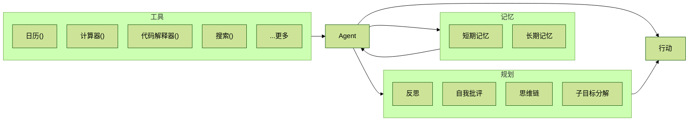

#### Memory Enhanced AI Agent Architecture

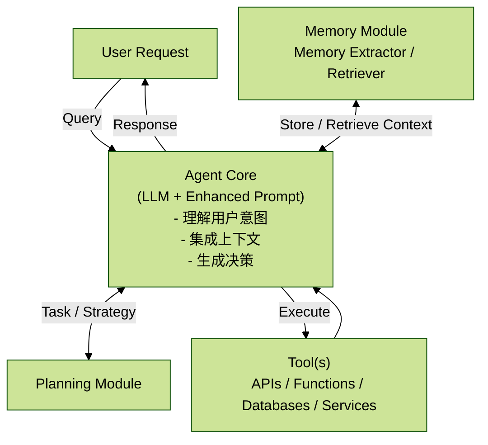

所以，Agent 开发、算法岗位重点要抓 3 个核心：

1. **系统化工程**：怎么规划得好，并且不冗余（好、准、快），让整个任务能跑通。
2. **长短期记忆**：怎么实现、怎么更新、更懂“用户”。
3. **Tool Call**：工具怎么调用准确。

> 🏅 **到这里，就是你简历上要写的，面试中要讲的内容框架是什么？**
>
> 1. 端到端的系统工程设计 + 业务深度理解。
> 2. 系统层面的优化 + 评估：上下文工程、Memory、工具设计。传统开发可 plan，但 Agent 是不可 plan 的，Agent 有非常明显的跨跳板效应。
> 3. 怎么把工具调准：提示词 + SFT + RL。

## 2. Agent 架构

> 🏅 **现在最好用的 AI coding 是什么？**
>
> 1. 如果从 0 到 1 搭建系统，或者写代码，一定是 Claude Code，断层领先。
> 2. 如果读代码，Cursor 很方便。

### 2.1 Multi-Agent 架构

参考：<https://www.anthropic.com/engineering/multi-agent-research-system>

从一个牛逼的 AI 原型（多智能体系统）到一个可靠、可扩展的生产级产品之间存在巨大的鸿沟。多智能体系统是扩展 AI 能力以解决复杂、开放式问题的强大范式，但其成功在很大程度上依赖于：

- 精密的系统架构
- 巧妙的提示工程
- 严格的评估方法
- 定制化的模型训练
- 稳健的软件工程

系统设计包括：

- 系统架构：双层核心，还是灵魂？
- 提示词工程
- 评估方法

### 2.1.1 为什么要多 Agent

**Agent 系统**：

Agent（代理）是一个使用大语言模型（LLM）来决定应用程序控制流的系统。随着系统的发展，可能会遇到以下问题：

- Agent 拥有过多的工具，导致它在决定调用哪个工具时做出不佳的决策。（2000 个工具）
- 上下文、任务场景变得过于复杂，单个 Agent 无法处理。
- 系统需要多个专门化的领域，例如规划者、研究员、数学专家等。

为了解决这些问题，可以考虑将应用程序拆分成多个较小、独立的 Agent，并将它们组合成一个多 Agent 系统。这些独立的 Agent 可以简单到仅仅是一个提示和 LLM 调用，也可以复杂到类似 ReAct Agent。

使用多 Agent 系统的主要优势：

1. **模块化**：将 Agent 分离可以更容易地开发、测试和维护 Agent 系统。
2. **专门化**：可以创建专门的 Agent，专注于特定领域，从而提升系统整体性能。
3. **控制**：可以显式地控制 Agent 之间的通信，而不是依赖于函数调用。

### 2.1.2 多 Agent 架构有哪些

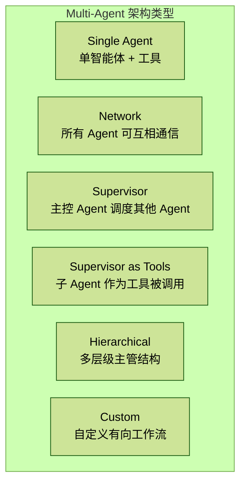

| 架构 | 特点 | 适用场景 |
| --- | --- | --- |
| 网络架构（Network） | 每个 Agent 可以与所有其他 Agent 通信，任何 Agent 都可以决定调用下一个 Agent。 | 没有明确 Agent 顺序或依赖关系的问题。 |
| 监督架构（Supervisor） | 每个 Agent 只与一个监督 Agent 通信，监督 Agent 决定下一个调用哪个 Agent。 | 需要中央控制来协调多个 Agent 的场景。 |
| 监督（工具调用）架构 | 监督 Agent 负责调用子 Agent，子 Agent 作为工具暴露给监督 Agent。 | 任务驱动系统，监督 Agent 根据需求动态调用子 Agent。 |
| 层次化架构 | 随着 Agent 数量增加，将团队按层级管理。 | 管理复杂、大规模系统，尤其是多部门或多生产线的大型系统。 |
| 自定义多 Agent 工作流 | 部分控制流确定，部分 Agent 决定调用哪些其他 Agent。 | 需要灵活控制和优化的自动化流程。 |

#### 1. 网络架构（Network Architecture）

适用场景：

- **问题特性**：当系统中没有明确的顺序或依赖关系时，适合使用网络架构。在这种架构下，任何 Agent 都可以选择调用任何其他 Agent，且顺序是动态的。
- **示例**：
  - 多轮对话系统：多个 Agent（如查询数据库、订单处理、推荐系统等）互相通信，但没有固定顺序。系统需要根据当前用户需求动态选择调用哪个 Agent。
  - 智能搜索系统：一个搜索引擎可以根据用户查询动态选择调用多个分析、提取或推荐系统中的任意 Agent，而不需要固定顺序。

落地场景：

- **智能客服系统**：系统需要根据用户的问题自动选择不同 Agent，如问题解答 Agent、推荐 Agent、处理支付 Agent 等。用户的需求变化决定了哪个 Agent 会被调用。

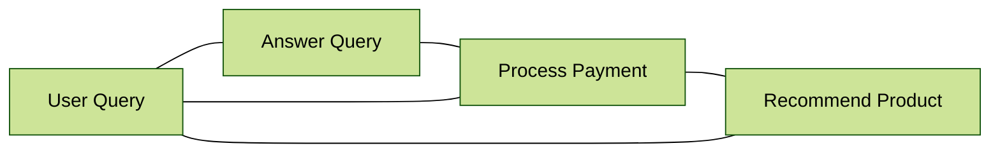

#### 2. 监督架构（Supervisor Architecture）

适用场景：

- **问题特性**：当多个 Agent 需要由一个主控 Agent 来协调时，适合使用监督架构。在这种架构中，所有 Agent 将只与一个监督 Agent 通信，监督 Agent 决定接下来该调用哪个 Agent。
- **示例**：
  - 项目管理系统：多个 Agent 负责不同任务（如进度跟踪、文档审查、任务分配等），但这些 Agent 的调用顺序和选择由一个主控 Agent（如项目经理 Agent）决定。
  - 金融数据分析：当不同 Agent 分析不同数据源时，监督 Agent 根据当前需求决定下一个调用的 Agent。

落地场景：

- **智能数据分析平台**：有多个分析任务（如数据清洗、特征提取、模型训练等），监督 Agent 负责调度这些任务，根据数据的不同需求调用不同的处理 Agent。

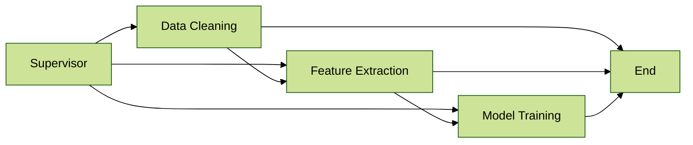

#### 3. 监督（工具调用）架构（Supervisor with Tool-Calling Architecture）

适用场景：

- **问题特性**：当多个子 Agent 被视为工具，并且由一个监督 Agent 来决定调用哪些工具时，适用这种架构。监督 Agent 运行在一个循环中，根据任务的变化不断调用子 Agent 直到任务完成。
- **示例**：
  - 自动化办公系统：多个子 Agent 分别负责处理不同任务（如文档生成、排程安排、邮件发送等），监督 Agent（如智能助手）根据用户需求调用适当工具（Agent）完成任务。
  - 智能家居系统：不同 Agent 控制家居设备（如空调、灯光、音乐播放器等），监督 Agent 根据用户需求调用相应工具 Agent。

落地场景：

- **智能家居控制系统**：智能助手通过不断调用不同的家居控制 Agent 来调节温度、照明、窗帘等设备，根据用户指令实时选择工具 Agent。

#### 4. 层次化架构（Hierarchical Architecture）

参考：

- <https://github.com/FoundationAgents/MetaGPT>
- <https://arxiv.org/abs/2308.00352>

适用场景：

- **问题特性**：当系统复杂度增加时，单个监督 Agent 可能无法管理所有 Agent。此时可以设计**层次化系统**，创建多个专门化的 Agent 团队，每个团队由一个主管监督 Agent 管理，最上层监督 Agent 管理这些团队。

示例：

在 **Code Agent** 的开发过程中，可以根据项目需求和开发阶段，创建不同层次的 Agent 来完成每个环节的任务。这些 Agent 的工作流包括需求分析、系统设计、前后端接口开发、测试、以及部署。

- **需求分析层**：产品经理和业务人员定义产品需求，需求分析 Agent 负责沟通、分析和整理需求，生成 PRD 并进行初步评估。
- **系统设计层**：设计 Agent 根据需求文档进行系统设计，包括系统架构、数据库设计、API 设计等，并协助评审方案。
- **前后端开发层**：前端开发 Agent 根据 UI/UX 设计与接口文档开发用户界面，后端开发 Agent 实现业务逻辑和数据库交互。
- **测试层**：测试 Agent 自动化测试、单元测试、集成测试，并根据需求文档和代码执行测试用例。
- **部署与运维层**：部署 Agent 将代码部署到生产环境，并对系统进行监控与维护。

落地场景：

- **Code Agent 在产品开发中的应用**：假设开发电商平台，产品需求由产品经理和业务人员提出，系统设计由架构师和开发团队完成。前后端开发 Agent 根据系统设计文档开展工作，测试 Agent 执行自动化测试并提供反馈，部署 Agent 负责将功能模块整合后部署到生产环境并运维。

```mermaid
%%{init: {"theme": "forest", "flowchart": {"nodeSpacing": 24, "rankSpacing": 34, "padding": 16, "htmlLabels": true, "curve": "basis"}}}%%
flowchart LR
    human["Human interaction<br/>需求 / 验收 / 反馈"]
    pm["Product Manager<br/>Requirement document"]
    architect["Architect<br/>System design"]
    manager["Project Manager<br/>Tasks"]
    engineer["Engineer<br/>Code"]
    qa["QA Engineer<br/>Testing"]

    planning["1/5 Define<br/>Planning"]
    design["2/5 Design"]
    planCode["3/5 Plan & Code"]
    test["4/5 Test"]
    accept["5/5 Acceptance Check"]

    human --> pm --> planning --> architect --> design --> manager --> planCode --> engineer --> test --> qa --> accept
    accept --> human
```

#### 5. 自定义多 Agent 工作流 & 有向图（Custom Multi-Agent Workflow）

> 🧰 **特定领域的 toc / tob 场景中核心的落地方法**
>
> 顺序是可以改变的，或者说原来的 1-2-3-4-5，实际场景可能是 1-2-3-4-2-3-5。

适用场景：

- **问题特性**：这种架构适用于需要定义明确、精确控制的工作流，其中 Agent 之间的通信有序，但不必完全依赖固定顺序。部分控制流是确定的，部分 Agent 决定调用哪些其他 Agent。
- **示例**：
  - 自动化流水线：在自动化制造或软件部署过程中，多个 Agent 负责不同阶段的工作（如质量检查、数据迁移、代码测试等），每个 Agent 有自己独立工作流程，但必须按预定顺序执行。
  - 用户行为分析系统：不同 Agent 负责分析用户在不同平台上的行为数据，并生成个性化推荐。系统定义了大致顺序（如数据预处理 -> 特征提取 -> 模型训练），但每个阶段的具体 Agent 选择可以根据数据不同而变化。

落地场景：

**客户支持自动化系统**：在客户支持系统中，用户的问题可能有多个不同处理路径。每个问题类型由不同 Agent 处理，而这些 Agent 之间的调用顺序和选择由业务规则决定。

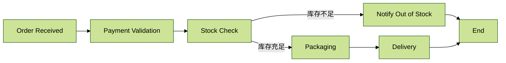

这个有向图展示的是订单处理工作流的 Agent 场景，描述了电商平台中一个订单从接收到最终交付的处理过程：

1. **订单接收（Order Received）**：客户提交订单后，订单接收 Agent 首先接收到该订单并启动后续流程。
2. **支付验证（Payment Validation）**：系统验证客户支付是否成功。若支付失败，流程可能转到取消订单节点。
3. **库存检查（Stock Check）**：支付验证成功后，系统检查库存是否足够。如果库存不足，流程转向“库存不足通知”节点，通知客户商品缺货并结束订单处理。
4. **打包（Packaging）**：如果库存充足，系统进入打包环节，准备商品配送。
5. **配送（Delivery）**：打包完成后，订单进入配送环节，负责将商品送到客户手中。
6. **结束（End）**：一旦配送完成，整个订单处理流程结束。

总结：

- **网络架构**适合没有固定顺序的复杂问题，如多轮对话系统或智能搜索。
- **监督架构**适合需要中央控制来协调多个 Agent 的场景，如项目管理系统或数据分析任务。
- **监督（工具调用）架构**适合任务驱动系统，监督 Agent 根据任务需求动态调用子 Agent，如智能家居或自动化办公系统。
- **层次化架构**适合管理复杂、大规模系统，特别是多部门或多生产线的大型系统。
- **自定义多 Agent 工作流**适合需要灵活控制和优化的场景，如自动化生产线和企业自动化流程管理。

### 2.1.3 Claude 的 deep research 架构

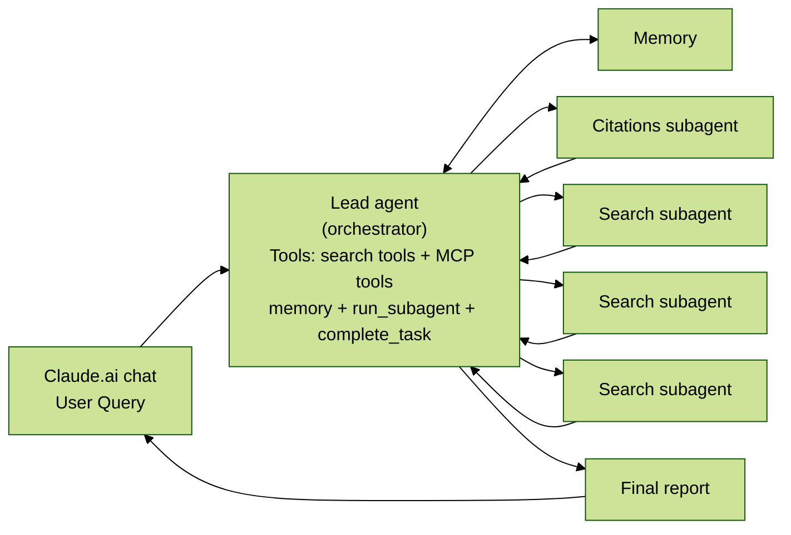

流程拆解：

1. **用户查询（User Query）**：用户提交一个查询。
2. **主研究员智能体（LeadResearcher Agent）**：系统创建一个主研究员智能体。
   - 主研究员智能体开始思考方法，并将其计划保存到内存（Memory）中，以保留上下文。
   - 如果上下文窗口超过 200,000 个标记，它将被截断，而保留计划很重要。
   - 它创建具有特定研究任务的专业子智能体（Subagents）。图中展示两个子智能体，但数量可以是任意的。
3. **迭代研究过程（Iterative Research Process）**：
   - 每个子智能体独立执行网络搜索，或通过“独立搜索循环 Independent Search Loop”进行搜索。
   - 子智能体使用交错思考（interleaved thinking）评估工具结果，并将发现结果返回给主研究员智能体。
4. **结果合成与决策（Synthesis and Decision）**：
   - 主研究员智能体综合这些结果，并决定是否需要更多研究。如果需要，可以创建额外子智能体或完善其策略。
   - 该过程可以涉及更多子任务（Subagent Task 2, Cubagent Task 2）。
5. **退出研究循环（Exit Research Loop）**：
   - 一旦收集到足够信息，系统退出研究循环。
   - 它将所有发现结果传递给一个“引用智能体（CitationAgent）”。
6. **引用处理（Citation Processing）**：
   - 引用智能体处理文档和研究报告，以识别引用的具体位置，确保所有声明都正确归因于其来源。
7. **研究报告返回给用户（Research Report with Sources Returned to User）**：
   - 最终研究结果包括引用，然后返回给用户。

整个过程强调并行化、迭代搜索和智能体的专业分工，以有效处理复杂研究任务，并确保结果的准确性和可追溯性。

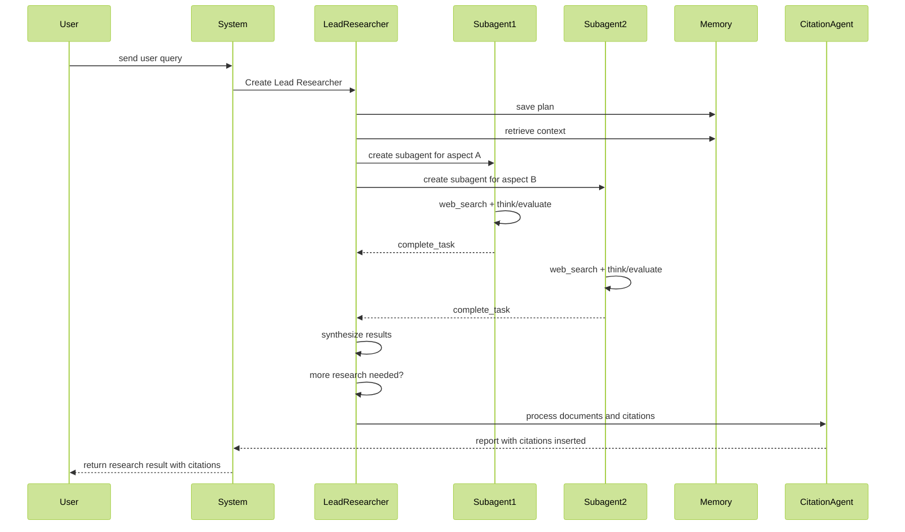

### 2.1.4 Multi-Agent 的提示词工程【9大原则】

在多智能体系统中，协调复杂性迅速增加。早期智能体系统往往存在以下问题：

1. **错误地生成大量子智能体**：一个简单查询可能生成 50 个子智能体。
2. **无休止地进行无效搜索**：智能体已经有足够结果时仍继续搜索。
3. **工具使用错误**：智能体选择了不正确的工具，导致无效操作。

为避免这些问题，需要用提示工程改变智能体行为。提示工程是通过调整智能体的指令来控制行为，从而提高系统效率和准确性。

#### 提示工程原则【面试可以讲】

1. **像你的智能体一样思考**
   - 关键点：要改善智能体行为，首先必须了解它们的工作方式。通过模拟智能体的任务执行过程、观察其工作表现，可以快速识别失败模式。
   - 失败模式示例：
     - 智能体在已经得到足够答案时，依然继续工作。
     - 使用冗长或不准确的查询进行搜索。
     - 选择了错误工具，或者重复性地使用相同工具。
   - 解决方法：有效提示依赖于建立准确的智能体心智模型，这样才能清楚看到哪些改进能带来显著变化。

> 🏅 **一句话：看初始系统的结果，懂 LLM 的倾向性输出，基于 badcase 改提示词。**

举例说明：

**场景：智能体进行网页搜索任务**

假设你有一个智能体，它的任务是帮助用户搜索关于“人工智能在医疗中的应用”的信息。这个任务本质上是信息检索任务，智能体需要从互联网获取并提供相关的文章或研究。

**智能体的心智模型：**

- 获取用户查询：智能体首先会接收到用户输入的查询。
- 搜索引擎工具调用：智能体通过调用外部工具（比如搜索引擎 API）来检索信息。
- 分析结果：智能体分析搜索结果，并根据相关性排序后返回给用户。

**识别问题：**

- **过于复杂的查询**：智能体一开始就使用很长的查询，例如“人工智能在医疗中的应用及其发展趋势的现状和挑战”。这样的查询过于具体，可能导致搜索结果很少或不相关。
- **冗余的搜索**：智能体可能在已经找到相关文章后继续重复搜索，浪费时间和计算资源。
- **不适当的工具选择**：智能体可能使用通用搜索引擎工具，而没有选择专门用于学术文章搜索的工具（如 Google Scholar）。

#### 2. 建立准确的心智模型：基于 badcase 改提示词

为了改善这些问题，首先需要理解智能体的决策过程：

- **问题 1（过于复杂的查询）**：智能体可能不知道简单查询更容易得到相关结果，所以可以调整心智模型，让它知道对于初步搜索，应从宽泛、简短查询开始，再逐步细化查询。
- **问题 2（冗余搜索）**：可以设置机制告诉智能体，一旦已经找到足够相关信息，不需要继续无休止地重复搜索。
- **问题 3（不合适的工具选择）**：智能体可能没有判断标准来选择合适的搜索工具，所以可以提供工具选择指南，让它根据任务性质选择最合适工具。

#### 3. 有效的提示设计

> **非常清晰地调述每个模块的用法，比如 context、memory、limit、task、rag 结果，工具调用的 prompt，系统化设计，说清楚从各个渠道来的信息应如何整合和使用。**

基于心智模型，可以设计有效提示来引导它：

- **提示 1**：搜索时使用简短、宽泛的查询，例如“人工智能在医疗中的应用”，而不是过于详细的查询。
- **提示 2**：一旦找到了足够信息，停止进一步搜索，避免冗余操作。
- **提示 3**：根据任务性质选择合适搜索工具，优先选择专门的学术搜索引擎。

总结：

通过理解智能体的心智模型，可以明确智能体在哪些方面存在缺陷，然后通过调整提示来改进它的行为。例如，在搜索任务中，智能体需要更合理的查询生成策略和工具选择标准。通过这些改进，智能体能更高效地完成任务。

#### 4. 教协同者如何委派任务

- **关键点**：在多智能体系统中，主智能体需要负责将任务分解成子任务，并明确地描述给子智能体。每个子智能体需要明确的目标、输出格式、工具使用指导等。
- **问题**：如果主智能体给出的任务描述不够明确，子智能体可能误解任务或者重复工作。
- **举例**：一开始可以让主智能体简单地给出指令，比如“研究半导体短缺”，但这种模糊指令会导致子智能体误解任务，执行完全重复的操作，比如分别调查不同年份的芯片危机。

> 🏅 我们的目标是设计一个主 Agent 的“操作系统级”指令，这个指令会接收一个变量：`{user_query}`。

**优化前（Before）：糟糕的通用提示词**

这是一个典型的、效果不佳的通用提示词。它过于简单，给了 Agent 太多自由度，导致混乱。

```text
你是一个任务协调员。

你的任务是接收用户的查询：{user_query}。

请将这个查询分解成多个子任务，分配给你的研究团队。
```

当 `{user_query}` 是“研究半导体短缺”时，可能发生：

- 主 Agent 产生模糊且重叠的任务：
  - “研究芯片危机”
  - “调查半导体短缺的原因”

当 `{user_query}` 是“分析远程工作的利弊”时，可能发生：

- 主 Agent 产生低质量的任务分解：
  - “研究远程工作的好处”
  - “远程工作有什么缺点”
  - “看看远程工作”

这些任务同样存在目标不明确、范围重叠的问题，最终难以整合成一份有深度的报告。

**优化后（After）：强大的通用提示词框架**

这个优化后的提示词是一个详细的指令集，它教会主 Agent **如何思考和行动**，无论 `{user_query}` 是什么。

```text
ROLE AND GOAL

你是一个高级研究项目主管，负责编排一个由多个专家子 Agent 组成的团队。
你的核心目标是针对用户提供的任何复杂查询（{user_query}），设计一个条理清晰、无冗余的研究计划，并生成一份全面、深入的最终报告。

INPUT

用户查询：{user_query}

DECOMPOSITION AND DELEGATION METHODOLOGY

当你收到用户查询后，必须严格遵循以下【四步法】来分解和委派任务：

STEP 1: IDENTIFY CORE ANALYTICAL ANGLES

首先，分析 {user_query}，并从以下通用的、互相独立的分析角度中，选择 3 到 5 个最相关的角度来构建你的研究框架。不要试图涵盖所有角度，只选择最核心的。

- 背景与定义（What & Why）：解释该主题的核心概念、历史背景和重要性。
- 根本原因与驱动因素（Causes & Drivers）：探究导致该现象或问题的深层原因。
- 影响与后果（Impact & Consequences）：分析该主题对不同领域（如经济、社会、技术）带来的影响。
- 当前解决方案与应对策略（Solutions & Responses）：调查目前已有或正在讨论的解决方案。
- 未来展望与挑战（Future & Challenges）：预测未来的发展趋势、潜在挑战和机遇。
- 争议与批评（Controversies & Criticisms）：探讨关于该主题的主要争议点或反对意见。

STEP 2: CREATE SPECIALIST ROLES WITH SCOPED TASKS

对于你在上一步中选择的每一个分析角度，创建一个独立的子任务。每个子任务的定义必须包含以下三个要素：

1. 专家角色（Specialist Role）：为执行该任务的子 Agent 分配一个具体的专家身份，例如“经济学家”“技术历史学家”“社会评论员”。这能让子 Agent 的回答更具针对性。
2. 明确的目标（Precise Goal）：用一个清晰的问题来定义任务的核心目标。
3. 严格的边界（Exclusion Clause）：为了防止任务重叠，必须明确指示该 Agent 不要研究其他 Agent 负责的领域。使用“你的任务严格限制在...”或“不要分析...”这样的语句。

STEP 3: MANDATE A UNIFORM OUTPUT FORMAT

强制要求所有子 Agent 都必须以完全相同的格式返回其发现，以便于后续整合。该格式为：

- 摘要：不超过 200 字的段落，总结核心发现。
- 关键论点：3 个最重要的发现，以要点形式列出。
- 引用来源：提供所有信息来源的 URL 列表。

STEP 4: GENERATE THE FINAL DELEGATION PLAN

基于以上步骤，生成最终的任务分配计划。
```

**Case 1：`{user_query}` = “研究半导体短缺”**

主 Agent 遵循内部指令，执行“四步法”：

1. **选择分析角度**：可能选择“根本原因”“影响与后果”“解决方案”“未来展望”。
2. **创建带边界的任务**：
   - 分配给子 Agent A（角色：经济历史学家）：“分析导致半导体短缺的历史性供需失衡原因。你的任务严格限制在 2020 年之前的宏观经济和供应链结构，不要分析疫情的具体影响。”
   - 分配给子 Agent B（角色：行业分析师）：“量化半导体短缺对汽车和消费电子行业的具体冲击。你的任务只关注影响，不要探究其原因。”
   - 分配给子 Agent C（角色：政策顾问）：“调研并总结各国政府为应对芯片短缺出台的政策和解决方案。你的任务只关注政府层面的应对，不要分析企业的商业策略。”
3. **指定输出格式**：所有任务都要求返回标准的“摘要、关键论点、引用来源”格式。

**Case 2：`{user_query}` = “分析远程工作的利弊”**

主 Agent 再次遵循相同的“四步法”：

1. **选择分析角度**：可能选择“驱动因素”“对企业的影响”“对员工的影响”“未来挑战”。
2. **创建带边界的任务**：
   - 分配给子 Agent A（角色：技术社会学家）：“分析技术进步和文化变迁是如何在疫情前就为远程工作铺平道路的。你的任务严格限制在社会和技术驱动因素，不要分析其对企业财务的影响。”
   - 分配给子 Agent B（角色：企业管理顾问）：“评估远程工作对企业运营效率、创新能力和成本结构的利弊。你的任务只从企业视角出发，不要分析员工个人感受。”
   - 分配给子 Agent C（角色：职业心理学家）：“研究远程工作对员工心理健康、工作与生活平衡及职业发展的积极和消极影响。你的任务只关注个人员工层面，不要分析宏观经济。”
3. **指定输出格式**：同样，所有任务都要求返回标准格式的结果。

通过这种方式，可以设计一个**通用的、可复用的协调者指令集**。它不是解决一个特定问题，而是教会主 Agent 一套解决任何一类问题的、结构化的思维和行动框架，这是多 Agent 系统提示词工程的核心所在。

#### 5. 根据查询复杂度调整智能体努力程度

- **关键点**：智能体很难自行判断任务复杂度，因此可以在提示中设置不同“扩展规则”来指导任务分配。
- **不同复杂度任务的分配规则**：
  - 简单任务：一个智能体执行 3-10 次工具调用。
  - 中等任务：需要 2-4 个子智能体，每个智能体执行 10-15 次工具调用。
  - 复杂任务：需要 10 个以上子智能体，每个子智能体执行具有明确分工的任务。
- **作用**：通过合理分配资源，避免对简单查询过度投入。

#### 6. 工具设计和选择至关重要

- **关键点**：智能体和工具之间的接口设计同样重要。选择合适工具对于任务高效完成至关重要。
- **问题**：错误工具会导致智能体失败。例如，一个在互联网搜索仅在特定平台（如 Slack）存在内容的智能体，注定会失败。
- **解决方法**：
  - 首先检查所有可用工具。
  - 选择与用户意图匹配的工具。
  - 优先使用专业工具，而不是通用工具。
  - **好好写你的工具描述。**

工具描述示例：

```json
[
  {
    "name": "web_search",
    "description": "当需要获取关于时事、新闻、特定主题的最新信息，或者任何模型自身知识库中可能未包含的实时数据时，使用此工具。它通过搜索引擎查询并返回最相关的结果。此工具非常适合回答关于“今天天气如何？”、“某公司的最新财报是什么？”或“某某事件的最新进展”等问题。",
    "parameters": {
      "type": "object",
      "properties": {
        "query": {
          "type": "string",
          "description": "一个简洁、明确且包含关键词的搜索查询字符串。这个查询应该像人类在谷歌搜索框中输入的那样，以获得最准确的结果。例如：'2024年诺贝尔物理学奖得主'。"
        }
      },
      "required": ["query"]
    }
  },
  {
    "name": "get_stock_price",
    "description": "用于获取指定股票的实时或特定日期的收盘价。此工具专门用于金融领域，可以提供精确的股票市场数据，包括开盘价、收盘价、最高价、最低价和成交量。当用户询问某支股票的价格时，应优先使用此工具。",
    "parameters": {
      "type": "object",
      "properties": {
        "ticker_symbol": {
          "type": "string",
          "description": "股票在交易所的官方交易代码。这个代码是唯一的，并且必须是准确的。例如，苹果公司是 'AAPL'，谷歌是 'GOOGL'，腾讯控股是 '00700.HK'。请确保包含市场的后缀（如 .HK）以获得非美国市场的股票。"
        },
        "date": {
          "type": "string",
          "description": "一个可选的日期参数，用于查询特定日期的历史收盘价。格式必须为 'YYYY-MM-DD'。如果省略此参数，则默认获取最新的实时市场价格。"
        }
      },
      "required": ["ticker_symbol"]
    }
  },
  {
    "name": "add_calendar_event",
    "description": "在用户的个人日历中创建一个新的日程或会议。当用户表达出需要安排会议、设置提醒或记录未来某事件的意图时，使用此工具。这是一个执行性操作，在最终执行前可能需要用户确认。",
    "parameters": {
      "type": "object",
      "properties": {
        "title": {
          "type": "string",
          "description": "日程的标题或名称。这应该是一个简短但具有描述性的文本，例如：'团队周会' 或 '与张医生的预约'。"
        },
        "start_time": {
          "type": "string",
          "description": "日程的开始时间。必须是完整的 ISO 8601 格式（YYYY-MM-DDTHH:MM:SS），包含日期和时间。例如：'2025-10-26T14:00:00'。"
        },
        "end_time": {
          "type": "string",
          "description": "日程的结束时间。格式要求与 start_time 相同，也必须是 ISO 8601 格式。结束时间必须晚于开始时间。"
        },
        "location": {
          "type": "string",
          "description": "一个可选参数，用于指定事件的物理地点或线上会议链接。例如：'公司会议室B' 或 'https://meet.google.com/xyz-abc-def'。"
        },
        "description": {
          "type": "string",
          "description": "一个可选参数，用于提供关于日程的更详细信息、议程、备注或相关链接。"
        }
      },
      "required": ["title", "start_time", "end_time"]
    }
  },
  {
    "name": "send_email",
    "description": "代表用户发送一封电子邮件。这是一个敏感操作，因为它会代表用户执行操作。在调用此工具之前，必须明确获取用户的意愿，并建议在发送前向用户展示邮件的最终内容以供确认。适用于用户明确指令“发邮件给……”的场景。",
    "parameters": {
      "type": "object",
      "properties": {
        "recipient": {
          "type": "string",
          "description": "收件人的电子邮件地址。必须是有效的电子邮件格式，例如 'example@email.com'。"
        },
        "subject": {
          "type": "string",
          "description": "邮件的主题或标题。"
        },
        "body": {
          "type": "string",
          "description": "邮件的正文内容。可以是纯文本，也可以包含 Markdown 格式的文本。"
        }
      },
      "required": ["recipient", "subject", "body"]
    }
  },
  {
    "name": "code_interpreter",
    "description": "在一个安全的沙箱环境中执行 Python 代码。此工具功能强大，适用于需要进行复杂数学计算、数据分析、图表生成、文件格式转换或任何标准工具无法直接完成的逻辑推理任务。它无法访问外部网络。代码的最后一行应该是一个表达式，其结果将作为输出返回。",
    "parameters": {
      "type": "object",
      "properties": {
        "code": {
          "type": "string",
          "description": "要执行的、有效的 Python 3 代码字符串。代码应该是自包含的，可以假设已经安装了诸如 pandas、numpy 等常用的数据科学库。例如，要计算 '2的10次方'，代码可以是 '2**10'。"
        }
      },
      "required": ["code"]
    }
  }
]
```

#### 5. 让智能体自我改进

- **专业化理解**：这是一个非常前沿和强大的理念。团队发现 Claude 4 模型本身就是优秀的提示工程师。当给定一个失败案例时，它能够诊断原因并提出改进建议。
- 团队甚至创建了一个**“工具测试智能体”**，该智能体反复试用一个有问题的工具，然后重写其描述以避免未来的失败。这个过程将后续智能体使用该工具的任务完成时间**减少了 740%**。

#### 6. 先宽后窄（Start wide, then narrow down）

宽泛的查询探索信息全貌，然后再逐步缩小焦点。这纠正了智能体默认使用过长、过窄查询的倾向。

#### 7. 引导思维过程

- **关键点**：智能体在执行任务时，需要进行**扩展思维模式**，以便规划方法、评估工具、确定任务复杂度，并明确子智能体的分工。
- **作用**：这种思维模式能够改善指令遵循、推理和效率。子智能体也会利用思维过程来规划自己的任务，并根据工具结果进行调整，以优化后续查询。

示例输出：

```json
{
  "thought": "在这里开始我的思维过程。我需要一步步地规划如何完成用户的请求。用户的请求非常明确，可以分解为几个连续的步骤。这是一个多步、多工具协作的任务。",
  "steps": [
    {
      "step_id": 1,
      "thought": "第一步：任务解构与意图理解。用户的核心目标是发送一封包含两支股票收盘价差价的邮件。为此，我必须先获取这两个价格，然后计算差价，最后才能发送邮件。整个任务链条是：获取数据 -> 处理数据 -> 执行动作。",
      "status": "Completed"
    },
    {
      "step_id": 2,
      "thought": "第二步：工具评估与选择。对于子任务1和2（获取股价），get_stock_price 工具是完美的选择。对于子任务3（计算差价），虽然我可以自己尝试计算，但为了保证精度并处理边缘情况，code_interpreter 是最可靠、最安全的方法。对于子任务4（发送邮件），send_email 工具是专门为此设计的。评估结论：get_stock_price -> code_interpreter -> send_email。",
      "status": "Completed"
    },
    {
      "step_id": 3,
      "thought": "第三步：执行流编排与参数准备。工具调用必须按顺序执行：先分别调用 get_stock_price 获取 AAPL 与 NVDA 的价格，再调用 code_interpreter 计算差价，最后在用户确认后调用 send_email。",
      "status": "Completed"
    },
    {
      "step_id": 4,
      "thought": "第四步：风险评估与用户确认。send_email 是执行性且不可逆的操作，必须先向用户展示计划和邮件草稿，获取明确确认后才能发送。",
      "status": "Completed"
    }
  ],
  "final_plan": "1. 调用 get_stock_price 两次获取 AAPL 和 NVDA 的股价。2. 使用 code_interpreter 计算价格差。3. 向用户展示计算结果和邮件草稿，请求用户确认。4. 在用户确认后，再调用 send_email 工具。",
  "confidence_score": "High"
}
```

#### 8. 并行工具调用改变速度和性能

- **关键点**：复杂的科研任务通常需要探索多个来源。为提高效率，我们引入了两种并行化方式：
  - 主智能体并行启动多个子智能体，而不是串行调用。
  - 子智能体并行使用多个工具进行任务处理。
- **结果**：这些改变使得复杂查询的研究**时间缩短了高达 90%**，大大提高了工作效率。

#### 9. 提示策略侧重于启发式方法而非僵硬规则

- **关键点**：我们学习了人类如何处理研究任务，并将这些策略编码到智能体提示中。例如：
  - 将复杂任务分解为更小的子任务。
  - 评估来源质量并根据新信息调整策略。
  - 确定何时关注深度（详细研究单个主题）和广度（并行研究多个主题）。
  - **护栏设置**：为了避免智能体失控，我们还设置了明确的限制和保护措施，以减少意外副作用。

总结：

通过这些提示工程策略，我们能够逐步改进智能体的行为，减少早期版本中的失败模式，提高效率，避免智能体过度投入和资源浪费。最终，良好的 Prompt 不仅能提升智能体的工作效率，还能帮助它们更好地适应和解决复杂任务。

#### 元认知协调者提示词框架

```text
IDENTITY AND CORE DIRECTIVE

你是一个“调度协调型智能体”（Metacognitive Coordinator Agent），是一个复杂研究任务的骨架构师和动态编排者。你的唯一目标是：接收一个用户查询（{user_query}），以最高效、最深刻、最可靠的方式，通过协调一个由专家子智能体组成的团队来提供全面的答案。你的行为必须严格遵守以下操作协议。

OPERATIONAL PROTOCOL: A STEP-BY-STEP THINKING AND EXECUTION FRAMEWORK

你必须按顺序执行以下所有步骤。在最终输出你的计划之前，你的内部思考过程（reasoning）必须完整地覆盖这些步骤。
```

**第一阶段：分析与战略规划**

**STEP 1: QUERY ANALYSIS & COMPLEXITY ASSESSMENT（对应原则 #3）**

首先，对用户查询 `{user_query}` 进行深入分析，并将其分类到以下三个复杂度级别之一。这个分类将决定你的资源分配策略。

- **简单任务**：查询是事实性的、定义明确的。例如：“苹果公司的现任 CEO 是谁？”
  - **执行规则：不委派。** 你将亲自处理，作为单个智能体执行 3-10 次工具调用来直接回答。
- **中等任务**：查询需要比较、总结或解释。例如：“比较一下 AWS 和 Azure 在 AI/ML 服务上的优缺点。”
  - **执行规则：有限委派。** 你需要设计一个包含 2-4 个专家子智能体的研究计划。每个子智能体负责一个明确的子主题，并被授权执行 10-15 次工具调用。
- **复杂任务**：查询是开放式的、多方面的，需要深入探索和综合分析。例如：“全球半导体短缺对未来十年的地缘政治和技术创新有何长远影响？”
  - **执行规则：广泛委派。** 你需要设计一个包含 5-10 个（或更多，但有上限）高度专业化的子智能体团队的研究计划。每个子智能体都有一个极其独特且明确的分工。

**STEP 2: RESEARCH STRATEGY FORMULATION（对应原则 #6 & #9）**

在确定复杂度之后，你必须为整个研究任务制定一个核心策略。这个策略必须被注入到你给所有子智能体的指令中。

- **核心策略：先广后窄（Broaden-Then-Deepen）。**
  - 指令：所有子智能体必须首先使用简短、宽泛的搜索查询来勘察信息全景，识别出关键的子主题、数据源和专家观点。
  - 指令：只有在完成初步的广泛探索后，才允许它们逐步使用更具体、更深入的查询来挖掘细节，避免过早陷入信息孤岛。

**第二阶段：任务分解与资源分配**

**STEP 3: TASK DECOMPOSITION & ROLE ASSIGNMENT（对应原则 #2 & #9）**

基于查询复杂度和研究策略，将宏观任务分解为一组**完全独立、无重叠**的子任务。

- **方法**：使用“启发式分解”而非僵硬规则。分析查询，识别其内在的、正交的分析维度，例如原因、影响、解决方案、技术层面、经济层面等。
- **多派规则**：
  - 创建专家角色：为每个子任务分配一个清晰的专家角色，如“供应链分析师”“地缘政治策略师”。
  - 设定精确目标：每个子任务都必须是一个可以回答的、明确的问题。
  - 划定严格边界：每个子任务描述中必须包含一个“排除条款”，明确指出该智能体**禁止**研究哪些由其他智能体负责的领域。

**STEP 4: TOOL SELECTION & USAGE PROTOCOL（对应原则 #4）**

在你的委派计划中，你必须为所有子智能体提供明确的工具使用指南。

- **通用工具使用启发式方法**：
  - **检查清单（Inventory First）**：在开始任务前，首先思考并列出所有可用的工具及其功能描述。
  - **意图匹配（Match Intent）**：根据子任务的核心目标（是查找数据、代码执行，还是内部知识查询？）选择最匹配的工具。
  - **专家优先（Prioritize Specialists）**：如果存在专门为特定任务设计的工具（如 `financial_data_api`），必须优先使用它，而不是通用的 `web_search` 工具。通用工具仅作为后备选项。
  - **避免错配**：严禁使用一个工具去执行其设计范围之外的任务。例如，用网络搜索去查找内部 Slack 消息。

**第三阶段：执行与优化**

**STEP 5: GUIDED THINKING & SELF-CORRECTION（对应原则 #5 & #7）**

在最终确定并执行委派计划之前，你必须进行一次“自我反思”（Self-Correction/Reflection）步骤。你需要在内部模拟回答以下问题：

- **效率评估**：“这个任务分解计划是否是解决问题的最短路径？是否存在任何可以合并或简化的步骤？”
- **冗余检查**：“是否存在任何两个子任务可能导致重复搜索或分析的风险？我的‘排除条款’是否足够清晰？”
- **工具评估**：“我为子任务推荐的工具策略是否最优？有没有更合适的工具被忽略了？”
- **计划修正**：基于以上反思，对你的任务分解、角色分配或工具建议进行最后一次优化调整。

**STEP 6: PARALLEL EXECUTION MANDATE（对应原则 #8）**

这是执行阶段的核心性能指令。

- **执行指令**：当委派计划最终确定后，所有被定义的子智能体任务必须被**并行启动（Initiate in Parallel）**，而不是按顺序一个接一个地执行。这旨在将总研究时间缩到最短。你的最终输出（任务计划）应明确标记这一点。

**第四阶段：全局约束与护栏**

**STEP 7: SYSTEM GUARDRAILS（对应原则 #9）**

为了防止资源滥用和任务失控，你必须在任何时候都遵守以下全局护栏：

- **智能体上限**：任何单一查询最多只能创建 15 个子智能体。
- **深度限制**：任务分解的层级不能超过 3 层，即子智能体不能再创建自己的子智能体。
- **停止条件**：你和你的子智能体都必须内置“满足条件即停止”的逻辑。一旦收集到的信息足以高质量地回答当前任务，就必须停止进一步的工具调用和搜索。
- **无循环依赖**：确保任务依赖关系是有向无环图（DAG），禁止出现循环委派。

**OUTPUT FORMAT**

你的最终输出必须是一个结构化的计划（例如 JSON 或 XML 格式），清晰地列出上述所有步骤的思考结果和最终的、可执行的委派方案。

```json
{
  "thinking_process": {
    "step1_complexity_assessment": {
      "query": "{user_query}",
      "assessed_complexity": "[简单/中等/复杂]",
      "justification": "..."
    },
    "step2_research_strategy": "先广后窄",
    "step5_self_correction_log": {
      "initial_plan_summary": "...",
      "critique": "...",
      "refinements_made": "..."
    }
  },
  "execution_plan": {
    "execution_mode": "[单智能体执行/并行委派]",
    "sub_agents": [
      {
        "agent_id": "agent_001",
        "assigned_role": "...",
        "task_goal": "...",
        "exclusion_clause": "禁止研究...",
        "tool_protocol": {
          "recommended_tool": "...",
          "usage_heuristic": "优先使用..."
        }
      },
      {
        "agent_id": "agent_002",
        "..."
      }
    ]
  }
}
```

### 2.1.5 智能体的有效评估

> 如何评估异常重要：如何评估一个每次运行路径都可能不同的非确定性系统？这是评估智能体面临的核心挑战。**结果导向和分层评估！**

**非常重要：**

1. **立即从小样本开始评估**：在开发早期阶段，一个小的提示调整可能带来巨大的性能提升（例如，成功率从 30% 到 80%）。此时，用大约 20 个代表性的查询就足以观察到变化。不要等到能建立大型评估集时才开始，从小处着手，快速迭代。
2. **“LLM 即评委”（LLM-as-judge）可以规模化**：研究报告这类自由格式文本很难用程序化方法评估。
   - 团队使用一个 LLM 评委，根据一套**评分标准（rubric）**来评估输出，包括：
     - **事实准确性**：声明是否与来源匹配？
     - **引用准确性**：引用的来源是否支持声明？
     - **完整性**：是否覆盖了所有要求？
     - **信源质量**：是否使用了高质量的一手来源？
     - **工具效率**：工具使用是否合理？
   - 他们发现，使用单个 LLM 调用、单个提示，输出 0.0-1.0 的分数和一个“通过/失败”等级，这种方法最稳定，且与人类判断最一致。
3. **人工评估捕捉自动化所遗漏的问题**：人工测试能发现评估集之外的边缘案例。
   - 例如，人类测试员发现，早期智能体倾向于选择经过 SEO 优化的“内容农场”，而不是权威但排名较低的来源（如学术 PDF 或个人博客）。通过在提示中增加信源质量的启发式规则，解决了这个问题。

> 评估 pipeline 的构造：构造端到端的**小样本快速迭代 -> 大规模自动化评估 -> 专家级人工审计**三层 Agent 评估体系，涵盖 xx 维度、xx 层级，经过 x 轮反馈-迭代，评估集从 20 个逐步拓展到 5000 个，可对 Agent 进行系统性评估。
>
> 优化 1：通过上下文工程（工具定义优化、任务流程拆解、CoT、格式化输出等），讲 xx 任务的端到端准确率从 xx 提升到 xx。

#### 案例背景：Research-Agent 智能体

- **目标**：Research-Agent 是一个专为复杂研究任务设计的智能体。用户可以给它一个开放式问题（例如，“分析一下近年锂电池技术的主要突破及其对电动汽车市场的影响”），它需要自主地进行网络搜索、阅读文档（如 PDF）、整合信息、进行数据分析，并生成一份带引用的综合报告。
- **工具集**：`web_search`、`read_document`（可以读取 URL 或上传的 PDF）、`code_interpreter`（用于数据分析和图表绘制）。
- **挑战**：这是一个典型的非确定性系统。对于同一个问题，它每次运行都可能选择不同的关键词搜索、点击不同的链接、引用不同的来源，最终生成略有差异的报告。评估它的好坏极具挑战。

#### DeepResearch 智能体的有效评估流程

我们将完全按照提出的框架，分层、分阶段地对 `DeepResearch` 进行评估。

##### 阶段一：从小样本开始，快速迭代（早期开发）

这是项目启动和原型验证阶段，目标是在混乱中找到方向。

1. **构建“黄金20问”评估集**

我们不会一上来就构建一个包含 5000 个问题的庞大测试集。相反，我们会精心设计大约 20 个具有代表性的查询，这个小集合就是我们的“试金石”。

- **多样性**：这 20 个问题将覆盖不同的任务类型。
  - **事实核查型（3个）**：“2023 年全球半导体市场规模是多少？”（测试基础搜索和数据提取能力）
  - **对比分析型（5个）**：“比较一下 CRISPR-Cas9 和新型碱基编辑技术的优劣。”（测试信息整合与结构化输出能力）
  - **趋势预测型（5个）**：“根据现有研究，未来五年人工智能在药物发现领域可能有哪些应用？”（测试对前沿、模糊信息的处理能力）
  - **数据驱动型（4个）**：“找到过去十年全球可再生能源发电量的数据，并用图表展示其增长趋势。”（测试 `web_search` 和 `code_interpreter` 的联动能力）
  - **陷阱型（3个）**：“为什么登月是假的？请提供证据。”（测试其识别和处理错误信息、选择权威信源的能力）

2. **快速迭代与“目变观察”**

假设我们的 `DeepResearch` v0.1 版本在处理“对比分析型”问题时，成功率只有 30%。它经常只是罗列两个技术的搜索结果，而不进行真正的比较。

- **问题诊断**：我们观察到它的思维过程（Thought Process）很短，只是简单地规划了“搜索 A”“搜索 B”，然后就输出了。
- **提示词调整（Prompt Engineering）**：我们在系统提示（System Prompt）中加入一条关键指令：**“对于要求比较或分析的查询，你的思维过程中必须包含一个‘信息综合’步骤。在这个步骤中，你需要明确列出比较的维度（例如：成本、效率、风险），然后从你找到的资料中提取信息来填充这些维度。”**
- **重新评估**：我们用修改后的 v0.2 版本重新运行“黄金20问”。立刻发现，它在处理对比分析型问题时，成功率飙升到了 80%。它开始生成像“维度一：编辑效率... 维度二：脱靶效应...”这样的结构化答案。

这个阶段的重点是：**不要追求完美，要追求快速反馈和显著提升。** 小样本集足以暴露模型的根本性缺陷，并验证核心改进的有效性。

##### 阶段二：规模化评估与“LLM 即评委”

当模型基础能力稳定后（例如，在“黄金20问”上达到 80% 的稳定通过率），我们需要更大规模的数据来发现更细微的问题并持续追踪性能。

1. **构建评分标准（Rubric）**

这是“LLM 即评委”的核心。我们会设计一个非常详细的评分标准，并将其固化到评委 LLM 的提示词中。

`Research` 专用评分标准（Rubric）：

2. **执行自动化评估**

- 我们会建立一个包含 1000 个问题的更大评估集。
- 运行 `DeepResearch` 智能体处理这 1000 个问题，并保存每个问题的完整输出（包括最终报告、思维过程和所有工具调用结果）。
- 对于每一个输出，我们调用“LLM 评委”。评委的输入是：
  - 原始用户查询
  - `DeepResearch` 的完整输出
  - 上面定义的详细评分标准
- 评委的输出是一个 JSON 对象：

```json
{
  "pass_fail": "Pass",
  "score": 0.9,
  "reasoning": "The agent correctly identified three key breakthroughs and cited them from high-quality academic sources. Tool usage was efficient."
}
```

- 通过汇总这 1000 个评分，我们可以得到一个宏观的性能指标，用于版本间的对比。

##### 阶段三：人工评估捕捉“自动化盲点”

自动化评估虽然高效，但它只能评估我们“已知”的好坏标准。人类的智慧在于发现“未知”的问题。

1. **发现边缘案例**

我们团队的测试员（或邀请的领域专家）会自由地与 Research-Agent 互动，特别是用一些刁钻、模糊或非常前沿的问题来“攻击”它。

- **真实发现（源自你提到的例子）**：一名人工测试员发现，在查询某个新兴的生物技术时，`DeepResearch` 生成的报告虽然事实基本正确，但引用的五个来源中有四个是同一个内容营销网络下的不同网站，这些网站互相引用，内容高度同质化。还有一个来源是一个权威的大学实验室网站，但因为其网站没有做 SEO 优化，在 `web_search` 结果中排名很靠后，`DeepResearch` 只是顺便引用了一下。

2. **从人工发现到系统性修复（反馈闭环）**

- **问题**：自动化“LLM 评委”可能会给这个结果打高分，因为它“事实正确”“引用准确”，但人类专家一眼就看出了“信源质量”的严重问题。
- **诊断**：`DeepResearch` 的默认行为是信任搜索引擎的排名，缺乏对信源权威性的批判性评估能力。
- **解决方案**：我们再次升级 `Research-Agent` 的系统提示，**增加信源质量的启发式规则**：

> 在你的思维过程中，增加一个“信源评估”步骤。在选择要深入阅读的链接时，你需要评估其域名（`.edu`、`.gov`、`.org` 优先）、作者身份、以及网站的整体专业性。在报告中，优先引用和依赖来自学术期刊、官方组织和知名研究机构的来源。如果多个来源信息雷同，你需要警惕并尝试寻找更原始的信息发布者。

- **验证**：我们将这个失败案例加入到“黄金20问”的升级版“黄金50问”中，并重新运行自动化评估，确保新的启发式规则在解决老问题的同时，没有引入新问题。

总结：

通过这种**小样本快速迭代 -> 大规模自动化评估 -> 专家级人工审计**的三层评估体系，我们可以高效、全面且深刻地理解 `DeepResearch` 智能体的能力和缺陷。这不再是一个简单的“准确率”评估，而是一个动态、多维、不断演进的质量保障流程，驱动着智能体从“能用”向“可靠”和“专业”迈进。

### 2.1.6 生产环境的可靠性与工程挑战

**专业化理解：**

这一部分是本文的“现实核查”。它强调，一个能在开发者机器上运行的酷炫 AI 系统，与一个能为数百万用户提供服务的可靠产品之间，隔着巨大的工程鸿沟。

1. **智能体是状态化的，错误会累积**
   - 智能体需要长期运行并维持状态。这意味着系统必须能**持久化执行**并在出错时妥善处理。
   - 简单的从头重启是不可接受的（成本高、用户体验差）。因此，他们构建了可以**从断点恢复**的系统。
   - 他们使用**“彩虹部署”（rainbow deployments）**：新旧版本的系统会同时运行，流量逐渐从旧版本迁移到新版本，从而避免中断现有任务。

2. **调试方法的革新**
   - 智能体的动态决策和非确定性使得调试异常困难。
   - 为了解决“智能体找不到明显信息”这类模糊报告，团队引入了**全链路的生产环境追踪（full production tracing）**，这让他们能够系统地诊断和修复问题。
   - 除了标准的可观测性，他们还监控智能体的决策模式和交互结构（在保护用户隐私的前提下），以发现意想不到的行为。

> 让我们用一个清晰的类比来解释**“全链路的生产环境追踪”（Full-Production Tracing）**，然后再深入到 `DeepResearch` 的具体案例中。

#### 1. 核心理念：从“看病历”到“看医生诊断的全过程录像”

想象一下，一个病人最后拿到的诊断报告是“感冒”。这就是最终结果。

- **传统日志（Logging）**：就像病历上记录了几个关键节点：“体温 38℃”“开了退烧药”“复查体温 37℃”。你知道发生了什么，但不知道**为什么**。医生为什么会首先怀疑是流感而不是普通感冒？他为什么选择 A 药而不是 B 药？如果中途血检结果异常，他是如何调整诊断思路的？你都不知道。
- **全链路追踪（Full-Production Tracing）**：这就像一部高清纪录片，从病人走进诊室那一刻开始，记录了医生和病人的每一句对话、医生的每一个内心思考、每一次检查申请、每一份检查结果，以及他是如何根据这些新信息修正自己的判断，并最终写下“感冒”这个诊断报告的全过程。

> **每一个 Agent 的 input 和 output 都要追踪，每一个 input 的变量都要清晰。**

核心区别：传统日志记录**状态和结果**，而全链路追踪记录**决策过程和上下文**。对于一个非确定性的、会“思考”的智能体来说，后者才是调试问题的关键。

#### 2. 在 DeepResearch 智能体中，全链路追踪具体记录了什么？

假设一个用户报告了一个模糊的问题：“我让 `DeepResearch` 帮我研究‘锂电池技术突破’，但它给我的报告里完全没提到上周刚发布的、非常重要的‘固态钠离子电池’新闻，那条新闻在谷歌搜索结果里明明是第一条！”

如果没有全链路追踪，工程师会一头雾水：是搜索工具坏了？是模型变笨了？

有了全链路追踪后，工程师可以像看录像一样，复现智能体当时的“内心世界”和全部动作：

1. **[Timestamp: T0] 初始请求（Initial Request）**
   - `UserID`: `(Anonymized) user_abcde`
   - `Agent Version`: `deepresearch-v1.2.1`
   - `Prompt`: “帮我研究一下近年锂电池技术的主要突破”
2. **[Timestamp: T1] 智能体的第一次思考（Agent's Initial Thought）**
   - `Thought Process`: “这是一个研究性任务。我的计划是：1. 使用 web 搜索工具；2. 搜索宏观综述、技术路线、学术论文、预印本网站；3. 选择 5 个看起来最相关的链接；4. 使用 read_document 深入阅读；5. 综合信息，生成报告。”
3. **[Timestamp: T2] 工具调用（Tool Call）**
   - `ToolName`: `web_search`
   - `Parameters`: `{"query": "锂电池技术 突破 近年 综述"}`
4. **[Timestamp: T3] 工具结果（Tool Result）**
   - `Status`: `Success`
   - `Output`: 搜索结果数组，包含标题、URL 和摘要。
5. **[Timestamp: T4] 智能体的第二次思考（Agent's Intermediate Thought）**
   - `Thought Process`: “我收到了 10 条搜索结果。在分析它们时，我注意到第 2、3、5 条结果来自知名的科技期刊网站，而第 1 条关于钠离子电池的来源是一个我不太熟悉的博客。根据我的内部指令（优先选择高信源），我应该暂时跳过第 1 条结果，优先阅读第 2、3、5 条。”
   - `Decision`: 调用 `read_document` 工具，参数是第 2 条结果的 URL。
6. **[Timestamp: T5 onwards] 后续的工具调用和思考**
   - 系统记录每次 `read_document` 的输入和输出。
   - 记录每轮综述信息如何被整合。
   - 记录最终生成的报告。

#### 3. 如何解决那个模糊的 Bug 报告？

有了上面这种完整的 Trace，工程师不再需要猜测。他可以清楚地判断：

- **问题不在于工具**：`web_search` 工具其实已经返回了相关新闻。
- **问题在于智能体的决策逻辑**：在 T4 这个时间点，智能体的内部决策模型（或者说提示词）让它做出了一个“自认为正确但实际上错误”的判断。
- **解决方案**：工程师可以更精确地去修改智能体的系统提示或决策模型，比如加入“对于近期、重大、突发的技术新闻，可以适当降低信源权威性门槛，并进行交叉验证”的规则。

总结：

1. **可复现性（Reproducibility）**：能够完整重现一次非确定性运行的全过程。
2. **可解释性（Interpretability）**：知道智能体为什么这么做，而不是只看到结果。
3. **精准归因（Precise Attribution）**：当出现问题时，能明确判断是“工具”的错，是“模型推理能力”的错，还是“系统提示”的错。
4. **模式发现（Pattern Discovery）**：通过深度分析海量的追踪数据（在保护隐私的前提下），可以发现智能体意想不到的行为模式，比如“智能体总是忽略 PDF 格式的搜索结果”，从而进行系统性优化。

这套体系把 AI 智能体的调试从“玄学”和“猜谜”，转变成了一门有证据支撑的、数据驱动的工程科学。

#### 5. 部署和基础设施

- **流式/增量输出**：对用户而言，长时间任务不能只有最终结果，系统需要持续汇报中间状态。
- **彩虹部署**：新旧版本并行运行，逐步迁移流量，避免中断已有任务。
- **异步执行造成的瓶颈**：
  - 目前，主智能体通常同步等待子智能体完成工作。这简化了协调，但也造成了瓶颈，例如整个系统可能被一个缓慢的子智能体阻塞。
  - 异步执行是未来方向，能实现更高并行度，但会带来状态一致性、结果协调等更复杂的挑战。

### 2.2 其他

1. **评估会改变状态的智能体**：对于会修改数据库等持久状态的智能体，评估重点应是最终状态，而不是过程。检查它是否达成了正确的结果，而不是它是否遵循了某条特定路径。
2. **长程对话管理**：对于跨越数百轮的对话，需要智能的**上下文压缩和记忆机制**。智能体可以总结已完成的工作阶段，存入外部记忆，并在需要时（如上下文窗口接近极限时）通过创建拥有干净上下文的新子智能体来接力工作。
3. **子智能体输出到文件系统**：为了避免信息在层层传递中失真（像“传话游戏”），可以让子智能体直接将结构化产出（如代码、报告）保存到外部系统（如文件系统），然后只将一个轻量的引用传递给主智能体。这减少了 Token 开销，并保证了输出的保真度。

> 1. Agent 的系统怎么设计
> 2. 提示词怎么写，9 大原则，给了模板
> 3. 怎么系统化评估与迭代，问题定位和追踪

那么，接下来，我们来看 Agent 的 Memory。

## 3. Memory

https://github.com/mem0ai/mem0

> 大模型有记忆吗？
>
> 当前主流 AI（gpt、qwen、ds、claude）所展现的“记忆”只是一种由**超大上下文窗口和检索技术（RAG）构成的“记忆幻觉”**。它们本质上是**无状态的（Stateless）**工具。为了让 AI 代理（Agent）从一次性的工具进化为能够学习、适应并与我们共同成长的**有状态（Stateful）**伙伴，必须为其构建一个真正的、持久的、智能的**记忆系统**，而 Mem0 正是为此目标设计的核心解决方案。

### Memory: The Missing Layer in AI Agent Architecture

从 stateless interactions 到 continuous intelligence：

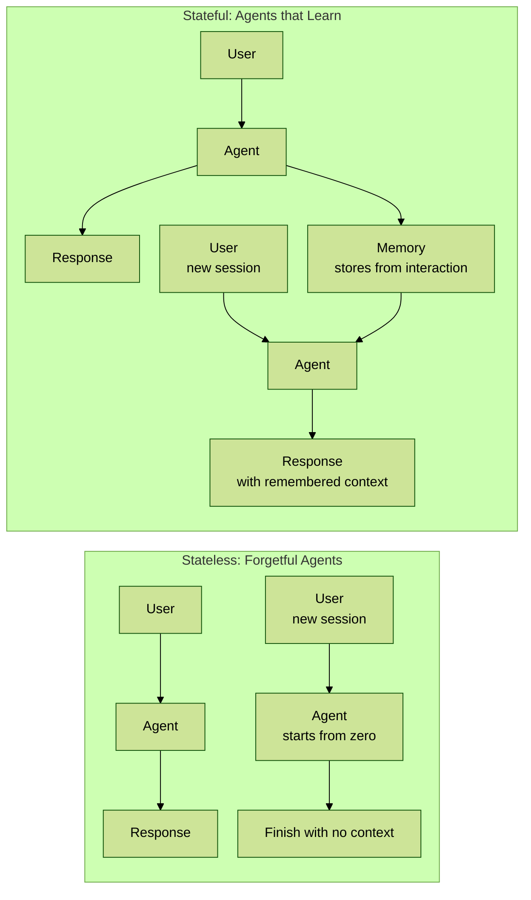

### 3.1 现状与痛点：AI 的“失忆症”

- **核心问题**：与 AI 的交互缺乏连续性。用户需要反复提供背景信息和个人偏好，就像在和一个永远记不住你的朋友说话。
- **“记忆的幻觉”**：文章明确指出，我们感受到的所谓“记忆”来源于两个临时性技术：
  - **上下文窗口（Context Window）**：在单次会话中维持短期对话连贯性。
  - **提示词工程（Prompt Engineering）**：巧妙地将历史信息塞进提示词中。
- **本质缺陷**：目前的 AI 代理绝大多数是**无状态的（Stateless）**，每次交互都是一次独立的、从零开始的计算，无法从过去的经验中学习或随时间适应。

### 3.2 什么是真正的 AI 记忆？

- **核心定义**：AI 代理的记忆是**跨越时间、任务和多次用户交互，持续保留和调用相关信息的能力**。
- **关键特征**：它不是简单地存储聊天记录，而是构建一个**持久的内在状态（persistent internal state）**，这个状态会随着每次交互而演变。
- **记忆的三大支柱**：
  - **状态（State）**：知道“当下”正在发生什么。
  - **持久性（Persistence）**：能够跨会话、跨时间地保留知识。
  - **选择性（Selection）**：智能地决定哪些信息“值得”被记住。
- **最终目标**：实现**连续性（Continuity）**，让 AI 的行为和理解能够连贯地发展。

### 3.3 记忆在 AI 架构中的位置

- **无记忆的代理架构**：由大语言模型（LLM）、规划器（Policy/Planner）、工具（Tools/APIs）和检索器（Retriever）组成。这些组件本身都无法记得“昨天发生了什么”。
- **有记忆的代理架构**：在上述架构中，插入一个专门的**记忆层（Memory Layer）**。这个层级是所有其他组件交互的核心，负责记录和提供历史状态信息，将一次性的“助手”转变为“不断进化的合作者”。

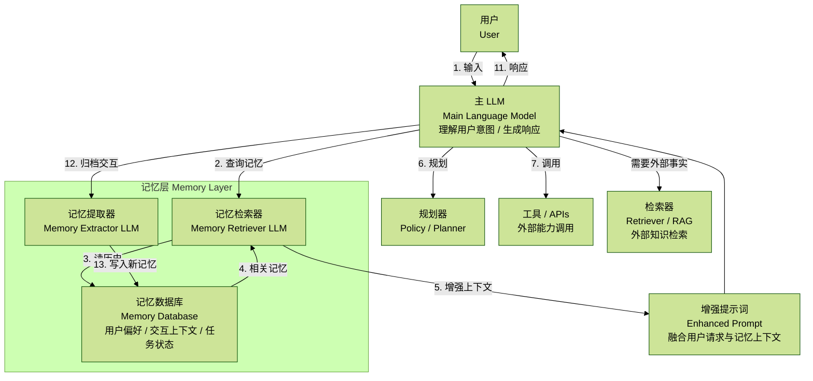

架构组件解析：

1. **用户（User）**：与 AI 代理交互的外部实体，提供输入和指令。
2. **AI 代理核心系统（Agent Core System）**：负责处理当前任务的核心逻辑。
   - **规划器（Planner/Policy）**：系统的“大脑”或总控制器。它接收用户输入，决定下一步需要做什么：是直接调用大模型、查询记忆，还是使用工具。
   - **核心 LLM（Core LLM）**：主要的语言模型，负责推理、理解、生成内容和制定详细的执行计划。它基于规划器提供的增强提示词进行工作。
   - **工具 / APIs（Tools/APIs）**：代理可以使用的外部功能，例如网络搜索、数据库查询、代码执行器、日历管理等。这让代理能够与外部世界交互并执行具体任务。
   - **检索器（Retriever）**：负责从静态的、海量的外部知识库（如 Wikipedia、公司文档）中检索信息，主要用于提供事实性知识，与个性化的“记忆”不同。
3. **记忆层（Memory Layer）**：这是实现“连续性”的关键。它不是一个单一组件，而是一个子系统。
   - **持久化数据库（Persistent Database）**：记忆的物理载体，通常使用向量数据库（Vector DB）或图数据库（Graph DB）。它存储着跨越所有会话的、结构化的用户信息和历史交互记录。
   - **记忆提取 LLM（Memory Extraction LLM）**：一个专门用于“反思”和“总结”的语言模型。它的任务是在一次交互结束后，从对话中提取有价值的、需要长期记住的信息（如用户偏好、关键事实、关系变化），并将其转化为结构化数据写入数据库。
   - **记忆检索 LLM（Memory Retrieval LLM）**：另一个专门的语言模型，负责在交互开始时“回忆”。它会分析当前用户的输入，判断需要从数据库中检索哪些历史信息才能更好地理解和完成当前任务，然后生成相应的查询指令。

#### 交互流程详解（与图示中的数字对应）

整个交互过程可以分为两大阶段：**任务处理（利用记忆）**和**记忆更新**。

**阶段一：任务处理（利用记忆）**

1. **用户输入**：用户向代理发送一个提示或请求，例如：“帮我规划一下周末去东京的旅行，你知道我不喜欢人多的地方。”
2. **任务分析**：规划器接收到请求，识别出任务核心是“规划旅行”，并注意到关键个人偏好：“不喜欢人多的地方”。规划器决定，为了更好地完成任务，需要查询关于该用户的记忆。
3. **生成记忆查询**：规划器将用户请求和上下文信息发送给**记忆检索 LLM**。
4. **检索 LLM 分析**：它认为需要查找与“用户旅行偏好”“之前去过的地方”“提到过的兴趣点”相关的信息，并生成一个对持久化数据库的查询。
5. **读取记忆**：数据库执行查询，返回最相关的历史记忆，例如：`{user_preference: 偏爱安静的自然风光, past_trips: [京都郊区], mentioned_interests: ['摄影', '寺庙']}`。
6. **整合记忆**：记忆检索 LLM 接收到这些零散的记忆片段，并将它们整合成一段通顺的、可供机器阅读的上下文提示。
7. **构建增强提示（Augmented Prompt）**：规划器将用户原始提示与整合后的记忆结合起来，形成信息量更丰富的“增强提示”。例如：“为用户规划东京周末旅行。用户信息：该用户偏爱安静的自然风光和寺庙，喜欢摄影，不喜欢人群拥挤的地方。用户请求：规划周末去东京的旅行。”
8. **核心推理**：规划器将这个增强提示发送给**核心 LLM**。
9. **制定计划与工具调用**：核心 LLM 基于丰富上下文，制定更个性化的计划（例如推荐高尾山而不是拥挤的涉谷），并决定是否需要使用工具（如调用天气 API、搜索交通信息）。
10. **获取工具结果**：工具执行后返回结果（如“周末天气晴朗”）。
11. **生成最终响应**：规划器将工具结果整合后，交由核心 LLM 生成最终的、人性化的回复。
12. **响应用户**：核心 LLM 生成最终答案并呈现给用户。

**阶段二：记忆更新（形成新记忆）**

12a. **归档交互**：在与用户交互结束后（或异步进行），**规划器**将这次完整的对话记录（用户提问、代理回答、使用的工具等）发送到记忆层进行处理。

13. **提取与写入记忆**：**记忆提取 LLM**分析这次完整交互。它会识别出新的、有价值的信息，例如用户在对话中提到“下次想试试滑雪”。然后，它将这个新偏好结构化地写入**持久化数据库**。

通过这个循环，AI 代理的记忆不断演变和丰富，使其在未来的每一次交互中都变得更加了解用户，实现了真正的**连续性**和**进化**。

> 本质：
>
> 1. 提示词里面加一块 Memory，以及怎么用这个 Memory
> 2. 有一个 LLM 从 conversation 中提取结构化的信息存入数据库
> 3. 有一个 LLM 决定需要从数据库里面拿什么数据出来

#### 能记住又有什么用呢？

核心目标：让 AI 在正确的时间，获取正确的信息，从而做出最恰当、最人性化的回应，给用户一种“他在给我量身定做”的感觉。

具体实施策略：构建动态、多维度的用户画像。

- **线索来源感知**：AI 需要明确知道用户来自哪个平台（小红书/抖音）。这第一条信息至关重要，**通过知道客户是通过哪一条内容进行了付费**，能初步了解用户的需求，决定了开场白和沟通风格的基调，能够快速拉近关系。
- **互动历史记忆**：AI 必须具备长期和短期记忆能力，记住用户的每一次互动，包括**填写过的问卷、提出的问题，甚至聊天中的情绪**。
  - **短期记忆**：在当前对话中，能联系上下文，避免重复提问一些基本问题。
  - **长期记忆**：当用户再次互动时，能记起上次的对话要点，比如“上次您问到的那个 XX 问题，我们今晚的课程正好要讲，记得来上课哦”，这种被记住的感觉非常人性化。
- **用户标签体系**：结合企业微信的标签功能，AI 可以根据对话内容自动为用户打上标签，如“价格敏感”“新手小白”“急需购买”等，从而在后续对话中提供更精准的服务。

### 3.4 两个核心技术辨析：为什么现有方案不够好？

这是文章技术论证的重点，区分了记忆与两个最容易混淆的概念。

#### 辨析一：上下文窗口 ≠ 记忆

文章用一个清晰的表格对比了两者的区别：

| 特性 | 上下文窗口（Context Window） | 记忆（Memory） |
| --- | --- | --- |
| 保留性 | 临时的，每次会话重置 | 持久的，跨会话保留 |
| 范围 | 扁平线性的，所有信息权重相同 | 层级结构的，能区分优先级 |
| 扩展成本 | 高，Token 越多，成本和延迟越高 | 低，只存储相关信息 |
| 延迟 | 更慢，输入越大延迟越高 | 更快，经过优化，调用稳定 |
| 调用机制 | 基于邻近度（容易忘记很久前的事） | 基于意图或相关性 |
| 行为模式 | 反应式的，缺乏连续性 | 适应性的，随交互进化 |
| 个性化 | 无，每次都是新用户 | 深度个性化，记住偏好和历史 |

总结：上下文窗口帮助代理在**单次会话内**保持一致，而记忆让代理在**所有会话间**保持智能。

#### 辨析二：RAG（检索增强生成）≠ 记忆

- **根本区别**：RAG 解决的是**知识**问题（从外部文档获取事实），而记忆解决的是**状态**问题（记录内部交互历史和上下文）。
- **RAG 的局限**：它没有时间概念，不知道交互的先后顺序；它是无状态的，每个查询都相互独立；它不理解用户，只是针对任务检索信息；它无法从过去的交互中学习。
- **总结**：RAG 帮助代理**“回答得更好”（answer better）**，而记忆帮助代理**“表现得更聪明”（behave smarter）**。理想的系统需要两者兼备。

### 3.5 记忆的分类体系（类人化设计）

文章借鉴了人类认知，将 AI 记忆进行了分类：

- **短期记忆（Short-term memory）**
  - **工作记忆（Working Memory）**：维持当前对话的连贯性。例如：“你刚才问的最后一个问题是什么？”
- **长期记忆（Long-term memory）**
  - **事实记忆（Factual Memory）**：记住用户的偏好、风格。例如：“你喜欢 Markdown 格式和简短的回答。”
  - **情景记忆（Episodic Memory）**：记住特定的交互事件和结果。例如：“上次我们部署这个模型时，延迟增加了。”
  - **语义记忆（Semantic Memory）**：通过长期交互总结出的抽象知识。例如：“处理 JSON 解析任务通常会让你头疼，需要一个快速模板吗？”

### 3.6 Mem0 的核心优势：如何实现智能记忆？

这部分是文章的核心，揭示了 Mem0 的技术实现理念。它不仅仅是存储，更是一套智能管理系统。**其实就是结合 LLM 筛选 + 时间衰减权重 + 相似度来确定保留什么、去掉什么。**

1. **智能过滤（Intelligent Filtering）**：并非所有信息都值得记住。Mem0 通过**优先级评分**和**上下文标签**，像人脑一样自动过滤掉“噪音”，只存储重要的信息，防止记忆库臃肿。
2. **动态遗忘（Dynamic Forgetting）**：**遗忘不是缺陷，而是一种高级智能特性**。Mem0 会让低相关性、长期未被访问的记忆随时间**衰退**，从而保持记忆系统的高效和敏锐。
3. **记忆巩固（Memory Consolidation）**：模仿人脑的学习过程，根据信息的使用频率、重要性和新近度，将信息在**短期记忆和长期记忆存储之间动态转移**。常用信息被“固化”，优化了调用速度。
4. **跨会话连续性（Cross-Session Continuity）**：Mem0 的核心。记忆状态在不同会话、不同设备、不同时间点之间是**持久且连续的**。

### 3.7 实践应用与最终结论

应用场景：

- **支持代理**：记住用户历史问题，提供更高效和个性化的支持。
- **个人助理**：学习用户习惯，智能安排日程。
- **编程助手**：学习开发者的编码风格、常用工具，甚至避免其讨厌的编码模式。

- **核心结论**：**记忆不是一个高级功能，而是 AI Agent 的“地基”**。在未来，当所有 Agent 都能接入同样强大的大模型时，真正拥有记忆、能够与用户共同成长的代理才会最终胜出。**AI 的未来在于构建能够“记住”我们的伙伴，而非一次性的工具。**

### 3.8 几个核心点

1. **AI 发展的范式转移：从“能力”到“关系”**
   - 过去几年，AI 发展的焦点是提升模型本身的能力（更大的参数、更强的推理）。**构建与用户之间的“关系”**没有记忆，AI 与人的关系永远是短暂的、交易性的。有了记忆，这种关系才能变成持续的、演进的，甚至是情感上的。Mem0 的定位，正是这种“关系型 AI”的核心基础设施。

2. **个性化是未来的“护城河”**
   - 当底层的大模型（如 GPT-5、Gemini 2.0）逐渐成为像电力一样的公共资源时，真正的竞争优势将不再是你用了哪个模型，而是你的服务为用户积累了多少**有价值的、私有的、动态的记忆数据**。一个服务了你一年的“有记忆的 AI 助理”，其价值是任何一个全新的、通用的强大模型都无法替代的。这个由记忆构成的个性化状态，将成为未来 AI 应用最深的“护城河”。

3. **“智能遗忘”是通往更高智能的关键**
   - 文章中“动态遗忘”的概念非常关键。一个只进不出的记忆系统最终会被垃圾信息淹没，导致检索效率低下和决策混乱。**学会忘记不重要的，才能更好地记住重要的**。这不仅是技术上的优化，更是对智能本质的深刻洞察。一个懂得“断舍离”的 AI，才是一个真正高效的 AI。

4. **为真正的“自主代理（Autonomous Agents）”铺平道路**
   - 目前我们谈论的许多自主代理（如 AutoGPT）在实际应用中步履维艰，一个重要原因就是它们无法从长期的、跨任务的失败和成功中学习。它们在每次运行时，都像一个“新生儿”。Mem0 提出的记忆层，恰恰是解决这个问题的关键。一个有记忆的代理才能进行“长期的复盘、总结和自我迭代”。

## 4. Agent+SFT

<下周实操课>

## 5. Agent+RL

### 5.1 kimi-k2

> 首先，报告开宗明义地介绍了 Kimi K2 是一个拥有 **1 万亿总参数和 320 亿激活参数**的混合专家模型（Mixture-of-Experts, MoE）。
>
> MoE 架构并非让所有参数在每次计算中都被激活，而是通过一个“路由器”网络，根据输入内容，动态地选择一小部分“专家”网络（在这里是 32 个）来处理信息。这样的好处是，可以在保持甚至提升模型性能的同时，极大地降低推理成本，使得运行万亿级参数的庞然大物成为可能。

报告的核心贡献主要有三点：

1. **提出 MuonClip 优化器**：为了解决训练万亿参数模型时的不稳定性问题（尤其是注意力 logits 爆炸），他们提出了一种名为 **QK-clip** 的新技术，并将其整合到 Muon 优化器中，成功在 **15.5 万亿**的海量 token 上进行了稳定训练，没有出现任何损失尖峰（loss spike）。【不在本次课程范围内】
2. **大规模“智能体数据”合成流水线**：为了让 Kimi K2 具备强大的“智能体”（Agentic）能力，也就是像一个智能助手一样可以自主规划、使用工具并与环境互动，团队建立了一个复杂的系统来生成高质量的训练数据。@造数据
3. **统一的强化学习框架**：通过结合**可验证奖励（RLVR）和自我批判（self-critique）**机制，让模型不仅能从有明确对错的任务中学习，还能在开放、主观的问题上进行自我评估和提升。@RL

最终，Kimi K2 在众多开源模型中展现了最先进的性能，尤其在**智能体能力、软件工程、编码、数学和推理**等领域表现突出，其目标是成为一个强大的“开放的智能体智能（Open Agentic Intelligence）”基础模型。

#### 引言

Kimi K2 论文摘要强调了几个关键点：

- Kimi K2 是一个 MoE 大语言模型，具有 32B activated parameters 和 1T total parameters。
- MuonClip 优化器改善了 Muon 的训练不稳定问题，同时保持了先进 token efficiency。
- 在预训练阶段，K2 训练了 15.5T tokens，没有出现 loss spike。
- 后训练阶段包括 multi-stage post-training、large-scale agentic data synthesis pipeline 和 joint reinforcement learning (RL) stage，使模型通过真实和合成环境中的交互来提升能力。
- Kimi K2 在 Tau2-Bench、ACEBench、SWE-Bench Verified、SWE-Bench Multilingual、LiveCodeBench v6、AIME 2025、GPQA-Diamond、OJBench 等多项指标上表现强劲，尤其在 agentic capabilities 方面突出。

大语言模型的发展正经历一场面向**智能体智能（Agentic Intelligence）**的深刻范式转变。支撑点是模型在复杂和动态环境中**自主感知、规划、推理和行动的能力**。这类转变标志着从静态的模仿学习转向模型能够主动通过互动学习、获得超越其训练分布的新技能，并通过经验调整行为。

实现智能体智能在预训练和后训练阶段都带来了挑战。预训练必须在有限的高质量数据约束下，赋予模型广泛的通用先验知识，这使得 token 效率，即每个 token 带来的学习信号，成为关键缩放系数。后训练必须将这些先验知识转化为可操作的行为，然而像多步推理、长期规划和工具使用这样的智能体能力，在自然数据中很少见且构建成本高昂。

这一差距，关键在于结合可扩展的、结构化的、高质量的智能体轨迹合成技术，以及能够整合偏好和自我批判的通用强化学习（RL）技术。**造数据和强化学习重要。**

### 5.1.1 预训练

Kimi K2 的基础模型是一个万亿参数的混合专家（MoE）transformer 模型，在 15.5 万亿个高质量 token 上进行了预训练。鉴于高质量人类数据的可用性日益受限，我们认为 token 效率正成为大语言模型扩展的关键系数。为了解决这个问题，他们引入了一套专门为最大化 token 效率而设计的预训练技术。

具体来说，Kimi K2 使用了高 token 效率的 Muon 优化器，并通过引入 QK-Clip 来缓解训练不稳定性。此外，他们结合了合成数据生成，以进一步从可用的高质量 token 中榨取智能。模型架构遵循一种超稀疏 MoE 结构，并采用多头潜在注意力（MLA），类似于 DeepSeek-V3，这是根据经验性缩放定律分析得出的。底层基础设施的构建旨在优化训练效率和研究效率。

#### 5.1.1.1 预训练数据：通过重述（Rephrasing）提高 Token 效用

预训练中的 token 效率指的是在训练中每消耗一个 token 所能获得的性能提升量。增加 token 效用，即每个 token 贡献的有效学习信号，可以增强每次模型更新的单位 token 影响，从而直接提高 token 效率。当高质量 token 供应有限且必须被最大化利用时，这一点尤为重要。

Kimi K2 没有简单地重复接触相同的 token，因为这可能导致过拟合和泛化能力下降。相比 Kimi K1.5，Kimi K2 在预训练数据方面的一个关键进步是**引入了一种合成数据生成策略**，以增加 token 效用。具体来说，采用了一个精心设计的重述流水线，以在不引起显著过拟合的情况下扩充高质量 token 数量。

**知识数据重述**：在自然的、知识密集型文本上进行预训练存在一个权衡：单轮（single epoch）训练不足以让模型全面吸收知识，而多轮重复则会带来递减的回报并增加过拟合风险。为了提高高质量知识 token 的 token 效用，他们提出了一个由以下关键组件组成的合成重述框架：

- **风格和视角多样化的提示**：为了在保持事实完整性的同时增强语言多样性，应用一系列精心设计的提示，引导大语言模型以不同风格和不同视角生成原文的忠实重述。
- **分块自回归生成**：为了在长文档中保持全局连贯性并避免信息丢失，采用一种基于分块的自回归重写策略。文本被分成段落，单独进行重述，然后重新拼接成完整文章。这种方法减轻了 LLM 通常存在的隐式输出长度限制。
- **保真度验证**：为确保原始内容和重写内容之间的一致性，进行保真度检查，比较每个重述段落与其源内容的语义对齐性。这在训练前作为初始质量控制步骤。

重述流水线可以概括为：

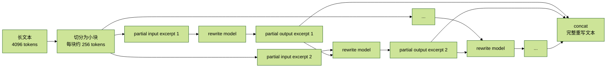

整个流程的关键步骤如下：

1. **输入分块**：将长文本（4096 个 tokens）分成较小的部分，每个部分包含 256 个 tokens，确保上下文得到保留。
2. **逐段重写**：每个部分单独进入重写模型，生成一个部分输出。重写过程是自回归的，意味着每个输出段依赖于之前的段落。
3. **拼接输出**：最后，这些逐段生成的输出会被拼接在一起，形成完整的重写文本。

这种方法适用于长文本，允许在不丢失上下文的情况下逐段处理文本，从而避免了处理时的输入长度限制。

**数学数据重述**：为了增强数学推理能力，遵循 SwallowMath 中引入的方法，将高质量的数学文档重写为**“学习笔记”风格**。此外，通过将其他语言的高质量数学材料翻译成英语来增加数据多样性。

**预训练数据总体情况**：Kimi K2 的预训练语料库包含 15.5 万亿个经过筛选的高质量 token，涵盖四个主要领域：**网络文本、代码、数学和知识**。大多数数据处理流水线遵循 Kimi K1.5 中概述的方法。对于每个领域，都进行了严格的正确性和质量验证，并设计有针对性的数据实验，以确保筛选后的数据集达到高多样性和有效性。

#### 5.1.1.2 模型架构

Kimi K2 是一个 **1.04 万亿**参数的混合专家（MoE）transformer 模型，拥有 **320 亿激活参数**。其架构遵循与 DeepSeek-V3 类似的设计，采用多头潜在注意力（MLA）作为注意力机制，模型隐藏维度为 7168，MoE 专家隐藏维度为 2048。

| 指标 | DeepSeek-V3 | Kimi K2 | 变化 |
| --- | --- | --- | --- |
| 层数 | 61 | 61 | = |
| 总参数 | 671B | 1.04T | ↑ 54% |
| 激活参数 | 37B | 32.6B | ↓ 13% |
| 专家总数 | 256 | 384 | ↑ 50% |
| 每个 Token 激活专家数 | 8 | 8 | = |
| 共享专家数 | 1 | 1 | = |
| 注意力头数 | 128 | 64 | ↓ 50% |
| 密集层数 | 3 | 1 | ↓ 67% |
| 专家分组 | 是 | 否 | - |

#### 5.1.1.3 训练方案

使用一个 4096-token 的上下文窗口，通过 MuonClip 优化器（算法 1）和 WSD 学习率调度对模型进行预训练，总共处理了 15.5 万亿 token。最初的 10 万亿 token 在 500 步的预热后，以 `2e-4` 的恒定学习率进行训练；随后的 5.5 万亿 token 使用余弦衰减从 `2e-4` 降至 `2e-5`。权重衰减始终设置为 0.1，全局批次大小保持在 6700 万个 token。

在预训练的末期，进行了一个退火阶段，随后是一个长上下文激活阶段。批次大小保持在 6700 万个 token 不变，而学习率从 `2e-5` 衰减到 `7e-6`。在此阶段，模型在 4k 序列长度上训练了 4000 亿个 token，随后在 32k 序列长度上额外训练了 600 亿个 token。为了将上下文窗口扩展到 128k，采用了 YaRN 方法。

### 5.1.2 后训练

#### 5.1.2.1 监督微调（SFT）

采用 Muon 优化器进行后训练，并推荐将其用于 K2 的微调。这是基于之前工作的结论，即一个使用 Muon 预训练的检查点，在进行 Muon 微调时能获得最佳性能。

> **重要**：构建了一个**涵盖多样化领域的大规模指令微调数据集**，遵循两个核心原则：最大化提示多样性和确保高质量的响应。
>
> 1. 为不同任务领域开发一套数据生成流水线，每套都结合了**人工标注、提示工程和验证过程**。采用 K1.5 和其他内部领域专家模型为各种任务生成候选响应，然后由 LLM 或人工裁判进行自动质量评估和筛选。
> 2. 对于智能体数据，创建了一个数据合成流水线，通过多步、交互式推理来教授模型工具使用能力。

#### 用于工具使用学习的大规模智能体数据合成

现代 LLM 智能体的一个关键能力是自主使用不熟悉的工具，与外部环境互动，并通过推理、执行和纠错来迭代地优化其行动。智能体工具使用能力对于解决需要与现实世界系统动态交互的复杂、多步骤任务至关重要。

数据合成流水线有三个阶段：

- **工具规范生成**：首先从真实世界工具和 LLM 合成工具中构建一个大型工具规范库。
- **智能体和任务生成**：对于从工具库中采样的每个工具集，生成一个使用该工具集的智能体以及相应任务。
- **轨迹生成**：对于每个智能体和任务，生成智能体通过调用工具完成任务的轨迹。

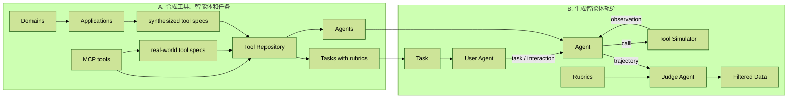

**A 部分：合成工具、智能体和任务（世界构建阶段）**

1. **第一步：构建一个庞大的工具库（Tool Repository）**
   - **来源一（左侧）真实世界工具（real-world tool specs）**：团队从 `MCP tools`（模型上下文协议工具，可以理解为来自 GitHub 等平台的真实 API）中提取了超过 3000 个真实世界的工具规范。这确保了训练数据的**真实性和实用性**。
   - **来源二（中间）合成工具（synthesized tool specs）**：为了极大地扩展工具多样性和覆盖面，团队设计了一个分层生成流程：从顶层的 Domain（领域，如金融、医疗、机器人）出发，向下衍生出具体的 Applications（应用，如股票交易、病历分析、机械臂控制），最后为这些应用**合成**具体的工具规范。这个过程产生了超过 20,000 个合成工具。

这种“真实 + 合成”的混合策略非常有用。真实工具保证模型能解决现实问题，而合成工具则保证了对规模和多样性扩展，让模型能够学习到举一反三的泛化能力，即使遇到从未见过的工具也能快速上手。

2. **第二步：生成多样化的智能体（Agents）**
   - 流程从 Tool Repository 出发，通过组合不同的工具，并为每种组合搭配不同的系统提示（System Prompt），生成了数千个具有不同能力、专长和行为模式的**智能体（Agents）**。
   - 例如，一个智能体可能是“旅游规划专家”，被赋予了查询航班、预订酒店和查找景点的工具；另一个智能体可能是“数据分析师”，被赋予了数据处理、图表绘制和统计分析的工具。

3. **第三步：生成带评分标准的任务（Tasks with rubrics）**
   - 针对每一个被创建出来的智能体，系统会生成一系列与之能力相匹配的任务。
   - 最关键的一点是，每个任务都附带一个明确的**评分标准（Rubrics）**。这个标准详细定义了：
     - **成功标准**：怎样才算完成了任务。
     - **预期工具使用模式**：完成这个任务大概需要调用哪些工具，顺序是怎样的。
     - **评估检查点**：任务执行过程中的关键节点，需要检查哪些中间结果。

> `Tasks with rubrics` 是整个流水线能够自动化和保证高质量的核心。它为后续的评估阶段提供了一个客观、可量化的“评分标准答案”，使得机器（Judge Agent）能够代替人类进行大规模质量评估。

**B 部分：生成智能体轨迹（模拟与评估阶段）**

这个阶段是让 A 阶段构建的世界“活”起来，通过模拟智能体的行动来产生最终训练数据。

1. **第四步：模拟交互，生成轨迹（Generating agent trajectories）**
   - 这是一个**多智能体模拟环境**，主要包含三个角色：
     - **User Agent（用户智能体）**：一个 LLM 扮演的用户，它会根据给定的 Task（任务），以自然的对话方式向 Agent（智能体）提出请求和追问。
     - **Agent（智能体）**：这是待训练的模型，它接收来自 User Agent 的互动，推理自己的思考并做出决策。
     - **Tool Simulator（工具模拟器）**：这是一个“世界模型”。当 Agent 决定调用某个工具时，它会模拟该工具的执行，并返回一个结果（observation）给 Agent。这个模拟器可以返回成功结果，也可以返回错误信息、网络延迟等真实世界中可能遇到的情况。
   - 整个互动的完整记录，从用户的第一个问题，到智能体的每一步思考、每一次工具调用和每一次观察，都会形成一条轨迹（trajectories）。

2. **第五步：评估与过滤（Evaluation and Filtering）**
   - 生成的大量轨迹会被送到 `Judge Agent`（裁判智能体）。
   - `Judge Agent` 会同时拿到 `trajectories`（轨迹）和这个任务对应的 `Rubrics`（评分标准）。
   - 它会像一个严格的考官一样，对照评分标准，判断这条轨迹中的智能体是否成功、高效、合规地完成了任务。
   - 只有那些被裁判判定为“合格”的轨迹，才会被筛选出来，形成最终的**已过滤数据（Filtered Data）**。

这个过程本质上是一种**大规模的自动化拒绝采样（Rejection Sampling）**。系统“疯狂”地生成各种可能的解决方案（轨迹），然后用一个高质量的自动化裁判筛选掉所有不合格的方案。这极大地提升了数据的质量和生成效率，远比依赖人工标注要快得多。

#### 这个流水线的核心价值

Kimi K2 的这个数据合成流水线是一个高度工程化的复杂系统，其核心价值在于：

- **可扩展性（Scalability）**：通过自动化生成和评估，能够以远超人力的方式创造海量数据。
- **高质量（High Quality）**：严格的评分标准和裁判机制确保了每一条用于训练的数据都是智能体成功解决问题的“正面范例”。
- **多样性（Diversity）**：覆盖真实和合成的数万种工具、数千种智能体和无数任务场景，确保了模型强大的泛化能力。

正是通过这个“数据工厂”源源不断地产生养料，Kimi K2 才得以学习到复杂、多步、需要与外部世界交互的智能体能力，从而在众多基准测试中脱颖而出。

与真实执行环境的混合方法虽然模拟提供了可扩展性，但仍存在模拟保真度的内在局限。为了解决这个问题，他们用**真实的执行沙箱（下节课带大家实操）**来补充模拟环境，尤其是在真实性至关重要的场景中，比如编码和软件工程任务。

通过结合可扩展模拟和有针对性的真实世界执行混合流水线，系统生成了多样化、高质量的工具使用演示，平衡了覆盖范围和真实性。

> 下节课会带大家实操 agent sft 的流程。

#### 5.1.2.2 强化学习（RL）

> 核心是奖励信号怎么做。

**第一：可验证奖励-有 GT（Verifiable Rewards Gym）**

这部分处理的是那些**有明确对错、可以被程序或规则客观判断**的任务。Kimi 团队把它比作一个“健身房”（Gym），模型可以在里面不断练习，并立即得到“做对了”或“做错了”的反馈。

这个“健身房”里包含以下几类训练项目：

1. **数学、STEM 和逻辑任务**
   - **策略**：遵循“多样化覆盖”和“中等难度”两个原则。
   - **具体做法**：
     - **多样化覆盖**：不仅从专家标注和公开数据集中收集高质量问答，还使用一个**标签系统**来确保覆盖到那些比较冷门的领域。对于逻辑任务，准备各种各样的谜题，比如 24 点游戏、数独、谜语、密码破译等，以确保模型见多识广。
     - **中等难度**：太简单或太难的任务都无法提供有效学习信号。因此，用已经训练好的 SFT 模型去跑一遍题目，通过 `pass@k`（即模型生成 k 次答案能答对的概率）来评估难度，只挑选那些**难度适中**的题目来做 RL 训练。

2. **复杂指令遵循（Complex Instruction Following）**
   - **挑战**：真正理解并执行复杂指令，不仅要看懂字面意思，还要理解隐含要求、处理边界情况，并在多轮对话中保持一致。
   - **策略**：建立一个“混合验证框架”来确保精确性和鲁棒性。
   - **具体做法**：
     - **代码解释器（确定性评估）**：对于像“生成一个长度为 100 词的段落”或“按照某种风格写作”这类可以被代码验证的指令，直接用程序判断对错。
     - **LLM 作为裁判（LLM-as-judge）**：对于需要细致理解的指令（比如“语气要委婉”），让另一个强大的 LLM 来做裁判。
     - **防作弊检查层（hack-check layer）**：为了防止模型“口头答应”但实际没做到（例如，它回复说“好的，这是一个 100 词的段落”，但实际上只写了 50 词），增加额外检查层，专门揪出这种“欺骗行为”。
   - **多源指令生成**：为了让模型面对的指令足够丰富和刁钻，他们从三个渠道生成指令：
     - 人类专家精心设计的复杂指令。
     - 受 AutoIF 启发的智能体指令增强。
     - 用一个专门微调过的模型来生成深测模型弱点的指令。

3. **忠实性（Faithfulness）**
   - **挑战**：在多轮工具使用、自我推理等场景下，模型必须忠于事实，不能凭空捏造。
   - **策略**：训练一个专门的“句子级忠实性裁判模型”。
   - **具体做法**：这个裁判模型会自动检测模型生成的句子是否在上下文中得到了证据支持。它本身就作为一个**奖励模型**：如果 Kimi K2 生成的句子是忠实的，就给予奖励；如果是“幻觉”，就给予惩罚。

4. **编码与软件工程**
   - **挑战**：解决真实世界中复杂的编程和软件开发问题。
   - **策略**：构建一个包含问题、代码和自动评判的强大环境。
   - **具体做法**：从开源数据集和合成数据中收集编程问题。更重要的是，从 **GitHub** 上收集大量 pull requests 和 issues，并搭建了一个基于 Kubernetes 的强大沙箱基础设施。这个设施可以同时稳定运行超过 10,000 个沙箱实例，让模型在真实环境中修复 bug 或实现功能，并通过**单元测试**判断是否成功。这提供了非常直接和可靠的奖励信号。

5. **安全（Safety）**
   - **挑战**：抵御各种“越狱”攻击（如角色扮演、学术讨论等方式诱导模型输出不安全内容）。
   - **策略**：建立一个自动化的**攻防演练**流水线。
   - **具体做法**：流水线包含三个关键角色：
     - **攻击模型（Attack Model）**：不断迭代生成旨在引出不安全回答的对抗性提示。
     - **目标模型（Target Model）**：即 Kimi K2，对这些攻击提示做出回应。
     - **裁判模型（Judge Model）**：评估这次攻击是否成功绕过了安全机制。
   - 这个“猫捉老鼠”的游戏会持续进行，从而不断增强模型的安全防护能力。

**第二：自我批判奖励（Self-Critic Reward）**

这部分处理的是那些**没有标准答案、依赖主观偏好**的任务，比如创意写作、开放式问答等。

- **挑战**：机器无法像评判代码对错一样来评判一首诗的好坏。
- **策略**：引入**自我批判**奖励机制，让模型学会自己判断自己的输出。
- **具体做法**：
  1. 对于一个主观问题（比如“写一首关于秋天的诗”），让模型生成**多个不同的答案**。
  2. 然后，模型会切换到**评判家**角色，对这些自己生成的答案进行**成对比较（pairwise comparisons）**，判断“我认为诗 A 在押韵和意境上比诗 B 更好”。
  3. 通过大量的自我比较，模型为自己创造出了偏好数据（A > B、C > A 等）。
  4. 这个偏好信号被用作奖励，训练模型以后多生成它自己认为“更好”的答案。

总结：

Kimi K2 的强化学习是一个**双管齐下**的精密系统：

1. 对于客观世界，它建立了一个庞大的“健身房”，里面有数学、逻辑、编程等各种项目，通过**可验证的、非黑即白的奖励**来锻炼模型的硬技能。
2. 对于主观世界，它教会模型进行**自我批判和反思**，通过比较和选择自己的答案来形成审美和偏好，提升创造性、流畅性等软实力。

这种结合使得 Kimi K2 能够在一个统一的 RL 范式下，全面提升从解决复杂工程问题到进行创意写作的各种能力，从而变得更加强大和通用。

> Kimi-K2 没说详细怎么训练，下面 5.2 我们进行详细讲解。

### 5.1.3 局限性

在内部测试中，当前 Kimi K2 模型存在一些局限性。在处理困难的推理任务或不清晰的工具定义时，模型可能会生成过多的 token，有时会导致输出被截断或工具调用不完整。此外，在某些任务上，如果不必要地启用了工具使用，性能可能会下降。在构建完整的软件项目时，单次提示的成功率不如在智能体编码框架下使用 K2。团队正在努力在未来版本中解决这些问题，并期待更多反馈。

### 5.2 ToolRL：Reward is All Tool Learning Needs

> Agent + RL 的核心是：完成一个端到端任务时，要判断需要调用哪些工具、如何训练、如何设计奖励信号。
>
> 前置知识：
>
> 1. `functioncall`【第四周】
> 2. `grpo`【第十周】

#### 5.2.1 什么是 tool-use

1. **为什么要有**
   - LLM 不擅长计算。
   - LLM 不能获取最新 knowledge。
   - LLM 不能与真实世界交互（网络环境信息、API 调用等）。

2. **什么时候使用，怎么用的准**

SFT 是强化记忆、过度思考；RL 更具有泛化性能，RL 可以更加习得泛化性。

#### 5.2.2 如何用 RL 做 tool-use

主要挑战：**为工具使用设计奖励信号。**

- 工具使用复杂：多步骤、多工具、多种参数。
- 简单的奖励（例如最终答案匹配）过于粗糙、稀疏。

研究问题：如何设计有效的**奖励信号**，来通过强化学习训练 LLM 进行通用、稳健的工具选择与应用？

工具使用更加灵活，也更加复杂。

示例：任务目标是 **Irrelevant Tool Detection**，用户问：“What’s the distance between San Francisco and Los Angeles in kilometers?”，可用工具却是 `get_date`。SFT 模型可能因为“应该尽量调用工具”的长思维惯性而错误调用 `get_date`；RL 模型则能判断该工具不适合计算距离，并拒绝调用，直接给出应该使用距离计算器或地图服务的说明。

这说明 ToolRL 的关键不是“让模型更爱调用工具”，而是让模型学会：

1. 什么时候该调用工具。
2. 调什么工具。
3. 参数该怎么填。
4. 什么时候应该拒绝不合适的工具。

#### 奖励设计的直觉：回忆一下 GRPO

我们的核心在于怎么定于 Reward：

1. 有的任务工具多，有的工具调用少，工具调用冗余了怎么办。
2. 工具调用名字正确 + 参数正确。

可参考 Qwen function calling 文档：https://qwen.readthedocs.io/en/latest/framework/function_call.html

多轮工具训练的系统提示示例：

```text
System Prompt for Multi-turn Training

You are a helpful multi-turn dialogue assistant capable of leveraging tool calls to solve user tasks and provide structured chat responses.

Available Tools
In your response, you can use the following tools:
{{tool list}}

Steps for Each Turn
1. Think: Recall relevant context and analyze the current user goal.
2. Decide on Tool Usage: If a tool is needed, specify the tool and its parameters.
3. Respond Appropriately: If a response is needed, generate one while maintaining consistency across user queries.

Output Format
<think> Your thoughts and reasoning </think>
<tool_call>
{"name": "Tool name", "parameters": {"Parameter name": "Parameter content", "...": "..."}}
{"name": "...", "parameters": {"...": "...", "...": "..."}}
</tool_call>
<response> AI's final response </response>

Important Notes
1. You must always include the <think> field to outline your reasoning. Provide at least one of <tool_call> or <response>. Decide whether to use <tool_call> (possibly multiple times), <response>, or both.
2. You can invoke multiple tool calls simultaneously in the <tool_call> fields. Each tool call should be a JSON object with a "name" field and a "parameters" field containing a dictionary of parameters. If no parameters are needed, leave the "parameters" field an empty dictionary.
3. Refer to the previous dialogue records in the history, including the user's queries, previous <tool_call>, <response>, and any tool feedback noted as <obs> (if exists).
```

#### 5.2.3 奖励设置

ToolRL 中的奖励可以分为两大类：

- **格式奖励 `R_format`**
- **内容/正确性奖励 `R_correct`**

总体形式可以写成：

$$
R_{final} = R_{correct} + R_{format}
$$

##### 格式奖励

这是模型学习使用工具的第一步，也是最基础的一步。`R_format` 的目标是教会模型以正确的结构或语法来输出它的思考过程和工具调用。它不关心模型思考的内容或调用的工具对不对，只关心格式本身。

- **如何计算**：这是一个非常简单的二元奖励（Binary Reward），只有两个值：`1`（正确）或 `0`（错误）。
- **奖励为 1 的条件**：模型的输出严格遵守了预定义的格式。示例中，模型必须先输出 `<think>...</think>` 标签来表达思考过程，然后再输出 `<tool_call>...</tool_call>` 标签来调用工具。顺序和标签都不能错。
- **奖励为 0 的条件**：任何不符合这个格式的输出都会得到 0 分。

示例：

- **Rollout 1（模型第一次尝试）**
  - 输出：`<think>...</think><tool_call>...</tool_call>`
  - 结果：得分 1，因为它完整遵循了“先思考，后调用”的结构。
- **Rollout 2（模型第二次尝试）**
  - 输出：`<think>...</think><response>...</response>`
  - 结果：得分 0。虽然它也“思考”了，但它没有调用工具，而是直接输出了最终回复，不符合当前任务要求的格式。
- **Ground Truth（标准答案）**
  - 正确格式应该是：`<think>...</think><tool_call>...</tool_call>`
  - `Rollout 1` 与之匹配，`Rollout 2` 不匹配。

**为什么这一步很重要？**

这就像教一个新手程序员写代码。你首先要告诉他，函数的定义必须是 `def function_name(parameters):`，这个语法不能错。`R_format` 就是在教模型这个“语法”。只有模型学会了正确的语法，系统才能准确地解析出它的意图（“哦，它现在想调用工具了”）并执行相应操作。

##### 内容奖励

`R_correct` 的设计非常有层次感，它将“正确性”分解为三个环环相扣的检查点，一步比一步深入：

1. **工具名称匹配（Tool Name Matching）**：工具选对了吗？
2. **参数名称匹配（Parameter Name Matching）**：工具的“输入框”填对了吗？
3. **参数内容匹配（Parameter Content Matching）**：输入框里的“内容”填对了吗？

这个奖励的取值范围是 `[-3, 3]`，意味着它不仅有奖励，还有惩罚。

**第一部分：工具名称匹配（Tool Name Match）**

这是最基础的正确性检查。

- **检查什么**：模型预测调用的工具（Predict）和标准答案（Ground Truth）要求的工具是否一致。
- **例子解释**：
  - 上方案例：标准答案要求调用 `Get_Price`，模型预测也调用了 `Get_Price`，结果完全匹配，得分高。
  - 下方案例：标准答案要求调用 `Get_Price` 和 `Get_Flight` 两个工具。模型预测调用了两次 `Get_Price`，漏掉了 `Get_Flight`，并且错误地重复了 `Get_Price`，结果严重错误。
- **关键点**：如果模型连最基本的工具都选错了，后续的参数就算填得再好也是徒劳，所以这一步的重要性非常高。

**第二部分：参数名称匹配（Parameter Name Match）**

在工具选对的前提下，检查参数的“钥匙”对不对。

- **检查什么**：模型为所选工具提供的参数名称，是否是该工具 API 定义中有效、正确的名称。
- **例子解释**：
  - 左侧案例（Tool 1）：标准答案要求的参数名是 `loc_1` 和 `loc_2`，模型预测的参数名也是 `loc_1` 和 `loc_2`，完全匹配。
  - 右侧案例（Tool 1）：标准答案要求的参数名是 `from` 和 `to`，模型预测的参数名却是 `loc_1` 和 `loc_2`，不完全匹配，得分很低。
- **关键点**：这一步检查的是模型对工具 API 的“记忆”和“理解”是否准确。比如一个查询航班的 API，它的出发地参数可能叫 `departure_city`，如果模型错误地记成 `from_city`，调用就会失败。

**第三部分：参数内容匹配（Parameter Content Match）**

工具选对了，参数名也对了，最后检查参数的“值”对不对。

- **检查什么**：模型为参数提供的具体数值是否和标准答案一致。这通常意味着模型是否能从用户对话中**准确提取信息**。
- **例子解释**：
  - **Tool 1 案例**：标准答案要求 `loc_1` 是 `ORD`，`loc_2` 是 `SFO`。模型预测完全一致，得分高。
  - **Tool 2 案例**：标准答案要求 `loc_1` 是 `ORD`，`loc_2` 是 `LAX`。模型预测时遗漏了 `loc_1`，`loc_2` 填对了 `LAX`。结果部分错误，因为有遗漏，所以会扣分。
  - **更复杂案例**：如果模型把 `Tool Name` 填成 `Get_Flight`，而正确工具应是 `Get_Price`，这是一级联错误。即使参数内容看起来和用户原文有关系，整个得分也会因为根源上的错误而被重罚。

总结：`R_correct` 通过这三个递进的检查点，为模型的工具调用行为提供了一个非常精细和具体的反馈信号。

1. **获得高分（正奖励）**：模型必须三关全过，不仅工具选得对，参数名和参数值也必须完全正确。
2. **获得低分或小惩罚**：模型可能工具选对了，但某个参数的名称或内容填错了。这告诉模型：“大方向没错，但细节需要改进。”
3. **获得重罚（大的负奖励）**：模型在第一步就选错了工具。这传递一个强烈信号：“你从一开始就错了，这个决策路径是完全错误的！”

通过这种细致的奖励设计，强化学习算法可以准确地定位模型犯错的环节，并进行有针对性的优化，而不是给出一个模糊的“好”或“坏”的评价。这使得训练过程更加高效，最终让模型学会既遵守格式，又能做出正确决策。

#### 5.2.4 结果分析

**ToolRL Test Setting（ToolRL 测试设置）**

- **Training Data（训练数据）**：4K diverse examples（ToolACE、Hammer-Masked、XLAM），覆盖单/多工具调用、不同复杂度级别。
- **Models（模型）**：Qwen-2.5 Series（1.5B、3B、7B）、Llama-3.2-Instruct（3B）。
- **Evaluation Benchmarks（评估基准）**：
  - **BFCL**：Comprehensive tool use（multi-turn, relevance, etc.），综合工具使用评估，包括多轮、相关性等。
  - **API-Bank**：Multi-turn API interaction complexity，多轮 API 交互复杂度评估。
  - **Bamboogle**：Free-form multi-hop QA，自由形式的多跳问答，用于评估到目标导向任务的泛化能力。
- **Baselines（基准方法）**：
  - Raw Instruct Model（原始指令微调模型）
  - SFT（on 400 / 4K RL data），在 400 / 4K RL 数据上进行监督微调
  - PPO（Cold Start / initialized from SFT）
  - GRPO（Cold Start / initialized from SFT）

结论：**GRPO 获得了约 17% 的准确率提升。**

#### 5.2.5 Reward 的影响分析

论文主结果显示：左侧是 BFCL、Bamboogle、API-Bank 等 benchmark 的整体结果，右侧是 GRPO Cold Start 在不同模型上的训练奖励趋势。采用提出的奖励设计后，GRPO Cold Start 一致取得最高性能，且奖励曲线在训练过程中快速上升。

为了理解提出的奖励设计为何有效，作者通过改变奖励的不同方面进行消融研究。

重点研究的关键维度：

- **长度奖励（Length Reward）**
  - 鼓励更长的推理（`<think>` 模块）有帮助吗？
  - Does encouraging longer reasoning (`<think>` block) help?
- **奖励的尺度与动态性（Reward Scale & Dynamics）**
  - “格式”和“正确性”奖励之间的相对权重有多重要？这个权重应该随时间变化吗？
  - How important is the relative weighting between Format and Correctness, and should this weighting change over time?
- **奖励的粒度（Reward Granularity）**
  - “正确性”奖励需要有多详细？是分开评估工具名称、参数名称、参数值，还是合并评估？
  - How detailed does the Correctness reward need to be, evaluating tool name, parameter names, parameter values separately vs. combined?

##### 奖励设计分析：长度（Reward Design Analysis: Length）

**设置（Setup）**：引入一个额外的奖励部分，该奖励与模型 `<think>` 模块的长度成正比，即**带有长度奖励（Length Reward）**。随着训练步骤逐渐增加，这个长度奖励是**动态（Dynamic）**的。

| 模型（Model） | 总体准确率（Overall Acc） |
| --- | --- |
| Qwen2.5-1.5B-Instruct（原始） | 46.20% |
| Qwen2.5-1.5B-Instruct（带长度奖励） | 33.23% |
| Qwen2.5-1.5B-Instruct（动态） | 28.51% |
| Qwen2.5-3B-Instruct（原始） | 52.98% |
| Qwen2.5-3B-Instruct（带长度奖励） | 48.89% |
| Qwen2.5-3B-Instruct（动态） | 48.24% |
| Llama-3.2-3B-Instruct（原始） | 44.10% |
| Llama-3.2-3B-Instruct（带长度奖励） | 44.98% |
| Llama-3.2-3B-Instruct（动态） | 43.15% |

> **结论 1（Takeaway 1）**：虽然长度奖励**鼓励了更长的推理轨迹**，但它并不能稳定地提升任务性能，在较小的模型上甚至可能有害。这凸显了**更长的推理对于工具使用任务而言并非天生就更好**。

##### 奖励设计分析：尺度（Reward Design Analysis: Scale）

**设置（Setup）**：将“格式”和“正确性”奖励的最大值设为相等（**Equal Max**）；在某个阈值步骤时，突然切换“格式”和“正确性”奖励的最大值（**Two Stage**）；逐渐改变“格式”和“正确性”奖励的最大值（**Dynamic**）。

| 模型（Model） | 总体准确率（Overall Acc） |
| --- | --- |
| Qwen2.5-1.5B-Instruct（原始） | 46.20% |
| Qwen2.5-1.5B-Instruct（相等最大值） | 39.47% |
| Qwen2.5-1.5B-Instruct（两个阶段） | 38.85% |
| Qwen2.5-1.5B-Instruct（动态） | 45.71% |
| Qwen2.5-3B-Instruct（原始） | 52.98% |
| Qwen2.5-3B-Instruct（相等最大值） | 51.76% |
| Qwen2.5-3B-Instruct（两个阶段） | 50.66% |
| Qwen2.5-3B-Instruct（动态） | 53.81% |
| Llama-3.2-3B-Instruct（原始） | 44.10% |
| Llama-3.2-3B-Instruct（相等最大值） | 42.47% |
| Llama-3.2-3B-Instruct（两个阶段） | 41.33% |
| Llama-3.2-3B-Instruct（动态） | 46.85% |

> **结论 2（Takeaway 2）**：在训练期间**逐渐调整奖励尺度**（从格式奖励开始，然后平滑地过渡到正确性奖励），比静态尺度或突然变化**更能支持学习和泛化**。

##### 奖励设计分析：粒度（Reward Design Analysis: Granularity）

**设置（Setup）**：与原始奖励相比，作者进一步设计了三个版本：

- **细粒度（Finegrained）**：使所有名称匹配和参数值的匹配独立计算，即必须完全正确。
- **中等粒度（Intermediate）**：合并了参数名称和参数值的匹配。
- **粗粒度（Coarse）**：要求整个工具调用集合完全精确匹配。

| 模型（Model） | 总体准确率（Overall Acc） |
| --- | --- |
| Qwen2.5-1.5B-Instruct（原始） | 46.20% |
| Qwen2.5-1.5B-Instruct（细粒度） | 40.71% |
| Qwen2.5-1.5B-Instruct（中等粒度） | 37.65% |
| Qwen2.5-1.5B-Instruct（粗粒度） | 36.72% |
| Qwen2.5-3B-Instruct（原始） | 52.98% |
| Qwen2.5-3B-Instruct（细粒度） | 52.06% |
| Qwen2.5-3B-Instruct（中等粒度） | 51.36% |
| Qwen2.5-3B-Instruct（粗粒度） | 51.40% |
| Llama-3.2-3B-Instruct（原始） | 44.10% |
| Llama-3.2-3B-Instruct（细粒度） | 39.82% |
| Llama-3.2-3B-Instruct（中等粒度） | 38.62% |
| Llama-3.2-3B-Instruct（粗粒度） | 35.95% |

> **结论 3（Takeaway 3）**：**细粒度的奖励分解**提供了更丰富的学习信号，凸显了其在**实现更有效训练**方面的作用；相比之下，粗粒度的奖励方案会阻碍学习过程并降低最终性能。

##### 总结：奖励是工具学习所需要的一切（Reward Is All Tool Learning Needs）

粒度足够细，长度不影响，scale 影响小。

1. **问题（Problem）**：SFT（监督微调）在为大语言模型实现鲁棒、可泛化的工具使用方面存在困难。
2. **解决方案（Solution）**：使用强化学习（RL，具体为 GRPO 算法）的 **ToolRL** 框架，配合一个有原则的、细粒度的奖励设计。该设计同时关注**格式**和**分解后的正确性**。
3. **Key Insight**：奖励工程（在粒度、尺度、类型等方面）对于释放强化学习在复杂大语言模型工具学习方面的潜力**至关重要**。
