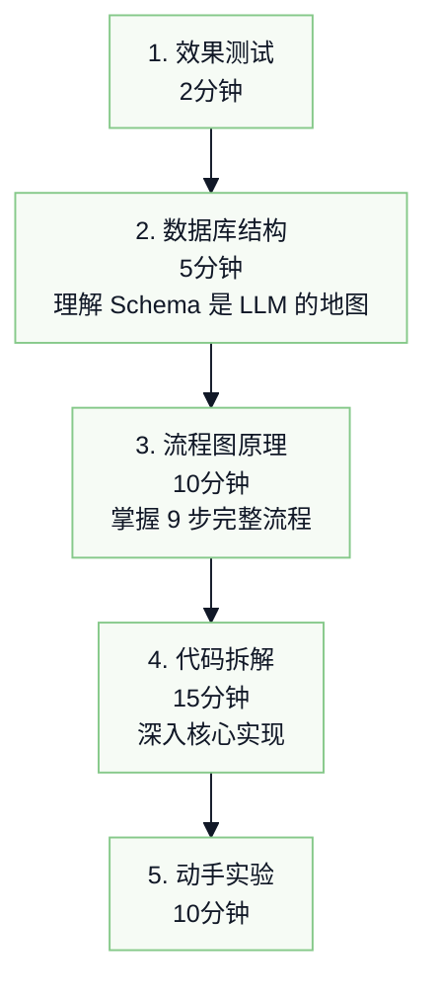
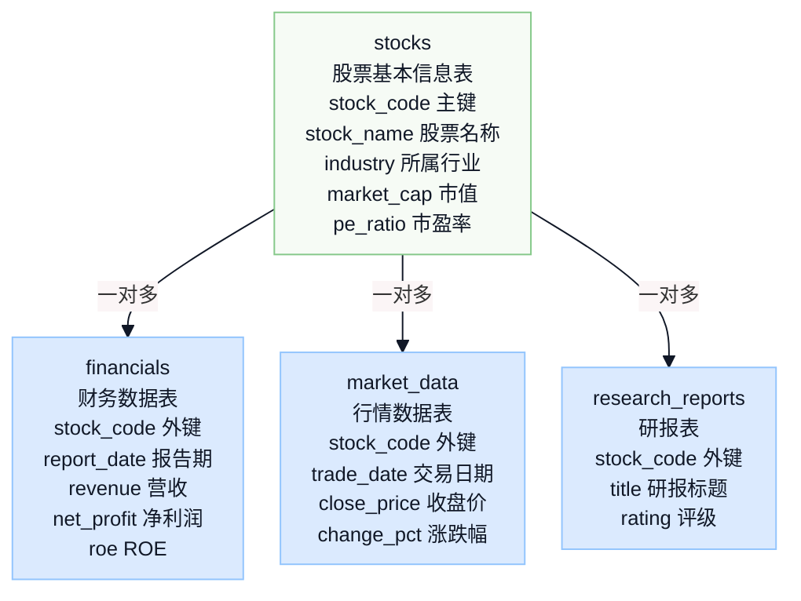
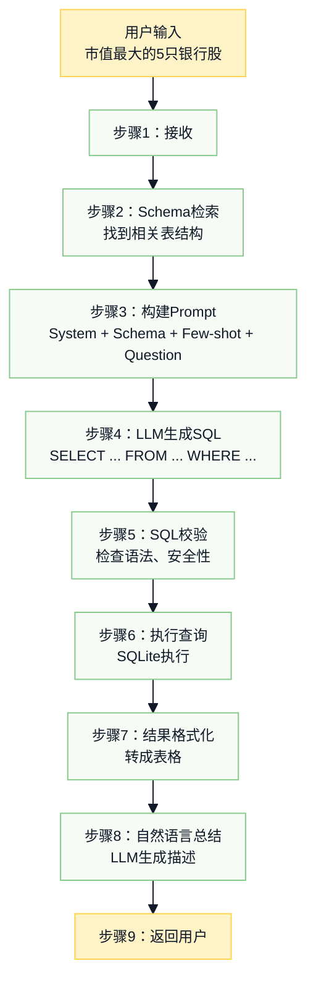
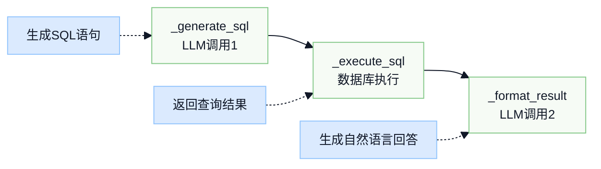

# 第三周-01: Text2SQL代码学习顺序

## 📘 Text2SQL 讲解指南

> “Text2SQL的本质就是：教会LLM看懂你的数据库，然后让它当翻译官。转化为sql语句”

## 📚 学习概览



```text
┌────────────────────────────────────────────────────┐
│  1. 效果测试（2分钟）                              │
│        ↓                                           │
│  2. 数据库结构（5分钟）  →  理解Schema是LLM的“地图” │
│        ↓                                           │
│  3. 流程图原理（10分钟） →  掌握9步完整流程          │
│        ↓                                           │
│  4. 代码拆解（15分钟）  →  深入核心实现             │
│        ↓                                           │
│  5. 动手实验（10分钟）                             │
└────────────────────────────────────────────────────┘
```

## 第一步：效果演示

根据 `README.md` 里面接口，用 postman 进行测试。

## 第二步：理解数据库结构

文件位置：`database/models.py`

### 四张核心表

```python
# 表1: 股票基本信息
class Stock:
    stock_code   # 股票代码（主键）- "601398"
    stock_name   # 股票名称 - "工商银行"
    industry     # 行业 - "银行"
    market_cap   # 市值(亿) - 15000
    pe_ratio     # 市盈率 - 5.2

# 表2: 财务数据
class Financial:
    stock_code   # 外键，关联股票
    report_date  # 报告期 - "2024-12-31"
    revenue      # 营收
    net_profit   # 净利润
    roe          # ROE(%)

# 表3: 行情数据
class MarketData:
    stock_code
    trade_date
    close_price  # 收盘价
    change_pct   # 涨跌幅

# 表4: 研报
class ResearchReport:
    stock_code
    title        # 研报标题
    rating       # 评级
```

### 表关系图



```text
┌──────────────┐       ┌──────────────┐
│    stocks    │       │  financials  │
├──────────────┤       ├──────────────┤
│ stock_code ◄─┼───────┤ stock_code   │
│ stock_name   │       │ report_date  │
│ industry     │       │ revenue      │
│ market_cap   │       │ net_profit   │
│ pe_ratio     │       │ roe          │
└──────┬───────┘       └──────────────┘
       │
       │（一对多）
       │
┌──────▼───────┐       ┌──────────────────┐
│ market_data  │       │ research_reports │
├──────────────┤       ├──────────────────┤
│ stock_code   │       │ stock_code       │
│ trade_date   │       │ title            │
│ close_price  │       │ rating           │
│ change_pct   │       │                  │
└──────────────┘       └──────────────────┘
```

### Schema 描述函数

文件位置：`database/init_db.py` 第 206 行左右

```python
def get_table_schema():
    """这个函数返回数据库结构的文字描述，会喂给LLM"""
    schema_info = """
    1. stocks（股票基本信息表）
       - stock_code: 股票代码（主键）
       - stock_name: 股票名称
       - industry: 所属行业
       ...
    """
```

> 💡 核心总结：
>
> “Text2SQL的前提是要有结构化的数据库。我们有4张表，存了15只股票的信息。LLM需要知道这些表的结构，才能生成正确的SQL。”
>
> “这个schema描述非常关键，它告诉LLM：有哪些表、每个字段是什么意思、字段类型是什么。LLM拿这个来生成SQL。”

## 第三步：看流程图，理解原理

文件位置：`docs/text2sql_workflow.svg`（用浏览器打开）

### 完整 9 步流程



> 💬 总结：
>
> “整个流程分9步。核心是第3、4步：我们把数据库结构和用户问题组装成一个Prompt，让LLM生成SQL。第5步很重要，要检查SQL是否安全，防止删库跑路。”

### 如何查看各个表

```sql
-- 进入数据库
sqlite3 database/finance.db

-- 常用命令
.tables                              -- 查看所有表
.schema stocks                       -- 查看表结构
SELECT * FROM stocks;                -- 查看股票表
SELECT * FROM financials LIMIT 5;    -- 查看财务表前5条
SELECT * FROM stocks WHERE industry = '银行';  -- 查银行股
.quit                                -- 退出
```

## 第四步：逐步拆解代码

核心文件：`tools/text2sql.py`

### 4.1 类结构（第15-30行）

```python
class Text2SQLTool:
    name = "text2sql"
    description = "将自然语言问题转换为SQL查询..."

    def __init__(self):
        self.llm = get_llm_service()  # LLM服务
        self.schema = get_table_schema()  # 数据库结构
```

> 💬 “Text2SQL工具需要两个东西：LLM服务（用来生成SQL）和数据库Schema（告诉LLM表结构）。”

### 4.2 SQL生成函数（第32-60行）⭐ 重点！

```python
def _generate_sql(self, question: str) -> str:
    """这是核心！构建Prompt让LLM生成SQL"""

    prompt = f"""你是一个专业的SQL生成器。

数据库结构：
{self.schema}            # ← 关键：把表结构告诉LLM

用户问题：{question}      # ← 用户的自然语言问题

要求：
1. 只返回SQL语句，不要有任何解释
2. 使用标准SQLite语法
3. 表名和字段名要准确
...
SQL语句:"""

    response = self.llm.simple_chat(prompt)
    return response  # LLM返回的SQL
```

### Prompt 结构解析

| 组成部分 | 作用 |
| --- | --- |
| 角色设定 | 告诉LLM“你是SQL专家” |
| Schema | 数据库有哪些表、哪些字段 |
| 用户问题 | 要查什么 |
| 输出要求 | 只返回SQL，不要解释 |

> 💬 “这是Text2SQL的灵魂！我们构建一个Prompt，包含3部分：角色设定、Schema、用户问题。LLM读懂这些后，就能生成正确的SQL了。”

### 4.3 SQL执行函数（第62-85行）

```python
def _execute_sql(self, sql: str) -> Dict:
    """执行SQL并返回结果"""
    session = get_db_session()
    try:
        result = session.execute(sql)
        rows = result.fetchall()
        return {"success": True, "data": rows}
    except Exception as e:
        return {"success": False, "error": str(e)}
```

> 💬 “生成SQL后，我们用SQLAlchemy执行它。如果SQL有语法错误，会在这里捕获异常。”

### 4.4 结果格式化（第87-110行）

```python
def _format_result(self, question: str, result: Dict) -> str:
    """让LLM把查询结果转成自然语言"""

    prompt = f"""根据SQL查询结果，用中文回答用户问题。

用户问题：{question}
查询结果：{result['data']}

请用清晰、专业的语言总结。"""

    return self.llm.simple_chat(prompt)
```

> 💬 “最后一步，我们再调用一次LLM，把表格数据转成大白话。比如把 `[(茅台, 22000), (工行, 15000)]` 转成‘市值最大的股票是贵州茅台(2.2万亿)，其次是工商银行(1.5万亿)...’”

### 4.5 主函数（第112-135行）

```python
def run(self, question: str) -> Dict:
    """完整流程"""
    # 1. 生成SQL
    sql = self._generate_sql(question)

    # 2. 执行SQL
    result = self._execute_sql(sql)

    # 3. 格式化结果
    answer = self._format_result(question, result)

    return {
        "question": question,
        "sql": sql,
        "answer": answer
    }
```

### 流程图示



```text
┌───────────────┐     ┌──────────────┐     ┌────────────────┐
│ _generate_sql │  →  │ _execute_sql │  →  │ _format_result │
│  (LLM调用1)   │     │ (数据库执行) │     │   (LLM调用2)   │
└───────┬───────┘     └──────┬───────┘     └───────┬────────┘
        ↓                    ↓                     ↓
   生成SQL语句          返回查询结果          生成自然语言回答
```

## 第五步：动手实验

运行实验代码（也可以 postman）：

```python
# 确保在 Agent3 项目目录下
python -c "
from tools.text2sql import Text2SQLTool
from database.init_db import init_database

init_database()
tool = Text2SQLTool()

# 可以改变这个问题
result = tool.run('哪些股票的PE低于10?')

print('生成的SQL:', result['sql'])
print('回答:', result['answer'])
"
```

### 实验题目

| 序号 | 问题 | 涉及知识点 |
| --- | --- | --- |
| 1 | “银行股的平均市盈率是多少？” | AVG聚合函数 |
| 2 | “2024年净利润增长最快的3只股票” | ORDER BY + LIMIT |
| 3 | “招商银行最近的研报评级是什么？” | 多表JOIN |

## 📋 要点总结

| 阶段 | 要讲清楚的点 |
| --- | --- |
| 测试 | Text2SQL能做什么，价值是什么 |
| 数据库结构 | Schema是LLM的“地图”，没有它LLM无法生成正确SQL |
| Prompt构建 | 核心中的核心：Schema + Few-shot + Question |
| 安全检查 | 为什么要禁止DELETE/DROP |
| 二次LLM调用 | 生成SQL一次，格式化结果一次 |

## 🔑 核心概念速查

```text
Text2SQL = Schema理解 + Prompt工程 + SQL执行 + 结果格式化

┌──────────────────────────────────────┐
│              Text2SQL 核心            │
├──────────────────────────────────────┤
│ 输入：自然语言问题                    │
│        ↓                             │
│ 处理：LLM + Schema → 生成SQL          │
│        ↓                             │
│ 执行：数据库查询                     │
│        ↓                             │
│ 输出：自然语言回答                   │
└──────────────────────────────────────┘
```

> 📝 最后记住：Text2SQL的本质就是——教会LLM看懂你的数据库，然后让它当翻译官。
