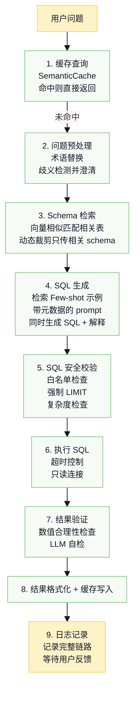

# 第三周-02: Text2SQL 工程化改进方案

> 基于当前项目 `tools/text2sql.py` 的分析

## 当前实现的问题诊断

```text
现有流程：question → _generate_sql → _execute_sql → _format_result
```

| 问题 | 现状 | 风险等级 |
| --- | --- | --- |
| Schema 全量传入 | 每次把完整 schema 塞进 prompt | 🟡 中 |
| 无元数据层 | 字段含义仅靠字段名猜测 | 🔴 高 |
| 无歧义消解 | “最近”、“大涨”等词无明确定义 | 🔴 高 |
| SQL 无安全校验 | 未限制 DELETE/DROP，无 LIMIT | 🔴 高 |
| 无结果验证 | SQL 语法对但语义错无法发现 | 🟡 中 |
| 无查询缓存 | 相同问题重复调用 LLM | 🟡 中 |
| 无反馈闭环 | badcase 无法收集和迭代 | 🟡 中 |

## 改进方案

## 一、Schema 理解增强

### 1.1 建立元数据字典 `metadata/table_metadata.py`

```python
TABLE_METADATA = {
    "stocks": {
        "description": "股票基本信息表，存储 A 股上市公司的静态信息",
        "columns": {
            "stock_code": {
                "type": "str",
                "description": "股票代码，6位数字字符串",
                "examples": ["601398", "000001", "300750"]
            },
            "market_cap": {
                "type": "float",
                "description": "总市值，单位：亿元人民币",
                "value_range": "通常 10-30000 亿"
            },
            "industry": {
                "type": "str",
                "description": "所属行业",
                "enum_values": ["银行", "白酒", "新能源", "医药", "证券", "房地产", "乳制品", "新能源汽车"]
            },
            "pe_ratio": {
                "type": "float",
                "description": "市盈率 = 股价/每股收益，衡量估值高低",
                "business_note": "PE < 10 通常认为低估，PE > 50 通常认为高估"
            }
        }
    },
    "financials": {
        "description": "财务数据表，存储季报/中报/年报的财务指标",
        "columns": {
            "roe": {
                "type": "float",
                "description": "净资产收益率 = 净利润/净资产，单位 %",
                "business_note": "ROE > 15% 通常认为优秀，巴菲特选股标准之一"
            },
            "report_date": {
                "type": "str",
                "description": "报告期末日期",
                "format": "YYYY-MM-DD",
                "examples": ["2024-12-31", "2024-06-30"]
            }
        }
    }
}
```

### 1.2 动态 Schema 裁剪

> 😎 如果现在有几十张表怎么办

```python
# 在 text2sql.py 中添加
from services.embedding import get_embedding_service

class Text2SQLTool:
    def __init__(self):
        self.embedding = get_embedding_service()
        self.table_embeddings = self._build_table_embeddings()

    def _get_relevant_schema(self, question: str, top_k: int = 2) -> str:
        """根据问题检索相关的表，而不是传入全部 schema"""
        question_embedding = self.embedding.embed(question)

        # 计算相似度，选择最相关的表
        relevant_tables = self._find_similar_tables(question_embedding, top_k)

        # 只返回相关表的 schema
        return self._format_schema(relevant_tables)
```

## 二、歧义消解机制

### 2.1 建立业务术语词典 `metadata/business_terms.py`

```python
BUSINESS_TERMS = {
    # 时间相关
    "最近": "最近 30 个自然日",
    "上个月": "上一个自然月（如当前12月，则指11月1日-11月30日）",
    "今年": "当前自然年1月1日至今",
    "近一年": "过去 365 个自然日",

    # 涨跌相关
    "大涨": "涨跌幅 > 5%",
    "大跌": "涨跌幅 < -5%",
    "涨停": "涨跌幅 = 10%（创业板/科创板为 20%）",
    "跌停": "涨跌幅 = -10%（创业板/科创板为 -20%）",

    # 估值相关
    "低估值": "PE < 15 或 PB < 1",
    "高估值": "PE > 50",
    "破净": "PB < 1（股价低于每股净资产）",

    # 规模相关
    "大盘股": "市值 > 1000 亿",
    "中盘股": "100 亿 < 市值 <= 1000 亿",
    "小盘股": "市值 <= 100 亿",

    # 财务相关
    "高ROE": "ROE > 15%",
    "高增长": "营收或净利润同比增长 > 20%",
    "高分红": "股息率 > 3%"
}

# 歧义词需要澄清
AMBIGUOUS_TERMS = {
    "最新": ["最新交易日", "最新报告期", "最新研报"],
    "涨幅": ["单日涨跌幅", "区间涨跌幅"],
    "业绩": ["营收", "净利润", "ROE"]
}
```

### 2.2 问题预处理与澄清

```python
def _preprocess_question(self, question: str) -> tuple[str, list]:
    """
    预处理问题：
    1. 替换已知术语
    2. 识别需要澄清的歧义
    """
    processed = question
    clarifications_needed = []

    # 替换已知术语
    for term, definition in BUSINESS_TERMS.items():
        if term in processed:
            processed = processed.replace(term, f"{term}({definition})")

    # 检测歧义
    for term, options in AMBIGUOUS_TERMS.items():
        if term in question:
            clarifications_needed.append({
                "term": term,
                "options": options,
                "question": f"您说的'{term}'是指哪个？"
            })

    return processed, clarifications_needed
```

## 三、SQL 安全防护

### 3.1 SQL 校验器 `utils/sql_validator.py`

```python
import sqlparse
from sqlparse.sql import Statement
from sqlparse.tokens import Keyword, DML

class SQLValidator:
    """SQL 安全校验器"""

    # 白名单关键字
    ALLOWED_KEYWORDS = {
        'SELECT', 'FROM', 'WHERE', 'JOIN', 'LEFT', 'RIGHT',
        'INNER', 'ON', 'AND', 'OR', 'ORDER', 'BY', 'GROUP',
        'HAVING', 'LIMIT', 'OFFSET', 'AS', 'DISTINCT', 'COUNT',
        'SUM', 'AVG', 'MAX', 'MIN', 'LIKE', 'IN', 'BETWEEN',
        'IS', 'NULL', 'NOT', 'ASC', 'DESC', 'CASE', 'WHEN',
        'THEN', 'ELSE', 'END', 'UNION', 'ALL'
    }

    # 黑名单关键字（危险操作）
    FORBIDDEN_KEYWORDS = {
        'DELETE', 'DROP', 'TRUNCATE', 'UPDATE', 'INSERT',
        'ALTER', 'CREATE', 'EXEC', 'EXECUTE', 'GRANT',
        'REVOKE', '--', '/*', 'SHUTDOWN'
    }

    # 最大返回行数
    MAX_LIMIT = 1000
    DEFAULT_LIMIT = 100

    @classmethod
    def validate(cls, sql: str) -> tuple[bool, str, str]:
        """
        校验 SQL 安全性
        Returns: (is_valid, error_message, sanitized_sql)
        """
        sql_upper = sql.upper()

        # 1. 检查危险关键字
        for forbidden in cls.FORBIDDEN_KEYWORDS:
            if forbidden in sql_upper:
                return False, f"禁止使用 {forbidden} 操作", sql

        # 2. 必须是 SELECT 语句
        parsed = sqlparse.parse(sql)
        if not parsed:
            return False, "无法解析 SQL 语句", sql

        stmt = parsed[0]
        if stmt.get_type() != 'SELECT':
            return False, "只允许 SELECT 查询", sql

        # 3. 强制添加 LIMIT（防止全表扫描）
        sanitized_sql = cls._ensure_limit(sql)

        # 4. 检查子查询嵌套深度（防止复杂查询拖垮数据库）
        if sql_upper.count('SELECT') > 3:
            return False, "子查询嵌套过深，请简化查询", sql

        return True, "", sanitized_sql

    @classmethod
    def _ensure_limit(cls, sql: str) -> str:
        """确保 SQL 有 LIMIT 限制"""
        sql_upper = sql.upper()

        if 'LIMIT' not in sql_upper:
            # 移除末尾分号，添加 LIMIT
            sql = sql.rstrip(';').strip()
            sql = f"{sql} LIMIT {cls.DEFAULT_LIMIT}"
        else:
            # 检查 LIMIT 值是否过大
            import re
            match = re.search(r'LIMIT\s+(\d+)', sql_upper)
            if match:
                limit_value = int(match.group(1))
                if limit_value > cls.MAX_LIMIT:
                    sql = re.sub(
                        r'LIMIT\s+\d+',
                        f'LIMIT {cls.MAX_LIMIT}',
                        sql,
                        flags=re.IGNORECASE
                    )

        return sql
```

### 3.2 修改执行逻辑

```python
def _execute_sql(self, sql: str) -> Dict[str, Any]:
    """执行 SQL（带安全校验）"""

    # 安全校验
    is_valid, error_msg, sanitized_sql = SQLValidator.validate(sql)
    if not is_valid:
        return {
            "success": False,
            "sql": sql,
            "error": f"SQL 安全校验失败：{error_msg}"
        }

    session = get_db_session()
    try:
        # 设置执行超时（防止慢查询）
        # SQLite: PRAGMA busy_timeout = 5000
        session.execute(text("PRAGMA busy_timeout = 5000"))

        result = session.execute(text(sanitized_sql))
        # ... 其余逻辑
    except Exception as e:
        # ... 异常处理
        pass
```

## 四、结果验证机制

### 4.1 SQL 自解释

````python
def _generate_sql_with_explanation(self, question: str) -> tuple[str, str]:
    """生成 SQL 同时输出执行逻辑解释"""

    prompt = f"""你是一个专业的SQL生成器。

数据库结构：
{self._get_relevant_schema(question)}

用户问题：{question}

请输出：
1. SQL语句
2. 执行逻辑解释（这个SQL会做什么，为什么这样写）

格式：
```sql
<SQL语句>
```

解释：
<逻辑解释>
"""
    response = self.llm.simple_chat(prompt)
    sql, explanation = self._parse_sql_and_explanation(response)
    return sql, explanation
````

### 4.2 结果合理性检查

```python
def _validate_result(self, question: str, sql: str, result: Dict) -> Dict:
    """验证结果合理性"""

    warnings = []

    # 1. 检查结果数量
    if result["row_count"] == 0:
        warnings.append("查询结果为空，可能是条件过严或数据不存在")
    elif result["row_count"] > 500:
        warnings.append(f"返回 {result['row_count']} 条数据，结果较多")

    # 2. 检查数值合理性（针对金融数据）
    if result["data"]:
        sample = result["data"][0]

        if "pe_ratio" in sample and sample.get("pe_ratio"):
            pe = sample["pe_ratio"]
            if pe < 0:
                warnings.append("存在负市盈率，可能是亏损股票")
            elif pe > 1000:
                warnings.append("市盈率异常高，请确认数据")

        if "roe" in sample and sample.get("roe"):
            roe = sample["roe"]
            if roe > 50:
                warnings.append("ROE 超过 50%，数据可能异常")

    # 3. 让 LLM 自检
    if len(warnings) == 0:
        self_check = self._llm_self_check(question, sql, result)
        if self_check:
            warnings.append(self_check)

    result["warnings"] = warnings
    return result
```

## 五、缓存与性能优化

### 5.1 语义缓存 `cache/query_cache.py`

```python
import hashlib
from datetime import datetime, timedelta
from services.embedding import get_embedding_service

class SemanticQueryCache:
    """基于语义相似度的查询缓存"""

    def __init__(self, similarity_threshold: float = 0.95):
        self.cache = {}  # {question_hash: {sql, result, timestamp, embedding}}
        self.embedding = get_embedding_service()
        self.threshold = similarity_threshold
        self.ttl = timedelta(hours=1)  # 缓存有效期

    def get(self, question: str) -> Optional[Dict]:
        """查找缓存（精确匹配 + 语义相似匹配）"""

        # 1. 精确匹配
        question_hash = hashlib.md5(question.encode()).hexdigest()
        if question_hash in self.cache:
            entry = self.cache[question_hash]
            if datetime.now() - entry["timestamp"] < self.ttl:
                return entry

        # 2. 语义相似匹配
        question_embedding = self.embedding.embed(question)

        for key, entry in self.cache.items():
            if datetime.now() - entry["timestamp"] > self.ttl:
                continue

            similarity = self._cosine_similarity(
                question_embedding,
                entry["embedding"]
            )
            if similarity > self.threshold:
                return entry

        return None

    def set(self, question: str, sql: str, result: Dict):
        """设置缓存"""
        question_hash = hashlib.md5(question.encode()).hexdigest()
        self.cache[question_hash] = {
            "sql": sql,
            "result": result,
            "timestamp": datetime.now(),
            "embedding": self.embedding.embed(question)
        }
```

## 六、反馈闭环与持续迭代

### 6.1 查询日志表

```python
# 在 database/models.py 中添加

class Text2SQLLog(Base):
    """Text2SQL 查询日志"""
    __tablename__ = "text2sql_logs"

    id = Column(Integer, primary_key=True)
    question = Column(Text, comment="原始问题")
    processed_question = Column(Text, comment="预处理后的问题")
    generated_sql = Column(Text, comment="生成的 SQL")
    execution_success = Column(Integer, comment="执行是否成功")
    result_count = Column(Integer, comment="返回行数")
    execution_time_ms = Column(Integer, comment="执行耗时(ms)")

    # 反馈
    user_feedback = Column(String(20), comment="用户反馈：good/bad/null")
    feedback_detail = Column(Text, comment="反馈详情")

    # 分析
    error_type = Column(String(50), comment="错误类型")
    corrected_sql = Column(Text, comment="人工修正的 SQL")

    created_at = Column(String(30))
```

### 6.2 日志收集

```python
def run(self, question: str, return_raw: bool = False) -> Dict[str, Any]:
    """执行 Text2SQL（带日志记录）"""
    import time
    start_time = time.time()

    log_entry = Text2SQLLog(
        question=question,
        created_at=datetime.now().isoformat()
    )

    try:
        # 预处理
        processed_question, clarifications = self._preprocess_question(question)
        log_entry.processed_question = processed_question

        # 生成 SQL
        sql, explanation = self._generate_sql_with_explanation(processed_question)
        log_entry.generated_sql = sql

        # 执行
        result = self._execute_sql(sql)
        log_entry.execution_success = 1 if result["success"] else 0
        log_entry.result_count = result.get("row_count", 0)

        # ... 其余逻辑

    except Exception as e:
        log_entry.execution_success = 0
        log_entry.error_type = type(e).__name__
        raise

    finally:
        log_entry.execution_time_ms = int((time.time() - start_time) * 1000)
        self._save_log(log_entry)
```

### 6.3 Badcase 分析脚本 `scripts/analyze_badcases.py`

```python
"""
定期分析 badcase，归类问题，生成改进建议
"""

def analyze_badcases():
    session = get_db_session()

    # 1. 获取失败的查询
    failed_queries = session.query(Text2SQLLog).filter(
        Text2SQLLog.execution_success == 0
    ).all()

    # 2. 获取用户标记为 bad 的查询
    bad_feedback = session.query(Text2SQLLog).filter(
        Text2SQLLog.user_feedback == "bad"
    ).all()

    # 3. 归类问题
    error_categories = {
        "schema_error": [],      # 表名/字段名错误
        "syntax_error": [],      # SQL 语法错误
        "semantic_error": [],    # 语义理解错误
        "ambiguity": [],         # 歧义未处理
        "complex_query": []      # 复杂查询失败
    }

    for log in failed_queries + bad_feedback:
        category = classify_error(log)
        error_categories[category].append(log)

    # 4. 生成报告
    report = generate_improvement_report(error_categories)
    print(report)

    # 5. 提取可用于 few-shot 的修正案例
    few_shot_candidates = [
        log for log in bad_feedback
        if log.corrected_sql is not None
    ]

    return error_categories, few_shot_candidates
```

## 七、Few-shot 示例库

### 7.1 示例管理 `metadata/few_shot_examples.py`

```python
FEW_SHOT_EXAMPLES = [
    {
        "question": "市值最大的5只银行股",
        "sql": """SELECT stock_code, stock_name, market_cap
FROM stocks
WHERE industry = '银行'
ORDER BY market_cap DESC
LIMIT 5""",
        "explanation": "筛选行业为银行，按市值降序，取前5"
    },
    {
        "question": "ROE大于15%的股票有哪些",
        "sql": """SELECT DISTINCT s.stock_code, s.stock_name, f.roe
FROM stocks s
JOIN financials f ON s.stock_code = f.stock_code
WHERE f.roe > 15
AND f.report_date = (
    SELECT MAX(report_date) FROM financials WHERE stock_code = s.stock_code
)
ORDER BY f.roe DESC""",
        "explanation": "关联财务表，筛选ROE>15%，取每只股票最新一期的数据"
    },
    {
        "question": "最近一周涨幅最大的10只股票",
        "sql": """SELECT s.stock_code, s.stock_name,
SUM(m.change_pct) as total_change
FROM stocks s
JOIN market_data m ON s.stock_code = m.stock_code
WHERE m.trade_date >= date('now', '-7 days')
GROUP BY s.stock_code
ORDER BY total_change DESC
LIMIT 10""",
        "explanation": "关联行情表，计算7天累计涨跌幅，取前10"
    }
]

def get_relevant_examples(question: str, top_k: int = 3) -> list:
    """基于语义相似度获取相关示例"""
    # 实现略
    pass
```

## 改进后的完整流程



## 实施优先级

| 优先级 | 改进项 | 工作量 | 收益 |
| --- | --- | --- | --- |
| P0 | SQL 安全校验 | 1天 | 防止数据安全事故 |
| P0 | 强制 LIMIT | 0.5天 | 防止拖垮数据库 |
| P1 | 业务术语词典 | 1天 | 提升准确率 |
| P1 | 元数据字典 | 2天 | 提升准确率 |
| P1 | 查询日志 | 1天 | 建立反馈闭环 |
| P2 | Few-shot 示例库 | 2天 | 提升复杂查询准确率 |
| P2 | 语义缓存 | 1天 | 降低成本和延迟 |
| P2 | 动态 Schema 裁剪 | 2天 | 降低 token 消耗 |
| P3 | 结果验证 | 2天 | 减少语义错误 |
| P3 | 歧义澄清交互 | 3天 | 提升用户体验 |

## 目录结构建议

```text
tools/
├── text2sql.py                 # 主入口（改造）
└── text2sql/
    ├── __init__.py
    ├── validator.py            # SQL 安全校验
    ├── cache.py                # 语义缓存
    ├── preprocessor.py         # 问题预处理
    └── result_checker.py       # 结果验证

metadata/
├── __init__.py
├── table_metadata.py           # 表元数据
├── business_terms.py           # 业务术语词典
└── few_shot_examples.py        # Few-shot 示例

scripts/
├── analyze_badcases.py         # Badcase 分析
└── update_few_shots.py         # 更新示例库
```

## 总结

核心原则：**管理预期 + 缩小问题空间**

1. 先做好 **安全防护**（SQL校验、LIMIT）——这是底线。
2. 建立 **元数据层**，让模型真正理解字段含义。
3. 建立 **反馈闭环**，持续收集 badcase 迭代优化。
4. 不要试图做万能系统，先把 **高频场景做到 90%+ 准确率**。

## 思考题：子查询嵌套过深和拖垮数据库的原因

### 1. 执行计划爆炸

```sql
-- 3层嵌套示例
SELECT * FROM stocks WHERE stock_code IN (
    SELECT stock_code FROM financials WHERE roe > (
        SELECT AVG(roe) FROM financials WHERE report_date IN (
            SELECT MAX(report_date) FROM financials GROUP BY stock_code
        )
    )
)
```

每层子查询可能被重复执行：

- 外层每处理 1 行，内层执行 1 次。
- 如果外层 1000 行，内层也 1000 行，可能产生 **100万次扫描**。

### 2. SQLite 特别脆弱

SQLite 是单线程、文件型数据库：

- 没有查询优化器的高级优化（如子查询展开）。
- 复杂查询直接全表扫描。
- 没有连接池，一个慢查询会卡死整个服务。

### 3. 真实案例

用户问：找出 ROE 高于行业平均的股票。

LLM 可能生成：

```sql
SELECT * FROM stocks s WHERE
    (SELECT roe FROM financials WHERE stock_code = s.stock_code ORDER BY report_date DESC LIMIT 1)
    >
    (SELECT AVG(f2.roe) FROM financials f2
     JOIN stocks s2 ON f2.stock_code = s2.stock_code
     WHERE s2.industry = s.industry)
```

这个查询对每只股票都要：

1. 查一次它的 ROE。
2. 算一次它所在行业的平均 ROE。

| 股票数量 | 子查询次数 | 结果 |
| --- | --- | --- |
| 15 只 | × 2 | 还行 |
| 1000 只 | × 2 | 卡死 |

### 4. 更好的做法

改用 JOIN + 窗口函数（一次扫描）：

```sql
WITH latest_roe AS (
    SELECT stock_code, roe,
           ROW_NUMBER() OVER (PARTITION BY stock_code ORDER BY report_date DESC) as rn
    FROM financials
),
industry_avg AS (
    SELECT s.industry, AVG(l.roe) as avg_roe
    FROM stocks s
    JOIN latest_roe l ON s.stock_code = l.stock_code
    WHERE l.rn = 1
    GROUP BY s.industry
)
SELECT s.*
FROM stocks s
JOIN latest_roe l ON s.stock_code = l.stock_code
JOIN industry_avg a ON s.industry = a.industry
WHERE l.rn = 1 AND l.roe > a.avg_roe
```

### 5. 结论

> ⚠️ LLM 很准生成这种优化写法，所以直接限制嵌套深度更安全。

主要调整：

1. **层级结构**：用 `#`、`##` 划分章节。
2. **代码块**：SQL 用 `sql` 包裹，带语法高亮。
3. **强调**：关键数字和结论用 `**粗体**`。
4. **表格**：对比数据用表格呈现更直观。
5. **引用**：用户问题和结论用 `>` 引用块突出。
