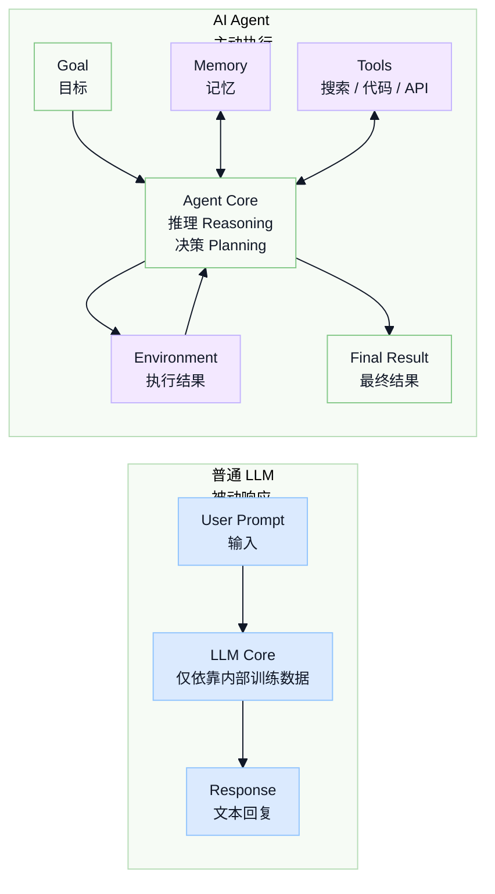
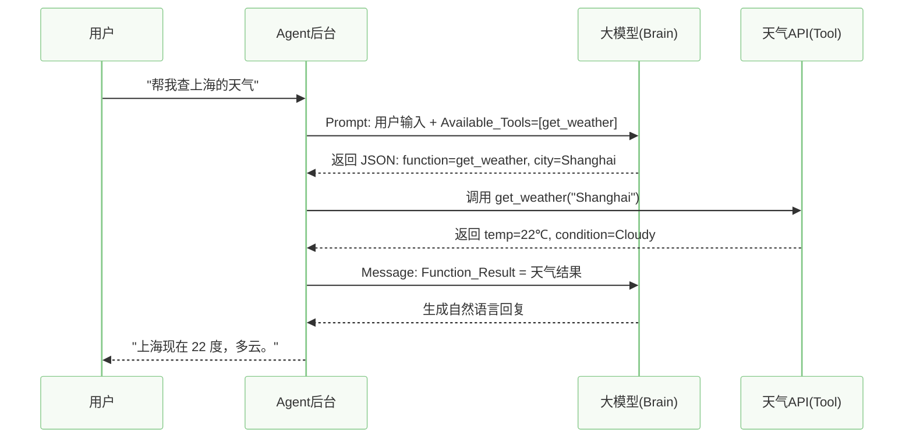
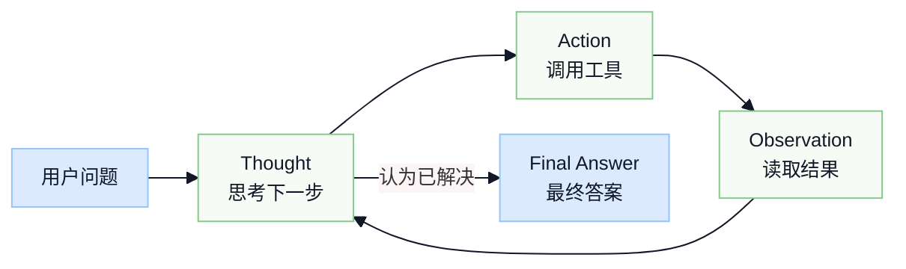
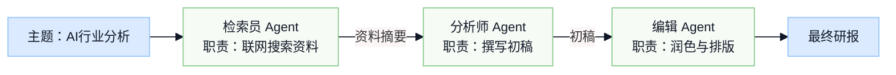
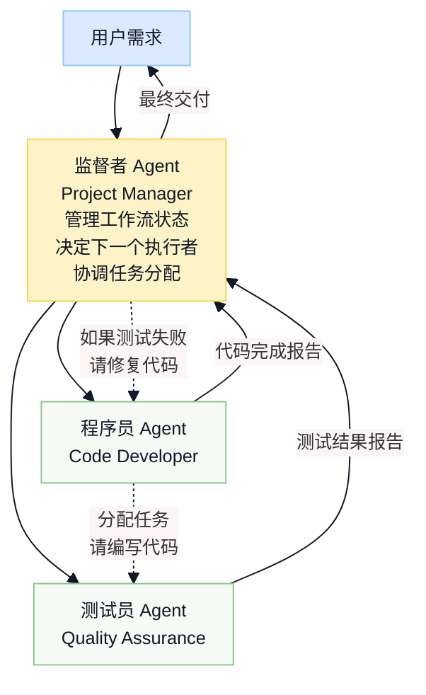

# 详解 Agent 核心架构开发模式与框架

## 第二周-02: 什么是Agent：从 “LLM” 到 “Agent” —— 深入解构大模型 Agent 核心架构

> 🧐 摘要：大语言模型（LLM）很强，但它本质上只是一个被动的文本生成器。如何让 LLM 具备“手脚”和“记忆”，去主动解决真实问题？本文将带你深入 Agent（智能体）的内部构造，拆解其大脑、感知、规划与行动四大模块，揭秘它是如何从聊天机器人进化为能干活的数字员工的。
>
> 在课程中，你会不止一次地听我说：**工作流是灵魂，组件化是核心**。
>
> 那么什么是工作流，什么是组件化？今天我们先从初步理解 Agent 开始，从 0 到 Agent 的工业化落地。

### 1. 引言：LLM 的边界与 Agent 的诞生

当我们在 2023 年第一次使用 ChatGPT 时，我们被它震惊。但很快，我们发现了它的局限性：

- 它没有“手”：你让它“帮我把这份文件发给老板”，它只能给你写个邮件草稿，却无法点击发送按钮。
- 它是“静止”的：它的知识截止于训练结束的那一天。你问它“今天天气如何”，它无法回答，因为它无法连接互联网。
- 它是“健忘”的：在长对话中，它经常忘记 10 分钟前你们约定的设定。

从本质上讲，原始的 LLM 是一个 **问答机器**（具体原理参考 14 周训练营第 2-3 周）。它拥有极致的推理能力，但被切断了与物理世界的联系，只能在封闭的参数空间里做文字接龙。

**Agent（智能体）的出现，就是为了打破这个边界。**

OpenAI 应用研究主管 Lilian Weng 在她那篇经典博客中提出了 Agent 的定义公式，这也成为了目前行业的共识：

> 🤔 **Agent = LLM（大脑） + Planning（规划） + Memory（记忆） + Tools（工具）**

如果把 LLM 比作一个刚毕业的“名校博士”，那么 Agent 就是给这个博士配上了 **互联网（感知）**、**办公软件（工具）**、**工作笔记（记忆）** 以及 **项目管理流程（规划）**，让他真正成为一名能解决问题的 **数字员工**。

### 2. Agent 核心架构拆解：解剖“数字员工”

为了理解 Agent 是如何工作的，我们需要“解剖”它的身体结构。以下是 Agent 的通用系统架构图：



#### 2.1 大脑（The Brain）：LLM 的角色转变

在 Agent 架构中，LLM 不再仅仅是“生成器”，而是 **控制器（Controller）**。

- 它不再直接回答问题，而是分析问题。
- 它负责判断：“为了回答这个问题，我需要查什么资料？调用什么工具？”
- 它负责整合：将工具返回的数据（可能是生硬的 JSON）转化为人类可读的语言。

#### 2.2 规划（Planning）：从直觉到逻辑

人类处理复杂任务时，例如“策划一次旅行”，不会想到哪做到哪，而是有步骤的。Agent 也是如此。

- **子目标分解（Subgoal Decomposition）**：将大目标拆解为小步骤。
  - 用户指令：“分析哪家科技巨头去年的 AI 投入最大。”
  - Agent 拆解：1. 搜索 Google 财报；2. 搜索 Microsoft 财报；3. 搜索 Meta 财报；4. 对比数字；5. 得出结论。
- **反思（Reflection）**：这是高级 Agent 的特征。执行完一步后，LLM 会自我提问：“我查到的数据是最新的吗？如果不是，我需要重查。”

#### 2.3 记忆（Memory）：突破 Context Window

- **短期记忆（Short-term Memory）**：利用 LLM 的上下文窗口（Context Window），记录当前的思考过程和工具返回结果。
- **长期记忆（Long-term Memory）**：这是 Agent 的“外挂硬盘”。通常使用 **向量数据库（Vector Database）** 配合 RAG（检索增强生成）技术。
  - 场景：当你问 Agent “像上次一样帮我订票”时，它需要去长期记忆里检索“上次”是什么时候，以及你的偏好是靠窗还是过道。

> 🤔 这里解释一下什么是 **Context Window**。

#### 深入解析：Messages List 与 Context Window

**核心概念：API 是“无状态”的（Stateless）**

图中的核心在于两个发光的虚线框（Active Input）。当你在这个网页上和我聊天时，你感觉我“记得”你说过的话。但实际上，**我什么都不记得**。之所以我能回答连贯，是因为你的程序在后台做了一个操作：**每次你发新问题时，它都会把之前的对话记录（Messages List）全部复制一遍，加上你的新问题，一起发给我。**

**代码层面的解释（Messages List）**

假设这是一个 Coding 助手的场景，你的 `messages` 列表就是要进 Context Window 的东西。

Round 1：刚开始，Context Window 极为空旷，只有两条数据：

```jsonc
[
  {"role": "system", "content": "你是一个 Python 专家。"},   // System 设定
  {"role": "user", "content": "帮我写个 Hello World。"}       // 新输入
]
```

Round 2：对话进行中。注意，Round 1 的问答必须包含在这次请求里，否则 LLM 根本不知道刚才发生了什么。

```jsonc
[
  {"role": "system", "content": "你是一个 Python 专家。"},
  {"role": "user", "content": "帮我写个 Hello World。"},      // 历史
  {"role": "assistant", "content": "print('Hello World')"},   // 历史
  {"role": "user", "content": "把它改成函数形式。"}             // 新输入
]
```

Round 100：对话很长，触发 Context Window 限制。

这就是图中绿色虚线框下面的虚线框（Overflow）发生的事情。Context Window 是有容量上限的，例如 8k tokens、128k tokens。当 `messages` 列表的总字数超过限制时，如果不处理，API 会报错。

通常做法是滑动窗口（Sliding Window）：

1. 保留 System Prompt（通常不删，因为这是人设）。
2. 删掉最旧的 User/Assistant 对话。
3. 加入最新的 User 问题。

```jsonc
[
  {"role": "system", "content": "你是一个 Python 专家。"}, // ✅ 保留
  // {"role": "user", "content": "帮我写个 Hello World。"}, ❌ 太久远，被挤出窗口了
  // {"role": "assistant", "content": "print..."},          ❌ 被挤出窗口了
  ...
  {"role": "user", "content": "...最近的上下文..."},        // ✅ 保留
  {"role": "user", "content": "好的，那现在怎么优化内存？"}  // ✅ 新输入
]
```

#### 2.4 工具使用（Tool Use）：连接世界的桥梁

这是 Agent 与 Chatbot 最大的区别。工具包括：

- **信息获取类**：Google Search、Wikipedia、股票接口。
- **计算处理类**：Python Code Interpreter（代码解释器，用于复杂计算或画图）。
- **行动操作类**：发送邮件、写入数据库、控制智能家居。

## 3. 核心技术揭秘：Function Calling（函数调用）

> 🤔 许多学员会问：“大模型只懂文字，它怎么去点击一个按钮或调用一个 API 呢？”
>
> 详细介绍在 14 周系统课第 43 天。

答案是：**Function Calling（函数调用）**。这是 OpenAI 在 2023 年中期引入的关键更新，也是 Agent 的技术基石。

### 3.1 运行流程

它不是让 LLM 直接运行代码，而是一个 **“结构化数据握手”** 的过程：

1. **定义工具**：开发者在 System Prompt 中告诉 LLM：“我有一个工具叫 `get_weather`，通过城市名可以查天气。”
2. **意图识别**：用户问“北京天气咋样？”LLM 分析后发现需要用工具，于是 **不返回对话**，而是返回一个特殊的 JSON 结构。
3. **执行工具**：Agent 的后台代码（Python/Java）捕获这个 JSON，执行真正的 API。
4. **回传结果**：后台将 API 返回的“25摄氏度”封装成文本，再次发给 LLM。
5. **最终生成**：LLM 看到结果后，生成最终回复：“北京今天 25 度，天气不错。”

### 3.2 交互序列图（Sequence Diagram）



## 4. 实战演示：一个 ReAct Agent 的思考过程

为了让大家更直观地理解，我们来看一个经典的 ReAct（Reasoning + Acting）模式的 Agent 是如何处理复杂问题的。

用户指令：

> “莱昂纳多·迪卡普里奥的女朋友现在的年龄，取 0.43 次方是多少？”

这是一个典型的 LLM 无法直接回答的问题：

1. 数据时效性：他的女朋友经常换。
2. 数学计算能力：LLM 不擅长浮点数幂运算。

Agent 的内部独白（Inner Monologue）：

```text
Thought 1（思考）: 我需要先找出小李子现在的女朋友是谁。我应该使用搜索工具。

Action 1（行动）: Search_Tool("Leonardo DiCaprio current girlfriend 2025")

Observation 1（观察）: 搜索返回结果：根据最新报道，莱昂纳多现在的女朋友是 Vittoria Ceretti。

Thought 2（思考）: 好的，我知道是谁了。现在我需要知道 Vittoria Ceretti 的年龄。

Action 2（行动）: Search_Tool("Vittoria Ceretti age")

Observation 2（观察）: 搜索返回结果：Vittoria Ceretti 出生于 1998 年，当前年龄是 27 岁。

Thought 3（思考）: 我拿到了年龄 27。用户让我计算 27 的 0.43 次方。口算太难了，我要用计算器。

Action 3（行动）: Calculator_Tool(27 ^ 0.43)

Observation 3（观察）: 计算器返回结果 4.116

Thought 4（思考）: 我已经有了最终答案。

Final Answer（最终响应）: 莱昂纳多·迪卡普里奥现任女友 Vittoria Ceretti 今年 27 岁，她的年龄的 0.43 次方约为 4.116。
```

## 5. 总结

通过上面的解构，我们可以清晰地看到：**Agent 本质上是一个以 LLM 为核心 CPU，通过 Prompt Engineering 编排逻辑，并拥有 I/O（工具与感知）能力的软件系统。**

它不仅提升了 LLM 的能力上限，更重要的是，它改变了人机交互的方式：

- **过去**：人适应机器（学习复杂的命令、SQL）。
- **现在**：机器适应人（你说自然语言，机器自己规划步骤去执行）。

在掌握了这些核心原理后，下一节中，我们将探讨当一个 Agent 搞不定时，如何让 **多个 Agent（Multi-Agent）像团队一样协作开发软件或处理复杂流程**。

---

## 第二周-03: 从单兵作战（单Agent）到 AI 军团（Multi-Agent）—— 详解主流 Agent 开发模式与框架

> 🤔 在第一篇文章中，我们搞懂了单个 Agent 的大脑和身体构造。这一篇我们将视角拉高，从“单兵作战”升级到“团队指挥”，深入讲解目前工业界最主流的 **ReAct 模式** 以及 **Multi-Agent（多智能体）架构**。

当任务复杂度指数级上升时，单个 Agent 往往会陷入幻觉或死循环。本文将带你掌握 Agent 开发的两大基石：**ReAct 模式**（让单体更理性）与 **Multi-Agent 系统**（让群体能协作），并横向对比 LangGraph、AutoGen 等主流开发框架，教你如何构建一支高效的 “AI 雇佣兵团”。

### 1. 引言：单Agent的困境

在上一节课中，我们构建了一个能联网、会算数的“全能 Agent”。但在实际工程落地中，我们发现“全能”往往意味着“平庸”甚至“失控”。

当你要求一个 Agent：“帮我写一个贪吃蛇游戏，先写需求文档，再写代码，最后写测试用例。”

- **Context 爆炸**：上下文太长，Agent 忘了最开始的需求。
- **注意力分散**：既要扮演产品经理，又要扮演程序员，容易出现逻辑混乱。
- **死循环**：一旦代码报错，Agent 可能会陷入不断重试错误的死胡同。

解决之道，借鉴了人类社会的组织形式：**专业分工与 SOP（标准作业程序）**。

### 2. 单体进阶：ReAct 模式（Reason + Act）

在讨论多智能体之前，我们必须先掌握 Agent 行为模式的鼻祖——**ReAct**。它是几乎所有现代 Agent 框架的默认底层逻辑。

#### 2.1 什么是 ReAct？

ReAct 是 **Reasoning（推理）** 和 **Acting（行动）** 的缩写。它的核心思想是：**不要让 LLM 直接生成结果，而是强制它通过“观察-思考-行动”的循环来解决问题。**

#### 2.2 ReAct 的生命周期

一个标准的 ReAct 循环包含三个关键步骤：

1. **Thought（思考）**：当前情况是什么？我下一步该干什么？
2. **Action（行动）**：调用具体的工具（如搜索、计算）。
3. **Observation（观察）**：看工具返回了什么结果。

重复上述步骤，直到 Thought 认为问题已解决。



#### 2.3 为什么 ReAct 如此重要？

它解决了 LLM 的 **幻觉问题**。通过强制“观察”事实（Observation），LLM 被迫基于真实数据（如搜索结果）进行推理，而不是基于训练数据里的模糊记忆瞎编。

### 3. 架构升级：Multi-Agent（多智能体系统）

当任务极其复杂时，我们需要引入 **Multi-Agent Systems（MAS）**。

#### 3.1 核心理念：Role-Playing（角色扮演）

MAS 的本质是“把一个大 Prompt 拆成几个小 Prompt”：

- **Agent A（产品经理）**：Prompt 侧重于用户需求分析，性格严谨。
- **Agent B（程序员）**：Prompt 侧重于 Python 代码生成，工具箱里有代码解释器。
- **Agent C（测试员）**：Prompt 侧重于找 Bug，性格挑剔。

优势：

- **专注**：每个 Agent 只看自己相关的上下文，减少干扰。
- **可控**：可以单独优化某个角色的 Prompt。
- **模块化**：像搭积木一样组装流程。

#### 3.2 两种经典的协作拓扑图

##### 3.2.1 顺序流（Sequential Flow）—— SOP 流水线

最简单的模式，适用于流程固定的任务，例如写研报。



##### 3.2.2 层级/监督模式（Hierarchical / Supervisor）—— 项目经理制

适用于复杂、非线性的任务，例如开发软件。引入一个 **Supervisor（大管家）**，它不干具体活，只负责任务分配和检查结果。



### 4. 实战工具箱：主流开发框架选型指南

> 🤔 在本课程中，我们会用 LangGraph 来搭建，但是用哪个真的无所谓，不要纠结，核心是 agentflow 搭建的思想。

#### 4.1 LangChain & LangGraph（行业标准）

- **定位**：控制力最强。
- **核心概念**：Graph（图）。
  - LangGraph 是目前的趋势。它将 Agent 的流程定义为一张图：Nodes 是 Agent，Edges 是跳转条件的逻辑。
  - 它允许你构建“有环”的流程，例如：测试不通过 -> 回退给程序员 -> 再测试。
- **适用场景**：生产环境、复杂的企业级应用、需要精确控制每一步流转的场景。

#### 4.2 AutoGen（微软出品）

- **定位**：对话即开发。
- **核心概念**：Conversation（对话）。
  - 在 AutoGen 中，你定义几个 Agent，然后让它们“互相聊天”。
  - `UserProxyAgent`（代表用户）和 `AssistantAgent`（AI）可以在对话中自动执行代码。
- **适用场景**：代码生成任务、数据分析、快速原型验证。它的“多 Agent 辩论”功能非常强大。

#### 4.3 Coze / Dify（低代码/无代码平台）

- **定位**：小白神器，可视化编排。
- **核心概念**：Workflow（工作流）。
  - 通过拖拉拽的方式，将 LLM、插件（工具）、判断逻辑连接起来。
- **适用场景**：非技术人员、产品经理快速验证想法、简单的客服 Bot。

### 5. 结语：从“玩具”到“工具”

通过这两节文档的学习，我们不仅理解了 Agent 是如何通过 Function Calling 连接世界的，也明白了如何通过 **Multi-Agent 架构** 来组织一支 AI 团队。

Agent 技术正在从前几年纯玩具，回归到 **“感知-规划-行动”** 的物理学原理和 **“分工-协作”** 的社会学原理，将是长期不变的核心。
