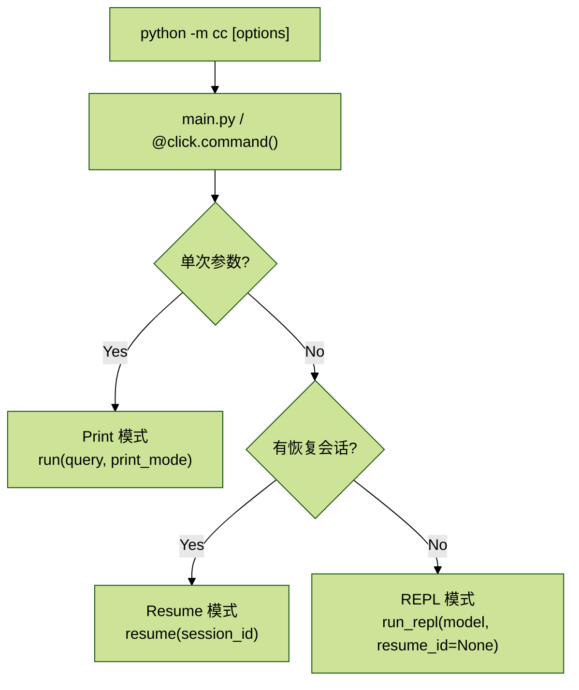

# CC_runtime_01.启动与使用

## 目录

- [1. 这是什么](#1-这是什么)
- [2. 还原了什么](#2-还原了什么)
- [3. 架构](#3-架构)
  - [3.1 核心数据流](#31-核心数据流)
  - [3.2 Agent Teams 数据流](#32-agent-teams-数据流)
- [4. 快速开始](#4-快速开始)
  - [4.1 三种启动模式](#41-三种启动模式)
  - [4.2 REPL 是什么](#42-repl-是什么)

## 1. 这是什么

用 Python 还原 CC 的核心 Agent Runtime。

CC 是 Anthropic 官方的 AI 编程 CLI，**它的本质是一个 tool-use agent loop：模型读代码、改文件、跑命令、自主决策，循环往复直到任务完成。**

这个项目从 TypeScript 源码（1884 个文件、38 万行）中，提取并翻译了核心运行时逻辑，用纯 Python 实现了一个功能对齐的 Agent CLI。

它不是封装 API 的 wrapper，而是完整还原了 agent 内核。

## 2. 还原了什么

| 能力 | 状态 | 说明 |
| --- | --- | --- |
| Agent Loop（状态机） | ✅ | 多轮 tool-use 循环，流式响应，错误恢复，自动重试 |
| 流式工具执行 | ✅ | 工具在 API 流式过程中立即开始执行，不等响应结束 |
| 22 个内置工具 | ✅ | Bash、Read、Edit、Write、Glob、Grep、Agent、WebFetch、WebSearch、NotebookEdit、ToolSearch、AskUser、Task 系列、TodoWrite、Skill、PlanMode、Brief、LSP、TeamCreate/Delete、SendMessage |
| 权限系统 | ✅ | PermissionMode（bypass/acceptEdits/default）+ 规则引擎 + 非交互白名单 |
| System Prompt 体系 | ✅ | 多段动态拼装，含 Memory 行为指导 + Coordinator/Teammate 提示词 |
| CLAUDE.md 加载 | ✅ | 目录层级遍历 + `@include` 递归展开 |
| 自动上下文压缩 | ✅ | Token 预算监控，超限自动 compact，长对话不崩 |
| Memory 系统 | ✅ | 四类记忆分类，MEMORY.md 索引自动更新，后台 coalescing 提取 |
| MCP 协议支持 | ✅ | stdio 传输，动态工具注册，多 server 并行 |
| 工具编排引擎 | ✅ | 并发/串行分批、流式执行器、hooks、权限门控 |
| Hooks 系统 | ✅ | PreToolUse/PostToolUse 挂载，shell 命令执行 |
| Skills 系统 | ✅ | frontmatter 定义、slash 命令触发、prompt 注入 |
| Session 持久化 | ✅ | 会话保存/恢复、Task 状态快照、transcript 校验修复 |
| QueryEngine | ✅ | 统一 runtime owner，封装 client/model/registry/prompt/permissions |
| Agent Teams / Swarm | ✅ | 多 Agent 协调：Teammate 执行引擎、Mailbox 通信、Coordinator 编排、Team 生命周期 |
| REPL + Print 模式 | ✅ | 交互式循环 + 单次查询模式 |

## 3. 架构

```text
cc/
├── core/              QueryEngine 统一入口、query_loop 状态机、事件流
├── api/               Anthropic API：流式调用、客户端管理、token 统计
├── models/            数据模型：消息类型、content blocks、API 规范化
├── prompts/           System Prompt：多段文本 + 动态拼装
├── coordinator/       Coordinator/Teammate 提示词
├── tools/             22 个工具实现 + StreamingToolExecutor + 权限门控
├── permissions/       权限系统：PermissionMode + 规则引擎 + 非交互语义
├── swarm/             Agent Teams：身份、Mailbox、TeamFile
├── compact/           上下文压缩：token 预算监控、摘要生成
├── memory/            记忆系统：加载/保存/提取/索引/ExtractionCoordinator
├── mcp/               MCP 协议：stdio、客户端、工具桥接
├── hooks/             Hooks：配置加载、PreToolUse/PostToolUse
├── skills/            Skills：定义加载、slash 命令注册
├── session/           会话管理：持久化、TaskRegistry、transcript recovery
├── commands/          Slash 命令：/clear /compact /model /help /cost
├── ui/                终端渲染：Rich 流式输出
├── main.py            入口：REPL 循环、模块组装、inbox polling
└── tests/             498 个测试用例
```

### 3.1 核心数据流

```text
代码块用户输入
  → main.py 追加到 messages（transcript）
  → [inbox polling] 如果在 team 中，检查 leader 收件箱，注入 <task-notification>
  → QueryEngine.run_turn() → query_loop 发送到 Claude API
  → 流式接收：TextDelta / ToolUseBlock / TurnComplete
  → StreamingToolExecutor：工具在流式过程中立即开始执行（并发安全/hooks/权限检查）
  → tool_result 塞回 transcript → 再调 API
  → 循环直到 end_turn
  → 渲染输出，保存 session + task snapshot
  → ExtractionCoordinator 后台提取记忆
  → 等待下一轮输入
```

一次用户输入可以**触发多轮模型调用和多次工具执行**，这就是 agent，不是 chatbot。

### 3.2 Agent Teams 数据流

```text
用户：“帮我重构这个模块”
  → Leader（REPL）调用 TeamCreate 创建团队，进入 team_context
  → Leader 调用 AgentTool(name="researcher", run_in_background=true)
    → spawn_teammate → InProcessTeammate 启动
    → Teammate 使用独立 query_loop（非交互权限、工具过滤）
    → 完成后通过 Mailbox 发送结果给 leader
  → Leader 下一轮 turn 前，inbox polling 检查收件箱
  → <task-notification> 注入 prompt → Leader 根据结果决策下一步
  → Leader 调用 TeamDelete 清理
```

## 4. 快速开始

### 4.1 三种启动模式

下面这张流程图表达的是：CLI 入口先进入 `main.py/main()` 与 `@click.command()`，然后根据“是否带参数”和“是否需要恢复会话”，分流到三种模式。



从图上看，核心意图是把运行形态拆成三类：

- `Print 模式`：一次性执行，适合单次查询或命令式调用。
- `REPL 模式`：进入持续会话，适合多轮交互。
- `Resume 模式`：基于已有 session 恢复上下文继续执行。

图中还强调了 API Key 加载优先级，以及通过公共初始化逻辑完成 client 创建后，再进入具体运行模式。

### 4.2 REPL 是什么

REPL 是 Read-Eval-Print Loop 的缩写，就是“读取-求值-打印-循环”。

它描述的是一种交互式运行环境的工作方式：

1. `Read（读取）`：等待你输入一行或一段内容
2. `Eval（求值）`：执行/处理你输入的内容
3. `Print（打印）`：把结果输出给你看
4. `Loop（循环）`：回到第一步，等待下一次输入

你最熟悉的 REPL 例子就是直接在终端输入 `python` 进入的 Python 交互式解释器，或者浏览器的开发者工具控制台。

在 CC 项目里，REPL 的含义稍微扩展了一下：它不只是执行代码，而是一个**持续的 agent 对话会话**。每一轮的流程是：

- 历史对话（`Message`）留在内存里
- agent 记得你们聊过什么，而不是每次都从零开始
- 这跟你单次调用脚本（方式 A）的区别就在这里

参考代码 README。
