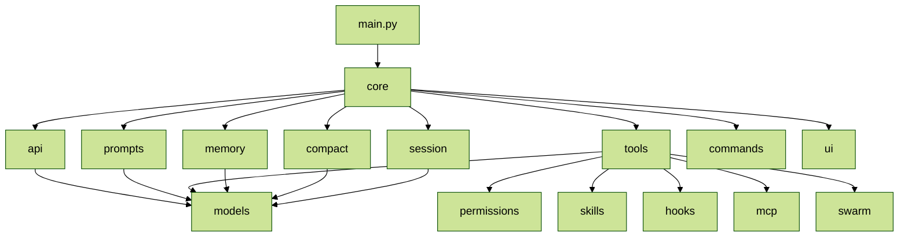

# CC_runtime_02.目录结构

## 目录

- [1. 顶层结构](#1-顶层结构)
- [2. `cc/` 下面每个文件夹做什么](#2-cc-下面每个文件夹做什么)
  - [2.1 `cc/api`](#21-ccapi)
  - [2.2 `cc/core`](#22-cccore)
  - [2.3 `cc/models`](#23-ccmodels)
  - [2.4 `cc/tools`](#24-cctools)
  - [2.5 `cc/prompts`](#25-ccprompts)
  - [2.6 `cc/memory`](#26-ccmemory)
  - [2.7 `cc/session`](#27-ccsession)
  - [2.8 `cc/compact`](#28-cccompact)
  - [2.9 `cc/commands`](#29-cccommands)
  - [2.10 `cc/skills`](#210-ccskills)
  - [2.11 `cc/hooks`](#211-cchooks)
  - [2.12 `cc/mcp`](#212-ccmcp)
  - [2.13 `cc/permissions`](#213-ccpermissions)
  - [2.14 `cc/swarm`](#214-ccswarm)
  - [2.15 `cc/ui`](#215-ccui)
  - [2.16 `cc/utils`](#216-ccutils)
- [3. 模块依赖总览](#3-模块依赖总览)
- [4. 初学者最值得先看的目录顺序](#4-初学者最值得先看的目录顺序)

## 1. 顶层结构

这一篇的目标是：你看到一个目录名，就知道它大概负责什么。

```text
cc/              核心源码
tests/           测试
README.md        项目说明
pyproject.toml   依赖、入口脚本、pytest/mypy/ruff 配置
```

## 2. `cc/` 下面每个文件夹做什么

### 2.1 `cc/api`

负责“怎么和模型 API 对话”。

核心文件：

| 文件 | 职责 |
| --- | --- |
| `cc/api/client.py` | 创建 Anthropic client |
| `cc/api/claude.py` | 把 Claude 的流式返回解析成内部事件 |
| `cc/api/token_estimation.py` | 粗略估 token，给 auto-compact 用 |

这里解决的是“怎么把模型返回变成程序能处理的事件流”。

### 2.2 `cc/core`

这里是 agent 最核心的运行时。

核心文件：

| 文件 | 职责 |
| --- | --- |
| `cc/core/query_loop.py` | 整个 agent 的核心状态机 |
| `cc/core/query_engine.py` | `QueryEngine` 类，封装一次对话的全部运行时依赖（`client`、`registry`、`messages`、`permissions`），提供 `run_turn()` / `submit()` 入口，内部调用 `query_loop()` |
| `cc/core/events.py` | 内部事件类型定义，比如 `TextDelta`、`ToolUseStart`、`TurnComplete` |

如果整个项目只能看一个目录，就先看这里。

### 2.3 `cc/models`

定义 agent 内部最重要的数据结构。

核心文件：

| 文件 | 职责 |
| --- | --- |
| `cc/models/messages.py` | `UserMessage`、`AssistantMessage`、`normalize_messages_for_api()` |
| `cc/models/content_blocks.py` | `text` / `tool_use` / `tool_result` 等 block |
| `cc/models/state.py` | 一些状态对象 |

这里解决的是“程序内部到底拿什么表示一段对话”。

### 2.4 `cc/tools`

工具系统。

核心文件：

| 文件 | 职责 |
| --- | --- |
| `cc/tools/base.py` | Tool 抽象、`ToolRegistry`、`ToolResult` |
| `cc/tools/orchestration.py` | 工具编排和执行 |
| `cc/tools/streaming_executor.py` | `StreamingToolExecutor`，流式期间边收流边启动工具执行，支持并发安全分级和 semaphore |

常见工具子目录：

```text
bash/          file_read/      file_edit/      file_write/
glob_tool/     grep_tool/      task_tools/     agent/
ask_user/      web_fetch/      brief/          lsp/
mcp_tool/      notebook/       plan_mode/      send_message/
skill/         team/           todo/           tool_search/
web_search/
```

以上只列出常见工具子目录，完整列表请查看 `cc/tools/` 目录。

模型只会“决定调用哪个工具”，真正执行工具的代码都在这里。

### 2.5 `cc/prompts`

system prompt 组装系统。

核心文件：

| 文件 | 职责 |
| --- | --- |
| `cc/prompts/builder.py` | 组装完整 system prompt |
| `cc/prompts/sections.py` | prompt 的固定段落 |
| `cc/prompts/claudemd.py` | 加载 `CLAUDE.md` |
| `cc/prompts/coordinator_prompt.py` | Coordinator 模式的 system prompt |
| `cc/prompts/teammate_prompt.py` | Teammate 模式的 system prompt |

这里决定模型“开始时被告知什么规则”。

### 2.6 `cc/memory`

记忆系统。

核心文件：

| 文件 | 职责 |
| --- | --- |
| `cc/memory/session_memory.py` | 读写 memory 文件 |
| `cc/memory/extractor.py` | 从对话里自动抽取值得保存的 memory |

这里解决的是“哪些信息应该跨会话长期保留”。

### 2.7 `cc/session`

会话持久化和历史记录。

核心文件：

| 文件 | 职责 |
| --- | --- |
| `cc/session/storage.py` | session transcript 的 save/load |
| `cc/session/history.py` | 记录用户输入历史 |
| `cc/session/recovery.py` | 会话恢复逻辑，处理异常退出后的断点续传 |
| `cc/session/task_registry.py` | 后台任务注册表，追踪 `AgentTool` 等产生的后台任务状态 |

这里解决的是“退出后还能不能继续之前的会话”。

### 2.8 `cc/compact`

上下文压缩系统。

核心文件：`cc/compact/compact.py`

当对话太长时，这里负责把旧消息压缩成摘要，避免超 context。

### 2.9 `cc/commands`

slash commands 注册与解析。

核心文件：`cc/commands/registry.py`

REPL 里的 `/help`、`/model`、`/compact` 都从这里来。

### 2.10 `cc/skills`

skills 的加载系统。

核心文件：`cc/skills/loader.py`

skill 本质上是“额外 prompt 片段”，启动时加载，运行时可注入。

### 2.11 `cc/hooks`

工具调用前后的 hook。

核心文件：`cc/hooks/hook_runner.py`

可以把它理解成“工具执行前后插一层自定义规则”。

> 😎 Hooks 生命周期钩子
>
> **核心概念**
>
> “钩子”（Hook）本质是一个预留的插槽。系统在执行某个固定流程时，会在特定时间点暂停，调用你注册进去的函数，然后继续。
>
> 你不需要修改主流程的代码，只需要“挂”一个函数上去，系统自动在对应时机调用它。
>
> **用一个具体比喻理解**
>
> 想象一条装配线：
>
> 生命周期钩子就是在工序之间预留的卡口。
>
> 你可以在 `before_A` 钩子里做检查，在 `after_A` 钩子里做记录，完全不用动工序 A 本身的代码。
>
> **“生命周期”是什么**
>
> “生命周期”指的是某个事物从诞生到消亡的完整过程。常见的划分方式：
>
> **在你之前那段代码的语境里**
>
> `query_loop` 就有类似的生命周期结构：
>
> 钩子让你在不侵入核心流程的前提下，插入自己的逻辑。
>
> **一句话总结**
>
> 生命周期钩子 = 系统在固定时间点主动回调你的函数，让你有机会在流程的关键节点插入自定义逻辑。

### 2.12 `cc/mcp`

MCP（Model Context Protocol）客户端，负责连接外部 MCP 服务器并将其工具注册到 `ToolRegistry`。

核心文件：

| 文件 | 职责 |
| --- | --- |
| `cc/mcp/client.py` | MCP 客户端连接管理 |
| `cc/mcp/config.py` | MCP 服务端配置解析 |

这里解决的是“怎么接入外部 MCP 服务器提供的工具”。

### 2.13 `cc/permissions`

权限门控系统，决定工具执行前是否需要用户确认。

核心文件：

| 文件 | 职责 |
| --- | --- |
| `cc/permissions/gate.py` | `PermissionContext` / `PermissionMode`，在工具执行前做门控判断 |
| `cc/permissions/rules.py` | 权限规则定义 |

这里解决的是“哪些工具可以直接执行，哪些需要先问用户”。

### 2.14 `cc/swarm`

团队/Swarm 协作系统，支持多 agent 协作场景。

核心文件：

| 文件 | 职责 |
| --- | --- |
| `cc/swarm/coordinator.py` | 协调者模式，注入 coordinator prompt |
| `cc/swarm/spawn.py` | spawn 子 agent |
| `cc/swarm/mailbox.py` | agent 间的消息邮箱 |
| `cc/swarm/team_context.py` | 团队上下文，追踪当前是否在团队会话中 |
| `cc/swarm/team_file.py` | 团队文件读写 |
| `cc/swarm/identity.py` | agent 身份标识 |
| `cc/swarm/in_process_runner.py` | 进程内 agent 运行器 |

这里解决的是“多个 agent 怎么在同一个项目上分工协作”。

### 2.15 `cc/ui`

终端渲染层。

核心文件：`cc/ui/renderer.py`

这里不决定 agent 逻辑，只决定输出怎么显示给用户。

### 2.16 `cc/utils`

杂项工具和错误类型。

## 3. 模块依赖总览

从截图里的总览图可以抽象成下面这个更适合阅读的结构：



如果你把这张图当成一个“从入口到运行时，再到外围子系统”的分层图，可以这样理解：

- `main.py` 告诉你入口
- `core` 告诉你主循环
- `models` 告诉你状态怎么表示
- `tools` 告诉你 agent 为什么能行动
- `memory` 告诉你历史对话如何处理
- 后面的目录大多是“主循环外挂的子系统”

> 😎 工作流是灵魂，组件化是核心，记忆层做驱动

## 4. 初学者最值得先看的目录顺序

建议顺序：

1. `cc/main.py`
2. `cc/core`
3. `cc/models`
4. `cc/tools`
5. `cc/prompts`
6. `cc/memory`
7. `cc/session`
8. `tests`

原因是：

- `main.py` 告诉你入口
- `core` 告诉你主循环
- `models` 告诉你状态怎么表示
- `tools` 告诉你 agent 为什么能行动
- `prompts` 告诉你模型最开始被告知什么规则
- `memory` 告诉你历史对话如何处理
- `session` 告诉你会话如何保存与恢复
- `tests` 告诉你系统是怎么被验证的
