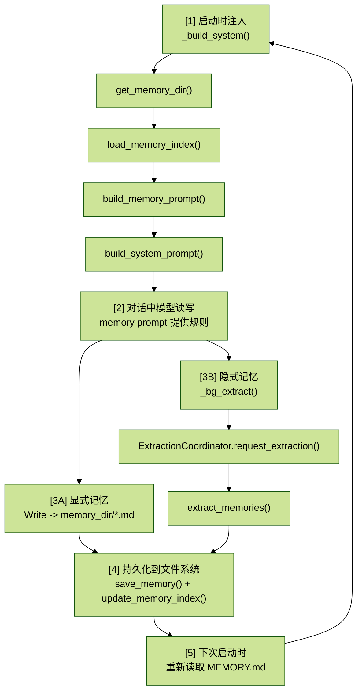

# CC_runtime_06.Memory系统完整指南

## 目录

- [1. Memory 解决什么问题](#1-memory-解决什么问题)
- [2. 存储架构](#2-存储架构)
- [3. 四种记忆类型](#3-四种记忆类型)
- [4. Memory 什么时候被注入：system_prompt 的第 10 段](#4-memory-什么时候被注入system_prompt-的第-10-段)
- [5. Memory 的两条写入路径](#5-memory-的两条写入路径)
- [6. ExtractionCoordinator：自动提取的并发控制](#6-extractioncoordinator自动提取的并发控制)
- [7. `extract_memories`：提取的具体过程](#7-extract_memories提取的具体过程)
- [8. Memory 与 Compact 的关系](#8-memory-与-compact-的关系)
- [9. Memory 的信任与验证](#9-memory-的信任与验证)
- [10. Memory 的完整生命周期](#10-memory-的完整生命周期)
- [11. `MEMORY.md` 的加载机制](#11-memorymd-的加载机制)

## 1. Memory 解决什么问题

对话结束后，所有上下文都会消失，除非有 Memory。Memory 是 Claude Code 的长期记忆系统，让模型能记住用户的**身份、偏好、项目状态、行为纠正**。

本篇从头到尾讲清楚它是怎么实现的。核心就是下面三点：

- 记忆哪些内容
- 什么时候触发记忆写入
- 什么时候触发记忆获取并作用于当前对话

`query_loop` 的每一轮对话都在 `messages[]` 列表中进行。用户输入变成 `UserMessage`，模型回复变成 `AssistantMessage`，工具调用穿插其中。当 REPL 退出时，这些消息会被写入 JSONL 文件（通过 `save_session()`），下次可以用 `--resume` 恢复。

但 `system_prompt` 不会自动记住“上次说过的偏好”。每次启动时 `_build_system()` 都是重新构建的一轮 prompt，读到的是静态的段落文本、当前环境信息、`CLAUDE.md` 内容。

如果用户上次说了“不要求 mock 数据库”、“我是数据科学家”、“周四代码冻结”，这些信息不在 `CLAUDE.md` 中，也不在 `system prompt` 的静态段落中。

Memory 就是为了解决这个问题：它是一条跨会话的长期状态通道。

它和 Session 的分工完全不同：

- `Session`（`cc/session/storage.py`）保存的是完整对话历史，一条条消息原封不动
- `Memory` 保存的是从对话中提取出的精华，一直值得在未来不同任务中复用的信息

它回答的问题是：“哪些信息值得带到下一次对话。”

> Session 是日志，Memory 是笔记。

## 2. 存储架构

### 2.1 目录结构

Memory 的物理存储位于：

```text
~/.claude/projects/{SHA256(cwd)[:12]}/memory/
```

每个工作目录（`cwd`）对应一个独立的 memory 目录。项目隔离通过 `cwd` 路径的哈希值实现，定义在 [`cc/memory/session_memory.py`](../cc/memory/session_memory.py) 的 `_project_id()` 函数中：

```python
def _project_id(cwd: str) -> str:
    return hashlib.sha256(cwd.encode("utf-8")).hexdigest()[:12]
```

为什么用 `hashlib.sha256` 而不是 Python 内置的 `hash()`？因为 Python 3.3 之后 `hash()` 默认启用了随机化（`PYTHONHASHSEED`），同一路径在不同进程里会得到不同的哈希值。  
如果用 `hash()` 作为目录名，重启进程后就再也找不到之前保存的记忆了。SHA-256 是确定性的，同一路径永远映射到同一目录。取前 12 个十六进制字符（48 bit）足以避免碰撞，同时保持目录名简短可读。

### 2.2 两种文件

memory 目录下有两种文件：

#### `MEMORY.md`（索引文件）

每行一条 Markdown 链接，指向具体的记忆文件。格式类似：

```text
- [safe_name](safe_name.md) -- description
```

这个文件在每次构建 system_prompt 时被完整加载，让模型知道有哪些记忆可记忆。索引限制 200 行（`MAX_ENTRYPOINT_LINES = 200`），定义在 [`sections.py`](../cc/prompts/sections.py)。

#### `*.md`（内容文件）

每个记忆条目一个文件，包含 YAML frontmatter（`name` / `description` / `type`）和正文。

```text
---
name: {{memory name}}
description: {{one-line description}}
type: {{user, feedback, project, reference}}
---

{{memory content}}
```

文件名安全化通过 [`session_memory.py`](../cc/memory/session_memory.py) 实现：非字母数字字符（除了 `-` 和 `_`）一律替换为下划线，防止路径注入和文件系统兼容性问题。

## 3. 四种记忆类型

Memory 系统定义了四种记忆类型：

```text
MEMORY_TYPES = ["user", "feedback", "project", "reference"]
```

每种有明确的保存条件和使用场景：

### `user`

用户身份、角色、偏好、专业水平。  
例如“用户是数据科学家，当前关注可观测性 / 日志”。  
目的是让模型在未来对话中调整自己的回答风格。

### `feedback`

用户对模型行为的纠正和确认。  
例如“不要 mock 数据库”、“上季度 mock 测试通过但生产迁移失败”。  
这类记忆会告诉模型“为什么要这样做”和 “How to apply（何时适用）”。  
值得注意的是，feedback 不只来自纠正，也来自确认：如果用户对一个非显而易见的方案表示认可，也值得记下来。

### `project`

项目上下文、决策、截止日期。  
例如“周四代码冻结，移动端要切 release 分支”。  
保存时必须把相对日期转成绝对日期，否则记忆过几周后就无法判断时间点。

### `reference`

外部资源的指针。  
例如“pipeline bug 在 Linear 的 INGEST 项目里跟踪”、“oncall 延迟看板在 grafana.internal/d/api-latency”。  
这类记忆本身不包含信息，只告诉模型去哪里找信息。

四种类型的完整定义（包括何时保存、如何使用、具体示例）在 [`sections.py`](../cc/prompts/sections.py) 的 `TYPES_SECTION_INDIVIDUAL` 常量中。

## 4. Memory 什么时候被注入：system_prompt 的第 10 段

Memory 通过 `system_prompt` 进入模型的上下文。具体发生在 `_build_system()` 函数中，这个函数在 REPL 启动时被调用。

`_build_system()` 做了三件事：

### 第一步，获取 memory 目录路径并确保目录存在

```python
mem_dir = get_memory_dir(cwd)
mem_dir.mkdir(parents=True, exist_ok=True)
```

这里的 `mkdir` 是有意为之的。`get_memory_dir()` 本身不创建目录，因为读操作不应该有写副作用。  
但在 `_build_system()` 中提前创建目录，是为了让模型在后续对话中可以直接用 Write 工具往这个目录写 memory 文件，不需要先在一次工具调用里 `mkdir`。

### 第二步，读取 `MEMORY.md` 索引内容

```python
memory_index = load_memory_index(cwd)
```

`load_memory_index()` 读取 `MEMORY.md` 文件内容。如果文件不存在或为空，返回 `None`。

### 第三步，调用 `build_system_prompt()` 拼装完整 prompt

```python
parts = build_system_prompt(
    cwd=cwd, model=model, claude_md_content=claude_md,
    memory_dir=str(mem_dir), memory_index_content=memory_index,
)
return "\n\n".join(parts)
```

在 `build_system_prompt()` 中，memory 段落的注入是条件性的：仅在 `memory_dir` 不为空时调用 `build_memory_prompt()`。  
它排在第 10 段（紧接在环境信息和 `SUMMARIZE_TOOL_RESULTS` 之后，`CLAUDE.md` 之前）。

### `build_memory_prompt()` 拼接了什么

`build_memory_prompt()` 是 memory 系统在 prompt 侧的核心函数。它拼接了以下子段落，形成一段完整的“记忆子系统操作手册”：

1. 目录位置和写入提示：告知模型 `memory_dir` 的绝对路径，并明确说明目录已存在，直接用 Write 工具写入
2. 四种记忆类型的详细定义：包括 `when_to_save` / `how_to_use` / examples
3. 不应保存的内容：代码模式、git 历史、调试方案、`CLAUDE.md` 已有内容、临时任务状态等
4. 两步写存法：写 `.md` 内容文件 + 更新 `MEMORY.md` 索引
5. 何时访问记忆：当用户说 recall / remember 时必须访问；当用户说 ignore memory 时当作空
6. 信任但验证：使用记忆中提到的文件路径、函数名之前先验证它们是否仍然存在
7. 与 Plan / Task 的分工：区分 memory（跨会话）、plan（当前实施方案）、tasks（当前工作步骤）
8. `MEMORY.md` 当前内容：如果有索引内容就嵌入（超过 200 行截断并警告），没有则显示“索引为空”的提示

一个关键设计边界是：这段 prompt 是启动时构建一次的。**当前会话中自动提取的新记忆不会刷新当前的 system_prompt**，要等到下次启动（或手动切换模型触发 `_build_system()` 重建）才会出现。

## 5. Memory 的两条写入路径

### 路径 A：模型主动写入（显式记忆）

当用户说“记住这个”或模型在对话中判断某些信息值得保存时，模型会按照 memory prompt 中的指令操作：

1. 用 Write 工具将记忆写入 `memory_dir/topic_name.md`，包含 YAML frontmatter 和正文
2. 用 Write 工具更新 `MEMORY.md`，添加一行指向新文件的索引条目

这条路径完全由 prompt 驱动，代码层面不做任何特殊处理。模型就像一个普通用户在操作文件系统。  
它的优势是即时性：写完文件后模型可以立即 Read 确认内容，在当前对话中就能引用。

### 路径 B：后台自动提取（隐式记忆）

REPL 每轮结束后，`main.py` 会在后台启动一个异步任务来自动提取记忆：

```python
_extraction_call = engine.make_call_model(max_tokens=1024)

async def _bg_extract(msgs, wd, call):
    try:
        saved = await extraction_coord.request_extraction(msgs, wd, call)
        if saved:
            console.print(f"[dim]Saved {len(saved)} memory(s): {' ,'.join(saved)}[/]")
    except Exception as e:
        logger.debug("Memory extraction skipped: %s", e)

task = asyncio.create_task(_bg_extract())
_bg_tasks.add(task)
task.add_done_callback(_bg_tasks.discard)
```

几个设计要点值得注意：

- 不阻塞 REPL：`asyncio.create_task()` 是 fire-and-forget 的，用户立即可以输入下一轮
- 低配 `call_model`：提取用的 `max_tokens=1024`，因为提取结果只是简短的 JSON，不需要长输出
- 引用防 GC：`_bg_tasks` 集合持有 Task 对象的引用，防止被垃圾回收器提前清理
- 提取结果不刷新当前 prompt：自动提取出的记忆写入了文件系统，但当前会话的 system_prompt 不会更新

## 6. ExtractionCoordinator：自动提取的并发控制

问题很直观：用户在 REPL 中快速连续输入多轮对话，每轮结束都会触发一次 `_bg_extract()`。如果前一次提取还在调 API，又来了一个新的提取请求，就可能出现并发写 `MEMORY.md` 导致的数据损坏。

`ExtractionCoordinator` 用 Coalescing（合并）策略解决这个问题。

### 三个状态变量

```python
self._running = False
self._dirty = False
self._last_extracted_count = 0
```

- `self._running`：当前是否有提取任务在运行
- `self._dirty`：提取运行期间是否有新增消息到达
- `self._last_extracted_count`：水位线，上次提取时的可见消息总数

### 工作流程

当 `request_extraction()` 被调用时：

1. 如果 `_running` 为 `True`（已在提取运行），只设置 `_dirty = True` 然后立即返回空列表，不启动新提取
2. 获取互斥锁，设置 `_running = True`，进入 `while True` 循环：
   - 清除 `_dirty` 标记
   - 计算当前可见消息总数（`_count_visible`）与水位线的差值 `increment`
   - 如果 `increment >= MIN_NEW_MESSAGES`（阈值为 4），调用 `extract_memories()` 执行实际提取
   - 更新水位线为当前可见消息总数
   - 检查 `_dirty` 标记：如果为 `False`，说明提取期间没有新轮次到来，安全退出循环；如果为 `True`，说明期间有新消息，继续下一轮循环
3. 退出循环后设置 `_running = False`

`MIN_NEW_MESSAGES = 4` 是一个经验阈值，低于 4 条新增总说明对话不够充分，提取意义不大，也避免了频繁触发 API 调用。

为什么是 Coalescing 而不是 Debounce？  
Debounce 会丢中间请求，只处理最后一个。这意味着如果前一次提取快结束时又来了一轮新对话，这轮对话可能永远不会被扫描到。  
Coalescing 保证的是最终状态一定被处理：只要 `dirty` 被设过，提取完成后一定会重新跑一轮，扫描所有新增消息。

## 7. `extract_memories`：提取的具体过程

`extract_memories()` 是自动提取的核心函数。它独立于主对话循环，发起一次单独的 API 调用。

### 第一步：准备上下文

```python
existing = load_memories(cwd, claude_dir=claude_dir)
```

加载当前项目已有的所有记忆，每条取前 100 字符作为摘要。这些摘要传给提取模型用于去重，避免重复保存已有记忆。

### 第二步：格式化近期对话

```python
recent = list(visible[-new_message_count:])
conversation_text = format_messages_for_extraction(recent)
```

`format_messages_for_extraction()` 将消息转换为纯文本格式 `"User: ...\n\nAssistant: ..."`。工具调用的详细内容会被折叠为 `[tool results]`，因为提取关注的是对话语义（用户表达了什么偏好、做了什么决策），不是工具输出的具体内容。

### 第三步：调用提取模型

```python
async for event in call_model(
    messages=api_messages, system=EXTRACTION_SYSTEM_PROMPT, tools=None,
):
```

`EXTRACTION_SYSTEM_PROMPT` 是一段专门的提取指令，定义了：

- 提取什么：用户角色、行为纠正、项目上下文、外部资源指针
- 不提取什么：代码模式、git 历史、调试方案、API 密钥、临时任务状态
- 输出格式：严格的 JSON，包含 `name` / `type` / `content` 字段，content 内容含 frontmatter

注意 `tools=None`：提取模型不需要任何工具，它只负责分析对话并输出 JSON。这和主循环中的模型调用（有完整的工具集可用）完全不同。

### 第四步：解析并持久化

```python
for mem in memories:
    name = mem.get("name", "")
    content = mem.get("content", "")
    if name and content:
        save_memory(cwd, name, content, claude_dir=claude_dir)
        description = _extract_description(content) or f"{mem.get('type', 'auto')} memory"
        update_memory_index(cwd, name, description, claude_dir=claude_dir)
```

每条提取出的记忆经历两步操作：

1. `save_memory()` 将内容写入 `<safe_name>.md` 文件
2. `update_memory_index()` 在 `MEMORY.md` 中添加或更新对应的索引条目

`_extract_description()` 从记忆文件的 YAML frontmatter 中解析出 `description` 字段。如果 frontmatter 格式不合规或缺少 description，回退到 `"{type} memory"` 作为默认描述。

### `update_memory_index()` 的去重机制

`update_memory_index()` 采用 append-or-update 策略：

- 如果 `MEMORY.md` 中已有同名条目（通过检查 `[safe_name]` 子串），原地更新该行
- 如果没有同名条目，追加到文件末尾

这意味着重复保存同一记忆不会产生重复的索引行，描述变化时索引也会同步更新。

## 8. Memory 与 Compact 的关系

Compact（上下文压缩）和 Memory 是两个独立但互补的机制。理解它们的关系，才能理解 Memory 为什么是必要的。

Compact 的工作方式是：把较早的对话历史压缩为一段摘要文本，用 `CompactBoundaryMessage` 替换原始消息。这样做释放了 token 预算，让长对话能继续进行。  
但压缩是有损的：工具执行的细节、代码片段的具体内容、中间决策的推理过程，都可能在压缩中被丢弃。

这就是 `SUMMARIZE_TOOL_RESULTS` 存在的原因：它提醒模型在处理工具结果时，把关键信息写进回复文本中，因为原始工具结果可能会在后续压缩中被清除。

但 `SUMMARIZE_TOOL_RESULTS` 只能保护当前会话中的信息。Memory 的价值在于更长的时间尺度上，对比两者的产出：

- Compact 的产出（`CompactBoundaryMessage` 中的 summary）：短期保活。几轮后可能再被压缩，信息进一步丢失。 当会话结束，摘要随 transcript 归档。
- Memory 的产出（`.md` 文件）：永久保存。写入文件系统后不会被任何自动机制删除或压缩。下次启动时通过 `load_memory_index()` 重新加载，注入新会话的 system_prompt。

所以 Memory 的设计理念是：

> 压缩可以丢弃实现细节（“怎么修的这个 bug”），但 Memory 保留关键决策（“用户偏好方案 A 而不是方案 B”、“这个 bug 的根因是竞态条件”）。前者可以从代码和 git 历史中恢复，后者无法从任何地方自动推导。

## 9. Memory 的信任与验证

记忆可能过时。一个月前保存的“数据库连接池在 `config/db_pool.py` 中配置”可能已经不成立：文件可能被重命名、删除或重构了。

system_prompt 中的 `TRUSTING_RECALL_SECTION` 教模型采用悲观信任策略：

> “A memory that names a specific function, file, or flag is a claim that it existed when the memory was written. It may have been renamed, removed, or never merged.”

具体的验证规则是：

- 如果记忆提到文件路径，先用 Read 或 Glob 检查文件是否存在
- 如果记忆提到函数名或 flag，先用 Grep 确认
- 如果用户要根据这个信息采取行动（而不是只查询历史），必须先验证

这条设计非常关键：

> 记忆说“曾经存在”不等于“现在存在”。

也就是说，Memory 是线索，不是事实。使用之前一定要根据文件或代码的当前状态验证。如果记忆中的信息和当前观察到的事实冲突，以当前事实为准，并更新或删除过时的记忆。

这避免了一个常见的 agent 失败模式：模型过度信赖自己的记忆，在过时信息的基础上给出错误建议。

## 10. Memory 的完整生命周期

把所有环节串起来，Memory 的完整闭环如下：



```text
[1] 启动时注入
    _build_system()
    -> get_memory_dir()
    -> load_memory_index()
    -> build_memory_prompt()
    -> build_system_prompt()

[2] 对话中模型读写
    memory prompt 提供完整操作指令

[3A] 模型主动写入
    Write -> memory_dir/*.md
    Write -> MEMORY.md

[3B] 后台自动提取
    _bg_extract()
    -> ExtractionCoordinator.request_extraction()
    -> extract_memories()

[4] 持久化到文件系统
    save_memory()
    update_memory_index()

[5] 下次启动时
    读取 MEMORY.md
    再回到 [1]
```

路径 A 和路径 B 最终都落到 `memory_dir` 下的 `.md` 文件，并更新 `MEMORY.md` 索引。

这里有一个重要的设计边界：当前会话中自动提取的记忆（路径 B）**不会刷新当前的 system_prompt**。`system_prompt` 在 `_build_system()` 中构建一次后就固定了。  
也就是说，路径 B 产生的记忆要到下次启动 REPL 时才会出现在模型的上下文中。

路径 A 有一个有趣的变通：虽然模型主动写入的记忆也不会自动更新 system_prompt，但模型可以立即 Read 自己刚写的文件内容，在当前对话中继续引用这些信息。只是这些引用依赖的是 `messages` 历史中的工具结果，而非 system_prompt 中的 memory 段落。

这不是一个 bug，而是一个有意的设计选择。Memory 系统的定位是跨会话的长期状态通道，不是当前会话的实时状态同步机制。  
当前会话内的信息流通过 messages 历史本身就能覆盖一层，模型可以回顾自己的先前回复和工具结果。Memory 的价值体现在“下次对话”，而不是“当前对话”。

## 11. `MEMORY.md` 的加载机制

`MEMORY.md` 的全部内容在启动时一次性加载到 `system_prompt` 里，之后整个会话期间不再更新。

### `MEMORY.md` 长什么样

假设你在 `/Users/dev/myproject` 目录下用了几天 Claude Code，`MEMORY.md` 会长这样：

```text
- [user_role](user_role.md) - 后端工程师，10年Go经验，第一次接触React前端
- [feedback_no_mock](feedback_no_mock.md) - 集成测试不要mock数据库，上季度mock测试通过但生产迁移失败
- [feedback_terse](feedback_terse.md) - 用户要求简洁回复，不要在末尾总结
- [project_freeze](project_freeze.md) - 2026-03-05开始代码冻结，移动端要切release分支
- [project_auth](project_auth.md) - auth中间件重写是合规驱动的，不是技术债，scope决定先合规
- [reference_linear](reference_linear.md) - pipeline bug追踪在Linear的INGEST项目
- [reference_grafana](reference_grafana.md) - grafana.internal/d/api-latency是oncall延迟看板
```

其中一个具体的记忆文件 `feedback_no_mock.md` 可能长这样：

```md
---
name: feedback_no_mock
description: 集成测试不要mock数据库，上季度mock测试通过但生产迁移失败
type: feedback
---

集成测试必须连真实数据库，不要用mock。

**Why:** 上季度mock测试全部通过，但生产环境迁移失败了，mock和真实DB的行为差异没被检测到。

**How to apply:**
写测试时如果涉及数据库操作，用testcontainers或本地PostgreSQL，不要用unittest.mock.patch。
```

### 加载过程

启动时 `main.py::_build_system()` 会执行一次：

1. 找到 memory 目录
2. 读 `MEMORY.md` 索引
3. 把索引内容塞进 `system_prompt`

注意：只加载 `MEMORY.md` 索引，不加载具体 `.md` 文件内容。  
模型如果需要看某条记忆的详细内容（比如 `feedback_no_mock.md` 里的 Why 和 How to apply），它会自己用 Read 工具去读那个文件。

这是一种“索引全量 + 内容按需”的模式：

| 层级 | 内容 | 加载方式 |
| --- | --- | --- |
| 索引 | `MEMORY.md` | 启动时全部加载，限 200 行 |
| 内容 | `*.md` 文件 | 模型用 Read 工具按需读取，不预加载 |

所以它不是“渐进式加载”的 system prompt，而是：

- 启动时：`MEMORY.md`（索引）一次性全部塞进 `system_prompt`
- 对话中：模型看到索引 -> 知道有哪些记忆 -> 需要时 Read 具体文件
- 本轮结束后：后台提取新记忆 -> 写新文件 + 更新 `MEMORY.md`
- 但当前 `system_prompt` 不会刷新 -> 新记忆要等下次启动才能被“看见”
