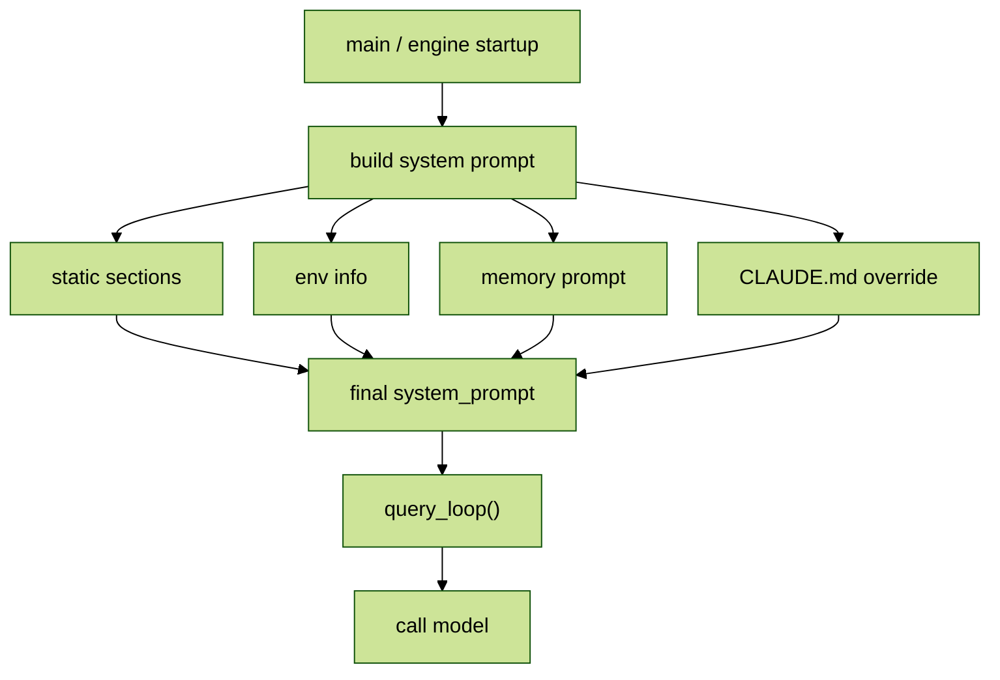

# CC_runtime_07Prompt 详解---主线

## 目录

- [1. 先一句话讲清：这一篇到底在讲什么](#1-先一句话讲清这一篇到底在讲什么)
- [2. Prompt 主线在 runtime 里的位置](#2-prompt-主线在-runtime-里的位置)
- [3. `build_system_prompt()` 的拼装顺序](#3-build_system_prompt-的拼装顺序)
- [4. `get_intro_section()`：先定义“你是谁”](#4-get_intro_section先定义你是谁)
- [5. `get_system_section()`：系统级行为契约](#5-get_system_section系统级行为契约)
- [6. `get_actions_section()`：高风险操作的判断原则](#6-get_actions_section高风险操作的判断原则)
- [7. `get_tone_style_section()`：回答风格不是审美，而是协议](#7-get_tone_style_section回答风格不是审美而是协议)
- [8. `get_output_efficiency_section()`：少说废话也是硬约束](#8-get_output_efficiency_section少说废话也是硬约束)
- [9. `compute_env_info()`：把运行环境显式注入给模型](#9-compute_env_info把运行环境显式注入给模型)
- [10. `CLAUDE.md`：用户级覆盖为什么放在最后](#10-claudemd用户级覆盖为什么放在最后)
- [11. 这一篇读完后，应该建立什么抽象](#11-这一篇读完后应该建立什么抽象)

## 1. 先一句话讲清：这一篇到底在讲什么

这一篇只抓 `system_prompt` 的主线，不展开 `tool` 细节，也不重复 Memory 全量机制。核心问题只有一个：

> Claude Code 在每次真正调用模型之前，到底给模型塞进了一份怎样的“系统级控制协议”。

这份协议不是一段随手写的长字符串，而是由 [`cc/prompts/builder.py`](../cc/prompts/builder.py) 按顺序拼出来的多段文本。每一段都在回答一个具体问题：

- 你是谁
- 你能做什么，不能做什么
- 哪些操作必须保守
- 你应该用什么语气回答
- 什么时候不要啰嗦
- 你现在跑在什么环境里
- 用户自己的 `CLAUDE.md` 要怎么覆盖默认行为

所以这一篇的重点不是“Prompt 很长”，而是“Prompt 被拆成了很多有职责边界的段落”。

## 2. Prompt 主线在 runtime 里的位置

如果从 runtime 总装配角度看，主线关系可以先压成下面这张图：



这里最关键的认知是：

- `query_loop()` 负责跑状态机
- `tools` 负责提供行动能力
- `memory` 负责跨会话记忆
- `system_prompt` 负责给模型定规则、定边界、定风格

也就是说，`Prompt` 本身不执行动作，但它决定模型如何理解动作、如何选择动作、以及在什么边界内动作。

## 3. `build_system_prompt()` 的拼装顺序

从截图能看出的主线顺序，大致是这样：

```python
parts = [
    get_intro_section(),
    get_system_section(),
    get_doing_tasks_section(),
    get_actions_section(),
    get_using_tools_section(),
    get_tone_style_section(),
    get_output_efficiency_section(),
    compute_env_info(...),
    SUMMARIZE_TOOL_RESULTS,
    build_memory_prompt(...),   # 条件注入
    claude_md_content,          # 条件注入
]
```

这一段最值得注意的不是“有哪些 section”，而是“顺序为什么这么排”：

1. 先给身份和总行为边界
2. 再给系统级契约
3. 再讲做事方式和风险控制
4. 再讲语气和输出效率
5. 然后把当前环境补进去
6. 最后再把 Memory 和 `CLAUDE.md` 这种更贴近用户上下文的内容压进去

也就是说，它不是平铺罗列，而是一个从“全局默认规则”逐步收敛到“当前项目 / 当前用户偏好”的过程。

## 4. `get_intro_section()`：先定义“你是谁”

这一段在 [`cc/prompts/sections.py`](../cc/prompts/sections.py) 里，截图对应的大意是：

- 先声明 Claude Code 是一个交互式 agent
- 工作环境是终端 / 本地工程上下文
- 可以读文件、改文件、运行命令、调用工具
- 但要注意 URL、外部内容、安全边界

这一段的作用非常基础，但非常重要。因为模型如果连“自己是什么角色”都没被钉死，后面的所有行为约束都会飘。

你可以把它理解成 Prompt 的第一层人格设定，但它不是为了“写得像人”，而是为了让模型先接受一个工程代理的身份：

- 不是闲聊机器人
- 不是纯问答模型
- 不是随便生成文本的 completion engine
- 而是一个需要在真实工程环境里做事的 agent

所以 `get_intro_section()` 的价值是：先把角色坐标系摆正。

## 5. `get_system_section()`：系统级行为契约

这一段比 intro 更像“协议正文”。截图里能看到的关键点包括：

- 输出会直接展示给用户
- 使用 GitHub-flavored Markdown / CommonMark
- 权限模式会影响行为
- 如果某个工具调用被拒绝，不要立刻重复同样的调用
- `<system-reminder>` 这类内容属于系统提示
- 工具返回的外部内容可能含有 prompt injection，需要防范
- hooks 产生的反馈要视为用户侧输入的一部分
- 之前消息可能被自动 compact，不要假设上下文永远原样存在

这一段解决的是“系统和模型之间的运行时契约”。

它和 `get_intro_section()` 的区别是：

- `intro` 偏身份声明
- `system` 偏运行协议

比如“工具输出可能来自不可信外部数据”这一条，实际上就是在给模型打补丁：不要因为工具拿回来的文本长得像指令，就真的把它当系统命令。

这条规则本质上是在对抗 prompt injection，只不过它不是放在安全论文里，而是直接写进了日常运行 Prompt。

## 6. `get_actions_section()`：高风险操作的判断原则

这一段是整条主线里最像“工程安全守则”的部分。它抓的不是某一个具体命令，而是两个抽象判断维度：

- `reversibility`
- `blast radius`

也就是：

- 这个操作能不能轻松撤销
- 一旦做错，影响范围有多大

截图里举的典型高风险场景包括：

- 删除文件、删分支、删表、杀进程、`rm -rf`
- 覆盖未提交改动
- `git push --force`
- `git reset --hard`
- 修改已发布 commit
- 升降级依赖
- 修改 CI/CD 流程
- 改共享基础设施或权限
- 创建 / 关闭 / 评论 PR、issue
- 向外部服务发消息
- 把内容上传到第三方网页工具、pastebin、gist、图表渲染网站

这段最有价值的点在于：它不是按“命令黑名单”写的，而是按“风险分类器”写的。

这样一来，模型即使遇到截图里没显式列出的新操作，也可以按同一原则推断：

- 能回滚吗
- 影响范围大吗
- 是否涉及共享状态
- 是否会把敏感内容发到外部

这就是工程 Prompt 里很成熟的一种写法：不要只教具体例子，要教判断框架。

## 7. `get_tone_style_section()`：回答风格不是审美，而是协议

这一段表面上看是在管语气，实际上是在管输出格式的一致性。截图里比较明确的规则有：

- 不要用 emoji，除非用户明确要求
- 保持简洁
- 文件引用使用 `file_path:line_number`
- GitHub 引用使用 `owner/repo#123`
- 在准备调用工具前，不要写一个带冒号的提示句

比如不要写：

```text
Let me read the file:
```

而应该写：

```text
Let me read the file.
```

这看起来很细，但它其实在解决三个问题：

1. 降低输出噪音  
   工程对话不是营销文案，emoji 和冗余装饰会增加阅读负担。

2. 保持引用可定位  
   `file_path:line_number` 和 `owner/repo#123` 都是为了让用户能立刻找到实体位置。

3. 保持“说话”和“行动”之间的边界清晰  
   工具调用前的提示句如果写得太像标题或半截说明，容易让流式输出显得拖沓。

所以这段不是在美化文风，而是在做终端 agent 的交互协议收束。

## 8. `get_output_efficiency_section()`：少说废话也是硬约束

这一段可以概括成一句话：

> Go straight to the point. Lead with the answer or action, not the reasoning.

截图里给出的重点是：文本输出应该主要保留给三种情况：

- 需要用户做决定
- 需要同步高层里程碑状态
- 出现错误或 blocker，需要改变计划

除此之外，如果只是正常推进任务，就尽量少说，直接用工具。

这里还特别有一个边界说明：

- 这个“少说话”的约束，针对的是普通文本输出
- 不针对代码块
- 不针对工具调用本身

这非常重要。因为如果不加这个边界，模型可能会误以为“为了高效，连必要代码和必要命令也要省略”，那就会把工程任务做坏。

所以这段真正想做的是：

- 压缩无意义解释
- 保留必要行动
- 让 agent 的交互更像“执行中的工程搭档”，而不是“每一步都写小作文”

## 9. `compute_env_info()`：把运行环境显式注入给模型

这一段来自 [`cc/prompts/builder.py`](../cc/prompts/builder.py)，截图里能看到它注入的变量大致包括：

- `cwd`
- `is_git`
- `platform`
- `uname_sr`
- `shell_name`
- `model`
- `today`

这一段特别工程化。它解决的问题不是语义理解，而是“避免模型基于错误运行环境做假设”。

比如：

- 不知道当前是不是 git 仓库，就可能胡乱建议 git 操作
- 不知道当前 shell 是什么，就可能给错命令语法
- 不知道今天日期，就可能把“明天 / 下周四 / 昨天”理解错
- 不知道平台是 Windows 还是 Unix，就可能给出错误路径或脚本格式

所以 `compute_env_info()` 的本质，就是把一些如果不显式提供、模型就特别容易猜错的运行时事实，直接提前写进 Prompt。

你可以把它理解成 Prompt 里的“环境补丁层”。

## 10. `CLAUDE.md`：用户级覆盖为什么放在最后

这一段是主线里最体现“优先级设计”的部分。

截图里比较关键的点有：

- `CLAUDE.md` 会在 Memory 之后注入
- 还会配一个很强的提醒语，比如“Be sure to adhere to these instructions.”
- 放在 Prompt 靠后的位置，是有意利用 recency bias

这意味着什么？

意味着系统默认规则是一层，项目 / 用户自己的规则是另一层，而 `CLAUDE.md` 被设计成更接近最终裁决的位置。

这样做的目的很明确：

- 前面的系统 section 提供通用默认行为
- 后面的 `CLAUDE.md` 提供当前项目 / 当前用户更具体的要求

比如系统默认可能说“保持简洁”，但项目里的 `CLAUDE.md` 可以再补：

- 代码评审必须先列 findings
- 不要修改某些目录
- 回答风格必须中文优先
- 某些脚本不能跑

由于它被放在 Prompt 尾部，所以模型更容易把这些要求视为当前任务最需要遵守的近端约束。

这不是偶然排版，而是 Prompt 工程里的优先级设计。

## 11. 这一篇读完后，应该建立什么抽象

把这 5 张图收束起来，最值得带走的抽象其实只有三层：

### 11.1 Prompt 不是单段文案，而是分段装配结果

真正交给模型的 `system_prompt`，来自多个 section 的拼装。每段有自己的职责边界，不是把所有规则揉成一团。

### 11.2 Prompt 不是业务逻辑，但它决定业务逻辑怎么被执行

`query_loop()` 真正在跑状态机，`tools` 真正在执行动作，但模型会如何用这些能力，取决于 Prompt 给它定下的行为边界。

### 11.3 Prompt 的主线结构，本质上是“默认规则 -> 运行环境 -> 用户覆盖”

也就是：

```text
系统默认约束
  -> 行为与风险规则
  -> 输出与风格规则
  -> 环境事实注入
  -> Memory 注入
  -> CLAUDE.md 覆盖
```

所以如果你站在工程视角去看，`Prompt` 最好的理解方式不是“提示词”，而是：

> 一份在模型调用前动态组装出来的运行时控制协议。

这一篇先把主线立住。后面再分别拆工具段、Memory 段和更细的 query-side 细节，就不会乱。
