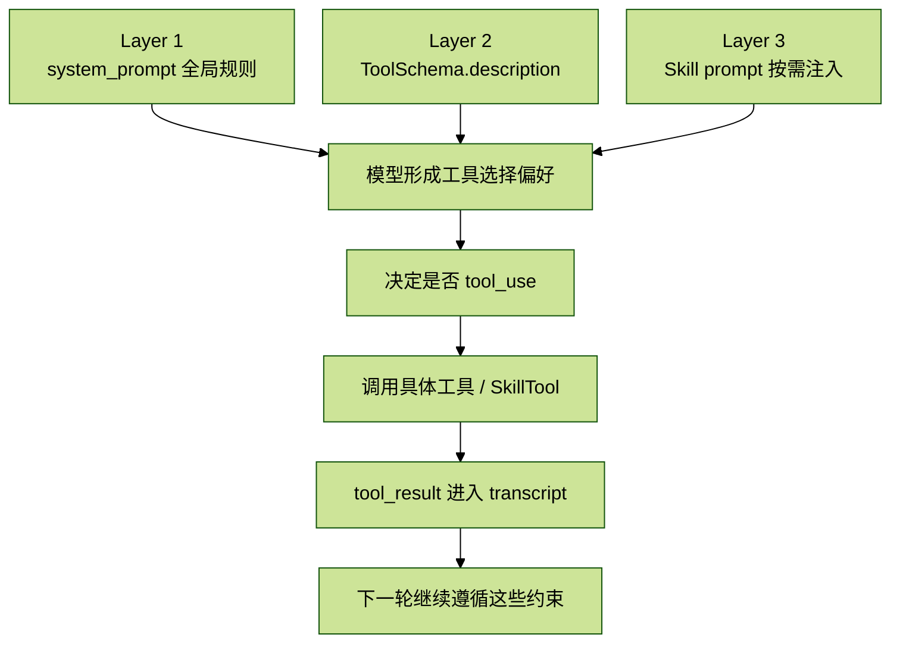

# CC_runtime_09.Prompt 详解---工具

## 目录

- [1. `get_using_tools_section()` — 工具选择的全局指令](#1-get_using_tools_section--工具选择的全局指令)
- [1.1 逐句分析](#11-逐句分析)
- [2. Schema description 即 Prompt — 举例分析](#2-schema-description-即-prompt--举例分析)
- [2.1 description 的传递路径](#21-description-的传递路径)
- [2.2 典型 description 对比分析](#22-典型-description-对比分析)
- [2.3 设计规律](#23-设计规律)
- [3. Skill 的 Prompt 注入机制](#3-skill-的-prompt-注入机制)
- [3.1 Skill 不是工具，是 Prompt 注入](#31-skill-不是工具是-prompt-注入)
- [3.2 两条触发路径](#32-两条触发路径)
- [3.3 SkillTool 的 description](#33-skilltool-的-description)
- [3.4 与 `system_prompt` 注入的区别](#34-与-system_prompt-注入的区别)
- [3.5 Skill 的加载与定义](#35-skill-的加载与定义)
- [4. 三层架构的协作](#4-三层架构的协作)

如果面试官问：

> 如何提升工具调用的准确度？

很多人第一反应会说：把“怎么用工具”写进 `system_prompt`。

但这只答对了三分之一。

实际上，影响模型如何选择和使用工具的 Prompt 分散在三个层次：

1. `system_prompt` 中的全局指令
2. 每个工具自己的 `ToolSchema.description`
3. `Skill` 的 Prompt 注入

这篇就按这三层，逐段拆开。

先把整体结构压成一张图：



## 1. `get_using_tools_section()` — 工具选择的全局指令

位置：

- [`cc/prompts/sections.py`](../cc/prompts/sections.py): `109-123`

注入位置：

- [`cc/prompts/builder.py`](../cc/prompts/builder.py): `112`

这个函数返回一整段完整 Prompt，被拼进 `system_prompt` 的第五段。它是模型在整场对话过程中始终可见的“工具使用总纲”。

截图里这段英文原文的核心意思是：

```text
# Using your tools
- Do NOT use the Bash to run commands when a relevant dedicated tool is provided.
- This is CRITICAL to assisting the user:
  - To read files use Read instead of cat, head, tail, or sed
  - To edit files use Edit instead of sed or awk
  - To create files use Write instead of cat with heredoc or echo redirection
  - To search for files use Glob instead of find or ls
  - To search the content of files, use Grep instead of grep or rg
- Reserve using the Bash exclusively for system commands and terminal operations that require shell execution.
- If you are unsure and there is a relevant dedicated tool, default to using the dedicated tool.
- You can call multiple tools in a single response.
- Make all independent tool calls in parallel.
- If some tool calls depend on previous calls, do NOT call these tools in parallel.
```

这段话的设计，不是在教模型几个零散技巧，而是在建立一个稳定的工具选择偏好。

## 1.1 逐句分析

### 1.1.1 “Do NOT use the Bash ...”

这句是整段的核心断言：

> 当存在相关的专用工具时，不要用 Bash 来执行这些命令。

模型天然倾向于把 Bash 当作万能解，因为：

- `cat file.py`
- `grep -r "pattern" .`
- `echo "content" > file.py`

这些都能通过 shell 完成。

但这里明确告诉模型：能做，不等于应该做。

紧接着下一句给出了原因：

> Using dedicated tools allows the user to better understand and review your work.

这不是技术原因，而是 UX 原因。`Read`、`Edit`、`Grep` 这些专用工具的参数和返回值是结构化的，用户可以直接看出模型：

- 读取了哪个文件
- 搜索了什么模式
- 替换了哪段文字

而 Bash 调用只有一个 `command` 字符串，用户需要自己反向理解 shell 在做什么。

### 1.1.2 “This is CRITICAL to assisting the user”

这里特意用了 `CRITICAL`，不是 `recommended`，也不是 `preferred`。

这说明设计者不是在提供软建议，而是在给模型一个强优先级约束：

- 临界场景下
- 在 `Read` 和 `Bash` 都能完成任务时
- 默认必须站到专用工具这一边

### 1.1.3 五组替代对

这整段 Prompt 最有价值的设计之一，就是它没有停留在“请使用合适的工具”这种抽象表述，而是直接列了五组替代映射：

```text
Read   > cat, head, tail, sed
Edit   > sed, awk
Write  > cat with heredoc, echo redirection
Glob   > find, ls
Grep   > grep, rg
```

这样写的好处是：直接消除歧义。

例如“请使用合适的工具”是一句模糊指令，模型可能会觉得 `cat` 也是“合适的”，因为它确实能读文件；但“To read files use Read instead of cat, head, tail, or sed”就把这个口子封死了。

截图里还特别分析了一个细节：

- `sed` 同时出现在 `Read` 组和 `Edit` 组

这不是冲突，而是设计者在认真拆 Bash 里的真实使用场景：

- `sed -n '10,20p' file` 是“查看文件片段”
- `sed -i 's/old/new/' file` 是“替换文件内容”

因此与其笼统说“不要用 Bash”，不如按 shell 的真实用法拆得更细。

### 1.1.4 Bash 不是被禁止，而是被限制使用范围

另一句关键原文是：

> Reserve using the Bash exclusively for system commands and terminal operations that require shell execution.

这句话划定了 Bash 的正当使用范围。

像下面这些命令，确实只能走 shell：

- `git commit`
- `npm install`
- `python -m pytest`
- `docker build`

它们没有对应的专用文件工具替代，所以仍然应该使用 Bash。

也就是说，Bash 不是禁用，而是被限制到“没有替代方案”的场景里。

### 1.1.5 默认行为：不确定时优先专用工具

还有一句很重要：

> If you are unsure and there is a relevant dedicated tool, default to using the dedicated tool.

这是一种“安全默认值”设计：

- 有专用工具就先用专用工具
- 只有绝对必要时才回退到 Bash

### 1.1.6 并行工具调用规则

这段 Prompt 后半部分还解决了另一个准确率问题：并行调用。

核心规则有两条：

1. 独立调用尽量并行
2. 依赖前序结果的调用必须串行

例如：

- 同时读取 3 个互不依赖的文件，可以并行发起 3 个 `Read`
- 先 `Grep` 找定义位置，再 `Read` 打开那个文件，这两步必须串行

如果只写“maximize parallel”，模型可能会在有依赖关系时也尝试并行；如果只写“不要并行”，模型又会退化成保守串行。两条规则同时存在，模型才会在效率和正确性之间找到平衡。

## 2. Schema description 即 Prompt — 举例分析

第一层 `system_prompt` 只解决“优先使用专用工具”的全局倾向，但模型在真正决定“该调用哪一个工具”时，依赖的是另一层：

- 每个工具自己的 `ToolSchema.description`

## 2.1 description 的传递路径

每个工具类的 `get_schema()` 方法返回一个 `ToolSchema` 对象，其中包含三个字段：

- `name`
- `description`
- `input_schema`

位置：

- [`cc/tools/base.py`](../cc/tools/base.py): `22-32`

在 `query_loop` 的每一轮里，`ToolRegistry.get_api_schemas()` 会遍历所有已注册工具，把它们的 schema 转成 dict 列表，作为 API 请求里的 `tools` 参数发给模型。

所以：

> `description` 不是给人看的文档，而是给模型看的内联 Prompt。

它不在 `system_prompt` 里，但它和 `system_prompt` 一起被发送给模型，直接影响模型如何理解某个工具的能力边界。

## 2.2 典型 description 对比分析

下面几个工具的 `description` 很值得反复看。它们都很短，但每一句都在卡功能边界。

### 2.2.1 BashTool

位置：

- [`cc/tools/bash/bash_tool.py`](../cc/tools/bash/bash_tool.py): `53-55`

英文原文：

```python
description="Executes a given bash command and returns its output."
```

中文直译：

```python
description="执行给定的 bash 命令并返回其输出。"
```

这句极简。因为 Bash 本身是万能工具，模型对 shell 的先验理解已经足够，`description` 只需要说明交互契约：

- 你给它一个命令
- 它执行
- 把输出还给你

### 2.2.2 FileReadTool

位置：

- [`cc/tools/file_read/file_read_tool.py`](../cc/tools/file_read/file_read_tool.py): `43-45`

英文原文：

```python
description="Reads a file from the local filesystem."
```

这里最关键的限制词是：

- `from the local filesystem`

它告诉模型：

- 这个工具只能读本地文件
- 不能读远程 URL

如果要拿网页内容，应该走 `WebFetchTool` 而不是 `Read`。

### 2.2.3 FileEditTool

位置：

- [`cc/tools/file_edit/file_edit_tool.py`](../cc/tools/file_edit/file_edit_tool.py): `41-42`
- 实际替换逻辑见：[`cc/tools/file_edit/file_edit_tool.py`](../cc/tools/file_edit/file_edit_tool.py): `67-70`

英文原文：

```python
description="Performs exact string replacements in files."
```

关键词是：

- `exact`

这不是修饰词，而是功能约束。它提前告诉模型：

- 不是“大概改一下”
- 不是“按意思编辑”
- 而是“必须提供与文件内容完全一致的 `old_string`，再替换成 `new_string`”

如果 `old_string` 和原文只差一个空格，替换就会失败。

### 2.2.4 FileWriteTool

位置：

- [`cc/tools/file_write/file_write_tool.py`](../cc/tools/file_write/file_write_tool.py): `39-41`

英文原文：

```python
description="Writes a file to the local filesystem."
```

它和 `Read` 对称。这里没有额外写“creates or overwrites”，因为这些语义已经隐含在 `writes` 这个动作里。

### 2.2.5 GlobTool

位置：

- [`cc/tools/glob_tool/glob_tool.py`](../cc/tools/glob_tool/glob_tool.py): `32-33`

英文原文：

```python
description="Fast file pattern matching tool that works with any codebase size."
```

这里有两个值得注意的信号词：

- `Fast`
- `works with any codebase size`

它们在告诉模型：

- 找文件时优先用这个
- 尤其在大仓库里，不要回退到 Bash 的 `find`

### 2.2.6 GrepTool

位置：

- [`cc/tools/grep_tool/grep_tool.py`](../cc/tools/grep_tool/grep_tool.py): `33-34`

英文原文：

```python
description="Search file contents using regex patterns."
```

这句非常直接：基于正则表达式搜索文件内容。

模型看到这句就知道，遇到下面这类任务时应该优先选它：

- 搜函数名
- 搜注释
- 搜某个字符串模式

### 2.2.7 AgentTool

位置：

- [`cc/tools/agent/agent_tool.py`](../cc/tools/agent/agent_tool.py): `68-70`

英文原文：

```python
description="Launch a sub-agent to handle complex, multi-step tasks autonomously."
```

这是所有工具 description 里最有约束性的一个。三个关键词基本把使用门槛讲透了：

- `complex`
- `multi-step`
- `autonomously`

这三词组合起来，形成了一个隐含的“使用门槛”：

- 简单任务不要开子 agent
- 单步任务不要开子 agent
- 只有当任务复杂、需要多步骤、并且能自主运行时，才值得调这个工具

## 2.3 设计规律

把这些 description 放在一起看，会发现一个明显规律：

> description 越接近通用工具，越短越约束少；越容易被误用的工具，约束越强。

例如：

- `BashTool` 最短，因为它本身是通用执行器
- `Read` / `Edit` / `Write` / `Glob` / `Grep` 都保持简洁，但边界很明确
- `AgentTool` 最长，因为设计者必须强力压住模型滥开子 agent 的冲动

所以 `description` 不是说明文，它本质上是“内联 Prompt”。

## 3. Skill 的 Prompt 注入机制

前两层都是每次 API 调用都会发送。第三层不一样：

- `Skill` 的 Prompt 是按需加载的
- 只有模型或用户触发时，才进入对话上下文

## 3.1 Skill 不是工具，是 Prompt 注入

从文件结构看：

- Skill 定义在 [`cc/skills/loader.py`](../cc/skills/loader.py)
- 触发 Skill 的工具在 [`cc/tools/skill/skill_tool.py`](../cc/tools/skill/skill_tool.py)

但如果看 `SkillTool.execute()` 的实现，会发现它其实没有做任何真正的“动作执行”。它做的事情只有：

1. 根据名字找到 Skill 对象
2. 取出 `skill.prompt`
3. 如果有参数，就拼到 prompt 末尾
4. 把整段 Prompt 作为 `ToolResult.content` 返回

截图里的关键代码可以压成：

```python
found = get_skill_by_name(self._skills, skill_name)
prompt = found.prompt
if args:
    prompt = f"{prompt}\n\nArguments: {args}"
return ToolResult(content=prompt)
```

这说明：

> Skill 在本质上不是一个“工具”，而是一个 Prompt 注入机制。`SkillTool` 只是触发这个注入的载体。

## 3.2 两条触发路径

### 路径一：用户在 REPL 中用 slash command 触发

例如输入：

```text
/commit
```

REPL 层识别到这是 skill 命令后，会直接把 `found_skill.prompt` 包装成 `UserMessage` 追加到 transcript。

对应代码位置：

- [`main.py`](../main.py): `714-724`

截图里的关键逻辑是：

```python
elif isinstance(result, str) and result.startswith("__SKILL__"):
    skill_name = result[len("__SKILL__"):]
    found_skill = get_skill_by_name(skills, skill_name)
    if found_skill:
        messages.append(UserMessage(content=found_skill.prompt))
```

这条路径完全绕过了工具系统。

### 路径二：模型在对话中主动调用 `SkillTool`

模型在 `system-reminder` 里看到可用 skill 列表后，判断当前任务需要某个 skill，于是发起一个 `tool_use`：

```json
{
  "type": "tool_use",
  "name": "Skill",
  "input": {"skill": "commit"}
}
```

随后 `SkillTool.execute()` 返回 `ToolResult(content=skill.prompt)`，这段结果再按标准流程被包装为 `tool_result` 消息并加入 transcript。

两条路径在 transcript 里的位置不同：

- 路径一是 `UserMessage`
- 路径二是 `tool_result`

但从模型下一轮的行为角度看，效果几乎相同：

- 模型都能看到 skill 的 Prompt 文本
- 后续都会按其中的指令去执行

## 3.3 SkillTool 的 description

英文原文：

```python
description="Load a skill by name and return its prompt text for the model to follow."
```

这句 description 传达了两层信息：

1. 这个工具的作用是“加载 skill”
2. 返回值不是参考资料，而是“for the model to follow”的行为指令

也就是说，模型一旦拿到 skill prompt，就不该把它当普通文本，而应该把它当作行动指南。

## 3.4 与 `system_prompt` 注入的区别

`Skill` Prompt 和 `system_prompt` 都是行为约束文本，但它们在两个维度上完全不同。

### Token 成本不同

`system_prompt` 中的段落：

- `get_intro_section`
- `get_system_section`
- `get_using_tools_section`

这些在每次 API 调用里都会发送，是固定成本。

而 `Skill` Prompt 只有触发时才进入 transcript，不用就不占 token。对于像 `/commit` 这种只在提交代码时才需要的规则，按需注入比始终注入节省很多。

### 生效时机不同

`system_prompt` 是整场对话始终可见的全局规则。

`Skill` Prompt 是局部注入的。它可能只在后几轮才出现，也可能在 compact 之后被压缩掉。它更像一个临时加载的策略包，而不是像 `system_prompt` 那样永久在线。

这也解释了为什么“用 Read 不要 cat”必须放在 `system_prompt` 里，而提交规范这类内容可以放在 skill 里：

- 前者是每轮都要遵守的基础规则
- 后者是某个特定任务才需要的专项规则

## 3.5 Skill 的加载与定义

Skill 的加载逻辑在：

- [`cc/skills/loader.py`](../cc/skills/loader.py)

`load_skills()` 会从两个目录搜索 `.md` 文件：

1. `~/.claude/skills/`  
   用户级技能，跨项目共享
2. `.claude/skills/`  
   项目级技能，随项目代码分发

每个 `.md` 文件会被解析成一个 `Skill` 对象，包含四个字段：

```python
@dataclass
class Skill:
    name: str
    description: str
    prompt: str
    trigger: str = ""
```

字段含义也很直接：

- `name`：技能名，默认取自文件名
- `description`：简短描述，在技能列表中展示
- `prompt`：核心，真正注入对话的 Prompt 文本
- `trigger`：可选的自动触发提示

它还支持 YAML frontmatter 覆盖默认值。没有 frontmatter 的文件，整个文件内容会直接作为 `prompt`。

也就是说，用户只要在 `~/.claude/skills/` 下放一个 `my-skill.md`，写入自己希望模型遵循的规则，就能通过 `/my-skill` 或模型自主调用来激活它。

## 4. 三层架构的协作

把这一篇压到最后，最值得记住的是这条协作链：

1. 模型先根据 `system_prompt` 里的 `get_using_tools_section()`，建立“优先使用专用工具”的总原则
2. 然后再看每个工具的 `ToolSchema.description`，判断哪个工具最适合当前任务
3. 如果任务还需要专项流程知识，就通过 `SkillTool` 额外加载对应的 skill prompt

这其实是一种非常典型的“渐进式 Prompt 加载”策略：

- 全局规则始终在场，保证基础行为正确
- 工具描述始终可见，保证工具选择正确
- 领域知识按需加载，避免无关 Prompt 浪费 token

所以如果你再回到最开始那个面试问题：

> 如何提升工具调用的准确度？

一个更完整、更像工程回答的说法应该是：

> 不要只在 `system_prompt` 里写“会用工具”。要做三层设计：全局工具选择偏好、每个工具的 `description` 约束，以及按需加载的 `Skill` Prompt。前者决定默认策略，中者决定具体选型，后者补充领域流程。

这三层叠在一起，模型才会既少走 Bash 歪路，又能在复杂任务里选对工具、按对流程做事。
