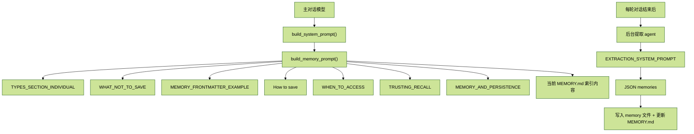

# CC_runtime_10.Prompt 详解---记忆系统

## 目录

- [1. 这一篇到底在讲什么](#1-这一篇到底在讲什么)
- [2. Memory Prompt 其实分两层](#2-memory-prompt-其实分两层)
- [3. 第一层：注入 `system_prompt` 的 `build_memory_prompt()`](#3-第一层注入-system_prompt-的-build_memory_prompt)
- [4. `TYPES_SECTION_INDIVIDUAL`：四种记忆类型](#4-types_section_individual四种记忆类型)
- [5. `WHAT_NOT_TO_SAVE_SECTION`：不该保存什么](#5-what_not_to_save_section不该保存什么)
- [6. `MEMORY_FRONTMATTER_EXAMPLE`：记忆文件格式](#6-memory_frontmatter_example记忆文件格式)
- [7. `How to save`：两步保存法](#7-how-to-save两步保存法)
- [8. `WHEN_TO_ACCESS_SECTION`：什么时候用/不用记忆](#8-when_to_access_section什么时候用不用记忆)
- [9. `TRUSTING_RECALL_SECTION`：信任但验证](#9-trusting_recall_section信任但验证)
- [10. `MEMORY_AND_PERSISTENCE_SECTION`：与 Plan/Task 的分工](#10-memory_and_persistence_section与-plantask-的分工)
- [11. 第二层：`EXTRACTION_SYSTEM_PROMPT` 后台提取指令](#11-第二层-extraction_system_prompt-后台提取指令)
- [12. 最后收束：Memory Prompt 约束的其实是两种角色](#12-最后收束memory-prompt-约束的其实是两种角色)
- [13. `build_memory_prompt()`：把这些 section 真正拼成一段 Prompt](#13-build_memory_prompt把这些-section-真正拼成一段-prompt)
- [14. 补充收束：两层 Prompt 在运行时如何协作](#14-补充收束两层-prompt-在运行时如何协作)

## 1. 这一篇到底在讲什么

第 06 篇 `CC_runtime_06.Memory系统完整指南.md` 讲的是整个 Memory 系统怎么工作：怎么存、怎么提取、怎么在 runtime 里流动。

这一篇更窄，也更“Prompt 工程”一点。它只回答一个问题：

> Claude Code 到底给模型塞了哪些和 Memory 相关的 Prompt 文本？这些文本分别在约束什么行为？

所以这篇不要和 “Memory 机制总览” 混在一起。这里讨论的是 Prompt 层，而不是整个实现层。

## 2. Memory Prompt 其实分两层

这组截图最核心的结论只有一个：Memory 相关 Prompt 不是一段，而是两层。



第一层是主循环里的 `system_prompt` 组成部分，也就是 `build_memory_prompt()`。  
它告诉主对话模型：

- 记忆有哪些类型
- 什么该存，什么不该存
- 该怎么写入记忆文件
- 什么时候该查记忆
- 查到记忆之后怎么用

第二层不是给主对话模型看的，而是给后台提取 agent 看的 `EXTRACTION_SYSTEM_PROMPT`。  
它在每轮对话结束后触发一次独立的模型 API 请求，不走主对话的 `query_loop`。

换句话说：

- 第一层解决“主模型在对话中如何理解和使用 Memory”
- 第二层解决“后台提取模型如何判断要不要把当前对话沉淀成 Memory”

## 3. 第一层：注入 `system_prompt` 的 `build_memory_prompt()`

从截图里的总览图可以看出，这一层包含 8 个静态段落，加上 1 个动态内容：

1. `TYPES_SECTION_INDIVIDUAL`
2. `WHAT_NOT_TO_SAVE`
3. `MEMORY_FRONTMATTER_EXAMPLE`
4. `How to save`
5. `WHEN_TO_ACCESS`
6. `TRUSTING_RECALL`
7. `MEMORY_AND_PERSISTENCE`
8. 当前 `MEMORY.md` 索引内容

这里有个非常容易混淆的点：

> `MEMORY.md` 当前索引内容也会进入这一层，但它不是静态 Prompt 常量，而是运行时动态加载进来的。

所以你可以把第一层理解成：

- 一半是写死的行为规则
- 一半是当前项目真实已有的 Memory 索引

前者规定“怎么做”，后者告诉模型“目前已经记住了什么”。

## 4. `TYPES_SECTION_INDIVIDUAL`：四种记忆类型

位置：`cc/prompts/sections.py:183-246`

这是整个 Memory Prompt 的核心段落。它不是笼统地说“你可以存记忆”，而是明确拆成四类：

- `user`
- `feedback`
- `project`
- `reference`

每一类都用统一的 XML 结构展开：

- `<name>`
- `<description>`
- `<when_to_save>`
- `<how_to_use>`
- `<examples>`

这套结构的价值很大。它不是只在定义“名字”，而是在给模型一个分类框架：不同信息该落到哪一类、保存触发条件是什么、未来应该怎样用。

### 4.1 `user`

`user` 存的是用户角色、目标、职责、知识背景、偏好视角。

这里最关键的不是“记录用户是谁”，而是：

> 用这些信息去 `tailor your future behavior`。

也就是说，`user` 记忆的目的不是做用户画像展示，而是调整后续回答方式。  
截图里还特别强调了一个约束：不要记录带有负面判断、也不真正服务当前协作目标的内容。

### 4.2 `feedback`

`feedback` 是用户对模型做事方式的纠正或确认。

这一类有两个特别重要的点：

1. 既记录失败纠正，也记录成功确认  
   Prompt 原文直接写了：`Record from failure AND success`

2. 不只存规则，还要存原因  
   它要求 `feedback` 类型用三段式结构：
   - 规则本身
   - `**Why:**`
   - `**How to apply:**`

这个设计很聪明。  
如果只存 “不要这样做”，模型很容易在边界场景里机械套规则；但有了 `Why`，它就知道背后的风险来源；有了 `How to apply`，它就知道什么场景该触发这条经验。

### 4.3 `project`

`project` 存的是项目里的持续性上下文，比如：

- 正在推进的工作
- 目标
- 决策
- bug / incident
- 截止日期

这里的约束比 `user` 和 `feedback` 更“工程化”。截图里有一句非常关键：

> 把相对日期转成绝对日期，例如 `"Thursday"` -> `"2026-03-05"`

原因很简单：项目记忆会衰减得很快。  
如果你只记“周四开始冻结”，一周之后这条记忆就已经不可解释了。

另外，`project` 也要求使用三段式结构：

- 事实 / 决策
- `**Why:**`
- `**How to apply:**`

因为项目上下文最怕只记结论，不记动机。没有动机，未来就无法判断这条信息是否还成立。

### 4.4 `reference`

`reference` 最轻量，它存的不是信息本体，而是“去哪里找信息”。

比如：

- 某类 bug 在哪个 Linear 项目里追踪
- 某类报警在什么 Grafana 看板里看
- 某类背景在某个 Slack 频道里找

所以 `reference` 的本质不是内容存储，而是外部资源指针。

### 4.5 为什么必须拆成四类

如果只有一个抽象的 “memory” 类型，模型在做保存判断时几乎没有支点。  
这四类把问题拆成了四种完全不同的保存意图：

- `user`：为了以后更贴合用户
- `feedback`：为了以后更贴合协作方式
- `project`：为了以后延续项目上下文
- `reference`：为了以后知道去哪里找最新信息

这也是为什么这段 Prompt 会比你直觉里想象的要长得多。

## 5. `WHAT_NOT_TO_SAVE_SECTION`：不该保存什么

位置：`cc/prompts/sections.py:251-259`

这一段的重点不是列规则本身，而是它背后的总原则：

> 不存可以从现有来源重新推导出来的信息。

截图里给出的排除项主要有 5 类：

- 代码模式、规范、架构、文件路径、项目结构  
  这些可以通过读当前项目状态得到
- Git 历史、近期变更、谁改了什么  
  `git log` / `git blame` 才是权威来源
- 调试方案或修复配方  
  真正的修复已经在代码里，提交信息里也有上下文
- `CLAUDE.md` 已有内容
- 临时任务细节、当前对话上下文、进行中的工作状态

这段里还有一个很值得注意的“安全阀”：

> 即使用户明确要求你保存，这些排除规则依然成立。

如果用户让你保存 PR 列表或活动摘要，Prompt 给出的正确做法不是机械照存，而是反问：

- 这里面什么是令人惊讶的
- 什么是非显而易见的

只有那部分才值得进 Memory。

这条规则本质上是在防止 Memory 退化成活动日志。

## 6. `MEMORY_FRONTMATTER_EXAMPLE`：记忆文件格式

位置：`cc/prompts/sections.py:264-272`

这一段给的是每条记忆文件的标准 frontmatter 模板：

```md
---
name: {{memory name}}
description: {{one-line description -- used to decide relevance in future conversations, so be specific}}
type: {{user, feedback, project, reference}}
---

{{memory content}}
```

这里最重要的字段其实是 `description`。

截图里专门强调：

> 这一行描述会被用来判断未来对话里的相关性，所以要尽量具体。

也就是说，`description` 不是装饰字段，它直接参与未来 Memory 检索。  
而且这行文字还会出现在 `MEMORY.md` 索引里，并被后续会话注入到 `system_prompt`。

另外，Prompt 还补了一条格式契约：

- 对于 `feedback` / `project` 类型
- 正文应按 `规则/事实 + Why + How to apply` 组织

它和前面的 `<body_structure>` 要求是完全一致的。

## 7. `How to save`：两步保存法

位置：`cc/prompts/sections.py:343-357`

这一段把保存 Memory 这件事定义成严格的两步流程。

### Step 1：把记忆写入独立文件

每条记忆都应进入自己的 `.md` 文件，使用前一节的 frontmatter 格式。

### Step 2：把指针写进 `MEMORY.md`

`MEMORY.md` 被明确规定为：

> `an index, not a memory`

也就是说：

- 它不是用来存记忆正文的
- 它只存指向记忆文件的一行指针

格式示例大致是：

```md
- [Title](file.md) -- one-line hook
```

而且这一行还有长度约束：

- 保持单行
- 大约不超过 150 字符

这是因为 `MEMORY.md` 会被直接加载到对话上下文里，而超过 200 行的部分会被截断。

截图里还连着给出了一组维护规则：

- 保持 `name`、`description`、`type` 和正文同步更新
- 按主题组织，而不是按时间顺序组织
- 过时记忆要更新或删除
- 不要写重复记忆，先检查能不能更新已有条目

这几条加起来，说明设计者根本不想要一个不断膨胀的记忆仓库，而是想要一个可维护的、可检索的知识索引。

## 8. `WHEN_TO_ACCESS_SECTION`：什么时候用/不用记忆

位置：`cc/prompts/sections.py:278-282`

这一段回答的是：

> 什么时候该去看 Memory？

从截图里能总结出三种触发场景。

### 8.1 相关性触发

当记忆看起来相关，或者用户提到了之前对话中的工作时，应当读取记忆。

这是一种“软触发”。

### 8.2 显式触发

如果用户明确说了：

- `check`
- `recall`
- `remember`

那么模型 `MUST` 访问记忆。

这是一种“硬触发”。

### 8.3 ignore-memory 覆盖

如果用户明确说：

- ignore memory
- do not use memory

那么就要把当前情况当成 `MEMORY.md` 为空来处理。

而且不只是“不去读”，Prompt 还进一步限制：

- 不要应用记忆中的事实
- 不要引用它
- 不要拿它做比较
- 不要提起记忆内容

这说明设计者对 “禁用 Memory” 的定义非常严格，不是形式上的不读取，而是语义上的完全不依赖。

### 8.4 记忆会过时

这一段的尾部还补了一个重要约束：

> 记忆只是某个时间点上为真的上下文。

所以在基于记忆回答用户或建立假设之前，要先根据当前文件或资源去验证。  
如果记忆和当前观察冲突，要信当前状态，并更新或删除过时记忆。

## 9. `TRUSTING_RECALL_SECTION`：信任但验证

位置：`cc/prompts/sections.py:287-297`

如果说上一段回答的是“什么时候去看记忆”，这一段回答的就是：

> 看完记忆之后，应该怎么用？

它的核心句子是：

> `"The memory says X exists" is not the same as "X exists now."`

这句话几乎把整段 Prompt 的灵魂说完了。

具体规则有三条：

- 如果记忆提到文件路径：检查文件是否存在
- 如果记忆提到函数或 flag：`grep` 确认
- 如果用户即将依据你的建议采取行动：先验证，不只是回忆

这一段还专门区分了两类记忆：

1. 指向具体对象的记忆  
   比如文件、函数、flag

2. 仓库状态快照式记忆  
   比如活动日志、架构快照

前者要验证对象是否仍然存在，后者要警惕“这是过去状态，不是现在状态”。

因此如果用户问的是：

- 最近的状态
- 当前的状态

那应该优先用：

- `git log`
- 直接读代码

而不是回忆旧快照。

这一段和 `WHEN_TO_ACCESS_SECTION` 配合得非常紧：

- `WHEN_TO_ACCESS` 规定“什么时候查”
- `TRUSTING_RECALL` 规定“查到之后怎么用”

## 10. `MEMORY_AND_PERSISTENCE_SECTION`：与 Plan/Task 的分工

位置：`cc/prompts/sections.py:304-307`

这段 Prompt 解决的是另一个常见问题：

> 模型会不会把所有“值得保留”的信息都往 Memory 里塞？

它的做法是把几种持久化机制分开：

| 机制 | 生命周期 | 用途 |
| --- | --- | --- |
| Memory | 跨会话 | 对未来会话仍有价值的信息 |
| Plan | 当前会话 | 对齐实施方案，保证模型和用户在同一页面 |
| Task | 当前会话 | 将工作拆分为步骤并追踪进度 |

截图里那句最关键的话是：

> `memory should be reserved for information that will be useful in future conversations`

所以：

- “我接下来打算怎么重构 auth 模块”  
  更像 Plan 内容
- “我接下来第二步要改什么”  
  更像 Task 内容
- “这个用户不喜欢每次回复后再附总结”  
  才是典型的 Memory 内容

这段 Prompt 的意义在于给 Memory 设边界，不让它变成当前会话所有临时决策的垃圾桶。

## 11. 第二层：`EXTRACTION_SYSTEM_PROMPT` 后台提取指令

位置：`cc/memory/extractor.py:34-79`

这一层不在主对话的 `system_prompt` 里。  
它是后台提取 agent 使用的独立 `system prompt`，在每轮对话结束后触发一次单独的模型 API 请求。

这段 Prompt 也分成几块，但比第一层简洁得多。

### 11.1 先定义：你是 memory extraction agent

开头先把角色钉死：

> 你是一个记忆提取 agent，分析下面的对话，判断有没有值得保存到持久记忆中的内容。

这里没有主对话模型那种复杂的协作职责，它只做一件事：判定并产出候选记忆。

### 11.2 它继承了同样的四类类型体系

提取目标还是同样四类：

- `user`
- `feedback`
- `project`
- `reference`

但这层 Prompt 没有像主循环那层那样给出那么细的 `<when_to_save>` / `<how_to_use>` 展开。  
它只给出足够完成分类的定义。

也就是说，提取 agent 不负责长期协作行为，只负责“把当前对话归到正确的记忆槽位里”。

### 11.3 它也继承了“什么不要存”

排除项和第一层高度一致：

- 代码模式、规范、架构、路径、项目结构
- Git 历史和近期变更
- 调试方案
- `CLAUDE.md` 已有内容
- 临时任务状态、当前对话上下文

而且同样保留了那个非常重要的原则：

> 即使用户明确要求保存，也要应用排除规则，只保存真正令人惊讶或非显而易见的部分。

### 11.4 输出格式被钉死成 JSON

这一层比主对话 Prompt 更“机器接口化”的地方在于：它强制输出精确 JSON。

如果找到值得保存的内容：

```json
{"memories": [{"name": "short_filename", "type": "user|feedback|project|reference", "content": "The memory content in markdown with frontmatter"}]}
```

如果没有值得保存的内容：

```json
{"memories": []}
```

这很关键，因为这条链路后面不是给人看，而是要被程序解析并落到文件系统里。

### 11.5 它同样要求 frontmatter 和结构约束

截图里明确规定：

- 每条 memory 的 `content` 必须包含 frontmatter
- 对 `feedback` / `project` 类型，正文仍要按：
  - 规则 / 事实
  - `**Why:**`
  - `**How to apply:**`

这说明两层 Prompt 虽然服务不同角色，但在最终数据格式上是完全对齐的。

### 11.6 这层 Prompt 为什么更短

很简单，因为它不承担主模型的协作责任。

主模型需要知道：

- 何时查
- 如何用
- 如何验证
- 如何与 Plan / Task 分工

提取 agent 不需要。它只需要知道：

- 哪些信息值得保存
- 该归为哪一类
- 输出必须长成什么格式

所以这层 Prompt 更像分类器 + 结构化输出约束。

## 12. 最后收束：Memory Prompt 约束的其实是两种角色

到这里，这一章最该记住的不是某一个 section 的细节，而是整体分工。

第一层 `build_memory_prompt()` 约束的是主对话模型：

- 什么是记忆
- 什么不是记忆
- 什么时候该查
- 查完怎么信任、怎么验证
- Memory 与 Plan / Task 怎么分工

第二层 `EXTRACTION_SYSTEM_PROMPT` 约束的是后台提取模型：

- 当前轮对话有没有值得沉淀的内容
- 属于哪一类
- 如何产出合法的结构化 memory 记录

所以如果把第 06 篇和这一篇放在一起看，可以形成一个很清楚的分层：

- 第 06 篇讲的是 Memory 系统“怎么运行”
- 这一篇讲的是 Memory 系统“靠哪些 Prompt 约束模型行为”

最终你会发现，Memory 之所以能工作，不只是因为有文件系统和提取器，更因为它把两个最难的问题都提前写进了 Prompt：

1. 未来什么值得被记住
2. 过去记住的东西今天还能不能直接相信

这两件事，才是 Memory 真正的难点。

## 13. `build_memory_prompt()`：把这些 section 真正拼成一段 Prompt

位置：`cc/prompts/sections.py:310-400`

前面 1 到 10 节讲的，其实大多还是“有哪些 Memory Prompt 片段”。  
这两张补图补上的关键问题是：

> 这些片段最后是怎么在代码里被拼成一整段 memory prompt，并注入 `system_prompt` 的？

函数签名大致是：

```python
def build_memory_prompt(memory_dir: str, entrypoint_content: str | None = None) -> str:
```

它不是单独发请求，也不是运行时动态对话逻辑，而是一个纯拼装函数：把多个 section 文本按固定顺序串起来，返回一整个字符串。

### 13.1 拼装顺序本身就是设计

补图里给出的顺序非常清楚，整体大致是：

```text
# auto memory
|
+-- 目录位置 + DIR_EXISTS_GUIDANCE
|
+-- 跨会话建设指引
|
+-- 显式保存/检索提示
|
+-- TYPES_SECTION_INDIVIDUAL
|
+-- WHAT_NOT_TO_SAVE_SECTION
|
+-- How to save
|   +-- MEMORY_FRONTMATTER_EXAMPLE
|
+-- WHEN_TO_ACCESS_SECTION
|
+-- TRUSTING_RECALL_SECTION
|
+-- MEMORY_AND_PERSISTENCE_SECTION
|
+-- MEMORY.md 内容
```

这个顺序不是随便排的。

- 先告诉模型“记忆目录已经存在，你可以直接写”
- 再告诉模型“这个系统的目标是跨会话积累”
- 然后才进入“有哪些类型、什么不该存、怎么保存、什么时候访问、如何验证”
- 最后再把当前 `MEMORY.md` 的真实索引内容嵌进去

换句话说，`build_memory_prompt()` 在做的不是字符串拼接这么简单，而是在构造一份有阅读顺序的“Memory 操作手册”。

### 13.2 `DIR_EXISTS_GUIDANCE` 解决的是一个很实际的问题

补图里专门点出了 `DIR_EXISTS_GUIDANCE`，位置在：`sections.py:334-337`

原文的意思很直接：

```text
This directory already exists -- write to it directly with the Write tool
(do not run mkdir or check for its existence).
```

这条提示看起来很小，但解决的是一个非常实际的 agent 问题：

- 模型在写记忆前，容易先去 `ls`
- 或者先去 `mkdir -p`
- 或者先检查目录存不存在

这些动作在这里其实都是多余的。

因为在更上层的 `_build_system()` 里，memory 目录已经提前准备好了。  
所以 Prompt 在这里显式告诉模型：目录已存在，直接写，不要再浪费一轮工具调用。

这是一种很典型的 Prompt 优化：

> 把运行时已经确定为真的前提，提前写进 Prompt，减少模型的无效试探。

### 13.3 `MEMORY.md` 内容注入有三种分支

补图还把 `MEMORY.md` 内容注入这一步拆得更细了。它不是无脑拼接，而是分情况处理。

#### 情况 1：索引存在且非空

直接把内容嵌入 Prompt。

但如果超过 200 行，会截断并给出 warning。补图里展示的提示文案大意是：

```text
WARNING: MEMORY.md is {line_count} lines (limit: 200). Only part of it was loaded.
Keep index entries to one line under ~200 chars; move detail into topic files.
```

这条 warning 不只是报错提示，它还顺手教模型如何解决索引膨胀：

- 每条索引保持单行
- 单行尽量简短
- 详细内容放进主题文件

#### 情况 2：索引为空或不存在

就显示一段空状态提示，例如：

```text
Your MEMORY.md is currently empty. When you save new memories, they will appear here.
```

这相当于给模型一个明确的初始心智模型：现在没有索引内容，但这个位置未来会承载记忆入口。

#### 情况 3：超过上限后的截断注入

本质上还是情况 1 的子分支，但值得单独拿出来说，因为它说明：

> `MEMORY.md` 注入不是“全量真实性优先”，而是“对话上下文长度可控优先”。

这里也能看出为什么前面 `How to save` 会反复强调：

- `MEMORY.md` 是索引，不是正文
- 不要把长内容写进索引
- 详细内容移到单独主题文件

不是因为美观，而是因为索引真的会被注入 Prompt，长度直接影响上下文预算。

### 13.4 它是怎么进入主 `system_prompt` 的

补图最后还把调用链补完整了。整体流程大致是：

```text
main.py _build_system()
  -> session_memory.get_memory_dir(cwd)
  -> session_memory.load_memory_index(cwd)
  -> builder.build_system_prompt(...)
       ...
       memory_dir=memory_dir,
       memory_index_content=index_content,
  -> sections.build_memory_prompt(memory_dir, index_content)
  -> 返回完整 memory prompt 字符串
```

然后这段字符串再作为 `build_system_prompt()` 返回列表中的一个元素，和其他 section 一起组成完整的主 `system_prompt`。

所以这里的层级关系一定要分清：

- `build_memory_prompt()` 负责生成 Memory 子段
- `build_system_prompt()` 负责把它和其他系统段落装成完整主 Prompt
- `_build_system()` 负责在 runtime 启动时触发这一整套装配

## 14. 补充收束：两层 Prompt 在运行时如何协作

补图最后一块内容，其实是在给整章做一个更“运行时”的收束。

### 14.1 第一层：主对话开始前生成

第一层是在每次对话开始前生效的，也就是主模型看到的 `system_prompt` 注入层。

模型在这一层里读到的是：

- 我有一个 Memory 系统
- 它分四种类型
- 什么该存，什么不该存
- 怎么存
- 什么时候该访问
- 访问之后怎么验证

于是当用户在对话里说：

- “记住这个”
- “你回忆一下上次我们定的规则”

模型可以直接按这套行为指令来执行。

### 14.2 第二层：每轮对话后异步触发

第二层不是 `query_loop` 的一部分，而是在每轮对话结束后由后台提取逻辑额外触发一次独立模型调用。

它走的是：

- 构造最近对话消息列表
- 使用 `EXTRACTION_SYSTEM_PROMPT`
- 调用模型
- 返回 JSON
- 由 `extract_memories()` 解析并落盘

所以它更像系统级“被动扫描”，而不是主模型的显式行动。

### 14.3 两层共享同一套不变量

虽然两层分工不同，但补图总结得很好：两层共享一套核心不变量。

至少有这几项是一致的：

- 同样的四类记忆：`user / feedback / project / reference`
- 同样的排除规则：`WHAT_NOT_TO_SAVE`
- 同样的 frontmatter 结果格式

这就保证了：

- 无论是主对话模型主动保存
- 还是提取 agent 后台写入

最终写出来的记忆文件结构和质量标准是一致的。

### 14.4 为什么一定要两层

如果只有第一层，没有第二层：

- 模型只能在“它主动意识到该存”的时候保存
- 很容易漏掉那些没有被显式提起、但其实值得沉淀的对话信息

如果只有第二层，没有第一层：

- 后台能写记忆
- 但主对话模型并不知道何时该查、如何使用、如何验证这些记忆

所以两层不是重复，而是互补：

- 第一层负责“使用规则”
- 第二层负责“提取落盘”

补图把这个配合关系讲得很清楚：  
第一层更像协作中的显式行为约束；第二层更像系统在对话结束后做的一次结构化整理。
