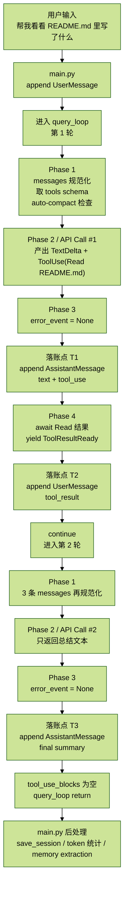
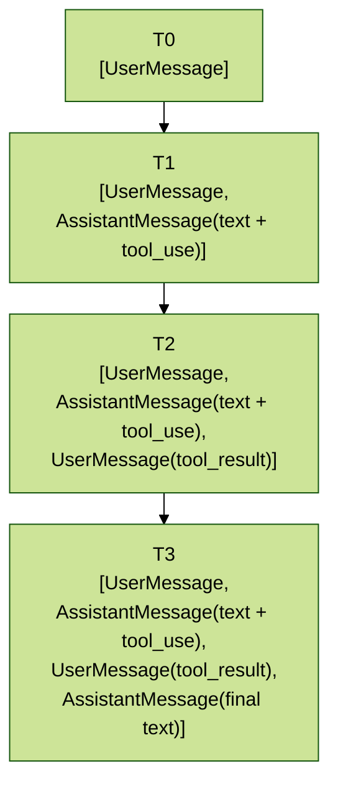

# CC_runtime_11.一次请求的全链路时序

> 本篇用一个真实例子展开：用户输入“帮我看看 README.md 里写了什么”，从头到尾拆开一次完整请求的全部阶段。每个阶段我会给出此刻 `messages[]` 列表的完整快照，让你看清 final transcript 是怎样一步步长出来的。
>
> 这个例子涉及 2 次 API 调用、1 次工具执行、4 条 messages，是理解整个内核的最小闭合回路。如果你已经看过前面几篇，可以把这一篇当成“总装图”来看：所有模块在这里汇聚成一条完整的时间线。

## 1. 一次请求的总览

先把全链路压成一张总图：



本例的最终统计：

- API 调用：2 次
- 工具执行：1 次（`Read`）
- transcript 最终条数：4 条
- token 累计：`in = 2956`，`out = 192`

## 2. `messages[]` 的演化图

这一篇最重要的不只是控制流，还有 `messages[]` 是怎么长出来的。先给出摘要图：



后文会在三个落账点分别展开。

## 3. 三层运行时状态

在进入例子之前，先回顾三层状态。后续每个阶段都会标注它属于哪一层，理解三层边界是理解整个时序的前提。

### 3.1 会话级状态

贯穿 REPL 全生命周期，封装在 `QueryEngine` 中：

- `engine._messages`：整个对话的 transcript，source of truth
- `engine._system_prompt`：拼装好的 system prompt
- `engine._registry`：工具注册表（`name -> Tool` 实例）
- `engine._total_input_tokens` / `engine._total_output_tokens`：跨轮次累计 token 计数

来源：`cc/core/query_engine.py:84-111`

### 3.2 `query_loop` 级状态

单次 `query_loop()` 执行期间存在：

- `turn_count`
- `retry_count`
- `max_retry`
- `accumulated_text`
- `tool_use_blocks`
- `stop_reason`
- `usage`
- `has_attempted_reactive_compact`
- `current_max_tokens`

来源：`cc/core/query_loop.py:121-128`

### 3.3 流式 block 级状态

单次 `stream_response()` 调用期间存在：

- `content_blocks`：以 SSE index 为 key 的增量累积 dict
- `final_content`
- `usage`
- `stop_reason`

来源：`cc/api/claude.py:113-119`

这三层状态彼此独立。前面章节已经展开过，这里只做索引。

## 4. 系统启动后固定了什么

REPL 启动时，`_run_repl()` 调用 `_build_engine()`（`cc/main.py:327-472`），完成所有装配：

| 产出 | 说明 | 代码位置 |
| --- | --- | --- |
| `client` | Anthropic SDK 异步客户端 | `cc/api/client.py` |
| `registry` | 20+ 工具的注册表 | `cc/main.py:76-187` |
| `system_prompt` | 多段拼接的 system prompt（含 memory + CLAUDE.md） | `cc/main.py:285-324` |
| `hooks` | 从 `settings.json` 加载的 hook 配置列表 | `cc/hooks/hook_runner.py` |
| `permission_ctx` | 权限上下文（`ACCEPT_EDITS` 模式） | `cc/permissions/gate.py` |

装配完成后，最关键的一点是：

```python
self._messages: list[Message] = []
# cc/core/query_engine.py:105
```

`messages` 是空的，等待用户输入。变化最频繁的不是工具注册表、不是 prompt section，而是这个 `messages` 列表。它是整个系统真正的 source of truth。

在 REPL 主循环中，`messages` 是 `engine._messages` 的直接引用（`cc/main.py:612`）：

```python
messages: list[Message] = engine.messages
# 同一个 list 对象
```

对 `messages` 的任何操作（`append`、`clear`、`extend`）都会直接影响 engine 内部状态。这意味着 REPL 层和内核层共享同一份 transcript，不存在“拷贝后传入”的中间层。

## 5. 用户输入 -> 第一处分流

用户在终端输入：

```text
> 帮我看看 README.md 里写了什么
```

REPL 主循环读到这行文本后，先做分流判断（`cc/main.py:673`）：

```text
"帮我看看 README.md 里写了什么"
↓
不以 "/" 开头
↓
不是 slash command
↓
走普通消息分支
```

普通消息分支的动作很简单：构造 `UserMessage` 并追加到 transcript（`cc/main.py:731`）：

```python
messages.append(UserMessage(content=user_input))
```

然后记录输入历史到 `~/.claude/history.jsonl`（`cc/main.py:734-739`），用于后续 session 列表展示。

注意这里追加的是 `UserMessage` 对象（内部格式），不是 API 要求的 dict。内部格式和 API 格式之间有一道转换层 `normalize_messages_for_api()`，它在 `query_loop` 的 Phase 1 中执行。

### 5.1 `messages[]` 快照 T0

```python
messages = [
    UserMessage(
        content="帮我看看 README.md 里写了什么",
        uuid="a1b2c3d4-...",
        type="user",
        is_meta=False,
        is_compact_summary=False,
    )
]
# <- cc/main.py:731
```

此时 transcript 中只有 1 条消息。接下来调用 `engine.run_turn()`（`cc/main.py:767`），进入 `query_loop()`。

## 6. 进入 `query_loop` —— Phase 1 消息准备

`engine.run_turn()` 内部调用 `query_loop()`（`cc/core/query_engine.py:264-275`），传入所有依赖：

```python
async for event in query_loop(
    messages=self._messages,          # 同一个 list 对象，原地修改
    system_prompt=self._system_prompt,
    tools=self._registry,
    call_model=self.make_call_model(),
    max_turns=self._max_turns,
    auto_compact_fn=auto_compact_fn,
    context_window=self._context_window,
    hooks=self._hooks,
    permission_checker=perm_checker,
):
    yield event
```

进入 `query_loop()` 后，`turn_count` 从 0 开始，第一次循环时增至 1。

### 6.1 Phase 1 第一步：消息规范化

来源：`cc/core/query_loop.py:135`

```python
api_messages = normalize_messages_for_api(messages)
```

`normalize_messages_for_api()`（`cc/models/messages.py:184-230`）将内部 `Message` 对象转成 Anthropic API 需要的 dict 格式。此时只有一条 `UserMessage`，转换结果：

```python
api_messages = [
    {"role": "user", "content": "帮我看看 README.md 里写了什么"}
]
```

角色交替检查通过（只有一条 user 消息，不存在连续相同角色情况）。`tool_use/tool_result` 配对检查也通过，此时两者都不存在，`_ensure_tool_result_pairing()` 的 Pass 1/2/3 全部跳过。

这一步看似简单，但 `normalize_messages_for_api()` 是整个系统最重要的协议防线之一。它确保无论内部 transcript 如何变化（压缩、中断、手动编辑），发给 API 的消息永远合法。

### 6.2 Phase 1 第二步：获取工具 schema

来源：`cc/core/query_loop.py:136`

```python
tool_schemas = tools.get_api_schemas()
# 返回 20+ 工具的 JSON schema 列表
```

### 6.3 Phase 1 第三步：auto-compact 检查

来源：`cc/core/query_loop.py:140-163`

```python
estimated_tokens = estimate_messages_tokens(api_messages)

# 此时只有一条短 user 消息，estimated_tokens ≈ 25
# should_auto_compact(25, 200000, 0) -> False
# 25 远低于 context_window * 0.7 = 140000
# 跳过 compact 分支
```

auto-compact 的目的是在 API 调用前检测 token 量是否接近上下文窗口上限。如果超过 70% 阈值，会先压缩旧消息再继续；但本例第一轮只有一条消息，完全不需要。

Phase 1 完成，进入 Phase 2。

## 7. Phase 2 —— 调用模型（第一轮）

首先创建 `StreamingToolExecutor`（`cc/core/query_loop.py:171-173`），初始化本轮临时状态：

```python
executor = StreamingToolExecutor(
    tools,
    hooks=hooks,
    permission_checker=permission_checker,
)
accumulated_text = ""
usage = Usage()
stop_reason = "end_turn"
tool_use_blocks: list[ToolUseBlock] = []
error_event: ErrorEvent | None = None
```

然后调用 `call_model()`（`cc/core/query_loop.py:180-185`）：

```python
async for event in call_model(
    messages=api_messages,
    system=system_prompt,
    tools=tool_schemas,
    max_tokens=16384,   # current_max_tokens 的初始值
):
```

`call_model` 是一个闭包（由 `QueryEngine.make_call_model()` 创建，`cc/core/query_engine.py:153-179`），内部调用 `stream_response()`（`cc/api/claude.py:72-289`）。闭包捕获了 `client` 和 `model`，使得 `query_loop` 不需要直接依赖 Anthropic SDK。这是依赖注入的关键：测试时可以注入 mock 的 `call_model`，子 agent 也可以用不同的 model 参数。

### 7.1 `stream_response()` 内部：SSE 事件序列

API 返回的 SSE 事件按以下顺序到达：

```text
message_start        -> usage.input_tokens = 856
content_block_start  -> index=0, type="text"
content_block_delta  -> text_delta("我来帮你读取 README.md 文件")
content_block_stop   -> final_content += TextBlock("我来帮你读取 README.md 文件")

content_block_start  -> index=1, type="tool_use", id="tu_01", name="Read"
content_block_delta  -> input_json_delta('{"fil')
content_block_delta  -> input_json_delta('e_path')
content_block_delta  -> input_json_delta('":"README.md"}')
content_block_stop   -> json.loads('{"file_path":"README.md"}') -> yield ToolUseStart

message_delta        -> stop_reason="tool_use", output_tokens=42
```

注意两个关键细节：

1. `ToolUseStart` 在 `content_block_stop` 时才 `yield`（`cc/api/claude.py:235-239`），因为只有此时 `input_json` 才拼接完整，可以安全 `json.loads`。
2. `input_tokens` 从 `message_start` 获取，`output_tokens` 从 `message_delta` 获取，这两处分离是 Anthropic API 的设计（`cc/api/claude.py:136` 和 `cc/api/claude.py:263`）。

最后 `stream_response()` 在正常完成时 yield 一个 `TurnComplete`（`cc/api/claude.py:289`）：

```python
yield TurnComplete(
    stop_reason=stop_reason or "end_turn",
    usage=usage,
)

# 此时 stop_reason = "tool_use"（来自 message_delta），不触发 fallback
# usage = Usage(input_tokens=856, output_tokens=42)
```

`stop_reason` 的 `None fallback` 为 `"end_turn"` 只在流意外中断（没收到 `message_delta`）时生效。正常情况下，`"tool_use"` 表示模型希望执行工具后继续。

### 7.2 `query_loop` 消费事件流

回到 `query_loop()` 的 `async for event in call_model(...)` 循环（`cc/core/query_loop.py:186-204`）：

- `TextDelta("我来帮你读取 README.md 文件")`：`accumulated_text += event.text`，同时 `yield event` 透传给 UI 实现逐字显示。
- `ToolUseStart(tool_name="Read", tool_id="tu_01", input={"file_path":"README.md"})`：`yield event` 通知 UI 显示工具调用信息。构造 `ToolUseBlock` 追加到 `tool_use_blocks`，然后调用 `executor.add_tool(block)`（`cc/core/query_loop.py:196`）。这是流式提前执行的关键：Read 工具的 `is_concurrency_safe` 返回 `true`，且当前消息独占工具在运行，所以 executor 立即启动一个 `asyncio.Task` 并发读取文件（`cc/tools/streaming_executor.py:89-91`）。
- `TurnComplete(stop_reason="tool_use", usage=...)`：记录 `stop_reason = "tool_use"` 和 `usage`。注意，这个事件在 Phase 2 的事件消费循环中并不直接 `yield`；要等到 Phase 4 完成后，由 `query_loop` 自己构造并 `yield TurnComplete`（`cc/core/query_loop.py:301`）。这是因为在 Phase 2 结束时，`AssistantMessage` 还没写入 transcript。

### 7.3 Phase 2 结束时的局部状态

```python
accumulated_text = "我来帮你读取 README.md 文件"
tool_use_blocks = [
    ToolUseBlock(id="tu_01", name="Read", input={"file_path": "README.md"})
]
stop_reason = "tool_use"
usage = Usage(input_tokens=856, output_tokens=42)
error_event = None

# executor 中：Read 的 asyncio.Task 正在后台执行（或已完成）
```

## 8. Phase 3 —— 错误检查

`error_event` 为 `None`（`cc/core/query_loop.py:208`），跳过整个错误恢复分支。

重置重试状态（`cc/core/query_loop.py:265-266`）：

```python
retry_count = 0
last_error = None
```

正常的 `max_tokens` 截断检查也跳过了，因为此时 `stop_reason` 是 `"tool_use"` 而不是 `"max_tokens"`。

## 9. 构建 `AssistantMessage` —— 落账点 1

进入 transcript 写入点 1（`cc/core/query_loop.py:288-299`）。将模型本轮输出的文本和工具调用写入 `messages`：

```python
assistant_blocks: list[AssistantContentBlock] = []
if accumulated_text:
    assistant_blocks.append(TextBlock(text=accumulated_text))
assistant_blocks.extend(tool_use_blocks)

assistant_msg = AssistantMessage(
    content=assistant_blocks,
    usage=usage,
    stop_reason=stop_reason,
)
messages.append(assistant_msg)
```

### 9.1 `messages[]` 快照 T1

```python
messages = [
    UserMessage(
        content="帮我看看 README.md 里写了什么",
        uuid="a1b2c3d4-...",
        type="user",
        is_meta=False,
        is_compact_summary=False,
    ),
    AssistantMessage(
        content=[
            TextBlock(text="我来帮你读取 README.md 文件"),
            ToolUseBlock(
                id="tu_01",
                name="Read",
                input={"file_path": "README.md"},
            ),
        ],
        uuid="e5f6a7b8-...",
        type="assistant",
        stop_reason="tool_use",
        usage=Usage(
            input_tokens=856,
            output_tokens=42,
            cache_creation_input_tokens=0,
            cache_read_input_tokens=0,
        ),
        model="",
        is_api_error=False,
    ),
]
# <- 第二条消息落账于 cc/core/query_loop.py:299
```

此时 transcript 有 2 条消息。为什么要在工具执行之前就把 `AssistantMessage` 写入 transcript？因为 Anthropic API 的协议要求 `tool_result` 必须紧跟在包含 `tool_use` 的 assistant 消息之后。如果不先写 assistant 再写 `tool_result`，整个 transcript 的结构就会失真。这是一个不可违背的顺序约束。

`TurnComplete` 被 yield 出去后，REPL 主循环中（`cc/main.py:769-771`）会顺手累计 token：

```python
engine._total_input_tokens += event.usage.input_tokens   # 0 + 856 = 856
engine._total_output_tokens += event.usage.output_tokens # 0 + 42 = 42
```

## 10. Phase 4 —— 工具执行 + 结果拼回 —— 落账点 2

`tool_use_blocks` 非空（有 1 个 `Read`），进入 Phase 4（`cc/core/query_loop.py:306-341`）。

### 10.1 收集工具执行结果

```python
tool_results = await executor.get_results()
```

`executor.get_results()`（`cc/tools/streaming_executor.py:148-172`）先处理队列中的剩余工具，再收集所有结果。在本例中，`Read` 工具的 `asyncio.Task` 早在 Phase 2 流式过程中就已启动，此时很可能已经完成，`await task` 立即返回。

结果近似为：

```python
tool_results = [
    (
        "tu_01",
        ToolResult(
            content="# cc-python-claude\n\n本项目是 Claude Code CLI 的 Python 复刻...",
            is_error=False,
        )
    )
]
```

### 10.2 `yield ToolResultReady` + 构建 `ToolResultBlock`

对每个工具结果（`cc/core/query_loop.py:310-335`）：

```python
yield ToolResultReady(
    tool_id="tu_01",
    content="# cc-python-claude\n\n本项目是 Claude Code CLI 的 Python 复刻..."[:500],
    is_error=False,
)
```

`ToolResultReady` 的 `content` 截断到 500 字符，仅供 UI 预览。这是展示层的需要，模型看不到这个截断版。完整内容会进入 `ToolResultBlock`，随后作为 `UserMessage` 的一部分追加到 transcript，才是模型下一轮能看到的内容。

然后写入第 3 条消息：

```python
tool_result_msg = UserMessage(content=list(result_blocks))
messages.append(tool_result_msg)
continue
# continue 3：有工具调用 -> 带着结果继续下一轮
```

工具结果为什么包装为 `UserMessage`？因为 Anthropic API 协议要求 `tool_result` 必须在 `user` 角色的消息中（`cc/core/query_loop.py:338` 的注释已说明）。

### 10.3 `messages[]` 快照 T2

```python
messages = [
    UserMessage(
        content="帮我看看 README.md 里写了什么",
        uuid="a1b2c3d4-...",
        type="user",
        is_meta=False,
        is_compact_summary=False,
    ),
    AssistantMessage(
        content=[
            TextBlock(text="我来帮你读取 README.md 文件"),
            ToolUseBlock(
                id="tu_01",
                name="Read",
                input={"file_path": "README.md"},
            ),
        ],
        uuid="e5f6a7b8-...",
        type="assistant",
        stop_reason="tool_use",
        usage=Usage(input_tokens=856, output_tokens=42),
        model="",
        is_api_error=False,
    ),
    UserMessage(
        content=[
            ToolResultBlock(
                tool_use_id="tu_01",
                content="# cc-python-claude\n\n本项目是 Claude Code CLI 的 Python 复刻...",
                is_error=False,
            ),
        ],
        uuid="f9a0b1c2-...",
        type="user",
        is_meta=False,
        is_compact_summary=False,
    ),
]
# <- 第三条消息落账于 cc/core/query_loop.py:339
```

此时 transcript 有 3 条消息，角色交替为 `user -> assistant -> user`，完全合法。`continue` 回到 while 循环顶部，`turn_count` 增至 2，开始第二轮循环。

这就是 `query_loop` 的 `continue 3`（`cc/core/query_loop.py:341`）：一有工具调用时，拼回结果后继续下一轮。这也是 agent 闭环的核心：模型决策 -> 工具执行 -> 结果回灌 -> 模型再次决策。

## 11. 第二轮 —— Phase 1-2（模型看到工具结果后总结）

### 11.1 Phase 1（第二轮）

`normalize_messages_for_api(messages)` 将 3 条内部消息转为 3 个 API dict。此时转换比第一轮复杂，需要处理 `AssistantMessage` 中的 `content` 列表（`TextBlock + ToolUseBlock`），以及第三条 `UserMessage` 中的 `ToolResultBlock`。

发给 API 的消息（英文字段）近似如下：

```python
api_messages = [
    {"role": "user", "content": "帮我看看 README.md 里写了什么"},
    {
        "role": "assistant",
        "content": [
            {"type": "text", "text": "我来帮你读取 README.md 文件"},
            {"type": "tool_use", "id": "tu_01", "name": "Read", "input": {"file_path": "README.md"}},
        ],
    },
    {
        "role": "user",
        "content": [
            {
                "type": "tool_result",
                "tool_use_id": "tu_01",
                "content": "# cc-python-claude\n\n本项目是 Claude Code CLI 的 Python 复刻...",
                "is_error": False,
            }
        ],
    },
]
```

字段含义：

| 字段 | 含义 |
| --- | --- |
| `role="user"` | 用户角色消息 |
| `role="assistant"` | 模型角色消息 |
| `type="text"` | 纯文本内容块 |
| `type="tool_use"` | 工具调用块（模型发起） |
| `id` | 工具调用唯一标识符 |
| `name` | 工具名 |
| `input` | 工具参数 |
| `type="tool_result"` | 工具执行结果块（回传给模型） |
| `tool_use_id` | 对应的工具调用 id |
| `content` | 执行结果内容 |
| `is_error` | 是否执行出错 |

角色交替正确（`user -> assistant -> user`），`tool_use/tool_result` 配对正确（`tu_01` 对 `tu_01`）。

auto-compact 检查：`estimated_tokens ≈ 1800`（3 条消息 + 文件内容），仍远低于 140000 阈值，跳过压缩。

### 11.2 Phase 2（第二轮）

重新创建 `StreamingToolExecutor`。注意每一轮都创建新的 executor 实例（`cc/core/query_loop.py:171-173`），上一轮的 executor 及其持有的 `asyncio.Task` 引用在 `get_results()` 收集结束后就不再需要了。

初始化新一轮的临时状态：

```python
accumulated_text = ""
tool_use_blocks = []
usage = Usage()
stop_reason = "end_turn"
```

调用 `call_model()`。这是第 2 次 API 调用。模型这次收到的 `api_messages` 包含完整的文件内容（在第三条消息的 `tool_result` 中），它判断信息足够，决定直接总结回答，不再调用工具。

SSE 事件序列近似如下：

```text
message_start        -> usage.input_tokens = 2100
content_block_start  -> index=0, type="text"
content_block_delta  -> text_delta("README.md 的核心内容是：\n1. 项目定位：")
content_block_delta  -> text_delta("Claude Code CLI 的 Python 复刻\n2. 架构概览：")
content_block_delta  -> text_delta("core/ 核心循环、api/ API 交互、tools/ 工具实现...")
content_block_stop   -> final_content += TextBlock("README.md 的核心内容是：...")
message_delta        -> stop_reason="end_turn", output_tokens=150
```

`query_loop` 消费这些事件：

- 多个 `TextDelta` -> `accumulated_text` 逐步累积完整总结文本，每次 `yield event` 给 UI 实现逐字显示
- 因为这一轮没有 `ToolUseStart` 事件，`tool_use_blocks` 始终为空列表，`executor.add_tool()` 从未被调用
- `TurnComplete(stop_reason="end_turn", usage=Usage(input_tokens=2100, output_tokens=150))`：记录 `stop_reason = "end_turn"`

## 12. 构建 `AssistantMessage` + return —— 落账点 3

Phase 3：`error_event = None`，跳过。

构建 `AssistantMessage`（`cc/core/query_loop.py:288-299`）—— 此次只有文本块，没有工具调用：

```python
assistant_blocks = [
    TextBlock(
        text="README.md 的核心内容是：\n"
             "1. 项目定位：Claude Code CLI 的 Python 复刻\n"
             "2. 架构概览：core/ 核心循环、api/ API 交互、tools/ 工具实现...\n"
             "3. 开发标准：TDD、mypy strict、翻译而非重新设计\n"
             "4. 关键约束：Prompt 文本必须从原版复制，不得自行编写"
    )
]
```

`messages.append(assistant_msg)` 完成 transcript 第 4 条写入。

然后检查 Phase 4（`cc/core/query_loop.py:306`）：`tool_use_blocks` 为空 -> `if not tool_use_blocks: return`，退出工具执行分支，直接 `return`（`cc/core/query_loop.py:344`）。这是 `query_loop` 最常见的退出方式：模型的 `stop_reason` 为 `"end_turn"` 且没有工具调用，意味着它认为任务已完成。

### 12.1 `messages[]` 快照 T3（最终状态）

```python
messages = [
    UserMessage(
        content="帮我看看 README.md 里写了什么",
        uuid="a1b2c3d4-...",
        type="user",
        is_meta=False,
        is_compact_summary=False,
    ),
    AssistantMessage(
        content=[
            TextBlock(text="我来帮你读取 README.md 文件"),
            ToolUseBlock(
                id="tu_01",
                name="Read",
                input={"file_path": "README.md"},
            ),
        ],
        uuid="e5f6a7b8-...",
        type="assistant",
        stop_reason="tool_use",
        usage=Usage(input_tokens=856, output_tokens=42),
        model="",
        is_api_error=False,
    ),
    UserMessage(
        content=[
            ToolResultBlock(
                tool_use_id="tu_01",
                content="# cc-python-claude\n\n本项目是 Claude Code CLI 的 Python 复刻...",
                is_error=False,
            ),
        ],
        uuid="f9a0b1c2-...",
        type="user",
        is_meta=False,
        is_compact_summary=False,
    ),
    AssistantMessage(
        content=[
            TextBlock(
                text="README.md 的核心内容是：\n"
                     "1. 项目定位：Claude Code CLI 的 Python 复刻\n"
                     "2. 架构概览：core/ 核心循环、api/ API 交互、tools/ 工具实现...\n"
                     "3. 开发标准：TDD、mypy strict、翻译而非重新设计\n"
                     "4. 关键约束：Prompt 文本必须从原版复制，不得自行编写"
            )
        ],
        uuid="d3e4f5a6-...",
        type="assistant",
        stop_reason="end_turn",
        usage=Usage(
            input_tokens=2100,
            output_tokens=150,
            cache_creation_input_tokens=0,
            cache_read_input_tokens=0,
        ),
        model="",
        is_api_error=False,
    ),
]
```

此时 transcript 有 4 条消息，角色交替为 `user -> assistant -> user -> assistant`。这就是一次完整工具调用闭环在 transcript 中的最终形态。

`query_loop()` 的 async generator 正常 `return`。控制流依次回到：

- `engine.run_turn()` 的 `async for event in query_loop(...)` 循环结束
- `_run_repl()` 的 `async for event in engine.run_turn()` 循环结束
- 回到 REPL 主循环

## 13. `query_loop` 结束后 —— `main.py` 后处理

`query_loop()` 结束后，REPL 主循环（`cc/main.py:776-805`）执行三件后处理。

### 13.1 后处理 1：`save_session`

```python
task_snap = engine._task_registry.snapshot()
save_session(session_id, messages, task_snapshot=task_snap)
```

路径：`cc/session/storage.py`。将完整 transcript（4 条消息）序列化为 JSONL 格式，写入 `~/.claude/sessions/{session_id}.jsonl`。JSONL 格式的好处是流式写入友好、部分损坏可恢复，也便于追加。同时保存 `task_snapshot` —— 所有后台任务（agent / teammate）的状态快照，以便 resume 时恢复。

### 13.2 后处理 2：token 统计

第二轮的 `TurnComplete` 事件在 REPL 主循环中被消费（`cc/main.py:769-771`）：

```python
engine._total_input_tokens += 2100   # 856 + 2100 = 2956
engine._total_output_tokens += 150   # 42 + 150 = 192
```

最终累计：

```python
engine._total_input_tokens  = 2956
engine._total_output_tokens = 192
```

### 13.3 后处理 3：后台 memory extraction

```python
_extraction_call = engine.make_call_model(max_tokens=1024)

async def _bg_extract(...):
    saved = await extraction_coord.request_extraction(msgs, wd, call)

task = asyncio.create_task(_bg_extract())
_bg_tasks.add(task)
task.add_done_callback(_bg_tasks.discard)
```

来源：`cc/main.py:787-805`

`ExtractionCoordinator`（`cc/memory/extractor.py`）的判断逻辑：

- 本次 `messages` 长度 = 4
- `_last_extracted_count = 0`（首次提取）
- 新消息数 = 4 >= `MIN_NEW_MESSAGES(4)` -> 触发提取

提取器使用低配版 `call_model(max_tokens=1024)` 扫描最近对话。提取的判断标准在 `EXTRACTION_SYSTEM_PROMPT`（`cc/memory/extractor.py:34-79`）中定义，只保存用户偏好、反馈修正、项目决策、外部资源指针这四类信息，明确排除代码模式、git 历史、调试方案等可从代码再推导的信息。如果发现值得保存的内容，写入 `~/.claude/projects/<hash>/memory/` 并更新 `MEMORY.md` 索引；未来轮次的 `build_system_prompt()` 会读取这些 memory 注入到 system prompt 中。

整个过程是 `asyncio.create_task` 异步执行（`cc/main.py:803`），不阻塞下一轮用户输入。`_bg_tasks` 集合（`cc/main.py:614`）持有 task 引用防止被 GC 回收，完成后通过 `done_callback` 自动移除。

## 14. 错误恢复插入点（假设场景）

本例中全程无错误。但真实使用中错误不可避免——API 限流、上下文超长、网络波动都很常见。恢复逻辑的插入位置统一在 Phase 3（`cc/core/query_loop.py:208-262`），紧跟在 Phase 2 的流式事件消费之后、`AssistantMessage` 写入 transcript 之前。

也就是说，错误恢复发生在：

```text
模型输出 / 事件流结束
-> Phase 3 检查 error_event
-> 如需恢复则先处理恢复逻辑
-> 成功后才允许写入 AssistantMessage
```

这个插入点很讲究：它既拿到了完整的本轮输出状态，又还没有把坏状态落账到 transcript，因此最适合做 retry / compact / fallback。

### 14.1 场景 A：第一轮 API 返回 413（`prompt_too_long`）

当 `error_event.message` 包含 `"413"` 或 `"prompt_too_long"` 时，会走 reactive compact 路线：

```python
if error_event.message contains "413" or "prompt_too_long":
    has_attempted_reactive_compact = False  # 允许尝试一次
    compacted = compact_messages(messages, auto_compact_fn)
    messages.clear()
    messages.extend(compacted)
    recovered = True
    turn_count -= 1
    continue   # 重进 Phase 1
```

要点：

- 一次 `query_loop` 中最多只做一次 reactive compact
- 由 `has_attempted_reactive_compact` 标记控制
- 压缩成功后直接重走当前轮，而不是把错误落账进 transcript

### 14.2 场景 B：模型输出达到 `max_tokens` 截断

如果本轮 `stop_reason == "max_tokens"`，会尝试放宽输出上限并续跑：

```python
stop_reason = "max_tokens"
max_output_recovery_count -= 0   # 第一次截断
current_max_tokens = 65536       # ESCALATED_MAX_TOKENS
recovered = True
turn_count -= 1
continue
```

如果仍然截断，后续会追加以下消息让模型接续：

英文原文：

```text
Please continue from where you left off.
```

中文翻译：

```text
请从你中断的地方继续。
```

最多恢复 3 次（`MAX_OUTPUT_TOKENS_RECOVERY`）。

### 14.3 场景 C：429 限流

当错误被标记为可恢复，且 `retry_count < 5` 时，会走退避重试：

```python
error_event.is_recoverable = True
retry_count += 1
await asyncio.sleep(min(2.0 * retry_count, 10.0))  # 2s, 4s, 6s, 8s, 10s
recovered = True
turn_count -= 1
continue
```

所有可恢复错误都不消耗 turn budget，`turn_count -= 1` 保证重试不会触发 `max_turns` 上限。

不可恢复错误（例如 401 认证失败、500 服务端内部错误）则直接：

```python
yield error_event
return
```

终止整个 `query_loop`。

## 15. `messages[]` 快照时间线

把这篇全文压成一个更紧的表，最容易记住：

| 时刻 | 事件 | `messages` 长度 | 新增内容 | 代码位置 |
| --- | --- | ---: | --- | --- |
| T0 | 用户输入 | 1 | `UserMessage("帮我看看 README.md 里写了什么")` | `cc/main.py:731` |
| T1 | 落账点 1 | 2 | `AssistantMessage(TextBlock + ToolUseBlock)` | `cc/core/query_loop.py:299` |
| T2 | 落账点 2 | 3 | `UserMessage(ToolResultBlock)` | `cc/core/query_loop.py:339` |
| T3 | 落账点 3 | 4 | `AssistantMessage(TextBlock 总结)` | `cc/core/query_loop.py:299` |
| T4 | save | 4 | 无变化，持久化到 JSONL | `cc/main.py:781` |

API 调用共 2 次，token 消耗共：

```text
input = 2956
output = 192
```

## 16. 从 transcript 视角看整个系统

通过这个例子，可以提炼出以下运行时不变量：

### 16.1 `messages[]` 是唯一状态

`query_loop()` 本身是无状态的 async generator，所有持久信息都体现在 `messages` 列表中。`system_prompt` 和 `registry` 在 REPL 生命周期内基本不变，真正每轮都在变化的只有 `messages`。

### 16.2 `query_loop` 的每次循环只给 `messages` 增加 1-2 条消息

- 第一轮加了 2 条：`AssistantMessage`（落账点 1）和 `UserMessage(tool_result)`（落账点 2）
- 第二轮加了 1 条：`AssistantMessage`（落账点 3）
- 没有更复杂的状态变量

### 16.3 工具执行结果必须回到 transcript

`ToolResultReady` 事件只是给 UI 的预览（截断到 500 字符）；完整内容必须作为 `ToolResultBlock` 包装在 `UserMessage` 中追加到 `messages`，否则模型下一轮看不到工具返回了什么。

### 16.4 `user/assistant` 严格交替

Anthropic API 要求消息角色交替出现。工具结果包装为 `UserMessage`，就是为了满足这个协议约束：模型发出 `ToolUseBlock`（assistant 角色）之后，必须跟一条 `ToolResultBlock`（user 角色）。

`normalize_messages_for_api()` 是这一约束的最后防线。即使内部 transcript 出现角色不交替的情况（例如连续两条 user 消息），它也会尝试自动修复。

### 16.5 `StreamingToolExecutor` 是实际执行器

虽然代码库中存在 `orchestration.py`，但 `query_loop()` 在 Phase 2 中创建的是 `StreamingToolExecutor`（`cc/tools/streaming_executor.py`）。

它的核心优势是：

- 在执行 `add_tool()` 时立即启动 `asyncio.Task`
- 而不是等整个模型响应完成再统一执行

在本例中，`Read` 工具在模型 `message_delta` 前就已经开始读取文件，`get_results()` 调用时大概率已经完成。这就是流式提前执行带来的延迟优化。

### 16.6 `memory extraction` 是慢通道设计

提取器不属于 `query_loop`，而是 REPL 外层控制的后处理。

它的输出进入文件系统（`~/.claude/projects/.../memory/`），只有未来轮次的 `system_prompt` 构建才会读取。当前轮的 transcript 和模型推理过程完全不依赖提取结果。

## 17. 这篇读完后，应该建立什么抽象

把这一整条时间线抽象一下，其实就是一个稳定的四拍循环：

1. 用户消息进入 transcript
2. `query_loop` 把 transcript 规范化后交给模型
3. 如果模型发起工具调用，就把工具结果再追加回 transcript
4. 当模型不再发工具调用时，落 final assistant 并返回

也就是说，Claude Code 的“请求处理”并不是“一问一答”，而是：

```text
user
-> assistant(tool_use)
-> user(tool_result)
-> assistant(final answer)
```

工具调用只是这条消息时序里的中间两拍。理解了这个节奏，也就理解了为什么：

- `AssistantMessage` 要先写，再写 `tool_result`
- `tool_result` 必须包在 `UserMessage` 里
- 有工具时 `continue` 开下一轮
- 没工具时 `return` 结束 loop

这就是“一次请求的全链路时序”最核心的结构。

## 18. OCR 不确定处

- 两张总览图中的细枝末节标注很多，本文保留了主流程、关键状态和代码定位；极小字号的装饰性箭头说明未逐字硬抄。
- 若干 `uuid`、局部 token 数和预览文本在截图中属于示意快照，本文保留了可辨识结构，使用了 `...` 表示无关尾部。
- 第一轮 `Read` 返回内容与第二轮总结文本在截图中都做了可视化截断，正文按“结构准确、长文本省略”的方式转写。
- 本次补充的两张截图主要补强了错误恢复场景、`messages[]` 时间线表和 transcript 视角总结，未新增需要保留原图的视觉证据。
