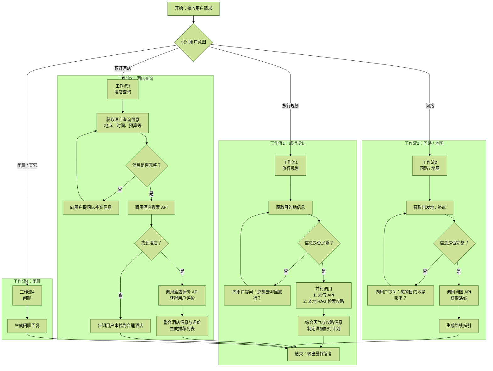

# 【第四周】秋招必杀项目 - Functioncall 微调系列（业务背景）

## 前言

我们希望这个项目带给你的，不仅仅是几行写在简历里面的文字，也不仅仅是面试时候的生硬表达，而是给你带来一段有血有肉的经历和故事。

在这段独一无二的旅程中，我们将与你并肩探索，从根源上解决真实场景中的复杂问题：

- 核心探索一：多轮对话的微调艺术
  - 我们将深入剖析并实践不同的微调策略，让你游刃有余地处理复杂的对话场景。
- 核心探索二：连续工具链的调用
  - 学习如何让模型精准、连续地调用外部工具，解锁模型的应用边界，实现复杂任务的自动化。
- 核心探索三：不平衡样本的处理方案
  - 掌握在数据不完美的情况下，依旧能训练出鲁棒、高性能模型的关键策略。
- 核心探索四：数据工程的创新实践
  - 你将学会如何利用数据沙盒技术，高效、安全地构造高质量的训练数据。
- 核心探索五：工业级工作流与评估体系
  - 我们将带你将微调后的模型无缝对接到整个 MCP（Model-Controller-Pipeline）工作流中【下周】，并建立一套系统性的评估标准，真正做到对模型效果负责。

这不是一蹴而就的“速成”，而是一场循序渐进的修炼。我们不会直接把答案塞给你，而是会带着你：

- 如何定位问题
- 如何策略性地思考解决路径
- 如何选择合适的方法并迭代验证

每一步，你都能看到清晰的思路、实用的工具和可复现的过程。

最终成果，你将亲手将 Qwen3-0.6B 这个模型，从一个基础模型（端到端任务完成准确率不足 30%），锻造为一个兼具多轮对话、工具链式调用和高质量文本生成能力的强大领域模型（端到端任务完成率 95% 以上）。

这段学习，不仅会成为你履历上的亮点，更会是一段属于你的独一无二的 AI 实战旅程。

---

## 旅行助手 Agent：设计与工作流程文档

## 1. 项目背景与目标

### 1.1 项目背景

随着大型语言模型（LLM）能力的飞速发展，能够与用户进行自然语言交互，并能调用外部工具以完成复杂任务的智能代理（Agent）已成为前沿研究与应用的热点。传统的聊天机器人往往局限于固定的知识库或简单的问答，而现代 Agent 则追求更深层次的理解、推理和行动能力。

本课程旨在通过一个真实且功能强大的“旅行助手 Agent”案例，系统性地讲解和实践如何构建一个支持：

- 多轮对话
- 具备链式工具调用
- 多分支逻辑判断能力

的复杂 Agent。

### 1.2 设计目标

我们旨在设计一个能够模拟真人旅行顾问的智能 Agent，它不仅能回答简单问题，更能主动引导对话、整合多方信息，并为用户创建个性化的旅行方案。其核心目标包括：

- 情景感知：能够理解用户在不同旅行规划阶段（如：酒店查询、问路、RAG 检索、查询天气）的需求。
- 主动引导：在用户信息不足时，能够主动提问，补全任务所需关键信息。
- 工具协同：能够根据任务需要，有序地调用一系列不同功能的工具（如：酒店查询、目标酒店评论查询）。
- 信息整合与生成：能够将从不同工具获取的信息进行分析、整合，并生成结构化、人性化的内容（如：完整的旅行计划）。

## 2. 核心技术理念

该 Agent 的设计基于以下三个核心技术理念：

- 多轮对话（Multi-turn Dialogue）：Agent 的智能体现在它能够记忆和理解上下文。它通过与用户的连续多轮交流，逐步澄清意图、收集必要信息，而非要求用户一次性提供所有条件。
- 链式工具调用（Chained Tool Calls）：复杂任务往往无法通过单次工具调用完成。Agent 具备将任务拆解，并按逻辑顺序调用一系列工具的能力。其中，上一个工具的输出可以作为下一个工具的输入，形成一条“思维链”或“工具链”。
- 多分支逻辑（Branching Logic）：Agent 具备基础的决策能力。它能根据用户的回答或工具返回的结果，选择不同的执行路径。例如，查询到航班则进入预订流程；未查询到则向用户提出替代建议。

## 3. Agent 整体系统架构

Agent 的工作流程始于接收用户请求，首先对用户意图进行分类，然后分发到四个主要的工作流之一进行处理。所有工作流最终将结果汇总，生成统一的最终答复。



## 4. 详细工作流分析

```text
# 高德获取 api_key，做路径规划
https://lbs.amap.com/api/webservice/summary

# 如风云天气 api_key，做天气预报
https://dev.qweather.com/docs/api/weather/weather-daily-forecast/

# 酒店工具
https://open.alitrip.com/businessDetail.htm?tagId=88

也可以不注册
```

### 工作流 1：智能旅行规划（Intelligent Travel Planning）

- 触发：用户有明确的旅行目的地，并希望获得一份详细的行程计划。
- 目标：结合本地知识库 RAG（旅行攻略）和实时天气信息，为用户创建一份智能、合理且个性化的旅行计划。
- 关键工具：`weather_api`、`local_rag_search`
- 流程演练：
  1. 用户：“国庆节我想去西安玩 5 天，能帮我规划一下吗？”
  2. Agent（内部）：主模型识别到用户的意图是“旅行规划”，并直接从对话中提取出关键参数 `{destination: "西安", duration: "5天", time: "国庆节"}`。
  3. Agent（判断）：参数足够，决定调用工具。
  4. Agent（并行调用工具）：Agent 同时发起两个工具调用：
     - `[Agent calls tool: weather_api(city="西安", date_range="国庆节")]` -> 返回结果：国庆期间西安天气晴好，但第 3 天有 70% 概率降雨。
     - `[Agent calls tool: local_rag_search(query="西安5日游攻略", "西安室内景点", "西安美食推荐")]` -> 从本地知识库中检索到兵马俑、城墙、大唐不夜城等必游景点，以及陕西历史博物馆等适合雨天的室内选择。
  5. Agent（综合与生成）：Agent 收到两个工具返回的信息后，在其内部进行智能化的综合与编排。它会将对天气敏感的户外活动（如骑行城墙）安排在晴天，并将室内活动（陕西历史博物馆）特意安排在预测下雨的第 3 天。
  6. Agent（最终输出）：

```text
好的，已为您定制了一份西安 5 日深度游计划！

特别提示：根据天气预报，您旅行的第 3 天可能会下雨，所以我特意为您安排了精彩的室内行程。

Day 1：古都初印象
- 下午抵达西安，入住钟楼附近酒店。
- 傍晚游览钟鼓楼，然后去回民街品尝羊肉泡馍、肉夹馍。

Day 2：探寻秦汉雄风
- 上午：前往临潼，参观世界第八大奇迹【秦始皇兵马俑】。
- 下午：返回市区，骑行或漫步【古城墙】，感受历史脉搏。

Day 3：雨中文物巡礼（室内行程）
- 上午：参观馆藏丰富的【陕西历史博物馆】（请务必提前预约！）。

...（后续行程）...
```

### 工作流 2：路线导航（Route Navigation）

- 触发：用户提出明确的问路需求，询问从 A 地到 B 地的路线。
- 目标：调用地图服务，为用户提供清晰、准确的路线指引。
- 关键工具：`map_api`
- 流程演练：
  1. 用户：“我现在在北京三里屯，想去故宫，怎么走最方便？”
  2. Agent（内部）：主模型识别意图为“问路”，并提取出参数 `{origin: "三里屯", destination: "故宫", preference: "最方便"}`。
  3. Agent（判断）：参数明确，可以直接调用地图工具。
  4. Agent（调用工具）：`[Agent calls tool: map_api(origin="三里屯", destination="故宫", mode="convenience")]`。
  5. Agent（格式化输出）：`map_api` 返回了结构化的路线数据（如地铁线路、站点、换乘信息、预计时间等）。Agent 将这些数据处理成易于理解的自然语言。

Agent：

```text
从三里屯到故宫，最方便的方式是乘坐地铁，可以有效避开地面拥堵。

推荐路线如下：
1. 从您附近团结湖站上车，乘坐地铁 10 号线（外环方向），坐 3 站到呼家楼站。
2. 在呼家楼站，换乘地铁 6 号线（往海淀五路居方向），坐 4 站到南锣鼓巷站。
3. 从南锣鼓巷站 E 口出站，向南步行约 1.2 公里即可到达故宫博物院。

整个行程大约需要 45 分钟。您看这个路线可以吗？
```

### 工作流 3：酒店预订（Hotel Booking）

- 触发：用户提出寻找住宿、预订酒店的需求。
- 目标：结合酒店基本信息（价格、位置）和真实的用户评价，为用户提供综合性的住宿推荐。
- 关键工具：`search_hotels_api`、`get_hotel_reviews_api`
- 流程演练：
  1. 用户：“帮我在上海外滩附近找个景观好的酒店。”
  2. Agent（内部）：主模型识别到“订酒店”意图，并提取出 `{location: "上海外滩", preference: "景观好"}`。
  3. Agent（判断）：缺少预订所需的必要信息（日期、预算）。
  4. Agent（多轮对话）：“好的。请问您的入住和离店日期是什么时候？以及您的预算大概是多少一晚？”
  5. 用户：“就下周五入住，住两晚，预算 2000 以内。”
  6. Agent（内部）：主模型补全了所有必要参数，开始按逻辑顺序调用工具：
     - 第一步：调用酒店搜索工具。
       - `[Agent calls tool: search_hotels_api(location="上海外滩", check_in="下周五", nights=2, max_price=2000)]` -> 工具返回了 3 家符合条件的酒店列表：和平饭店、上海外滩 W 酒店、上海半岛酒店。
     - 第二步：Agent 遍历上一步返回的列表，为每家酒店调用评价工具。
       - `[Agent calls tool: get_hotel_reviews_api(hotel_name="和平饭店")]`
       - `[Agent calls tool: get_hotel_reviews_api(hotel_name="上海外滩W酒店")]`
       - `[Agent calls tool: get_hotel_reviews_api(hotel_name="上海半岛酒店")]`
  7. Agent（综合输出）：Agent 收集了所有工具的返回结果，并将酒店基础信息与评价摘要进行整合，生成一份有对比的推荐列表。

Agent：

```text
根据您的要求，为您找到了以下几家在外滩景观和口碑都极佳的酒店：

1. 和平饭店：历史感厚重，很多用户评价说它的江景房能直接看到东方明珠。价格约 1900 元 / 晚。
2. 上海外滩 W 酒店：设计非常现代，用户普遍称赞它的顶楼泳池视野无敌。价格约 1850 元 / 晚。

您对哪一家比较感兴趣？我可以为您查看具体的房型。
```

### 工作流 4：通用闲聊（General Chit-chat）

- 触发：用户的输入不属于任何具体的业务流程（如订票、问路、规划），例如情感表达、常识提问或开放式对话。
- 目标：提供流畅、自然、有同理心的对话，维持良好的用户互动体验，并保持旅行助手的身份认知。
- 关键工具：`llm_base_model`（大语言模型基座能力）
- 流程演练：
  - 场景一：开放式提问
    1. 用户：“你觉得旅行的意义是什么？”
    2. Agent（判断）：意图为开放式闲聊。
    3. Agent（内部）：调用基座模型生成回复。
    4. Agent（输出）：“对我来说，旅行就像是阅读一本立体的书，每一页都有不同的风景和故事。它能让我们暂时跳出日常，去认识更广阔的世界和更多元的自己。这也是我作为您的旅行助手，最希望帮您实现的体验。”
  - 场景二：情感互动
    1. 用户：“唉，最近工作好累，想出去散散心。”
    2. Agent（判断）：意图为情感表达，寻求安慰。
    3. Agent（内部）：调用基座模型，生成带有安抚和引导性的回复。
    4. Agent（输出）：“非常理解您的感受，辛苦了。适时地给自己放个假，去一个喜欢的地方充充电，确实是个很棒的主意。无论是去海边吹吹风，还是去山里走一走，都能让心情舒畅很多。如果您有想法，随时可以告诉我，我很乐意为您寻找一个能让您彻底放松的目的地。”

### 工作流 5：拒答闲聊（General Chit-chat）

实际工业化落地中一定有。

## 5. 在 Function Calling 课程中的应用

本案例设计贯穿整个课程，用于讲解：

1. 基础篇 - 单一工具调用：以工作流 1 为例，了解如何定义 `search_flights` 函数的 Schema，并构建单轮对话的训练数据，让模型学会在用户提供所有信息后，准确地调用该工具。
2. 进阶篇 - 多轮对话与信息补全：以工作流 2 为例，讲解如何让模型在关键信息缺失时，不调用工具，而是生成引导性的问题， 从而实现多轮对话的信息收集。
3. 高级篇 - 链式调用与复杂逻辑：以工作流 3 为例，展示 Agent 的高级能力。重点了解：
   - 如何设计一个需要多个工具协作才能完成的复杂任务。
   - 如何训练模型进行“思维链”，即决定调用工具的顺序（`recommend -> web_search -> create_plan`）。
   - 如何让模型利用 `web_search` 等工具获取外部知识，克服自身知识的局限性。
   - 如何将非结构化的搜索结果（文本片段）传递给下一个工具（`create_travel_plan`）进行结构化处理和内容生成。
4. 终结篇：让模型同时具有 123 的能力

### 5.1 Agent 工作流构建

1. Agent 工作流构建
   1. 工具定义
   2. 工作流串联
2. 数据构建
3. 微调
4. 评估

### 5.2 业务逻辑的梳理核心 2 句话

1. 定义整体的业务逻辑，多少个路由，每个路由的逻辑是什么。
2. 每个路由下的：工作流和组建是什么（工作流是灵魂，组件化是核心）【触发条件、目的、工具、实景演练】。
3. 第一件事：用 prompt 搭一个流程，把他 demo 跑起来。
4. 梳理每一个业务流的数据应该长什么样子。
5. 完成种子数据集的构建。

## 6. 代码运行方式

```text
1. rag-system/rag_api.py 启动 rag 服务（首先通过 requirements 安装环境）
2. generate_dataset.py 生成数据
3. convert_dataset_final_fixed.py 生成训练数据
4. run_train_last_assistant.sh 训练
5. inspect_qwen_dataset.py 看训练集 loss
6. test_qwen_infer.py 做快速测试
```

## OCR 不确定处

- 第 1 张图最右上方还有一行鼓励性提示语，截图只完整露出了最后一句，未纳入正文主结构。
- 第 2 张图左侧有一张较复杂的流程图，右侧给出了对应的 Mermaid 代码；正文以 Mermaid 为主表达，未保留原图裁剪。
- `工作流 5：拒答闲聊` 在当前截图中只露出标题和一句“实际工业化落地中一定有”，后续未展开，因此这里只按可见内容保留占位，不补写未展示的细节。
