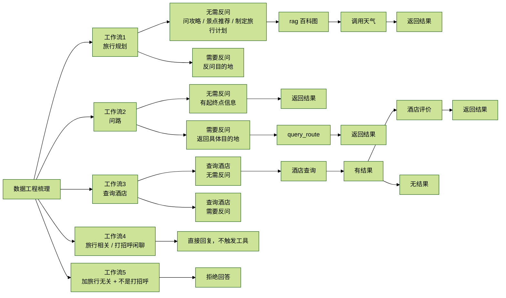

# 【第四周】秋招必杀项目 - Functioncall 微调系列（数据工程）

> 你怎么确保你的 SFT 数据能够微调出结果呢？
>
> 写测试集、找 badcase，还要有一套完备的数据标签，确保你在这个场景里面的 query 覆盖的全面性。

## 1. FC 的数据格式

先看一下 OpenAI 兼容的格式是怎么传入消息的：

```python
client = OpenAI(api_key, base_url)

completion = client.chat.completions.create(
    model=model_config["model_name"],
    messages=messages,
    stream=True
)

return completion....
```

再来看不同的链路 `messages` 格式。

### 1.1 普通的 `messages` 格式

```json
{
  "conversation": [
    {
      "role": "system",
      "content": "## 用户信息\n- 用户名：刘强\n- 当前城市ID：101250801\n- 出发日期：2025-09-18\n- 起点坐标：110.479921,29.127401\n\n请在处理用户请求时考虑这些信息...\n\n你是一个专业的旅行助手，严格按照以下工作流程处理用户请求：\n## 工作流1：旅行规划...\n## 工作流2：问路/地图导航...\n## 工作流3：酒店查询...\n## 工作流4：闲聊...\n## 重要原则：\n1. 信息不足时必须反问\n2. 一次只问一个关键信息，避免一次问太多\n3. 工具调用顺序很重要\n4. 酒店推荐流程必须先 recommend_hotels 再 get_hotel_reviews\n5. 非旅行相关问题要礼貌拒绝\n\n## 反问示例：\n- 请告诉我您想去哪个城市旅行？\n- 请问您计划什么时候出行？\n- 请问您要去哪里？\n- 请问您要在哪个城市找酒店？\n- 请问您的预算范围是多少？\n\n严格按照以上流程处理用户请求，确保信息完整后再调用相应工具。"
    },
    {
      "role": "user",
      "content": "如何学摄影？"
    },
    {
      "role": "assistant",
      "content": "抱歉，我是专门的旅行助手，只能回答旅行相关的问题。"
    }
  ]
}
```

这个格式代表的是：没有工具调用、只走普通问答路径的样本。

### 1.2 含有 function call 的调用格式

这里的关键变化是：`assistant` 不直接给文本，而是先给出 `tool_calls`；随后 `tool` 角色返回工具结果；最后 `assistant` 再整合输出。

```json
[
  {
    "role": "system",
    "content": "## 用户信息...\n## 工作流1：旅行规划...\n## 工作流2：问路/地图导航...\n## 工作流3：酒店查询...\n## 工作流4：闲聊...\n## 重要原则...\n## 反问示例..."
  },
  {
    "role": "user",
    "content": "希尔顿酒店的早餐怎么样？"
  },
  {
    "role": "assistant",
    "content": "",
    "tool_calls": [
      {
        "id": "call_89f10193",
        "type": "function",
        "function": {
          "name": "get_hotel_reviews",
          "arguments": "{\"hotel_name\": \"希尔顿酒店\"}"
        }
      }
    ]
  },
  {
    "role": "tool",
    "content": "希尔顿酒店的用户评价：\n\n评价1：评分 4/5，酒店位置很好，房间干净整洁，服务人员态度友好。早餐种类丰富，性价比不错。\n\n评价2：评分 5/5，商务设施齐全，会议室很专业，网络稳定。房间安静，适合工作和休息。\n\n",
    "tool_call_id": "call_89f10193"
  },
  {
    "role": "assistant",
    "content": "希尔顿酒店的早餐评价总体较好，有住客提到早餐种类丰富，性价比不错。此外，酒店的服务和设施也得到了较高的评价，适合商务和休闲旅客。如果您需要更具体的早餐信息或其他方面的详情，可以告诉我，我会尽力为您查询！"
  }
]
```

这轮结束之后，就触发了一轮工具调用。

### 1.3 含有并行调用的 function call 格式

这个例子演示的是：一次 `assistant` 响应中同时发起两个工具调用。

```json
[
  {
    "role": "system",
    "content": "## 用户信息...\n## 工作流1：旅行规划...\n## 工作流2：问路/地图导航...\n## 工作流3：酒店查询...\n## 工作流4：闲聊...\n## 重要原则..."
  },
  {
    "role": "user",
    "content": "听说河源很美，能帮我规划一下吗？"
  },
  {
    "role": "assistant",
    "content": "",
    "tool_calls": [
      {
        "id": "call_6eff8f96",
        "type": "function",
        "function": {
          "name": "search_travel_guide",
          "arguments": "{\"location\": \"河源\", \"search_mode\": \"hybrid\"}"
        }
      },
      {
        "id": "call_fa1b2318",
        "type": "function",
        "function": {
          "name": "get_weather_info",
          "arguments": "{\"location\": \"河源\", \"num_days\": 1, \"start_date\": \"2025-09-23\"}"
        }
      }
    ]
  },
  {
    "role": "tool",
    "content": "# 河源市旅游攻略...\n# 交通指南...\n# 住宿推荐...\n# 详细行程安排...",
    "tool_call_id": "call_6eff8f96"
  },
  {
    "role": "tool",
    "content": "天气信息（河源 - 2025-09-23 起1天）：\n第1天：白天晴，夜间阴，温度 12℃ ~ 20℃",
    "tool_call_id": "call_fa1b2318"
  },
  {
    "role": "assistant",
    "content": "根据您的需求，我为您规划了前往河源市的旅行计划。以下是详细信息：\n\n### 河源市1日游攻略\n- 出行日期：2025年9月23日（1天）\n- 天气情况：白天晴，夜间阴，温度 12℃ ~ 20℃\n- 详细行程安排...\n- 推荐美食...\n- 购物推荐...\n- 实用小贴士...\n- 预算参考..."
  }
]
```

### 1.4 含有链式调用的 function call 数据格式

这个例子演示的是：第一个工具结果出来之后，再触发第二个工具调用，最后再汇总。

```json
[
  {
    "role": "system",
    "content": "## 用户信息...\n## 工作流1：旅行规划...\n## 工作流2：问路/地图导航...\n## 工作流3：酒店查询...\n## 工作流4：闲聊...\n## 重要原则..."
  },
  {
    "role": "user",
    "content": "我要在武汉住酒店，预算200-300元"
  },
  {
    "role": "assistant",
    "content": "",
    "tool_calls": [
      {
        "id": "call_9e45f8c7",
        "type": "function",
        "function": {
          "name": "recommend_hotels",
          "arguments": "{\"requirements\": \"武汉，预算200-300元\"}"
        }
      }
    ]
  },
  {
    "role": "tool",
    "content": "根据您的需求，推荐以下酒店：\n\n酒店1：武汉江滩亚朵酒店\n位置：武汉市江岸区沿江大道159号\n",
    "tool_call_id": "call_9e45f8c7"
  },
  {
    "role": "assistant",
    "content": "",
    "tool_calls": [
      {
        "id": "call_8077ae20",
        "type": "function",
        "function": {
          "name": "get_hotel_reviews",
          "arguments": "{\"hotel_name\": \"武汉江滩亚朵酒店\"}"
        }
      }
    ]
  },
  {
    "role": "tool",
    "content": "武汉江滩亚朵酒店的用户评价：\n\n评价1：评分 4/5，酒店位置很好，房间干净整洁，服务人员态度友好，早餐种类丰富，性价比不错。\n\n评价2：评分 5/5，商务设施齐全，会议室很专业，网络稳定。房间安静，适合工作和休息。\n\n",
    "tool_call_id": "call_8077ae20"
  },
  {
    "role": "assistant",
    "content": "根据您的预算（200-300元）和需求，为您推荐以下酒店：\n\n### 武汉江滩亚朵酒店\n- 位置：武汉市江岸区沿江大道159号\n- 用户评价：位置优越、服务态度友好、早餐种类丰富、性价比不错、适合工作和休息\n\n这家酒店不仅地理位置优越，而且设施齐全，非常适合您的住宿需求。希望您在武汉的旅程愉快！"
  }
]
```

这里也埋了一个很关键的问题：上面的这些 `messages` 是怎么传入 LLM 的，最终传入 LLM 的长什么样？

---

## 2. 种子数据集构建

### 2.1 什么是种子数据集

这个数据集包含了你这个场景下几乎所有种类的用户 query 和返回信息类型。

你怎么确保你的 SFT 数据能够微调出结果呢？

- 构造黄金数据集
- 有一套完备的数据标签，确保你在这个场景里面的 query 覆盖的全面性

数据标签的作用是：通过数据标签对数据进行分类，确保在你的业务场景里，每一个子分类，都有足够的数据。

### 2.2 理清变量信息

需要先理清三类变量：

1. 用户画像
2. 不同标签体系下的用户 query
3. 不同标签体系下 tool 的调用结果

初步的种子数据集，一般是通过日志洗出来。

### 2.3 用户信息（自身记忆）

```text
用户名：string
用户所处城市：城市ID
出发日期：2025-09-15 ~ 2025-10-05
起点坐标：116.481028,39.989643
```

### 2.4 Router 梳理（额外变量）

这一层的重点不是“写代码”，而是先把所有路由和会触发分支的变量梳理清楚。



对应的数据量规划：

- 旅行规划（不需要反问）：400
- 旅行规划（需要反问）：50
- 问路（不需要反问）：100
- 问路（需要反问）：20
- 查询酒店（不需要反问）：200
- 查询酒店（需要反问）：40
- 旅行相关：100
- 拒答：100

数据集统计结果：

```text
==============================================
旅行规划（不需要反问）：400条
查询酒店（不需要反问）：200条
问路（不需要反问）：100条
拒答：100条
旅行相关：100条
旅行规划（需要反问）：50条
查询酒店（需要反问）：40条
问路（需要反问）：20条
==============================================
总计：1010条
```

#### 原始数据集（保留）

- 文件：`travel_assistant_dataset_20250914_112354.json`
- 总计：1010 条

#### 训练集（80%）

- 文件：`travel_assistant_train_dataset.json`
- 总计：808 条
- 旅行规划（不需要反问）：320 条
- 旅行规划（需要反问）：40 条
- 问路（不需要反问）：80 条
- 问路（需要反问）：16 条
- 查询酒店（不需要反问）：160 条
- 查询酒店（需要反问）：32 条
- 旅行相关：80 条
- 拒答：80 条

#### 测试集（20%）

- 文件：`travel_assistant_test_dataset.json`
- 总计：202 条
- 旅行规划（不需要反问）：80 条
- 旅行规划（需要反问）：10 条
- 问路（不需要反问）：20 条
- 问路（需要反问）：4 条
- 查询酒店（不需要反问）：40 条
- 查询酒店（需要反问）：8 条
- 旅行相关：20 条
- 拒答：20 条

#### 划分特点

1. 严格按比例：每个类型都精确按照 80:20 的比例划分。
2. 格式一致：训练集和测试集保持与原始数据集相同的 JSON 格式。
3. 原始数据保留：原始完整数据集文件保持不变。

### 2.5 这一步的核心和目的

核心：

- 定义非常详细的分支，以及导致分支的变量

目的：

- 确保你在这个场景里面的 query 覆盖的全面性
- 理解场景的变与不变

## 3. 数据增强和扩展

先看两个核心脚本：

- `generate_dataset.py`
- `convert_dataset_final_fixed.py`

---

## 4. 数据沙盒式构造 Pipeline 详解

### 第一阶段：种子数据生成（`generate_dataset.py`）

#### 4.1 沙盒环境设计

```python
class DatasetGenerator:
    def __init__(self):
        # 100个城市ID系统映射 - 模拟真实地理环境
        self.cities = {
            "101010100": {"name": "北京", "coord": "116.481028,39.989643"},
            ...
        }

        # 40个真实姓名池
        self.names = ["张伟", "李明", "王芳", ...]

        # 按城市分类的地标系统（5倍扩展）
        self.city_landmarks = {
            "北京": ["天安门", "故宫", ...],
            ...
        }
```

#### 4.2 多工作流数据构造

- 工作流1：旅行规划（400 + 50 条）
  - 不需要反问：直接提供目的地的问题
  - 需要反问：模糊意图需要补充信息
- 工作流2：问路导航（100 + 20 条）
- 工作流3：酒店查询（200 + 40 条）
- 工作流4：旅行闲聊（100 条）
- 工作流5：拒答（100 条）

#### 4.3 数据增强策略

```python
# 模板多样化
questions = [
    "我想去{}旅游，帮我制定旅行计划",
    "{}有什么好玩的景点推荐？",
    # 30种不同表达方式...
]

# 槽位扰动
city_id, coord = self.get_random_city_info()     # 随机城市
destination = random.choice(self.destination_names)  # 随机目的地
month = random.randint(1, 12)                    # 时间扰动
```

#### 4.4 并发生成与质量控制

```python
with ThreadPoolExecutor(max_workers=8) as executor:
    # 8线程并行生成，保证效率
    # 每个工作流独立生成，避免数据偏斜
```

### 第二阶段：对话格式转换（`convert_dataset_final_fixed.py`）

#### 4.5 Agent 实例化沙盒

```python
# 为每条数据创建独立的Agent实例
assistant = TravelAssistantFuncCall(
    user_name=item["用户名字"],
    user_city_id=item["用户所处城市"],
    travel_date_range=f"{item['出发日期']}~{item['出发日期']}",
    start_coordinates=item["起点坐标"]
)
```

#### 4.6 系统提示词注入

```python
user_info_text = f"""
## 用户信息
- 用户名：{item["用户名字"]}
- 当前城市ID：{item["用户所处城市"]}
- 出发日期：{item["出发日期"]}
- 起点坐标：{item["起点坐标"]}
"""

system_prompt = user_info_text + """
你是一个专业的旅行助手，严格按照以下工作流程处理用户请求：
## 工作流1：旅行规划...
## 工作流2：问路/地图导航...
## 工作流3：酒店查询...
"""
```

#### 4.7 工具调用链模拟

```python
def _process_tools_fixed(self, assistant, user_input, messages):
    # 避免重复调用的工具链管理
    tool_call_results = {}  # 去重机制

    def capture_tool_calls(function_name, arguments):
        call_key = f"{function_name}:{json.dumps(arguments, sort_keys=True)}"
        if call_key not in tool_call_results:
            result = original_call_function(function_name, arguments)
            # 存储调用结果，生成标准格式
```

#### 4.8 多轮对话构造

```python
# 标准对话格式
messages = [
    {"role": "system", "content": system_prompt},
    {"role": "user", "content": item["用户问题"]},
    {"role": "assistant", "content": "", "tool_calls": [...]},
    {"role": "tool", "content": result, "tool_call_id": call_id},
    {"role": "assistant", "content": final_response}
]

# 追问逻辑处理
if item["是否追问"] == "是":
    messages.append({"role": "user", "content": item["追问回答"]})
    # 继续工具调用链...
```

## 5. 核心技术亮点

### 5.1 沙盒式环境控制

- 地理环境：100 个真实城市 + 坐标系统
- 用户画像：40 个姓名 + 随机城市 + 时间范围
- 场景覆盖：5 大工作流 × 需要反问 / 不需要反问分支

### 5.2 数据增强的多层次策略

- 语义层面：30 种问法模板、同义词替换
- 槽位层面：城市、时间、预算、地点的组合扰动
- 交互层面：单轮 / 多轮 / 追问的对话模式

### 5.3 工具调用链的精细建模

- 顺序性：旅行规划必须先攻略后天气
- 依赖性：酒店推荐 -> 酒店评价的级联调用
- 容错性：工具失败时的优雅降级

### 5.4 质量控制机制

- 去重机制：避免重复工具调用
- 格式标准化：OpenAI function call 标准
- 并发控制：8 线程 + 进度条 + 批量保存

## 6. 总结：什么是“数据沙盒”

数据沙盒构造，本质上是在设计一个端到端数据生成 pipeline：

- 构建包含 100 城市 + 40 用户画像 + 5 大工作流的虚拟环境
- 通过模板多样化（30 种问法）、槽位扰动（城市 / 时间 / 预算组合）、交互模式变换（单轮 / 多轮 / 追问）等策略
- 从 1010 条种子数据扩展生成高质量训练集
- 实现工具调用链精准建模（顺序性 + 依赖性 + 容错性）
- 支持旅行规划 -> 攻略检索 -> 天气查询、酒店推荐 -> 评价获取等复杂调用序列

这种沙盒式方法的优势是：

- 可控性强
- 覆盖面广
- 质量可保证

### 6.1 数据沙盒的核心是什么？

1. 标签化体系
2. 通过可控性的工具，把原来端到端的数据增强和构造，转化为在其中某些变量的增强，更可控、数据质量更高；只对定义好的变量进行数据增强

## OCR 不确定处

- 第 1~5 张图中的 `system prompt` 与 `messages` 示例非常长，正文保留了其结构、关键字段、工作流约束和典型样例；重复的大段提示词未逐字全抄。
- 第 3~5 张图中的并行调用示例里，地名在截图中存在轻微识别歧义，正文按“并行调用 `search_travel_guide` + `get_weather_info`”的结构保留，不硬做细节脑补。
- 第 9 张图底部还能看到“简历表述优化”的后续标题开头，但当前批次未展示正文，因此未纳入本篇主体。
