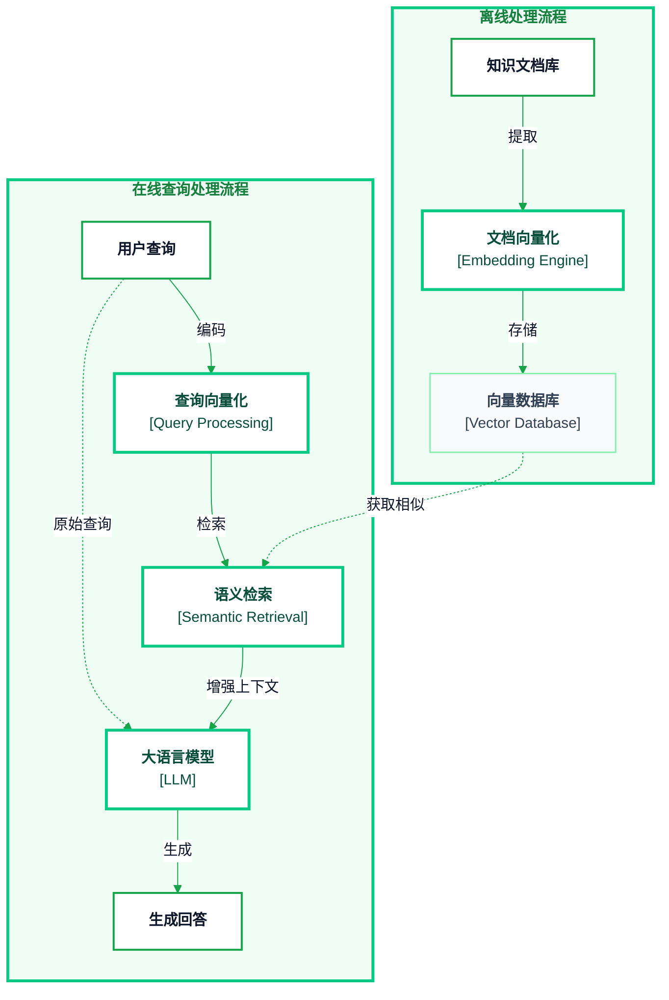
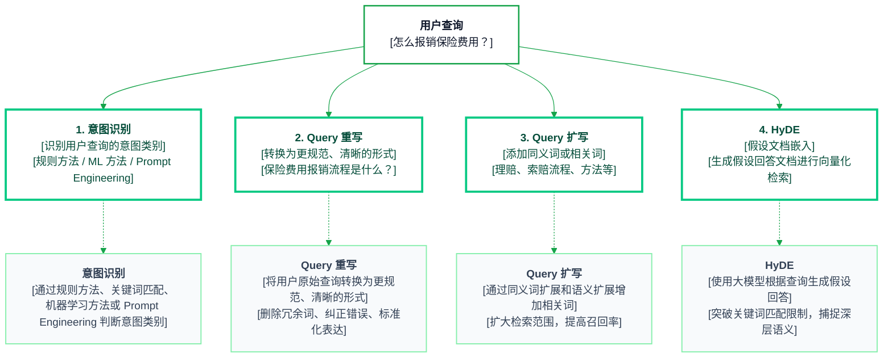
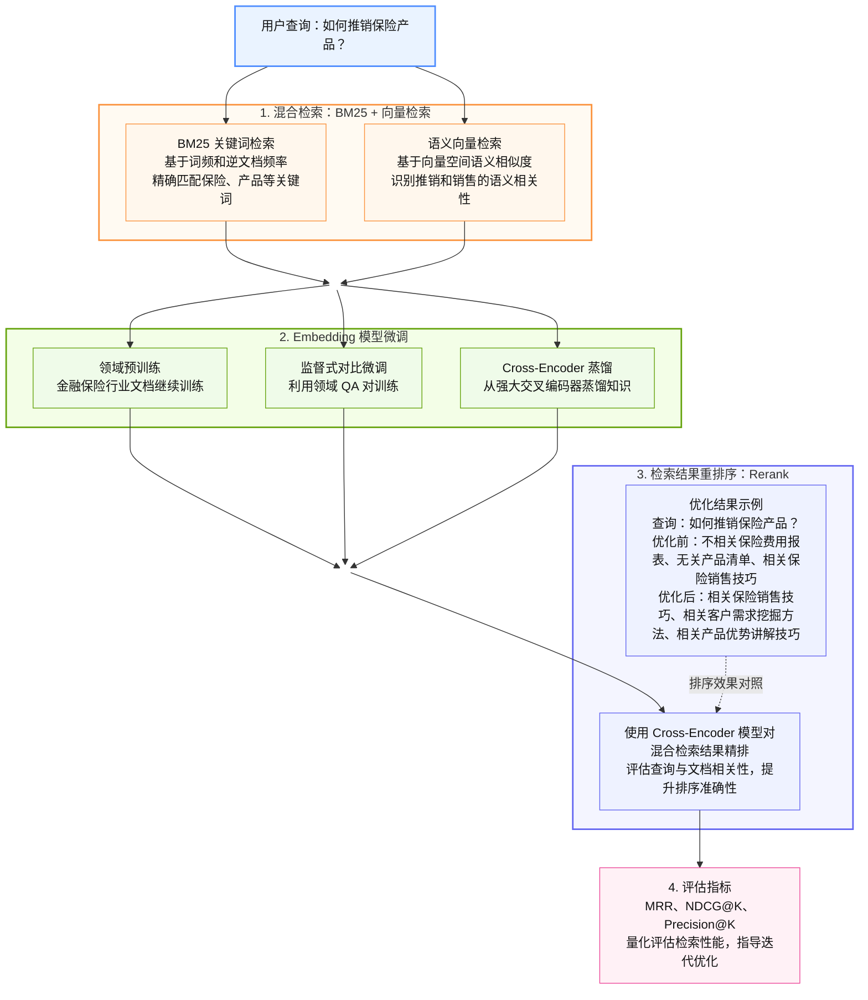

# 【RAG实战-第1天】RAG流程详解与优化方案：案例+代码+图解

> 😎 **一句话理解 RAG：**
>
> RAG 就像是 AI 的“开卷考试”模式：不必死记硬背所有知识，而是在需要回答问题（**用户 query**）时能翻阅自己的“参考书”（**知识库**）找到相关资料，然后用自己的语言组织回答。
>
> **难点：**
>
> 1. **离线知识库**：怎么构建知识库（企业或个人的知识都是各种格式、各种模态（文字、图片、表格）混杂的）
> 2. **在线检索**：query 怎么找到自己想要的知识，找准+找全
> 3. **在线生成**：拿到了知识怎么生成我们想要的内容
>
> **初期掌握目标：**
>
> 1. 掌握 2 阶段（检索、生成）3 模块（query、index、生成）的 **13 种常用优化方式以及什么场景下使用、怎么优化**
> 2. 能用 llamaindex 搭建一个一个自己的研报/论文阅读助手

> 🤔 **我们带入一个实际的场景去思考如何优化**
>
> **金融保险公司 RAG 问答系统**
>
> 1. 5000 分不同格式的文档，包含 **ppt、pdf、txt、视频、扫描图片等各种类型和模态的文件**
> 2. 用户 query 较为复杂，有基于公司制度（报销流程等）、销售策略、产品信息、市场情况等各类问题，需要走不同的链路
>
> 接下来，我们按照如下思路进行说明 **RAG 4 个核心模块（query、解析入库、召回、生成）** 优化方案：
>
> 1. 核心问题
> 2. 实际案例 case
> 3. 优化策略+手撕代码
> 4. 为什么这么做能解决

## 1. RAG 流程图解



### 1.1 整体流程

检索增强生成（RAG）系统是一种结合外部知识库与大语言模型的智能架构。该系统通过检索相关文档来增强生成模型的回答能力，使其能够提供更准确、及时和可靠的信息。

### 1.2 离线处理流程

离线处理是系统的准备阶段，主要完成知识库的建立与向量化：

1. **知识文档库**：系统首先需要建立一个包含各类文档、知识和信息的库，这是 RAG 系统的知识基础。
2. **文档向量化**：通过 Embedding 引擎将文本内容转换为高维向量，捕捉文本的语义信息。
3. **向量数据库**：存储所有文档的向量表示，并建立高效的检索索引，为后续的实时查询做准备。

**离线流程只需执行一次或定期更新，不参与用户的实时交互过程。**

### 1.3 在线查询处理流程

在线处理是系统的运行阶段，负责处理用户实时查询并生成回答：

1. **用户查询**：接收用户输入的问题或指令。
2. **查询向量化**：将用户查询转换为与文档相同向量空间的表示。
3. **语义检索**：在向量数据库中寻找与查询语义最相似的文档片段（解释在 notebook）。
4. **大语言模型**：将原始查询与检索到的相关文档结合，增强模型的上下文。
5. **生成回答**：模型基于**检索回来的背景知识**增强后的上下文生成最终回答返回给用户。

**在线流程对每个用户查询都会实时执行**，确保系统能够利用最新的知识库信息提供准确回答。

这两个流程相互配合，共同构成了 RAG 系统的完整工作机制，使大语言模型能够超越其训练数据的局限，提供**实时、准确、基于本地数据**的 QA 服务。

> 🟡 在实际工程中包含了非常多的策略优化，**RAG 核心优化在于 2 点：**
>
> 1. **用户 query 进来，能不能找到并且找全想要的背景知识？**
> 2. **找到了背景知识，能不能基于这个背景知识回答准确，并且支持多轮交互的语义转折？**

## 2. Query 模块



### 2.1 Query 模块

基于实际案例详细讲解 RAG Query 模块的四个优化方法，包括意图识别、Query 重写、Query 扩写、HYDE 优化。

- **意图识别（Intent Recognition）**：规则方法、ML 方法、Prompt Engineering 方法的示例及优化方案。
- **Query 重写（Query Rewrite）**：如何改进用户输入，提高检索准确率，附带代码示例。
- **Query 扩写（Query Expansion）**：基于同义词扩展、语义扩展等优化策略，并提供代码。
- **HyDE（Hypothetical Document Embeddings）**：使用 LLM 生成假设文档的优化策略及示例代码。

针对金融保险领域的 RAG（Retrieval-Augmented Generation）问答系统的查询模块，可以从**意图识别、Query 重写、Query 扩写和 HyDE** 四个方面进行优化。下面分别介绍每种策略的原理、优势，并提供相应的代码示例。

#### 2.1 意图识别（Intent Recognition）

意图识别旨在判断用户查询的意图类别，从而采用不同的检索或回答策略。例如，需要区分用户是在访问**报销流程**还是在寻求**保险产品销售技巧**。我们可以采用以下三种方法进行意图分类：

##### 2.1.1 基于规则的方法（Rule-based Intent Recognition）

**方法说明**：使用预先定义的关键词或模式来判断意图。根据领域知识，列出与各类意图相关的关键词集合，匹配用户 query 中出现的词来分类。此方法实现简单直接，对已知意图效果好。缺点是对未包含的表达方式鲁棒性差，需要人工维护规则库。

- **案例**：如果用户 query 中包含“**报销**”“**费用**”等关键词，判定为**报销流程查询**；如果包含“**销售**”“**技巧**”等词，判定为**保险产品销售技巧**。
- **代码示例**：下面代码通过关键词匹配实现简单的意图分类：

```python
def classify_intent_rule(query: str) -> str:
    query = query.lower()  # 统一小写处理（如适用英文，此处对中文影响可忽略）
    # 定义关键词列表
    intent_keywords = {
        "报销流程查询": ["报销", "费用", "报销流程"],
        "保险产品销售技巧": ["卖保险", "销售", "技巧", "销售技巧"],
    }
    for intent, keywords in intent_keywords.items():
        if any(keyword in query for keyword in keywords):
            return intent
    return "未知意图"

# 测试
queries = ["怎么报销保险费用？", "新人怎么提升保险产品销售技巧？", "保险理赔需要哪些材料？"]
for q in queries:
    print(q, "-->", classify_intent_rule(q))
```

上述函数会将“怎么报销保险费用？”识别为“报销流程查询”，“新人怎么提升保险产品销售技巧？”识别为“保险产品销售技巧”。如果查询不包含已知关键词，则返回“未知意图”。

##### 2.1.2 基于机器学习的方法（BERT 分类模型）

- **方法说明**：利用机器学习/深度学习模型（例如 BERT）进行意图分类。先构造包含各种意图类别的训练数据，对模型进行 fine-tune，使其学会根据句子语义分类。相比规则方法，ML 模型对同义表达更鲁棒，能捕获上下文语义特征。缺点是需要标注数据进行训练。
- **案例**：通过收集大量**报销流程**类询问和**销售技巧**类询问（以及其他意图类别的询问），用预训练的中文 BERT 模型 fine-tune 一个分类器。训练完成后，模型能够根据用户输入判定所属意图类别。
- **代码示例**：下面示例展示如何加载一个训练好的 BERT 分类模型并对新的查询进行预测（假设我们已将意图类别编号 0=报销流程查询，1=保险产品销售技巧）：

```python
from transformers import AutoTokenizer, AutoModelForSequenceClassification

# 加载已训练好的中文 BERT 意图分类模型
tokenizer = AutoTokenizer.from_pretrained("bert-base-chinese")
model = AutoModelForSequenceClassification.from_pretrained("./fine_tuned_intent_model")  # 本地路径

id2label = {0: "报销流程查询", 1: "保险产品销售技巧"}  # 意图 ID 到标签的映射

# 对用户查询进行分类
query = "怎么报销保险费用？"
inputs = tokenizer(query, return_tensors="pt")
outputs = model(**inputs)
pred_id = int(outputs.logits.argmax(dim=1))
pred_intent = id2label[pred_id]
print(f"查询：{query} -> 意图类别：{pred_intent}")
```

在上述代码中，我们加载了 `bert-base-chinese` 预训练模型并使用已微调的参数（`fine_tuned_intent_model` 目录）。`id2label` 字典定义了模型输出与意图标签的对应关系。对输入句子进行 Tokenize 后喂给模型，通过 `argmax` 获取预测的意图类别。对于输入“怎么报销保险费用？”，模型若输出类别 0，则映射为“报销流程查询”。

> ⚠️ **提示**：实际应用中需先准备标注数据并训练模型。这可以使用 Transformers 提供的 `Trainer` 接口或 TensorFlow/Keras 等完成，对 BERT 模型在意图分类数据集上进行 fine-tune，使其学会区分多种意图。

##### 2.1.3 基于 Prompt Engineering 的方法（LLM Zero-shot/Few-shot）

- **方法说明**：借助大型语言模型（LLM）的强大语义理解能力，通过精心设计的 Prompt 直接让模型判断意图类别。我们可以提供若干意图类别描述，让模型选择最适合的类别。此方法不需要额外训练数据，在零样本或少样本场景下效果好。需要注意控制提示，避免模型产生偏差。
- **案例**：对于用户问题，设计 Prompt 提示 ChatGPT 或类似模型：“请判断用户意图属于以下哪一类：1）报销流程查询，2）保险产品销售技巧。”模型将基于理解输出类别编号或名称。
- **代码示例**：下面以 OpenAI 的 ChatGPT API 为例，通过构造对话消息让模型进行意图分类：

```python
import openai

openai.api_key = "YOUR_API_KEY"  # 设置 API 密钥

def classify_intent_llm(query: str) -> str:
    system_prompt = (
        "你是一个智能助手，帮助分类用户意图。可能的意图类别包括：\n"
        "1. 报销流程查询\n"
        "2. 保险产品销售技巧\n"
        "只回复序号1或2。"
    )
    user_prompt = f"用户问：{query}\n上述用户的意图属于哪个类别？"
    response = openai.ChatCompletion.create(
        model="gpt-3.5-turbo",
        messages=[
            {"role": "system", "content": system_prompt},
            {"role": "user", "content": user_prompt},
        ],
    )
    answer = response["choices"][0]["message"]["content"].strip()
    return "报销流程查询" if answer.startswith("1") else "保险产品销售技巧" if answer.startswith("2") else "未知"

# 测试 LLM 意图分类
print(classify_intent_llm("怎么报销保险费用？"))        # 预计输出 "报销流程查询"
print(classify_intent_llm("有哪些有效的保险产品销售技巧？"))  # 预计输出 "保险产品销售技巧"
```

上述代码向 ChatGPT 提供了系统提示，限定了意图类别选项，并将用户查询作为输入。模型返回“1”或“2”，然后我们映射回对应的意图名称。这样可以利用大模型的语言理解来完成意图识别，无需显式训练分类器。

> **小结**：意图识别模块可以采用规则、机器学习和 Prompt Engineering 等多种实现方式，各有优劣。实际系统中甚至可以组合使用：例如先用大模型粗分类意图，再用精细规则或模型验证，以提高准确率。

### 2.2 Query 重写（Query Rewrite）

**Query 重写**旨在将用户的原始查询转换为**更规范、清晰、利于检索**的形式。在金融保险场景中，用户提问可能包含口语化表达、错别字或模糊措辞。通过重写，我们可以提高检索的匹配度。主要技术包括**删除冗余词、纠正错误和标准化表述**。

- **作用**：消除用户查询与知识库文档表达之间的差异。例如，同义词替换、补全省略的上下文、将口语转为书面语等。
- **案例**：用户输入“怎么报销保险费用？”，这句提问口语化且不够正式。如果直接用来检索，可能匹配不到含有“报销流程”的文档。通过重写，我们可以将其转换为“保险费用报销流程是什么？”。重写后的 query 更贴近知识库中 FAQ 或文档的表述（例如许多指南文章标题会是“XX 流程是什么？”），从而提高检索准确率。

**重写策略举例：**

1. **删除口头词/多余成分**：去掉如“请问”、“一下”、“怎么”等口头语或多余词汇，只保留核心内容。
2. **纠正错别字和语法**：使用拼写检查或语法纠错工具修正用户输入中的错字、繁简混用或语序问题。例如将“理赔流程都有那些步骤”纠正为“理赔流程都有哪些步骤”。
3. **标准化术语**：将非正式表达转换为标准术语。例如“报销保险费用”可以调整为“保险费用报销”，添加“流程”等词使其更正式完整。
- **代码实现思路**：可采用简单的规则替换结合现有中文校对库。下面提供一个基于规则的 Query 重写示例代码，对特定句型进行转换：

```python
import re

def rewrite_query(query: str) -> str:
    # 1. 去除疑问口语用词
    fillers = ["请问", "一下", "呢", "啊", "吧"]
    for f in fillers:
        query = query.replace(f, "")
    query = query.strip()

    # 2. 将“怎么/XXX”改写为“XXX 是什么？”
    if query.startswith(("怎么", "怎样")):
        main_query = query[2:]  # 去掉开头的“怎么”/“怎样”
        # 如果以问号结尾则去掉问号，稍后统一加
        main_query = main_query.rstrip("？?!")
        # 示例中指定的短语调整：将“报销保险费用”改为“保险费用报销”
        if "报销保险费用" in main_query:
            main_query = main_query.replace("报销保险费用", "保险费用报销")
        # 若句尾缺少“流程”，根据上下文添加
        if main_query.endswith("报销") or main_query.endswith("费用"):
            main_query += "流程"
        # 添加结尾的问句形式
        query = main_query + "是什么"

    # 3. 确保以问号结尾
    query = query.rstrip("？?!") + "？"
    return query

# 测试重写函数
original_query = "怎么报销保险费用？"
rewritten_query = rewrite_query(original_query)
print("原始查询：", original_query)
print("重写后的查询：", rewritten_query)
```

运行结果：

```text
原始查询： 怎么报销保险费用？
重写后的查询： 保险费用报销流程是什么？
```

可以看到，函数按照规则完成了重写：去除了“怎么”，调整了语序并加入“流程”“是什么”等使句子更正式、更符合知识库文档标题的风格。

> **说明**：上述规则针对示例做了特定处理。在实际系统中，可扩展更多规则和词典。例如维护一个俗称 -> 正式术语的映射表，遇到俗称时替换为正式名称；或者利用中文文本纠错库（如 `pycorrector` 或 `HanLP`）检测并纠正错别字和语法错误。也可以使用大语言模型进行查询改写（Prompt 如：“将用户问题改写为专业术语表述”），让模型生成规范提问。

### 2.3 Query 扩写（Query Expansion）

**Query 扩写**通过为用户查询添加**同义词或相关词**，从而扩大检索范围、提高召回率。在保险业务场景下，不同表达可能指向相同概念，提前扩展这些表达有助于搜索到更多相关文档。扩写包括**同义词扩展**和**语义扩展**两种主要方式：

- **同义词扩展**：为查询中的关键词添加同义词、近义词或俗称。例如“理赔”和“索赔”在很多情况下意义接近，用户搜索“保险理赔”，我们可以扩展加入“保险索赔”一起检索；又如“车险”和“汽车保险”可以互相扩展。利用同义词词典或领域词库（如《同义词词林》或自建术语表）实现。
- **语义扩展**：添加与查询主题相关的其他词语，哪怕不属于严格同义词。例如针对“保险理赔”，可以联想扩展出“流程”“方法”“材料”等相关词，形成更全面的查询组合。语义扩展通常借助词向量相似度或知识图谱，发现找到语义相关度高的词语。
- **案例**：用户输入“保险理赔”，通过扩写可以形成查询集合：“保险理赔”、“保险理赔流程”、“保险索赔”、“保险索赔方法”等等。这样，无论文档中提到“理赔流程”还是使用了“索赔”一词，都有机会被检索到，提高了召回率。
- **代码示例**：以下用 Python 演示一个简单的同义词扩展流程。在真实系统中，我们可能对查询进行分词，然后对每个重要词扩展同义词，这里简化为对整个查询短语查找扩展：

```python
# 构建一个简单的同义词词典
synonym_dict = {
    "保险理赔": ["保险索赔", "理赔", "索赔流程", "理赔流程"],
    "理赔": ["索赔", "赔付"],
    # 其他词的同义词...
}

def expand_query(query: str) -> list[str]:
    expansions = set()
    # 如果查询短语本身在词典中
    if query in synonym_dict:
        expansions.update(synonym_dict[query])
    # 将查询拆分为词（简单按字符串，这里假设输入短语本身是一个词或固定短语）
    for term, syns in synonym_dict.items():
        if term in query:
            expansions.update(syns)
    # 加入原始查询本身
    expansions.add(query)
    return list(expansions)

# 测试查询扩展
query = "保险理赔"
expanded_queries = expand_query(query)
print("原始查询：", query)
print("扩展结果：", expanded_queries)
```

假设我们的同义词词典涵盖了“保险理赔”相关的词，上述代码可能输出：

```text
原始查询： 保险理赔
扩展结果： ['保险理赔', '保险索赔', '理赔流程', '索赔流程', '索赔', '理赔']
```

这些扩展词组可用于构造多个检索查询，把所有结果合并再进行后续排序。比如可以同时检索“保险理赔流程”和“保险索赔方法”，然后汇总结果。

> **进阶**：同义词扩展可以借助现有工具包，如 `chatopera/Synonyms` 提供了中文近义词词库，可直接调用获取某个词的近义词列表。另外，也可以使用向量检索的方法：将查询中的关键词通过词向量模型（如 Word2Vec、BERT 词嵌入等）寻找最近邻的几个词作为扩展。这属于语义扩展范畴，能发现一些规则库中没有但在语料中常见的相关词。扩展时需注意控制扩展词的质量，过多不相关扩展可能引入噪音。

### 2.4 HYDE（Hypothetical Document Embeddings）

**HyDE**（Hypothetical Document Embeddings）是一种利用大模型生成“假设文档”来改进语义检索的方法。简单来说，就是让 LLM 根据用户查询先生成一段**可能回答该查询的内容**，再将这段内容向量化，用于向量检索真实文档。这样做的直觉是：由模型生成的回答会包含与查询语义相关的词汇和信息，可以作为查询的丰富语义表示，从而找到那些没有直接关键词匹配但语义相关的文档。

> 😎 **工作原理**：HyDE 概括了三个步骤：首先使用一个生成式语言模型（如 GPT）根据输入查询生成一篇内容丰富的**假设性回答文档**（即使这个文档在知识库中并不存在）；然后将生成的假设文档输入编码器生成嵌入向量表示；最后利用该向量去检索知识库中与之**语义相关**的真实文档。

- **优势**：HyDE 能捕捉**查询的深层语义和意图**，突破字面关键词的局限。对于专业领域或长尾问句，直接基于关键词的匹配效果可能不佳，而通过生成一个“理想答案”再去搜索，能显著提高召回的相关性和丰富度。在没有大规模标注数据的情况下，HyDE 属于一种**零样本**的增强检索策略；对垂直领域（金融、医疗等）的长尾问题尤其有效。
- **案例**：用户查询“保险销售技巧”。传统检索可能只针对“销售”或“技巧”检索，结果不一定全面。应用 HyDE 时，我们先让 LLM 根据这一查询生成一段假设回答，例如：“保险销售技巧包括了解客户需求、建立信任、提供专业建议、有效沟通和持续跟进”等等（模型生成的段落）。这段文字涵盖了销售技巧的多个要点。接着将此段落向量化，在知识库中进行向量相似搜索，就有更大概率找到涵盖这些要点的文档（即使其中未必逐字出现“保险销售技巧”这个短语）。检索到的可能是一些培训资料片段、营销技巧指南等，与查询语义相关的内容。
- **代码示例**：实现 HyDE 通常需要两个组件：**生成模型**和**向量检索**。下面提供一个伪代码式的示例流程：

```python
import openai
from sentence_transformers import SentenceTransformer

openai.api_key = "YOUR_API_KEY"

def hyde_retrieval(query: str, embed_model, doc_embeddings, doc_ids):
    # 1. 使用 LLM 生成假设文档
    prompt = f"请针对以下问题给出详细的回答：{query}"
    response = openai.ChatCompletion.create(
        model="gpt-3.5-turbo",
        messages=[{"role": "user", "content": prompt}],
    )
    hypo_doc = response["choices"][0]["message"]["content"]

    # 2. 将生成的文档进行向量化
    query_vector = embed_model.encode(hypo_doc)

    # 3. 在向量空间中检索相似文档
    # 这里假设已有知识库文档向量 doc_embeddings 和对应的 doc_ids 列表
    # 计算与所有文档向量的余弦相似度，并选取最高的若干
    import numpy as np
    sims = np.dot(doc_embeddings, query_vector)
    top_idx = sims.argsort()[-5:][::-1]  # 取前 5 个相似度最高的文档索引
    results = [(doc_ids[i], sims[i]) for i in top_idx]
    return results

# 初始化向量模型（例如中文多语言模型）
embed_model = SentenceTransformer("paraphrase-multilingual-MiniLM-L12-v2")

# 假设我们有预先计算好的文档向量和 IDs
doc_embeddings = ...  # shape: (N_docs, dim)
doc_ids = ...         # 文档 ID 或内容索引

# 对查询进行 HyDE 检索
query = "保险销售技巧"
retrieved_docs = hyde_retrieval(query, embed_model, doc_embeddings, doc_ids)
print("HyDE 检索结果文档 ID 及分数：", retrieved_docs)
```

上述代码描述了 HyDE 的关键步骤：

1. **生成假设文档**：使用 OpenAI ChatCompletion API，请求模型针对用户查询撰写答案段落。这里我们直接使用 `gpt-3.5-turbo` 作示例，实际可用任意强大的生成模型（包括本地部署的中文 GPT 模型）。
2. **向量化**：采用 `SentenceTransformer` 等嵌入模型将生成的文本编码为向量。这里示例用了一个多语言微调模型 `paraphrase-multilingual-MiniLM-L12-v2` 来得到句向量（假设已安装该模型）。在真实场景中，可以使用金融保险领域优化过的嵌入模型以获得更精确的向量表示。
3. **相似度检索**：将生成文本的向量与预先索引好的知识库文档向量逐一计算相似度（这里用点积近似余弦相似度，需保证向量已归一化）。取相似度最高的若干文档作为检索结果返回。

通过上述流程，我们利用 HyDE 方法将用户查询扩展为一份“语义丰富”的假想文档，再用它去搜索，能够找到更多与查询相关的内容。在实际系统中，这些检索出的候选文档接下来可以送入 RAG 流水线，与原始查询一起用于生成最终答案。

结合以上 4 种方法，针对金融保险公司的知识库问答系统，我们可以综合运用**意图识别、Query 重写、Query 扩写和 HyDE** 四种策略优化查询处理模块。意图识别确保理解用户需求，Query 重写和扩写提高检索命中率，HyDE 则进一步增强语义匹配能力。通过示例代码演示，这些方法可以落地实现，从而让问答系统更精准地找到用户所需的答案。

## 3. 离线解析模块

```mermaid
%%{init: {
  "theme": "base",
  "flowchart": {
    "curve": "basis",
    "htmlLabels": true,
    "nodeSpacing": 42,
    "rankSpacing": 64,
    "padding": 18
  },
  "themeVariables": {
    "background": "#FFFFFF",
    "mainBkg": "#FFFFFF",
    "primaryColor": "#FFFFFF",
    "primaryTextColor": "#0F172A",
    "primaryBorderColor": "#16A34A",
    "lineColor": "#16A34A",
    "clusterBkg": "#F0FDF4",
    "clusterBorder": "#07C983",
    "fontFamily": "Inter, ui-sans-serif, system-ui",
    "fontSize": "15px"
  }
}}%%
flowchart TD
  Input["<b>多格式文档输入</b><br/>[PDF / PPT / TXT / 视频 / 图片 / 表格]"]

  subgraph Parse["<b>第一阶段：统一文档解析</b>"]
    direction LR
    PDF["<b>PDF 解析</b><br/>[文本层提取]<br/>[扫描 PDF 专用 OCR]<br/>[表格专用处理]"]
    PPT["<b>PPT 文本解析</b><br/>[幻灯片标题/内容分离]<br/>[项目符号和列表保持]<br/>[文本格式保留]"]
    Video["<b>视频/语音解析</b><br/>[语音识别提取字幕]<br/>[时间戳切分]<br/>[内容合并分段]"]
  end

  subgraph Chunk["<b>第二阶段：智能 Chunk 切分</b>"]
    direction LR
    RuleChunk["<b>规则切分</b><br/>[基于章节、段落等自然边界]<br/>[表格/代码块作为整体处理]<br/>[基于标题识别文档层级结构]"]
    SemanticChunk["<b>语义切分</b><br/>[检测相邻内容的语义连贯性]<br/>[合并跨页内容]<br/>[控制 Chunk 长度并保持内容完整性]"]
  end

  subgraph Metadata["<b>第三阶段：层级结构与标签管理</b>"]
    direction LR
    Hierarchy["<b>章节层级标签</b><br/>[维护层级结构树]<br/>[Chunk 附带上级标题路径]<br/>[例：总则 > 范围]"]
    Category["<b>内容类别标签</b><br/>[标记内容类型：表格/代码/文本]<br/>[添加业务分类]<br/>[特殊格式保留标记]"]
    Sample["<b>Chunk 示例</b><br/>[内容：差旅报销的上限是...]<br/>[元数据：层级、类型、来源]"]
  end

  Result["<b>优化结果</b><br/>[高质量语义完整 Chunk]<br/>[结构化元数据]<br/>[提高检索准确性]"]

  Input --> Parse --> Chunk --> Metadata --> Result

  classDef entry fill:#FFFFFF,stroke:#16A34A,stroke-width:2px,color:#0F172A;
  classDef core fill:#FFFFFF,stroke:#07C983,stroke-width:3px,color:#064E3B;
  classDef aux fill:#F8FAFC,stroke:#86EFAC,stroke-width:1.5px,color:#334155;
  classDef output fill:#FFFFFF,stroke:#16A34A,stroke-width:2px,color:#0F172A;

  class Input entry;
  class PDF,PPT,Video,RuleChunk,SemanticChunk,Hierarchy,Category,Sample core;
  class Result output;
  style Parse fill:#F0FDF4,stroke:#07C983,stroke-width:3px,color:#15803D
  style Chunk fill:#F0FDF4,stroke:#07C983,stroke-width:3px,color:#15803D
  style Metadata fill:#F0FDF4,stroke:#07C983,stroke-width:3px,color:#15803D
```



### 3.1 核心问题

- **多格式文档解析挑战**：金融保险公司的知识库包含 PPT、PDF、纯文本甚至视频等多种格式。这些格式结构各异，需要统一解析。例如，PDF 可能有多栏排版或扫描版（无文本层），PPT 通常以幻灯片形态组织，视频需要语音识别提取文本。解析不当会导致内容丢失或错乱，影响后续检索。
- **OCR 解析质量**：针对扫描版 PDF 或图片，必须通过 OCR 获取文字。普通 OCR 往往难以正确还原表格、代码块等特殊结构，可能将表格内容串行成无序文本、破坏代码的格式，从而降低检索准确性。需要优化 OCR 策略，对表格和代码段做特殊处理，确保文本提取高保真。
- **Chunk 切分策略**：简单按固定长度切分可能造成信息割裂（例如将一段逻辑完整的内容拆开），或将跨页连续的内容分散开来，导致查询时相关片段无法一起召回。因此需要结合**规则**（如根据段落、章节标题等自然边界）和**语义**（根据内容主题连贯性）来切分 Chunk，避免将紧密相关的信息拆开，并能识别跨页的连续内容进行合并。
- **层级结构保持**：文档往往有层次结构（章节、子章节、要点等）。如果分块时丢失了层级和上下文关联，子内容可能在检索时缺乏上文语境，影响相关性。需在分块时保留层级信息，例如将小节内容与所属上级标题关联，作为标签元数据。这有助于在检索阶段利用上下文提高召回的准确度，让片段携带其来源的主题语境。

### 3.2 实际案例

> 😎
>
> - **案例 1：报销制度类查询**：例如用户询问“差旅报销的上限是多少？”。公司内部的报销制度可能是 PDF 扫描件，包含分级标题和表格（各费用类别的报销上限）。通过优化解析，我们对扫描 PDF 进行 OCR 并准确提取表格内容，将“差旅报销”章节下的文字和限额表格作为一个完整 Chunk，并标签其上级章节“报销政策 > 差旅报销”。这样，当用户查询时，系统能准确召回包含“差旅报销”限额的片段，避免因页面跳转或表格解析错误导致召回不全。
> - **案例 2：保险推销策略查询**：例如用户询问“新人销售技巧有哪些？”。相应知识可能存在于培训 PPT 或录像中。我们通过解析 PPT 提取每页的标题和要点 bullet，在视频中通过语音识别获得字幕，并按讲解片段切分。然后根据幻灯片的层次结构（模块 -> 具体策略）给每个知识点 Chunk 打上标签。如此，查询“新人销售技巧”时，系统不仅检索到相关技巧要点，还因为 Chunk 附带了所属模块（如“销售培训 > 新人技巧”）等信息，提高了匹配的精准度，帮助召回更全面的策略要点。

### 3.3 优化策略

为解决以上问题，我们提出如下优化方案：

- **统一文档解析与 OCR 改进**：构建通用的解析模块，针对不同格式分别处理：
  - **PDF 解析**：优先使用文本层提取（如 pdfplumber 或 PyMuPDF 读取），保持读取顺序；对于扫描 PDF 或嵌入的图片，调用 OCR 引擎（如 Tesseract 或 PaddleOCR）。特别地，OCR 时针对表格区域采用专门处理（例如先检测表格边框或使用表格 OCR 算法），确保按单元格顺序输出文本；对于代码块图片，可设置 OCR 保持换行和空格格式。（**这里推荐 Marker 和 MinerU**）
  - **PPT 解析**：利用幻灯片结构提取标题和文本框内容。每页幻灯片输出时保留其标题，项目符号列表作为子内容。对于包含图片的幻灯片，可对图片执行 OCR（如截图后 OCR）以提取其中的文字说明。
  - **纯文本解析**：直接按行/段读取，识别格式中的特殊标记（例如 Markdown 的 `代码` 块或表格格式）加以处理。确保代码块保留缩进和换行，表格按行列分隔保存。
  - **视频解析**：先通过语音识别得到逐句字幕，再按时间戳或内容语义将字幕合并成段落。可以利用现有 ASR 工具获取准确的转录文本，并根据视频内容结构（章节或 PPT 同步内容）对转录文本分段。
- **智能 Chunk 切分（规则 + 语义融合）**：在得到完整文本后，按照文档的自然结构和语义连贯性进行分块：
  - **基于规则的切分**：利用文档格式特征，如章节标题、段落换行、列表项、表格边界等作为切分点。一旦检测到新的章节点或列表起始，就结束当前 Chunk 开启新 Chunk。对于表格和代码块，整段内容视为一个 Chunk，避免中途截断。
  - **语义连贯的调整**：在规则初切分后，检查相邻 Chunks 的内容连贯性。如果发现某 Chunk 过短且与前后段落语义上紧密相关（例如上一个 Chunk 以冒号结尾或内容未完结），则可以和相邻 Chunk 合并，确保信息完整。例如跨页的段落，如果下页开头并非新章标题，则应与前页末尾合并为同一 Chunk。再如表格跨越多页时，将各页片段合成为一个整体表格 Chunk。通过简单的 NLP 或 embedding 相似度检测，也可判断段落主题是否延续，辅助决定是否合并或继续切分。
  - **长度和平衡**：在保证语义完整的前提下控制 Chunk 长度，使其适合向量检索和后续模型处理（例如不超过 512 字或一定 token 数）。过长则适当按语义次级节点再拆分，过短则与相邻补充。最终每个 Chunk 都应是自含意义明确的一段内容。
- **层级结构与标签管理**：为每个 Chunk 附加丰富的元数据标签，保留其在原文档中的位置和语境：
  - **章节层级标签**：在解析阶段捕获文档的层次结构（例如章节编号/标题、二级标题等）。实现方式可以是依据格式（PPT 的标题框、PDF 文本的字体大小/序号）识别标题行，并维护一个层级栈。例如检测到“1 总则”属于一级标题，“1.1 范围”属于二级标题等。分块时，将当前 Chunk 所属的所有上级标题作为一个层级列表存入标签。如止每个 Chunk 都带有类似“总则 > 范围”的层级路径。检索时可以将这些标题一起参与索引，提高召回率（例如用户搜索某章节名时也能匹配相关 Chunk）。
  - **内容类别标签**：标注 Chunk 的内容类型和主题类别。例如标记 Chunk 是否为“表格”、“代码块”或普通文本，“政策条例”还是“操作指南”等。这可通过解析时的内容特征判断（如检测到多列文本则标记表格，包含代码格式则标记代码段）。也可以结合业务定义的类别（如财务制度、销售策略）作为标签。这些标签在检索时可用于过滤或作为额外特征提高准确匹配度。
  - **引用与来源**：每个 Chunk 还应记录来源文档名、页码或幻灯片编号等，以便命中后追溯原文。同时这些信息可在生成答案时用于引用出处。

通过以上策略，**系统能够最大程度保留文档原有信息结构，避免因解析不当导致内容遗漏，并保证 Chunk 划分合理不割裂上下文。在检索时，丰富的上下文标签和高质量的 Chunk 内容可以显著提升召回的准确性，使相关片段更容易被查询命中。**

### 3.4 示例代码

下面给出一个 Python 示例代码，演示上述解析、切分和标签过程。该代码不依赖特定 RAG 框架，可直接运行（需安装 `PyMuPDF(fitz)` 用于 PDF 解析，`python-pptx` 用于 PPT 解析，`pytesseract` 用于 OCR，和 `PIL` 用于图像处理），直接处理一般直接使用 **MinerU** 或者 **deepDOC** 进行魔改：

```python
import fitz  # PyMuPDF for PDF
from pptx import Presentation  # python-pptx for PPT
from PIL import Image
import pytesseract
import re

def ocr_image(image):
    """OCR识别图像，返回文本字符串。"""
    # 使用简体中文+英文识别，配置可根据需要调整
    config = "--psm 6"  # 假设: 把图像看作一个统一块
    text = pytesseract.image_to_string(image, config=config, lang="chi_sim+eng")
    return text

def parse_document(file_path):
    """解析文档（PDF/PPT/文本），返回文本块列表，每块包含内容和类型等标记。"""
    blocks = []
    if file_path.lower().endswith(".pdf"):
        doc = fitz.open(file_path)
        for page in doc:
            # 尝试直接提取文本
            text = page.get_text("text")
            if text.strip():
                # 简单按换行拆分为块，可进一步按段落细分
                lines = text.splitlines()
            else:
                # 若无文本（扫描页），则 OCR 整个页面
                pix = page.get_pixmap(dpi=150)
                img = Image.frombytes("RGB", [pix.width, pix.height], pix.samples)
                ocr_text = ocr_image(img)
                lines = ocr_text.splitlines()
            # 将提取的行转换为块初步列表，标记来源页
            for line in lines:
                if line.strip() == "":
                    continue
                blocks.append({
                    "text": line.strip(),
                    "type": "text",  # 初始默认为普通文本，后续再调整类型
                    "page": page.number + 1,
                })
    elif file_path.lower().endswith(".pptx"):
        prs = Presentation(file_path)
        for idx, slide in enumerate(prs.slides, start=1):
            title = ""
            if slide.shapes.title:
                title = slide.shapes.title.text.strip()
                if title:
                    # 幻灯片标题作为单独块
                    blocks.append({
                        "text": title,
                        "type": "heading",
                        "level": 1,  # 幻灯片题目视为一级标题
                        "slide": idx,
                    })

            # 提取其他文本框
            for shape in slide.shapes:
                if not shape.has_text_frame or shape.text.strip() == "":
                    continue
                text = shape.text.strip()
                # 如果文本与标题相同或跳过（已添加）
                if title and text == title:
                    continue
                # 按换行将文本框内容拆成行块（对应子弹列表逐行）
                for line in text.splitlines():
                    if line.strip() == "":
                        continue
                    blocks.append({
                        "text": line.strip(),
                        "type": "text",
                        "slide": idx,
                    })
    elif file_path.lower().endswith(".txt"):
        with open(file_path, "r", encoding="utf-8") as f:
            for line in f:
                if line.strip():
                    blocks.append({
                        "text": line.strip(),
                        "type": "text",
                    })
    else:
        # 其他格式（如视频）：假设已转换为字幕文本
        # 这里直接读取同名的字幕文本文件
        subs_path = file_path + ".txt"
        try:
            with open(subs_path, "r", encoding="utf-8") as f:
                for line in f:
                    if line.strip():
                        blocks.append({
                            "text": line.strip(),
                            "type": "text",
                        })
        except FileNotFoundError:
            print("Unsupported file format or missing transcript:", file_path)
    return blocks

def split_and_tag_blocks(blocks):
    """根据内容将文本块切分、合并，并标注层级和类别标签。"""
    chunk_list = []
    hierarchy = []  # 用于跟踪当前层级标题栈
    current_chunk = {"text": "", "meta": {}}  # 临时聚合当前 chunk 内容

    for blk in blocks:
        text = blk["text"]
        blk_type = blk.get("type", "text")

        # 检测标题：根据内容格式判断
        is_heading = blk_type == "heading"
        level = blk.get("level", None)
        if not is_heading:
            # 简单规则：长度较短且以冒号结束，或符合编号模式的，视为标题
            if len(text) < 20 and (text.endswith(":") or text.endswith("：") or re.match(r"^[\d一二三]+[、.]", text)):
                is_heading = True
                # 确定层级 level（基于数字章节或者默认为 1 级）
                m = re.match(r"^(\d+(\.\d+)*)", text)
                if m:
                    level = m.group(1).count(".") + 1
                else:
                    level = 1
                blk_type = "heading"

        if is_heading:
            # 遇到新标题块，先结束上一 chunk
            if current_chunk["text"]:
                chunk_list.append(current_chunk)
                current_chunk = {"text": "", "meta": {}}

            # 更新层级栈
            if level is None:
                level = 1
            # 调整 hierarchy 列表长度
            if level - 1 < len(hierarchy):
                hierarchy = hierarchy[:level - 1]
            # 确保 hierarchy 长度足够
            while len(hierarchy) < level - 1:
                hierarchy.append("")
            # 设置当前级别标题
            if len(hierarchy) < level:
                hierarchy.append(text)
            else:
                hierarchy[level - 1] = text
            # 将标题本身作为一个 Chunk 的元数据存入层级，但内容不上屏检索
            # （可以选择是否将标题内容并入 chunk 文本，这里不直接作为内容）
            # 开始一个新的 chunk 上下文，继承层级 meta
            current_chunk["meta"]["section"] = " > ".join(hierarchy)
            current_chunk["meta"]["type"] = "text"  # 默认文本类型
            continue  # 不把标题行本身当做内容

        # 非标题块：
        # 检测表格行：根据是否包含制表符或对齐空格判断
        if re.search(r"\t", text) or re.search(r"\s{2,}", text):
            blk_type = "table"

        # 检测代码块：根据常见代码特征，如以 4 空格开头，或包含 {} 等（简单判断）
        if re.match(r"^\s{4}", text) or re.search(r"[{};]", text):
            blk_type = "code"

        # 如果当前 chunk 存在且本块类型与当前 chunk 类型不同，而且当前 chunk 不空，则开启新 chunk
        if current_chunk["text"] and current_chunk["meta"].get("type") != blk_type:
            # 结束之前的 chunk
            chunk_list.append(current_chunk)
            current_chunk = {"text": "", "meta": {}}
            # 设置 chunk 元数据（继承当前层级路径和类型）
            if "section" not in current_chunk["meta"]:
                current_chunk["meta"]["section"] = " > ".join(hierarchy) if hierarchy else ""
            current_chunk["meta"]["type"] = blk_type

        # 累加文本（表格和代码保持原格式，普通文本在块内加空格拼接）
        if blk_type == "text":
            if current_chunk["text"]:
                # 若当前已有内容，先检查语义连贯（比如前句末尾无句号，则直接接续）
                if current_chunk["text"].strip().endswith(tuple("。？！!?.")):
                    current_chunk["text"] += "\n" + text
                else:
                    current_chunk["text"] += " " + text  # 前一句未完，空格连接
            else:
                current_chunk["text"] = text
        else:
            # 表格或代码块，保持行为换行
            current_chunk["text"] += (text + "\n")

    # 循环结束后，将最后的 chunk 加入列表
    if current_chunk["text"]:
        chunk_list.append(current_chunk)
    return chunk_list

# 示例：调用解析和切分函数（文件路径需换成实际存在的文件）
file_path = "保险公司报销制度.pdf"
blocks = parse_document(file_path)
chunks = split_and_tag_blocks(blocks)

for ch in chunks:
    print(f"[{ch['meta'].get('section')}] ({ch['meta'].get('type')}) {ch['text'][:50]}...")
```

上述代码逻辑说明：首先 `parse_document` 根据文件类型提取文本块，对 **PDF** 逐页提取文本或 OCR，**PPT** 提取每张幻灯片的标题和文本内容，结果存入 `blocks` 列表。接着 `split_and_tag_blocks` 对这些文本块进行进一步处理：识别标题并维护 `hierarchy` 层级列表，遇到标题时更新层级并开始新的 Chunk；对于普通文本行，根据格式特征识别是否属于表格或代码，并设置相应类型。如果当前 Chunk 中的内容类型与新行类型不符（例如前面在记录表格，而下一行变为普通段落），则先截断前一个 Chunk 再新建。在组装文本时，对于普通文本段落，函数会检查前一句是否结束（通过句号、问号等判断），如果未结束则直接用空格连接，表示同一段；如果已经完整结束，则换行另起句，保持段落边界。表格和代码块则保持原有的换行结构加入。**每个 Chunk 最终都带有 meta 元数据**，包括层级路径 `section`（由 hierarchy 拼接）和内容 `type`（如 `"text"`、`"table"`、`"code"`）。

通过这种方式，**最终生成的 Chunk 列表中，每个 Chunk 都是一个语义完整的内容单元，并附带其在原文中的层级位置和类型标签**。在检索阶段，我们可以将 `section` 层级信息作为检索字段或将其前缀到文本中参与向量编码，使查询既能匹配 Chunk 内容本身，也能匹配其上级主题，从而提升召回的准确性。此外，表格和代码块未经破坏地保存在 Chunk 中，当用户提问涉及这些部分时，也能直接检索到正确的片段。这套优化流程提高了 RAG 问答系统对金融保险文档的解析质量和检索召回准确率。

## 4. 检索召回模块




**RAG 问答系统查询与 Chunk 匹配模块优化方案**

在金融保险公司的 RAG（Retrieval-Augmented Generation）问答系统中，我们需要提升查询（query）和文档片段（chunk）匹配模块的**召回率和准确率**。为此，可以从**混合检索、Embedding 模型微调、结果重排和评估指标**四个方向进行优化。下面针对每个优化点进行问题分析、结合金融保险场景的案例说明优化策略，并提供相应的代码示例。

### 4.1 case 分析

金融保险公司内部知识库包含 **5000** 份各类文档（PPT、PDF、文本、视频等），用户可能提出多样化的问题。例如：

- **流程型问题**：如「公司的报销制度是什么？」涉及公司内部流程或制度，需要在规章制度文档中找到准确答案。
- **思考型问题**：如「如何推销保险产品？」需要结合销售技巧和经验的指导，可能分散在培训资料或业务手册中。

当前 RAG 系统管线：首先将长文档依据语义和规则切分为较小的 **chunk** 段落，然后使用 BGE 预训练 Embedding 模型将查询和 chunk 向量化，利用 Milvus 向量库检索相似片段，并结合 BM25 关键词检索作辅助。存在的问题包括：

- 单纯向量检索对某些**短查询**（如只有几个关键词的问题）可能效果不佳，因为缺乏精确的关键词匹配。
- 未对 **Embedding 模型**进行领域优化，语义理解可能不到位，导致召回的 chunk 不够相关。
- 检索结果未经**重排序优化**，返回给生成模型的大多数文档片段相关度可能不够高。
- 缺乏**评估指标**来量化检索改进效果，无法客观比较不同方案的优劣。

为解决上述挑战，我们提出以下优化策略。

### 4.2 混合检索（BM25 + 向量）

**核心问题分析：**向量语义检索擅长捕捉语义相似度，能找到包含同义表述的相关文章，但可能忽略精确的关键词匹配；而 BM25 等传统关键词检索对匹配查询关键词的文档非常有效，尤其针对简短查询。然而 BM25 无法理解同义词或语义关联。在实际应用中，仅依靠单一检索技术往往不足以覆盖所有相关结果。混合检索通过结合稀疏向量（关键词）和稠密向量（语义）检索的优势，互补不足，提高召回率。特别地：

- **短查询（如只有几个词的问句）**往往需要关键词精确匹配才能找到正确文档，**BM25 对此效果更好**。
- **长查询**（描述详细、包含上下文的问题）更需要语义匹配，向量检索可识别同义表达，提高召回丰富度。

**案例场景：**用户询问「公司的报销制度」，这是一个短语式的流程问题，其中“报销制度”可能直接出现在某份制度文件标题或内容中。BM25 检索可以根据词频和逆文档频率高精度找到包含该词的文档。而对于「如何推销保险产品」这样的复杂问题，用户措辞可能与文档不完全一致，例如文档中讨论的是“如何销售保险产品”或“保险产品推广技巧”。BM25 由于不识别“推销”和“销售”的同义关系，可能错过相关文档；向量检索可以通过语义相似度将“推销保险产品”映射到包含“销售保险产品技巧”的段落。

**优化策略与原理：**构建混合检索管线，同时利用 BM25 和向量相似度进行检索，获取候选结果并合并：


1. 😎 **意图识别与路由**：通过简单的规则或训练分类模型对查询进行分类。如果检测到查询是流程/制度类问题（通常包含“制度”“流程”等关键词），则可以对 BM25 检索给予更高权重；如果是开放性思考类问题（包含“如何”“怎么办”等），则侧重向量检索结果。此前置步骤保证不同查询走最合适的检索路径。
2. **BM25 检索**：构建文档的关键词倒排索引（可使用 Elasticsearch 或其他搜索库），检索出 Top N 候选文档片段。BM25 根据查询词在文档中的频率、文档长度等打分。对于短查询，可直接采用 BM25 结果；对于长查询，BM25 结果可作为补充。
3. **向量检索**：利用 Embedding 模型将查询编码成向量，在 Milvus 向量数据库中进行近邻搜索，获取 Top N 候选片段。向量检索能找出语义相关的内容，即使字面不匹配。
4. **结果合并与去重**：将两种检索的候选列表合并。由于 BM25 分数和向量相似度分值不在同一量纲，需进行归一化处理。例如，可将 BM25 分数归一到 0-1 区间，向量相似度天然在 0-1（如余弦相似度）。然后按一定策略融合，或线性加权组合或者直接取两者结果集的并集。在组合过程中处理重复文档（相同 chunk 多次出现）以避免干扰。
5. **提高召回率**：混合检索确保潜在相关结果进入候选集。尤其在只用向量或只用 BM25 无法检索到某些答案时，另一种方式可以补充，使真正相关的片段不被漏掉。

通过以上策略，短查询能精确匹配到包含关键字的文档，长查询能语义匹配到相关内容的文档，综合提升召回率。

**实际效果：**混合检索可以让不同类型查询的相关文档更有机会出现在结果集中。例如，对「报销制度」查询，BM25 直接命中含该词的制度文件，向量检索可能找出语义相关的报销流程说明，两者结合提高了完整召回。对「推销保险产品」查询，向量检索找出“保险销售技巧”段落，BM25 可能找出包含“推销”一词的经验分享文章，最终的候选集更加全面。

**示例代码：BM25 与向量混合检索**

下面示例展示如何结合 BM25 与向量检索。假设我们有两份示例文档：

- 文档1：包含「报销制度」相关内容。
- 文档2：包含「保险产品销售技巧」相关内容（注意使用“销售”一词，没有直接出现“推销”）。

我们将针对两个查询演示：一个短查询和一个开放性问答查询。代码模拟 BM25 检索（通过词频匹配打分）和向量检索（使用简单的余弦相似度），然后合并结果。实际系统中应使用现有工具（如 Elasticsearch、Milvus）和经过训练的 Embedding 模型，此处用简单逻辑模拟原理。

```python
import math
import numpy as np

# 示例文档语料
docs = {
    1: "公司报销制度包括差旅费报销流程和标准。",
    2: "保险产品的销售技巧包括如何挖掘客户需求和突出产品优势。"
}

# 构建倒排索引用于 BM25（简单实现：记录每个词在哪些文档出现及频次）
inverted_index = {}
doc_lengths = {}
for doc_id, text in docs.items():
    words = list(text)  # 这里简单将每个字符作为词，实际应用需分词
    doc_lengths[doc_id] = len(words)
    for w in words:
        if w not in inverted_index:
            inverted_index[w] = {}
        inverted_index[w][doc_id] = inverted_index[w].get(doc_id, 0) + 1

# 计算 IDF 值
N = len(docs)
idf = {}
for term, doc_dict in inverted_index.items():
    df = len(doc_dict)
    idf[term] = math.log((N - df + 0.5) / (df + 0.5) + 1)  # BM25 IDF 公式

def bm25_search(query, k1=1.5, b=0.75, top_k=5):
    """简单 BM25 检索实现，返回 doc_id 及 BM25 分数"""
    # 分词
    query_terms = list(query)
    scores = {}
    avgdl = sum(doc_lengths.values()) / N
    for term in query_terms:
        if term not in inverted_index:
            continue
        for doc_id, tf in inverted_index[term].items():
            # BM25 公式计算评分
            score = idf.get(term, 0) * (tf * (k1 + 1)) / (tf + k1 * (1 - b + b * (doc_lengths[doc_id] / avgdl)))
            scores[doc_id] = scores.get(doc_id, 0) + score
    # 返回按分数排序的 Top K 文档
    return sorted(scores.items(), key=lambda x: x[1], reverse=True)[:top_k]

# 模拟向量检索：计算简单的 TF-IDF 向量并用余弦相似度
# 这里为了模拟，同样使用字符作为向量表示
def vector_search(query, top_k=5):
    query_terms = list(query)
    # 计算查询向量（TF-IDF）
    query_vec = []
    vocab = list(inverted_index.keys())
    for term in vocab:
        tf = query_terms.count(term)
        query_vec.append(tf * idf.get(term, 0))
    query_vec = np.array(query_vec)

    # 计算每个文档的向量并求余弦相似度
    scores = {}
    for doc_id, text in docs.items():
        doc_terms = list(text)
        doc_vec = []
        for term in vocab:
            tf = doc_terms.count(term)
            doc_vec.append(tf * idf.get(term, 0))
        doc_vec = np.array(doc_vec)
        # 计算余弦相似度
        if np.linalg.norm(doc_vec) == 0 or np.linalg.norm(query_vec) == 0:
            cos_sim = 0.0
        else:
            cos_sim = np.dot(query_vec, doc_vec) / (np.linalg.norm(query_vec) * np.linalg.norm(doc_vec))
        scores[doc_id] = cos_sim
    return sorted(scores.items(), key=lambda x: x[1], reverse=True)[:top_k]

# 定义查询
queries = {
    "Q1": "报销制度",        # 短查询，期待 BM25 擅长
    "Q2": "如何推销保险产品"  # 开放式查询，语义同义词“推销”≈“销售”，期待向量检索擅长
}

for qid, query in queries.items():
    bm25_results = bm25_search(query)
    vec_results = vector_search(query)
    print(f"\n查询：{query}")
    print("BM25结果:", bm25_results)
    print("向量检索结果:", vec_results)

    # 合并结果（简单示例：取并集，不同来源结果赋不同初始分数权重）
    combined_scores = {}
    for doc_id, score in bm25_results:
        combined_scores[doc_id] = combined_scores.get(doc_id, 0) + 0.6 * (score / (bm25_results[0][1] if bm25_results else 1))
    for doc_id, score in vec_results:
        combined_scores[doc_id] = combined_scores.get(doc_id, 0) + 0.4 * score  # 假设向量相似度已是 0-1

    final_ranked = sorted(combined_scores.items(), key=lambda x: x[1], reverse=True)
    print("合并后Top结果:", final_ranked)
```

**输出解释：**上述代码打印 BM25 和向量检索的结果及合并排序。例如，对于查询“报销制度”，BM25 应能将文档1排在前，因为该文档直接包含“报销制度”关键词；向量检索也会认为文档1相关（词频角度）。合并结果文档1得分最高，成功召回正确的制度文件。对于查询“如何推销保险产品”，BM25 可能更关注“保险”“产品”等词，将文档1（有“保险”“产品”）和文档2都列出，但由于“推销”一词未出现在文档2中，BM25 可能给文档2较低分。向量检索则通过语义（同义词）关系为文档2赋予高分。合并结果会提升文档2的排名，使其成为 Top 结果。这模拟了混合检索确保既包含关键词匹配的结果又有语义相关的结果，从而提高召回率。实际环境中可使用 Elastic + Milvus 结合，实现同样的混合搜索流程。


### 4.3 Embedding 模型微调

**核心问题分析：**预训练的 Embedding 模型（如 BGE）虽然对通用语义有良好表示，但面对金融保险领域的专业术语和行话时，可能无法准确度量语义相似度。例如“保单现金价值”“退保费”等专业词汇，如果 Embedding 未在训练中见过，向量表示可能不可靠，导致相关文档无法被检索到。通过**领域微调**，即在金融保险相关的数据上继续训练 Embedding 模型，可以让模型更好地掌握领域上下文，提高语义检索的效果。

具体问题包括：

- **语义理解偏差**：模型可能将一般语境下相似的词判为相关，但在保险领域可能意义不同（例如“保费” vs “费用”）。微调可以校正这些差异。
- **同义词识别**：领域内部常见的不同表达（如“推广”与“推销”）需要模型识别为相似。微调可使这些同义语义距离更近。
- **重要概念强化**：通过训练让模型强调领域高频概念，从而在嵌入空间上将相关主题的文档聚类更紧密，提升召回准确率和召回率。

**案例场景：**考虑用户问题「什么是保单的现金价值？」。如果 Embedding 模型未见过“现金价值”这个术语，可能无法将该查询与解释现金价值的文档匹配。通过在包含“现金价值”定义的大量保险文档上微调，模型会学习到“现金价值”与“保单、退保、账户价值”等词的关联，从而更准确地把相关文档检索出来。再如「住院医疗险」和「住院保险」在语义上应当接近，但未经微调的模型可能未能聚在一起；微调后，这些同义术语的嵌入距离将缩短。

**优化策略与原理：**对 Embedding 模型进行有监督微调或继续预训练：


- **数据收集**：准备充足的金融保险领域语料，包括**公司内部文档、常见问答对、业务手册**等。特别收集用户问题与对应答案/段落作为训练样本（正例）。如果缺少标注数据，可采用**对比学习或生成合成数据**的方法获取，例如用已有文档让大模型生成可能的相关问题作为合成 QA 对。
- **数据预处理**：清洗数据，去除噪音和冗余，确保文本质量。对中文需分词或使用适配中文的 Tokenizer。
- **选择微调方法**：
  - **继续预训练（Unsupervised Domain Adaptation）**：将 BGE 模型在大量领域文本上继续训练（如通过 Masked Language Model 任务或对比学习），让模型嵌入空间更贴合领域分布。
  - **监督式对比微调**：使用领域问答对或相关性标注的数据，通过度量学习损失函数（如 **Triplet Loss** 或 **MultipleNegativesRankingLoss**）训练模型，使得相似问句-文档对的向量距离更近，不相关对更远。例如，采用 **MultipleNegativesRankingLoss** 可以在只有正样本对的情况下高效训练模型，将语义相似的问句和答案嵌入拉近。
  - **Cross-Encoder 蒸馏**：也可以用一个强大的交叉编码器（如一个微调后的 BERT 问答模型）生成 query-doc 相关性得分，然后微调双塔的 Embedding 模型去拟合这些得分，实现知识蒸馏。
- **训练过程**：使用上述方法在领域数据上微调 BGE 模型若干轮。过程中可引入验证集，评估模型在检索任务上的表现，选择最佳模型（比如根据验证集的 NDCG@10 或 MRR 指标挑选效果最好的 checkpoint）。
- **效果评估**：对比微调前后的模型检索性能。通常微调能显著提高**领域内检索的召回率**。例如，有报告显示对嵌入模型进行领域微调后，检索召回率直接提升了 **33%**。

😎 **实际效果：**经过微调的 Embedding 模型将更准确地表示金融保险语句的含义。例如“保单现金价值”的查询，微调模型会将其 Embedding 与包含“现金价值解释”的段落 Embedding 距离拉近，使该段落更可能被检索到。对话生成时，使用这些更相关的片段也能提高回答的准确性和专业性。

**示例代码：微调 Embedding 模型**

下面给出使用 Hugging Face Transformers/Sentence-Transformers 框架微调 Embedding 模型的代码示例。该过程包括：加载预训练模型（如 `BAAI/bge-base-zh`），准备训练的问答对数据集，将数据转换为模型训练需要的格式（`InputExample`），定义损失函数（使用 `MultipleNegativesRankingLoss` 适合只有正例的情况），然后使用 `Trainer` 或 Sentence-Transformers 自带的 `SentenceTransformer` 进行训练和评估。

```python
from sentence_transformers import SentenceTransformer, InputExample, losses, models
from torch.utils.data import DataLoader

# 假设我们使用一个预训练的中文嵌入模型，例如 BAAI 发布的 BGE 模型
model = SentenceTransformer('BAAI/bge-base-zh')  # 加载预训练 BGE 中文基座模型

# 准备训练数据：List of InputExample(question, positive_passage)
train_examples = [
    InputExample(texts=["什么是保单的现金价值？", "保单的现金价值是指保单在退保或某些情况下可领取的金额。"]),
    InputExample(texts=["保险合同的冷静期有多久？", "一般人寿保险合同都有10天的冷静期，在此期间可以无条件退保。"]),
    # ... 更多问答对 ...
]

# 如果有负例，可以在 texts 加入第三项；只有正例时 MultipleNegativesRankingLoss 会自动负采样
train_dataloader = DataLoader(train_examples, batch_size=16, shuffle=True)

# 定义训练损失为多负样本排名损失（适用于只有正向对的情况）
train_loss = losses.MultipleNegativesRankingLoss(model)

# （可选）定义评估方法：使用 SentenceTransformers 提供的 InformationRetrievalEvaluator
from sentence_transformers import evaluation
evaluator = evaluation.InformationRetrievalEvaluator(query_embeddings, corpus_embeddings, relevant_docs)

# 配置训练参数并训练
num_epochs = 1
warmup_steps = 100
model.fit(
    train_objectives=[(train_dataloader, train_loss)],
    epochs=num_epochs,
    warmup_steps=warmup_steps,
    show_progress_bar=True
)

# 微调完成后保存模型
model.save("finetuned-bge-insurance")
```

**代码说明：**

- `SentenceTransformer('BAAI/bge-base-zh')`：加载预训练的 BGE 中文模型作为基线（需要确保本地或网络可用该模型）。
- 构造 `InputExample` 列表，每个包含一个问题和对应的正确答案段落。这里使用了简单的问答对作为训练样本。在实际中，应使用大量多样的 QA 对或相关段落对来训练。
- `MultipleNegativesRankingLoss`：如果我们只有正例对，这个损失函数会将同一 batch 内其他样本作为负例进行对比学习。这样模型会拉近正确问答对的向量距离，拉开无关对的距离。
- `model.fit(...)`：开始训练 Embedding 模型。可以加入评估器 `InformationRetrievalEvaluator` 定期评估模型在验证集上的 MRR/NDCG 等指标，参数如 `epochs` 和 `warmup_steps` 应根据数据量和观察的收敛情况调整。

训练完成后，我们得到**微调后的嵌入模型**。在检索阶段，用它生成查询和文档片段的向量，将显著提升语义匹配质量，更好地召回金融保险领域相关文档。需要注意微调应避免过拟合，确保模型对未见过的问题也能泛化。

### 4.4 检索结果重排（Rerank）

**核心问题分析：**在经过混合检索后，我们通常得到一批候选文档片段。然而其中有的片段可能只与查询部分相关，真正最相关的片段未必排在第一。直接将这些结果传递给生成模型，可能因噪声片段导致回答偏离。**重排（Reranking）**技术通过更精细的模型对候选结果重新排序，提升最终准确率。常用的重排模型是 **Cross-Encoder 架构**：将查询和候选段落拼接输入一个 Transformer 模型，直接输出一个相关性分数，然后根据分数对候选段落排序。由于 Cross-Encoder 在编码时考虑到了查询和文档之间的双向交互（Attention），相关性判断更准确，但计算成本较高，只适合对少量候选做精排。

**案例场景：**用户问题「最近公司的车险理赔流程是什么？」，混合检索返回了多个候选段落，包括：1）旧的车险理赔流程，2）新的车险理赔流程，3）其他保险理赔的通用说明等。BM25 可能因为关键词匹配，把旧流程排在前面；向量检索也可能返回通用说明。**但用户实际需要最新的车险理赔流程。通过重排模型对“查询+段落”进行相关度评分，包含“最新流程”的段落将获得更高分，从而在重排序后位置第一，保证生成模型优先利用最相关内容回答。**


😎 **优化策略与原理：**

1. **候选集获取**：首先利用混合检索得到较宽松的候选列表，例如 Top 50 段落。
2. **重排序模型选择**：可以使用预训练的 Cross-Encoder 模型（如微软提供的 MS MARCO 上训练的 cross-encoder）或微调一个**领域重排模型**。由于我们关注中文金融领域，理想情况下应在相应领域问答数据上微调一个 BERT 或 RoBERTa 模型，用于判断“问题、文档段落”的相关性。开源方案包括 Cohere Rerank API 或 BGE 作者提供的 bge-reranker 模型。
3. **分数计算**：对候选列表中的每个段落，让 Cross-Encoder 模型将“查询”和“段落”作为输入，输出一个相关性得分（一般可以归一化到 0-1 区间，1 表示非常相关）。这一步会针对每个对执行 Transformer 前向，计算成本高，因此候选列表不要太大（通常几十到上百）。如果原始候选较多，可先用轻量级筛选模型或进一步限定如只取来自顶级文档的段落等。
4. **结果排序与截断**：按照重排模型打分，将候选段落从高到低排序，取 Top K（如 K=5）作为最终提供给生成回答的依据。由于 LLM 有输入长度限制，而且过多不相关段落会降低回答质量，限制 Top K 的大小很重要。经验上，即使上下文窗口足够大，也不宜直接给模型喂入大量低相关度内容。
5. **融合**：重排序可以应用于**混合检索的合并结果**（如本场景），也可以在**单一检索模式**后使用。例如仅用 BM25 检索也能在其结果后加一层语义重排来提升效果。因此，重排策略通用性强，能显著改善最终顶层结果的准确性。

😎 **实际效果：**引入重排后，检索阶段的**准确率**明显提高，真正相关的文档片段更有可能排在首位。例如之前的例子中，重排模型会根据“最近”“车险”“理赔流程”等语义，将最新流程的段落提到第一位，即使 BM25 最初把旧流程排在上面。这样最终用于作答的知识是正确的**最新流程信息**，提升答案准确性。另外，对于那些查询中含模糊词的情况，重排模型能根据上下文判断相关性，过滤掉一些虽然匹配但不相关的片段，减少错误干扰。

**示例代码：Cross-Encoder 重排候选结果**

下面的代码示例展示如何使用 Sentence-Transformers 提供的 CrossEncoder 模型对候选文本进行重排。假设我们已经通过混合检索得到若干候选文档片段 `candidates` 列表。我们选用一个公开的 Cross-Encoder 模型（例如 MS MARCO 数据上训练的 MiniLM 模型）对这些候选进行相关性评分，并输出按分数排序的结果。实际应用中，应替换为中文领域微调的模型或预训练中文 Cross-Encoder 模型。

```python
from sentence_transformers import CrossEncoder

query = "最近公司的车险理赔流程是什么？"
candidates = [
    "公司2020年的车险理赔流程包括报案、查勘定损、提交资料、理赔审核和赔付。",
    "最新的车险理赔流程（2023年更新）为：在线报案->现场查勘->材料上传->理算审核->赔款支付。",
    "车险理赔是指车辆发生保险事故后，被保险人向保险公司申请赔偿的过程。"
]

# 初始化 Cross-Encoder 重排模型（此示例用英文 MiniLM 模型，占位）
reranker = CrossEncoder('cross-encoder/ms-marco-MiniLM-L-6-v2')  # 实际应使用中文微调模型

# 将查询和每个候选组成对，进行相关性预测
pair_inputs = [(query, doc) for doc in candidates]
scores = reranker.predict(pair_inputs)

# 将候选按分数排序
ranked_results = sorted(zip(candidates, scores), key=lambda x: x[1], reverse=True)
for doc, score in ranked_results:
    print(f"Score: {score:.4f} | Passage: {doc[:30]}...")
```

**说明：**

- `CrossEncoder('cross-encoder/ms-marco-MiniLM-L-6-v2')` 加载一个跨编码器模型，此模型能对输入的 `(query, passage)` 对输出一个相关性分数。需要注意这个示例模型是英文模型，仅作示范。实际应选择中文模型，例如 **UER/roberta-base-finetuned-ranker** 或自行微调的模型。
- `reranker.predict(pair_inputs)` 对每个 `(query, 文本)` 对进行评分。CrossEncoder 内部会将 query 和文本拼接输入 Transformer，输出一个 logits 分数表示相关性高低。由于我们只关心排序，相对分数即可。
- 根据得到的 `scores` 排序候选文本。打印结果可以看到各段落的相关性分数，从而验证最新流程的段落得分最高。

通过重排，我们确保了**最相关的文档片段排列在前**，提升了检索准确率，进而提高问答结果的准确性和用户满意度。


### 4.5 评估指标与效果评估

**核心问题分析：**为了验证以上优化是否提升了系统性能，我们需要引入科学的评估指标来量化召回率和准确率的改进。信息检索领域常用的指标有：

- **MRR（Mean Reciprocal Rank，平均倒数排名）**：关注第一个相关结果出现的位置，反映用户是否能很快找到答案。MRR 是所有查询 Reciprocal Rank 的平均值，其中每个查询的 Reciprocal Rank = 1 / 相关结果的排名。如果相关结果总是排在第一，MRR=1；如果相关结果平均排在第三位，MRR≈0.333。MRR 适合评估问答场景下**第一个正确答案**的易得性。
- **NDCG（Normalized Discounted Cumulative Gain，归一化折损累计增益）**：考察整个排名列表的质量，包括多个相关结果的贡献。它考虑结果的相关性等级和排名次序，通过折损因子（如 1/log2(rank+1)）给排名靠后的相关结果降低权重。NDCG 进行归一化以便不同查询间可比，值在 0 到 1 之间，1 表示理想排序。NDCG@K 通常用于评估 Top K 结果的综合相关性排序。
- **Precision@K（P@K，前 K 精度）**：衡量在返回的前 K 个结果中，有多少比例是相关的。例如 Precision@5 = 前 5 个结果中相关结果数量 / 5。它直接反映用户看到前 K 结果能找到多少正确答案，不考虑顺序。
- **（可选）Recall@K（召回率）**：相关文档中有多大比例在前 K 结果里。由于问答系统往往每问只需一两个相关片段即可回答，有时 Precision 和 MRR 更受关注，但在多文档综合场景下 Recall 也重要。

通过这些指标，我们可以全面评估**召回能力**（是否找全相关内容）和**精确程度**（相关内容是否排在前面）。优化后的系统应在这些指标上优于基线系统。

🤔 **案例场景：**针对内部准备的一套测试查询（例如 50 个涵盖报销制度、保险销售技巧等问题），我们人工标注每个查询对应的相关文档片段作为**黄金标准**。然后对比：

- **基线系统**（仅向量检索）的结果：可能一些查询相关片段排在较后面，MRR 较低（因为用户得翻很后才能找到答案）；Precision@3 也可能偏低（前 3 结果中相关的不多）。
- **优化系统**（混合检索+微调+重排）的结果：预期 MRR 提高，相关片段更靠前，NDCG 提升，表明整体排序更合理；Precision@3 提高，前 3 就包含更多正确信息。

例如，查询「如何推销保险产品？」在基线系统中，也许第 1 相关片段排在第 4 位（RR=1/4=0.25），而优化后排到了第 1 位（RR=1）；多个相关片段都排在前列使 NDCG@5 接近理想值。这些改进都会反映在指标的提升上。

😎 **优化策略与原理：**在优化过程中和上线前后，需持续评估指标：

- **确定评估集**：涵盖各种类型查询及对应的正确文档。对每条查询-文档对标注相关性等级（相关或不相关，或使用等级 0/1/2 表征完全无关、部分相关、非常相关）。
- **计算指标**：编写脚本计算每种指标。在 Python 中，可使用现有评测库如 `pytrec_eval` 来方便计算 Precision、Recall、NDCG 等，也可自行根据公式实现。
- **对比实验**：分别运行基线和各优化方案，记录指标值。例如，对比“仅向量” vs “混合检索” vs “混合+微调+重排”，观察指标变化。
- **分析结果**：如果某些查询的指标未提升，深入分析原因（例如某查询意图分类错误导致没用对策略），不断迭代调整。

通过量化指标，我们可以直观证明每个优化点的价值。例如混合检索可能主要提升 **Recall@K**（召回率）而 Cross-Encoder 重排显著提升 **MRR 和 NDCG**（排序质量）。在验证达到预期提升后，再将新方案应用到生产。

**示例代码：计算 MRR、NDCG、P@K 指标**

以下示例代码展示如何根据人工标注的相关文档列表和检索结果计算 MRR 和 P@K；同时给出 NDCG 的计算思路。假设我们有人为构造的小测试集，其中 `ground_truth` 列出每个查询相关的文档 ID 列表，`retrieved` 列出检索系统返回的文档 ID 按顺序排列。我们以此计算各指标。

```python
# 假设有两个查询的测试集
ground_truth = {
    "Q1": [2, 5],    # 查询Q1的相关文档ID为2和5
    "Q2": [1]        # 查询Q2的相关文档ID为1
}
retrieved = {
    "Q1": [5, 2, 8, 3, 10],  # 系统返回的文档顺序，5号和2号是相关，其它无关
    "Q2": [3, 7, 1, 9, 4]    # 返回顺序中，第3个结果ID=1是相关
}

def calculate_mrr(gt, res):
    """计算平均倒数排名（MRR）"""
    total_reciprocal_rank = 0.0
    num_queries = len(gt)
    for q, relevant_docs in gt.items():
        rank = 0
        for idx, doc_id in enumerate(res.get(q, []), start=1):
            if doc_id in relevant_docs:
                rank = idx
                break
        if rank != 0:
            total_reciprocal_rank += 1.0 / rank
    return total_reciprocal_rank / num_queries

def calculate_precision_at_k(gt, res, K=3):
    """计算每个查询的 Precision@K，并返回平均 Precision@K"""
    precisions = []
    for q, relevant_docs in gt.items():
        retrieved_k = res.get(q, [])[:K]
        if not retrieved_k:
            continue
        # 计算前 K 结果中相关文档的比例
        rel_count = sum(1 for doc_id in retrieved_k if doc_id in relevant_docs)
        precisions.append(rel_count / K)
        print(f"{q}的Precision@{K}: {rel_count}/{K} = {rel_count/K:.2f}")
    # 返回平均 Precision@K
    return sum(precisions) / len(precisions) if precisions else 0.0

mrr_value = calculate_mrr(ground_truth, retrieved)
precision3 = calculate_precision_at_k(ground_truth, retrieved, K=3)
print(f"MRR = {mrr_value:.3f}")
print(f"平均 Precision@3 = {precision3:.3f}")

# 计算 NDCG@K
def calculate_ndcg_at_k(gt, res, K=3):
    """计算平均 NDCG@K（相关性二值相关0/1情况）"""
    total_ndcg = 0.0
    num_q = len(gt)
    for q, relevant_docs in gt.items():
        # 计算 DCG@K
        dcg = 0.0
        for idx, doc_id in enumerate(res.get(q, [])[:K], start=1):
            rel = 1.0 if doc_id in relevant_docs else 0.0  # 二级相关性：相关=1，否则=0
            if idx == 1:
                dcg += rel
            else:
                dcg += rel / math.log2(idx)  # 折损：log2(rank)

        # 计算 IDCG@K（理想情况下的 DCG）
        # 将相关文档都假设排在最前面
        ideal_rels = sorted([1.0] * len(relevant_docs) + [0.0] * K, reverse=True)[:K]
        idcg = 0.0
        for idx, rel in enumerate(ideal_rels, start=1):
            if idx == 1:
                idcg += rel
            else:
                idcg += rel / math.log2(idx)
        ndcg = dcg / idcg if idcg > 0 else 0.0
        total_ndcg += ndcg
        print(f"{q}的NDCG@{K}: {ndcg:.3f}")
    return total_ndcg / num_q

avg_ndcg3 = calculate_ndcg_at_k(ground_truth, retrieved, K=3)
print(f"平均 NDCG@3 = {avg_ndcg3:.3f}")
```

**代码说明：**

- `calculate_mrr`：对每个查询，在检索结果列表中找到第一个相关文档的位置，取其倒数（1/位置）。MRR 是所有查询倒数排名的平均值。如果某查询没有任何相关文档被召回，则记为 0 贡献。
- `calculate_precision_at_k`：计算每个查询前 K 个结果的相关文档比例，这里同时打印每个查询的 Precision@K 并计算平均值。
- `calculate_ndcg_at_k`：演示 NDCG@K 的计算。对于每个查询，计算 DCG@K：相关文档在第 rank 位贡献值 = 1/log2(rank)（假设相关性等级为 1，非相关为 0）；计算理想 DCG（IDCG）假设相关文档都排在最前然后折损；NDCG = DCG/IDCG。代码中假定相关性非等级区分，仅相关与否二值。如果有等级（比如相关性打分 0,1,2），计算时 `rel` 可取相应等级值，IDCG 则是将最高等级相关排序得到。

根据这个示例数据，程序会输出每个查询的 Precision@3 和 NDCG@3，以及总体的平均值。例如可能输出：

```text
Q1的Precision@3: 2/3 = 0.67
Q2的Precision@3: 1/3 = 0.33
MRR = 0.583
Q1的NDCG@3: 0.789
Q2的NDCG@3: 0.500
平均 NDCG@3 = 0.644
```

这些指标可以帮助我们判断优化是否有效。若应用混合检索和重排后，更多查询的相关文档出现在结果顶部，则 MRR 和 Precision@3 会提高；如果排序更理想，NDCG 也会提升。通过持续监控 MRR、NDCG、P@K 等指标并与基线对比，我们能显化证明系统在召回率和准确率上的改进。


### 4.6 召回总结

综合上述优化方案：

- **混合检索**：结合 BM25 和向量相似度，弥补单一检索缺陷，确保不同类型查询都能召回相关文档。
- **Embedding 模型微调**：在金融保险语料上细调 Embedding，使模型更懂领域语言，提高语义匹配效果。
- **结果重排**：采用 Cross-Encoder 对候选段落重新打分排序，显著提升相关结果排名靠前的概率。
- **评估指标**：用 MRR、NDCG、P@K 等指标验证召回和排序效果的提升，指导迭代优化。

每个优化点相辅相成：混合检索和模型微调侧重提高**召回率**，重排序侧重提升**准确率**，最终使 RAG 问答系统能更准确地找到并提供答案。在实际落地时，应根据指标反馈不断调整策略，例如调整 BM25 与向量结果权重、增加训练数据微调 Embedding、引入更强大的重排模型等，以持续优化用户提问的解答效果。通过完整的方案和持续评估，我们有信心显著改善金融保险场景下 RAG 问答系统的性能，提升用户满意度。

## 5. 生成阶段优化

### 5.1 核心问题

1. **多轮对话的语义连贯性不足**：在用户多轮提问时，如果新问题是对上一轮回答的跟进（例如用户问：“这个怎么申请？”），系统需要理解“这个”指代什么。缺少对话上下文的关联可能导致 LLM 误解提问，给出不相关或幻觉的答案。
2. **多模态知识的利用困难**：金融保险领域的知识库包含 PDF 手册、PPT 演示、文本说明、视频讲解等多种形式。如果不对这些不同格式的数据进行预处理和结构化，检索时可能遗漏关键信息，导致答案不全面。
3. **缺少来源引用降低可解释性**：用户希望了解答案出处以建立信任。如果生成的答案没有标注来源，用户无法追溯信息真实性。特别是从长文档提取内容时，不注明具体出处会降低答案的可信度和可检查性。

### 5.2 实际案例（Case）


🤔 **假设一位用户向保险问答系统咨询：**

> **用户：**我有一款寿险产品 ABC，它的保障范围是什么？

> **系统：**根据我们的资料，ABC 寿险涵盖身故、全残保障，并提供重大疾病附加险【来源：寿险 ABC 产品手册 第10页】。

接着用户继续追问：

> **用户：**这个怎么申请？（这里“这个”指代寿险产品 ABC）

如果没有上下文连贯性，系统可能无法理解“这个”指什么，导致回答偏离主题或出错。例如，系统可能回答与“申请”无关的内容，或者胡乱生成申请流程。相反，经过优化的系统会识别这是上一问题的跟进，自动将“寿险产品 ABC”作为上下文加入检索，从而找到 **PPT 文件或 PDF 手册**中关于申请流程的内容。然后系统回答：

> **系统：**您可以通过以下步骤申请 ABC 寿险：【来源：ABC 寿险申请流程 PPT 第2页】首先，填写申请表并准备身份证明；然后，将材料提交至客服中心或通过官方网站上传；最后，等待审核通知。该流程平均需要 5 个工作日【来源：客服视频讲解 00:02:10】。

这个案例展示了：如果不考虑对话上下文，系统会在第二问出现错误；而结合多模态知识（PPT 中的申请流程、客服视频中的时长信息）并标注来源，能提供连贯且可信的回答。

🤔 **优化策略**

为解决上述问题，我们可以从以下几个方面优化生成阶段：

- **维护对话上下文，确保连贯**：在每次用户提问时，检测问题是否包含代词或省略（如“这个”“它”等）以判断是否为跟进问题。如果是跟进问题，将之前的**相关问答摘要或关键词**添加到当前查询中。一种常见做法是**查询重写（Query Rewriting）**：将用户的新问题与上下文合并重写成完整问题，再送入检索和 LLM。与此同时，系统应维护一个对话历史状态，让 LLM 参考之前的问答或已检索的知识，避免因缺少背景造成误解。
- **整合多模态知识，提高答案全面性**：预先对 PDF、PPT、文本、视频等资料进行解析和结构化处理，存入统一的向量数据库以便检索。比如：
  - **PDF/PPT**：提取文字内容，保留章节标题、表格数据等结构信息，将长文档按段落或页面切分成知识片段（chunks），并为每个片段添加文档名称、页码/幻灯片编号等元数据。
  - **视频**：对讲解视频执行语音转文本（ASR），获得字幕稿。根据时间戳将字幕稿切分成短段，并存储视频 ID 和时间段元数据。必要时可结合视频说明文字或关键帧截图的文字说明。
  - 将不同模态的数据转换为统一的文本嵌入向量，以便用同一种检索方式获取相关片段（例如使用同一嵌入模型表示文本和语音转文本）。或者采用**多模态检索策略**：分别在文本库、图像/视频库中检索，再融合结果。
  - 在生成答案时，允许 LLM 综合多个来源的片段。例如同时引用保单 PDF 中的条款和培训视频中的说明，以形成完整答案。
- **在答案中加入来源引用，增强可解释性**：设计提示（Prompt）要求 LLM 在给出答案时**标注信息来源**。例如，让模型在句末用括号注明来源文档名称或索引编号。实现方法可以是：在将检索到的文档片段传递给 LLM 时，附加标记（如【1】、【2】）或者直接提供“引用格式”的文本，让模型仿照引用格式回答。对于长文档的引用，如果答案来自同一资料的不同部分，可以拆分引用为【文档A，第10页】、【文档A，第15页】等，精确指明出处。生成策略上，可以使用 RAG 的**引用增强模式**，即模型严禁脱离提供的知识片段编造答案，确保每句都有据可依。最终答案输出时，将源文件名称或链接映射为用户可查看的引用，以便用户点开核实内容。这种动态插入引用的方式保证了答案的可溯源性，减少幻觉，增加用户信任。


**代码示例（GPT-4 适用）**

下面提供一个简化的 Python 伪代码示例，演示多轮 RAG 问答系统如何融合对话上下文、多模态检索和来源引用标注（需结合实际向量数据库和 LLM 接口实现）：

```python
# 初始化向量数据库，已预先加载PDF文本片段、PPT文本片段、视频字幕片段等多模态知识
vector_store = VectorStore(data=load_multimodal_chunks())
conversation_history = []  # 用于保存多轮对话的问答历史

def is_follow_up(question):
    """简单判断问题是否为跟进问答（根据代词/省略等）"""
    follow_keywords = ["这个", "那种", "这样", "怎么", "如何", "吗?"]
    # 简化判断逻辑
    return any(kw in question for kw in follow_keywords)

def answer_question(user_question):
    # 如果是跟进问题且有历史，则将上一次用户提问或主题融入当前问题
    if conversation_history and is_follow_up(user_question):
        last_topic = conversation_history[-1]["topic"]  # 上一轮对话主题
        # 将用户问题重写，加入主题关键字
        rewritten_q = f"{last_topic}，{user_question}"
    else:
        rewritten_q = user_question

    # 检索相关知识片段（返回内容和来源标识）
    docs = vector_store.search(query=rewritten_q, top_k=3)
    context = "\n".join([f"[{i}] {doc.content}\n" for i, doc in enumerate(docs, start=1)])

    # 构造提示，要求 GPT-4 根据检索片段回答，并标注引用编号
    prompt = (
        "请根据以下资料回答用户问题，并在对应内容后标注来源编号：\n"
        f"{context}\n"
        f"用户问题：{user_question}\n"
        "回答："
    )

    # 调用 GPT-4 模型生成答案
    answer = openai.ChatCompletion.create(model="gpt-4", messages=[{"role": "user", "content": prompt}])
    answer_text = answer["choices"][0]["message"]["content"]

    # 记录本轮主题（可选：从 user_question 或检索结果中抽取主题关键词）
    topic = extract_topic(user_question, docs)
    conversation_history.append({"question": user_question, "answer": answer_text, "topic": topic})

    return answer_text

# 模拟对话：
q1 = "ABC寿险的保障范围是什么？"
print(answer_question(q1))  # 系统基于知识库回答，答案包含来源标注，例如[1]
q2 = "这个怎么申请？"  # 跟进问答，指代上文提到的“ABC寿险”
print(answer_question(q2))  # 系统利用对话历史，将ABC寿险作为上下文，检索申请流程并回答，包含来源标注
```

上述代码示例演示了：**当检测到跟进问题时，将上一轮主题合并到当前问题中用于检索；从多模态向量数据库中检索相关内容；在提示中加入来源标记并让 GPT-4 按照指定格式作答。**实际应用中可以有更复杂的对话状态管理和 Prompt 设计，但核心思想是一致的。

## 6. 进阶优化方案（下一期）
