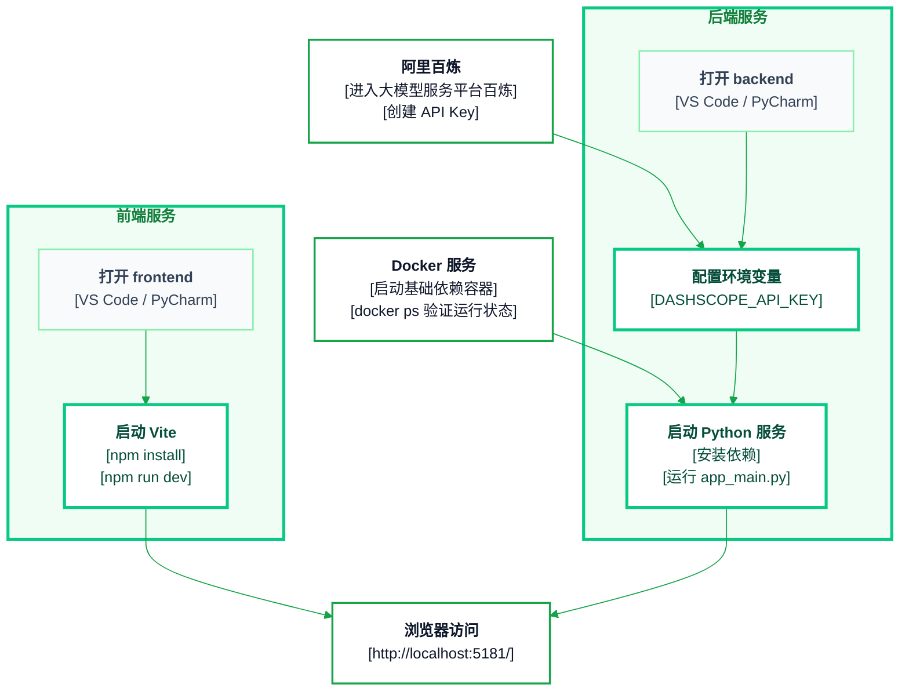

# 【RAG实战-第3天】前后端服务运行

## 启动链路



## 原始截图


## 前端

### 1. 打开 frontend

使用代码编辑器（VS Code、PyCharm 等）打开 `frontend` 目录。

### 2. 命令行运行以下命令

```bash
npm i --legacy-peer-deps

npm run dev
```

### 3. 前端运行成功标志

显示如下内容，则说明前端运行成功：

```text
> gsk@0.0.0 dev
> vite

[vite] (client) Re-optimizing dependencies because vite config has changed

VITE v6.1.0  ready in 414 ms

Local:   http://localhost:5181/
Network: http://192.168.1.9:5181/
Network: http://26.26.26.1:5181/
press h + enter to show help
```

## 后端

### 1. 获取 API Key

以阿里百炼平台（目前业界云平台用阿里云较多）为例：

```text
https://www.aliyun.com/product/bailian
```

在阿里百炼控制台中进入 API Key 页面，点击“创建我的 API-KEY”。

### 2. 打开 backend

使用代码编辑器（VS Code、PyCharm 等）打开 `backend` 目录。

### 3. 命令行运行以下命令

```bash
# 创建虚拟环境
conda create -n deepdimension python=3.11
conda activate deepdimension

# 启动 docker
docker compose -f docker-compose-base.yml up

# 配置你的 api key
export DASHSCOPE_API_KEY="your_api_key_here"

cd app

# 安装相应包
python -m pip install -r requirements.txt

python app_main.py
```

## 如何启动 Docker？

### 在 Linux 上

确保 Docker 服务已启动：

```bash
sudo systemctl start docker
```

通常可以设置开机自启：

```bash
sudo systemctl enable docker
```

通过命令执行 `docker ps`，验证是否正常运行；若能看到容器列表（空列表也可以），说明 Docker 已经启动。

### 在 Windows / macOS 上

1. 启动 Docker Desktop 应用程序（在应用菜单中点击 Docker Desktop 图标）。
2. 等待其启动并在系统通知区（Windows）或菜单栏（macOS）出现 Docker 的小鲸鱼图标，表示 Docker 服务已经就绪。
3. 打开终端、PowerShell 或者 CMD，执行：

```bash
docker ps
```

若无报错，表示已成功启动。
