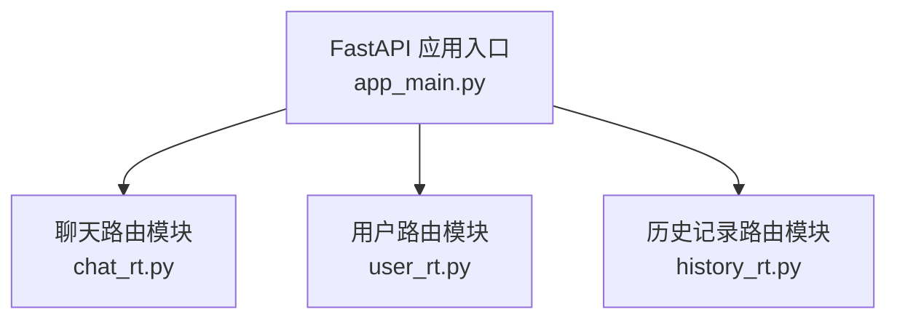
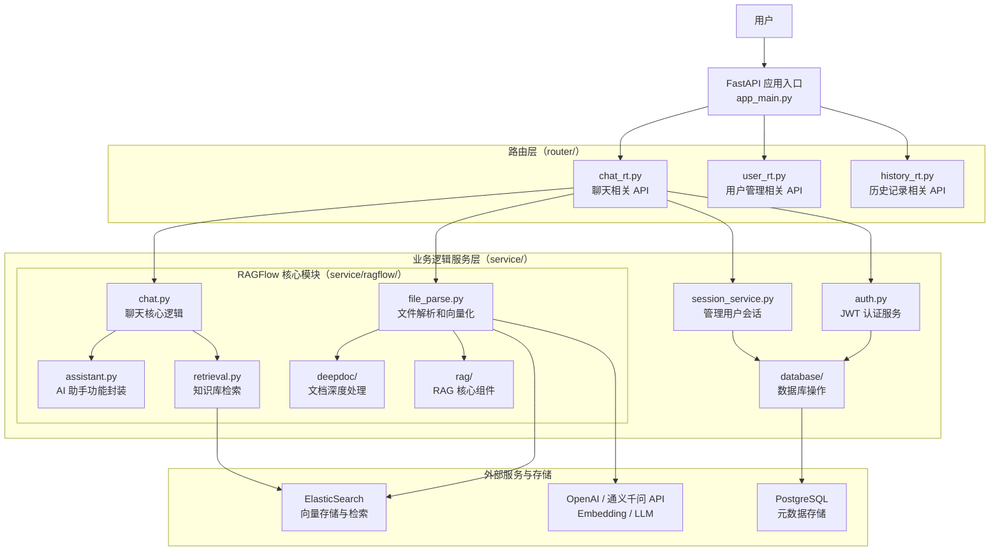
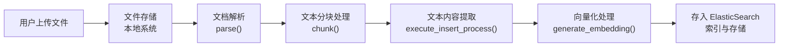
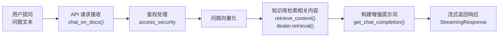
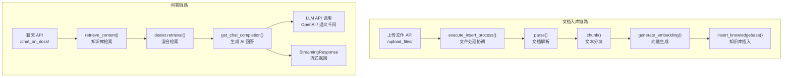

# 【RAG实战-第4天】代码结构详细解析

## 一、项目总体结构

```text
项目根目录/
├── app/                       # 核心应用代码目录
│   ├── app_main.py             # FastAPI 应用入口
│   ├── router/                 # API 路由目录
│   ├── service/                # 业务逻辑服务
│   ├── database/               # 数据库操作
│   ├── models/                 # 数据模型
│   ├── schemas/                # 数据交换结构
│   ├── utils/                  # 工具函数
│   └── exceptions/             # 异常处理
├── .env                        # 环境变量配置
├── docker-compose.yml          # Docker 编排配置
└── init.sql                    # 数据库初始化脚本
```

项目入口与路由关系：



## 二、核心组件详解

### 1. 入口文件（app_main.py）

```python
from fastapi import FastAPI
from router import chat_rt
from router import user_rt
from router import history_rt

app = FastAPI()

app.include_router(chat_rt.router)
app.include_router(user_rt.router)
app.include_router(history_rt.router)

if __name__ == "__main__":
    import uvicorn

    uvicorn.run(app, host="0.0.0.0", port=8000)
```

这个入口文件创建了 FastAPI 应用，并集成了三个主要路由模块：

- **聊天路由**：`chat_rt`
- **用户路由**：`user_rt`
- **历史记录路由**：`history_rt`

### 2. 路由模块（router/）

```text
router/
├── __init__.py      # 包初始化文件
├── chat_rt.py       # 聊天相关 API 路由
├── history_rt.py    # 历史记录相关 API 路由
└── user_rt.py       # 用户相关 API 路由
```

聊天路由 `chat_rt.py` 主要 API 端点：

- `/create_session`：创建新的聊天会话
- `/upload_files/`：上传文档到知识库
- `/chat_on_docs/`：基于知识库进行问答

### 3. 业务服务模块（service/）

后续工作基本是写业务模块的接口。

```text
service/
├── auth.py              # 认证服务
├── session_service.py   # 会话管理服务
├── ragflow/             # RAG 核心实现
│   ├── file_parse.py    # 文件解析处理
│   ├── chat.py          # 聊天核心逻辑
│   ├── retrieval.py     # 知识库检索
│   ├── assistant.py     # AI 助手实现
│   ├── deepdoc/         # 文档深度处理
│   └── rag/             # RAG 核心组件
```

## 三、核心流程详解

### 1. 文档处理流程（file_parse.py）

```python
def parse(file_path):
    # 使用自定义的 PDF 解析器
    result = chunk(file_path, callback=dummy)
    return result


def generate_embedding(text: str, credential: str = None, ...):
    # 初始化 OpenAI 客户端
    client = build_embedding_client(credential=credential, base_url=base_url)
    # 调用嵌入接口生成向量
    completion = client.embeddings.create(...)
    embedding = completion.data[0].embedding
    return embedding


def execute_insert_process(file_path, file_name, session_id):
    # 协调整个文件处理流程
    # 解析 -> 分块 -> 向量化 -> 存储
    ...
```

关键流程：**文档上传 -> 解析分块 -> 向量化 -> 存储到知识库**。

### 2. 知识库检索流程（retrieval.py）

```python
def retrieve_content(indexNames: str, question: str):
    # 执行检索
    results = dealer.retrieval(
        question=question,
        tenant_ids=indexNames,
        vector_similarity_weight=0.6,
        page=1,
        page_size=5,
    )

    # 提取相关文档片段信息
    extracted_data = []
    for chunk in results["chunks"]:
        # 提取文档内容、ID 等信息
        ...
```

关键流程：**问题输入 -> 向量化 -> 混合检索（向量 + 词项）-> 返回相关文档片段**。

### 3. 聊天响应流程（chat_rt.py）

```python
@router.post("/chat_on_docs/")
async def chat_on_docs(
    session_id: str = Query(...),
    request: ChatRequest = Body(...),
    credentials: JwtAuthorizationCredentials = Security(access_security),
):
    # 1. 鉴权处理
    user_id = credentials.subject.get("user_id")

    # 2. 从知识库检索相关内容
    relevant_docs = retrieve_content(...)

    # 3. 生成 AI 回答并流式返回
    return StreamingResponse(
        get_chat_completion(...),
        media_type="text/event-stream",
    )
```

关键流程：**接收问题 -> 检索知识库 -> 构建提示词 -> 调用 LLM -> 流式返回**。

## 四、系统工作流程图

### 1. 系统架构图



### 2. 核心功能流程图

#### 2.1 知识库构建流程



#### 2.2 智能问答流程



#### 2.3 核心模块调用关系



### 3. 模块详细说明

#### 3.1 入口模块（app_main.py）

- **功能**：创建 FastAPI 应用实例，注册路由。
- **调用**：引入三个主要路由模块并注册到应用中。
- **被调用**：由 Web 服务器 `uvicorn` 启动。

#### 3.2 路由模块（router/）

- `chat_rt.py`
  - 功能：定义聊天相关 API 端点。
  - API 端点：
    - `/create_session`：创建新会话。
    - `/upload_files/`：上传文档到知识库。
    - `/chat_on_docs/`：基于知识库进行问答。
  - 调用：调用 service 层的业务逻辑。
  - 被调用：被入口模块加载。
- `user_rt.py`
  - 功能：用户管理相关 API。
  - 被调用：被入口模块加载。
- `history_rt.py`
  - 功能：历史记录相关 API。
  - 被调用：被入口模块加载。

#### 3.3 服务层模块（service/）

- `auth.py`
  - 功能：提供 JWT 认证服务。
  - 被调用：被路由模块用于鉴权。
- `session_service.py`
  - 功能：管理用户会话。
  - 被调用：被聊天路由调用。
- `ragflow/`
  - `file_parse.py`
    - 功能：文件解析和向量化。
    - 核心函数：
      - `parse()`：文档解析。
      - `generate_embedding()`：文本向量化。
      - `execute_insert_process()`：协调文件处理流程。
    - 调用：调用外部 API 生成向量。
    - 被调用：被上传文件 API 调用。
  - `chat.py`
    - 功能：聊天核心逻辑。
    - 核心函数：
      - `get_chat_completion()`：生成 AI 回答。
      - `generate_session_name()`：生成会话名称。
    - 调用：调用 LLM API 生成回答。
    - 被调用：被聊天路由调用。
  - `retrieval.py`
    - 功能：知识库检索。
    - 核心函数：
      - `retrieve_content()`：检索相关内容。
    - 调用：调用 ElasticSearch 进行检索。
    - 被调用：被聊天路由调用。

#### 3.4 数据持久层

- `database/`
  - 功能：数据库操作。
  - 核心操作：
    - `insert_knowledgebase()`：插入知识库记录。
    - `verify_user_knowledgebase()`：验证用户知识库。
  - 被调用：被服务层调用。

### 4. 数据流转详解

#### 1. 文档处理流程

1. 用户通过前端上传文档。
2. `chat_rt.py` 中的上传 API 接收文件。
3. 调用 `execute_insert_process()` 处理文件。
4. `parse()` 函数解析文档。
5. `chunk()` 函数将文档分割成小块。
6. `generate_embedding()` 生成文本向量。
7. 将向量和原文存入 ElasticSearch。

#### 2. 问答流程

1. 用户发送问题。
2. `chat_rt.py` 中的 `chat_on_docs()` API 接收请求。
3. 调用 `retrieve_content()` 检索相关内容。
4. `dealer.retrieval()` 在 ElasticSearch 中执行混合检索。
5. 调用 `get_chat_completion()` 生成 AI 回答。
6. 构建提示词模板，包含检索到的内容。
7. 调用 LLM API 生成回答。
8. 通过 `StreamingResponse` 流式返回结果。

## 五、与前端交互

4 个页面分别在前端 `src/pages` 的 4 个文件中：

```text
src/
├── api/
├── assets                    # 静态资源目录
├── components/
├── configs/
├── layout/
├── pages/
│   ├── chat/
│   ├── index/
│   ├── login/
│   └── repository/
├── router/
├── store/
├── utils/
├── App.tsx
├── index.css
└── main.tsx
```

### 1. 域名和端口

前端通过 `.env` 配置后端接口地址：

```text
VITE_API_BASE=http://localhost:8000
VITE_API_BASE_2=http://localhost:8001
```

### 2. chat 的接口

`session.ts` 中封装了会话和聊天接口：

```ts
export function create(params?: {}, options?: AxiosRequestConfig) {
  return request.post<API.Result<{
    session_id: string
  }>>("/create_session", params, options)
}

export function chat(
  params: {
    id: string
    message: string
  },
  options?: AxiosRequestConfig,
) {
  const { id, ...params } = params
  return request.post<ReadableStream>(
    `/chat_on_docs/?session_id=${id}`,
    { ...params },
    {
      headers: {
        Accept: "text/event-stream",
      },
      responseType: "stream",
      adapter: "fetch",
      loading: false,
      params: {
        session_id: id,
      },
      ...options,
    },
  )
}
```

### 3. upload_files 的接口

上传文件接口通过 `FormData` 发送文件列表：

```ts
export function upload(params: { fileList: string }, options: AxiosRequestConfig) {
  const form = new FormData()

  form.append("files", params.files)

  return request.post<API.Result>(
    "/upload_files/",
    form,
    {
      headers: {
        "Content-Type": "multipart/form-data",
      },
      ...options,
    },
  )
}
```

## 六、接口测试

> 以下命令中的 JWT、密码、会话 ID 均已脱敏，用占位符表示。

### 1. 登录

注册账号：

```bash
curl -X POST "http://localhost:8000/register" \
  -H "Content-Type: application/json" \
  -d '{"username": "user01", "password": "<PASSWORD>"}'
```

首次注册返回：

```json
{"message": "User registered successfully"}
```

重复注册返回：

```json
{"detail": "用户名已存在"}
```

登录：

```bash
curl -X POST "http://localhost:8001/login" \
  -H "Content-Type: application/json" \
  -d '{"username": "user01", "password": "<PASSWORD>"}'
```

返回值示例：

```json
{"credential": "<JWT_TOKEN>", "credential_type": "bearer"}
```

### 2. 对话

创建会话：

```bash
curl -X POST "http://127.0.0.1:8000/create_session" \
  -H "Authorization: <JWT_TOKEN>"
```

返回值示例：

```json
{
  "session_id": "<SESSION_ID>",
  "status": "success",
  "message": "Session created successfully"
}
```

检查数据库是否插入：

```sql
psql -U postgre -d gsk
select * from sessions;
```

### 3. 上传文档

上传文档：

```bash
curl -X POST "http://localhost:8000/upload_files/" \
  -H "Authorization: <JWT_TOKEN>" \
  -F "files=@/path/to/report.pdf"
```

获取文档列表：

```bash
curl -X GET "http://localhost:8000/get_files/" \
  -H "Authorization: <JWT_TOKEN>"
```

返回值示例：

```json
{"status": "success", "message": "文件解析成功"}
```

检查知识库：

```sql
psql -U postgre -d gsk
select * from knowledgebases;
```

检查索引是否创建成功：

```bash
curl -u "<ES_USER>:<ES_PASSWORD>" -X GET "http://localhost:1200/_cat/indices?v"
```

删除索引：

```bash
curl -u "<ES_USER>:<ES_PASSWORD>" -X DELETE "http://localhost:1200/default"
```

检查文档数量：

```bash
curl -u "<ES_USER>:<ES_PASSWORD>" -X GET \
  "http://localhost:1200/<INDEX_ID>/_count"
```

检查映射表：

```bash
curl -u "<ES_USER>:<ES_PASSWORD>" -X GET \
  "http://localhost:1200/<INDEX_ID>/_mapping"
```

查询索引中的具体文档：

```bash
curl -u "<ES_USER>:<ES_PASSWORD>" -X POST \
  "http://localhost:1200/default/_search"
```

### 4. 基于文档问答

```bash
curl -X POST "http://localhost:8000/chat_on_docs/?session_id=<SESSION_ID>" \
  -H "Authorization: <JWT_TOKEN>" \
  -H "Content-Type: application/json" \
  -d '{"message": "世运电路在新能源和数通领域的具体布局是什么？"}'
```

正常流式返回示例：

```text
event: message
data: {'role': 'assistant', 'content': '波动', 'thinking': True}

event: message
data: {'role': 'assistant', 'content': '风险', 'thinking': False}

event: end
data: [DONE]
```

用户没有上传文档时的返回值：

```json
{"detail": "1001: You do not have your own knowledge base yet."}
```

问题列表示例：

```text
世运电路2023年第二季度的业绩表现如何？与第一季度相比有哪些变化？
世运电路在新能源和数通领域的具体布局是什么？
世运电路在风力、光伏及储能领域的 PCB 业务进展如何？
```

搜索接口：

```bash
curl -X POST "http://127.0.0.1:8000/search" \
  -H "Content-Type: application/json" \
  -d '{
    "question": "世运电路成长性",
    "indexNames": "世运电路2023中报点评"
  }'
```

### 5. 获取历史会话

查询历史会话列表：

```bash
curl -X GET "http://localhost:8000/get_sessions/" \
  -H "Authorization: <JWT_TOKEN>"
```

查询会话历史消息：

```bash
curl "http://localhost:8000/get_messages/?session_id=<SESSION_ID>" \
  -H "Authorization: <JWT_TOKEN>"
```

### 6. 磁盘清理

```bash
sudo du -h --max-depth=1 / | sort -hr

docker builder prune
docker images -f "dangling=true"
docker image prune
```
