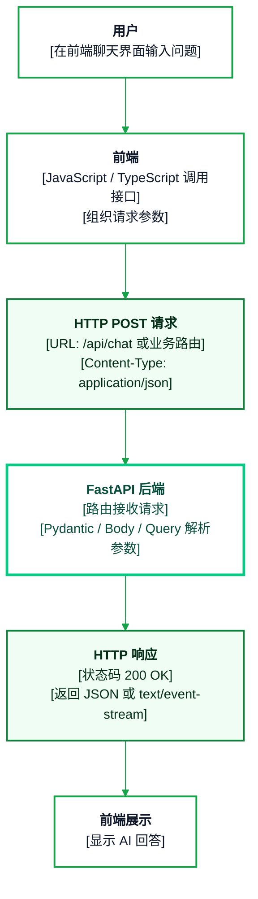
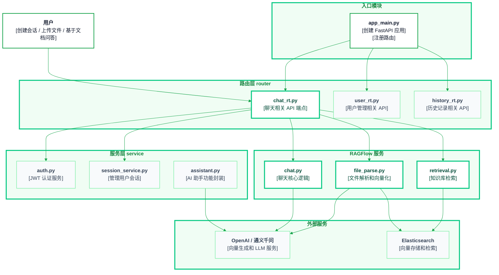
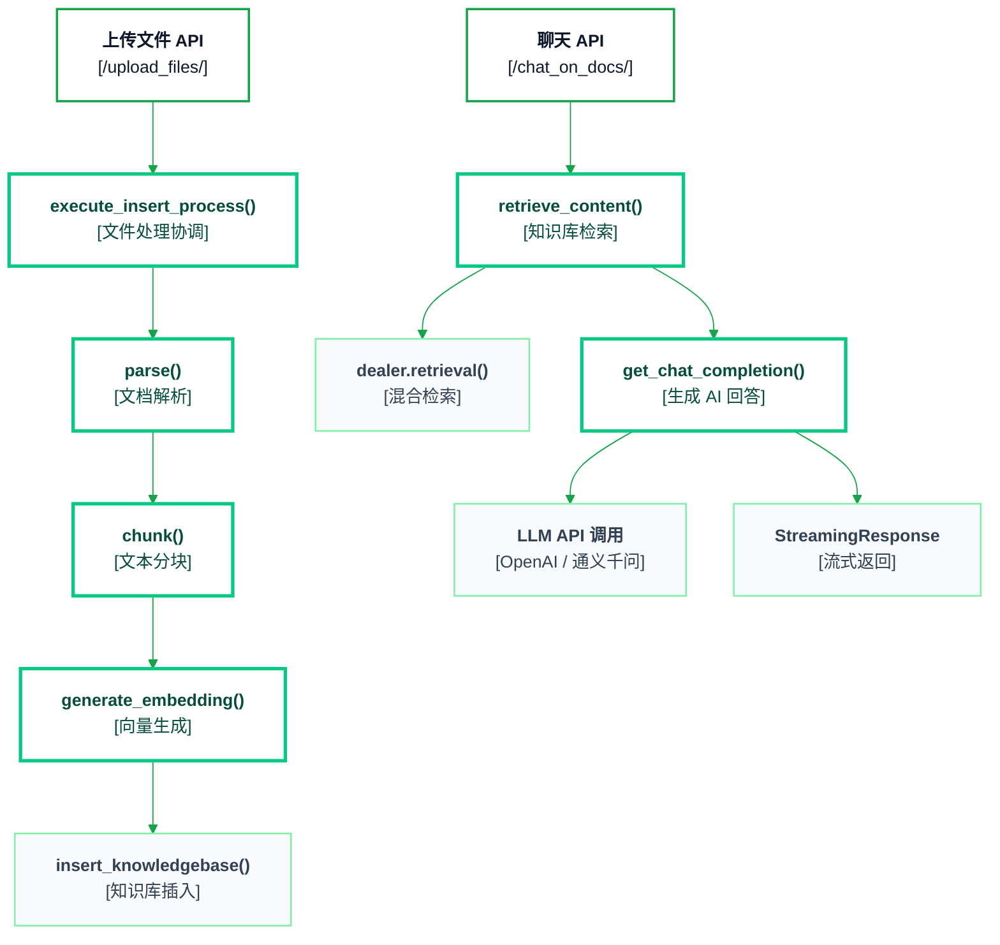
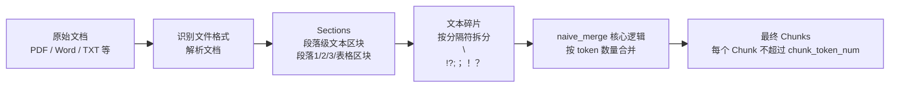
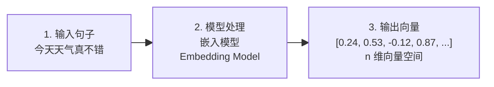
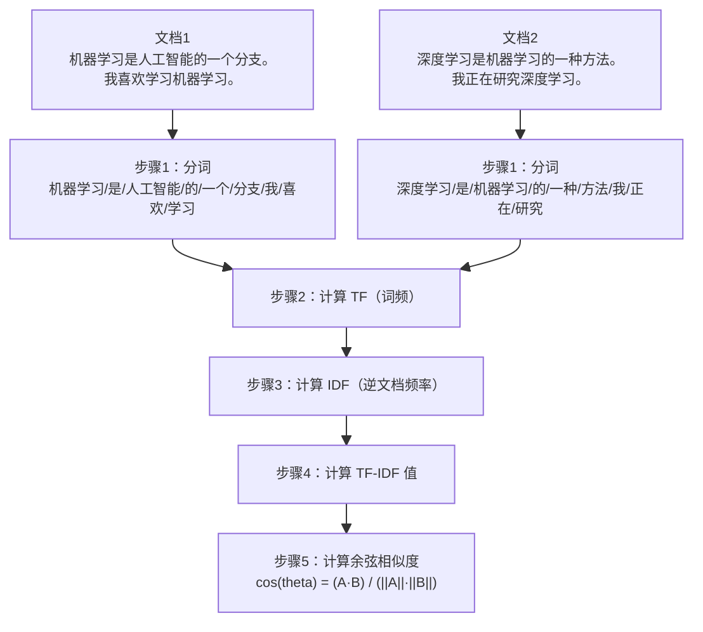
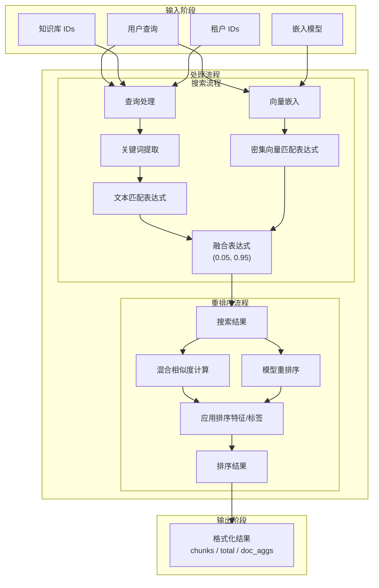
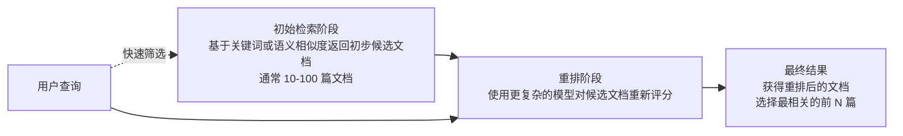

# 【RAG实战-第5天】核心代码详解

## 1. FastAPI 前后端分离开发的整体原理和结构

FastAPI 在这个项目里承担后端 API 层：前端通过 HTTP 请求调用后端接口，后端完成会话创建、文件上传解析、知识库检索和流式问答。




### 主函数代码

```python
from fastapi import FastAPI
from router import chat_rt
from router import user_rt
from router import history_rt

app = FastAPI()

app.include_router(chat_rt.router)
app.include_router(user_rt.router)
app.include_router(history_rt.router)

if __name__ == "__main__":
    import uvicorn
    uvicorn.run(app, host="0.0.0.0", port=8000)
```

这里的关键点是：

- `app = FastAPI()` 创建 FastAPI 应用。
- `include_router(...)` 将不同业务路由注册到主应用中。
- `chat_rt` 负责聊天相关 API，是本节重点。
- `uvicorn.run(...)` 在本地启动后端服务。

## 2. chat_rt 核心路由

`chat_rt` 负责把前端上传文件、创建会话、基于知识库问答三个能力串起来。

### 导入与初始化

```python
from fastapi import APIRouter, Body, UploadFile, File, HTTPException, Query, Security, status
import uuid
from schemas.chat import SessionResponse, ChatRequest
from fastapi.responses import StreamingResponse
import os
from dotenv import load_dotenv
from typing import List, Optional
from service.ragflow.file_parse import execute_insert_process
from service.ragflow.api_utils.file_utils import get_project_base_directory
from fastapi_jwt import JwtAuthorizationCredentials
from service.ragflow.retrieval import retrieve_content
from service.ragflow.chat import get_chat_completion
from service.auth import access_security
from utils import logger
from database.knowledgebase_operations import insert_knowledgebase, verify_user_knowledgebase

load_dotenv()

router = APIRouter()
```

### 创建会话 `/create_session`

```python
@router.post("/create_session", response_model=SessionResponse)
async def create_session(
    credentials: JwtAuthorizationCredentials = Security(access_security),
):
    try:
        user_id = credentials.subject.get("user_id")
        if not user_id:
            raise HTTPException(status_code=401, detail="Invalid authentication credentials")

        session_id = str(uuid.uuid4()).replace("-", "")[:16]
        return {
            "session_id": session_id,
            "status": "success",
            "message": "Session created successfully",
        }
    except Exception as e:
        raise HTTPException(status_code=500, detail=str(e))
```

作用：

- 从 JWT 中取出 `user_id`。
- 生成一个 16 位会话 ID。
- 将会话 ID 返回给前端，供后续上传文件和问答使用。

### 上传文件 `/upload_files`

```python
@router.post("/upload_files/")
async def upload_files(
    session_id: Optional[str] = Query(None),
    files: List[UploadFile] = File(...),
    credentials: JwtAuthorizationCredentials = Security(access_security),
):
    if session_id is None:
        session_id = "default"

    storage_dir = os.path.join(get_project_base_directory(), "storage/file")
    if not os.path.exists(storage_dir):
        os.makedirs(storage_dir)

    session_dir = os.path.join(storage_dir, session_id)
    if not os.path.exists(session_dir):
        os.makedirs(session_dir)

    try:
        user_id = str(credentials.subject.get("user_id"))
        if not user_id:
            raise HTTPException(status_code=401, detail="Invalid authentication credentials")

        for file in files:
            file_name = file.filename
            file_path = os.path.join(session_dir, file_name)

            with open(file_path, "wb") as buffer:
                buffer.write(await file.read())

            file_url = f"storage_dir/{session_id}/{file_name}"
            print(file_url)
            print(file_name)

            execute_insert_process(file_url, file_name, user_id)
            logger.info("数据插入es")

            insert_knowledgebase(user_id, file_name)
            logger.info("数据插入pg")

        return {
            "status": "success",
            "message": "文件解析成功",
        }
    except Exception as e:
        logger.exception(e)
        raise HTTPException(
            status_code=status.HTTP_500_INTERNAL_SERVER_ERROR,
            detail=str(e),
        )
```

作用链路：

1. 接收前端上传的文件。
2. 按 `session_id` 创建本地存储目录。
3. 将文件保存到 `storage/file/{session_id}`。
4. 调用 `execute_insert_process(...)` 执行解析、切块、向量化、入库。
5. 调用 `insert_knowledgebase(...)` 写入用户知识库记录。

### 基于知识库对话 `/chat_on_docs`

```python
@router.post("/chat_on_docs/")
async def chat_on_docs(
    session_id: str = Query(...),
    request: ChatRequest = Body(..., description="User message"),
    credentials: JwtAuthorizationCredentials = Security(access_security),
):
    try:
        user_id = str(credentials.subject.get("user_id"))
        if not user_id:
            raise HTTPException(status_code=401, detail="Invalid authentication credentials")

        verify_user_knowledgebase(user_id)

        question = request.message
        references = retrieve_content(user_id, question)

        return StreamingResponse(
            get_chat_completion(session_id, question, references, user_id),
            media_type="text/event-stream",
        )
    except HTTPException as e:
        raise e
    except Exception as e:
        logger.exception(e)
        raise HTTPException(
            status_code=status.HTTP_500_INTERNAL_SERVER_ERROR,
            detail=str(e),
        )
```

作用链路：

1. 校验用户身份。
2. 校验用户是否有自己的知识库。
3. 从请求体里取出用户问题。
4. 调用 `retrieve_content(...)` 检索相关内容。
5. 调用 `get_chat_completion(...)` 生成回答。
6. 用 `StreamingResponse` 流式返回给前端。

前端上传文件后，通过对应路径向后端发送信息，并调用对应路径的函数：


## 3. 整体结构

项目整体分为入口模块、路由层、服务层、RAGFlow 服务和外部服务。


核心依赖关系可以概括为：



## 4. 离线解析入库流程（upload_files）

首先回顾 RAG 的整体流程：


在我们的项目中，上传文件后的核心流程如下：




### 4.1 核心问题

- **多格式文档解析挑战**：金融保险公司的知识库包含 PPT、PDF、纯文本甚至视频等多种格式。这些格式结构各异，需要统一解析。例如：PDF 可能有多栏排版或扫描版（无文本层），PPT 通常以幻灯片形态组织，视频需要语音识别提取文本。解析不当会导致内容丢失或错乱，影响后续检索。

- **OCR 解析质量**：针对扫描版 PDF 或图片，必须通过 OCR 获取文字。普通 OCR 往往难以正确还原表格、代码块等特殊结构，可能将表格内容串行成无序文本，破坏代码格式，从而降低检索准确性。需要优化 OCR 策略，**对表格和代码段做特殊处理，确保文本提取高保真**。

- **Chunk 切分策略**：简单按固定长度切分可能造成信息割裂，或将跨页连续内容分散开来，导致查询时相关片段无法一起召回。因此需要结合规则（如根据段落、章节标题等自然边界）和语义（根据内容主题连贯性）来切分 Chunk，避免将紧密相关的信息拆开，并能识别跨页的连续内容进行合并。

- **层级结构保持**：文档往往有层次结构（章节、子章节、要点等）。如果分块时丢失层级和上下文关联，子内容可能在检索时缺乏上下文语境，影响相关性。需要在分块时保留层级信息，例如将小节内容与所属上级标题关联，作为标签元数据。

### 4.2 实际案例

> 😎 **案例 1：报销制度类查询**
>
> 例如用户询问“差旅报销的上限是多少？”。公司内部的报销制度可能是 PDF 扫描件，包含分级标题和表格（各费用类别的报销上限）。通过优化解析，我们对扫描 PDF 进行 OCR 并准确提取表格内容，将“差旅报销”章节下的文字和限额表格作为一个完整 Chunk，并标注其上级章节“报销政策 > 差旅报销”。这样，当用户查询时，系统能准确召回包含“差旅报销”限额的片段，避免因页面跳转或表格解析错误导致召回不全。
>
> **案例 2：保险推销策略查询**
>
> 例如用户询问“新人销售技巧有哪些？”。相关知识可能存在于培训 PPT 或录像中。我们通过解析 PPT 提取每页标题和要点 bullet，在视频中通过语音识别获得字幕，并按讲解片段切分。然后根据幻灯片的层次结构（模块 -> 具体策略）给每个知识点 Chunk 打上标签。如此，查询“新人销售技巧”时，系统不仅检索到相关技巧要点，还因为 Chunk 附带了所属模块（如“销售培训 > 新人技巧”）等信息，提高了匹配精度，帮助召回更全面的策略要点。

### 4.3 优化策略

为解决以上问题，提出如下优化方案。

#### 统一文档解析与 OCR 改进

- **PDF 解析**：优先使用文本层提取（如 pdfplumber 或 PyMuPDF 读取），保持读取顺序。对于扫描 PDF 或嵌入图片，调用 OCR 引擎（如 Tesseract 或 PaddleOCR）。特别地，OCR 时针对表格区域采用专门处理，例如先检测表格边框或使用表格 OCR 算法，确保按单元格顺序输出文本；对于代码块图片，可设置 OCR 保持换行和空格格式。这里推荐 Marker 和 MinerU。

- **PPT 解析**：利用幻灯片结构提取标题和文本框内容。每页幻灯片输出时保留其标题，项目符号列表作为子内容。对于包含图片的幻灯片，可对图片执行 OCR（如截图后 OCR）以提取其中的文字说明。

- **纯文本解析**：直接按行/段读取，识别格式中的特殊标记，例如 Markdown 的代码块或表格格式。确保代码块保留缩进和换行，表格按行列分隔保存。

- **视频解析**：先通过语音识别得到逐句字幕，再按时间戳或内容语义将字幕合并成段落。可以利用现有 ASR 工具获取准确的转录文本，并根据视频内容结构（章节或 PPT 同步内容）对转录文本分段。

#### 智能 Chunk 切分（规则 + 语义融合）

- **基于规则的切分**：利用文档格式特征，如章节标题、段落换行、列表项、表格边界等作为切分点。一旦检测到新的章节点或列表起始，就结束当前 Chunk 开启新 Chunk。对于表格和代码块，整段内容视为一个 Chunk，避免中途截断。

- **语义连贯的调整**：在规则初切分后，检查相邻 Chunk 的内容连贯性。如果发现某 Chunk 过短且与前后段落语义紧密相关，则可以和相邻 Chunk 合并，确保信息完整。跨页段落如果下页开头并非新章节标题，则应与前页末尾合并为同一 Chunk。

- **长度和平衡**：在保证语义完整的前提下控制 Chunk 长度，使其适合向量检索和后续模型处理。例如不超过 512 字或一定 token 数。过长则适当按语义次级节点再拆分，过短则与相邻补充。

#### 层级结构与标签管理

- **章节层级标签**：在解析阶段捕获文档的层次结构（如章节编号/标题、二级标题等），实现方式可以是依据格式识别标题行，并维护一个层级栈。分块时，将当前 Chunk 所属的所有上级标题作为层级列表存入标签。

- **内容类别标签**：标注 Chunk 的内容类型和主题类别。例如表格、代码块、普通文本、政策案例、操作指南等。可通过解析时的内容特征判断，也可以结合业务定义的类别作为标签。

- **引用与来源**：每个 Chunk 还应记录来源文档名、页码或幻灯片编号等，以便命中后追溯原文，同时在生成答案时用于引用出处。

通过以上策略，系统能够最大程度保留文档原有信息结构，避免因解析不当导致内容遗漏，并保证 Chunk 划分合理不割裂上下文。

## 5. 具体实现：解析 -> 切块 -> 向量化 -> 入库

### 5.1 PDF 解析核心流程


### 5.2 代码整体概览

这个文件主要定义两个类：

1. **RAGFlowPdfParser**：用于 PDF 文件解析，抽取文本块、表格、图片等结构化信息，做一些文本合并与处理。
2. **PlainParser**：更简单的 PDF 文本解析器，仅用于读取纯文本。

`RAGFlowPdfParser` 使用了多个外部库与内部辅助函数/类，结合了 **OCR（光学字符识别）、布局识别、表格识别、XGBoost** 等组件，实现对 PDF 内容的深度解析。`PlainParser` 则比较简单，只是基于 `pypdf` 的 `extract_text()` 方法获取 PDF 每页的纯文本。

## 6. RAGFlowPdfParser 重要组件

### A. 内部服务 / 工具类

1. **OCR / Recognizer / LayoutRecognizer / TableStructureRecognizer**
   - **OCR**：光学字符识别模块，对图像进行文字提取。
   - **Recognizer**：布局或文字位置等识别相关的方法集合，包含 `sort_Y_firstly`、`find_overlapped` 等静态或类方法。
   - **LayoutRecognizer**：布局识别器，根据传入模型标识，尝试对每个页面的内容进行分类，如文字、表格、图片等。
   - **TableStructureRecognizer**：表格结构识别器，能从图像中检测出表格行列、单元格信息等。

2. **rag_tokenizer**
   - NLP 分词器，用来将文本进行分词，还可以做简单的词性识别，比如检测名词、标点等。

3. **get_project_base_directory**
   - 工具函数，用于获取项目根目录，以便于后续拼接模型加载路径。

### B. RAGFlowPdfParser 类中的重要方法

1. **初始化方法 `__init__`**
   - 初始化 OCR 模块、布局识别器（LayoutRecognizer）、表格识别器（TableStructureRecognizer）以及 XGBoost 模型（`self.updown_cnt_mdl`）。
   - 如果本地存在模型文件，则从本地加载；否则会尝试从 Hugging Face 下载。
   - 定义 `self.page_from = 0` 等初始化属性。

2. **私有方法 `__char_width(c)` / `__height(c)` / `__x_dis(a, b)` / `__y_dis(a, b)`**
   - 这些方法计算文本框或字符之间的高度、宽度、距离等，用以衡量文本是否应当合并或关联。

3. **`_match_proj(b)`**
   - 用正则匹配一些可能是“章节标题”、“条款编号”、“序号”等格式化文本，用于判断文本块类型。

4. **`_updown_concat_features(up, down)`**
   - 计算上下两段文本块是否应该在垂直方向合并时所需的特征列表，这些特征随后会喂给 XGBoost 模型来判断是否应该合并文本。

5. **`@staticmethod sort_X_by_page(arr, threshold)`**
   - 将文本块按照页面、x 坐标以及 top 坐标进行排序，并在阈值内对顺序做一定修正，保证输出顺序更加合理。

6. **`_has_color(o)`**
   - 判断一个对象是否有颜色，用来筛掉一些“看起来就是灰度或者空白”的对象。

7. **`_table_transformer_job(ZM)`**
   - 针对表格布局的进一步加工流程。
   - 先裁剪出所有表格区域的图像，调用 `self.tbl_det` 识别表格结构，然后再把识别后的坐标映射回 PDF 坐标系，形成统一的表格组件列表（`self.tb_cpns`）。
   - 最后重做列名、行名、单元格等信息的匹配与标注。

8. **`__ocr(self, pagenum, img, chars, ZM=3)`**
   - 对指定页面做 OCR 检测，生成文字候选框后，再将 pdfplumber 提取的字符与 OCR 检测框做融合或匹配。

9. **`_layouts_rec(ZM, drop=True)`**
   - 用布局识别器（`self.layouter`）对 `self.boxes` 和页面图进行重分类，并根据页面累积高度（`page_cum_height`）调整位置。
   - 根据 x 和 y 进行排序。

10. **`_text_merge()`**
    - 在横向上，对同一行或相邻的文本框进行合并，减少碎片化文本块。

11. **`_naive_vertical_merge()`**
    - 尝试对纵向上连续的文本块进行简单合并。
    - 同时会根据一些特征来判断是否需要“拆开”或者跳过合并。

12. **`_concat_downward(concat_between_pages=True)`**
    - 这是更复杂的“上下文”合并过程，利用 **XGBoost 模型**判断上下文本块是否应当拼接。
    - 先统计文本块的 `in_row` 数值，再以“深度优先”的方式汇总，如果 XGBoost 评分超过 0.5，就把下一个文本与上一个文本合并。

13. **`_filter_forpages()`**
    - 移除一些特定的目录页，或者带有“...”页码符号的页面文本块，或者“目次/目录”等非正文部分。

14. **`merge_with_same_bullet()`**
    - 将带有相同“项目符号”（比如“·”）开头的文本进行合并，有时可以把第一行与第二行的列表项合成一个整体。

15. **`_extract_table_figure(need_image, ZM, return_html, need_position)`**
    - 用来提取表格和图片区域，并做裁剪、拼接等。
    - 同时尝试匹配“表格标题（table caption）”或“图片标题（figure caption）”，并将它们与对应表格/图片合并。
    - 返回提取后的图像/表格结构列表。

16. **`__filterout_scraps(boxes, ZM)`**
    - 将不重要、无用的 `scraps` 文本块去掉，例如宽度很窄，或者与整体布局无关的干扰信息。

17. **`images`**
    - 核心的“图像转换”流程。
    - 打开 PDF 并预先渲染所有页面为图像。
    - 读取页面字符信息；如果字符提取失败，则为空列表。
    - 尝试识别 PDF outline。
    - 判断文本是英文为主还是中文为主（`self.is_english`）。
    - 对每页图像做 OCR 并得到文本框。
    - 如果分辨率不够（`zoom < 9`）且没有解析出可用信息，会放大再来一次（递归处理）。

18. **`call`**
    - 直接把 `RAGFlowPdfParser` 当函数调用时的主入口：
      1. `self.__images__()` 做 PDF -> 图像 -> OCR 等处理。
      2. `self._layouts_rec()` 做布局分类，包括图文、表格。
      3. `self._table_transformer_job()` 做表格处理。
      4. `self._text_merge()` 合并行内文本。
      5. `self._concat_downward()` 合并上下文本。
      6. `self._filter_forpages()` 过滤不需要的页面。
      7. `self._extract_table_figure()` 提取表格或图像。
      8. `self.__filterout_scraps()` 去除无用文本碎片。
    - 最后返回清理后的文本及表格/图像结果。

19. **`remove_tag(txt)` / `crop(text, ZM, need_position=False)` / `get_position(bx, ZM)`**
    - 针对文本中的 `@@...##` 等特殊标记做清理或裁剪出对应区域图像，主要用于对指定文本区域生成图片/坐标的可视化呈现。

### C. 整体流程与协作方式

综合上面的介绍，`RAGFlowPdfParser` 的执行流程大致如下：

1. 读入 PDF 并将其转成多页图像（`pdfplumber.to_image`）。
2. 从 PDF 中提取字符位置信息（`page.dedupe_chars()`），同时也提取 outlines（目录树）。
3. 如果启用了 OCR，则在每页图像上再做光学字符识别，得到文字框，并和原有字符信息进行合并处理。
4. 布局识别器 LayoutRecognizer 接管，对每一页中获知的文字、表格、图片等进行分类和标注。
5. 如果有表格，使用 TableStructureRecognizer 对裁剪下来的表格图进行行列识别，并将结果映射回 PDF 坐标系。
6. 对相邻文字框进行各种“合并”操作：
   - 横向合并（`_text_merge`）
   - 纵向合并（`_naive_vertical_merge`）
   - 使用 XGBoost 模型判断上下段落合并（`_concat_downward`）
7. 过滤掉一些不重要的页或内容，例如目录页或 `...` 页码等（`_filter_forpages`）。
8. 再次根据“表格标题”或“图片标题”把表格/图片与它们的说明文字绑定在一起（`_extract_table_figure`）。
9. 去除一些没有意义的小碎片文本（`__filterout_scraps`）。
10. 最终返回结构化的文本块列表以及表格/图片等信息；如果需要，还可以对其中包含的 `@@...##` 标签进行二次裁剪（`crop`）。

## 7. PDF 版面识别示意

红框示意了 PDF 中可被版面分析识别出来的不同区域，如标题、侧栏、市场数据、正文段落、分析师信息等。


这种识别结果的价值在于：

- 可以区分正文、标题、侧栏、表格、页眉页脚。
- 可以避免目录、报告侧边栏、页码等噪音进入正文 Chunk。
- 可以把相关段落、表格标题和表格内容绑定在一起。
- 可以保留来源位置，为后续答案引用和溯源提供依据。

## 8. 使用入口：`Pdf.__call__` 代码详解

我们可以看到 `Pdf` 类继承自 `PdfParser`，是一个专门用于处理 PDF 文档的解析器。这个解析器的主要功能是提取 PDF 中的文本、图片和表格，并支持 OCR 识别。下面详细解释其实现原理。

### 8.1 整体工作流程

`Pdf` 类的 `__call__` 方法是整个解析过程的入口，它按照以下步骤处理 PDF 文档：

```python
def __call__(self, filename, binary=None, from_page=0, to_page=100000,
             zoomin=3, callback=None):
    # 1. 提取图像并进行OCR
    self.__images__(filename if not binary else binary, zoomin, from_page,
                    to_page, callback)

    # 2. 进行布局识别
    self._layouts_rec(zoomin)

    # 3. 表格识别
    self._table_transformer_job(zoomin)

    # 4. 合并文本
    self._text_merge()

    # 5. 提取表格和图表
    tbls = self._extract_table_figure(True, zoomin, True, True)

    # 6. 向下连接相关文本
    self._concat_downward()

    # 7. 返回结果
    return [(b["text"], self._line_tag(b, zoomin)) for b in self.boxes], tbls
```

这个流程清晰地展示了 PDF 解析的各个步骤，从图像提取到最终的文本和表格输出。

### 8.2 图像提取和 OCR（`__images__`）

1. 首先使用 `pdfplumber` 打开 PDF 文件。
2. 将每一页转换为图像（`p.to_image(resolution=72 * zoomin).annotated`）。
3. 尝试提取每页的字符信息（`page.dedupe_chars().chars`）。
4. 提取 PDF 的大纲信息（使用 `pypdf`）。
5. 判断文档是英文还是其他语言。
6. 对每一页图像进行 OCR 处理（`self.__ocr()`）。

这个步骤的核心是将 PDF 转换为图像，然后通过 OCR 技术识别图像中的文本。同时，它也会尝试直接从 PDF 中提取字符信息，这通常比 OCR 更准确，但不是所有 PDF 都支持直接提取。

### 8.3 布局识别（`_layouts_rec`）

布局识别是将 OCR 识别出的文本框分类为不同类型（如正文、标题、表格等）的过程：

```python
def _layouts_rec(self, ZM, drop=True):
    assert len(self.page_images) == len(self.boxes)
    self.boxes, self.page_layout = self.layouter(
        self.page_images, self.boxes, ZM, drop=drop)
    # 调整Y坐标，考虑页面累积高度
    for i in range(len(self.boxes)):
        self.boxes[i]["top"] += self.page_cum_height[self.boxes[i]
                                                     ["page_number"] - 1]
        self.boxes[i]["bottom"] += self.page_cum_height[self.boxes[i]
                                                        ["page_number"] - 1]
```

这里的 `self.layouter` 是一个 `LayoutRecognizer` 实例，它使用深度学习模型来识别页面中的不同布局区域。布局识别的结果会被存储在 `self.boxes` 和 `self.page_layout` 中，前者包含文本框信息，后者包含页面布局信息。

### 8.4 表格识别（`_table_transformer_job`）

表格识别是一个复杂的过程，它需要：

1. 从页面布局中找出所有表格区域。
2. 裁剪出表格图像。
3. 使用表格结构识别器（`self.tbl_det`）识别表格的行列结构。
4. 将识别结果映射回原始坐标系。
5. 为表格中的文本框添加行列标记。

这个过程使用了专门的表格识别器，能够理解表格的行列关系，这对于后续的表格重建非常重要。

### 8.5 文本合并（`_text_merge`）

文本合并是将相邻的文本框合并成更大的文本块的过程：

```python
def _text_merge(self):
    # 合并具有相同布局的相邻文本框
    i = 0
    while i < len(bxs) - 1:
        b = bxs[i]
        b_ = bxs[i + 1]
        if b.get("layoutno", "0") != b_.get("layoutno", "1") or \
           b.get("layout_type", "") in ["table", "figure", "equation"]:
            i += 1
            continue
        if abs(self._y_dis(b, b_)) < self.mean_height[bxs[i]["page_number"] - 1] / 3:
            # 合并
            bxs[i]["x1"] = b_["x1"]
            bxs[i]["top"] = (b["top"] + b_["top"]) / 2
            bxs[i]["bottom"] = (b["bottom"] + b_["bottom"]) / 2
            bxs[i]["text"] += b_["text"]
            bxs.pop(i + 1)
            continue
        i += 1
```

这个过程主要考虑文本框的空间关系和布局类型，将水平相邻且属于同一布局的文本框合并。

### 8.6 表格和图表提取（`_extract_table_figure`）

这一步骤从已识别的布局中提取表格和图表：

1. 找出所有标记为表格或图表的文本框。
2. 根据布局信息裁剪出表格或图表区域。
3. 对于表格，使用表格结构识别器构建表格结构。
4. 对于图表，提取图像和相关文本。

这个过程的结果是一个包含表格和图表信息的列表，每个元素包含图像和相关文本或表格结构。

### 8.7 向下连接文本（`_concat_downward`）

这是一个更复杂的文本合并过程，它考虑上下文关系：

1. 首先计算每个文本框在同一行中的其他文本框数量。
2. 使用深度优先搜索（DFS）遍历文本框，尝试将上下相邻的文本框合并。
3. 使用 **XGBoost 模型预测两个文本框是否应该合并**。
4. 根据预测结果合并文本框。

这个过程使用了机器学习技术来判断上下文文本是否应该合并，这比简单的基于规则的方法更准确。

### 8.8 核心技术和算法

#### OCR 技术

PDF 解析器使用了自定义的 OCR 组件来识别图像中的文本。这个组件可能基于开源 OCR 引擎（如 Tesseract）或商业 OCR API。OCR 过程包括：

1. 文本检测：找出图像中的文本区域。
2. 文本识别：识别文本区域中的具体文字。

#### 布局识别算法

布局识别使用了深度学习模型，可能是基于 Faster R-CNN 或 Mask R-CNN 等目标检测模型。这个模型能够将页面区域分类为不同类型，如文本、标题、表格、图片等。

#### 表格结构识别

表格结构识别是一个特殊的计算机视觉任务，需要理解表格的行列结构。它通常涉及：

1. 表格检测：找出页面中的表格区域。
2. 单元格检测：识别表格中的单元格。
3. 行列关系分析：理解单元格之间的行列关系。

#### 文本合并算法

文本合并使用了多种技术：

1. 基于空间关系的合并：根据文本框的位置关系进行合并。
2. 基于语义的合并：使用 XGBoost 模型预测两个文本框是否应该合并。
3. 基于规则的合并：使用一系列启发式规则来判断文本是否应该合并。

#### XGBoost 模型

XGBoost 模型用于预测上下文文本是否应该合并。这个模型的输入是一系列特征，包括：

1. 文本框的空间关系（如 Y 轴距离、X 轴距离）。
2. 文本的语义特征（如是否以标点符号结尾）。
3. 布局特征（如是否属于同一布局类型）。
4. 文本长度和样式特征。

模型的输出是一个概率值，表示两个文本框应该合并的可能性。

### 8.9 优化和特殊处理

#### 多语言支持

解析器会自动检测文档是英文还是其他语言，并根据语言类型调整处理策略：

```python
self.is_english = [re.search(r"[a-zA-Z0-9,/:;'\[\]\(\)!@#$%^&*\"?<>._-]{30,}", " ".join(
    random.choices([c["text"] for c in self.page_chars[i]], k=min(100,
    len(self.page_chars[i]))))) for i in range(len(self.page_chars))]
if sum([1 if e else 0 for e in self.is_english]) > len(self.page_images) / 2:
    self.is_english = True
else:
    self.is_english = False
```

#### 跨页表格处理

解析器能够处理跨页的表格，这是一个常见但复杂的问题：

```python
# 合并不同页面上的表格
i = len(tbls) - 1
while i - 1 >= 0:
    k0, bxs0 = tbls[i - 1]
    k, bxs = tbls[i]
    i -= 1
    if k0 in nomerge_lout_no:
        continue
    if bxs[0]["page_number"] == bxs0[0]["page_number"]:
        continue
    if bxs[0]["page_number"] - bxs0[0]["page_number"] > 1:
        continue
    mh = self.mean_height[bxs[0]["page_number"] - 1]
    if self._y_dis(bxs0[-1], bxs[0]) > mh * 23:
        continue
    tables[k0].extend(tables[k])
    del tables[k]
```

#### 垃圾内容过滤

解析器会过滤掉一些无用的内容，如页眉页脚、参考文献等：

```python
def __is_garbage(b):
    patt = [
        r"^[-0-9,.;: /]+$",
        r"(版权|归©|免责声明|地址[:：])",
        r"\.{3,}",
        r"^[0-9]{1,2} / ?[0-9]{1,2}$",
        r"^[0-9]{1,2} of [0-9]{1,2}$",
        r"^http://[^ ]{12,}",
        r"(资料|数据)来源[:： ]",
        r"[0-9a-z._-]+@[a-z0-9-]+\.[a-z]{2,3}",
        r"\(cid *: *[0-9]+ *\)"
    ]
    return any([re.search(p, b["text"]) for p in patt])
```

#### 自适应缩放

如果在低分辨率下没有得到足够的信息，解析器会自动增加缩放因子并重新尝试：

```python
if len(self.boxes) == 0 and zoomin < 9:
    self.__images__(fnm, zoomin * 3, page_from, page_to, callback)
```

### 8.10 PDF 解析器总结

😎 PDF 解析器是一个复杂的系统，它结合了多种技术来处理 PDF 文档：

1. **OCR 技术**：将 PDF 页面转换为图像，然后识别图像中的文本。
2. **布局识别**：使用深度学习模型识别页面中的不同布局区域。
3. **表格识别**：专门的表格结构识别技术，理解表格的行列关系。
4. **文本合并**：基于空间关系、语义和规则的文本合并算法。
5. **机器学习**：使用 XGBoost 模型预测上下文是否应该合并。

## 9. 文档切块（Chunking）流程

**那么你怎么把这个用到自己的项目中呢？**

### 9.1 整体流程

文档切块流程可以概括为：识别文件格式，解析成 sections，再按分隔符和 token 数量合并成最终 chunks。



### 9.2 识别文件格式

函数 `chunk` 会根据 `filename` 的后缀识别文档类型（PDF、Word、Excel、Markdown、TXT 等）。

不同类型的文件有不同的解析方法，例如：

- `Docx()` 解析 docx。
- `Pdf()` 或 `PlainParser()` 解析 pdf。
- `TxtParser()` 解析纯文本文件等。

解析后会先把原始内容拆成一段一段的 `sections`。

### 9.3 初步解析并得到 sections

- 例如 docx、pdf 等文档在解析后得到的结果通常是一个列表，每个元素就是一个段落，或类似段落的文本区块，这里统称为 `sections`。
- 如果文件中包含表格，可能会额外得到 `tables`。表格会有自己的处理逻辑（`tokenize_table`），但和后续的切块逻辑类似。

### 9.4 合并 sections 生成 chunks

解析完成后，会调用 `naive_merge` 或类似的 `naive_merge_docx` 函数，把这些小段落（`sections`）合并成更大的文本块（`chunks`）。

合并规则大体是：先按照指定的分隔符（例如换行符、标点符号）拆分，再把这些拆分后的小句或小段拼接起来，直到到达 `chunk_token_num`（默认 128 个 token）时，就把这部分文本打包成一个块，然后继续拼接下一个块，直到全部拼完。

### 9.5 关键切块逻辑：`naive_merge`

以 `naive_merge` 为例，它把 `sections` 合并成 `chunks` 的过程大致是：

1. **先对每个 section 做初步切分**
   `naive_merge` 会根据给定的 `delimiter`（默认是 `"\n!?;；！？"` 这些换行和中英文标点）去拆分文本。也就是说，先把段落切成更小粒度的句子或文本碎片。

2. **计算 token 数**
   拆分后得到很多短文本碎片，函数会对其进行 tokenize，也就是分词/切词，然后根据分词结果判断这个碎片有多少个 token。

3. **拼接到当前 chunk**
   如果当前 chunk 里还没有到达 `chunk_token_num`（默认 128）那么多 token，就把这个碎片拼进去；如果拼进去后不超过这个上限，继续往里加。

   一旦发现再拼一个碎片就会超过上限，则把当前 chunk 封起来（完成了一个块），然后开启下一个 chunk，继续同样的拼接流程。

4. **生成 chunks**
   等所有碎片都处理完，可能最后一个 chunk 不满 `chunk_token_num`，但是也会被单独作为一个 chunk。

这样，`naive_merge` 得到的每一个 chunk 大约包含 `chunk_token_num` 个 token，除非有的段落本身特别长，或者刚好没能正好凑齐 128。

总结一下：它实际上是一种“先按照标点或换行等分隔符拆分，然后再按照 token 数限额进行合并”的逻辑，以保证每个块的 token 数量不会太多，方便后续送进 AI 模型处理。

### 9.6 为什么要做这种切块

- **兼顾上下文完整性**：如果把文档拆得太碎，模型很难看到上下文；但如果不限制块大小，模型一次处理不了太大的内容。
- **更好地处理大文档**：即使文档再大，通过分块处理，每个块都可以生成向量索引或分词结果，然后在检索或对话时做内容查询。
- **提高处理效率**：合并成合适大小的 chunk（如 128 token），在大多数情况下对后续的检索、embedding、语义搜索等环节更高效。

## 10. 向量化

向量化阶段会把文本转换为固定维度的数值向量，用于捕捉语义信息。相似含义的句子在向量空间中距离更近。



嵌入过程的要点：

- 文本被转换为固定维度的数值向量。
- 向量用于捕捉语义信息。
- 相似含义的句子在向量空间中距离更近。
- 常见维度：128、256、384、512、768、1024 等。

## 11. 入库

### 11.1 Elasticsearch 插入操作详细解析

`insert` 方法是 `ESConnection` 类中用于批量插入文档到 Elasticsearch 的核心功能。

#### 准备批量操作数据

```python
operations = []  # 初始化操作列表
for d in documents:  # 遍历所有文档
    assert "_id" not in d  # 确保文档中没有_id字段
    assert "id" in d  # 确保文档中有id字段
    d_copy = copy.deepcopy(d)  # 深拷贝文档以避免修改原始数据
    meta_id = d_copy.pop("id", "")  # 提取并移除id字段作为文档ID
    operations.append(
        {"index": {"_index": indexName, "_id": meta_id}}  # 添加索引操作
    )
    operations.append(d_copy)  # 添加文档数据
```

这一步骤将输入的文档列表转换为 Elasticsearch 批量操作所需的格式：

- 对每个文档进行深拷贝，避免修改原始数据。
- 从文档中提取 `id` 字段作为 Elasticsearch 的文档 ID。
- 为每个文档创建两个操作项：操作元数据和文档内容。

#### 执行批量插入并处理结果

```python
res = []  # 初始化结果列表
for _ in range(ATTEMPT_TIME):  # 尝试多次插入
    try:
        res = []  # 重置结果列表
        # 执行批量操作
        r = self.es.bulk(index=(indexName), operations=operations,
                         refresh=False, timeout="60s")
        if re.search(r"False", str(r["errors"]), re.IGNORECASE):
            return res  # 如果没有错误则返回空列表

        # 处理错误信息
        for item in r["items"]:
            for action in ["create", "delete", "index", "update"]:
                if action in item and "error" in item[action]:
                    res.append(str(item[action]["_id"]) + ":" +
                               str(item[action]["error"]))
        return res  # 返回错误信息列表
```

这一步骤执行实际的批量插入操作：

- 使用 `bulk` API 执行批量操作，设置超时时间为 60 秒。
- 检查响应中是否有错误，如果没有错误则返回空列表。
- 如果有错误，收集每个文档的错误信息。

#### 异常处理和重试机制

```python
except Exception as e:  # 捕获异常
    res.append(str(e))  # 添加异常信息
    logger.warning("ESConnection.insert got exception: " + str(e))  # 记录警告日志
    res = []  # 重置结果列表
    if re.search(r"(Timeout|time out)", str(e), re.IGNORECASE):  # 如果是超时异常
        res.append(str(e))  # 添加异常信息
        time.sleep(3)  # 等待3秒
        continue  # 继续尝试
return res  # 返回错误信息列表
```

这一步骤处理插入过程中可能出现的异常：

- 捕获所有异常并记录到日志。
- 对于超时异常，等待 3 秒后重试。
- 最终返回收集到的错误信息列表。

### 11.2 具体示例

假设有以下文档需要插入到名为 `documents` 的索引中：

```python
documents = [
    {
        "id": "doc1",
        "title": "人工智能简介",
        "content": "人工智能是计算机科学的一个分支，它企图了解智能的实质...",
        "tags": ["AI", "技术", "计算机科学"],
        "created_at": "2023-05-10"
    },
    {
        "id": "doc2",
        "title": "机器学习基础",
        "content": "机器学习是人工智能的一个子领域，专注于开发能够从数据中学习的算法...",
        "tags": ["机器学习", "算法", "数据科学"],
        "created_at": "2023-05-15"
    }
]
```

执行过程：

1. 准备批量操作数据：

```python
operations = [
    {"index": {"_index": "documents", "_id": "doc1"}},
    {
        "title": "人工智能简介",
        "content": "人工智能是计算机科学的一个分支，它企图了解智能的实质...",
        "tags": ["AI", "技术", "计算机科学"],
        "created_at": "2023-05-10"
    },
    {"index": {"_index": "documents", "_id": "doc2"}},
    {
        "title": "机器学习基础",
        "content": "机器学习是人工智能的一个子领域，专注于开发能够从数据中学习的算法...",
        "tags": ["机器学习", "算法", "数据科学"],
        "created_at": "2023-05-15"
    }
]
```

2. 执行批量插入：调用 `self.es.bulk()` 方法，传入准备好的操作数据。

3. 处理响应：

```json
{
  "took": 30,
  "errors": false,
  "items": [
    {
      "index": {
        "_index": "documents",
        "_id": "doc1",
        "_version": 1,
        "result": "created",
        "status": 201
      }
    },
    {
      "index": {
        "_index": "documents",
        "_id": "doc2",
        "_version": 1,
        "result": "created",
        "status": 201
      }
    }
  ]
}
```

由于 `errors` 为 `false`，方法将返回空列表 `[]`，表示插入成功。

4. 错误处理示例：

```json
{
  "took": 25,
  "errors": true,
  "items": [
    {
      "index": {
        "_index": "documents",
        "_id": "doc1",
        "_version": 1,
        "result": "created",
        "status": 201
      }
    },
    {
      "index": {
        "_index": "documents",
        "_id": "doc2",
        "error": {
          "type": "mapper_parsing_exception",
          "reason": "failed to parse field [created_at] of type [date]"
        },
        "status": 400
      }
    }
  ]
}
```

方法将返回：

```python
["doc2:{'type': 'mapper_parsing_exception', 'reason': 'failed to parse field [created_at] of type [date]'}"]
```

表示 `doc2` 插入失败，原因是日期字段解析错误。

## 12. 搜索 `search`

`search` 方法是在 Elasticsearch 中执行复杂搜索的函数。

### 12.1 整体功能

这个方法在 Elasticsearch 中执行高级搜索，支持多种功能：

- 字段选择与高亮。
- 条件过滤。
- 文本匹配和向量匹配。
- 排序和分页。
- 聚合查询。
- 特征排名。

### 12.2 方法参数

1. `selectFields`：指定要返回的字段列表。
2. `highlightFields`：需要高亮显示的字段列表。
3. `condition`：过滤条件字典，用于精确匹配。
4. `matchExprs`：匹配表达式列表，支持文本匹配和向量匹配。
5. `orderBy`：排序表达式，定义结果排序方式。
6. `offset` 和 `limit`：分页参数。
7. `indexNames`：要搜索的索引名称。
8. `knowledgebaseIds`：知识库 ID 列表。
9. `aggFields`：聚合字段列表（可选）。
10. `rank_feature`：排名特征字典（可选）。

### 12.3 实现流程

#### 索引处理与条件验证

```python
if isinstance(indexNames, str):
    indexNames = indexNames.split(",")
assert isinstance(indexNames, list) and len(indexNames) > 0
assert "_id" not in condition
```

- 确保索引名称是列表形式。
- 验证索引名称非空。
- 确保条件中不包含 `_id` 字段。

#### 构建基础布尔查询

```python
bqry = Q("bool", must=[])
condition["kb_id"] = knowledgebaseIds
```

- 创建基础布尔查询。
- 将知识库 ID 添加到过滤条件中。

#### 处理条件过滤器

```python
for k, v in condition.items():
    # 处理不同类型的条件...
```

- 特殊处理 `available_int` 字段，添加范围过滤。
- 处理列表值，使用 `terms` 查询。
- 处理字符串和整数值，使用 `term` 查询。
- 对不支持的类型抛出异常。

#### 处理匹配表达式

首先处理融合权重：

```python
for m in matchExprs:
    if isinstance(m, FusionExpr) and m.method == "weighted_sum" and "weights" in m.fusion_params:
        # 获取向量相似度权重
        weights = m.fusion_params["weights"]
        vector_similarity_weight = float(weights.split(",")[1])
```

- 检查是否有加权融合表达式。
- 提取向量相似度权重。

然后处理文本和向量匹配：

```python
for m in matchExprs:
    if isinstance(m, MatchTextExpr):
        # 处理文本匹配...
    elif isinstance(m, MatchDenseExpr):
        # 处理向量匹配...
```

对于文本匹配：

- 处理最小匹配度参数。
- 添加 `query_string` 查询。
- 设置查询权重为 `1.0 - vector_similarity_weight`。

对于向量匹配：

- 使用 KNN（K-最近邻）查询。
- 设置相似度参数。
- 应用布尔查询作为过滤条件。

#### 处理排名特征

```python
if bqry and rank_feature:
    for fld, sc in rank_feature.items():
        # 添加排名特征...
```

- 为排名特征字段添加 `rank_feature` 查询。
- 应用对应的权重。

#### 设置高亮

```python
for field in highlightFields:
    s = s.highlight(field)
```

- 为指定字段添加高亮配置。

#### 处理排序

```python
if orderBy:
    orders = list()
    for field, order in orderBy.fields:
        # 构建排序参数...
    s = s.sort(*orders)
```

- 处理不同类型字段的排序。
- 特殊处理数值字段（`page_num_int`、`top_int`）。

#### 添加聚合

```python
for fld in aggFields:
    s.aggs.bucket(f'aggs_{fld}', 'terms', field=fld, size=1000000)
```

- 为指定字段添加聚合桶。

#### 应用分页并执行查询

```python
if limit > 0:
    s = s[offset:offset + limit]
q = s.to_dict()
```

```python
for i in range(ATTEMPT_TIME):
    try:
        res = self.es.search(...)
        # 处理响应...
        return res
    except Exception as e:
        # 异常处理...
```

- 设置分页参数。
- 将查询对象转换为字典。
- 最多尝试 `ATTEMPT_TIME` 次查询。
- 设置超时时间为 600 秒。
- 跟踪总命中数。
- 检查是否查询超时。
- 处理异常情况，特别是超时异常。

### 12.4 关键技术要点

1. **复杂查询构建**：使用布尔查询（must、should、filter）组合多种搜索条件。
2. **混合搜索策略**：
   - 文本搜索：使用 `query_string` 查询。
   - 向量搜索：使用 KNN 查询。
3. **权重平衡**：通过 `vector_similarity_weight` 平衡文本相关性和向量相似度。
4. **健壮性设计**：
   - 多次重试机制。
   - 详细的日志记录。
   - 异常处理。
5. **高级特性支持**：
   - 高亮显示。
   - 结果排序。
   - 数据聚合。
   - 特征排名。

### 12.5 文本匹配度计算

在这个 `search` 方法中，文本匹配度的计算主要通过 Elasticsearch 的 `query_string` 查询和相关参数实现。

```python
if isinstance(m, MatchTextExpr):
    minimum_should_match = m.extra_options.get("minimum_should_match", 0.0)
    if isinstance(minimum_should_match, float):
        minimum_should_match = str(int(minimum_should_match * 100)) + "%"
    bqry.must.append(Q("query_string", fields=m.fields,
                       type="best_fields", query=m.matching_text,
                       minimum_should_match=minimum_should_match,
                       boost=1))
    bqry.boost = 1.0 - vector_similarity_weight
```

关键参数解析：

1. `query_string` 查询：Elasticsearch 提供的一种强大查询语法，允许用户使用 Lucene 查询语法执行复杂搜索。
2. `fields` 参数：指定要搜索的字段列表，可以对不同字段设置不同的权重，如 `["title^3", "content"]`，表示标题字段的匹配权重是内容字段的 3 倍。
3. `type="best_fields"`：一种多字段查询策略。当搜索多个字段时，Elasticsearch 会为每个字段计算一个分数，`best_fields` 表示选择最高分数字段的分数作为整体分数。它适用于查找包含最匹配查询的单个字段的文档。
4. `minimum_should_match` 参数：定义查询中的词条至少要匹配的百分比；在代码中，如果提供的是浮点数（如 0.7），会被转换为百分比字符串（如 `"70%"`）。这个参数对控制匹配质量非常重要，值越高要求匹配的词条越多。
5. `boost=1`：设置查询的权重系数为 1。
6. `bqry.boost = 1.0 - vector_similarity_weight`：这行代码设置了整个布尔查询的权重。权重值是 `1.0 - vector_similarity_weight`，这意味着文本匹配的权重与向量匹配的权重成反比。如果 `vector_similarity_weight = 0.5`，则文本匹配的权重也为 0.5。

#### 底层计算原理

Elasticsearch 在底层使用 Lucene 来计算文本相关性分数，主要基于：

1. **TF-IDF 算法（默认）**
   - TF（词频）：词条在文档中出现的次数越多，分数越高。
   - IDF（逆文档频率）：如果词条在所有文档中都很常见，则权重低；如果词条很罕见，则权重高。
   - 字段长度归一化：较短字段中的词条匹配比长字段中的匹配权重更高。

2. **BM25 算法（ES 5.0 之后的默认值）**
   - BM25 是 TF-IDF 的改进版本，加入了词频饱和度和字段长度归一化的改进。



#### 融合计算

这个实现的特别之处在于，它不仅计算了文本匹配度，还与向量匹配（语义相似度）进行了加权融合：

1. 通过 `FusionExpr` 获取向量相似度权重（`vector_similarity_weight`）。
2. 设置文本匹配查询的权重为 `1.0 - vector_similarity_weight`。
3. 两种匹配方式的分数会按照这些权重进行融合，形成最终排序分数。

这种融合方法结合了关键词匹配（文本匹配）和语义理解（向量匹配）的优势，通常能提供比单一方法更好的搜索结果。

总结来说，这个实现中的文本匹配度计算利用了 Elasticsearch 的 `query_string` 查询，结合 `minimum_should_match` 参数和权重设置，并最终与向量匹配分数进行加权融合，形成了一个综合的相关性计算方案。

### 12.6 搜索示例

假设执行以下搜索：

```python
# 搜索包含"人工智能"的文档，并按创建日期排序
result = es_conn.search(
    selectFields=["title", "content", "created_at"],
    highlightFields=["content"],
    condition={"doc_type": "article"},
    matchExprs=[MatchTextExpr(["title", "content"], "人工智能", {})],
    orderBy=OrderByExpr([("created_at", 1)]),
    offset=0,
    limit=2,
    indexNames="documents",
    knowledgebaseIds=["kb1"],
    aggFields=["tags"]
)
```

得到以下结果：

```json
{
  "took": 15,
  "timed_out": false,
  "_shards": {
    "total": 1,
    "successful": 1,
    "skipped": 0,
    "failed": 0
  },
  "hits": {
    "total": {
      "value": 5,
      "relation": "eq"
    },
    "max_score": null,
    "hits": [
      {
        "_index": "documents",
        "_id": "doc2",
        "_score": 0.95,
        "_source": {
          "title": "机器学习与人工智能",
          "content": "机器学习是人工智能的一个子领域...",
          "created_at": "2023-06-15",
          "doc_type": "article",
          "kb_id": "kb1"
        },
        "highlight": {
          "content": [
            "机器学习是<em>人工智能</em>的一个子领域..."
          ]
        },
        "sort": [1686787200000]
      },
      {
        "_index": "documents",
        "_id": "doc1",
        "_score": 0.93,
        "_source": {
          "title": "人工智能简介",
          "content": "人工智能是计算机科学的一个分支...",
          "created_at": "2023-05-10",
          "doc_type": "article",
          "kb_id": "kb1"
        },
        "highlight": {
          "content": [
            "<em>人工智能</em>是计算机科学的一个分支..."
          ]
        },
        "sort": [1683676800000]
      }
    ]
  },
  "aggregations": {
    "aggs_tags": {
      "doc_count_error_upper_bound": 0,
      "sum_other_doc_count": 0,
      "buckets": [
        {
          "key": "AI",
          "doc_count": 2
        },
        {
          "key": "机器学习",
          "doc_count": 1
        },
        {
          "key": "技术",
          "doc_count": 2
        }
      ]
    }
  }
}
```

## 13. 在线问答流程（chat_on_docs）

下面是 `Dealer` 这部分核心检索与重排逻辑的详细解析。它说明搜索（`search`）时的调用流程、输入与输出，以及各个步骤之间的数据流。



### 13.1 代码功能概览

`Dealer` 类封装了对文档数据存储（`DocStoreConnection`）的读取、基于文本和向量的检索，以及将检索结果进行重新排序（re-rank）的逻辑。主要用途是：

1. 根据用户的检索请求（可包含文本、向量、过滤条件等），在多索引或多租户的数据源里检索相关的文档切片（chunk）。
2. 对检索得到的文档切片进行额外处理，包括：
   - 高亮（highlight）文本片段。
   - 统计聚合信息（aggregation）。
   - 根据词面相似度、向量相似度和一些标签特征进行重新打分与排序。

核心点在于：既可以按照传统的“文本关键词匹配”进行检索，也能基于“向量检索”并融合两种结果，再对检索到的结果做“二次打分”来得到最终排序。

### 13.2 主要方法

#### `search` 方法

```python
def search(self, req, idx_names: str | list[str],
           kb_ids: list[str],
           emb_mdl=None,
           highlight=False,
           rank_feature: dict | None = None
           ):
    ...
    # 返回值是一个 dataclass: SearchResult(total, ids, query_vector, field,
    # highlight, aggregation, keywords)
```

输入参数：

- `req`：字典形式的请求，其中包含若干检索用字段，例如：
  - `question`：查询文本。
  - `page`：第几页。
  - `size`：每页大小。
  - `topk`：检索多少条候选结果。
  - `similarity`：相似度阈值。
  - 其他可选过滤条件，如 `kb_ids`、`doc_ids`、`available_int` 等。
- `idx_names`：待检索的索引名称，可对应不同租户或数据源。
- `kb_ids`：要限定检索的知识库，通常是若干 ID 列表。
- `emb_mdl`：可选的 embedding 模型，如果不为空，会进行向量检索；为空则只走文本检索。
- `highlight`：是否要对文本片段做关键词高亮。
- `rank_feature`：一些用于打分或排序的特征，比如页面排名等。

内部流程概述：

1. 调用 `get_filters(req)` 将请求中可能包含的 `kb_ids`、`doc_ids` 等转成一个 dictionary，后续作为搜索过滤条件。
2. 预处理页码信息 `page`、`size` 用于分页，并设置要返回的字段列表 `src`。
3. 如果 `question` 为空（`qst` 为空字符串），不使用向量或文本匹配，仅使用已有的 `sort` 或默认排序进行搜索，然后把结果直接返回。
4. 如果 `question` 不为空：
   - 对 `question` 做文本解析，调用 `self.qryr.question(...)` 获得 `matchText` 与 `keywords`，用于构建全文检索表达式。
   - 如果 `emb_mdl` 不为空，则进行向量检索，调用 `self.get_vector(qst, emb_mdl, topk, similarity)` 生成 `matchDense` 表达式。
   - 将 `matchText`（文本匹配）和 `matchDense`（向量匹配）组合进一个 `fusionExpr`（加权融合表达式），并给到 `dataStore.search(...)`。
   - 如果查不到结果，会降低 `min_match`、提高相似度阈值，再做一次搜索。
5. 拿到搜索结果后，从中提取：
   - `ids`：当前检索的所有 `chunk_id`。
   - `highlight`：如果开启高亮，从结果里取到对应匹配/突出显示的文本。
   - `field`：每个 `chunk_id` 的字段信息，如 `content_ltks`、`kb_id`。
   - `aggregation`：字段聚合统计，例如对 `docnm_kwd` 聚合统计出现次数。
   - `keywords`：文本拆分时提取到的关键词。
6. 最终封装成 `SearchResult(...)` 对象，包括：
   - `total`：检索总数。
   - `ids`：chunk 的 ID 列表。
   - `query_vector`：如果做了向量检索，这里就是请求问题的 embedding。
   - `highlight`：高亮信息。
   - `field`：每个 `chunk_id` 对应的字段。
   - `aggregation`：聚合信息。
   - `keywords`：关键字列表。

该方法实际上已经将“文本检索 + 向量检索 + 融合 + 再搜索一次（若无结果）”等逻辑都封装在一起。输出是一个 `SearchResult` dataclass，里面包含检索到的文档切片 ID、字段、高亮、聚合等，供后续步骤做可视化、重排序或返回给前端。

#### `get_filters` 方法

```python
def get_filters(self, req):
    condition = dict()
    for key, field in {"kb_ids": "kb_id", "doc_ids": "doc_id"}.items():
        if key in req and req[key] is not None:
            condition[field] = req[key]
    # 下面是一些可选字段
    for key in ["knowledge_graph_kwd", "available_int", "entity_kwd",
                "from_entity_kwd", "to_entity_kwd", "removed_kwd"]:
        if key in req and req[key] is not None:
            condition[key] = req[key]
    return condition
```

- 将请求里可能出现的若干 key 统一转换成“字段名 -> 值”的过滤条件。例如把 `req["kb_ids"]` 放到 `condition["kb_id"]` 里。
- 最终返回一个 `condition` 字典，后续在调用 `dataStore.search()` 时会作为过滤条件。

#### `get_vector` 方法

```python
def get_vector(self, txt, emb_mdl, topk=10, similarity=0.1):
    qv = generate_embedding(txt)
    ...
    embedding_data = [float(v) for v in qv]
    vector_column_name = f"q_{len(embedding_data)}_vec"
    return MatchDenseExpr(vector_column_name, embedding_data, 'float',
                          'cosine', topk, {"similarity": similarity})
```

- 对输入文本 `txt` 生成向量 embedding：`qv = generate_embedding(txt)`。
- 将该向量封装成一个 `MatchDenseExpr` 对象，用于向量检索。
- 里面会包含：
  - 向量列名，如 `q_768_vec`（如果 embedding 维度是 768）。
  - 计算方式，如余弦相似度。
  - `topK`。
  - 相似度门槛（similarity）。
- 后面会与其它表达式一起传递给 `dataStore.search`，做“向量 + 关键词”融合搜索。

#### `rerank` 方法

```python
def rerank(self, sres, query, tkweight=0.3,
           vtweight=0.7, cfield="content_ltks",
           rank_feature: dict | None = None
           ):
    ...
```

- 当需要对搜索结果 `sres` 做二次打分时，会调用该方法。
- 核心逻辑是：获取用户的 `query` 关键字列表，然后结合 `sres` 中 chunk 的向量信息、内容切分 tokens 等，计算出词面相似度（`tkweight` 加权）+ 向量相似度（`vtweight` 加权）+ 额外特征打分的综合得分，最后排序。
- 返回三个数组：
  - `sim`：最终综合相似度。
  - `tksim`：纯粹的 token 相似度。
  - `vtsim`：纯粹的向量相似度。

#### `rerank_by_model` 方法

```python
def rerank_by_model(self, rerank_mdl, sres, query, tkweight=0.3,
                    vtweight=0.7, cfield="content_ltks",
                    rank_feature: dict | None = None):
    ...
```

- 与 `rerank` 类似，但会使用外部的 `rerank_mdl` 模型来重新计算向量相似度等，更灵活。
- 它也会将 token 相似度、向量相似度以及 `rank_feature` 进行融合。

#### `retrieval` 方法

```python
def retrieval(self, question, embd_mdl, tenant_ids, kb_ids, page, page_size,
              similarity_threshold=0.2,
              vector_similarity_weight=0.3, top=1024, doc_ids=None, aggs=True,
              rerank_mdl=None, highlight=False,
              rank_feature: dict | None = {PAGERANK_FLD: 10}):
    ...
```

这是在上层场景里使用得更多的“统一检索 + 重排”方法，会同时处理分页、相似度阈值、聚合、是否高亮以及二次排序等。

关键步骤：

1. 构造一个名为 `req` 的字典，把要检索的各种参数（`question`、`page`、`size`、`doc_ids` 等）统一塞进去。
2. 调用 `search` 获取初步检索结果 `sres`。
3. 如果 `sres.total > 0`，则调用 `rerank` 或 `rerank_by_model` 进行二次打分。打分完成后，选取对应页码区间的结果 chunk。
4. 组装并返回：
   - `ranks["total"]`：总数。
   - `ranks["chunks"]`：当前页的文档切片和相似度分数。
   - `ranks["doc_aggs"]`：对文档级别做的聚合统计。

这就是一个对外的主要接口，能够一次性返回检索、重排序、聚合等结果。

### 13.3 `retrieval` 方法详解

#### 函数签名与主要参数

```python
def retrieval(
    self,
    question,                 # 用户的查询问题
    embd_mdl,                 # 向量模型，用于对query或文档做向量编码
    tenant_ids,               # 租户ID，可以是字符串或列表
    kb_ids,                   # 知识库ID列表
    page,                     # 当前分页页码
    page_size,                # 每页大小
    similarity_threshold=0.2,  # 相似度阈值
    vector_similarity_weight=0.3,
    top=1024,                 # 单次检索拉取的最大文档数
    doc_ids=None,             # 指定文档ID过滤（可选）
    aggs=True,                # 是否做doc聚合统计
    rerank_mdl=None,          # 重排模型（可选）
    highlight=False,          # 是否需要高亮
    rank_feature: dict | None = {PAGERANK_FLD: 10},
):
    ...
```

参数说明：

- `question`：用户输入的查询问题字符串。
- `embd_mdl`：向量模型对象，可对输入文本或文档进行 embedding，用于语义检索和后续相似度计算。
- `tenant_ids`：租户 ID，可能是字符串（通过逗号分隔）也可能是列表，检索时会根据这些 ID 映射到对应索引。
- `kb_ids`：知识库 ID 列表，只检索在这些知识库中的数据。
- `page`、`page_size`：分页相关参数，第几页、每页多少条。
- `similarity_threshold`：相似度得分门槛，低于此阈值的结果将被过滤掉。
- `vector_similarity_weight`：向量相似度的权重，剩余权重（`1 - vector_similarity_weight`）通常给 token 相似度。
- `top`：在搜索时最多拉取多少候选结果，默认 1024。
- `doc_ids`：如果需要指定文档 ID 进行检索，可以传该参数，否则可为 None。
- `aggs`：是否要进行文档级别的聚合统计。
- `rerank_mdl`：可选的重排模型对象，如果不为空，会使用该模型来对搜索结果进行精细打分/重排。
- `highlight`：是否在结果中需要高亮文本。
- `rank_feature`：外部自定义的打分特征 dict，在检索或重排时使用。

返回一个字典 `ranks`，结构大致如下：

```json
{
  "total": "int",
  "chunks": [
    {
      "chunk_id": "...",
      "content_ltks": "...",
      "similarity": "...",
      "vector_similarity": "...",
      "term_similarity": "..."
    }
  ],
  "doc_aggs": [
    {
      "doc_name": "...",
      "doc_id": "...",
      "count": "..."
    }
  ]
}
```

#### 初始化参数与准备搜索请求

```python
ranks = {"total": 0, "chunks": [], "doc_aggs": {}}
RERANK_PAGE_LIMIT = 3
req = {
    "kb_ids": kb_ids,
    "doc_ids": doc_ids,
    "size": max(page_size * RERANK_PAGE_LIMIT, 128),
    "question": question,
    "vector": True,
    "topk": top,
    "similarity": similarity_threshold,
    "available_int": 1
}
```

- 初始化 `ranks` 作为返回结果的容器，预留 `total`、`chunks`、`doc_aggs` 三个字段。
- `RERANK_PAGE_LIMIT` 表示在前若干页（默认 3 页）内，会做更精细的模型重排，因为重排比较耗资源。
- 构造 `req`，作为下游函数 `self.search` 用的搜索请求参数，包括知识库、文档 ID、分页大小、是否用向量检索等。

#### 动态分页

```python
if page > RERANK_PAGE_LIMIT:
    req["page"] = page
    req["size"] = page_size
```

- 如果页码 `page` 超过 `RERANK_PAGE_LIMIT`，就直接按用户所需的 `page`、`page_size` 获取结果，不再拉大批量做重排。
- 如果 `page <= 3`，则先拉取比较多的结果（`size = page_size * RERANK_PAGE_LIMIT`）进行重排，再截取当前页需要的部分。

#### 处理 `tenant_ids`

```python
if isinstance(tenant_ids, str):
    tenant_ids = tenant_ids.split(",")
sres = self.search(req, [index_name(tid) for tid in tenant_ids],
                   kb_ids, embd_mdl, highlight, rank_feature=rank_feature)
ranks["total"] = sres.total
```

- 如果 `tenant_ids` 是字符串，就用逗号分隔成列表。
- `self.search(...)` 执行实际的搜索操作，返回 `sres` 对象，里面有 `total`、`ids`、`field`、`highlight`、`query_vector` 等信息。
- 记录命中总数 `ranks["total"] = sres.total`。

### 13.4 重排逻辑



如果 `page <= RERANK_PAGE_LIMIT`：

```python
if page <= RERANK_PAGE_LIMIT:
    if sres.total > 0:
        print("重排模型。。。。")
        sim, tsim, vsim = self.rerank_by_model(
            rerank_mdl,
            sres,
            question,
            1 - vector_similarity_weight,
            vector_similarity_weight,
            rank_feature=rank_feature
        )
    else:
        sim, tsim, vsim = self.rerank(
            sres,
            question,
            1 - vector_similarity_weight,
            vector_similarity_weight,
            rank_feature=rank_feature
        )
    idx = np.argsort(sim * -1)[(page - 1) * page_size: page * page_size]
else:
    sim = tsim = vsim = [1] * len(sres.ids)
    idx = list(range(len(sres.ids)))
```

- 若 `page <= RERANK_PAGE_LIMIT`（通常是前 3 页）：
  - 如果命中总数大于 0，则调用 `self.rerank_by_model(...)`。若 `rerank_mdl` 是有效的重排模型，则使用模型精排；否则可回退到 `self.rerank(...)` 做通用的混合相似度重排。
  - `sim`、`tsim`、`vsim` 分别是综合相似度、token 相似度、向量相似度结果列表，与 `sres.ids` 一一对应。
  - 用 `np.argsort(sim * -1)` 对这些分数从大到小排序，选取对应页码区间 `[(page - 1) * page_size : page * page_size]` 作为本页需要的结果索引列表 `idx`。
- 若 `page > RERANK_PAGE_LIMIT`：
  - 不再做重排或大规模地拉去数据，直接让 `sim`、`tsim`、`vsim` 都是 `[1] * len(sres.ids)`，表示不做额外区分排序。
  - 将所有结果的顺序保存在 `idx`，后面再做基本截取或阈值筛选。

#### 遍历结果索引并填充 `ranks["chunks"]`

```python
dim = len(sres.query_vector)
vector_column = f"q_{dim}_vec"
zero_vector = [0.0] * dim
for i in idx:
    if sim[i] < similarity_threshold:
        break
    if len(ranks["chunks"]) >= page_size:
        if aggs:
            continue
        break
    id = sres.ids[i]
    chunk = sres.field[id]
    ...
```

- 先确认查询向量维度 `dim`，构造可能的向量字段名 `q_{dim}_vec`。
- 遍历选出的结果索引 `idx`。
- 如果该结果的 `sim[i]` 小于 `similarity_threshold`，就停止添加后续结果。
- 如果已经达到当前页需要的 `page_size` 条数，则停止；若启用 `aggs`，则继续计算聚合信息。

填充结果字典：

```python
d = {
    "chunk_id": id,
    "content_ltks": chunk["content_ltks"],
    "content_with_weight": chunk["content_with_weight"],
    "doc_id": did,
    "docnm_kwd": dnm,
    "kb_id": chunk["kb_id"],
    "important_kwd": chunk.get("important_kwd", []),
    "image_id": chunk.get("img_id", ""),
    "similarity": sim[i],
    "vector_similarity": vsim[i],
    "term_similarity": tsim[i],
    "vector": chunk.get(vector_column, zero_vector),
    "positions": position_int,
}
```

- 将所需字段汇总到 `d`，包括该 chunk 的向量相似度、token 相似度和综合相似度。
- 若 `highlight` 开启且 `sres.highlight` 存在，就把高亮片段也放进结果。
- 将 `d` 追加到 `ranks["chunks"]` 中。

#### 文档聚合统计

```python
if dnm not in ranks["doc_aggs"]:
    ranks["doc_aggs"][dnm] = {"doc_id": did, "count": 0}
ranks["doc_aggs"][dnm]["count"] += 1
```

- 按照文档名（`docnm_kwd`）进行计数，统计该文档中有多少个 chunk 被检索到了。

在完成所有 chunks 的填充后：

```python
ranks["doc_aggs"] = [
    {
        "doc_name": k,
        "doc_id": v["doc_id"],
        "count": v["count"]
    }
    for k, v in sorted(ranks["doc_aggs"].items(), key=lambda x: x[1]["count"] * -1)
]
```

- 将聚合结果字典转为列表，并按照出现次数从高到低排序。

截取最终返回的数据：

```python
ranks["chunks"] = ranks["chunks"][:page_size]
return ranks
```

- 确保只返回当前页大小的数据。
- 返回 `ranks`，其中包含：
  - `ranks["total"]`：总命中数，不一定是本页数量，而是所有候选总和。
  - `ranks["chunks"]`：当前页的检索文档片段列表，包含相似度、内容、向量等信息。
  - `ranks["doc_aggs"]`：按文档聚合的统计列表。

### 13.5 函数总结

😎 `retrieval` 的输入、主流程和输出可以总结为：

1. **输入**
   - `question`（用户查询）、`embd_mdl`（向量模型）、`tenant_ids`（租户）、`kb_ids`（知识库 ID）、分页参数，以及相似度阈值、权重、最大拉取量。
   - 还可额外指定 `rerank_mdl`、`highlight`、`rank_feature`，用于在搜索或重排阶段细化分数或做高亮。

2. **主要流程**
   - 构建搜索请求，并调用 `self.search` 获取初步检索结果。
   - 检查 `page`：如果是前几页（默认前三页），对结果做大规模拉取并用 `rerank_mdl`（或回退到 `rerank`）进行精细排序；若是后续页，则不做复杂重排，直接使用原顺序。
   - 相似度筛选：过滤掉低于 `similarity_threshold` 的结果，只保留得分较高的 chunk。
   - 分页：在选好的结果中截取当前页需要的条数。
   - 做文档聚合：统计每个文档出现的 chunk 数量，并按照出现次数排序。
   - 拼装最终返回字段：包括相似度、向量信息、高亮内容、文档 ID 等。

3. **输出**
   - 返回一个字典 `ranks`：
     - `ranks["total"]`：检索到的结果总数。
     - `ranks["chunks"]`：当前页的若干 chunk 信息，每个 chunk 包含相似度、内容、ID、来自哪个 doc 等。
     - `ranks["doc_aggs"]`：基于文档名聚合的统计列表，即每个 doc 出现的次数。

## 14. 小结

本节的核心是把 RAG 项目的后端核心代码串起来：

- `app_main.py` 负责启动 FastAPI 并注册路由。
- `chat_rt.py` 负责创建会话、上传文件、基于知识库问答。
- `/upload_files/` 触发离线链路：文件保存 -> 解析 -> 切块 -> 向量化 -> 入库。
- `/chat_on_docs/` 触发在线链路：问题输入 -> 检索召回 -> LLM 生成 -> 流式返回。
- `RAGFlowPdfParser` 是 PDF 解析链路的核心，重点解决 OCR、布局识别、表格识别、文本合并、噪音过滤和来源定位等问题。
- `chunk` / `naive_merge` 负责把解析后的 sections 合并成适合检索和 embedding 的 chunks。
- `ESConnection.insert` 负责把文档批量写入 Elasticsearch。
- `search` 负责组合布尔过滤、文本匹配、向量匹配、高亮、排序、聚合和重试机制，形成最终检索结果。
- `Dealer.search` / `retrieval` 把在线问答链路中的过滤、文本检索、向量检索、融合表达式、重排和聚合统一封装起来。
