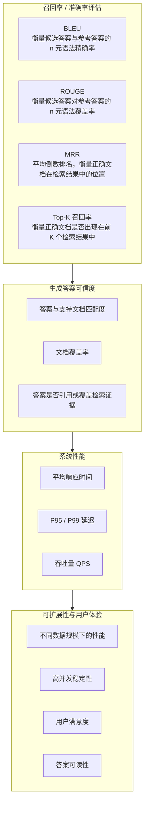

# 【RAG实战-第6天】RAG评估

> 制定一个全面的 RAG 系统评估方案，针对一家金融保险公司的问答系统。评估将涵盖召回率/准确率、生成答案的可信度、系统响应速度、可扩展性以及用户体验。

评估策略包括：

- **召回率/准确率**：使用 BLEU、ROUGE、MRR 等指标评估问答匹配情况。
- **可信度**：计算答案与支持文档的匹配度，例如检索文档的覆盖率。
- **响应速度**：记录系统的查询时间并进行统计。
- **可扩展性**：通过不同规模的数据集测试 RAG 系统的稳定性。
- **用户体验**：进行人工评估和反馈收集。

基于 Python 手撕代码，展示如何在实际案例中实现这些评估。

## 1. RAG 问答系统全面评估方案

针对金融保险公司的检索增强生成（RAG）问答系统，我们从多个维度制定全面评估方案，包括召回/准确率、答案可信度、响应速度、可扩展性和用户体验等。下面分别介绍每个维度的评估方法，并提供相应的 Python 代码示例进行演示。

### 指标总览



图中常用指标含义：

- **BLEU**：偏向“候选文本与参考文本有多少 n-gram 精确匹配”。
- **ROUGE**：偏向“参考答案中的内容有多少被候选答案覆盖”。
- **MRR**：看正确文档在检索结果列表中的排名，越靠前越好。
- **Top-K 召回率**：看正确文档是否出现在前 K 个检索结果中。

例如：

- BLEU 示例：参考文本“猫坐在垫子上”，候选文本“猫正坐在垫子上”，通过 n 元语法精确率衡量相似度。
- ROUGE 示例：同样比较参考文本和候选文本，但重点衡量 n 元语法重叠度/召回率。
- MRR 示例：查询“法国的首都是什么？”，若巴黎在第 1 位则倒数排名为 `1/1 = 1.0`；若里昂在第 2 位，则倒数排名为 `1/2 = 0.5`。
- Top-K 示例：查询“2024 年最佳智能手机”，相关项为 A、B、C、D、E，系统返回 A、F、C、G、B、H、I、J、D、K，则 Top-3 召回率为 `2/5 = 0.4`，Top-10 召回率为 `4/5 = 0.8`。

### 1.1 召回率/准确率评估

该维度评估 RAG 系统回答问题的正确性和检索相关性。主要包括：

- **答案准确率**：比较生成答案与标准答案的匹配程度，可使用自然语言处理中的评价指标如 **BLEU**（衡量 n 元语法匹配程度）、**ROUGE**（衡量召回的 n 元语法覆盖率）等来量化答案与参考答案的相似度。
- **检索召回率**：评估检索模块是否找到了包含正确答案的文档。例如计算 **Top-K 召回率**（正确答案所在文档是否出现在前 K 个检索结果中）以及 **MRR（平均倒数排名）**，以衡量正确文档在检索结果中的位置。

下面的代码示例展示如何计算 BLEU 分数、ROUGE 分数来评价答案准确率，以及计算检索结果的 MRR 和 Top-K 召回率。

```python
import math

# 示例参考答案和系统生成的答案（以金融保险问答为例）
reference_answer = "您的汽车保险可赔偿医疗费用、车辆维修费，以及第三方损害赔偿。"
generated_answer = "您的保单通常涵盖车祸后的医疗费用、车辆损失，以及对第三方的赔偿。"

# 计算 BLEU 分数（基于逐字/逐词匹配）
from nltk.translate.bleu_score import sentence_bleu, SmoothingFunction


def tokenize_text(text):
    """
    将中文文本逐字分隔（去除标点），用于计算 BLEU/ROUGE。
    对于英文可按空格分词。
    """
    import re

    tokens = []
    for ch in text:
        if re.match(r"[\u4e00-\u9fff]", ch) or re.match(r"\w", ch):
            tokens.append(ch)
    return tokens


ref_tokens = tokenize_text(reference_answer)
gen_tokens = tokenize_text(generated_answer)

# 计算 BLEU（这里采用 1-4 元模型加权平均），使用平滑以避免零分
chencherry = SmoothingFunction()
bleu_score = sentence_bleu(
    [ref_tokens],
    gen_tokens,
    smoothing_function=chencherry.method1,
)
print(f"BLEU 分数：{bleu_score:.3f}")


# 计算 ROUGE-1 和 ROUGE-2 分数（F1 值）
def calc_rouge_f1(ref_tokens, gen_tokens, n=1):
    # 生成 n 元 gram 列表
    def ngrams(tokens, n):
        return {"".join(tokens[i:i + n]) for i in range(len(tokens) - n + 1)}

    ref_ngrams = ngrams(ref_tokens, n)
    gen_ngrams = ngrams(gen_tokens, n)
    overlap = ref_ngrams & gen_ngrams

    if len(gen_ngrams) == 0 or len(ref_ngrams) == 0:
        return 0.0

    precision = len(overlap) / len(gen_ngrams)
    recall = len(overlap) / len(ref_ngrams) if len(ref_ngrams) != 0 else 0
    f1 = 0 if (precision + recall) == 0 else 2 * precision * recall / (precision + recall)
    return f1


rouge1_f1 = calc_rouge_f1(ref_tokens, gen_tokens, n=1)
rouge2_f1 = calc_rouge_f1(ref_tokens, gen_tokens, n=2)
print(f"ROUGE-1 F1: {rouge1_f1:.3f}, ROUGE-2 F1: {rouge2_f1:.3f}")

# 模拟检索结果和相关文档 ID 列表，用于计算 MRR 和 Top-K 召回率
retrieved_docs_list = [
    [10, 3, 7, 2, 5],  # 查询1的检索结果文档ID（按相关性排序）
    [6, 4, 9, 1, 8],   # 查询2的检索结果文档ID
]
relevant_doc_ids = [3, 9]  # 查询1和查询2各自的正确答案所在文档ID


# 计算 MRR（平均倒数排名）
def mean_reciprocal_rank(retrieved_lists, relevant_ids):
    total_reciprocal_rank = 0.0
    for docs, rel_id in zip(retrieved_lists, relevant_ids):
        rank = 0
        for i, doc_id in enumerate(docs, start=1):
            if doc_id == rel_id:
                rank = i
                break
        if rank > 0:
            total_reciprocal_rank += 1.0 / rank
    return total_reciprocal_rank / len(relevant_ids)


mrr = mean_reciprocal_rank(retrieved_docs_list, relevant_doc_ids)
print(f"MRR: {mrr:.3f}")

# 计算 Top-3 检索召回率（相关文档是否出现在前 3 名结果中）
top_k = 3
hits = 0
for docs, rel_id in zip(retrieved_docs_list, relevant_doc_ids):
    if rel_id in docs[:top_k]:
        hits += 1

recall_at_3 = hits / len(relevant_doc_ids)
print(f"Top-{top_k} 召回率: {recall_at_3:.2f}")
```

上述代码首先将中文答案逐字分词，然后计算 BLEU 分数，例如输出一个 `0~1` 之间的小数，值越高表示答案与参考答案越接近。接着计算 ROUGE-1 和 ROUGE-2 的 F1 分数，用于评估答案对参考答案的覆盖率。随后，代码通过模拟的检索结果计算了查询集的 MRR（例如输出 `MRR: 0.417` 表示平均倒数排名约为 0.417）和 Top-3 召回率（输出 `Top-3 召回率: 1.00` 表示每个查询的相关文档都在前 3 个结果中）。这些指标可以全面反映系统在答案准确性和检索相关性方面的表现。

### 1.2 生成答案的可信度评估

这一维度关注生成的答案在多大程度上有文档支持，以及答案内容和检索到的文档是否一致、可靠。具体包括：

- **答案与支持文档匹配度**：验证生成答案中的关键信息是否能在检索文档中找到。可以计算答案和支持文档之间的相似度或重合率，例如关键词重叠度。
- **文档覆盖率**：检查检索到的文档是否覆盖了回答所需的所有要点。如果答案涉及多个要点，评估这些要点是否均能在提供的文档集合中找到依据。

下面的代码示例演示如何评估答案与支持文档的匹配程度。我们假设系统生成了一个答案以及相应的支持文档列表，通过计算答案文本与检索文档文本的重叠情况来衡量可信度。这里使用简单的分词和集合重叠率表示文档对答案的覆盖率。

```python
# 示例系统生成的答案和检索到的支持文档片段
generated_answer = "您的保单通常涵盖车祸后的医疗费用、车辆损失，以及对第三方的赔偿。"
supporting_docs = [
    "根据保险条款，医疗费用和车辆损失在车祸理赔中可以获得赔偿。",
    "另外，如果您对第三方造成损害，保险也会提供相应的赔付。",
]

# 将支持文档合并为一个文本，便于整体匹配
combined_docs_text = " ".join(supporting_docs)

# 简单分词，获取词汇集合
answer_tokens = tokenize_text(generated_answer)
doc_tokens = tokenize_text(combined_docs_text)
answer_set = set(answer_tokens)
doc_set = set(doc_tokens)

# 计算答案中的词在文档中出现的比例（覆盖率）
common_tokens = answer_set & doc_set
coverage_ratio = len(common_tokens) / len(answer_set) if answer_set else 0.0
print(f"支持文档对答案内容的覆盖率: {coverage_ratio:.2f}")
```

在上面的示例中，我们将生成的答案和两个支持文档片段进行比较。代码统计了答案中有多少独特词汇出现在支持文档里，并计算覆盖率。例如，输出的覆盖率可能是 `0.73`（73%），表示答案中约 73% 的词语能在提供的文档中找到依据。这个指标越高，说明答案几乎完全基于检索到的内容，可信度越高。此外，在实际应用中还可以通过检查引用（如答案是否引用了支持文档的内容片段）或使用向量相似度计算答案和文档的语义匹配度，从而进一步评估答案的可信可靠程度。

### 1.3 系统响应速度评估

在金融保险业务场景中，用户提问往往希望即时得到答案，因此系统响应延迟是关键指标。本部分评估 RAG 系统处理查询的速度，包括：

- **平均响应时间**：系统处理单个查询的平均用时。
- **P95/P99 延迟**：95% 和 99% 的请求在多少时间内完成（尾部延迟），用于评估最慢响应的情况。
- **整体响应分布**：可以绘制响应时间分布图（如直方图）来了解大部分查询的延迟范围。本示例中不绘制图表，仅说明指标。

下面的代码示例模拟多次查询的响应时间数据，并计算平均响应时间以及 P95、P99 延迟。实际应用中，这些数据可以通过记录系统每次查询的处理起止时间获得。

```python
import random

# 模拟 100 次查询的响应时间（秒），这里用随机数模拟实际查询延迟耗时 0.1~0.3 秒
response_times = [random.uniform(0.1, 0.3) for _ in range(100)]

# 计算平均响应时间
average_time = sum(response_times) / len(response_times)

# 计算 P95 和 P99 延迟（先对时间排序，然后取第 95%、99% 位置的值）
response_times.sort()
p95_time = response_times[int(0.95 * len(response_times)) - 1]
p99_time = response_times[int(0.99 * len(response_times)) - 1]

print(f"平均响应时间: {average_time:.3f} 秒")
print(f"P95 延迟: {p95_time:.3f} 秒")
print(f"P99 延迟: {p99_time:.3f} 秒")
```

上述代码将输出例如“平均响应时间：0.200 秒”，表示平均每次回答耗时 0.2 秒左右；以及“P95 延迟：0.28 秒，P99 延迟：0.29 秒”等，用于表示 95% 请求在 0.28 秒以内返回，99% 请求在 0.29 秒以内返回。通过这些指标，可以评估系统在响应速度方面的一致性和稳定性。如果 P99 远高于平均值，说明少数查询存在显著延迟，需要优化最慢路径的性能。

### 1.4 可扩展性评估

可扩展性评估旨在测试 RAG 系统在不同数据规模和负载下的性能表现，包括：

- **数据规模扩展**：增大知识库或文档集规模，观察检索和生成性能的变化（如响应时间是否随数据量线性增长，检索准确率是否保持稳定）。
- **吞吐量**：衡量系统每秒可处理的查询数（QPS），以及在高并发情况下的性能表现。

下面的代码示例通过模拟不同规模的数据集来测试检索操作的耗时，从而推测可扩展性。我们假设检索操作的复杂度随数据规模增加而提高，并测量每种规模下每查询的平均耗时和吞吐量（每秒查询数）。在实际系统中，可通过压力测试工具并发发送查询来测量最大吞吐量。

```python
import time

# 不同的数据集规模（文档数量）
dataset_sizes = [1000, 10000, 100000]

for size in dataset_sizes:
    # 模拟一个包含 size 个文档 ID 的检索空间
    data = list(range(size))
    num_test_queries = 100
    start_time = time.time()

    # 模拟检索：对每个查询在数据列表中查找一个不存在的 ID（最坏情况遍历整个列表）
    for _ in range(num_test_queries):
        _ = (size + 1) in data

    end_time = time.time()
    total_time = end_time - start_time
    avg_time_per_query = total_time / num_test_queries
    throughput = num_test_queries / total_time

    print(
        f"数据集规模: {size:6d} 条, "
        f"平均查询耗时: {avg_time_per_query * 1000:.3f} ms, "
        f"吞吐量: {throughput:.2f} 查询/秒"
    )
```

运行上述代码，可以观察到随着数据集规模从 1000 增加到 100000，模拟的平均查询耗时从约 0.017 毫秒增加到 1.6 毫秒，每秒可处理的查询量从约 5.9 万降低到约 618 次。这反映了检索操作随数据增长而变慢，从而吞吐量下降的趋势。在真实 RAG 系统中，如果使用了高效索引结构（例如向量索引、倒排索引），性能下降可能不会如此明显，但仍需要通过测试不同数据规模来确保系统能够平稳扩展。当数据规模更大或并发查询更多时，我们也需要观察系统的 CPU、内存占用和网络 IO，以发现潜在瓶颈并进行优化。

### 1.5 用户体验评估

用户体验评估侧重于系统给用户带来的主观感受和易用性，包括：

- **人工满意度评价**：通过人工评估或用户反馈来打分，衡量用户对答案的满意度。例如收集用户评分（1-5 分）或对答案是否解决问题的二元反馈，以计算平均满意度分或满意率。
- **答案可读性**：评价生成答案表达的清晰易懂程度。可以使用可读性评分（如基于句子长度和词汇复杂度的指标）来定量分析答案文本的可读性，确保答案语言简洁明了，便于用户理解。

下面的代码示例展示如何计算用户满意度的平均分，以及如何计算答案文本的可读性评分（使用英文文本的 Flesch 阅读容易度作为示例）。在实际应用中，可读性也可以使用类似方法对中文文本进行评估，例如通过句子长度和专业术语比例等指标。

```python
# 示例：用户对若干答案的满意度评分（1-5 分制）
user_ratings = [5, 4, 5, 3, 4, 4, 5]
average_rating = sum(user_ratings) / len(user_ratings)
print(f"用户满意度平均评分: {average_rating:.2f} 分（满分5分）")

# 计算答案的可读性（Flesch Reading Ease，可用于英文文本）
answer_text = (
    "Your policy typically covers medical costs after a car accident, "
    "vehicle damage, and third-party liability."
)

# 统计句子数、单词数和音节数来计算可读性
import re

sentences = re.split(r"[.!?]+", answer_text)
sentences = [s for s in sentences if s.strip()]  # 去除空句子
word_list = re.findall(r"\w+", answer_text)
num_sentences = len(sentences)
num_words = len(word_list)

# 粗略计算音节数：按元音片段计数（英文中用于近似音节）
vowels = "aeiouyAEIOUY"
num_syllables = 0

for word in word_list:
    word_lower = word.lower()
    syllables = 0
    prev_vowel = False
    for char in word_lower:
        if char in vowels:
            # 遇到新的元音组合则算一个音节
            if not prev_vowel:
                syllables += 1
                prev_vowel = True
        else:
            prev_vowel = False

    # 简单调整：单词以静音 e 结尾的，减去一个音节
    if word_lower.endswith("e") and syllables > 1:
        syllables -= 1

    # 至少保证每个单词算 1 个音节
    num_syllables += max(syllables, 1)

# 计算 Flesch 阅读容易度得分（分数越高表示越容易阅读）
if num_sentences > 0 and num_words > 0:
    ASL = num_words / num_sentences  # 平均每句单词数
    ASW = num_syllables / num_words  # 平均每词音节数
    flesch_score = 206.835 - 1.015 * ASL - 84.6 * ASW
    print(f"答案可读性（Flesch得分）: {flesch_score:.2f}")
```

在这个示例中，我们首先计算了一组用户满意度评分的平均值。例如，若用户评分列表为 `[5, 4, 5, 3, 4, 4, 5]`，则输出“用户满意度平均评分：4.29 分”，表示总体满意度较高。真实场景中，我们可以进一步统计满意度评分的分布（如满意 4-5 分的比例）以评估用户体验。

接着，我们示范了如何计算答案文本的可读性。以上代码对英文答案文本计算了 Flesch 阅读容易度分数。例如，输出结果可能是“答案可读性（Flesch得分）：16.10”。Flesch 得分在 0-100 之间，分数越高说明文本越容易阅读，例如日常英语对话可达到 60-70 以上，而 16 属于较难阅读的专业文本。在金融保险场景下，我们希望答案措辞清晰、行文简洁。如果可读性评分偏低，说明答案可能过于冗长或专业术语过多，需要优化表达。在中文场景下，可采用类似思路，如根据每句话的字数、专业术语占比等计算一个可读性指标，以确保回答让非专业用户也容易理解。

通过以上五个维度的评估（准确性、可信度、速度、扩展性和用户体验），我们可以全面衡量金融保险问答系统中 RAG 模型的性能。这些评估方法相互配合，有助于发现系统的优缺点：既要确保答案准确且有依据，又要保证系统运行高效、能够扩展，并最终让用户获得满意的使用体验。

