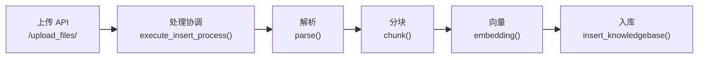
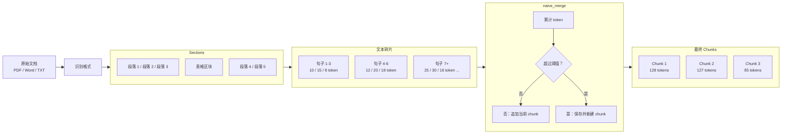

# 【RAG实战-第8天】实战项目的简历准备、面试、运用（离线解析模块）

> 我们之前讲解过 RAG 的问题解决方案，讲解了实战项目，也讲了简历怎么写。今天把这些内容串联起来。

我们从以下 5 个方面展开：

- **存在问题**：基础 RAG 存在的问题 + Case 举例，这部分就是你简历/工作中遇到的问题。
- **如何解决**：实战代码是如何解决的，也就是你是如何解决的。
- **简历书写**：简历中应该怎么写。
- **面试问题**：面试中该怎么说、怎么回答。
- **实践运用**：实际工作中怎么做。

配套内容：

- 【RAG实战-第1天】RAG优化方案：案例+代码+图解
- 【RAG实战-第5天】核心代码详解

本篇围绕 3 个模块讲解：

- 离线解析
- 在线问答
- query 处理

## 1. 解析模块

### 1.1 存在问题

- **多格式文档解析挑战**：金融保险公司的知识库包含 PPT、PDF、纯文本甚至视频等多种格式。这些格式结构各异，需要统一解析。例如 PDF 可能有多栏排版或扫描版（无文本层），PPT 通常以幻灯片形态组织，视频需要语音识别提取文本。解析不当会导致内容丢失或错乱，影响后续检索。
- **OCR 解析质量**：针对扫描版 PDF 或图片，必须通过 OCR 获取文字。普通 OCR 往往难以正确还原表格、代码块等特殊结构，可能将表格内容串行为无序文本、破坏代码格式，从而降低检索准确性。需要优化 OCR 策略，对表格和代码段做特殊处理，确保文本提取高保真。
- **层级结构保持**：文档往往有层次结构（章节、子章节、要点等）。如果分块时丢失层级和上下文关联，子内容可能在检索时缺乏上文语境，影响相关性。需在分块时保留层级信息，例如将小节内容与所属上级标题关联，作为标签元数据。这有助于检索阶段利用上下文提高召回的准确度，让片段携带其来源的主题语境。

#### CASE：多格式文档解析挑战

案例：某保险公司有一份产品说明文档，包含 PPT、PDF 和扫描版合同。

**原始解析效果（错误示例）：**

- **PPT：**
  - 原始内容（幻灯片中图片信息）：

```text
保险产品 A
- 保障范围：重大疾病、意外伤害
- 最高赔付额度：500,000 元
```

  - 传统 parse 解析后错误示例：图片信息无法提取，结果为空。
  - 问题：**解析不了图片**。

**PDF 多栏排版解析错误案例（影响 RAG 效果）：**

原始 PDF 内容为多栏排版。

第一页：

```text
[左栏]                         [右栏]
理赔流程                       申请人需提交以下材料：
事故发生后，尽快联系保险公司     - 身份证复印件
提供医院出具的诊断证明           - 保险合同复印件
保险公司审核并作出赔付决定       - 医院诊断证明
```

第二页：

```text
[左栏]                         [右栏]
特殊情况处理                   额外要求：
交通事故需提供交警事故责任认定书  - 交警事故认定书
重大疾病保险理赔需提供住院病历    - 住院病历、手术记录
```

错误解析示例（按行顺序拼接）：

```text
理赔流程 申请人需提交以下材料：
事故发生后，尽快联系保险公司 - 身份证复印件
提供医院出具的诊断证明 - 保险合同复印件
保险公司审核并作出赔付决定 - 医院诊断证明
特殊情况处理 额外要求：
交通事故需提供交警事故责任认定书 - 交警事故认定书
重大疾病保险理赔需提供住院病历 - 住院病历、手术记录
```

#### RAG 影响分析

1. **逻辑混乱，影响召回准确性**

- 在 RAG 过程中，如果用户查询“理赔需要提交哪些材料？”
  - 正确解析：应该返回“申请人需提交以下材料：身份证复印件、保险合同复印件、医院诊断证明”。
  - 错误解析：理赔步骤和材料混杂，查询时可能无法正确关联“材料提交”的部分，影响用户体验。

2. **语义割裂，导致不完整召回**

- 错误解析后，“特殊情况处理”和“额外要求”被拆散，不再形成上下文关联。
- 如果用户查询“重大疾病理赔需要提供什么材料？”

```text
重大疾病保险理赔需提供住院病历
- 住院病历、手术记录
```

- 问题：这一块内容和“特殊情况处理”断开，RAG 可能无法识别它是特殊情况的一部分，导致查询时无法关联到正确规则。

3. **影响检索和排序**

- RAG 召回时，通常会利用 chunk 之间的上下文关系。
- 正确解析应该确保“理赔流程 -> 材料提交 -> 额外要求”这些部分具有层次结构。
- 错误解析直接拼接后，RAG 可能会把“材料提交”误当成“理赔流程”的一部分，导致召回结果不准确。

#### 正确的解析方案

应该按照**逻辑结构**而非**文本顺序**解析 PDF：

```text
理赔流程：
1. 事故发生后，尽快联系保险公司
2. 提供医院出具的诊断证明
3. 保险公司审核并作出赔付决定

申请人需提交以下材料：
1. 身份证复印件
2. 保险合同复印件
3. 医院诊断证明

特殊情况处理：
1. 交通事故需提供交警事故责任认定书
2. 重大疾病保险理赔需提供住院病历

额外要求：
1. 交警事故认定书
2. 住院病历、手术记录
```

原始问题：**OCR 后的排序问题**。

经过处理后，在 RAG 过程中，查询“理赔材料”或“特殊情况理赔”时，能准确获取完整上下文，提高召回精度。

#### 表格和代码解析问题

案例：某保险公司有一份包含保单条款的扫描版 PDF，带有表格和代码示例。

原始内容（表格格式）：

```text
| 险种 | 最高赔付 | 免赔额 |
|------|----------|--------|
| A款  | 500,000  | 5,000  |
| B款  | 300,000  | 3,000  |
```

OCR 解析后错误示例：

```text
险种 最高赔付 免赔额 A款 500000 5000 B款 300000 3000
```

问题：**表格结构丢失**，所有数据串在一起，难以辨识字段和对应值。

原始内容（代码示例）：

```python
def calculate_payout(amount, deductible):
    return max(amount - deductible, 0)
```

OCR 解析后错误示例：

```text
def calculate payout(amount deductible)
return max amount - deductible 0
```

问题：**代码缩进、符号和结构丢失，导致代码不可读**。

### 1.2 代码中如何解决

我们要核心解决几个问题：

1. 各种格式的文件实在太多了。
2. 图片信息丢失。
3. 表格格式全乱。
4. 传统解析解析出来全是字符串，失去了原来 PDF 里的 layout（布局）和层级机构。

#### 离线解析整体链路



核心入口通常从 `chunk()` 函数开始，根据不同文件格式建立不同的处理 pipeline。

```python
def chunk(filename, binary=None, from_page=0, to_page=100000, callback=None, **kwargs):
    if re.search(r"\.(txt|py|js|java|c|cpp|h|php|go|ts|sh|cs|kt|sql)$", filename, re.IGNORECASE):
        callback(0.1, "Start to parse.")
        sections = TxtParser()(filename, binary,
                               parser_config.get("chunk_token_num", 128),
                               parser_config.get("delimiter", "\n!?;。；！？"))
        callback(0.8, "Finish parsing.")

    elif re.search(r"\.(md|markdown)$", filename, re.IGNORECASE):
        callback(0.1, "Start to parse.")
        sections, tables = Markdown(int(parser_config.get("chunk_token_num", 128)))(filename, binary)
        res = tokenize_table(tables, doc, is_english)
        callback(0.8, "Finish parsing.")

    elif re.search(r"\.(html|htm)$", filename, re.IGNORECASE):
        callback(0.1, "Start to parse.")
        sections = HtmlParser()(filename, binary)
        sections = [(s, "") for s in sections if s]
        callback(0.8, "Finish parsing.")

    elif re.search(r"\.json$", filename, re.IGNORECASE):
        callback(0.1, "Start to parse.")
        chunk_token_num = int(parser_config.get("chunk_token_num", 128))
        sections = JsonParser(chunk_token_num)(binary)
        sections = [(s, "") for s in sections if s]
        callback(0.8, "Finish parsing.")

    elif re.search(r"\.docx$", filename, re.IGNORECASE):
        callback(0.1, "Start to parse.")
        binary = BytesIO(binary)
        doc_parser = parser.from_buffer(binary)
        if doc_parser.get("content", None) is not None:
            sections = doc_parser["content"].split("\n")
            sections = [(s, "") for s in sections if s]
            callback(0.8, "Finish parsing.")
```

对于 PDF，会进入 `Pdf()` 解析器：

```python
elif re.search(r"\.pdf$", filename, re.IGNORECASE):
    pdf_parser = Pdf()
    if parser_config.get("layout_recognize", "DeepDOC") == "Plain Text":
        pdf_parser = PlainParser()
    sections, tables = pdf_parser(
        filename if not binary else binary,
        from_page=from_page,
        to_page=to_page,
        callback=callback,
    )
```

此处对不同格式的文件建立不同处理 pipeline，重点处理：

- 图片
- 表格
- 布局分析

#### PDF 解析器代码详细分析

这段代码是一个 PDF 文档解析器的核心实现，主要负责从 PDF 文件中提取文本、图像和表格信息。

##### `__call__` 方法

输入参数：

- `filename`：文件路径，如 `/path/to/document.pdf`
- `binary`：二进制文件内容，如果提供则优先使用
- `from_page`：起始页码，默认为 0
- `to_page`：结束页码，默认为 100000
- `zoomin`：缩放倍数，用于 OCR，默认为 3
- `callback`：进度回调函数，用于通知调用者处理进度

输出：

- 返回一个元组：`(文本框列表, 表格列表)`
  - 文本框列表：每个元素为 `(文本内容, 标签)`
  - 表格列表：提取的表格数据

作用：

这是 PDF 解析器的主入口方法，协调整个 PDF 解析流程，包括 OCR 识别、布局分析、表格识别和文本处理。

```python
pdf_parser = Pdf()
text_boxes, tables = pdf_parser(
    "example.pdf",
    from_page=0,
    to_page=5,
    callback=progress_callback,
)
```

##### `__images__` 方法

函数深度解析实现以下链路：

1. 自适应处理：根据处理结果动态调整参数（如缩放倍数）。
2. 语言检测：自动识别文档的主要语言。
3. 鲁棒性处理：对各种异常情况有适当的处理机制。
4. 数据准备：为后续的布局分析和文本提取做好数据准备。

##### `_layouts_rec` 方法

输入参数：

- `zoomin`：缩放倍数

输出：

- 无直接返回值，但会在对象内部更新布局识别结果。

作用：

对提取的图像进行布局识别，确定页面上文本块、图像和表格的位置关系。

```python
# 在 __call__ 方法内部被调用
self._layouts_rec(3)
# 此时对象内部已经保存了布局分析结果
```

##### `_table_transformer_job` 方法

输入参数：

- `zoomin`：缩放倍数

输出：

- 无直接返回值，但会在对象内部设置表格识别结果。

作用：

使用深度学习模型对页面中的表格进行结构化识别，提取表格的行列结构和单元格内容。

```python
# 在 __call__ 方法内部被调用
self._table_transformer_job(3)
# 此时对象内部已经保存了表格结构识别结果
```

##### `_text_merge` 方法

函数深度解析实现以下链路：

1. **布局感知**：函数考虑了文本框的布局属性（`layoutno`），确保只合并属于同一布局区域的文本。
2. **类型过滤**：对特殊内容类型（表格、图像、公式）进行过滤，不参与普通文本合并。
3. **几何特性利用**：使用文本框的位置信息（垂直距离）判断是否属于同一行。
4. **自适应阈值**：使用页面平均文本高度的比例作为阈值，适应不同文档的字体大小。
5. **内容合并**：直接拼接文本内容，不添加额外空格或分隔符。

##### `_extract_table_figure` 方法

函数深度解析实现以下链接：

1. **内容分离**：将表格和图像从文本中分离出来，使后续处理更加专门化。
2. **结构保留**：保留表格的结构信息，通过 HTML 或其他表示方式存储。
3. **多模态处理**：同时处理文本和图像内容，提供更丰富的文档理解。
4. **位置感知**：保留内容在原始文档中的位置信息，便于后续引用和展示。
5. **跨页处理**：能够识别和合并跨越多个页面的表格，这在复杂文档中非常重要。

##### `_concat_downward` 方法

函数深度解析实现以下链接：

1. 合并文本内容，在需要时添加空格。
2. 更新合并后文本框的几何属性（边界、页码等）。
3. 保留和合并语义属性（如布局类型）。
4. 最后按垂直位置对文本框进行排序，保持文本阅读顺序。

#### 完整处理流程示例

假设有一个 PDF 文件 `financial_report.pdf`，包含文本、表格和图像：

```python
# 初始化解析器
pdf_parser = Pdf()

# 定义进度回调函数
def progress_callback(progress=None, msg=None):
    if progress:
        print(f"处理进度：{progress * 100:.1f}%")
    if msg:
        print(f"处理信息：{msg}")

# 调用解析器处理 PDF
text_boxes, tables = pdf_parser(
    "financial_report.pdf",
    from_page=0,
    to_page=10,
    zoomin=3,
    callback=progress_callback,
)

# 处理提取的文本
for text, tag in text_boxes:
    print(f"文本：{text[:30]}... 位置：第{tag['page']}页，{tag['position']}")

# 处理提取的表格
for i, table in enumerate(tables):
    print(f"表格 {i + 1}:")
    print(f"行数：{len(table['rows'])}")
    print(f"列数：{len(table['columns'])}")
    print(f"标题：{table.get('title', '无标题')}")
```

该解析器处理流程如下：

1. 从 PDF 提取图像并进行 OCR 识别。
2. 进行页面布局分析，识别文本块、图像和表格区域。
3. 识别表格结构和内容。
4. 合并相关文本块。
5. 提取表格和图表。
6. 连接垂直相关的文本。
7. 返回处理后的文本框和表格列表。

#### 解析模块的技术价值

- **高保真 OCR**：结合 OCR 与版面分析，尽量保留扫描版 PDF、图片和表格中的结构。
- **结构化还原**：将表格、标题、图像和正文区分开，避免全部变成无序字符串。
- **表格结构保留**：整合开源表格检测模型，实现对复杂表格的结构化还原，通过 HTML/JSON 存储表格数据，保证检索时的可复用性。
- **与 RAG 对接**：将解析后文本与向量索引引擎对接，提升大模型语言模型的知识覆盖度与答案准确度，并通过采样评估与日志监控持续优化解析流程。

### 1.3 简历中怎么写

建议写一个 bullet point 即可：

> **文件解析**：设计并实现多格式文档解析 pipeline 流程，结合 OCR 与深度学习模型识别表格、图片并保留层级布局信息，对文本进行策略分块与语义分块，为 RAG 检索提供高保真资料。

也可以展开成简洁型、描述型、项目成果型和要点概括型。

#### 示例一：简洁型

- **多格式文档解析**：基于 OCR、表格识别和布局分析，实现对 PDF、Word、扫描图像等多种格式的高保真文本提取；保留章节层级、表格与代码块结构，为 RAG 检索提供准确的内容来源。
- **OCR 优化**：对低分辨率或扫描版文档进行图像预处理，提高文本识别准确率，减少排版错乱。
- **结构化切分**：设计语义分块策略，结合文档标题、段落和上下文，将长文档切分为逻辑完整的块并附带元数据，显著提高检索与回答的相关性。
- **表格还原**：使用深度学习模型识别表格结构，将识别后的数据转换为 JSON/CSV 等格式，保留行列信息，方便下游数据处理或查询。

#### 示例二：描述型

- **文档解析管线**：主导多格式文档解析模块的设计与实现，针对 PDF、PPT、扫描版合同等不同输入，动态调用 OCR 或解析库提取文本、表格、图像等内容。
- **精准 OCR 策略**：采用图像增强与分块识别技术，解决低清晰度、表格/代码布局复杂等场景下的文本提取难题，有效降低识别错误率。
- **分块与标签体系**：建立基于自然段或语义的 Chunk 切分算法，并在每个 Chunk 上附加文档层级信息（章节、段落、页码），支持 RAG 阶段的上下文检索与可追溯性。
- **表格结构保留**：整合表格检测模型，实现对复杂表格的结构化还原，通过 HTML/JSON 存储表格数据，保证检索时的可复用性。
- **与 RAG 对接**：将解析后文本与向量索引引擎对接，提升大语言模型的知识覆盖度与答案准确度。

#### 示例三：项目成果型

项目名称：金融保险知识库 RAG 系统

- **项目背景**：面向保险业务的知识库建设，文档类型涵盖扫描版 PDF、保单条款、内部培训 PPT、财务报表等多种格式。
- **我的职责**：
  - 设计并实现多格式文档解析管线：使用 Python + OCR 引擎 + Layout 分析模型，实现对文档的文本、表格、图像、标题层级的自动提取。
  - 优化 OCR 准确率：引入图像预处理与小模型微调，识别准确率提升 10%+。
  - 语义切分与层级标注：根据章节标题与段落语义分块，保留文档上下文信息，便于向量检索与生成模型使用。
  - 表格与代码块还原：集成表格识别模型，对大型 PDF 中的报表和代码示例进行结构化提取并存储为可检索格式。
  - 评估与监控：通过指标（OCR 准确率、表格还原率、RAG 召回率）和日志体系监控解析质量，定期迭代升级模型和算法。
- **项目成效**：
  - 系统完成后，保险客户理赔案例查询效率提升 40%，减少了大量人工检索工作量。
  - RAG 问答正确率显著提高，特别在表格数据与跨页内容的检索上，准确度大幅增强。

#### 示例四：要点概括型

- **文件解析模块**：构建多线程文档解析服务，可自动识别并处理常见文档格式（PDF、Word、PPT、HTML、OCR 图片），提取文本、表格及元信息。
- **OCR & 版面分析**：集成开源 OCR 引擎与自研版面分析算法，兼容多语言和多列排版，降低误识别导致的召回偏差。
- **可配置化切分与标注**：允许通过配置文件灵活调整 Chunk 最大长度、分段策略以及层级标签，对跨页内容实现合并。
- **表格解析**：利用深度学习 Table Transformer 识别并还原表格结构，支持表格在 RAG 检索中的精确引用。
- **集成监控**：实现对解析服务的实时监控和日常抽检，若出现严重错误则进行降级处理（回退到仅提取纯文本）。

使用建议：

1. **根据经验权重**：如果你的主要贡献集中在 OCR、表格识别，就多写细节；如果更侧重流程设计与项目管理，就可以突出架构和团队协作。
2. **突出量化成果**：能量化的地方尽量量化，如“识别准确率提升 15%”、“处理效率提升 2 倍”等。
3. **结合关键词**：在简历上多用与目标岗位相关的关键词，例如“RAG”、“OCR”、“表格检测”、“语义切分”、“向量检索”等，方便简历筛选和引起面试官关注。

### 1.4 面试中怎么问

#### 问题 1

在 RAG 的流程中，文档解析的核心价值是什么？如果解析不当，会带来哪些具体影响？

**示范性回答：**

在 RAG 体系里，文档解析是将原始文档转换为可检索内容的第一步，对后续向量检索和生成式模型至关重要。它的核心价值在于：

1. **提取关键信息**：准确地从文档中获取可用文本、结构化数据以及上下文关系。
2. **保留文档结构**：对章节层次、表格、列表等结构的保留能帮助检索阶段更精准地定位答案。
3. **保证文本质量**：减少 OCR 或编码格式导致的噪音与错误，从而提高检索召回的精确度。

如果解析不当，容易导致：

- **召回错误或缺失**：信息被遗漏或文本打乱后，检索阶段就很难拿到正确答案。
- **上下文扭曲**：段落或跨页内容被拆分错位，模型生成时会出现无关或错误回答。
- **系统不稳定**：质量很差的解析结果可能在下游产生连锁反应，导致用户体验下降。

#### 问题 2

面对不同格式（如 PDF、Word、扫描图片）的文档，你会如何设计一个统一的解析流程？

**示范性回答：**

一个健壮的多格式解析流程通常包含以下步骤：

1. **格式识别与路由**：先根据文件类型（PDF、DOCX、图片、HTML 等）将文档路由给不同解析子模块。
2. **文本抽取**：
   - PDF/Word：使用现成解析库或自研工具来获取文本内容和粗略排版信息。
   - 扫描版 PDF/图片：通过 OCR 引擎识别文本，并尽量恢复段落、表格或公式等结构。
3. **布局和结构化处理**：利用布局分析或者自然语言处理手段恢复文档层级和排版，对表格、标题、列表等进行拆分或标注。
4. **切分与清洗**：在提取内容基础上进行去噪（比如去除页眉页脚、重复水印等），并按照自然段或逻辑单元做分块。
5. **元数据标注**：给每个切分后的片段添加文档名、章节标题、页码等元数据，方便后续检索和溯源。

通过这种分层式设计，每种格式的解析都能独立迭代升级，也能保证下游 RAG 模块始终接收相对干净和可控的文本内容。

#### 问题 3

很多文档是扫描版的，需要 OCR 才能识别文本。你在实践中如何最大化提高 OCR 识别的准确率和保真度？

**示范性回答：**

提高 OCR 识别的准确率和保真度，主要从以下方面入手：

1. **图像预处理**：在 OCR 之前进行去噪、增强对比度、纠偏等操作，减少因扫描质量造成的识别错误。
2. **分块识别**：针对文档中的表格、公式、文本区域，采用分块方式单独识别并保留其结构，而不是一次性把整页识别完。
3. **OCR 引擎选择**：结合场景特点（如语种、字体）选择适配性高的 OCR 模型，有些模型对手写体或模糊文字有更好的鲁棒性。
4. **字典和语言模型约束**：基于领域词库（例如医学术语、财会术语）对 OCR 输出做二次校正，修正常见拼写和字符混淆。
5. **多通道对比**：对重要文档，可能用不同 OCR 引擎并对结果进行对比或融合，尽量降低漏识别或误识别概率。

#### 问题 4

有些文档在结构上比较复杂，比如有多层嵌套标题、表格、图例、脚注等。你在解析后，如何保证在检索阶段还能保持一定的层级信息？

**示范性回答：**

要在检索阶段还能利用层级信息，需要在解析阶段做以下工作：

1. **结构化存储**：将文档各个章节、子章节的标题层级以及表格、图例的位置都转换成可索引的元数据，例如使用 JSON、XML 或数据库字段存储。
2. **Chunk 附带上下文**：在每个 Chunk 的属性里记录其在文档中的位置（页码、章节索引）以及父子关系（上级标题、下级标题），必要时也可以记录所有祖先节点的名称。
3. **检索策略**：对查询做匹配时，可以先通过 Chunk 的文本向量相似度检索出候选结果，再根据层级信息做二次过滤或排序。例如用户想查“第二章里的某个概念”，就可以优先考虑第二章内的 Chunk。
4. **可视化回溯**：将答案呈现给用户时，可以用层级信息告诉用户“本段内容位于第 3 节第 2 小节”，让用户更好理解上下文并找到原文位置。

#### 问题 5

如果我们要评估“文档解析”这个步骤的质量，或者上线后持续监控它，该从哪些维度来衡量？

**示范性回答：**

在 RAG 场景下，文档解析质量会直接影响检索和生成效果，可以考虑以下维度：

1. **OCR 准确率**：统计从图片或扫描 PDF 中提取的文本与人工校对文本的差异（字符级或词级错误率）。
2. **段落完整度**：对自然段、列表或表格进行完整性对比，看是否有切分过度或拼接错误。
3. **结构保真度**：如果文档包含表格、分栏、多级标题等结构，评估解析后是否能正确保留和表示。
4. **检索测试**：在线上阶段，用一组真实查询对解析结果做向量检索，查看召回率和准确率是否符合预期。
5. **可溯源性**：是否能通过解析后的结果快速定位到文档原始位置（页码、段落），这也可以作为衡量解析质量的一个指标。

定期采样一些文档和用户查询进行人工审查和打分，结合自动化统计，可以帮助我们持续改进解析流程并确保其在规模化使用场景下的可靠性。

### 1.5 实际工作怎么运用

下面是一个关于如何在自己项目中集成 `Pdf` 解析器，并在提取到的文本块（chunks）中实现标题检测与标注的思路说明。分为两个部分：**基础用法**和**标题检测及标注**。

#### 1.5.1 基础用法：将解析逻辑整合到自己项目

将相关模块（也就是 service 文件夹，如 `Pdf` 类）放入 Python 环境或项目依赖中，就可以像下面这样在自己的项目中调用。

```python
from service.ragflow.rag.app.naive import Pdf


def parse_pdf_document(pdf_path: str, from_page: int = 0, to_page: int = 10):
    """
    调用 Pdf 解析器并返回解析后的文本框和表格信息
    """
    pdf_parser = Pdf()

    text_boxes, tables = pdf_parser(
        filename=pdf_path,
        from_page=from_page,
        to_page=to_page,
        zoomin=3,
        callback=None,
    )

    return text_boxes, tables


if __name__ == "__main__":
    result_text_boxes, result_tables = parse_pdf_document(
        pdf_path="your_pdfs/financial_report.pdf",
        from_page=0,
        to_page=10,
    )

    for idx, (text, metadata) in enumerate(result_text_boxes[:5], start=1):
        print(f"[文本块 {idx}]:")
        print("内容:", text)
        print("元数据:", metadata)
        print("-" * 40)
```

在你的项目里，可以根据自身架构，将以上示例整合到服务层、控制器层或业务逻辑中。多数情况下，只需要这样简单地调用 `Pdf` 类的 `__call__` 方法，即可完成对 PDF 文档中文字、表格与布局要素的解析。

#### 1.5.2 进一步进行标题检测并给 chunk 增加标题标签

若想在解析完成后，对结果进行**标题检测**并给文本块打上“标题”或其他特定标签，可以考虑以下思路：

1. **利用现有的布局分析**：当 `Pdf` 解析完成后，`self.boxes` 中通常会包含 `layout_type`、`layoutno` 等属性。有时解析器会将标题、正文、图表标题、页眉页脚等用不同 `layout_type` 标识。
2. **基于简单规则或机器学习的标题检测**：如果原生 `layout_type` 不足以区分标题，可以自行扩展规则或模型：
   - 基于正则：判断文本是否只有极少量文字，或是否以数字和点开头（如 `1. 概述`），再结合字体大小、加粗等信息识别可能的标题。
   - 基于机器学习：训练标题检测模型，对文本块大小、位置、字体、关键词等特征进行判断。
3. **在 chunk 上增加标签**：解析后，`text_boxes` 形如 `[(text, tagInfo), ...]`。若想给它增加标题标签，可在后处理阶段添加。

```python
new_text_boxes = []

for text, metadata in text_boxes:
    if metadata.get("layout_type") == "title":
        new_metadata = {**metadata, "is_title": True}
    else:
        new_metadata = {**metadata, "is_title": False}

    new_text_boxes.append((text, new_metadata))
```

也可以写一个简化函数：

```python
def mark_titles_in_chunks(text_boxes: list) -> list:
    """
    输入：经过 Pdf 解析并合并后得到的 text_boxes 列表 [(text, metadata), ...]
    输出：增加了标题标记的列表
    """
    result = []

    for text, meta in text_boxes:
        if len(text.strip()) < 20 and text.strip().endswith(":"):
            meta["is_title"] = True
        else:
            meta["is_title"] = False
        result.append((text, meta))

    return result
```

主程序里可以这样调用：

```python
from your_project.pdf_integration import parse_pdf_document
from your_project.post_process import mark_titles_in_chunks


text_boxes, tables = parse_pdf_document("some_report.pdf")
text_boxes_with_title = mark_titles_in_chunks(text_boxes)
```

更多细节：

- 如果需要更精准的标题识别，可以挖掘解析器中的 `layout_type`、`fontname`、`font_size` 等字段，或者在 `_layouts_rec` 过程中插入自定义逻辑。
- 也可以在 `_table_transformer_job` 或 `_text_merge` 后，对特定模式（如关键词、正则）的文本进行标注。

集成流程可以概括为：

1. 先在项目中引入 `Pdf` 类，然后直接调用其 `__call__` 方法或封装一个函数来解析 PDF，并返回文本块与表格结果。
2. 标题标注思路：
   - 查看已有的 `layout_type` 信息；
   - 编写简单规则（正则/关键字）或使用机器学习模型对文本块进行额外判断；
   - 在后处理阶段给每个 chunk 增加 `is_title` 等标记，以此实现标题与正文区分。
3. 进一步优化：
   - 在自己的使用场景中，观察 badcase 属于 OCR、排序还是识别模块，再进入对应部分进行修改。

## 2. Chunk 切分模块

### 文档切块（Chunking）流程



### 2.1 存在问题

1. 表格/图片的标题和对应模块没有对应上。
2. 一个完整的段落、句子被切分开了，完整语义没了。
3. 一个完整文章有不同层级结构，有不同的标题、小标题。如果不管规则、语义直接切分，章节标题就会丢失。

#### CASE：解析效果不好的例子

下面给出 3 个实际的“解析效果不好”的示例，用来说明常见问题。

##### 1. 表格/图片的标题和对应模块没有正确关联

原始文档内容示例：

```text
2.2 实验结果与讨论
表 1 本次实验的主要数据统计

+------+----------+----------+
| 序号 | 数据值   | 备注     |
+------+----------+----------+
| 001  | 23.7     | 正常     |
| 002  | 19.6     | 待观察   |
| 003  | 30.2     | 波动较大 |
+------+----------+----------+

结合上述实验数据可以得知，本次实验的数据分布存在一定的波动性，……
```

不良解析后的结果示例：

- 段落 1：`2.2 实验结果与讨论`
- 段落 2：`表 1 本次实验的主要数据统计`
- 段落 3：`结合上述实验数据可以得知，本次实验的数据分布存在一定的波动性，……`
- 表格内容被识别成若干行无意义碎片，或者直接被删除/丢失。

在这个解析结果里：

- `表 1` 的标题与后面的表格内容脱节，造成“标题”和“表格”不在同一模块。
- 表格内容要么被打散到多行，要么干脆缺失。

##### 2. 完整段落或句子在不恰当的位置被拆分

原始文档内容示例：

```text
通过对多个实验场景的分析，我们发现，在同等环境条件下，
使用算法A可以将预测准确率从85%提高到90%以上；
与算法B相比，算法A的训练时间也更短。
```

不良解析后的结果示例：

- 段落 1：`通过对多个实验场景的分析，我们发现，在同等环境条件下，使用算法A可以将预测准确率从85%提高到90%以上；`
- 段落 2：`与算法B相比，算法A的训练时间也更短。`

这里原本是一个完整句子或段落，结果被拆分成两个片段，造成阅读和理解上的割裂。尤其在有些场景下，这种拆分还会出现更糟糕的断句，让第一段和第二段的上下文衔接变得不清晰。

##### 3. 各层级标题/小标题丢失，文章结构被破坏

原始文档内容示例：

```text
第一章 绪论
1.1 研究背景
在网络环境中，不同特征的数据分布……
1.2 研究目的
本研究旨在提升模型的泛化能力……
```

不良解析后的结果示例：

- 段落 1：`第一章 绪论 1.1 研究背景 在网络环境中，不同特征的数据分布…… 1.2`
- 段落 2：`研究目的 本研究旨在提升模型的泛化能力……`

在这个解析结果里：

- “第一章 绪论”被与“1.1 研究背景”拼到了一起，丢失了原本清晰的层级结构。
- “1.2 研究目的”也没能保持独立小标题，而是被并入上一段尾部。
- 原文的分章节、分小节的层级线索消失了，阅读和理解难度大幅提升。

以上三个示例分别演示了：

1. 表格/图片的标题与其内容被割裂。
2. 完整的段落/句子在不恰当的位置被拆分。
3. 原本存在的章节标题层次在解析后丢失。

这些都是常见的“解析效果不佳”案例，会直接导致文档结构及语义混乱。

### 2.2 代码中如何解决

核心从 `naive_merge` 的逻辑入手。它本质上是一个面向 Token 数的文本分段函数：当累计的 Token 数超过 `chunk_token_num` 时，就额外新建一个 chunk。

```python
def naive_merge(sections, chunk_token_num=128, delimiter="\n。；！？"):
    if not sections:
        return []
    if isinstance(sections[0], type("")):
        sections = [(s, "") for s in sections]

    cks = [""]
    tk_nums = [0]

    def add_chunk(t, pos):
        nonlocal cks, tk_nums, delimiter
        tnum = num_tokens_from_string(t)
        if not pos:
            pos = ""
        if tnum < 8:
            pos = ""

        if tk_nums[-1] > chunk_token_num:
            if t.find(pos) < 0:
                t += pos
            cks.append(t)
            tk_nums.append(tnum)
        else:
            if cks[-1].find(pos) < 0:
                t += pos
            cks[-1] += t
            tk_nums[-1] += tnum

    for sec, pos in sections:
        add_chunk(sec, pos)

    return cks
```

这段函数的工作原理：

1. **输入格式处理**
   - 函数接受一个名为 `sections` 的列表，列表里每个元素可以是字符串，也可以是 `(文本, 附加位置信息)` 这样的元组。
   - 如果检测到 `sections[0]` 直接是字符串类型，就将整个列表统一转成 `[(文本, ""), ...]` 的形式，保证后续处理逻辑一致。

2. **初始化**
   - 创建空列表 `cks = [""]`，表示当前累积的 chunk 只有一个空字符串。
   - 创建与之对应的 `tk_nums = [0]`，表示每个 chunk 内已累积的 Token 数。

3. **核心函数 `add_chunk`**
   - `token` 计数：通过 `num_tokens_from_string(t)` 获取文本段 `t` 的 Token 数 `tnum`。
   - 控制 chunk 大小：
     - 如果当前 chunk 的累计 Token 数 `tk_nums[-1]` 已经大于 `chunk_token_num`，说明再拼接会超出限制，则新建一个 chunk。
     - 否则，就在现有 chunk 继续追加 `t`。
   - `pos` 的作用：`pos` 用作额外信息，可能在某些场景下需要将段落位置信息（如页面编号）或标记添加到文本末尾。但若 Token 数太少（小于 8），就把 `pos` 置空，避免在无意义内容上叠加标签。

4. **循环处理所有 sections**
   - 函数主体逐条调用 `add_chunk`，把每个文本段（及其可能的位置信息 `pos`）合并到合适的 chunk 里。

5. **返回结果**
   - 最终返回所有合并好的 chunk 列表 `cks`，每个元素是一个合并后的文本块。

这样做的好处：

- 轻量且易理解：通过一个简单计数器 `tk_nums` 控制大小，用最少逻辑实现“切分”。
- 自定义上限：`chunk_token_num` 可以由外部指定。无论最终文本是否用于向量化或给语言模型，都可以灵活调节长度。
- 可附加额外标记：通过 `pos` 参数拼接位置信息，可在 chunk 结尾添加少量自定义标记；若文本过短则自动忽略，使得切块更干净。

#### 典型调用示例

```python
from service.ragflow.rag.nlp import naive_merge

sections = [
    ("这是第一段，内容较短。", "(p1)"),
    ("这是第二段，它稍微长一些，需要特别关注。", "(p1)"),
    ("接下来是第三段...", "(p1)"),
]

chunks = naive_merge(sections, chunk_token_num=128)
print(chunks)
```

如果 `sections` 中所有文本段合在一起 Token 数不超过 128，则只会输出 1 条 chunk。如果某段很长导致累积 Token 数超出 128，则函数会切分开来，生成多个 chunk。

### 2.3 实际工作如何优化

下面给出一种思路，用来在原先 `naive_merge` 的基础上做进一步的“智能”切分。

核心目标：

- **不拆分表格**：表格内容视为一个整体。
- **不拆分图片**：图片及其说明视为一个整体。
- **相同段落尽量合并**：若属于同一段落（或同一块），则不被切分。

关键思路：

1. **在输入阶段，对不同类型（表格/图片/普通文本）进行区分**
   - 可以在传入切分函数之前，就将数据结构从 `(text, position)` 扩展为 `(text, position, chunk_type)`，例如：
     - `("这是正文的文本段落1", "(p1)", "text")`
     - `("这是表格1（可能是一串 TSV 或 JSON）", "(p1)", "table")`
     - `("这是图片说明文字", "(p2)", "image")`
   - 在切分逻辑中可以先检查 `chunk_type`，对 `table`、`image` 做到**不拆分**。

2. **段落合并**
   - 对于类型为 `text` 的段落，可在切分前判断“是否属于同一段落”。
   - 简单做法：在解析 PDF 时就标注好段落 ID 或者 `layoutno` 信息。凡是同一个段落 ID 的文本，把它看成一个单元。这样在合并时，如果它们是同一个段落 ID，则一起进同一个 chunk，只要 Token 不超限。

3. **切分逻辑**
   - 当 `chunk_type` 为 `table` 或 `image` 时，整块数据直接视为不可拆分单元：
     - 先算它的 Token 数，如果它本身就大于 `chunk_token_num`，那只能把它单独放到一个 chunk 里。
     - 否则，如果和当前 chunk 累加后尚未超过限制，就一起加进当前 chunk；否则就开新 chunk。
   - 当 `chunk_type` 为 `text` 且有段落信息时，也类似地先检查当前 chunk 中 Token 数是否超限，再“合并或另开”。同时尽量把同一段落的文本都放进同一个 chunk。

4. **逐段处理**
   - 处理顺序依旧按照原列表顺序，但遇到**不可拆分**内容（表格/图片）时一定整块放入 chunk。
   - 若当前 chunk 已经放了部分文本，且再放这块不可拆分内容会超限，则先关闭当前 chunk，另起一块专门放这张表或图片。

#### 示例实现

下面是一个示例函数，示范性地根据 `chunk_type` 区分内容。相比原始 `naive_merge`，增加了“不可拆分”逻辑以及对段落 ID 的支持。

```python
def advanced_merge(
    sections,
    chunk_token_num=128,
    delimiter="\n。；！？"
):
    """
    本函数依据 chunk_type 判断是否可拆分，并尽量让同段落文本合并在一起。

    参数:
        sections: List[Tuple[str, str, str]] 形如 [(text, pos, chunk_type), ...]
            其中 chunk_type 可取 "text" | "table" | "image" 等
            pos 可用来存储段落ID或额外信息，如 "(p1)"、"(layoutno=3)" 等
        chunk_token_num: 每个 chunk 的最大 token 数
        delimiter: 可选，用于参考分隔，不在此例中重点使用

    返回:
        cks: List[str]，按规则切分后的文本块列表
    """

    # 如果传进来的不是三元组，先做简单兼容
    normalized_sections = []
    for item in sections:
        if isinstance(item, str):
            normalized_sections.append((item, "", "text"))
        elif len(item) == 2:
            normalized_sections.append((item[0], item[1], "text"))
        else:
            normalized_sections.append(item)

    cks = [""]
    tk_nums = [0]
    last_paragraph_id = None

    def add_chunk(text_str: str):
        nonlocal cks, tk_nums
        tnum = num_tokens_from_string(text_str)
        cks[-1] += text_str
        tk_nums[-1] += tnum

    def new_chunk(text_str: str):
        nonlocal cks, tk_nums
        tnum = num_tokens_from_string(text_str)
        cks.append(text_str)
        tk_nums.append(tnum)

    for text, pos, ctype in normalized_sections:
        tnum = num_tokens_from_string(text)

        if ctype in ("table", "image"):
            if tnum > chunk_token_num:
                if tk_nums[-1] == 0:
                    add_chunk(text)
                else:
                    new_chunk(text)
                continue
            else:
                if tk_nums[-1] + tnum > chunk_token_num:
                    new_chunk(text)
                else:
                    add_chunk(text)
                continue

        paragraph_id = None
        if "paragraph_id=" in pos:
            paragraph_id = pos.split("paragraph_id=")[-1]

        is_same_paragraph = (
            paragraph_id is not None
            and paragraph_id == last_paragraph_id
        )

        if is_same_paragraph and (tk_nums[-1] + tnum <= chunk_token_num):
            add_chunk(text)
        else:
            if tk_nums[-1] + tnum > chunk_token_num and tk_nums[-1] > 0:
                new_chunk(text)
            else:
                add_chunk(text)

        last_paragraph_id = paragraph_id

    return cks
```

代码解读：

1. 对输入 `sections` 做统一格式处理，以便包含 `(text, pos, chunk_type)` 三个元素：
   - 若只有字符串，默认其 `chunk_type="text"`。
   - 若是 `(text, pos)`，同样默认 `chunk_type="text"`。
2. 核心思路还是“累计 Token 数超限则新建 chunk，未超限则追加到当前 chunk”，不同之处在于：
   - 对 `table` 或 `image`：直接把整块内容视为一个单元，不允许再拆分内部。
   - 对相同段落：若 `pos` 中带有 `paragraph_id=xxx`，则尝试把同段落放在一起；当然要**加上 Token 数判断**，以免无限制拼接。
3. 写法并不唯一。比如“段落判定”既可以放在 PDF 解析阶段，也可放在 chunk 切分阶段；也可以搞一个“段落 ID-文本块”的预合并逻辑，再统一丢给本函数。

总结：

1. **不拆分表格/图片**：在切分阶段，对其视为**不可拆分单元**，只要检测到 `chunk_type="table"` 或 `"image"`，就把它原样放到某个 chunk 里。
2. **同段落合并**：在文本块中带有段落 ID/布局号之类的字段，通过逻辑判断“是否属于同段落”，若是就合并在同一块里。
3. **超限则新开**：任何时候若发现当前 chunk 再塞下一块就会爆掉 Token 上限，就另开一个 chunk。

进一步改进可以加入更多复杂规则，例如：

- 段落内保证最少 Token 数，防止过短 chunk。
- 允许段落拆分但要在句子边界拆分。
- 允许图片紧随段落，但若超限，则另起 chunk 后把图片和下一段文字放一起。

大体做法就是：在原先 `naive_merge` 的基础逻辑上引入更多判断，通过“不可拆分单元 + 段落 ID + Token 计数”三者结合，实现更灵活、更符合需求的切分方式。

### 2.4 简历中怎么写

> **chunk 切分**：针对表格/图片在跨页断行时易被拆分或丢失的问题，引入基于 Token 计数的智能切分策略，保障表格/图片整体性与段落连续性，将跨页信息缺失率由 30% 降至 5%。

展开版（不建议放在简历，自己要清楚逻辑）：

- **整块保留表格与图片**：将表格/图片视为不可拆分单元，避免跨页断行造成内容丢失，表格/图片信息完整度从 70% 提升至 95%。
- **智能识别跨页段落**：通过 Token 计数和版面位置信息，将跨页文本合并为连续段落，跨页断行导致的信息缺失率由 30% 降至 5%。
- **保持多级标题结构**：在 Chunk 切分时自动识别并独立保留各级标题，不再将章节标题与正文混为一体，层次准确率提升至 90% 以上。
- **避免句子被拆分**：在段落级别通过分句符号判断切分边界，将原文中连续的语义单元保持在同一个 Chunk 内，阅读理解更流畅。
- **Token 计数动态控制**：实时监测 Chunk 的 Token 数量，超出阈值则新建 Chunk，既保证分桥效率，又确保后续模型推理效果稳定。

### 2.5 面试中怎么问

#### 1. 为什么在 RAG 流程中需要进行 Chunk 切分？

回答要点：

- RAG 需要先将长文档拆分成可检索的文本块（chunks），供向量检索或索引，以保证检索效率和模型处理的上下文长度限制。
- 不经过合理切分，会导致检索和生成时出现重要信息丢失或上下文拼接不完整等问题。
- 适当切分可以减轻检索负担，提高检索准确度和后续模型生成效果。

#### 2. 在 Chunk 切分时，为什么要特别关注表格和图片等非文本元素？

回答要点：

- 表格/图片往往承载了高度结构化或关键信息，如果被拆分或跨页丢失，会严重影响文档的可读性和语义完整度。
- 不可拆分（atomic）处理可以确保检索过程中“表头”与对应“表格数据”或“图片标题”与其内容不会脱节，从而提高对文档整体语义的保真度。

#### 3. 如何处理跨页的表格或图片，防止它们被拆分到不同 Chunk 里？

回答要点：

- 在解析阶段标记表格/图片的起始和结束位置，将它们视为不可拆分单元。
- 引入版面检测或分页信息（如 PDF 解析时的 page number、坐标等）来判定表格或图片是否被跨页切断，然后在合并逻辑中优先“整块”保留。
- 当其 Token 大小超过预设阈值时，需将其单独放进一个 Chunk，而不是与其他文本混合。

#### 4. 如何避免将一个完整段落或语义单元拆分到多个 Chunk 中？

回答要点：

- 通过句子边界检测、段落级 ID 或 layout 信息（如行距、换行检测）标识完整段落，确保同一段落内的语义单元尽可能保留在同一个 Chunk。
- 引入 Token 计数逻辑时，先检查合并后的长度是否超过阈值。若不超过，则整段放在一个 Chunk；否则在自然语义边界（如句号、分号等）进行拆分。

#### 5. 常见的 Chunk 切分策略有哪些？它们的优缺点是什么？

回答要点：

- **固定长度切分（基于字符数或 Token 数）**：实现简单，但可能会破坏语义完整。
- **基于段落/句子边界切分**：保证语义连贯度较好，但需要更复杂的自然语言处理和段落检测逻辑。
- **结合段落与 Token 阈值的混合策略**：在段落、表格、图片等不可拆分单元的基础上，再用 Token 数做上限控制，兼顾语义与实用性。

#### 6. 在 Chunk 切分实现中，如何兼顾章节标题与正文内容的层次结构？

回答要点：

- 先在文档解析时提取各级标题信息，给标题打上特定标注（如 `chapter_id`、`section_id`）。
- 在切分时，对标题单独保留为独立 Chunk 或单独合并到下一个 Chunk 的首部，但不与正文拼成一行。
- 这样可以在 RAG 查询检索阶段保留原文层级，方便用户或模型追溯文档结构。

#### 7. 如何应对某些极端长表格或长图片说明导致 Token 超限的情况？

回答要点：

- 如果单个表格/图片本身就超过最大 Token 阈值，必须单独成 Chunk，无法再与其他文本合并。
- 对于极长表格，可考虑将其分成逻辑上可独立的多块，如按行或按分栏切分，但需要保留行/列对应关系，或在切分后加入“续页”标识。
- 保证在拆分时不会影响表格/图片关键信息的可读性。

#### 8. 如果一个段落本身就很长，如何在不破坏语义的前提下进行多次切分？

回答要点：

- 利用自然的语句边界（如句号、分号）或段内小标题，在段落内部进行二次切分。
- 可以先按句或较小的语义单元分割，再在不超过 Token 限制的前提下往同一个 Chunk 里累加。
- 保留必要的引用或序号信息，让模型在检索阶段能够轻松拼接上下文。

#### 9. 如何在切分后依旧跟踪原文位置（页码、段落 ID）以便后续检索与阅读？

回答要点：

- 在每个 Chunk 中记录其对应的页码、段落 ID 或者其他排版信息（如 `(p1)`、`paragraph_id=xxx`）。
- 通过结构化的元数据（JSON 或数据库字段）与检索系统集成，能让 RAG 在检索结果中快速定位到原文位置。
- 这样不仅能在检索环节准确找到对应 Chunk，也方便前端应用在输出时展示文档来源。

#### 10. 你如何评估 Chunk 切分的效果？有哪些可量化的指标？

回答要点：

- **信息完整度**：表格/图片/标题等是否完整保留，量化为“完整保留率”或“信息缺失率”。
- **语义连贯度**：检查原文被过度割裂的比例，如“句子被打断”的次数占比。
- **段落/标题结构准确率**：切分后标题与对应正文保持正确层级的比例。
- **搜索准确率**：在 RAG 场景下，经过切分后的文档块能否有效提升检索与回答准确率。
- 也可结合用户反馈（如阅读流畅度、对比原始文档查看丢失信息）进行综合评估。
