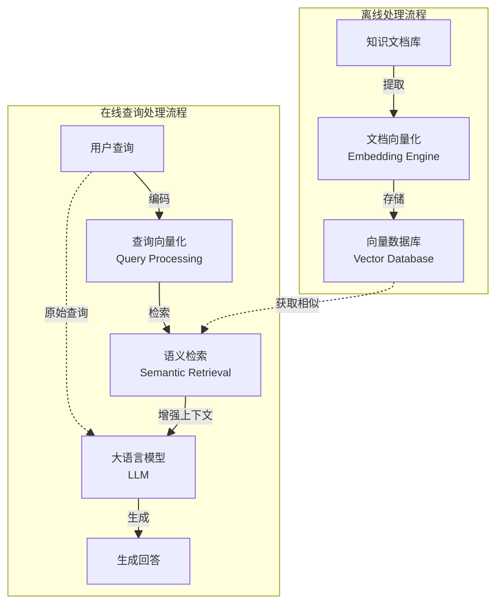
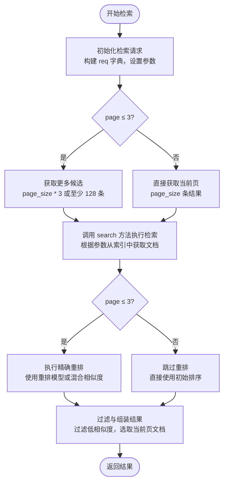
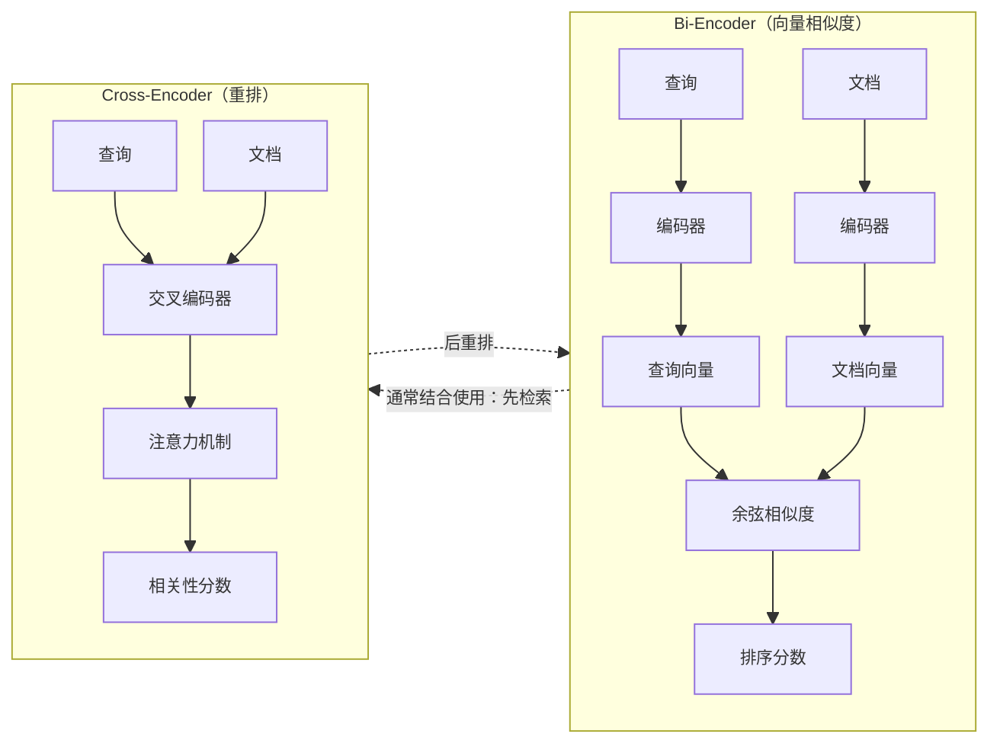

# 【RAG实战-第9天】实战项目的简历准备、面试、运用（在线召回模块）

> 🤓 我们之前讲解过 RAG 的问题解决方案，讲解了实战项目，讲解了简历怎么写，今天我们把这些内容串联起来。

我们从以下 5 个方面：

- **存在问题**：基础 RAG 存在的问题 + Case 举例 -> 这部分就是你简历/工作中遇到的问题
- **如何解决**：实战代码是如何解决的 -> 你是如何解决的
- **简历书写**：简历中该怎么写 -> 会写
- **面试问题**：面试中该怎么说，怎么回答 -> 会说
- **实践运用**：实际工作中用 -> 会做

我们配套：

- 【RAG实战-第1天】RAG 优化方案：案例+代码+图解
- 【RAG实战-第5天】核心代码详解

本篇主要从在线召回 + 回答来进行解读，即下图中红框的部分。



## 1. 召回模块

### 1.1 存在问题

#### 1. 单一检索策略不足

- 仅依赖向量检索：
  - 对短查询（例如只含几个关键词的问题）检索效果不佳。因为短查询的语义上下文很有限，向量模型可能无法准确度量相似度，导致召回不足。
- 仅依赖 BM25 等关键词检索：
  - 当用户的查询使用了与文档不同的同义词或领域术语时，BM25 无法识别“推销”与“销售”这种语义近似，容易漏召回。

#### 2. Embedding 模型未进行领域微调

- 通用预训练模型（如 BGE）对金融保险专业术语理解不足。例如“保单现金价值”“退保费”等词在通用预训练中出现频次有限，模型生成的嵌入可能不准确，导致与真正相关的文档匹配度不够。
- 专有名词、行话较多的场景下，若 Embedding 未在足量领域语料上做微调，会出现相似度判定失效或不稳定的情况。

#### 3. 检索结果缺乏重排序（Rerank）

- 无论是 BM25 还是向量检索，初步检索结果通常只是一批“可能相关”的候选，而实际最优答案未必排在前面。
- 如果直接将这些候选传给上层的生成模型，部分不够相关或过时的文档段落会影响回答质量。
- 特别在包含多个相似段落时，缺少 Cross-Encoder 等更精细的交互式模型来评分重排，往往导致检索效果在最后阶段被“稀释”。
- 如果缺乏 Cross-Encoder 之类的精细重排模型，这种“最新/最相关”信息就很容易被漏掉或排位过低，最终生成的回答还基于过时流程。

---

#### 问题案例（Case）说明

下面用金融保险公司的典型用户查询来说明这些问题在实际场景中的具体表现：

1. **短查询无法匹配到正确文档（仅用向量检索的不足）**

   案例：用户输入「报销制度」。

   - 这是一个非常简短的问题，向量检索在没有足够上下文的情况下可能无法有效量化这个查询的语义。
   - 如果文档中有些标题或段落直接出现“报销制度”四个字，BM25 可以很快命中；但纯向量检索可能会与一些含“费用”“财务制度”却不含“报销制度”的内容混在一起，导致真正包含核心答案的文档未能进入 Top 结果，最终造成召回不足或排在很后面。

2. **BM25 无法识别同义词（仅用关键词检索的不足）**

   案例：用户询问「如何推销保险产品？」

   - BM25 只做字面匹配，如果公司内部培训手册中更多使用“保险销售”“客户销售策略”等说法，就会出现检索不匹配或得分很低的情况。
   - 结果是 BM25 返回了一堆含“推销”二字的无关内容（比如“推销非法产品的案例”），而真正讲解“保险销售技巧”的段落没有被检索到。

3. **Embedding 未微调导致专业词匹配偏差**

   案例：用户问「保单的现金价值指的是什么？」

   - 如果 Embedding 是通用预训练模型，对“现金价值”这一保险领域的专有概念理解不深；模型可能将其与“现金流”“财务价值”等不同含义混淆，导致检索出并非针对“保单现金价值”解释的文档。
   - 例如，系统可能召回谈“公司现金流管理”的财务类文档，而忽略了真正介绍“保单现金价值”计算方法和领取规则的文档。

4. **缺乏重排导致关键答案被“淹没”**

   案例：用户询问「最新的车险理赔流程是什么？」

   - 初步检索得到多个候选，包括：
     1. 旧的车险理赔流程（例如 2020 版）
     2. 最新 2023 年修订的流程
     3. 一些通用的理赔介绍
   - 由于 BM25 或向量模型初步排序可能把“旧流程”的文档排在前面（它也包含很多车险理赔关键词），真正用户最需要的“最新流程”却排在后面。

> 😎 **总结**
>
> - **单一检索策略**（只用向量或只用关键词）难以兼顾短查询的精确匹配与长查询的语义匹配。
> - **Embedding 模型领域适配不足**会导致专业术语理解不准确、同义关联度不够，降低检索召回。
> - **未做结果重排序**导致初步召回的文档中真正最重要或最新的内容可能被埋没，影响最终回答质量。
> - **没有一套科学的评估指标体系**难以定量比较各个方案的优劣和进步幅度。

### 1.2 代码中如何解决

在接口层中，可以通过 `ctrl/command` + 鼠标左键进入 `retrieve_content` 函数，进入 `retrieval`。

核心调用链大致是：

```python
references = retrieve_content(user_id, question)
```

下面将对 `retrieval` 函数的整体流程进行详细拆解，并且先说明它所用到的几个关键辅助方法，最后再串起来看它是如何一步步完成检索与重排的。

#### 1.2.1 `retrieval` 函数的整体流程



> 😎 **`retrieval` 函数核心逻辑总结**
>
> `retrieval` 函数是一个复杂的文档检索系统，用于根据用户查询从知识库中获取最相关的文档片段。其核心流程包括：
>
> 1. **请求初始化**
>
> 函数首先初始化返回结构 `ranks`，然后根据输入参数构建检索请求。关键设置包括：
>
> - 知识库 ID 和文档 ID 的过滤
> - 相似度阈值
> - 分页参数
>
> 2. **基于页码的优化策略**
>
> 代码中设置了 `RERANK_PAGE_LIMIT = 3` 作为重要的分界点，基于这个值采用不同的检索和排序策略：
>
> 对于前 3 页（`page <= 3`）：
>
> - 获取更多候选文档（`page_size * RERANK_PAGE_LIMIT` 或至少 128 条）
> - 这是为了后续重排提供足够多的候选，确保能从中选出最相关的结果
>
> 对于第 4 页及以后（`page > 3`）：
>
> - 直接获取当前页所需的数量（`page_size` 条）
> - 跳过复杂的重排过程，减少计算资源消耗
>
> 3. **检索执行**
>
> 调用 `search` 方法执行实际的文档检索，该方法会：
>
> - 根据用户问题生成文本匹配和向量匹配条件
> - 使用混合检索（BM25 文本相似度 + 向量相似度）检索文档
> - 如果配置了高亮（`highlight=True`），也会标记匹配的关键词
>
> 4. **重排序过程**
>
> 检索后，根据页码决定是否执行重排序：
>
> 对于前 3 页：
>
> - 如果有搜索结果且提供了重排模型，调用 `rerank_by_model` 进行精确重排
> - 否则使用内置的 `rerank` 方法基于混合相似度进行排序
> - 重排考虑了三个因素：
>   - 文本 token 相似度
>   - 向量相似度
>   - 排序特征（如 PageRank 值）
>
> 对于后续页面：
>
> - 跳过重排过程，直接使用初始排序顺序
>
> 5. **最终结果处理**
>
> 重排（或跳过重排）之后：
>
> - 过滤掉相似度低于阈值的文档
> - 按照分页参数选取当前页的文档
> - 收集文档聚合信息，如不同文档 ID 的出现次数
> - 组装最终返回结构
>
> 6. **返回结果**
>
> 函数最终返回一个包含以下内容的字典：
>
> - `total`：总命中文档数
> - `chunks`：当前页的文档片段，每个片段包含内容、相似度、文档 ID 等信息
> - `doc_aggs`：文档聚合信息，用于了解结果的文档分布情况
>
> **为什么要采用这种设计？**
>
> 1. **性能与精确度的平衡**：重排序计算成本高但结果更精确，仅对用户最常查看的前几页执行重排，后续页面采用更轻量级的处理。
> 2. **分页优化**：查询时分页和重排后分页的两级设计使系统能高效处理大量文档，同时保证前几页结果质量。
> 3. **相似度阈值**：确保结果与查询至少有一定相关性，避免返回不相关内容。
> 4. **混合排序信号**：结合文本匹配、语义向量相似度和页面权重等多种信号，提高结果质量。
>
> 这种实现体现了实际生产系统中检索引擎的典型优化策略，在结果质量和系统性能之间取得良好平衡。

以下内容为更精细的解释。

#### 1.2.2 `retrieval` 函数的参数意义

```python
def retrieval(
    self,
    question,
    embd_mdl,
    tenant_ids,
    kb_ids,
    page,
    page_size,
    similarity_threshold=0.2,
    vector_similarity_weight=0.3,
    top=1024,
    doc_ids=None,
    aggs=True,
    rerank_mdl=None,
    highlight=False,
    rank_feature: dict | None = {PAGERANK_FLD: 10},
):
    ...
```

1. **question**
   - 用户的查询问题字符串。

2. **embd_mdl**
   - 用于生成向量、做向量相似度或 Embedding 的模型（比如向量模型）。

3. **tenant_ids**
   - 可理解为多租户场景下的“用户 ID”，用来决定检索时要从哪些数据索引（index）里取文档。
   - 可能是一个字符串，也可能是一个字符串列表。

4. **kb_ids**
   - 指定要检索的知识库 ID 列表。同一个租户下可能有多个不同知识库。

5. **page 与 page_size**
   - 分页参数，分别表示当前页码与每页数量。

6. **similarity_threshold**
   - 表示在筛选或重排时，最终结果要达到的相似度阈值。小于该阈值的文档就丢掉。

7. **vector_similarity_weight**
   - 进行混合相似度时（文本 token 相似 + 向量相似），这里指定向量相似度在加权时所占的比重。

8. **top**
   - 表示初步检索时允许取回的最大候选文档数（即初始检索的“上限”）。

9. **doc_ids**
   - 若指定，则只检索这些文档 ID；若为 None 则不限制。

10. **aggs**
    - 是否要做文档聚合统计（在返回结果里会带一个 `doc_aggs` 统计）。

11. **rerank_mdl**：【重排的原理见 1.3】
    - 如果传入一个重排模型，检索完会用它去做 Cross-Encoder 或额外的打分重排。

12. **highlight**
    - 是否需要对返回的文档文本做关键词高亮处理。

13. **rank_feature**
    - 一些额外的排序权重配置，如 Pagerank 字段打多少分，或者其他打分要素。

#### 1.2.2 `retrieval` 函数内用到的关键步骤与方法

为了更好理解 `retrieval`，先简单说明它所用到的几个辅助方法（也在同一个 `Dealer` 类中）：

1. **`search`**
   - 核心检索方法，基于用户的请求（组装成 `req` 字典），去数据库或向量索引里查找候选结果。它做的事情包括：
     - 将用户的文本输入进行 BM25/关键词解析，以及向量匹配（可做 FusionExpr 混合检索）。
     - 根据筛选条件（filters）和排序条件（orderBy）从索引中检索。
     - 返回一个自定义的 `SearchResult` 对象，里面包括：
       - `total`：总命中数
       - `ids`：命中文档的 ID 列表
       - `field`：命中文档对应的各个字段内容
       - `highlight`：如果需要高亮，也会包含高亮信息
       - `query_vector`：最终对查询生成的向量

2. **`rerank_by_model`**
   - 如果传了 `rerank_mdl`（可能是 Cross-Encoder 之类的重排模型），会用这个模型对搜索回来的候选做打分。
   - 它的输入包括：
     - 查询文本、搜索结果 `sres`，以及设置的混合相似度权重。
   - 最终输出一个与 `sres.ids` 对应的打分数组（也可能会将 token 相似度、向量相似度分别计算出来）。
   - 在这里实现了对 query + 候选文本对的更精细相似度测量，往往比单纯余弦相似度更加准确。

3. **`rerank`**
   - 如果没有指定 `rerank_mdl` 或者在某些情况下（比如搜索结果 0 条的时候），用一个内置的 `hybrid_similarity` 来对候选做加权打分。
   - 其输入是 `sres.query_vector`（搜索时得到的 query 向量）、候选片段的向量，还有关键词的 token 匹配得分。
   - 输出和 `rerank_by_model` 类似：一个打分数组，加上拆分的 token 相似度与向量相似度等。

4. **`_rank_feature_scores`**
   - 用来处理 `rank_feature`，比如对 `PAGERANK_FLD` 进行额外加分；或者对某些标签（tag）做打分。最终形成一个数值数组，供 `rerank` 过程加权使用。

#### 1.2.3 `retrieval` 函数的主要执行流程

以下为 `retrieval` 函数的核心逻辑分步解析：

1. **初始化返回结构 `ranks`**

```python
ranks = {"total": 0, "chunks": [], "doc_aggs": {}}
```

- 这是最后要返回给调用方的结果字典，会包含：
  - `total`：命中的所有结果总数
  - `chunks`：最终取回的文档片段列表
  - `doc_aggs`：对文档做聚合统计（不同 doc_id 或 docnm 的计数），需要的话在前端做文档级别的合并展示

2. **设置常量与请求参数**

```python
RERANK_PAGE_LIMIT = 3
req = {
    "kb_ids": kb_ids,
    "doc_ids": doc_ids,
    "size": max(page_size * RERANK_PAGE_LIMIT, 128),
    "question": question,
    "vector": True,
    "topk": top,
    "similarity": similarity_threshold,
    "available_int": 1
}
```

- 定义 `RERANK_PAGE_LIMIT = 3`：代表如果请求的 `page` 小于等于 3，就会做重排操作；否则直接拿结果不重排或减少重排计算。
- 构造一个 `req` 字典，里面包含：
  - `question`、`kb_ids`、`doc_ids`、`topk`、`similarity_threshold` 等所有需要的搜索参数。
  - `size` 一开始设得比较大：`page_size * RERANK_PAGE_LIMIT`（或者至少 128），意味着先拉取尽量多的候选，然后再在内存中做重排，从而保证在前 3 页范围内可以获得更准确的排序。

3. **根据分页策略微调 `req["page"]`**

```python
if page > RERANK_PAGE_LIMIT:
    req["page"] = page
    req["size"] = page_size
```

- 如果用户要看第 4 页或更后面的数据，就不需要做大规模重排了，因此把 `size` 改小，检索出来直接分页即可。

4. **调用 `search` 方法执行检索**

```python
sres = self.search(
    req,
    [index_name(tid) for tid in tenant_ids],
    kb_ids,
    embd_mdl,
    highlight,
    rank_feature=rank_feature
)
ranks["total"] = sres.total
```

- 这里会真正执行搜索：
  - 把 `req`（包含 query、topk、similarity 等）交给 `search`。
  - 指定要在哪些 index（多租户）里查（`[index_name(tid) for tid in tenant_ids]`）。
  - 指定检索的知识库 `kb_ids`。
  - `embd_mdl` 是 embedding 模型句柄，用于向量匹配。
  - `highlight` 决定是否返回高亮。
  - `rank_feature` 里可能包含额外的 pagerank 参数等。
- `search` 执行完后返回一个 `SearchResult`：包括 `total`、`ids`、以及各字段等信息。
- 最早先记录一下 `ranks["total"] = sres.total`。

5. **根据 `page` 判断是否要进行重排**

```python
if page <= RERANK_PAGE_LIMIT:
    if sres.total > 0:
        print("重排模型....")
        sim, tsim, vsim = self.rerank_by_model(
            rerank_mdl,
            sres,
            question,
            1 - vector_similarity_weight,
            vector_similarity_weight,
            rank_feature=rank_feature
        )
    else:
        sim, tsim, vsim = self.rerank(
            sres,
            question,
            1 - vector_similarity_weight,
            vector_similarity_weight,
            rank_feature=rank_feature
        )
    idx = np.argsort(sim * -1)[(page - 1) * page_size : page * page_size]
else:
    sim = tsim = vsim = [1] * len(sres.ids)
    idx = list(range(len(sres.ids)))
```

- 如果 `page <= 3`：
  - 如果 `sres.total > 0` 说明检索到内容，则调用 `rerank_by_model` 用指定的 `rerank_mdl` 做重排。
  - 其中第 4 个和第 5 个参数分别是 `(1 - vector_similarity_weight)` 和 `vector_similarity_weight`，用于混合 token 相似度与向量相似度。
  - 否则（检索结果为 0）就用 `rerank`（内部 hybrid 方法）来做一下尝试性的打分，不过既然结果 0，也不会真正排出东西。
- 取排序好的索引：
  - `idx = np.argsort(sim * -1)` 可以得到从大到小排序，因为要取负号才能让大值排前面。
  - 然后拿这个索引再截取当前页的范围。
- 如果 `page > 3`：
  - 就不做重排，直接把相似度 `sim` 全部设为 1（或者随便一个值），`idx` 就是所有文档的顺序。这样性能上会更快。

6. **遍历排序后的结果，过滤掉相似度过低的，并准备最终返回的内容**

```python
dim = len(sres.query_vector)
vector_column = f"q_{dim}_vec"
zero_vector = [0.0] * dim
for i in idx:
    if sim[i] < similarity_threshold:
        break
    if len(ranks["chunks"]) >= page_size:
        if aggs:
            continue
        break
    id = sres.ids[i]
    chunk = sres.field[id]
    dnm = chunk.get("docnm_kwd", "")
    did = chunk.get("doc_id", "")
    ...
    ranks["chunks"].append(d)
    if dnm not in ranks["doc_aggs"]:
        ranks["doc_aggs"][dnm] = {"doc_id": did, "count": 0}
    ranks["doc_aggs"][dnm]["count"] += 1

ranks["doc_aggs"] = [{
    "doc_name": k,
    "doc_id": v["doc_id"],
    "count": v["count"]
} for k, v in sorted(
    ranks["doc_aggs"].items(), key=lambda x: x[1]["count"] * -1)]
ranks["chunks"] = ranks["chunks"][:page_size]
return ranks
```

- 取出最终要返回给用户的片段：
  - 先看 `sim[i]` 是否高于 `similarity_threshold`；如果相似度低于阈值就直接 `break`（后面的结果就不看了）。
  - 收集前 `page_size` 条结果到 `ranks["chunks"]`。
- 如果 `aggs=True`，则也会把多余的文档统计到 `doc_aggs` 去（只是用来计数）。
- 最终把聚合信息转成一个列表形式。
- 截断 `ranks["chunks"]` 到 `page_size`，以免超出分页需要。
- 返回 `ranks`，里面包含：
  - `total`：总命中数
  - `chunks`：真正给当前页展示的文档片段列表
    - 每个片段里有 `content_ltks`、`content_with_weight`、`doc_id`、`similarity` 等信息
  - `doc_aggs`：聚合统计结果（哪个文档、各自多少片段）

#### 1.2.4 整体工作原理小结

- **构造检索请求**：先根据传入参数（问题、知识库 IDs、向量开关、相似度阈值、分页等）拼 `req`。
- **初步检索（`search`）**：取回更多候选文档（默认 `page_size * 3`），因为要预留给重排。
- **重排逻辑**：若 `page <= 3`，则调用 `rerank_by_model` 或 `rerank` 来精排，把相关度最高的排前。
  - `rerank_by_model`：调用外部模型（Cross-Encoder 等）对 `(query, document chunk)` 逐一计算相似分数。
  - `rerank`：如果没有重排模型，则用本地 `hybrid_similarity` 根据 token 与向量做混合打分。
  - 排序完以后根据 `np.argsort` 截取当前页数据。
- **阈值过滤 + 构造返回**：
  - 只保留分数大于 `similarity_threshold` 的，进一步按 `page_size` 截断，取到最终的 chunk。
  - 收集文档聚合信息，构建 `doc_aggs`。
  - 返回给调用方一个包含 `total`、`chunks`、`doc_aggs` 的结果字典。

> 😎 这一系列过程就是 `retrieval` 函数的主要逻辑：
>
> 1. **先宽召回**（search + 大 topK 数）
> 2. **再精排**（用模型或内部方法 rerank）
> 3. **最终分页返回**（过滤掉低相似度，按相似度顺序取前 N 条）
>
> 这样既能保证前几页用户看到的结果更准确，也兼顾了性能。如果用户要翻很多页，就可以减少比较消耗时间的重排操作。

### 1.3 重排精讲

下面通过一个简单的示例，来对比 **向量相似度（Bi-Encoder 方案）** 与 **Cross-Encoder 重排** 在「排序效果」上的区别。示例还是以一个「找出世界最高山峰」的查询为例。



整体流程概览：

1. **Bi-Encoder（向量相似度）**
   - 将 Query 和每个候选文本分别独立地编码成向量（embedding）。
   - 通过计算向量相似度（一般是余弦相似度）来度量 Query 与候选文本的关联程度，然后排序。

2. **Cross-Encoder**
   - 将 Query 与候选文本拼成一对儿，一起输入到模型里，让模型输出一个单独的相关性分数，然后排序。
   - 由于 Cross-Encoder 看到了「Query + 文本」的完整组合，它可以更好地理解上下文，通常重排结果更准确。

因为 Cross-Encoder 会对「Query-候选文本」对进行更精细的语义计算，所以往往在最终排序上，比单纯使用向量相似度更精确，但代价是计算量更大（每个候选都要一次模型推理）。

#### 3. 引入所需包

在 Python 环境中，如果没有安装 `sentence-transformers`，需要先安装：

```bash
pip install -U sentence-transformers
```

#### 4. 数据与示例代码

下面展示一个最小化的示例对比：**向量相似度 vs. Cross-Encoder**。这里的模型和示例仅作教学演示，实际项目中请使用合适的中文模型和更完整的测试数据。

- **查询（query）**：「世界上最高的山峰是哪一个？」
- **候选文本（candidates）**：
  1. 世界上最高的山是珠穆朗玛峰。
  2. 世界上最高的山峰是乔戈里峰（K2）。
  3. 世界上最高的山峰是干城章嘉峰。

下面的代码会先用一个多语言 Bi-Encoder 模型来做向量相似度排序，再用一个（主要用于英语的）Cross-Encoder 来做重排，仅作为示例对比。

```python
from sentence_transformers import SentenceTransformer, CrossEncoder, util

# ========== 1. 初始化模型 ==========
# (1) Bi-Encoder，用来做向量相似度
bi_encoder_name = "sentence-transformers/paraphrase-multilingual-MiniLM-L12-v2"
bi_encoder = SentenceTransformer(bi_encoder_name)

# (2) Cross-Encoder，用来做重排打分
cross_encoder_name = "cross-encoder/ms-marco-MiniLM-L-12-v2"
cross_encoder = CrossEncoder(cross_encoder_name)

# ========== 2. 定义查询和候选文本 ==========
query = "世界上最高的山峰是哪一个？"
candidates = [
    "世界上最高的山是珠穆朗玛峰。",
    "世界上最高的山峰是乔戈里峰(K2)。",
    "世界上最高的山峰是干城章嘉峰。"
]

# ========== 3. Bi-Encoder 排序：向量相似度 ==========
# 3.1 把 query 和 candidates 分别编码成向量
query_embedding = bi_encoder.encode(query, convert_to_tensor=True)
candidate_embeddings = bi_encoder.encode(candidates, convert_to_tensor=True)

# 3.2 计算 query 与每个候选文本向量的余弦相似度
cos_scores = util.cos_sim(query_embedding, candidate_embeddings)[0]  # shape: [num_candidates]

# 3.3 给每个候选打分并排序（分数从大到小）
bi_encoder_results = list(zip(candidates, cos_scores))
bi_encoder_results = sorted(bi_encoder_results, key=lambda x: x[1], reverse=True)

# ========== 4. Cross-Encoder 排序 ==========
# 4.1 把 (query, candidate) 拼成一对，用于 Cross-Encoder
cross_encoder_inputs = [(query, c) for c in candidates]

# 4.2 让 Cross-Encoder 逐一输出匹配度分数
cross_scores = cross_encoder.predict(cross_encoder_inputs)

# 4.3 排序
cross_encoder_results = list(zip(candidates, cross_scores))
cross_encoder_results = sorted(cross_encoder_results, key=lambda x: x[1], reverse=True)

# ========== 5. 打印比较结果 ==========
print("===== Query =====")
print(query)

print("\n===== 1) Bi-Encoder 排序结果（向量相似度） =====")
for i, (text, score) in enumerate(bi_encoder_results):
    print(f"Rank {i+1}: {text} [相似度 = {score:.4f}]")

print("\n===== 2) Cross-Encoder 排序结果 =====")
for i, (text, score) in enumerate(cross_encoder_results):
    print(f"Rank {i+1}: {text} [score = {score:.4f}]")
```

#### 5. 对比结果与解读

- **Bi-Encoder（向量相似度）**
  - 模型只看「文本本身」，把每一段文本都映射到某个固定维度的向量。
  - 计算 Query 向量和 Text 向量的余弦相似度。
  - 优点：编码一次后就能快速计算任何 Query 与文本之间的相似度；适合大规模检索（召回阶段）。
  - 缺点：对细节区分能力相对有限，因为它并不知道 Query 文本和候选文本在一起时发生了怎样的语义交互。

- **Cross-Encoder**
  - 每次输入 `(Query, Text)` 拼接的完整序列，让模型同时读到二者，从而计算一个相关性分数。
  - 优点：对上下文交互和细节理解更深，往往排序精度更好。
  - 缺点：要对每条候选做一次推理，计算代价昂贵，只适合在候选集较小（如 100 条以内）的重排阶段。

在实际应用中，二者常常结合使用：

- **Bi-Encoder** 用来在大语料库中快速召回最相关的前 N 条候选。
- **Cross-Encoder** 再对这 N 条候选进行精细的重排，得到最终高质量的排序结果。

**结果示例（示意）**

根据具体模型和随机种子不同，结果可能略有差异。一般情况下，你可能会得到类似如下输出（仅示例）：

```text
===== Query =====
世界上最高的山峰是哪一个？
===== 1) Bi-Encoder 排序结果（向量相似度） =====
Rank 1: 世界上最高的山峰是乔戈里峰(K2)。 [相似度 = 0.7536]
Rank 2: 世界上最高的山是珠穆朗玛峰。 [相似度 = 0.7392]
Rank 3: 世界上最高的山峰是干城章嘉峰。 [相似度 = 0.7294]
===== 2) Cross-Encoder 排序结果 =====
Rank 1: 世界上最高的山是珠穆朗玛峰。 [score = 5.4821]
Rank 2: 世界上最高的山峰是乔戈里峰(K2)。 [score = 2.3943]
Rank 3: 世界上最高的山峰是干城章嘉峰。 [score = 2.1029]
```

可以看出（示例中）：

- **Bi-Encoder 排序**可能因为词向量或句向量的分布原因，把「乔戈里峰(K2)」判为最相似。
- **Cross-Encoder 重排**时，模型能更精细地理解“世界上最高的山峰”和“珠穆朗玛峰”之间的关系，因而把正确的分数。

这也体现了 Cross-Encoder 在区分细节上的优势。

总结：

- **向量相似度（Bi-Encoder）**
  - 适合大规模检索；计算效率高，但精度相对有限。
- **Cross-Encoder 重排**
  - 适合精细的末端排序；计算代价大，效果通常更优。

二者结合即可在**效率与效果**之间取得平衡：先 Bi-Encoder 大规模检索，然后 Cross-Encoder 重排。这也是当前大多数基于 Transformer 模型的搜索/问答/对话系统中常见的处理范式。

### 1.4 Embedding 模型微调（以 BGE 为例）

**为什么要微调 Embedding 模型？**

> 🤔 下面给出几个典型的「为什么要微调 BGE」的场景示例，帮助理解在什么情况下需要对 BGE（Bilingual General Embeddings）模型进行微调，以及微调能带来什么收益。

#### 1. 专业领域词汇或表述和「通用」不一样

**场景 1 示例：**

- **医疗健康领域**

在医疗问答场景中，很多文本中会出现专业的医学术语、药品名称（如“阿司匹林”“头孢克洛”“血常规检查”等），或者以缩写形式出现（如“NSAIDs”表示非甾体抗炎药，“CT”表示计算机断层扫描）。

通用 BGE 模型虽然已经具备一定的通用语义能力，但在提取这些专业术语的准确含义时可能还不够优秀、理解深度不够。如果直接用通用模型来做医疗问答中的相似度检索，可能会错过一些专业上下文的细微差别，导致检索结果不准确。

**为什么要微调：**

- 对于这种专业场景，可以准备一批医疗领域内的问答/文本对儿，并且标注相似度或相关性。
- 通过训练，让 BGE 学习到「阿司匹林、布洛芬、感冒发烧处理」等词汇在专业上下文中的语义关系，更好地聚合具有相同或相似主题的文本。
- 微调后，在医疗问答系统中对相似的问题或文本做检索时，准确度会显著提升。

#### 2. 业务场景中的「习惯表达」或「特定写法」与通用数据不同

**场景 2 示例：**

- **客服聊天 / 用户反馈场景**

在某些公司的内部客服系统或用户反馈收集平台，客户常常会使用口语化、带有俚语、缩写、错别字的习惯表达。例如，「这货怎么这么难用」、「这玩意儿老卡死啊」、「求退差价」。

通用 BGE 在大规模语料上预训练，能理解大部分标准语言，但面对大量「非标准表达」或「行业内部特有的标识写法」，往往会产生混淆，导致语义相似度结果不理想。

**为什么要微调：**

- 从这些客服聊天或用户反馈日志里，选取成对的「相似 / 不相似」示例，或者带有「意图标签」的数据，用来对 BGE 进行微调。
- 这样模型会更好地捕捉这类口语、俚语、拼音缩写、公司内部产品或功能代号等特别表达方式，让模型在该场景下的相似度更加准确。

#### 3. 不同语言在某些场景中有特定「对齐关系」需求

**场景 3 示例：**

- **中英双语技术文档对齐**

在某些技术公司或开源社区，需要维护中英双语的文档或 FAQ。原始的文档往往是英文，后续通过人工翻译或机器翻译生成中文版。

通用 BGE 对中英双语已经有一定的对齐能力，但如果这些技术文档中大量使用专业词汇（例如“Event Sourcing”、“CQRS”、“Middleware”等），翻译后会有对应的中文术语，有时加上括号做标注。在普通语料里，这些词的使用频率和上下文并不常见，导致模型对中英术语的匹配还不够精确。

**为什么要微调：**

- 可以收集大量中英双语对照文档片段，把它们当作语义「正例」（比如一段英文文档的某几行对应翻译的中文段落），以及其他随机拼接的非对应段落当作「负例」。
- 通过对 BGE 进行微调，让它在计算跨语言相似度时，更好地捕捉这些技术术语、中英对应的表达方式，从而让英文段落与其正确的中文翻译更加贴近。

#### 4. 需要针对性优化相似度度量的「评分标准」或「指标」

**场景 4 示例：**

- **社区问答的相似问题检索**

在论坛或问答社区里，用户常常会提各种各样的问题，但有时措辞不同的问题实际上非常相似（比如“如何配置 XXX 环境” vs. “请问有 XXX 的配置教程吗？”）。

通用 BGE 对此能做一个大体上的相似度估计，但如果论坛帖子中充满了特定标签、带编号的错误码（比如“Error 1001”）、超链接或特殊字符，模型并不一定能很精准地区分或聚类这些问题。

**为什么要微调：**

- 采集社区里相似 / 不相似问题对（或更细粒度相似度评分），用这些数据来训练 BGE，告诉模型「在我们的社区场景下，带有相同错误码或同一软件版本号的问题更相似」以及「仅仅都提到‘安装’但涉及不同软件其实不算特别相似」等等。
- 微调后，检索时就能获得更合适的相似问题列表，在社区问答中减少重复问题、提升搜索效率。

#### 5. 目标下游任务需要特定的「精调侧重」

**场景 5 示例：**

- **意图识别与槽位填充**

有些场景中，我们需要先用 BGE 来做第一步的向量检索（例如把用户问句映射到一组候选模板或意图），再在后续步骤中提取特定槽位信息。

如果下游任务对某些词的位置或情感倾向特别敏感（比如“喜欢”、“厌恶”、“查询”、“预定”），我们可能希望 BGE 把这些词语的差别放大到向量空间中。

**为什么要微调：**

- 在这些场景里对 BGE 做微调，可以让它学习到「与任务强相关的词」的差异，从而在意图识别或检索阶段更敏锐。
- 通用向量模型可能关注的是大范围语义一致性，微调后可以让它在我们关心的领域和词汇上「更敏感且区分度更高」。

**总结**

在上述例子里，我们可以看到：当你的应用场景与 BGE 的预训练数据分布存在差异，或者你对相似度有更严格、更细节的需求时，就应该对 BGE 进行微调。微调可以让模型更贴合你的下游任务和领域特征，取得更好的语义检索或相似度计算表现。

- 如果你的场景非常通用且不涉及太多特殊表达，直接使用预训练 BGE 可能已经够用。
- 但一旦场景具有专业词汇、特定文本风格或跨语言对齐需求，通过合理的数据标注，进行微调后的 BGE 会在你的具体任务中有大幅度的性能提升。

下面给出一个较为详细的示例，**介绍如何对 BGE（Bilingual General Embeddings）模型进行微调**。我们将从数据准备、模型加载、训练流程以及示例代码几个方面进行说明。本示例基于 Hugging Face 和 Sentence-Transformers 库，但也会介绍使用 Hugging Face `transformers` 直接进行微调的思路。

#### 1.4.1 什么是 BGE？

BGE（Bilingual General Embeddings）模型是一种可以同时处理多语言（常见是英-中双语）的文本嵌入模型，适合在搜索、文本相似度、语义匹配等下游任务中使用。它的核心思路与主流的句向量模型类似：输入一段文本，输出一个向量表示（embedding），使得语义相似的句子在向量空间中彼此接近。

如果我们有自己的特定场景，例如一个带有特殊领域词汇的 OA 系统，需要比通用语义嵌入更好地捕捉领域特征，就需要对 BGE 模型进行微调，以便让模型在该场景下效果更好。

#### 1.4.2 数据准备

BGE 通常是一个「双塔」（Siamese）句向量结构：每个句子或文本段分别经过同一个编码器后得到各自的向量表示，然后再进行相似度度量。

因此在微调阶段，我们常见的训练数据格式通常是：

- 成对的文本（text1, text2）
- 以及一个相似度标签或打分（label），比如是否同义、语义相似度为多少等等。

例如，如果我们要做相似度学习，可以准备类似以下格式的示例数据：

| text1 | text2 | label |
| --- | --- | --- |
| 我想去北京旅游，推荐一下 | 有没有北京旅游的攻略推荐？ | 0.9 |
| 猫喜欢睡觉 | 太阳系有八大行星 | 0 |
| 这道题有点难 | 求这道数学题的答案 | 0.7 |
| 我喜欢吃苹果 | 苹果是我最喜欢的水果 | 0.8 |
| ... | ... | ... |

- 其中 `label` 的取值一般可以是 0~1 的相似度分数，或者是 0/1 是否相似。如果你有监督的数据大多是「相似 / 不相似」二分类，可以把相似标记设置为 1，不相似设置为 0（一般用 0/1 即可）。
- 也可以是多个等级，比如 0、1、2、3、4、5 代表不同相似度等级。

下面这个示例将演示如何把数据转成 Sentence-Transformers 所需的 `InputExample` 形式进行训练。

#### 1.4.3 使用 Sentence-Transformers 微调 BGE

1. **安装依赖**

如果尚未安装，可以先安装：

```bash
pip install sentence-transformers
```

另外，你也需要 `torch`、`transformers` 等库：

```bash
pip install torch transformers
```

2. **代码示例**

下面这段代码演示了一个最小的示例。我们会做如下步骤：

- 加载 BGE 基础模型（比如 `BDCZone/bge-base-zh` 或 `BDCZone/bge-base-en`）。
- 构造训练数据（可以是人工标注或已有数据集，示例中使用了简化的伪造数据）。
- 使用 `sentence_transformers` 的 `SentenceTransformer` 结构，并指定微调的损失函数为 `CosineSimilarityLoss`（常用于句向量对齐 / 相似度训练）。
- 进行训练并保存。

示例代码：

```python
from sentence_transformers import SentenceTransformer, InputExample, losses
from torch.utils.data import DataLoader

# 1. 加载 BGE 基础模型
# 如果想用英文版，可以替换为 "BDCZone/bge-base-en" 或 "BDCZone/bge-large-en" 等
model_name = "BDCZone/bge-base-zh"
model = SentenceTransformer(model_name)

# 2. 构造训练数据（举例用几个样本）
train_examples = [
    InputExample(texts=["我想去北京旅游，推荐一下", "有没有北京旅游的攻略推荐？"], label=0.9),
    InputExample(texts=["猫喜欢睡觉", "太阳系有八大行星"], label=0.0),
    InputExample(texts=["这道题有点难", "求这道数学题的答案"], label=0.7),
    InputExample(texts=["我喜欢吃苹果", "苹果是我最喜欢的水果"], label=0.8),
]

# 3. 准备 DataLoader，定义 batch size
train_dataloader = DataLoader(train_examples, shuffle=True, batch_size=2)

# 4. 定义训练用的损失函数：CosineSimilarityLoss
train_loss = losses.CosineSimilarityLoss(model)

# 5. 进行训练
# epochs 可以根据你的数据大小和需求进行调整
model.fit(
    train_objectives=[(train_dataloader, train_loss)],
    epochs=1,
    warmup_steps=0,
    output_path="./bge_model_finetuned"
)

print("微调完毕，模型已保存到 ./bge_model_finetuned")
```

运行说明：

- `train_examples` 里的相似度分数是 `float`，范围可以在 `[0, 1]` 之间。如果你的标注是二分类，可以用 `0`（不同）和 `1`（相同）。
- 训练时设置的 `epochs=1` 只是示例，实际情况通常需要更多 epoch 且需要更大数据集。
- 训练完以后，会自动把微调后的权重保存到 `output_path` 指定的目录，之后就可以直接使用 `SentenceTransformer("./bge_model_finetuned")` 来加载并进行推理或评估。

#### 1.4.4 使用 Hugging Face Transformers 直接训练（思路概述）

如果不想使用 Sentence-Transformers，而是使用 `transformers`（`Trainer` + `DataCollator` + `forward` 自定义损失）进行微调，则可以使用类似下面的步骤：

1. **加载预训练模型和 tokenizer：**

```python
from transformers import AutoModel, AutoTokenizer

model_name = "BDCZone/bge-base-zh"
tokenizer = AutoTokenizer.from_pretrained(model_name)
model = AutoModel.from_pretrained(model_name)
```

2. **准备数据**（同样需要 `(text1, text2, label)`），并进行 tokenize，形成 `Dataset`：

```python
from datasets import Dataset

# 示例：构造一个简单的数据列表
train_data = [
    {"text1": "我想去北京旅游，推荐一下", "text2": "有没有北京旅游的攻略推荐？", "label": 0.9},
    {"text1": "猫喜欢睡觉", "text2": "太阳系有八大行星", "label": 0.0},
    {"text1": "这道题有点难", "text2": "求这道数学题的答案", "label": 0.7},
    {"text1": "我喜欢吃苹果", "text2": "苹果是我最喜欢的水果", "label": 0.8},
]

train_dataset = Dataset.from_list(train_data)

def tokenize_function(examples):
    # 分别对 text1 和 text2 进行编码
    output_1 = tokenizer(
        examples["text1"],
        truncation=True,
        padding="max_length",
        max_length=64
    )
    output_2 = tokenizer(
        examples["text2"],
        truncation=True,
        padding="max_length",
        max_length=64
    )

    # 合并
    return {
        "input_ids_1": output_1["input_ids"],
        "attention_mask_1": output_1["attention_mask"],
        "input_ids_2": output_2["input_ids"],
        "attention_mask_2": output_2["attention_mask"],
        "labels": examples["label"]
    }

train_dataset = train_dataset.map(tokenize_function, batched=False)
```

3. **自定义一个数据整理器（`DataCollator`）**，把 `input_ids_1`、`attention_mask_1`、`input_ids_2`、`attention_mask_2` 打包到同一个 batch 中：

```python
import torch
from dataclasses import dataclass

@dataclass
class SiameseDataCollator:
    tokenizer: AutoTokenizer

    def __call__(self, features):
        # features 是一个列表，每个元素是 map 后得到的字典
        # 我们需要把 input_ids_1、attention_mask_1、input_ids_2、
        # attention_mask_2 分别组装成 tensor
        input_ids_1 = torch.tensor([f["input_ids_1"] for f in features], dtype=torch.long)
        attention_mask_1 = torch.tensor([f["attention_mask_1"] for f in features], dtype=torch.long)
        input_ids_2 = torch.tensor([f["input_ids_2"] for f in features], dtype=torch.long)
        attention_mask_2 = torch.tensor([f["attention_mask_2"] for f in features], dtype=torch.long)
        labels = torch.tensor([f["labels"] for f in features], dtype=torch.float)

        return {
            "input_ids_1": input_ids_1,
            "attention_mask_1": attention_mask_1,
            "input_ids_2": input_ids_2,
            "attention_mask_2": attention_mask_2,
            "labels": labels
        }
```

4. **定义自定义的 `forward`：**

- 在 `transformers` 中，你可以自定义一个 `nn.Module`，内部包含原始的 BGE 模型。然后分别调用模型对 `input_ids_1` 与 `input_ids_2` 进行前向计算，得到各自的向量。
- 之后使用余弦相似度（或其它相似度度量）计算预测值，并和 `labels` 进行误差计算（比如 MSE 或者 CosineEmbeddingLoss）。
- 该自定义模型再作为 `Trainer` 的 `model` 即可。

大致示意如下（伪代码）：

```python
import torch
import torch.nn as nn
from transformers import Trainer, TrainingArguments, AutoConfig, AutoModel

class SiameseModel(nn.Module):
    def __init__(self, model_name):
        super().__init__()
        config = AutoConfig.from_pretrained(model_name)
        self.encoder = AutoModel.from_pretrained(model_name, config=config)
        # 或者可在这里加投影层 etc.

    def mean_pooling(self, model_output, attention_mask):
        # 常用的句向量池化方式：对 token embeddings 做加权平均
        token_embeddings = model_output.last_hidden_state  # [batch_size, seq_len, hidden_dim]
        input_mask_expanded = attention_mask.unsqueeze(-1).expand(token_embeddings.size()).float()
        sum_embeddings = torch.sum(token_embeddings * input_mask_expanded, dim=1)
        sum_mask = torch.clamp(input_mask_expanded.sum(dim=1), min=1e-9)
        return sum_embeddings / sum_mask

    def forward(self, input_ids_1, attention_mask_1, input_ids_2, attention_mask_2, labels=None):
        # 分别对 text1 和 text2 进行编码
        out1 = self.encoder(input_ids=input_ids_1, attention_mask=attention_mask_1)
        out2 = self.encoder(input_ids=input_ids_2, attention_mask=attention_mask_2)

        # 做 mean pooling 得到句向量
        emb1 = self.mean_pooling(out1, attention_mask_1)
        emb2 = self.mean_pooling(out2, attention_mask_2)

        # 计算余弦相似度
        cos_sim = nn.functional.cosine_similarity(emb1, emb2, dim=-1)

        loss = None
        if labels is not None:
            # 这里我们假设 labels 是 0~1 的相似度，用 MSE 来回归
            loss = nn.functional.mse_loss(cos_sim, labels)

        return {
            "loss": loss,
            "cos_sim": cos_sim
        }

model = SiameseModel(model_name)

# 初始化 Trainer
training_args = TrainingArguments(
    output_dir="bge_finetuned",
    num_train_epochs=1,
    per_device_train_batch_size=2,
    logging_steps=10,
    save_steps=100,
    remove_unused_columns=False
)

data_collator = SiameseDataCollator(tokenizer)

trainer = Trainer(
    model=model,
    args=training_args,
    train_dataset=train_dataset,
    data_collator=data_collator
)

# 开始训练
trainer.train()
trainer.save_model("bge_finetuned")
```

> 以上是简要思路示例，通常需要你再根据实际需求完善评估、验证集等逻辑。

#### 1.4.5 实践中的几点建议

1. **数据规模**
   - 如果希望得到一个质量好的领域微调模型，至少要准备几千到几万对高质量的训练样本。如果数据太少，模型很可能过拟合或无法学到细节。

2. **损失函数**
   - 常见的有 **CosineSimilarityLoss**、**ContrastiveLoss**、**TripletLoss** 等等。
   - 如果标注是「句对相似度打分」，可以使用 MSE 或者 CosineSimilarityLoss；如果是「相似 / 不相似」二分类，可以使用 SoftmaxLoss 或者 CosineEmbeddingLoss。

3. **池化方式**
   - 常见句向量提取方式是 CLS 向量或 Mean Pooling。BGE 原作者在发布模型时使用了特定的池化方法（有的用 [CLS]，有的用 mean pooling），可以在 Hugging Face 的文档或作者说明中查看具体细节。
   - 在微调时要保持一致或在实验中比较不同策略的差异。

4. **学习率和优化**
   - 对于微调，学习率通常选择 2e-5 或 1e-5 起步，根据数据集大小调整。
   - 如果数据集很大，可以增大学习率；如果数据量不大，学习率可以小一些，训练 epoch 适当增加。

5. **中英文语场景**
   - 如果你的应用场景里英文/中文混合出现，可以选择英文版或中英混合的 BGE，或者自己微调把中英文混在一起做对比学习，模型会同时学到两种语言语义空间对齐。

#### 1.4.6 总结

- BGE 模型已经可以在中文 / 英文场景下提供不错的通用句向量表示，如果对准确率要求更高或者有特定领域词汇，可以基于你自己的语料和标注，对 BGE 做轻量微调。
- 如果想快速上手，**Sentence-Transformers** 提供了非常简便的微调接口，**只需准备好 `(text1, text2, label)` 数据，就可以很轻松地写几行代码来训练**。
- 如果需要更细力度的控制或想在其它框架下结合更多自定义结构，也可以使用 Hugging Face 的 `Trainer` 配合自定义 `forward` 来实现。

### 1.5 简历中怎么写

> 😎 **混合检索**：针对金融保险领域的 2 万条文本片段（涵盖理赔政策、产品条款等），同时构建 BM25 关键词索引与向量索引进行并行检索，既能快速捕捉短查询的关键词，又能利用语义匹配覆盖长查询或同义表达。经测试，相较于单一检索方案，系统整体召回率提升约 10%，对诸如“报销制度”等短查询的命中率显著提高。
>
> **Embedding 模型微调**：基于约 1 万条涵盖专业术语与问答对的金融保险领域数据，对 BGE 预训练模型进行有监督微调，使向量表示更加深度刻画“现金价值”、“承保范围”等特定概念；测试显示，在专业词汇相关查询的场景中，Top10 检索召回率提高约 13%。
>
> **Re-rank 重排**：对初步检索获取的前 100 条候选结果，结合微调后的 BGE Embedding 进行精细打分并重排序；经实际保险问答场景测试，“最新车险理赔流程”等关键信息的 Top3 命中率较未重排前提升约 15%。

### 1.6 面试问答

下面给出针对这三项履历描述（混合检索、Embedding 模型微调、Re-rank 重排）的详细面试问题及参考回答示例。这些问题和回答均可根据实际项目背景、个人经验进行调整。

#### 1.6.1 混合检索（BM25 + 向量索引并行检索）

1. **你们是如何将 BM25 检索与向量检索结果进行融合的？具体流程是怎样的？**

示例回答：

- **整体思路**：我们在检索阶段采用并行的方式：一方面使用传统的 BM25 对所有文本进行关键词检索；另一方面使用深度学习模型生成的向量索引进行向量匹配。
- **融合策略**：我们会分别得到两个检索结果列表，然后将它们进行合并。合并时我们会根据经验或实验，给 BM25 检索得分和向量相似度得分设定一定权重，比如 `final_score = w1 * bm25_score + w2 * embedding_score`，之后再进行排序，得到最终候选列表。
- **具体流程**：
  1. 收到查询后，使用分词或正则化等预处理得到查询关键词；
  2. 分别在 BM25 索引和向量索引中检索，获取两份候选列表；
  3. 根据设定好的融合公式或策略将这两份候选结果进行合并；
  4. 输出最终 TopN 的检索结果。
- **结果示例**：混合检索比单一 BM25 方案整体召回率提高了约 10%，对“报销制度”等短查询命中率也有明显提升（可能提升 8%~10%）。

2. **混合检索方案中，BM25 和向量索引各自的优势和适用场景是什么？**

示例回答：

- **BM25 优势**：对短查询或具备明显关键词的查询有较好的表现，比如“报销制度”、“免赔额”等；对精确匹配特别有效，且检索速度快、实现简单。
- **向量索引优势**：在查询中存在同义词、语义变体或者长尾表达时，能够捕捉语义相似度，不依赖精确关键词，适用长查询、模糊查询或用户表达不标准的场景。
- **综合考虑**：混合检索能兼顾关键词匹配和语义匹配，使得整体召回率明显提升，覆盖更多语义可能性。

3. **混合检索在金融保险领域落地时，主要遇到了哪些挑战？如何解决？**

示例回答：

- **挑战 1：领域术语多且专业度高**
  - 解决方案：结合金融保险领域语料做自定义分词、对常见缩写或专有名词进行词典扩充，以及在向量建模时微调或使用专业词向量。
- **挑战 2：数据规模大**
  - 解决方案：使用高效索引结构（如 HNSW、Faiss 等）进行向量检索；BM25 方面使用分片索引与缓存优化。
- **挑战 3：融合策略的权重设定**
  - 解决方案：通过在验证集（或线上测试集）上多次试验不同的权重组合，观察检索效果（召回率、准确率），选择最优。

4. **你们如何度量混合检索的效果，能否分享一些关键指标？**

示例回答：

- **常见指标**：Recall、Precision、MAP（Mean Average Precision）、nDCG（Normalized Discounted Cumulative Gain）等。
- **测评方法**：通过构建测试集或真实用户查询日志，评估在 TopN 返回结果中的召回正确文档数量，并观察排序分值。

#### 1.6.2 Embedding 模型微调（基于 BGE 预训练模型，结合专业术语与问答对）

1. **为什么选择 BGE 预训练模型作为基础？与其他预训练模型相比，它有什么优势？**

示例回答：

- **优势 1**：BGE（如 OpenAI 或其他大厂的通用 Embedding 模型）在基础语义理解上表现较好，已经在大规模通用文本上预训练，泛化能力较强。
- **优势 2**：BGE 通常参数规模适中、提取速度快，适合在检索场景进行向量表征。
- **优势 3**：社区与文档相对成熟，微调流程清晰，常见任务示例丰富，能较快上手并在特定领域继续打磨模型性能。

2. **具体是如何进行有监督微调的？能否分享数据准备与训练流程？**

示例回答：

- **数据准备**：
  1. 从金融保险领域的问答对或专业术语词库中，挑选约 1 万条标注数据（例如：问题与正确答案、问题与相似问题对等）。
  2. 清洗与筛选数据，保证问答对或术语对的质量和准确性。
- **训练流程**：
  1. 使用预先处理好的训练集，构造训练所需的正负样本（例如，正样本是正确匹配的问题对，负样本是随机或相似但不相关的问题对）。
  2. 采用对比学习（Contrastive Learning）或其他损失函数（如 Triplet Loss）对 BGE 模型进行微调，使相似度更能反映金融保险特定概念的语义。
  3. 在验证集上监控检索性能，比如在 Top10 召回率、MRR 等指标上是否有提升。
  4. 训练完成后，对模型进行推理测试，验证其对“现金价值”、“承保范围”等专业概念的辨识度。

3. **微调过程中如何选择和设计损失函数？对比学习中为什么要引入负样本？**

示例回答：

- **损失函数选择**：一般采用对比学习（Contrastive Loss）或 Triplet Loss。它们的共同目标是：让相似的文本向量距离更近，不相似的文本向量距离更远。
- **引入负样本的作用**：
  1. 没有负样本的话，模型只会学会把相关文本的距离拉近，却不知道要避免与不相关文本过度贴近。
  2. 负样本可以帮助模型更有效地学习区分度，降低在相似词或相似语境下的混淆。

4. **通过微调后，模型性能提升了多少？是如何评估的？**

示例回答：

- **提升情况**：对专业词汇相关查询，Top10 的检索召回率提升约 13%，也就是说原模型也能理解一些语义，但微调后对保险行业专有概念的抓取更精确。
- **评估方式**：
  1. 在企业内部真实查询或一部分标注测试集中对比微调前后的 Recall、nDCG、MRR 等指标。
  2. 根据用户实际反馈（如客服问答、线上查询点击率）监测改进效果，观察是否降低了误检和遗漏。

5. **针对领域专有名词或缩写，微调模型中有哪些针对性的措施？**

示例回答：

- **词典扩充**：收集行业高频词、专业术语、缩写或简称，建立专门词典并融入模型预处理流程。
- **数据标注**：对此类术语有针对性的标注与问答，让模型在训练时有足够的“见识”。
- **动态词向量对比**：监控特定专有词在模型向量空间中的位置，确保它们聚类正确或在相似度上能区分相关领域概念。

#### 1.6.3 Re-rank 重排（初步检索结果的精细重排序）

1. **在什么情况下需要对初步检索的候选结果进行重排？这个重排与混合检索阶段有何不同？**

示例回答：

- **重排的动机**：初步检索（无论是 BM25 或向量检索）返回的结果列表中，虽然 TopN 可能已经比较准确，但在更细粒度的层面仍可能无法理想地排序，有些与查询高度相关的结果可能被排在靠后位置。
- **与混合检索的区别**：
  1. 混合检索侧重于“召回”，先把尽可能多的相关候选抓回来；
  2. Re-rank 重排则在前 100 或前 200 条候选中，用更加复杂或计算量更大的模型（例如微调后的 BGE Embedding，或者其他深度模型）进行精细打分，最终提升 Top3、Top5 等的准确度。

2. **Re-rank 的打分机制是怎样的？如何将微调后的向量相似度引入？**

示例回答：

- **打分机制**：对每条候选与查询之间，用微调后的向量进行相似度计算（如余弦相似度），或者结合其他特征（如文本长度、BM25 原始分等）形成综合打分。
- **实现方式**：
  1. 对初步检索候选集合中每个文档做向量编码；
  2. 与查询向量做相似度对比；
  3. 按照综合分（可能是 `embedding_score + keyword_score` 或者进一步引入机器学习模型）进行降序排列。
- **性能考量**：重排只对前 100~200 条做计算，避免在全量库中大规模计算，提高可行性。

3. **在“最新车险理赔流程”这样较偏实用型的查询中，Re-rank 的优势体现在哪里？**

示例回答：

- **语义匹配**：用户可能会使用“车险报销步骤”、“事故处理进度查询”等不同表述，重排阶段基于微调的向量相似度可以更好地识别出相似概念。
- **专业内容判定**：对于某些结果虽然含有“车险”、“理赔”关键词，但内容不够准确或已过时，Re-rank 可能通过训练学习一些与“最新”“现行政策”相关的表达，从而更精准地排在前列。
- **TopN 准确提升**：可以让最符合用户意图的条款或官方流程介绍进入 Top3，实际使用效果更佳。

4. **在实施 Re-rank 重排时，你们是怎么评估其增益的？采用了哪些评估指标？**

示例回答：

- **评估增益方法**：
  1. 对比有无重排时，检索结果在前 3、前 5、前 10 等排名中的准确文档比率；
  2. nDCG、MRR、Precision@K 等指标的变化情况。
- **结果示例**：实际保险问答场景测试中，“最新车险理赔流程”这类查询，在做重排后 Top3 命中率较未重排前提升了约 15%。
