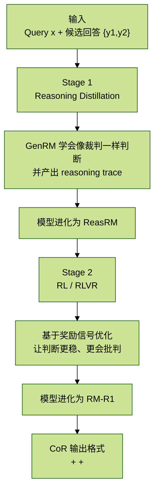

# 【第五周】RLVR 技术方案

> 本节聚焦一个非常落地的问题：如何评估 Agent 的最终输出。  
> 这里不再只是讨论传统 RM，而是结合最新社区工作，使用 `GRPO` 训练 Reward Model，并重点讲解 `RM-R1` 这条路线。

## 背景与动机

在大语言模型（LLMs）的对齐训练中，奖励建模（Reward Modeling, RM）是核心环节之一。  
它通常作为 RLHF 的“人类评审代理”，替代人工做偏好判断。

但真实场景里的偏好判断，往往不是“直接打分”这么简单，而是需要：

- 推断潜在的评价标准；
- 在多个标准之间做权衡取舍；
- 预判回答可能带来的后果。

因此，一个好的 RM 不能只会打分，还需要有一定的**深度推理能力**。

受到长链式思维（long chain-of-thought）在复杂推理任务上表现突出的启发，这里提出一个核心假设：

> 如果把奖励建模也当作一个推理任务来训练，RM 的可解释性和性能都可能显著提升。

由此，引出 `Reasoning Reward Models (REASRMs)`，以及本文重点讲解的 `RM-R1`。

---

## 1. 从 RM 到 RM-R1

### 1.1 奖励模型的角色

奖励模型（Reward Models, RMs）在 LLM 的后训练阶段起关键作用，尤其在 RLHF 中，它们承担“可扩展人类评审代理”的角色。

现有研究大致可分为两类：

1. 标量型奖励模型（ScalarRM）
2. 生成式奖励模型（GenRM）

#### ScalarRM（标量奖励模型）

- 输入：问题 $x$ 和某个候选回答 $y$
- 输出：一个分数 `score`
- 本质：把“评价/打分”理解为分类或回归问题

优点：

- 简单直接
- 推理成本低
- 易部署

缺点：

- 不解释“为什么”
- 没有中间推理过程
- 透明度弱

#### GenRM（生成式奖励模型）

- 输入：问题 $x$ 和一组候选回答 $\{y_1, y_2\}$
- 输出：自然语言裁判结果

它不是只给一个分数，而是直接回答：

> “哪个回答更好/更正确？”

并且还能给出一定分析理由。

可以把两者的差异概括为：

- `ScalarRM`：给分，但不解释
- `GenRM`：会“说话评判”，更可解释

### 1.2 奖励建模的挑战

在真实应用里，偏好判断通常是“推理 + 打分”的结合。

人类在评价回答时，往往会隐式完成下面几步：

- 先推断合适的评价维度；
- 再在不同维度之间做权衡；
- 最后根据内容事实与目标完成判断。

因此，一个真正强的 RM 应该具备：

- 任务感知能力
- 多维评审能力
- 内容驱动判断能力

### 1.3 提出：Reasoning Reward Models（REASRMs）

`REASRMs` 的核心思想是：

> 把奖励建模本身变成一个推理任务。

与普通 GenRM 相比，它更强调在评估过程中显式使用**长且连贯的推理链**。

实验发现：

- 单纯依赖 `RLVR (Reinforcement Learning with Verifiable Rewards)`，并不能充分发挥推理潜力；
- 单纯依赖普通 `CoT`，也不足以区分不同任务类型的细粒度差异；
- 因此需要新的训练流程与新的结构化评判格式。

### 1.4 RM-R1 训练流程与 Chain-of-Rubrics（CoR）

RM-R1 的整体思路分两阶段：

1. 推理蒸馏（Reasoning Distillation）
2. RLVR / 强化学习

基于这两个阶段，进一步引入 `Chain-of-Rubrics (CoR)` 机制。

CoR 的核心不是直接“选 A / 选 B”，而是：

1. 先生成本次任务应使用的评价维度（rubrics）
2. 对每个维度解释为什么重要
3. 基于这些维度逐项评估候选回答
4. 最终再给出结论

#### 一个直观的流程图



### 1.5 实验与结果

作者训练了多个 `RM-R1` 模型（7B 到 32B）。

主要观察：

- RM-R1 能产出更高质量、可解释、连贯的推理轨迹；
- 在 `RewardBench`、`RM-Bench`、`RMB` 等基准上表现出很强竞争力；
- 小参数规模下也能逼近甚至超过更大的传统 RM。

---

## 2. 训练流程总览

RM-R1 的完整训练流程包含两个核心阶段：

1. `Reasoning Distillation` 推理蒸馏
2. `Reinforcement Learning` 强化学习

目标是把一个普通指令模型（如 `Qwen-2.5-14B-Instruct`）逐步变成一个兼具：

- 强推理能力
- 良好可解释性
- 更稳定偏好判断能力

的生成式奖励模型（Generative Reward Model, GenRM）。

### 2.1 任务定义（Task Definition）

给定一个偏好数据集：

$$
D=\{(x^{(i)}, y_a^{(i)}, y_b^{(i)}, l^{(i)})\}_{i=1}^{N}
$$

其中：

- $x$：输入问题（prompt）
- $y_a, y_b$：两个不同候选回答
- $l \in \{a,b\}$：真实偏好标签，表示哪一个回答更好

我们训练一个生成式奖励模型 $r_\theta$，它不仅输出判断，还要输出一个完整的“评判过程”（judgment trace）：

$$
j=(j_1, j_2, \dots, j_T)
$$

也就是说，模型会生成一段自然语言，其中包含：

- 逐步分析
- 评价理由
- 最终偏好结论

其自回归形式可写为：

$$
r_\theta(j \mid x, y_a, y_b)=\prod_{t=1}^{T} r_\theta(j_t \mid x, y_a, y_b, j_{<t})
$$

训练目标仍然是：让最终偏好结论与真实标签一致。

### 2.2 推理蒸馏阶段（Reasoning Distillation）

#### 目标

让一个普通指令模型学会像“裁判”一样给出**有根据的偏好判断**。

#### 关键思路

虽然像 Qwen 这样的指令模型，已经能通过 prompt 回答：

> “Which response is better?”

但如果没有专门做过奖励模型式的推理训练，它的判断往往：

- 不稳定
- 理由不清晰
- 难以泛化

因此需要用高质量的 `reasoning traces` 来蒸馏它。

#### 训练数据构造步骤

1. 从偏好数据集中采样样本对 $(x, y_a, y_b, l)$
2. 调用高质量 Oracle 模型（如 `o3` 或 `Claude-3.7-Sonnet`）
3. 让 Oracle 生成结构化的评判推理轨迹 `reasoning trace`
4. 将轨迹与真实偏好标签拼成监督目标

训练完成后，模型会从普通 GenRM 进化为 `ReasRM`。

#### 输出形式

这一阶段的核心收获，不只是“会选谁更好”，而是会输出一个可解释判断过程。

### 2.3 强化学习阶段（RL Training）

蒸馏可以教会模型“像老师那样想”，但也可能让模型只会模仿老师的表达套路。  
因此第二阶段引入强化学习，让模型自己探索和优化偏好判断过程。

把奖励模型 $r_\theta(j \mid x, y_a, y_b)$ 看作一个策略模型（policy），其优化目标可写为：

$$
\max \mathbb{E}_{(x,y_a,y_b,l)\sim D,\; j\sim r_\theta}
\left[
R(x,j) - \beta D_{KL}(r_\theta \Vert r_{ref})
\right]
$$

其中：

- $R(x,j)$：奖励函数，依据判断是否正确给奖励
- $D_{KL}$：KL 正则，防止模型偏离参考模型过远
- $r_{ref}$：参考模型，通常是蒸馏后得到的 checkpoint
- $\beta$：控制探索与稳定性的平衡

优化方法使用：

- `GRPO (Group Relative Policy Optimization)`

这是一种适合对比多个采样结果的强化学习方法。

### 2.3.1 Chain-of-Rubrics（CoR）系统提示词

CoR 的目标，是让 RM-R1 的推理结构化、透明化、可审计。

#### Prompt 核心流程

1. 先判断任务类型：
   - `Reasoning`
   - `Chat`
2. 如果是 `Reasoning`：
   - 先自行求解问题
   - 再基于自己的解答评估两个候选回答
3. 如果是 `Chat`：
   - 先生成评价维度集合 `rubric`
   - 给每个维度加权并解释理由
   - 再据此对两个回答做详细比较

#### CoR 输出结构

RM-R1 的结构化输出包含三部分：

- `<rubrics>`：评价维度链（Chain-of-Rubrics）
- `<eval>`：逐维度分析与综合判断
- `<answer>`：最终偏好结果，例如 `[[A]]` 或 `[[B]]`

这一结构带来的好处是：

- 推理更透明
- 评判更可解释
- 结果更容易作为下游奖励信号使用

### 2.3.2 奖励设计（Reward Design）

RM-R1 的强化学习目标，是让模型输出正确判断。

因此使用一个基于正确性的奖励函数：

$$
R(x,j \mid y_a,y_b)=
\begin{cases}
1, & \text{if } \hat{l}=l \\
-1, & \text{otherwise}
\end{cases}
$$

其中：

- $\hat{l}$：模型在 `<answer>` 中预测的偏好结果
- $l$：真实偏好标签

有意思的是，作者还尝试过增加“格式奖励”，但效果影响不大，因为蒸馏阶段已经让模型基本学会了正确结构。

#### 两阶段逻辑总结表

| 阶段 | 方法 | 核心目标 | 数据来源 | 输出 | 模型进化 |
| --- | --- | --- | --- | --- | --- |
| Stage 1 | Reasoning Distillation | 学会结构化推理与裁判理由 | Oracle 生成的 reasoning trace | 可解释判断 | GenRM -> ReasRM |
| Stage 2 | Reinforcement Learning | 提升泛化能力与避免套模板 | 偏好数据集 $D$ | 奖励信号 $R(x,y)$ | ReasRM -> RM-R1 |

---

## 3. 实验

### 3.1 实验设置（Experimental Setup）

#### 评测基准（Benchmarks）

RM-R1 主要在三个奖励模型基准上评测：

1. `RewardBench`
2. `RM-Bench`
3. `RMB (Reward Model Benchmark)`

#### RewardBench 的数据构造流程

RewardBench 不是来自单一任务，而是聚合多个公开 benchmark 后再经过严格过滤形成的综合偏好测试集。

##### Step 1. 收集源数据（Source Datasets）

包括但不限于：

- AlpacaEval（easy / length / hard）
- MT-Bench
- LLMBar
- Refusals
- Do Not Answer
- XSTest
- HEP（多语言代码）
- PRM Math（数学推理）
- 以及 Anthropic HHH、SHP 等人类偏好数据

##### Step 2. 构造 `chosen vs rejected`

每条样本都形成：

```text
(prompt, chosen_response, rejected_response)
```

构造来源包括：

1. 强模型 vs 弱模型
2. 人工对比法
3. 对抗生成法
4. 安全性拒答法
5. 自动检测 + 元数据法

##### Step 3. 数据过滤（Filtering）

原始样本约 `5123` 条，经过人工核验、元数据校验、去重清洗、长度控制等流程，最终保留约 `2985` 条。

##### Step 4. 样本加权（Weighting）

按任务类型做再平衡：

- Chat / Safety 按样本数加权
- Reasoning 类中 math 与 code 权重平衡
- 再对所有类别求平均，得到总分

##### Step 5. 统一格式化

最终统一成标准结构，便于 HuggingFace Datasets 加载与子集过滤。

#### 训练数据（Training Data）

RM-R1 训练集主要来自三个来源：

| 数据集 | 规模 | 内容类型 | 备注 |
| --- | ---: | --- | --- |
| Skywork Reward Preference 80K | 精选子集 | 人工偏好对比数据 | 清洗后的高质量样本 |
| Code-Preference-Pairs | 8K | 代码任务偏好数据 | 提升代码推理能力 |
| Math-DPO-10K | 10K | 数学任务偏好数据 | 加强逻辑推理 |

一个关键点是：

> RM-R1 实际只用了不到 `9K` 蒸馏样本，却取得了很高的数据效率。

### 3.2 对比基线（Baselines）

RM-R1 主要与三类模型对比：

1. `ScalarRMs`
   - 代表：SteerLM-RM、Skywork-Reward、INF-ORM 等
2. `GenRMs`
   - 代表：Claude-3.5、GPT-4o、Skywork-Critic-Llama 等
3. `ReasRMs`
   - 代表：JudgeLRM、DeepSeek-PairRM、Self-taught-evaluator 等

### 3.3 主要结果（Main Results）

从截图中给出的平均分表，可以整理出：

| 模型 | 平均分 |
| --- | ---: |
| RM-R1-DeepSeek-Distilled-Qwen-32B | 81.5 |
| RM-R1-Qwen-Instruct-32B | 81.2 |
| INF-ORM-Llama3.1-70B | 78.8 |
| GPT-4o-0806 | 77.7 |
| Nemotron-4-340B-Reward | 77.1 |

#### 核心发现总结

1. State-of-the-Art 性能
   - `RM-R1-DeepSeek-Distilled-Qwen-14B` 在平均性能上已超过多种强奖励模型
   - `RM-R1-32B` 系列最高达到 `81.5`

2. 优于传统 ScalarRM
   - RM-R1 不仅分数更高，还具备更强可解释性
   - 可以视作第一个真正意义上“超越 ScalarRM 的 GenRM”

3. 拒绝采样与结构化推理之间存在明显差异
   - 仅靠 critique-based 或 rejection sampling，推理稳定性不足
   - RM-R1 通过蒸馏 + 结构化推理 + RL，突破了这一点

4. 大型 ScalarRM 存在“更大不一定更好”的现象
   - 在 RewardBench 上，模型规模更大未必直接更强
   - 说明训练方法与评测体系同样关键

5. 面向推理的专用训练有效
   - `RM-R1-Qwen-Instruct-14B > Self-taught-evaluator-Llama-3.1-70B`
   - 有明显“小模型打大模型”现象

6. 推理任务细分成绩优秀
   - Math：`91.8%`
   - Code：`74.1%`
   - 相比旧 SOTA 分别提升：
     - `+18.8%`（Math）
     - `+11.1%`（Code）

7. 数据效率显著
   - RM-R1-Instruct 系列仅用 `8.7K` 样本蒸馏
   - 对比某些 DeepSeek-Distilled 系列会用到 `800K` 样本

#### 一句话总结

RM-R1 通过“推理蒸馏 + 强化学习”两阶段训练，在较小模型规模和极低数据量下，实现了奖励模型上的 SOTA 级性能，尤其在推理密集型任务上表现突出。

---

## 4. 分析（Analysis）

本节通过实证分析，验证 RM-R1 成功的关键原因，主要看四类问题：

- 哪些训练策略决定了性能
- 模型规模和推理长度的影响
- 推理型训练的真实收益
- 案例层面的具体评判行为

### 4.1 训练配方（Training Recipes）

消融实验基于 `Qwen-2.5-Instruct-32B`，逐步叠加模块：

| 训练设置 | 描述 |
| --- | --- |
| Cold Start RL | 从 Instruct 模型直接强化学习（未蒸馏） |
| Cold Start RL + Rubrics | 在 RL 中引入 Chain-of-Rubrics 提示 |
| Cold Start RL + Rubrics + QC | 再加入 Query Categorization（任务分类） |
| Distilled + RL + Rubrics + QC | 完整 RM-R1 方案 |

截图中表 2 的关键数值可整理为：

| 方法 | Chat | Chat Hard | Safety | Reasoning | Average |
| --- | ---: | ---: | ---: | ---: | ---: |
| Instruct (Original) | 95.8 | 74.3 | 86.8 | 86.3 | 85.8 |
| Instruct + Cold Start RL | 92.5 | 81.5 | 89.7 | 94.4 | 89.5 |
| Instruct + Cold Start RL + Rubrics | 93.0 | 82.5 | 90.8 | 94.2 | 90.1 |
| Instruct + Cold Start RL + Rubrics + QC | 92.3 | 82.6 | 91.6 | 96.3 | 90.8 |
| RM-R1 | 95.3 | 83.1 | 91.9 | 95.2 | 91.4 |

#### 结论

1. 单纯 Cold Start RL 不够
   - 虽然对推理任务有提升
   - 但整体仍落后于完整 RM-R1

2. Rubrics 提示有明显帮助
   - CoR 让模型先生成 rubric / 维度链再判断
   - 尤其对 Chat 与 Safety 任务有益

3. Query Categorization（QC）进一步帮助
   - 明确区分 `Reasoning` / `Chat`
   - 有助于模型更有针对性地产生推理

4. 蒸馏（Distillation）是关键提升来源
   - 在 RL 前注入高质量推理轨迹
   - 在所有任务上都能带来稳定改进

### 4.2 扩展性分析（Scaling Effects）

作者从两个维度研究扩展规律：

1. 模型规模（Model Size）
2. 推理时计算量（Inference-time Compute）

### 4.2.1 模型规模（Model Size）

以 `Qwen-2.5-Instruct` 的 7B / 14B / 32B 为例，在三大基准上取平均后观察到：

- 参数量越大，性能近似线性上升
- 趋势可外推到更大规模
- 说明 RM-R1 训练策略符合某种 `Scaling Law`

直观解释：

> 大模型本身推理能力更强，RM-R1 的推理式训练能更充分释放这种潜能。

### 4.2.2 推理时计算量（Inference-time Compute）

固定底座模型：

- `DeepSeek-R1-Distill-Qwen-14B`

控制变量：

- 推理阶段允许生成的 token 上限

观察结论：

- 推理链越长，RM 表现通常越好
- 更高 compute 预算下，模型能进行更深入比较与验证

Takeaway 2：

- 模型越大，推理奖励模型性能越高
- 推理链越长，性能越好
- RM-R1 在这两个维度都呈现近线性提升

### 4.3 推理训练有效性（Effectiveness of Reasoning Training）

这一节专门对比：

- 推理式训练
- 仅答案导向训练（SFT）

截图中的表 3 可整理为：

#### 全量数据对比

| 训练方式 | RewardBench | RM-Bench | RMB | 平均 |
| --- | ---: | ---: | ---: | ---: |
| Instruct + SFT | 90.9 | 75.4 | 65.9 | 77.4 |
| Instruct + Distilled + SFT | 91.2 | 76.7 | 65.4 | 77.8 |
| RM-R1* | 91.4 | 79.1 | 73.0 | 81.2 |

#### 9K 蒸馏数据对比

| 训练方式 | RewardBench | RM-Bench | RMB | 平均 |
| --- | ---: | ---: | ---: | ---: |
| Instruct + SFT (9K) | 88.8 | 74.8 | 66.9 | 76.6 |
| Instruct + Distilled* (9K) | 89.0 | 76.3 | 72.0 | 79.2 |

#### 关键结论

1. 推理训练 > 仅答案训练
   - RM-R1 在所有基准上均显著超过 SFT-only

2. 即便数据量很少，只要加入蒸馏推理轨迹，性能也会明显提升

3. 蒸馏 alone 就有显著增益
   - 说明结构化推理链在 Reward Modeling 中非常有价值

Takeaway 3：

> 推理训练显著提升奖励建模性能。  
> 相较直接答案 SFT，它不仅泛化更强、数据效率更高，而且在小数据场景依然表现优异。

### 4.4 案例分析（Case Study）

作者给了一个很典型的医学问答案例：

#### 问题

> sickle-cell disease（镰状细胞病）的症状有哪些？

#### Chatbot A

特点：

- 列了很多症状
- 看起来“很全”
- 但包含错误症状，如：
  - painful red/yellow skin lesions

#### Chatbot B

特点：

- 先解释疾病机制
- 再说明症状可能因人而异
- 症状覆盖更科学
- 最后给出就医建议

#### Cold-start RL evaluation 的问题

如果没有经过推理蒸馏的初始 RL 模型，它常用的 rubric 会更偏表面化，只看：

- Relevance
- Comprehensiveness
- Clarity

它容易得出：

> A 更全面，所以 A 更好

问题是：

- 只看形式，不看事实
- 忽略了准确性（Accuracy）
- 对医学任务这种强事实性场景会出错

#### RM-R1 evaluation

RM-R1 会动态生成更合理的 rubric，例如主动加入：

- Accuracy（准确性）
- Comprehensiveness（全面性）
- Clarity（清晰度）
- Helpfulness（帮助性）

并且会：

- 对每个维度逐项分析
- 解释为什么 Accuracy 对医学任务权重更高
- 明确指出 A 中的事实性错误
- 最终选择 B

#### 这个案例说明了什么

1. 透明的评判过程（Transparent Judging）
   - 推理轨迹逻辑清晰、可解释

2. 高质量、任务相关的 Rubrics
   - 不同任务会自动生成不同关键维度
   - 医学问答会主动强调 `Accuracy`

3. 忠实遵循 Rubrics + 内容驱动判断
   - 不是看表面形式
   - 而是依照真实内容和事实做判断

一句话概括：

> RM-R1 是“理解任务 -> 生成标准 -> 基于事实评估”的可解释裁判，  
> 而 Cold-start RL 更像“强表面打分 -> 形式判断”的裁判。

---

## 5. 可拓展方向

### 一、主动偏好收集（Active Preference Collection）

让 `ReasRM` 具备主动学习（Active Learning）能力。

当当前的 Rubric 集合无法覆盖新的偏好样本时，模型可以：

- 识别“自己不知道什么”
- 主动请求人类补充新的 Rubric
- 从“被动学”变成“主动问”

### 二、向更广泛场景扩展

1. 多模态奖励建模（Multimodal Reward Modeling）
2. Agent 场景（Agentic Reward Modeling）

这意味着 RM-R1 未来不只评估文本，还能评估：

- 图像
- 视频
- 动作序列
- 多模态智能体执行过程

### 三、总体方向

RM-R1 提供了一个很有启发性的方向：

> 奖励模型不应该只是“黑箱打分器”，  
> 而应该成为一个**结构化、可解释、任务感知的偏好裁判系统**。

## 一句话总结

RM-R1 通过“推理驱动的蒸馏 + 强化学习 + Chain-of-Rubrics”三件套，把奖励建模从“直接打分”推进到了“可解释裁判”阶段。  
它不仅在 RewardBench、RM-Bench、RMB 上全面超越多类传统 RM，还证明了：在小模型、少数据场景下，只要训练配方设计得对，生成式奖励模型同样可以做到 SOTA。
