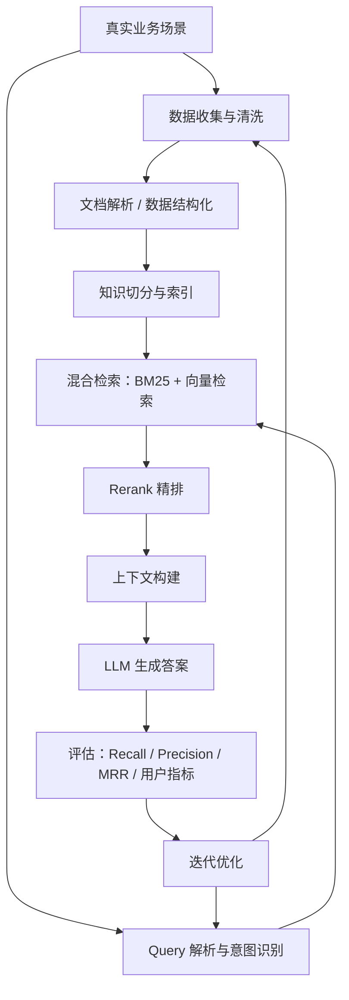
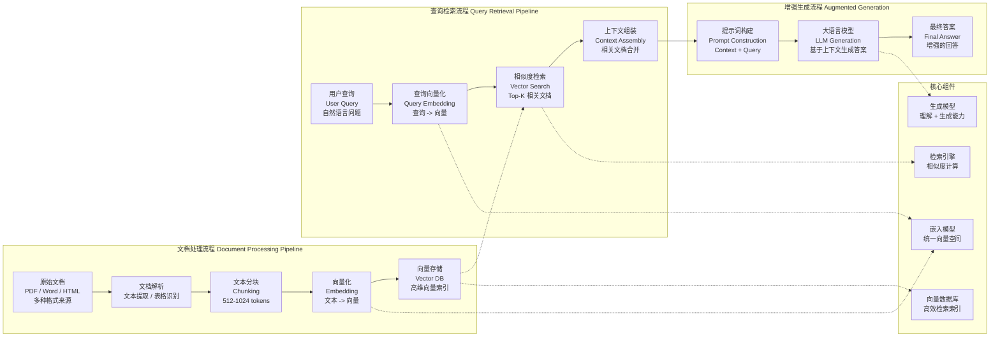
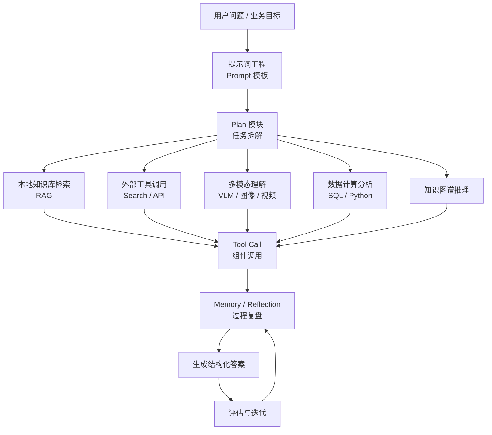
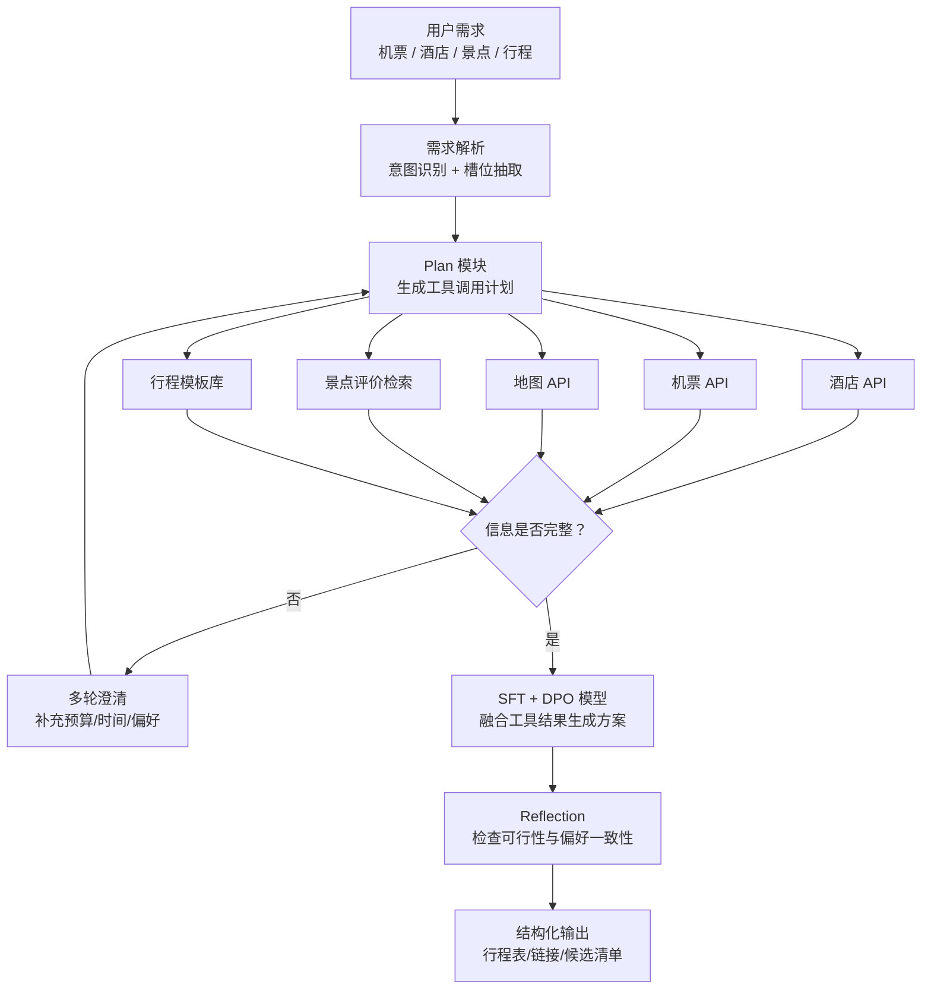

# 【第二周】脱胎换骨——秋招简历/面试问题诊断与场景迁移策略

> 😎 **核心目标：解决“简历挂”和“一面挂”的痛点。** 通过深度诊断，将你的项目经历进行“工业级”包装，并掌握将一个项目讲出多种花样的“场景迁移”能力。

## 详细内容展开

- **简历“金标准”**：拆解大厂面试官眼中的“顶级简历”范式，从项目描述、技术栈写法到量化指标，逐项优化你的简历。
- **项目经历深度挖掘**：针对课程中的 RAG、Agent 等项目，教你如何从“我做了什么”升级到“我解决了什么问题、带来了什么价值、体现了什么能力”，打造 STAR 法则的完美范本。
- **场景迁移核心策略（本周重点）**：演示如何将一个“金融 RAG 项目”的经验，巧妙迁移并应用到面试“电商推荐”、“智能客服”甚至“自动驾驶数据处理”等不同岗位的提问中，展现你强大的知识迁移和举一反三的能力。

## 本周你能获得

- 一份让面试官眼前一亮的、极具竞争力的个人简历。
- 掌握将任何项目经历都能与目标岗位需求完美匹配的“场景迁移”面试神技。
- 一套应对各类面试常见问题的系统性回答策略。

## 1. 先来给简历打个分吧

**1-5 分，2 分进实习面试，3 分进正式岗位面试，4 分良好，5 分优秀。**

### Case 1：1 完全不能用

项目经历只有传统 CV/图像分类和癌症分级类内容：

- 卷积神经网络图像分类：分类准确率达到 96%，熟悉 CNN 实现与调优流程。
- 乳腺癌癌症分级：分级准确率达到 78%，掌握图像预处理流程以及遗传算法的调优方法。

问题：项目和大模型/互联网岗位关联弱，缺少能够支撑目标岗位的技术叙事。

### Case 2：2.5

法律文书审核 Agent。

项目背景：针对法律文书审核量大、培训成本高的问题，打造智能问答与辅助审查系统，提高文书审核效率。

工作内容：

- 主导需求调研、方案设计与核心算法模型开发。
- 协调法务、产品、IT 等团队，推动系统快速上线。
- 维护评估指标并迭代模型，确保稳定高效。

应用效果：

- 支持合同、判决书、起诉书等多类型法律文书问答与审查。
- 覆盖企业、行业、案件查询多工具。
- 覆盖多渠道、多系统入口。
- 周均调用量 1.4w+ 次，解决率 91%，替代率 30.1%。

### Case 3：3 分简历，几乎无算法优化和实现细节，缺少系统性的设计思路和优化思路

基于 RAG 的工业系统知识问答系统。

时间：2024.01 - 2024.12

- 用 LLM 映射口语化同义词表，Bert 类模型实现 query 意图识别、实体抽取。
- 实施多路混合召回策略（M3E、BGE-M3、BM25），small2Big 策略提高检索准确率，并用 cross-encoder 实现精排，准确率和召回率提升至 90% 以上。
- 实施意图和实体缓存，提升多轮对话连续性和准确率。
- 问答系统多轮准确率达 89.6%，较原生 GPT-4 外挂知识库提升 5.1%，且节省成本。

### Case 4：3 分简历，为什么要调，数据怎么构建，微调之后的模型评估是怎么做的

基于 Qwen3 的旅行 AI 助手与人类偏好对齐。

时间：2025.01 - 2025.03

- 项目简介：基于 Qwen3-1.7B，采用 QLoRA 在消费级单卡环境下，构建了一个高质量的旅行 AI 助手模型。
- 高效微调与 SFT：基于 QLoRA 技术显著降低显存需求，同时构建了 2000 条 “prompt-response” 格式的旅行场景指令集（如行程规划、景点推荐、出行建议等）进行监督微调 SFT。
- DPO：接着在 500 条 “prompt-chosen-rejected” 自建偏好数据集上，完成了用户偏好对齐（如行程个性化推荐、交通方式取舍）。
- 项目成果：完成了数据构建、模型微调与效果评估的全流程，实现了基座模型在旅行场景下的回答准确性与个性化推荐能力的提升。

### Case 5：2.5 分简历，毫无逻辑

LLM 的医疗报告生成系统。

时间：2024.03 - 2024.07

- 参与 Qwen-14B 的增量预训练，重点在医疗通用知识方向扩展，提升模型对医学语境的理解与生成准确度。
- 基于 ViT-CLIP 范式对图像-文本对进行微调，使模型能够捕捉医疗影像与文本报告的语义联系。
- 在医疗报告生成任务中，利用 LoRA 有监督微调并结合 DeepSpeed 分布式加速方案，模型在 BLEU 指标上较基线提升约 2%。
- 将模型部署至 vLLM 推理框架，相比 Hugging Face 库实现 1.2 倍推理速度提升，显著改善响应性能与并发处理能力。

### Case 6：乍一看 3.5-4 分的简历，3 分简历，如何评估（业务毫无关系，假，无评估）

基于 LLM 的超市运营智能问答系统。

时间：2024.01 - 2024.04

项目背景：实体零售行业数字化升级背景下，超市运营与服务管理面临信息繁多、系统查询存在高频刚需、运营决策缺乏数据支撑等挑战。为提升运营效率和顾客满意度，超市需构建一个强大的大模型系统，以提供高效、精准、智能化的运营支持。

主要内容：

1. 数据准备与清洗：构建问答数据集，基于困惑度指标评估文本质量，从原始数据中筛选出 10W 条高质量问答对用于模型训练。
2. 模型环境部署：在 Ubuntu 系统中通过 Docker 与 DeepSpeed 构建 GPU 训练与推理环境。
3. 模型训练与微调：基于 LLaMA-Factory 框架，运用 10W 条问答数据完成 Qwen 的 LoRA 微调，随后再利用包含 1W 条营运团队标注的偏好对数据集（Pairwise）通过 DPO 算法微调进一步优化处理。
4. 构建 RAG 数据库：基于 LangChain 设计文本切分策略，调用 bge-large-zh 模型为每个片段生成 Embedding，并使用 Faiss 向量库构建高效向量索引，同时支持文档的增量更新与过期清理，确保检索的实时性与精准度。
5. 模型校准、评估与测试：通过温度调节与输出截断等方式校准回答风格，确保符合运营话术与品牌规范。引入 TruLens 多维度评估体系，通过模拟超市运营高频场景设计 100+ 测试用例并联合运营团队实测，验证系统的输出质量与准确性。

项目结果：在营运团队测试中，按照 TruLens 评价体系衡量，经过训练和优化后的模型评分从 63.2 分提升至 86.7 分。

### Case 7：3 分简历（没有对齐业务、看似写了其实啥都没写、没有评估指标）

基于 LLM 的金融问答助手。

数据工程 Data Engineering：

- ETL（Extract-Transform-Load）：爬取法规条文、合规政策文件等原始数据，清洗并格式化为包含 content 和 metadata 的 Document，载入数据库。

检索增强生成 RAG：

1. Feature：对合规文档进行清洗、分块，embedding model 将 chunk 映射到高维向量空间，存入向量数据库。
2. Retrieval：
   - Pre-retrieval：Query Expansion 提示 LLM 基于原始 query 生成多条 query，缓解相似度搜索局限；Self-query 提取 metadata（如法规类型、发布时间）作为检索过滤参数。
   - Retrieval：Filtered vector search 输入扩展 query 并设置 metadata 条件，limit 指定获取前 K 个高相似度片段。
   - Post-retrieval：Reranking 使用 CrossEncoder 对检索到的 N*K 个文档片段重新打分，选取前 K 个语义最相关的片段，结合 prompt_template 进入生成阶段。

微调 Fine-tuning：

1. Instruction 数据集：提示 LLM 基于法规片段生成 instruction-output 对，构造合规模型的 Instruction Dataset。
2. LoRA 微调 Llama-3.1-8B：
   - PEFT 模型配置 r=32，alpha=32，目标模块为 Attention 层与 FFN 层。
   - SFTTrainer 训练：拼接指令响应对，添加特殊标记；max_seq_length=2048，packing=True，梯度累计提升 batch size。
   - 得到模型 FinLlama-3.1-8B。

偏好对齐 Preference Alignment：

1. Preference 数据集：构造 `(prompt, chosen, reject)` 三元组，chosen 为引用法规原文的合规答案，reject 为不规范或偏离的回答。过滤掉不合格样本。
2. DPO 直接偏好优化 FinLlama-3.1-8B：
   - 基于 LoRAConfig 的 PEFT 模型进行参数高效更新。
   - 使用 DPOTrainer，ref_model=None，β=0.5，reward/margin 评估模型区分 chosen 与 rejected 的能力，得到 FinLlama-3.1-8B-DPO。

模型评估 LLM-as-a-judge：

- 使用测试集 instruction，提示模型生成 answer，温度设为 0.8。
- 通过 LLM-as-a-judge 从准确性与合规风格两个维度评估结果，设计分级标准并提供 few-shot 示例。
- 输出为 JSON 格式，每个指标对应分析与评分，最终计算模型均分。

## 你是不是也有下面的问题

### 1.1 完全没有思路，没有项目，或者项目非常浅，完全没有竞争力

### 1.2 简历经历很突兀

对于校招的同学，让人觉得奇怪，你这个项目哪儿来的呢？

对于社招的同学，面试官会问，你在工作的时候还接别的外包项目吗？

### 1.3 在看我写的简历示例的时候不知道怎么改，不知道哪里是重点

### 1.4 没有量化的结果，不知道怎么选取量化的指标

- 月均调用 8w+ / 10.8
- 200-300
- Recall@10 从 30% 提升到 95%
- 推动多源数据融合、问答准确率和稳定性全面提升

### 1.5 层次化很混乱，完全没有逻辑，让人不想看下去

### 1.6 按照倒序排列，重点放前面

### 1.7 以前简历是做后端/测试/或其他行业的，该怎么分配简历的占比

## 2. 该如何结合我们的实战项目，让你的简历经历合理真实

### 2.1 校招的同学怎么办

- 有实习，和大模型有关：**你不要把自己当实习生，要去了解整个这个 AI 项目的业务逻辑。**
- 有实习，和大模型无关（比如 Java、后端、数据分析）：**手头的业务、手头的场景怎么和 AI 结合。**
- 无实习，结合实验室研究方向（生物医药、金融、法律、其他泛工科类）：**实验室方向结合。**
- 无实习，也没有实验室，主要是本科，或者完全不相关的（比如语言、经济学等）：**目前手头业务结合。**

### 2.2 社招的同学怎么办

- 工作经历有关系。
- 工作经历属于开发、数据、测试、自动驾驶算法等互联网技术类岗位。
- 工作经历毫无关系。

## 3. 不同经历简历的通用写法

**我们现在看看我们给的模板，看如何迁移到别的领域呢？**

### 3.1 RAG

#### 为什么要做

**场景 + 原因 + 算法实现 + 评估**

1. **把场景想明白**：我在做一个什么事儿。
   - 在我这个专业的真实业务场景里面到底是怎么落地的。
   - 在教学、科研的场景中可以怎么落地。
2. **为什么要做 RAG**，能解决这个场景里面的是什么问题。
   - LLM 没办法做到及时的更新迭代、最新的数据。
   - 基于本地没有训练过的知识，是没办法进行回答的，隐私的数据。
   - 对于幻觉容忍度很低的场景。
3. **我做这个事情整体的流程是什么**，用户是谁，用户怎么用的，用户用完了之后解决了他的什么问题。

#### 怎么做

4. 在做的过程中会遇到什么问题？用了什么方法解决的？产生了什么样量化的结果？

一定不是我做了什么，而是我做的事情产生了什么结果，体现了我的是什么能力（skills，解决问题的能力，学习的能力）。

整个过程要套在一套完整的逻辑上。就是 RAG 的构建逻辑。

#### RAG 构建逻辑



每一个场景的问题都是相似的：

- 【RAG 实战-第 8 天】实战项目的简历准备、面试、运用（离线解析模块）
- 【RAG 实战-第 9 天】实战项目的简历准备、面试、运用（在线召回模块）

#### 做成了什么样

我们要去看系统性的优化思路：**2 阶段 3 模块 20 个优化点，什么时候用什么，怎么评估。**

##### 为什么要做意图识别？

在一个场景当中，我们不可能用一套逻辑涵盖用户所有的课程课程查询。

示例召回链路：

```text
---95%--- | ---95%--- | ---95%--- | ---95%--- -> 95%
```

要追问：

- 混合检索怎么再进行优化呢？
- 数据解析模块的本质？
- DataAgent（api、sql、JSON 逻辑树、FAQ）各种来源的数据自动化处理管道。

##### 文档解析与数据处理层级

- **Level 2**：基于 MinerU，数据处理管道。MinerU 存在什么问题，你怎么魔改 MinerU，解决了（水印识别不准、手写体、印刷体重合）。**使用 AI 的能力极其重要。**
- **Level 3**：构造 DataAgent，5000XX，联合 API、JSON、FAQ 等各种格式的数据，搭建自动化数据处理管道，根据不同的业务逻辑和意图识别的结果，去不同的数据库查询，Recall，回答 xxx。

#### 文档处理与查询检索流程



##### 合理的 business impact（可选）

#### 场景切换：工业系统

如何思考怎么切换呢：

1. 这个场景里面的数据哪些是外部获取不到的。
2. 用户在这里面和人工是怎么交互的，或者原来是怎么获取答案的。

##### RAG 问答系统开发与优化（工业系统知识库）

时间：2024.01 - 2024.12

项目背景：

在工业设备运维与知识管理场景下，用户常需要快速获取标准操作规程、设备故障排查方法和安全规范。本项目旨在构建基于 RAG 的工业知识问答系统，提升问答准确率和对话连续性，为一线人员提供低成本、高效率的知识获取服务。

主要挑战：

1. **数据非结构化**：工业文档形式多样，包括 PDF 扫描件、操作规程 Word 文档、维护日报 Excel、故障图片等，缺乏结构化数据库。
2. **口语化查询与专业术语的鸿沟**：用户多以自然口语提问，如“机器卡住怎么办”，但知识库以专业术语为主。
3. **召回准确率不足**：传统向量检索、BM25 检索在长文本、复杂 Query 下覆盖率有限。
4. **多轮对话场景复杂**：涉及设备多步骤操作，需保持上下文一致性。
5. **系统成本与性能平衡**：需在高准确率与大规模调用成本之间找到最佳平衡。

系统模块设计：

1. **结构化数据构建**（如果是搭建一套 DataAgent，你会怎么做，可选）
   - **数据整合与清洗**：收集工业说明书、规程、报表、维修记录、扫描 PDF 与图纸，统一格式化。
   - **基于 MinerU 的非结构化文本处理**：对扫描文档进行 MinerU 识别，最大限度还原文档语义。
   - **知识切分与索引**：采用段落/表格/列表切分方法，避免关键信息丢失。
   - **弱结构化抽取**：从非结构化文本中抽取设备型号、故障类型、操作步骤，构建知识索引表（Metadata、开关、电源、xxx）和 metadata 匹配策略。
2. **Query 解析与优化**（不要超过两个用 model 的，或者逻辑并行）
   - **口语化映射**：通过 LLM 生成同义词表，将口语化 Query 映射到标准术语。
   - **语义识别**：结合 qwen3 0.6B 模型实现 Query 意图识别与实体抽取（结合 metadata），解决混合检索解决不了的问题。
   - **Query 重写**：自动将模糊或不完整的用户提问改写成标准化问题，提升召回率。
   - **Query 意图识别**：bert/qwen3 0.6b + 规则意图识别，不同意图识别采用动态的混合检索权重，整体 Recall@10 从 xx% 提升至 xx%。
3. **检索与召回模块**
   - **多路混合召回**：结合向量检索（BGE-M3、BGE-M3E）与关键词检索（BM25），实施 small2Big 策略，Recall@10 从 xx%。
   - **精排策略**：基于 Cross-Encoder 实现重排（Rerank），MRR 从 0.xx 提升至 0.xx。
   - **指标表现**：整体检索准确率与召回率从 xx% 提升至 90%+。
4. **对话连续性与缓存**
   - **意图缓存**：对用户连续对话进行意图缓存，减少重复推理开销。
   - **实体缓存**：保存用户查询中的设备型号/步骤，保证后续对话的连贯性。
   - **多轮对话优化**：通过上下文追踪，提升多轮对话的连续性和准确率。

项目成果：

1. 问答系统多轮准确率从 35% 提升至 89.6%。
2. 检索准确率与召回率从 30% 提升至 90%+，显著优化工业场景知识获取效率。
3. 系统成本优化：在维持高精度的同时，较原始方案显著降低调用成本。

技术栈：

- NLP/LLM：BERT、qwenBGE、ChatGPT
- 检索引擎：Elasticsearch（BM25）、向量数据库（Milvus）、Cross-Encoder（精排）
- 优化策略：small2Big 策略、多轮缓存、Query 重写

##### 场景切换：美团商家问答助手

RAG 问答系统开发与优化（美团问答 AI 助手）。

时间：2024.06 - 2025.12

项目背景：

本项目旨在构建面向美团商铺场景的智能问答助手（RAG）问答系统，整合全站千万级多模态数据（商铺详情页、用户评论、菜单图片、视频探店、UGC 评价等），为用户提供即时、精准、可解释的商铺咨询服务。

主要挑战：

1. **多模态数据解析**：商铺信息形式多样，包含文字介绍、菜品图片、探店短视频、用户长评等，需统一解析。（dataAgent）
2. **检索准确率不足**：用户查询常为口语化问句，如“附近有什么好吃的火锅”“这家店人均多少”，需解决商铺召回与匹配的语义鸿沟。
3. **多样化需求场景**：用户既可能查询具体商铺（如“XX 烤鱼好不好吃”），也可能查询泛化场景（如“北京三里屯约会适合去哪”）。
4. **信息真实性与时效性**：商铺信息更新频繁（菜单、营业时间、评分），需保证系统答案与最新线上内容保持一致。

系统模块设计：

1. **基础数据和知识库构建**
   - **数据收集与切分**：整合商户页面、菜品介绍、用户评论、探店视频字幕，结合分句/表格/列表切分策略，避免丢失关键信息。
   - **VLM 优化**：对商户上传的菜单图片进行 VLM 识别，提取菜品与价格信息。
   - **多模态同步（元数据构建）**：菜品照片与评论匹配，视频字幕与商户详情匹配，提升答案的丰富度与真实性。
2. **Query 模块优化**
   - **意图识别**：利用大模型和 BERT 分类器结合 Prompt Engineering，区分“找商铺类”“评价类”“推荐类”三大核心查询意图。
   - **Query 重写与扩写**：将口语化查询改写为标准化检索请求，如“推荐适合家庭聚餐的川菜馆”。
   - **多轮澄清**：当用户问题模糊时，LLM 自动生成澄清提问，如“请问您更倾向于火锅还是烤鱼？”
3. **检索与召回模块**
   - **混合检索（BM25 + 向量检索）**：结合语义检索和关键词检索，BM25 保障精确，向量检索保障语义覆盖。
   - **Embedding 优化**：基于用户评论和商铺标签微调 BGE/SimCSE，增强“口味”“环境”“性价比”等维度的匹配效果，Recall@10 从 xx% 提升至 xx%。
   - **重排（Rerank）**：使用 Cross-Encoder（BERT/RoBERTa）对候选结果二次打分，确保检索结果相关性。
   - **排序指标**：MRR、Precision@K、NDCG@K 提升 20%+。
4. **答案生成与多样化输出**
   - **多模态上下文融合**：结合商铺图片/评论/视频片段，生成丰富的答案。
   - **多轮交互与可控性**：通过 Context Injection 在回答中嵌入标准标签，提升答案一致性与可控性。
   - **风格化生成**：支持“点评风格”（中立总结）与“博主推荐风格”（带感性语言）的双模式输出。
   - **解释性支持**：答案附带数据来源标注（如“人均¥120，数据来源：用户评论，更新时间 2025.02”）。

项目成果：

1. 系统召回准确率显著提升：Top5 准确召回率 65% 提升至 90%，MRR 从 0.52 提升至 0.76。
2. 多样化答案生成：风格化回答与上下文融合使用户满意度提升 30%；用户在系统内停留时长增加 20%。
3. 高并发与可扩展性：系统支持日均 1000 万+ 次查询，支持热点场景（节假日搜索高峰）。
4. 商铺直达转化：用户在问答后点击商铺详情页和下单率提高 25%，验证了业务价值。

技术栈：

- NLP/LLM：BERT/RoBERTa、BGE、ChatGPT/Qwen
- 检索引擎：Elasticsearch（BM25）、Milvus（向量检索）、Cross-Encoder（Rerank）
- 多模态：VLM（菜单识别）、视频字幕解析、菜品图片标签化

### 3.2 Agent 简历怎么写

想一想人类的专家在这里面怎么做，Agent 怎么在里面替代人。

**工作流是灵魂，组件化是核心。**

#### 工作流

1. 先查询本地知识库，找到患者的病例信息，以及相关的专业知识-RAG。
2. 查询一下网络上类似的案例，去看一下解决方案是什么。
3. 调用多模态 LLM，去看一下拍的片子存在什么问题。
4. 数据的计算和分析，得到一个数据分析的结果。
5. 知识图谱，胃病-肝病....

#### Agent 工作流课程迁移



这里面的优化点（简历能写的点）在哪儿呢？

1. 工作流系统的设计（看 Claude 的带读）。
2. 工具化的组建集成（MCP 工具的集成）（看第七周课程）。
3. Plan 模块的准确度（看急救营第 4 周）。
4. Reflection 模块的准确度（看急救营第 5 周）。

从“提示词工程”到“上下文工程”，prompt 模板。

#### SalesPilot / 金融问答 Agent 简历示例

新能源车企销售培训助手（SalesPilot）。

时间：2024.01 - 2025.02

项目描述：构建了融合本地知识库检索（RAG）与实时网络搜索的多模态智能销售 Agent，帮助国内某新能源汽车企业显著提升一线销售的专业度与转化率。

核心技术与方法：

1. **RAG 检索与知识构建**：利用 LlamaIndex + Milvus + BGE 搭建本地知识库检索系统，使用 BM25 与向量相似度混合召回，实现对上万条产品信息的精准匹配，Recall@10 从 53% 提升至 89%。
2. **AI + WebSearch 组件**：通过 Serper Search API 获取竞品/政策/市场/行业实时信息，采用查询扩展（Query Expansion）与关键词拆解，筛选 Top50 网页信息，去重并基于相关度和时间权重二次过滤至 Top32，构造问答对并传递给大模型。
3. **多 Agent 工作流**：使用 ReAct + Reflection + Memory 机制，将用户需求拆解给不同 Agent 执行，包括本地知识检索与 Web 搜索、动态决策调用顺序；Reflection 模块能够对检索结果进行思考与修正，Memory 模块保留上下文，实现类人销售对复杂问题的深层回答。
4. **问答生成与后处理**：在给出回答前，综合用户 Query、拓展信息、检索问答对，由大模型统一生成 Markdown 格式的回答，并给出引用与卡片式要点；最后通过后处理对答案进行逻辑审核和提纲式归纳。

量化成果：

- 系统每日为一线销售员提供超过 500+ 次交互式培训与信息检索服务，答案准确率达 92% 以上。
- 相比传统资料手册查询，人均沟通准备时间降低 40%，销售培训周期缩短 30%。

个人贡献：

- 实现 Agent 组件开发，包括 RAG 管线搭建、Serper 搜索 API 与大模型调用、ReAct 多 Agent 工作流的指令编排与记忆机制设计。

智能保险销售 Agent。

项目描述：作为技术负责人，面向保险销售场景构建了融合本地知识库检索（RAG）与实时金融数据搜索的多模态智能销售 Agent。该系统帮助数千名保险代理人实现对保险条款、市场政策及金融数据的精准查询和合规化解答，显著提升代理人的专业度与客户转化率。

核心技术与方法：

1. **RAG 检索与知识构建**
   - 采用 llamaindex + Milvus + BGE 搭建本地知识库，将海量保险产品资料、条款条目与常见问答向量化后存储。
   - 使用 BM25 与向量相似度混合召回，增强对专业词汇和长尾问题的识别与检索。
   - 关键检索指标 Recall@10 从 53% 大幅提升至 89%，显著提高检索的覆盖度和准确度。
2. **AI + 金融数据搜索组件**
   - 集成金融数据 API（依据自身场景确定用什么 api）获取行业监管政策、投资收益参考、宏观金融指标等实时信息。
   - 采用查询扩展（Query Expansion）与关键词拆解，筛选 Top50 数据来源并去重，根据相关度与时间权重过滤至 Top32，构造问答对并传递给大模型。
   - 确保对最新保险监管规定、金融市场波动等核心信息及时捕捉并反馈给代理人。
3. **多 Agent 工作流**
   - 引入 ReAct + Reflection + Memory 机制。
   - ReAct Agent 根据用户询问动态决策调用本地知识检索或金融数据搜索，综合结构化信息与外部行情资讯。
   - Reflection 模块生成反思规则引擎，对检索结果和潜在回答进行风险合规审查，规避误导性荐买误导性内容。
   - Memory 模块记录用户上下文与过往对话，使代理人对同一客户的能连续一致的沟通策略并对复杂案例给出持续跟进。
   - 面对复杂条款或保单配置场景，系统可多轮检索与思考，自动排查潜在合规风险并提供合适的答复。
4. **问答生成与后处理**
   - 在回答生成阶段，综合用户 Query、拓展信息与检索问答对，由大模型统一生成 Markdown 格式答案。
   - 自动提炼核心卡片式要点并标注信息来源，代理人可一目了然获取关键信息。
   - 最终对回答进行逻辑审核与合规性校验，对有疑义或高风险的回答进行拦截或修改，确保响应专业且合规。

量化成果：

- 检索与回答性能：系统每日为代理人提供 500+ 次交互式数据查询和知识问答，回答准确率达 92%+。
- 检索结果合规率保持在 99% 以上，极大降低违规话术风险。

个人贡献：

- **RAG 管线与风控集成**：主导 BM25 与向量检索融合设计，集成金融数据 API 并在 Reflection 中嵌入风控规则引擎。
- **多 Agent 工作流开发**：实现 ReAct + Reflection + Memory 的指令编排与调用逻辑，支持复杂保险场景下的多步骤推理和内容合规检测。
- **性能与指标提升**：针对金融与保险专业术语，优化 Token 分词与同义词词库，显著提升检索精确度。
- **系统迭代与合规监控**：负责定期对知识库与规则引擎进行更新与测试，确保系统输出可持续高质量且符合监管要求。

#### 旅行 AI 助手简历示例

基于 Qwen3 的旅行 AI 助手与人类偏好对齐。

时间：2025.01 - 2025.03

项目描述：

基于 Qwen3-32B，采用 QLoRA 完成高效微调，构建了一个支持多工具调用的旅行 AI 助手。该助手能够进行 **行程规划、景点推荐、订酒店、订机票、查地图、出行建议** 等综合旅行咨询与个性化推荐服务，并结合 DPO 方法实现人类偏好对齐（思考题）。

核心技术与方法：

**PLAN 模块工具调用微调**

- 针对旅行场景构建 2000 条“用户需求-工具调用计划-工具输出-最终回复”的数据。
- 微调重点不在单纯文本生成，而在让模型学会如何规划并调用工具链（如先查航班 -> 再订酒店 -> 最后生成行程表）。
- PLAN 模块支持多轮规划，可动态调整调用顺序（例如：先锁定机票，再筛选酒店 -> 或根据预算优先选酒店，再规划交通）。

**人类偏好对齐 DPO（Direct Preference Optimization）**

可思考：为什么要做偏好对齐？哪些场景下偏好对齐能体现业务价值？

**Agent 工作流**

1. **用户需求解析**
   - 识别用户输入意图，如“订上海到东京的机票”、“推荐三日游行程并加上海滩活动”、“找附近的五星级酒店”。
2. **工具调用模块**
   - **订酒店 API**：调用第三方酒店数据库，支持多条件筛选（预算、地理位置、星级、评分）。
   - **订机票 API**：查询航班信息，比较航司、价格、时间段，并支持多段行程。
   - **地图查询 API**：调用在线地图服务，获取地理位置、路线规划（步行/自驾/公共交通）。
   - **景点评价检索**：结合旅游点评数据（UGC），推荐适合不同人群的景点。
   - **行程模板库**：提供标准化行程组合，支持根据需求调整（加减天数、偏好活动）。
3. **生成与对齐**
   - 调用经过 SFT + DPO 优化的 Qwen3 模型生成结果，并融合多工具信息。
   - 输出结构化 Markdown 结果，如完整行程表、机票预订链接、酒店候选清单、地图导航链接。
4. **多轮优化与反馈**
   - 用户可追加修改需求（如“把海边行程换成温泉”），系统自动调整方案并再次调用相关工具完成优化。

项目成果：

- 构建并完成旅行助手的端到端流程，集成订酒店、订机票、查地图等多工具调用，实现了复杂旅行需求的自动化处理。
- 模型在旅行场景测试集上的 **回答准确率从 54% 提升至 89%**。

个人贡献：

- 主导数据构建与清洗，完成旅行场景 2000 条指令微调数据与 500 条偏好对齐数据。
- 设计并实现工具链调用框架，完成酒店、机票、地图等外部 API 接入与多轮交互逻辑。
- 搭建端到端评估体系，覆盖回答准确率、推荐合理性、工具调用成功率与用户偏好对齐度。

建议：不要找老师帮你画一个旅行 Agent 工作流图（类似 SalesPilot 的 ReAct + Memory + Reflection 模块图），这样的流程图在简历里能直观看到“用户问题 -> 工具调用 -> 模型对齐 -> 个性化输出”的流程，会非常加分。

#### 旅行 Agent 工作流图



### 3.3 SFT 简历怎么写

【微调 12】领域 LLM 微调标准化过程。

#### 为什么要微调？

到底是什么促使了你的 prompt 和 RAG 都行不通，非要微调呢？

尽量基于 7b、14b 的模型。

1. **回答风格**
   - 更有层次性、更有逻辑性、更有结构性。
   - 改变回答风格，比如心理学里面更加强温柔、更有同理心等等。
2. **固定的 QA 或者简单直接（1b 或 3b 的意图识别）的场景。**
3. **Reflection 模块是否跳出。**

#### 数据集是怎么构建的？

1. 公司原来的一到底怎么构建的呢？（人工整理 Q 怎么来 + 专家标注 A 怎么来）**双盲双检**。
2. 网上开源的（为什么选这个）。
3. 知识蒸馏（Q 怎么来）- 人工筛选。

#### 结果是怎么评估的？

不要再写 BLEU 这些机器翻译时代的评估标准！LLM + 人工评估（核心是提前定义好了评估的维度和标准）。

- 可量化的：基于规则看准确度。
- 不可量化的：
  1. 人工专家作为评估标准。
  2. 更强的 LLM 作为评估者。
  3. 语意相似度 + 关键词命中 + 规则过滤 + 其他适用于这个场景的可量化指标。

基于 xx 问题，通过 xx 方法，构造了 xx 数据，基于 xx base model，达到了什么量化结果（相比之前有了多少提升）。

#### Function Calling 微调示例

Function Calling 微调：在报价、库存、实时检索等 5 类业务场景下，使用 2000+ 样本（30% 负样本含边界用例）的 LoRA 微调，基于 Qwen3-4B 进行 LoRA 微调，通过“真实销售对话 -> 数据合成 -> GPT 生成 -> 人工校验 -> 多轮迭代”，构造训练数据，解决基础模型函数调用不稳、参数抽取偏差问题，使函数选择准确率 **78% -> 95%**、参数 EM **71% -> 96%**、Overall Call Accuracy 至 **95%**。

1. **为什么要微调**

   在销售业务场景下（报价、库存、实时检索等 5 类任务），基础模型在函数调用方面存在两个主要问题：
   - **函数调用不稳**：模型经常错误选择工具或调用失败。
   - **参数抽取偏差**：对于价格区间、时间范围、产品规格等边界情况处理不准确。

   因此需要通过 Function Calling 微调，提升模型在真实业务场景中的调用稳定性和参数解析精度。

2. **数据是怎么构造的**

   - **来源**：从真实销售对话中抽取函数调用相关片段。
   - **合成**：基于真实对话扩充任务场景，结合 GPT 生成多样化样本。
   - **人工校验**：对生成数据进行人工审核和纠错，确保函数调用格式与参数标注准确。
   - **迭代优化**：采用“真实对话 -> 数据合成 -> GPT 生成 -> 人工校验 -> 多轮迭代”的流程，逐步提高数据质量。
   - **规模与结构**：共构建 2000+ 样本，其中 **30% 为负样本**（覆盖边界条件与异常情况），保证模型在极端输入下的稳健性。

3. **微调效果如何评估**

   - **方法**：使用 trl 库对 Qwen2.5-7B 进行 LoRA 微调，并在 held-out 测试集上进行函数调用评估。
   - **指标**：
     - 函数选择准确率：从 78% 提升至 86%。
     - 参数抽取精确匹配率（EM）：从 71% 提升至 83%。
     - 整体调用准确率（Overall Call Accuracy）：提升至 79%。

**Instruction 数据集构建**

- **场景覆盖**：金融投顾 5 类典型业务——报价计算、产品库存、实时行情检索、客户信息查询、订单处理。
- **数据生成流程**：采用“真实投顾对话 -> 数据合成 -> GPT 生成 -> 人工校验 -> 多轮迭代”的流程，构造 **2000+ 样本**。
- **负样本设计**：其中 **30% 为负样本**，覆盖边界输入与异常情况（如缺失参数、无效证券代码、极端价格范围）。

**LoRA 微调 Qwen3-8B**

- **训练配置**：使用 trl 库 + PEFT，LoRA 配置 rank=32、alpha=32、lr=5e-5，目标模块为 Attention 与 FFN 层。
- **训练方式**：在函数调用指令数据上进行 SFT 微调，使模型学会稳定调用工具（报价 API、行情 API、客户信息 API 等），并正确解析参数。
- **评估结果**：
  - 函数选择准确率：78% -> 86%
  - 参数精确匹配率（EM）：71% -> 83%
  - Overall Call Accuracy：提升至 85%
- **模型产出**：得到更稳定可靠的 Plan 模型，能够在金融投顾场景下支持报价、行情、客户服务等核心任务。

## 4. 怎么准备面试并且一步步迭代

你的专属面试宝典模板。

准备一个飞书文档，把：

1. 什么场景，为什么做。
2. 用了什么方法，怎么做。
3. 做的时候遇到了什么问题，怎么解决（这里你需要挖一些坑，提前预设好面试官的问题）。
4. 产生了什么量化的结果。

用一个完整的故事的形式写出来，每一次面试后进行迭代。

给自己设置一个 FAQ 的文档，每次面试后，补充和完善。

**让你的求职变成一次强化学习！**
