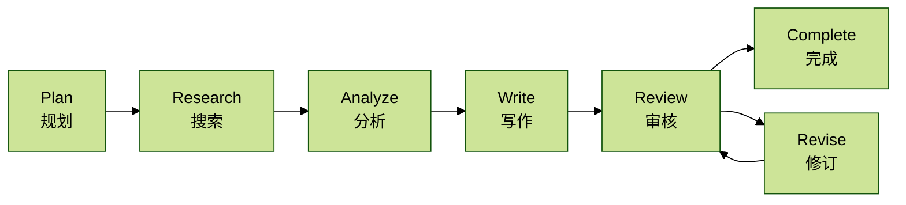
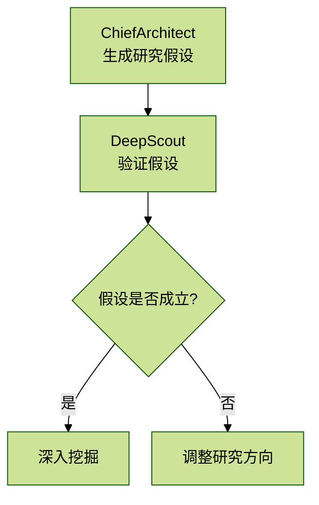

# 1.1 项目定位与核心能力

> 今天我们将用上前面 5 节课讲解的所有知识。

## 一、项目概述

### 1.1 项目定位

行业信息助手是一个**多智能体协作的 AI 深度研究系统**，专为行业分析师、投资研究人员、企业战略部门设计，能够自动完成从**信息收集、数据分析到报告撰写**的完整研究流程。

核心价值主张：

- 将传统需要 3-5 天的行业研究工作压缩到 30 分钟内完成
- 通过多智能体协作保证研究的深度和质量
- 自动化的数据可视化和专业排版
- 可追溯的信息来源和可验证的数据

### 1.2 应用场景

1. 行业研究报告生成
   - 快速了解某个行业的市场规模、竞争格局、技术趋势
   - 生成符合投行标准的深度研究报告
2. 企业竞争分析
   - 分析特定企业的市场地位、业务模式、财务表现
   - 横向对比多个竞争对手
3. 政策影响评估
   - 追踪政策变化对行业的影响
   - 预测政策趋势
4. 技术趋势研判
   - 识别新兴技术的发展阶段
   - 评估技术成熟度和商业化前景

## 二、核心能力拆解

### 2.1 多智能体协作架构

本项目采用 6 个专业 Agent 分工协作的模式，每个 Agent 各司其职：

| Agent 角色 | 英文名 | 核心职责 | 使用模型 |
| --- | --- | --- | --- |
| 总架构师 | ChiefArchitect | 问题分析、大纲规划 | deepseek-v3.2 |
| 深度侦探 | DeepScout | 全网搜索、信息收集 | qwen-plus |
| 数据分析师 | DataAnalyst | 数据提取、知识图谱构建 | deepseek-v3.2 |
| 代码极客 | CodeWizard | 数据可视化、图表生成 | deepseek-v3.2 |
| 首席笔杆 | LeadWriter | 报告撰写、内容整合 | deepseek-v3.2 |
| 审核大师 | CriticMaster | 对抗式审核、质量把控 | deepseek-v3.2 |

文件位置：`/backend/app/service/deep_research_v2/agents/`

相关文件：

- `architect.py`（行号约 `1-351`）
- `scout.py`（行号约 `1-1390`）
- `data_analyst.py`（行号约 `1-479`）
- `wizard.py`（行号约 `1-1302`）
- `writer.py`（行号约 `1-489`）
- `critic.py`

### 2.2 LangGraph 工作流编排

项目采用 LangGraph 构建状态机工作流，实现智能路由和循环审核机制：



关键特性：

- 条件路由：审核后能够判断是否需要补充搜索或修订
- 状态持久化：全局状态在所有 Agent 间共享
- 实时流式输出：通过 SSE 向前端推送进度

文件位置：`/backend/app/service/deep_research_v2/graph.py`（行号约 `197-232`）

### 2.3 全局工作记忆（Global Working Memory）

所有 Agent 共享一个全局状态对象 `ResearchState`，包含：

| 状态字段 | 数据类型 | 说明 |
| --- | --- | --- |
| `outline` | `List[Section]` | 动态研究大纲 |
| `facts` | `List[Fact]` | 结构化事实库（带可信度评分） |
| `data_points` | `List[DataPoint]` | 数据点集合 |
| `charts` | `List[Chart]` | 生成的可视化图表 |
| `draft_sections` | `Dict[str, str]` | 章节草稿 |
| `final_report` | `str` | 最终报告（Markdown） |
| `references` | `List[Reference]` | 参考文献 |
| `critic_feedback` | `List[Feedback]` | 审核反馈 |
| `knowledge_graph` | `Dict` | 知识图谱 |

文件位置：`/backend/app/service/deep_research_v2/state.py`（行号约 `105-156`）

### 2.4 双模式信息检索

#### 1. 网络搜索模式

- 搜索引擎：Bocha Web Search API
- 深度阅读：使用 `trafilatura` 提取网页正文
- 递归搜索：发现新线索自动深挖
- 信源评级：对来源进行可信度评分（0-1）

评分标准：

- 官方来源（政府、央企）：`0.9-1.0`
- 学术来源（论文、研究机构）：`0.8-0.95`
- 权威媒体（央媒、财经媒体）：`0.7-0.85`
- 行业报告（券商、咨询）：`0.7-0.9`
- 一般新闻：`0.5-0.7`
- 自媒体：`0.2-0.5`

文件位置：`/backend/app/service/deep_research_v2/agents/scout.py`（行号约 `1057-1122`）

#### 2. 本地知识库模式

- 向量检索：使用 Milvus 向量数据库
- 语义搜索：基于阿里 `text-embedding-v4` 模型
- 文档解析：支持 PDF、Word、Excel 等多种格式
- 分块索引：智能文档分块，保留上下文

文件位置：`/backend/app/service/milvus_service.py`

### 2.5 数据分析与可视化

数据提取能力：

- 从非结构化文本中提取结构化数据点
- 时间序列数据识别
- 市场份额、增长率等关键指标计算
- 数据交叉验证和去重

可视化生成：

- ECharts 图表：由 `DataAnalyst` 生成配置，前端直接渲染
- Python 绘图：由 `CodeWizard` 执行 Python 代码生成 PNG 图片
- 支持图表类型：折线图、柱状图、饼图、雷达图、桑基图、知识图谱

Prompt 位置：`/backend/app/service/deep_research_v2/agents/data_analyst.py`（行号约 `31-98, 143-242`）

作用：这些 Prompt 指导 LLM 如何从文本中提取数据、构建知识图谱、生成 ECharts 配置。

### 2.6 代码沙箱执行

`CodeWizard` 拥有唯一的 Python 代码执行权限，用于数据分析和绘图。

安全机制：

- 白名单模式：只允许导入特定模块（`pandas`、`numpy`、`matplotlib` 等）
- 禁止列表：禁止文件操作、网络请求、系统调用
- 隔离环境：在独立的全局作用域中执行
- 自愈能力：执行失败时自动调用 LLM 修复代码

代码执行流程：

1. LLM 生成代码
2. 语法检查（`compile`）
3. 安全检查（正则匹配禁止模式）
4. 沙箱执行（`exec`）
5. 捕获图表（`plt.savefig` -> `base64`）
6. 如失败，反馈错误给 LLM 修复（最多 3 次）

文件位置：`/backend/app/service/deep_research_v2/agents/wizard.py`（行号约 `1074-1302`）

### 2.7 对抗式审核机制

`CriticMaster` Agent 充当“红队”角色，对报告进行严格审核。

审核维度：

- 信息完整性（缺失关键数据）
- 来源可靠性（缺少权威来源）
- 逻辑一致性（前后矛盾）
- 事实准确性（过时数据、幻觉）
- 偏见识别（片面观点）

审核输出：

- 问题严重级别：`critical / major / minor`
- 问题类型：`missing_source / logic_error / hallucination` 等
- 修复建议：具体的改进方向
- 质量评分：`1-10` 分

智能路由：

- 缺失信息 -> 补充搜索（回到 `Research` 阶段）
- 文字问题 -> 修订报告（进入 `Revise` 阶段）
- 无严重问题 -> 完成（进入 `Complete`）

Prompt 位置：`/backend/app/service/deep_research_v2/agents/critic.py`

文件位置：`/backend/app/service/deep_research_v2/graph.py`（行号约 `636-673`）

## 三、技术创新点

### 3.1 假设驱动研究（Hypothesis-Driven Research）

传统 AI 研究工具采用“关键词搜索 -> 信息堆砌”的模式，本项目创新性地引入了**假设驱动机制**：



示例：

- “假设 AI 市场将保持高增长，需要用数据验证增速”
- “假设某类技术会成为主流，需要找证据支持或反驳”

文件位置：`/backend/app/service/deep_research_v2/agents/architect.py`（行号约 `136-154`）

### 3.2 信源追溯（Source Tracing）

当搜索结果引用了其他数据源（如“据 XX 统计”），系统会自动生成追溯查询，试图找到原始出处。

```text
搜索结果："根据 IDC 报告，2024 年 AI 市场规模达 5000 亿"
  ↓
自动生成追溯查询："IDC 2024 AI 市场规模报告"
  ↓
找到原始报告链接，提升数据可信度
```

文件位置：`/backend/app/service/deep_research_v2/agents/scout.py`（行号约 `765-791`）

### 3.3 实时 SSE 流式输出

前端通过 Server-Sent Events 实时接收研究进度。

事件类型：

- `phase`：阶段切换（`planning / researching / writing` 等）
- `thought`：Agent 思考过程
- `action`：Agent 执行的操作
- `observation`：操作结果
- `search_results`：搜索结果（增量推送）
- `chart`：图表生成
- `section_content`：章节内容（流式显示）
- `report_draft`：报告初稿
- `checkpoint_saved`：检查点保存成功

文件位置：`/backend/app/service/deep_research_v2/graph.py`（行号约 `377-727`）

> 说明：原截图中有一张前端界面局部图，用来说明这些事件如何在前端被消费。本次未插入图片，只保留结构化说明。

### 3.4 检查点恢复（Checkpoint & Resume）

研究过程中自动保存检查点，支持断点续研。

保存时机：

- 每个阶段完成后
- 用户手动取消时
- 异常中断时

恢复机制：

- 从最近的检查点恢复状态
- 继续未完成的阶段
- 保留已收集的所有数据

文件位置：`/backend/app/service/checkpoint_service.py`

## 四、性能指标

| 指标 | 数值 | 说明 |
| --- | --- | --- |
| 平均研究时长 | 20-40 分钟 | 取决于问题复杂度 |
| 搜索深度 | 3 层递归 | 从初始搜索到信源追溯 |
| 数据点提取 | 50-100 个 | 每次研究平均提取的数据点 |
| 图表生成 | 2-5 个 | ECharts + Python 绘图 |
| 报告字数 | 3000-8000 字 | 符合专业研究报告标准 |
| 来源数量 | 20-40 个 | 去重后的有效信息源 |

## 五、核心依赖

### 5.1 LLM 模型

- 主力模型：DeepSeek V3.2（规划、分析、写作、审核）
- 快速模型：Qwen Plus（搜索阶段）
- API 提供商：阿里云百炼 DashScope

文件位置：`/backend/app/config/llm_config.py`（行号约 `37-81`）

### 5.2 搜索 API

- 提供商：Bocha API
- 特性：支持摘要生成、时效性过滤、结果数量控制

### 5.3 向量数据库

- 技术：Milvus 2.x
- 嵌入模型：阿里 `text-embedding-v4`（1024 维）
- 存储：PostgreSQL 元数据 + Milvus 向量索引

### 5.4 数据库

- 主数据库：PostgreSQL（用户、会话、知识库元数据）
- 缓存：Redis（检查点、会话状态）

## 六、关键设计原则

1. 可解释性优先
   - 所有结论必须有来源引用
   - 数据点带可信度评分
   - 完整的执行日志
2. 质量高于速度
   - 审核-修订循环确保质量
   - 多源验证关键信息
   - 拒绝生成无依据内容
3. 模块化与可扩展
   - Agent 职责单一，易于替换
   - 状态机设计清晰，易于扩展新阶段
   - 支持新增数据源和工具
4. 用户体验至上
   - 实时进度反馈
   - 支持中途取消和恢复
   - 可视化过程报告

## 七、常见问题

### Q1：为什么使用多智能体而不是单一 Agent？

A：单一 Agent 容易陷入“万能助手”的陷阱，无法在每个任务上做到专业。多智能体分工协作，每个 Agent 可以优化自己的 Prompt 和模型，提升整体质量。

### Q2：生成的报告可信度如何保证？

A：三层保障机制：

1. 信源评级系统（只采纳可信度 `> 0.6` 的事实）
2. `CriticMaster` 对抗式审核（发现幻觉和矛盾）
3. 完整的引用链（用户可追溯每个数据来源）

### Q3：能否支持垂直领域定制？

A：可以。主要方式包括：

1. 调整 Agent 的 Prompt 模板（针对特定行业加入行业 knowhow）
2. 配置领域知识库（导入行业专业文档）
3. 设置搜索偏好（优先级、来源白名单）

### Q4：与 ChatGPT、Claude 等通用 LLM 有何区别？

A：通用 LLM 擅长对话和知识问答，但难以完成系统性的深度研究。本项目的优势在于：

- 自动搜索和信息收集
- 结构化的数据提取和分析
- 专业的报告排版和引用
- 可验证的信息来源

## 八、后续章节导航

- `[1.2 系统架构全景图解读]`
- `[1.3 技术选型与设计决策]`

第二部分将深入讲解每个 Agent 的实现细节。

## 补充说明

- 本文已将工作流和假设驱动流程改写为 Mermaid。
- 本文未使用本地 `assets/`、临时路径图片或整页截图。
- 本批截图没有追加信号，所以当前文档按这一批内容完整落地，不标记 partial。
