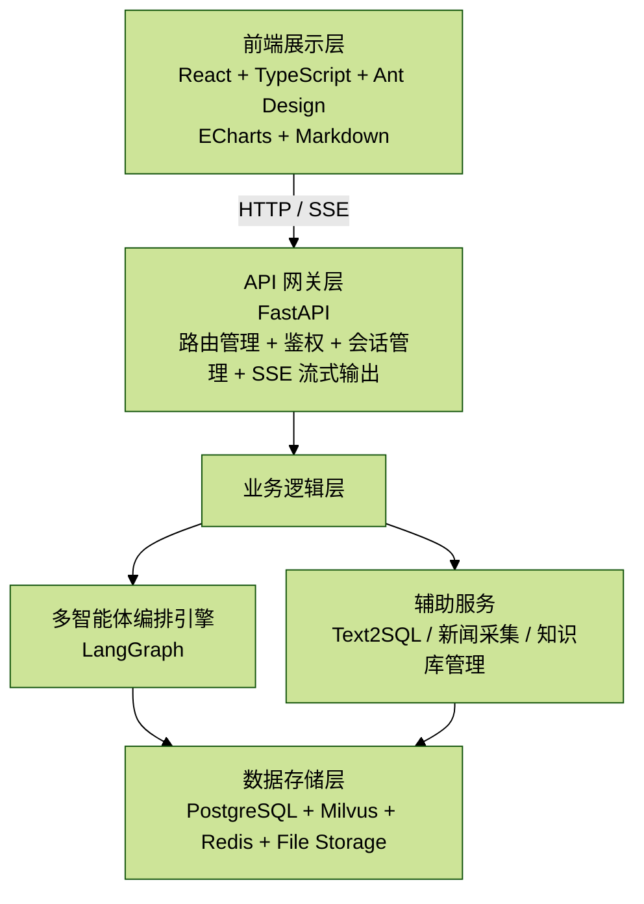
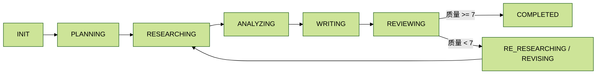
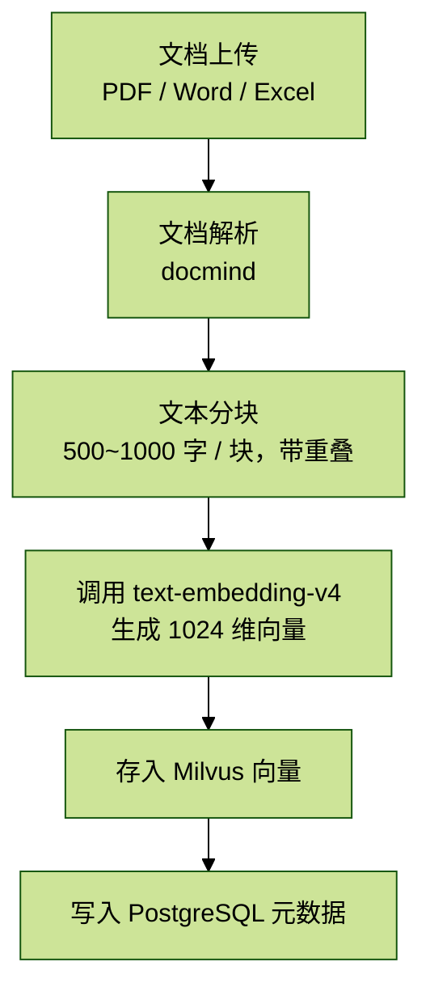
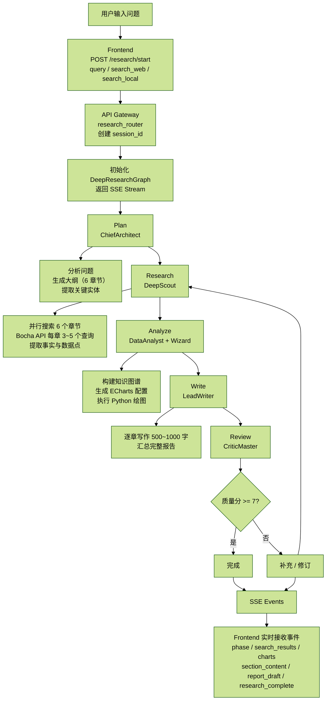
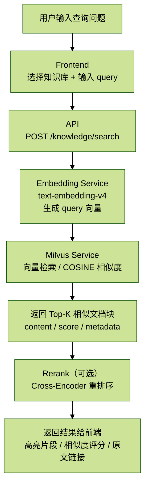
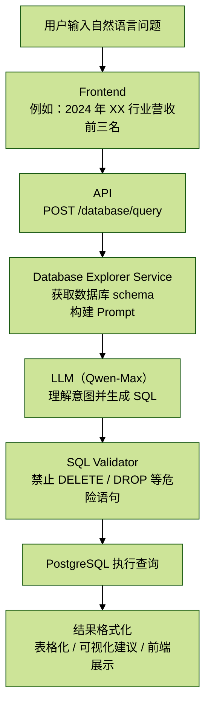

# 1.2 系统架构全景图解读

## 一、整体架构视图

### 1.1 四层架构



业务分层可以概括为：

- 前端层：承载交互、可视化、Markdown 渲染与研究过程展示。
- API 层：将前端行为映射为不同的 FastAPI 接口，并负责统一入口与实时推送。
- 业务层：核心是 LangGraph 驱动的多 Agent 协作流程。
- 数据层：结构化数据、向量检索、缓存与文件存储共同支撑系统运行。

文件位置：`/backend/app/app_main.py`（行号约 `1-100+`）

## 二、核心模块详解

### 2.1 前端架构（不用掌握）

技术栈：

- 框架：React 18 + TypeScript
- UI 组件：Ant Design 5.x
- 数据可视化：ECharts 5.x + Recharts
- Markdown 渲染：`react-markdown` + `rehype-highlight`
- 状态管理：Zustand（轻量级）
- HTTP 客户端：Axios

核心页面：

| 页面 | 路径 | 功能 |
| --- | --- | --- |
| 首页 | `/` | 入口和功能概览 |
| 深度研究 | `/chat` | 研究问题输入和过程报告 |
| 知识库管理 | `/knowledge` | 文档上传和向量化 |
| 数据库探索 | `/database` | Text2SQL 查询 |
| 新闻中心 | `/news` | 行业新闻浏览 |

文件位置：`/frontend/src/router/routes.tsx`

关键组件：

1. 研究详情面板：`/frontend/src/pages/chat/component/research-detail/`
2. Markdown 渲染器：`/frontend/src/components/markdown/`
3. 图表组件：`/frontend/src/components/chart/`

研究详情面板负责：

- 实时显示研究进度
- 多 Tab 切换（过程报告 / 最终报告 / 引用 / 图表）
- SSE 事件监听与状态更新

Markdown 渲染器负责：

- 代码高亮
- 数学公式渲染
- 表格美化

图表组件负责：

- ECharts 配置解析
- Base64 图片显示
- 响应式布局

### 2.2 API 网关层

FastAPI 路由结构的本质，是把前端不同页面行为映射到不同服务接口：

```text
/api
├── /auth                     # 用户认证
│   ├── POST /login
│   ├── POST /register
│   └── GET /me
├── /research                 # 深度研究
│   ├── POST /start           # SSE
│   ├── POST /cancel
│   ├── GET  /checkpoint/:session_id
│   └── POST /resume/:session_id
├── /knowledge                # 知识库管理
│   ├── POST   /create
│   ├── POST   /upload
│   ├── GET    /list
│   └── DELETE /:kb_id
├── /database                 # 数据库探索
│   ├── GET  /tables
│   ├── POST /query           # Text2SQL
│   └── GET  /schema/:table_name
├── /news                     # 新闻接口
│   ├── GET /list
│   └── GET /:news_id
└── /memory                   # 记忆查看
    ├── GET /list
    └── GET /:session_id
```

文件位置：

- `/backend/app/router/research_router.py`
- `/backend/app/router/knowledge_router.py`
- `/backend/app/router/database_router.py`

### 2.3 多智能体编排引擎

核心类：`DeepResearchGraph`

```python
class DeepResearchGraph:
    def __init__(self, llm_api_key, llm_base_url, search_api_key, model):
        self.architect = ChiefArchitect(...)
        self.scout = DeepScout(...)
        self.data_analyst = DataAnalyst(...)
        self.wizard = CodeWizard(...)
        self.critic = CriticMaster(...)
        self.writer = LeadWriter(...)

        self.graph = self._build_langgraph()

    def _build_langgraph(self):
        workflow = StateGraph(ResearchState)

        workflow.add_node("plan", self._plan_node)
        workflow.add_node("research", self._research_node)
        workflow.add_node("analyze", self._analyze_node)
        workflow.add_node("write", self._write_node)
        workflow.add_node("review", self._review_node)
        workflow.add_node("revise", self._revise_node)

        workflow.add_edge("plan", "research")
        workflow.add_edge("research", "analyze")
        workflow.add_edge("analyze", "write")
        workflow.add_edge("write", "review")
        workflow.add_conditional_edges(
            "review",
            self._should_revise,
            {"revise": "revise", "complete": END}
        )

        return workflow.compile()
```

文件位置：`/backend/app/service/deep_research_v2/graph.py`（行号约 `67-233`）

状态机节点本质上都是异步函数，最终调用对应 Agent 的 `process`：

```python
async def _plan_node(self, state: ResearchState) -> Dict[str, Any]:
    logger.info("Executing Plan node...")
    state = dict(state)
    state["phase"] = ResearchPhase.INIT.value
    result = await self.architect.process(state)
    return dict(result)
```

### 2.4 状态管理

全局状态结构 `ResearchState` 很重，它同时承载基础信息、规划输出、知识库结果、分析输出、写作结果、审核反馈和元数据。

```python
class ResearchState(TypedDict):
    query: str
    session_id: str
    phase: str
    iteration: int
    max_iterations: int

    search_web: bool
    search_local: bool

    outline: List[Dict[str, Any]]
    key_entities: List[str]
    research_questions: List[str]
    hypotheses: List[Dict[str, Any]]
    knowledge_graph: Dict[str, Any]

    facts: List[Dict[str, Any]]
    data_points: List[Dict[str, Any]]
    raw_sources: List[Dict[str, Any]]

    charts: List[Dict[str, Any]]
    code_executions: List[Dict[str, Any]]
    insights: List[str]

    draft_sections: Dict[str, str]
    final_report: str
    references: List[Dict[str, Any]]

    critic_feedback: List[Dict[str, Any]]
    unresolved_issues: int
    quality_score: float
    pending_search_queries: List[str]

    logs: List[Dict[str, Any]]
    errors: List[str]
    messages: List[Dict[str, Any]]
```

文件位置：`/backend/app/service/deep_research_v2/state.py`（行号约 `105-156`）

状态流转：



每个阶段结束后，状态都会序列化保存到检查点服务，前端也会收到对应阶段更新。

> 说明：原截图中有一张前端状态栏界面图，但本次未插入远程图床图片，只保留了结构化文字说明。

### 2.5 数据存储层

#### 2.5.1 PostgreSQL 数据库

核心表结构示例：

```sql
CREATE TABLE users (
    id SERIAL PRIMARY KEY,
    username VARCHAR(50) UNIQUE,
    email VARCHAR(100) UNIQUE,
    hashed_password VARCHAR(255),
    created_at TIMESTAMP DEFAULT NOW()
);

CREATE TABLE sessions (
    id VARCHAR(50) PRIMARY KEY,
    user_id INTEGER REFERENCES users(id),
    query TEXT,
    status VARCHAR(20),
    created_at TIMESTAMP DEFAULT NOW(),
    completed_at TIMESTAMP
);

CREATE TABLE knowledge_bases (
    id SERIAL PRIMARY KEY,
    name VARCHAR(100),
    user_id INTEGER REFERENCES users(id),
    description TEXT,
    document_count INTEGER DEFAULT 0,
    created_at TIMESTAMP DEFAULT NOW()
);

CREATE TABLE documents (
    id SERIAL PRIMARY KEY,
    kb_id INTEGER REFERENCES knowledge_bases(id),
    filename VARCHAR(255),
    file_type VARCHAR(20),
    file_size BIGINT,
    chunk_count INTEGER,
    uploaded_at TIMESTAMP DEFAULT NOW()
);

CREATE TABLE industry_data (
    id SERIAL PRIMARY KEY,
    industry_name VARCHAR(100),
    data_type VARCHAR(50),
    value DECIMAL,
    unit VARCHAR(20),
    year INTEGER,
    source VARCHAR(255),
    created_at TIMESTAMP DEFAULT NOW()
);

CREATE TABLE news (
    id SERIAL PRIMARY KEY,
    title VARCHAR(255),
    summary TEXT,
    url VARCHAR(500),
    source VARCHAR(100),
    published_at TIMESTAMP,
    collected_at TIMESTAMP DEFAULT NOW()
);
```

文件位置：`/backend/app/models/`（各个 model 文件）

#### 2.5.2 Milvus 向量数据库

Collection 结构：

```python
fields = [
    FieldSchema(name="id", dtype=DataType.INT64, is_primary=True, auto_id=True),
    FieldSchema(name="kb_id", dtype=DataType.INT64),
    FieldSchema(name="doc_id", dtype=DataType.INT64),
    FieldSchema(name="chunk_index", dtype=DataType.INT64),
    FieldSchema(name="content", dtype=DataType.VARCHAR, max_length=65535),
    FieldSchema(name="embedding", dtype=DataType.FLOAT_VECTOR, dim=1024),
    FieldSchema(name="metadata", dtype=DataType.JSON)
]

index_params = {
    "index_type": "IVF_FLAT",
    "metric_type": "COSINE",
    "params": {"nlist": 128}
}
```

文件位置：`/backend/app/service/milvus_service.py`（行号约 `30-80`）

向量化流程：



#### 2.5.3 Redis 缓存

用途：

1. 检查点存储：`checkpoint:{session_id}`
   - 存储研究过程的完整状态
   - TTL：24 小时
2. 会话状态：`session:{session_id}:status`
   - 跟踪当前研究状态
   - 支持取消操作
3. 搜索缓存：`search_cache:{query_hash}`
   - 缓存 Bocha 搜索结果
   - TTL：1 小时

文件位置：`/backend/app/core/redis_client.py`

## 三、数据流详解

### 3.1 深度研究数据流



### 3.2 知识库查询数据流



### 3.3 Text2SQL 数据流



## 四、关键技术实现

### 4.1 SSE 实时推送

后端实现：

```python
async def event_generator():
    message_queue = asyncio.Queue()
    state["_message_queue"] = message_queue

    task = asyncio.create_task(agent.process(state))

    while not task.done():
        try:
            msg = await asyncio.wait_for(message_queue.get(), timeout=0.5)
            yield f"data: {json.dumps(msg, ensure_ascii=False)}\n\n"
        except asyncio.TimeoutError:
            yield f"data: {json.dumps({'type': 'heartbeat'})}\n\n"
```

文件位置：`/backend/app/service/deep_research_v2/graph.py`（行号约 `400-436`）

前端接收：

```javascript
const eventSource = new EventSource('/api/research/start');

eventSource.onmessage = (event) => {
  const data = JSON.parse(event.data);

  switch (data.type) {
    case 'phase':
      updateProgressBar(data.phase);
      break;
    case 'search_results':
      appendSearchResults(data.results);
      break;
    case 'chart':
      renderChart(data);
      break;
    case 'section_content':
      streamMarkdown(data.content);
      break;
  }
};
```

文件位置：`/frontend/src/pages/chat/newchat.tsx`

> 备注：原始截图里还有一张 `SSE vs WebSocket` 的对比信息图，这类图更适合保留原始裁剪图作为视觉证据。本次未接入远程图床上传，所以这里只保留文字结论：
>
> - SSE：单向推送、基于 HTTP、实现简单，适合研究进度流式更新
> - WebSocket：双向通信，适合高频实时交互

### 4.2 检查点机制

保存检查点：

```python
def save_checkpoint(session_id: str, state: Dict, ui_state: Dict) -> str:
    checkpoint_data = {
        "backend_state": state,
        "ui_state": ui_state,
        "timestamp": datetime.now().isoformat(),
        "status": "in_progress"
    }

    redis_client.setex(
        f"checkpoint:{session_id}",
        86400,
        json.dumps(checkpoint_data)
    )

    db.execute(
        "INSERT INTO checkpoints (session_id, data) VALUES (?, ?)",
        (session_id, json.dumps(checkpoint_data))
    )
```

恢复检查点：

```python
def load_checkpoint(session_id: str) -> Dict:
    data = redis_client.get(f"checkpoint:{session_id}")
    if data:
        return json.loads(data)

    row = db.execute(
        "SELECT data FROM checkpoints WHERE session_id = ? ORDER BY created_at DESC LIMIT 1",
        (session_id,)
    ).fetchone()

    if row:
        return json.loads(row['data'])

    return None
```

文件位置：`/backend/app/service/checkpoint_service.py`（行号约 `50-120`）

### 4.3 代码沙箱

安全检查：

```python
FORBIDDEN_PATTERNS = [
    r'\bimport\s+os\b',
    r'\bimport\s+sys\b',
    r'\bimport\s+subprocess\b',
    r'\bopen\s*\(',
    r'\bexec\s*\(',
    r'\beval\s*\(',
]

def _is_code_safe(code: str) -> bool:
    import re
    for pattern in FORBIDDEN_PATTERNS:
        if re.search(pattern, code, re.IGNORECASE):
            logger.warning(f"Forbidden pattern detected: {pattern}")
            return False
    return True
```

沙箱执行：

```python
def _execute_in_sandbox(code: str) -> Dict:
    exec_globals = {
        '__builtins__': {
            'print': print,
            'len': len,
            'range': range,
        },
        'pd': pd,
        'np': np,
        'plt': plt,
        'sns': sns,
    }

    stdout_capture = io.StringIO()

    try:
        with redirect_stdout(stdout_capture):
            exec(code, exec_globals)

        fig = plt.gcf()
        if fig.get_axes():
            buf = io.BytesIO()
            fig.savefig(buf, format='png', dpi=150)
            buf.seek(0)
            chart_b64 = base64.b64encode(buf.read()).decode('utf-8')
            return {"success": True, "charts": [chart_b64]}
    except Exception as e:
        return {"success": False, "error": str(e)}
```

文件位置：`/backend/app/service/deep_research_v2/agents/wizard.py`（行号约 `1074-1302`）

## 五、性能优化

### 5.1 并发处理

1. 并行搜索：DeepScout 对多个章节并发执行搜索
2. 异步 LLM 调用：使用 `asyncio` 并发调用多个 LLM 接口
3. 流式输出：边计算边推送，减少用户等待时间

### 5.2 缓存策略

1. 搜索结果缓存：相同查询 15 分钟内命中缓存
2. 向量缓存：已向量化文档不重复计算
3. LLM 响应缓存：相同 Prompt 结果缓存 1 小时

### 5.3 数据库优化

1. 索引优化：在高频查询字段建立索引
2. 分页查询：限制单次查询结果数量
3. 连接池：复用数据库连接

## 六、安全机制

### 6.1 认证鉴权

- JWT Token：无状态认证
- Password Hashing：bcrypt 加密存储
- CORS 配置：限制跨域请求

文件位置：`/backend/app/core/security.py`

### 6.2 输入验证

- Pydantic Schema：自动验证请求参数
- SQL 注入防护：使用参数化查询
- XSS 防护：Markdown 渲染时过滤危险标签

### 6.3 速率限制

- API 限流：单用户每分钟最多 10 次研究请求
- 文件上传限制：单文件最大 100MB

## 七、监控与日志

### 7.1 应用日志

```python
logging.basicConfig(
    level=logging.INFO,
    format='%(asctime)s [%(levelname)s] %(name)s - %(message)s'
)

logger.info(f"Research started: session_id={session_id}")
logger.error(f"LLM call failed: {error}")
```

### 7.2 性能监控

- LLM 调用耗时：记录每次 LLM 调用延迟
- 搜索 API 延迟：监控 Bocha API 响应时间
- 数据库查询耗时：慢查询告警

### 7.3 错误追踪

- 异常捕获：全局异常处理器
- 错误日志：详细的堆栈信息
- 用户反馈：前端错误提示

## 八、部署架构

### 8.1 Docker 容器化

```yaml
version: '3.8'
services:
  backend:
    build: ./backend
    ports:
      - "8000:8000"
    environment:
      - DATABASE_URL=postgresql://...
      - REDIS_URL=redis://...
    depends_on:
      - postgres
      - redis
      - milvus

  postgres:
    image: postgres:15
    volumes:
      - pg_data:/var/lib/postgresql/data

  redis:
    image: redis:7-alpine

  milvus:
    image: milvusdb/milvus:latest
    volumes:
      - milvus_data:/var/lib/milvus
```

文件位置：`/docker-compose.yml`

## 九、常见问题

### Q1：SSE 连接经常断开怎么办？

A：增加心跳频率，或使用 WebSocket 替代 SSE。前端实现自动重连机制。

### Q2：Milvus 向量检索很慢？

A：优化索引参数、使用 GPU 加速，或考虑分片策略。

### Q3：多个用户同时研究会卡吗？

A：后端使用异步处理，理论上可以支持多个并发研究。如需更高并发，可继续演进：

1. 短期：使用 Gunicorn 多进程模式（4-8 个 worker）
2. 中期：引入 Celery + Redis 处理长时间任务
3. 长期：如需超大规模并发，考虑 Kafka + 分布式架构

### Q4：如何扩展新的数据源？

A：在 DeepScout Agent 中新增搜索方法，修改 `_execute_search` 函数，增加新的 API 调用逻辑。

## 十、后续章节导航

- `[1.3 技术选型与设计决策]`：为什么选择这些技术
- `[2.1 LangGraph 状态机基础]`：深入理解状态机

## 补充说明

- 本文已将主要架构图、数据流、状态流转改写为 Mermaid。
- 本文未使用本地 `assets/` 或临时路径图片。
- 原截图中的前端状态界面图、`SSE vs WebSocket` 信息图，本次未插入，因为当前回合没有走远程图床上传链路。
