# 行业信息助手 - 技术文档大纲总览

## 总体结构

```mermaid
%%{init: {"theme": "forest", "flowchart": {"nodeSpacing": 24, "rankSpacing": 34, "padding": 16, "htmlLabels": true, "curve": "basis"}}}%%
flowchart TB
    A["行业信息助手<br/>技术文档大纲总览"] --> B["第一部分<br/>项目全景"]
    A --> C["第二部分<br/>多智能体架构"]
    A --> D["第三部分<br/>工程化实践"]
    A --> E["第四部分<br/>安全可靠性"]
    A --> F["第五部分<br/>代码走读"]

    B --> B1["1.1 项目定位与核心能力"]
    B --> B2["1.2 系统架构全景图解读"]
    B --> B3["1.3 技术选型与设计决策"]

    C --> C1["2.1 LangGraph 状态机基础"]
    C --> C2["2.2 Agent 专题"]
    C --> C3["2.3 完整工作流演示"]
    C --> C4["2.4 记忆层实现"]

    D --> D1["3.1 Docker 容器化部署"]
    D --> D2["3.2 PostgreSQL 数据库设计"]
    D --> D3["3.3 Milvus 向量数据库集成"]
    D --> D4["3.4 Redis 应用场景"]
    D --> D5["3.5 Text2SQL 服务实现"]
    D --> D6["3.6 定时任务调度系统"]
    D --> D7["3.7 检查点与状态恢复"]
    D --> D8["3.8 SSE 流式输出实现"]

    E --> E1["4.1 Retry 重试机制"]
    E --> E2["4.2 CircuitBreaker 熔断器"]
    E --> E3["4.3 Fallback 降级策略"]
    E --> E4["4.4 DLQ 死信队列"]
    E --> E5["4.5 Agent SFT 微调数据"]

    F --> F1["5.1 核心文件导读"]
    F --> F2["5.2 关键设计模式"]
    F --> F3["5.3 性能优化技巧"]
```



## 第一部分：项目全景（3 个文档）

### 1.1 项目定位与核心能力

核心内容：

- 项目定位：多智能体 AI 深度研究系统
- 6 个 Agent 分工协作
- 核心能力拆解
- 技术创新点：假设驱动研究、信源追溯、实时 SSE、检查点恢复

关键代码：

- `/backend/app/service/deep_research_v2/graph.py`
- `/backend/app/service/deep_research_v2/state.py`
- `/backend/app/service/deep_research_v2/agents/*.py`

### 1.2 系统架构全景图解读

核心内容：

- 四层架构：前端 / API 网关 / 业务逻辑 / 数据存储
- 数据流详解：深度研究 / 知识库查询 / Text2SQL
- 核心模块：多智能体引擎、状态管理、SSE 推送
- 数据库设计：PostgreSQL + Milvus + Redis

关键代码：

- `/backend/app/app_main.py`
- `/backend/app/router/*.py`
- `/frontend/src/pages/chat/`

### 1.3 技术选型与设计决策

核心内容：

- LangGraph vs CrewAI / AutoGen：为什么选 LangGraph
- DeepSeek + Qwen 混合：性能与成本平衡
- Milvus vs Pinecone：开源免费，性能优秀
- 多智能体设计原因
- 检查点、SSE、代码沙箱设计决策

关键代码：

- `/backend/app/config/llm_config.py`
- `/backend/app/service/milvus_service.py`

## 第二部分：多智能体架构（8 个文档）

### 2.1 LangGraph 状态机基础

核心内容：

- `StateGraph` API 讲解
- 节点（Node）概念
- 边（Edge）和条件路由
- `ResearchState` 状态定义
- 状态流转机制
- 实战：构建简单状态机

关键代码：

- `/backend/app/service/deep_research_v2/graph.py`（行号约 `67-233`）
- `/backend/app/service/deep_research_v2/state.py`（行号约 `105-203`）

学习要点：

- StateGraph vs Chains
- 条件路由实现
- 状态持久化

### 2.2 Agent 专题（含 6 个子篇）

#### 2.2.1 Agent - ChiefArchitect

核心内容：

- 职责：问题分析、大纲规划、假设生成
- 输入：`user query`
- 输出：`outline`、`research_questions`、`hypotheses`、`key_entities`
- Prompt 设计思路
- 核心逻辑：`_initial_planning`、`_check_revision`
- 假设驱动研究机制

关键代码：

- `/backend/app/service/deep_research_v2/agents/architect.py`

Prompt 位置：

- `PLANNING_PROMPT`（行号约 `29-63`）
- `REVISION_PROMPT`（行号约 `65-96`）

学习要点：

- 如何生成高质量大纲
- 假设驱动研究的优势
- 动态调整大纲的时机

#### 2.2.2 Agent - DeepScout

核心内容：

- 职责：全网搜索、信息收集、信源评级
- 双模式：网络搜索（Bocha API）+ 本地知识库（Milvus）
- 递归搜索：发现线索自动深挖
- 信源追溯：找到原始数据来源
- 事实去重机制
- 假设验证：标注支持 / 反驳假设的证据

关键代码：

- `/backend/app/service/deep_research_v2/agents/scout.py`

Prompt 位置：

- `SEARCH_ANALYSIS_PROMPT`（行号约 `59-124`）
- `DEEP_READ_PROMPT`（行号约 `126-164`）

学习要点：

- 信源评级标准（0-1）
- 递归搜索深度控制
- 本地向量检索集成

#### 2.2.3 Agent - DataAnalyst

核心内容：

- 职责：数据提取、知识图谱构建、ECharts 配置生成
- 从文本提取结构化数据点
- 时间序列识别
- 知识图谱：节点（实体）+ 边（关系）
- ECharts 配置生成（LLM 直接生成 JSON）

关键代码：

- `/backend/app/service/deep_research_v2/agents/data_analyst.py`

Prompt 位置：

- `DATA_EXTRACTION_PROMPT`（行号约 `31-98`）
- `KNOWLEDGE_GRAPH_PROMPT`（行号约 `100-142`）
- `CHART_GENERATION_PROMPT`（行号约 `143-242`）

学习要点：

- 如何从非结构化文本提取数据
- 知识图谱的节点类型定义
- ECharts 配置生成技巧

#### 2.2.4 Agent - CodeWizard

核心内容：

- 职责：Python 代码生成、图表绘制
- 代码沙箱：白名单模块、禁止危险操作
- 自愈能力：执行失败自动修复（最多 3 次）
- 代码清理：处理 LLM 生成的格式问题
- 图表捕获：`plt.savefig -> base64` 编码

关键代码：

- `/backend/app/service/deep_research_v2/agents/wizard.py`

Prompt 位置：

- `ANALYSIS_PROMPT`（行号约 `36-124`）
- `CHART_PROMPT`（行号约 `126-172`）
- `CODE_FIX_PROMPT`（行号约 `173-215`）

学习要点：

- 代码沙箱安全机制
- 自愈流程设计
- 代码清理技巧

#### 2.2.5 Agent - LeadWriter

核心内容：

- 职责：报告撰写、内容整合、Markdown 排版
- 逐章节撰写流程
- 报告整合：添加摘要、结论、参考文献
- Markdown 引用格式规范
- 流式输出章节内容

关键代码：

- `/backend/app/service/deep_research_v2/agents/writer.py`

Prompt 位置：

- `SECTION_WRITING_PROMPT`（行号约 `30-80`）
- `SYNTHESIS_PROMPT`（行号约 `82-179`）
- `REVISION_PROMPT`（行号约 `181-209`）

学习要点：

- 专业研究报告风格
- 引用格式规范
- 流式显示实现

#### 2.2.6 Agent - CriticMaster

核心内容：

- 职责：对抗式审核、质量把控
- 审核维度：信息完整性、来源可靠性、逻辑一致性、偏见识别
- 问题分类：`missing_source`、`logic_error`、`hallucination`、`bias`、`outdated`
- 严重级别：`critical`、`major`、`minor`
- 智能路由：决定补充搜索 vs 文字修订
- 质量评分：`1-10` 分制

关键代码：

- `/backend/app/service/deep_research_v2/agents/critic.py`

Prompt 位置：

- `REVIEW_PROMPT`（行号约 `30-107`）
- `FINAL_CHECK_PROMPT`（行号约 `109-137`）

学习要点：

- 对抗式审核思维
- 路由决策逻辑
- 质量评分标准

### 2.3 完整工作流演示

核心内容：

- 从用户输入到报告输出的完整流程
- 各 Agent 协作过程时间线
- 状态变化追踪
- SSE 事件推送顺序
- 实际案例分析：“人工智能行业分析”

关键代码：

- `/backend/app/service/deep_research_v2/graph.py`（完整流程）

学习要点：

- 理解完整工作流
- Agent 间如何传递状态
- 如何调试问题

### 2.4 记忆层实现

核心内容：

- 全局工作记忆结构
- `ResearchState` 字段设计
- 阶段性状态共享
- 检查点与恢复的衔接

建议重点联动阅读：

- `/backend/app/service/deep_research_v2/state.py`
- `/backend/app/service/deep_research_v2/graph.py`
- `/backend/app/service/checkpoint_service.py`

## 第三部分：工程化实践（8 个文档）

### 3.1 Docker 容器化部署

核心内容：

- `docker-compose.yml` 解析
- 各服务容器化策略
- 数据卷挂载
- 网络配置
- 环境变量管理
- 生产部署建议

关键代码：

- `/docker-compose.yml`
- `/backend/Dockerfile`
- `/frontend/Dockerfile`

### 3.2 PostgreSQL 数据库设计

核心内容：

- ER 图和表结构设计
- 用户、会话、知识库、文档、新闻等表
- JSONB 字段使用（检查点存储）
- 索引优化策略
- 查询性能优化
- 备份恢复方案

关键代码：

- `/backend/app/models/*.py`
- `/backend/app/core/database.py`

### 3.3 Milvus 向量数据库集成

核心内容：

- Collection 设计：`knowledge_base`
- 索引类型：`IVF_FLAT` vs `HNSW`
- 向量化流程：文档解析 -> 分块 -> embedding -> 插入
- 混合检索：向量相似度 + 标签过滤
- 性能调优：`nlist` 参数调整

关键代码：

- `/backend/app/service/milvus_service.py`
- `/backend/app/service/embedding_service.py`

### 3.4 Redis 应用场景

核心内容：

- 检查点存储（24 小时 TTL）
- 会话状态管理
- 搜索结果缓存（15 分钟 TTL）
- 分布式锁
- 取消标志位

关键代码：

- `/backend/app/core/redis_client.py`
- `/backend/app/service/checkpoint_service.py`

### 3.5 Text2SQL 服务实现

核心内容：

- Schema 信息提取
- SQL 生成 Prompt 设计
- SQL 安全验证（禁止 DELETE / DROP）
- 结果格式化
- 错误处理和重试

关键代码：

- `/backend/app/service/text2sql_service.py`
- `/backend/app/service/database_explorer.py`

### 3.6 定时任务调度系统

核心内容：

- 新闻采集定时任务
- APScheduler 配置
- 任务并发控制
- 失败重试机制
- 日志记录

关键代码：

- `/backend/app/service/scheduler_service.py`
- `/backend/app/service/news_collection_service.py`

### 3.7 检查点与状态恢复

核心内容：

- 检查点设计原则
- 保存时机：每阶段完成后
- Redis + PostgreSQL 双重存储
- 恢复流程
- UI 状态同步
- 状态校验

关键代码：

- `/backend/app/service/checkpoint_service.py`
- `/backend/app/service/deep_research_v2/graph.py`（行号约 `146-196, 527-554`）

### 3.8 SSE 流式输出实现

核心内容：

- 服务端事件生成器
- 前端事件消费
- 增量推送章节内容
- 心跳保活
- 取消研究时的流结束处理

建议联动阅读：

- `/backend/app/service/deep_research_v2/graph.py`
- `/frontend/src/pages/chat/`

## 第四部分：安全可靠性（5 个文档）

### 4.1 Retry 重试机制

核心内容：

- LLM 调用重试策略（3 次）
- 搜索 API 重试
- 指数退避算法
- 最大重试次数配置
- 幂等性保证

实现位置：

- `BaseAgent.call_llm`（带重试）
- `DeepScout._execute_search`

### 4.2 CircuitBreaker 熔断器

核心内容：

- 熔断器模式原理
- 外部服务熔断（LLM API、搜索 API）
- 三种状态：Closed、Open、Half-Open
- 降级策略
- 健康检查

实现建议：

- 使用 `pybreaker` 库
- 配置失败率阈值

### 4.3 Fallback 降级策略

核心内容：

- LLM 调用降级：DeepSeek 失败 -> Qwen
- 搜索失败降级：使用缓存结果
- 图表生成失败降级：跳过图表，继续流程
- 数据库查询降级：使用备库

### 4.4 DLQ 死信队列

核心内容：

- 失败任务处理
- 消息队列设计（RabbitMQ / Kafka）
- 重试队列
- 人工介入机制
- 告警通知

### 4.5 Agent SFT 微调数据

核心内容：

- SFT（Supervised Fine-Tuning）数据收集策略
- 高质量样本标注：问题 -> 大纲 -> 报告
- 微调流程：数据清洗 -> 格式转换 -> 训练
- 效果评估：BLEU / ROUGE / 人工评分
- 迭代优化

## 第五部分：代码走读（3 个文档）

### 5.1 核心文件导读

核心内容：

- 项目目录结构解析
- 每个文件的职责说明
- 模块依赖关系图
- 入口文件讲解：`app_main.py`
- 重要配置文件：`llm_config.py`、`docker-compose.yml`

导读文件：

```text
/backend/app/
├── app_main.py（FastAPI 入口）
├── router/（路由层）
│   ├── research_router.py（深度研究）
│   ├── knowledge_router.py（知识库）
│   └── ...
├── service/（业务逻辑层）
│   ├── deep_research_v2/（多智能体引擎）
│   │   ├── graph.py（状态机）
│   │   ├── state.py（状态定义）
│   │   └── agents/（6 个 Agent）
│   ├── milvus_service.py（向量检索）
│   └── ...
├── models/（ORM 模型）
└── core/（核心组件）
```

### 5.2 关键设计模式

核心内容：

- 策略模式：Agent 切换
- 工厂模式：`create_research_graph()`
- 观察者模式：SSE 事件推送
- 单例模式：配置管理（`get_config`）
- 责任链模式：Agent 协作流程
- 状态模式：`ResearchPhase` 状态机

代码示例：

```python
# 工厂模式
def create_research_graph(...) -> DeepResearchGraph:
    return DeepResearchGraph(...)

# 单例模式
_config_instance = None
def get_config() -> LLMConfig:
    global _config_instance
    if _config_instance is None:
        _config_instance = LLMConfig()
    return _config_instance

# 策略模式
class BaseAgent(ABC):
    @abstractmethod
    async def process(self, state) -> state:
        pass
```

### 5.3 性能优化技巧

核心内容：

- 异步并发优化：`asyncio.gather`
- 缓存策略：Redis 缓存搜索结果
- 数据库查询优化：索引、分页、连接池
- LLM 调用优化：Prompt 压缩、流式输出
- 前端优化：虚拟滚动、懒加载

代码示例：

```python
# 并发优化
results = await asyncio.gather(
    llm_service.call(prompt1),
    search_service.search(query),
    db_service.query(sql)
)

# 缓存优化
cache_key = hashlib.md5(query.encode()).hexdigest()
if cache_key in cache:
    return cache[cache_key]
```

## 推荐阅读顺序

1. 先读第一部分，建立项目整体认知
2. 再读第二部分，理解 LangGraph + 6 个 Agent 的协作模型
3. 然后读第三部分，看工程化怎么把概念落地
4. 第四部分适合带着线上稳定性问题回来看
5. 第五部分适合最后做代码走读和复盘

## 补充说明

- 本文本质上是一个“技术文档总导航”，更偏目录索引，不是单点深入讲解。
- 本文已把总结构整理为 Mermaid，总体阅读路径更直观。
- 本文未使用本地 `assets/`、临时路径图片或整页截图。
