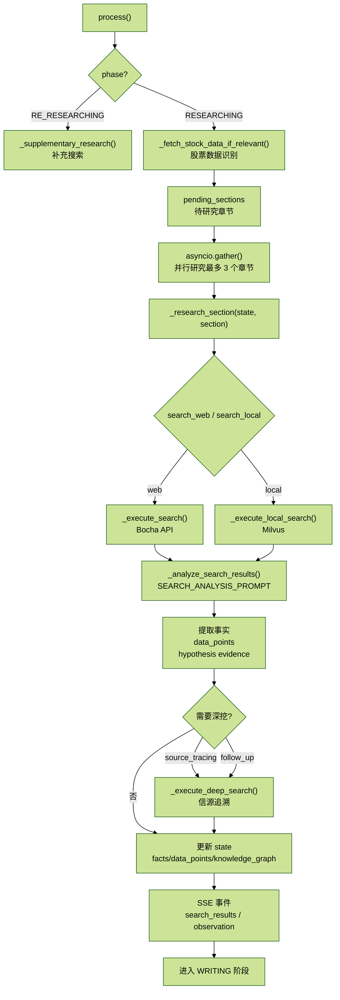

# 2.2.2 Agent - DeepScout（深度侦探）

## 1. 职责定位

DeepScout 是信息收集的核心 Agent，负责：

1. **全网穿透搜索**：不只看摘要，深入阅读原文。
2. **递归追踪**：发现新线索时自动深挖。
3. **信源评级**：评估来源可信度（0-1 分）。
4. **交叉验证**：多源验证关键信息。
5. **假设验证**：寻找支持或反驳研究假设的证据。

这是最复杂的 Agent，代码长达 1390 行。


## 2. 核心代码位置

文件路径：`backend/app/service/deep_research_v2/agents/scout.py`（1390 行）

## 3. Prompt 设计



核心 Prompt 汇总：

| Prompt | 作用 |
| --- | --- |
| `SEARCH_ANALYSIS_PROMPT` | 分析搜索结果，提取结构化信息 |
| `DEEP_READ_PROMPT` | 深度阅读网页正文，提取关键事实 |
| 补充搜索分析 Prompt | 审核后发现信息缺失时使用 |
| 深度搜索分析 Prompt | 递归搜索时分析信源追溯和线索追踪结果 |

### 3.1 SEARCH_ANALYSIS_PROMPT（第 59-124 行）

用于分析搜索结果并提取结构化信息。

一个 Prompt 应该包含：

1. 角色
2. 输入定义
3. 任务
4. 输出
5. fewshot / 特殊标准 / 特殊说明（可选）

```python
class DeepScout(BaseAgent):
    """
    深度侦探 - 信息收集专家

    特点：
    - 递归搜索：发现重要线索后自动深挖
    - 长文本阅读：进入网页读取完整内容
    - 信源评级：对来源进行可信度评分
    - 并行搜索：同时执行多个搜索任务
    """

    SEARCH_ANALYSIS_PROMPT = """你是一位资深的研究分析师，擅长从搜索结果中提取关键信息，并验证研究假设。

## 研究问题
{query}

## 当前研究章节
标题：{section_title}
描述：{section_description}

## 研究假设（需要寻找证据支持或反驳）
{hypotheses}

## 搜索结果
{search_results}

## 任务
1. 分析搜索结果，提取结构化信息
2. 寻找支持或反驳研究假设的证据
3. 如果文章引用了数据来源（如“据XX统计”），生成追溯查询

输出 JSON 格式：
{
  "extracted_facts": [
    {
      "content": "提取的事实陈述（要具体、可验证）",
      "source_name": "来源名称",
      "source_url": "来源URL",
      "source_type": "official/academic/news/report/self_media",
      "credibility_score": 0.0-1.0,
      "data_points": [
        {"name": "指标名", "value": "数值", "unit": "单位", "year": 2024}
      ],
      "needs_verification": true,
      "importance": "high/medium/low",
      "related_hypothesis": "h_1或h_2或null",
      "hypothesis_support": "supports/refutes/neutral"
    }
  ],
  "hypothesis_evidence": [
    {
      "hypothesis_id": "h_1",
      "evidence_type": "supports/refutes/inconclusive",
      "evidence_summary": "证据摘要"
    }
  ],
  "entities_discovered": [
    {"name": "实体名", "type": "company/person/policy/technology", "relations": ["与X相关"]}
  ],
  "key_insights": ["从这些结果中得到的关键洞察"],
  "follow_up_queries": ["需要进一步搜索的关键词"],
  "source_tracing_queries": ["追溯原始数据源的搜索词，如 国家统计局 2024 汽车销量"],
  "missing_info": ["仍然缺失的信息"],
  "source_quality_assessment": "对整体来源质量的评估"
}

## 评分标准
- 官方来源（政府、央企）：0.9-1.0
- 学术来源（论文、研究机构）：0.8-0.95
- 权威媒体（央媒、财经媒体）：0.7-0.85
- 行业报告（券商、咨询）：0.7-0.9
- 一般新闻：0.5-0.7
- 自媒体：0.2-0.5

请开始分析："""
```

关键特性：


- 支持假设验证：`hypothesis_support: "supports/refutes/neutral"`
- 信源可信度评分：`credibility_score: 0.0-1.0`
- 信源追溯：`source_tracing_queries`
- 线索追踪：`follow_up_queries`

### 3.2 DEEP_READ_PROMPT（第 126-164 行）

用于深度阅读长文本（网页正文）。

```python
DEEP_READ_PROMPT = """你是一位专业的文档分析师，擅长从长文本中提取关键信息。

## 研究问题
{query}

## 文档来源
URL: {url}
标题: {title}

## 文档内容
{content}

## 任务
深度阅读文档，提取与研究问题相关的所有关键信息。

输出 JSON 格式：
{
  "summary": "文档核心内容摘要（200字内）",
  "key_facts": [
    {
      "content": "关键事实",
      "confidence": 0.0-1.0,
      "page_location": "大概位置描述"
    }
  ],
  "data_tables": [
    {
      "title": "数据表标题",
      "headers": ["列1", "列2"],
      "rows": [["值1", "值2"]]
    }
  ],
  "quotes": "重要原文引用",
  "related_entities": ["提到的相关实体"],
  "publication_date": "发布日期（如果能识别）",
  "author_authority": "作者/机构权威性评估"
}"""
```

功能：

- 提取文档摘要
- 提取关键事实
- 提取数据表格
- 提取重要原文引用

### 3.3 补充搜索分析 Prompt（第 472-503 行，内嵌在代码中）

用于分析补充搜索结果，在 CriticMaster 审核后发现信息缺失时使用。

```python
async def _supplementary_research(self, state: ResearchState) -> ResearchState:
    """
    补充搜索阶段 - 处理审核后发现的信息缺失

    这个方法在 Critic 发现需要补充信息时被调用
    """
    pending_queries = state.get("pending_search_queries", [])

    if not pending_queries:
        self.logger.info("No pending search queries for supplementary research")
        state["phase"] = ResearchPhase.WRITING.value
        return state

    self.logger.info(f"Starting supplementary research with {len(pending_queries)} queries")

    self.add_message(state, "research_step", {
        "step_id": f"step_supplementary_{uuid.uuid4().hex[:8]}",
        "step_type": "searching",
        "title": "补充搜索",
        "subtitle": "针对性信息补充",
        "status": "running",
        "stats": {"queries_count": len(pending_queries), "results_count": 0}
    })

    self.add_message(state, "thought", {
        "agent": self.name,
        "content": f"根据审核反馈，开始补充搜索 {len(pending_queries)} 个问题..."
    })

    initial_facts_count = len(state.get("facts", []))

    for query in pending_queries[:5]:  # 最多处理5个补充查询
        self.add_message(state, "action", {
            "agent": self.name,
            "tool": "supplementary_search",
            "query": query
        })

        results = await self._execute_search(query, count=8)

        if results:
            analysis = await self._analyze_supplementary_results(
                state["query"],
                query,
                results
            )

            if analysis:
                for fact in analysis.get("extracted_facts", []):
                    content = fact.get("content", "")
                    source_url = fact.get("source_url", "")

                    if not self._is_duplicate_fact(content, source_url):
                        fact_entry = {
                            "id": f"fact_{uuid.uuid4().hex[:8]}",
                            "content": content,
                            "source_url": source_url,
                            "source_name": fact.get("source_name", ""),
                            "source_type": fact.get("source_type", "news"),
                            "credibility_score": fact.get("credibility_score", 0.5),
                            "is_supplementary": True,
                            "related_sections": []
                        }
                        state["facts"].append(fact_entry)

    state["pending_search_queries"] = []
    state["phase"] = ResearchPhase.WRITING.value
    return state
```

补充搜索 Prompt：

```python
prompt = f"""你是一位专业的研究分析师，正在补充搜索以解决审核发现的信息缺失问题。

## 原始研究问题
{original_query}

## 补充搜索关键词
{search_query}

## 搜索结果
{chr(10).join(results_text)}

## 任务
从搜索结果中提取与"{search_query}"直接相关的关键事实和数据。

输出 JSON 格式：
{
  "extracted_facts": [
    {
      "content": "提取的事实陈述",
      "source_name": "来源名称",
      "source_url": "来源URL",
      "source_type": "official/academic/news/report",
      "credibility_score": 0.0-1.0,
      "data_points": [
        {"name": "指标名", "value": "数值", "unit": "单位"}
      ]
    }
  ],
  "key_findings": "本次补充搜索的关键发现"
}"""
```

### 3.4 深度搜索分析 Prompt（第 954-991 行，内嵌在代码中）


用于分析递归搜索的结果（信源追溯或线索追踪）。

```python
prompt = f"""你是一位专业的研究分析师，正在{search_type_desc}以获取更权威的信息。

## 原始研究问题
{original_query}

## 当前搜索关键词
{search_query}

{hypotheses_text}

## 搜索结果
{chr(10).join(results_text)}

## 任务
1. 从搜索结果中提取关键事实和数据（特别关注官方来源和权威数据）
2. 如果发现引用了其他权威来源，生成进一步追溯查询

输出 JSON 格式：
{
  "extracted_facts": [
    {
      "content": "提取的事实陈述（要具体、可验证）",
      "source_name": "来源名称",
      "source_url": "来源URL",
      "source_type": "official/academic/news/report",
      "credibility_score": 0.0-1.0,
      "related_hypothesis": "h_1或null",
      "hypothesis_support": "supports/refutes/neutral"
    }
  ],
  "data_points": [
    {"name": "指标名", "value": "数值", "unit": "单位", "year": 2024}
  ],
  "further_tracing_queries": ["如果发现引用了其他权威来源，建议进一步追溯的查询"],
  "source_reliability": "对本次搜索来源可靠性的评估"
}"""
```

## 4. 核心实现

### 4.1 `process()` 入口（第 193-272 行）

```python
async def process(self, state: ResearchState) -> ResearchState:
    """处理入口"""
    # 处理补充搜索阶段
    if state["phase"] == ResearchPhase.RE_RESEARCHING.value:
        return await self._supplementary_research(state)

    # 正常研究阶段
    if state["phase"] not in [ResearchPhase.PLANNING.value, ResearchPhase.RESEARCHING.value]:
        return state

    # 自动识别并获取股票数据（当前未集成）
    await self._fetch_stock_data_if_relevant(state)

    state["phase"] = ResearchPhase.RESEARCHING.value

    # 获取搜索模式配置
    search_web = state.get("search_web", True)
    search_local = state.get("search_local", False)

    # 获取需要研究的章节
    pending_sections = [s for s in state["outline"] if s.get("status") == "pending"]

    # 发送 research_step 开始事件
    self.add_message(state, "research_step", {
        "step_id": f"step_searching_{uuid.uuid4().hex[:8]}",
        "step_type": "searching",
        "title": "信息检索",
        "subtitle": "网络搜索 + 本地知识库",
        "status": "running",
        "stats": {"sections_count": len(pending_sections), "results_count": 0},
        "search_web": search_web,
        "search_local": search_local
    })

    # 并行研究多个章节
    tasks = []
    for section in pending_sections[:3]:  # 每次最多处理3个章节
        tasks.append(self._research_section(state, section))

    await asyncio.gather(*tasks)

    # 发送完成事件
    self.add_message(state, "research_step", {
        "step_type": "searching",
        "status": "completed",
        "stats": {
            "results_count": len(state.get("facts", [])),
            "sources_count": len(set(f.get("source_url", "") for f in state.get("facts", [])))
        }
    })

    self._emit_search_results_event(state)
    return state
```

关键逻辑：

1. **双模式路由**：正常研究 vs 补充搜索。
2. **股票数据自动识别**：如果用户询问涉及上市公司，自动调用股票 API。
3. **并行搜索**：使用 `asyncio.gather()` 同时研究多个章节。
4. **实时事件流**：发送 SSE 事件到前端。

### 4.2 并行搜索实现（`asyncio.gather`）

`_research_section()` - 章节研究（第 533-795 行）

```python
async def _research_section(self, state: ResearchState, section: Dict) -> None:
    """研究单个章节"""
    section_id = section["id"]
    section_title = section["title"]
    search_queries = section.get("search_queries", [section_title])

    search_web = state.get("search_web", True)
    search_local = state.get("search_local", False)

    # 逐个执行搜索，每完成一个就发送事件（提升用户体验）
    all_results = []
    for i, query in enumerate(search_queries):
        if search_web:
            results = await self._execute_search(query)
            all_results.extend(results)

            # 立即发送搜索结果供前端展示
            if results:
                self.add_message(state, "search_progress", {
                    "agent": self.name,
                    "query": query,
                    "results_count": len(results),
                    "total_so_far": len(all_results),
                    "section": section_title,
                    "progress": f"{i + 1}/{len(search_queries)}",
                    "search_type": "web"
                })

                search_results_for_ui = [
                    {
                        "id": f"sr_{uuid.uuid4().hex[:6]}",
                        "title": r.get("title", "")[:80],
                        "source": r.get("site_name", "未知来源"),
                        "url": r.get("url", ""),
                        "snippet": r.get("summary", "") or r.get("snippet", ""),
                        "date": r.get("date", ""),
                        "isLocal": False
                    }
                    for r in results[:5]
                ]

                self.add_message(state, "search_results", {
                    "results": search_results_for_ui,
                    "isIncremental": True,
                    "searchType": "web"
                })

        # 本地知识库搜索
        if search_local:
            local_results = await self._execute_local_search(query)
            all_results.extend(local_results)

        # 分析搜索结果（传入假设以便验证）
        analysis = await self._analyze_search_results(
            state["query"],
            section,
            all_results,
            hypotheses=state.get("hypotheses", [])
        )

        if analysis:
            # 提取事实（带去重）
            added_facts = 0
            duplicate_facts = 0
            for fact in analysis.get("extracted_facts", []):
                content = fact.get("content", "")
                source_url = fact.get("source_url", "")

                if self._is_duplicate_fact(content, source_url):
                    duplicate_facts += 1
                    continue

                fact_entry = {
                    "id": f"fact_{uuid.uuid4().hex[:8]}",
                    "content": content,
                    "source_url": source_url,
                    "source_name": fact.get("source_name", ""),
                    "source_type": fact.get("source_type", "news"),
                    "credibility_score": fact.get("credibility_score", 0.5),
                    "extracted_at": datetime.now().isoformat(),
                    "related_sections": [section_id],
                    "verified": False,
                    "related_hypothesis": fact.get("related_hypothesis"),
                    "hypothesis_support": fact.get("hypothesis_support"),
                    "metadata": {}
                }
                state["facts"].append(fact_entry)
                added_facts += 1

            # 提取数据点
            for fact in analysis.get("extracted_facts", []):
                for dp in fact.get("data_points", []):
                    data_point = {
                        "id": f"dp_{uuid.uuid4().hex[:8]}",
                        "name": dp.get("name", ""),
                        "value": dp.get("value", ""),
                        "unit": dp.get("unit", ""),
                        "year": dp.get("year"),
                        "source": fact.get("source_name", ""),
                        "confidence": fact.get("credibility_score", 0.5)
                    }
                    state["data_points"].append(data_point)

            # 递归搜索：信源追溯查询（优先级最高）
            source_tracing = analysis.get("source_tracing_queries", [])
            if source_tracing and state["iteration"] < state["max_iterations"]:
                await self._execute_deep_search(
                    state, section_id, source_tracing[:2],
                    search_type="source_tracing",
                    hypotheses=state.get("hypotheses", [])
                )

            # 递归搜索：追踪发现的新线索
            follow_up = analysis.get("follow_up_queries", [])
            if follow_up and state["iteration"] < state["max_iterations"]:
                await self._execute_deep_search(
                    state, section_id, follow_up[:2],
                    search_type="follow_up",
                    hypotheses=state.get("hypotheses", [])
                )
```

并行策略：

```python
tasks = []
for section in pending_sections[:3]:
    tasks.append(self._research_section(state, section))

await asyncio.gather(*tasks)
```

每个 `_research_section()` 是一个独立协程，同时执行，提升效率。

### 4.3 信源可信度评级算法

评分标准（`SEARCH_ANALYSIS_PROMPT` 第 116-123 行）：

```text
- 官方来源（政府、央企）：0.9-1.0
- 学术来源（论文、研究机构）：0.8-0.95
- 权威媒体（央媒、财经媒体）：0.7-0.85
- 行业报告（券商、咨询）：0.7-0.9
- 一般新闻：0.5-0.7
- 自媒体：0.2-0.5
```

LLM 自动评分：

LLM 根据 `source_name` 和 `source_url` 判断类型，输出 `credibility_score`：

```json
{
  "extracted_facts": [
    {
      "content": "2024年中国AI市场规模达5000亿元",
      "source_name": "艾瑞咨询",
      "source_url": "https://www.iresearch.cn/report/20240101.html",
      "source_type": "report",
      "credibility_score": 0.85
    }
  ]
}
```

### 4.4 交叉验证机制

事实去重（第 1318-1333 行）：

```python
def _is_duplicate_fact(self, content: str, source_url: str) -> bool:
    """检查事实是否重复"""
    fingerprint = self._compute_fact_fingerprint(content)

    # 检查指纹是否已存在
    if fingerprint in self.fact_fingerprints:
        existing_url = self.fact_fingerprints[fingerprint]
        # 如果是同一个来源，不算重复
        if existing_url == source_url:
            return False
        self.logger.debug(f"Duplicate fact detected: {content[:50]}...")
        return True

    # 保存指纹
    self.fact_fingerprints[fingerprint] = source_url
    return False
```

指纹计算（第 1307-1316 行）：

```python
def _compute_fact_fingerprint(self, content: str) -> str:
    """计算事实的语义指纹用于去重"""
    import re

    # 提取数字和关键词作为指纹
    numbers = re.findall(r'\d+\.?\d*', content)
    keywords = re.findall(r'[\u4e00-\u9fa5]{2,4}', content)[:5]
    fingerprint = f"{','.join(numbers[:3])}|{','.join(keywords)}"
    return hashlib.md5(fingerprint.encode()).hexdigest()[:16]
```

原理：

- 提取内容中的数字和中文关键词。
- 拼接后计算 MD5 哈希。
- 相同指纹认为是重复事实。

## 5. 递归搜索（深度追踪）

`_execute_deep_search()` - 递归搜索核心（第 796-931 行）

```python
async def _execute_deep_search(
    self,
    state: ResearchState,
    section_id: str,
    queries: List[str],
    search_type: str,  # "source_tracing" or "follow_up"
    hypotheses: List[Dict],
    depth: int = 1,
    max_depth: int = 2
) -> None:
    """
    执行深度递归搜索

    Args:
        depth: 当前递归深度
        max_depth: 最大递归深度
        search_type: "source_tracing"（信源追溯）或 "follow_up"（线索追踪）
    """
    if depth > max_depth:
        self.logger.info(f"Reached max recursion depth ({max_depth})")
        return

    type_labels = {
        "source_tracing": "信源追溯",
        "follow_up": "线索追踪"
    }

    for query in queries:
        # 执行搜索
        results = await self._execute_search(query, count=6)

        if not results:
            continue

        # 立即发送搜索结果供前端展示（增量）
        search_results_for_ui = [...]
        self.add_message(state, "search_results", {
            "results": search_results_for_ui,
            "isIncremental": True,
            "searchType": type_labels.get(search_type, search_type),
            "depth": depth
        })

        # 分析结果
        analysis = await self._analyze_deep_search_results(
            state["query"],
            query,
            results,
            search_type,
            hypotheses
        )

        if not analysis:
            continue

        # 提取并添加事实
        added_facts = 0
        for fact in analysis.get("extracted_facts", []):
            # ... 添加事实逻辑 ...
            added_facts += 1

        # 如果发现更多需要追溯的线索，继续递归（但不超过 max_depth）
        if depth < max_depth:
            further_tracing = analysis.get("further_tracing_queries", [])
            if further_tracing:
                self.add_message(state, "thought", {
                    "agent": self.name,
                    "content": f"发现更深层线索（深度{depth+1}）：{', '.join(further_tracing[:2])}"
                })
                await self._execute_deep_search(
                    state, section_id, further_tracing[:2],
                    search_type, hypotheses,
                    depth=depth + 1, max_depth=max_depth
                )
```

递归深度控制：

- `depth=1`：第一层递归。
- `depth=2`：第二层递归（最大深度）。
- 超过 `max_depth` 自动停止。

两种递归类型：

1. **信源追溯（source_tracing）**：例如文章说“据国家统计局数据”，自动搜索“国家统计局 2024 汽车销量”。
2. **线索追踪（follow_up）**：例如发现“特斯拉在华销量”，自动追踪“特斯拉 中国市场份额”。

触发条件：

- CriticMaster 审核发现信息缺失。
- 设置 `state["phase"] = ResearchPhase.RE_RESEARCHING.value`。
- 设置 `state["pending_search_queries"] = ["查询1", "查询2"]`。

## 6. 深度阅读（长文本处理）

### 6.1 `deep_read_url()` - 网页抓取（第 1172-1214 行）

```python
async def deep_read_url(self, url: str, title: str, query: str) -> Optional[Dict]:
    """
    深度阅读网页内容

    待集成：Headless Browser（如 Playwright）实现真正的网页抓取
    """
    try:
        response = await asyncio.to_thread(
            requests.get,
            url,
            timeout=15,
            headers={'User-Agent': 'Mozilla/5.0'}
        )

        if response.status_code != 200:
            return None

        # 提取网页正文
        content = self._extract_text_from_html(response.text, url)
        if not content or len(content) < 100:
            return None

        prompt = self.DEEP_READ_PROMPT.format(
            query=query,
            url=url,
            title=title,
            content=content
        )

        llm_response = await self.call_llm(
            system_prompt="你是专业的文档分析师。",
            user_prompt=prompt,
            json_mode=True
        )

        return self.parse_json_response(llm_response)

    except Exception as e:
        self.logger.error(f"Deep read error for {url}: {e}")
        return None
```

### 6.2 `_extract_text_from_html()` - 正文提取（第 1216-1305 行）

```python
def _extract_text_from_html(self, html: str, url: str = "", max_length: int = 12000) -> str:
    """
    从 HTML 中提取纯文本正文

    使用多种策略提取，优先级：
    1. trafilatura - 专业的网页正文提取库（效果最好）
    2. BeautifulSoup - 通用 HTML 解析（备选）
    3. 简单正则 - 最后的备选方案
    """
    text = ""

    # 方法 1：使用 trafilatura
    if TRAFILATURA_AVAILABLE:
        try:
            text = trafilatura.extract(
                html,
                url=url,
                include_comments=False,
                include_tables=True,
                no_fallback=False,
                favor_precision=True
            )
            if text and len(text) > 200:
                return text[:max_length]
        except Exception as e:
            self.logger.warning(f"Trafilatura extraction failed: {e}")

    # 方法 2：使用 BeautifulSoup
    if BS4_AVAILABLE:
        try:
            soup = BeautifulSoup(html, 'lxml')

            # 移除无用标签
            for tag in soup(['script', 'style', 'nav', 'header', 'footer',
                             'aside', 'iframe', 'noscript', 'meta', 'link']):
                tag.decompose()

            # 尝试找正文区域
            main_content = None
            for selector in ['article', 'main', '.content', '.article',
                             '#content', '#article', '.post', '.entry']:
                main_content = soup.select_one(selector)
                if main_content:
                    break

            if main_content:
                text = main_content.get_text(separator='\n', strip=True)
            else:
                body = soup.find('body')
                if body:
                    text = body.get_text(separator='\n', strip=True)

            if text and len(text) > 200:
                # 清理多余空白
                import re
                text = re.sub(r'\n{3,}', '\n\n', text)
                text = re.sub(r' {2,}', ' ', text)
                return text[:max_length]

        except Exception as e:
            self.logger.warning(f"BeautifulSoup extraction failed: {e}")

    # 方法 3：简单正则
    import re
    text = re.sub(r'<script[^>]*>.*?</script>', '', html, flags=re.DOTALL | re.IGNORECASE)
    text = re.sub(r'<style[^>]*>.*?</style>', '', text, flags=re.DOTALL | re.IGNORECASE)
    text = re.sub(r'<[^>]+>', ' ', text)
    text = text.replace('&nbsp;', ' ').replace('&lt;', '<').replace('&gt;', '>')
    text = text.replace('&amp;', '&').replace('&quot;', '"')
    text = re.sub(r'\s+', ' ', text).strip()

    return text[:max_length]
```

三种策略：

1. **trafilatura**：专业网页正文提取库，效果最好，优先使用。
2. **BeautifulSoup**：通用 HTML 解析，作为备选。
3. **正则表达式**：简单粗暴的文本提取，作为最后备选。

## 7. 网络搜索实现

### 7.1 `_execute_search()` - Bocha API（第 1058-1122 行）

```python
async def _execute_search(self, query: str, count: int = 10) -> List[Dict]:
    """执行网络搜索 - 使用 Bocha Web Search API"""
    # 检查缓存
    cache_key = hashlib.md5(query.encode()).hexdigest()
    if cache_key in self.search_cache:
        return self.search_cache[cache_key]

    try:
        url = "https://api.bocha.cn/v1/web-search"
        payload = {
            "query": query,
            "summary": True,
            "count": count,
            "freshness": "noLimit"
        }
        headers = {
            "<auth-header>": "<redacted>",
            "Content-Type": "application/json"
        }

        response = await asyncio.to_thread(
            requests.post,
            url,
            headers=headers,
            json=payload,
            timeout=30
        )

        if response.status_code != 200:
            self.logger.error(f"Bocha API error: {response.status_code}")
            return []

        data = response.json()
        webpages = data.get('data', {}).get('webPages', {}).get('value', [])

        results = []
        for item in webpages:
            if item.get('url') and (item.get('snippet') or item.get('summary')):
                results.append({
                    'url': item.get('url'),
                    'title': item.get('name', 'N/A'),
                    'summary': item.get('summary', '') or item.get('snippet', ''),
                    'snippet': item.get('snippet', ''),
                    'site_name': item.get('siteName', 'N/A'),
                    'date': item.get('datePublished', '') or item.get('dateLastCrawled', '')
                })

        # 缓存结果
        self.search_cache[cache_key] = results
        return results

    except Exception as e:
        self.logger.error(f"Bocha search error for '{query}': {e}")
        return []
```

关键特性：

- 使用 Bocha Web Search API（国内搜索引擎）。
- 支持搜索结果摘要（`summary=True`）。
- 内存缓存避免重复搜索。
- 异步执行（`asyncio.to_thread`）。

## 8. 本地知识库搜索

### 8.1 `_execute_local_search()` - Milvus 向量检索（第 1002-1055 行）

```python
async def _execute_local_search(self, query: str, top_k: int = 10) -> List[Dict]:
    """
    执行本地知识库搜索 - 使用 Milvus 向量检索

    Args:
        query: 搜索查询
        top_k: 返回结果数量
    """
    if not self.milvus_service or not MILVUS_AVAILABLE:
        self.logger.warning("Milvus service not available")
        return []

    try:
        # 生成查询向量
        query_vector = generate_embedding(query)
        if not query_vector:
            self.logger.error("Failed to generate embedding for query")
            return []

        # 搜索所有知识库
        results = self.milvus_service.search(
            collection_name="knowledge_base",
            query_vector=query_vector,
            top_k=top_k
        )

        # 格式化结果为与网络搜索一致的格式
        formatted_results = []
        for r in results:
            formatted_results.append({
                'url': f"local://kb/{r.get('kb_id', 'unknown')}/{r.get('doc_id', 'unknown')}",
                'title': r.get('filename', 'N/A'),
                'summary': r.get('content', '')[:500],
                'snippet': r.get('content', '')[:200],
                'site_name': "本地知识库",
                'date': '',
                'score': r.get('score', 0),
                'is_local': True,
                'kb_id': r.get('kb_id'),
                'doc_id': r.get('doc_id'),
                'chunk_index': r.get('chunk_index')
            })

        self.logger.info(f"Local search returned {len(formatted_results)} results")
        return formatted_results

    except Exception as e:
        self.logger.error(f"Local search error: {e}")
        return []
```

向量检索流程：

1. 调用 `generate_embedding()` 生成查询向量。
2. Milvus 向量相似度搜索。
3. 返回 Top-K 结果。

## 9. 补充搜索（审核后回退）

### 9.1 `_supplementary_research()` - 补充搜索阶段（第 274-371 行）

```python
async def _supplementary_research(self, state: ResearchState) -> ResearchState:
    """
    补充搜索阶段 - 处理审核后发现的信息缺失

    这个方法在 Critic 发现需要补充信息时被调用
    """
    pending_queries = state.get("pending_search_queries", [])

    if not pending_queries:
        state["phase"] = ResearchPhase.WRITING.value
        return state

    self.add_message(state, "thought", {
        "agent": self.name,
        "content": f"根据审核反馈，开始补充搜索 {len(pending_queries)} 个问题..."
    })

    initial_facts_count = len(state.get("facts", []))

    for query in pending_queries[:5]:
        self.add_message(state, "action", {
            "agent": self.name,
            "tool": "supplementary_search",
            "query": query
        })

        results = await self._execute_search(query, count=8)

        if results:
            analysis = await self._analyze_supplementary_results(
                state["query"],
                query,
                results
            )

            if analysis:
                # 添加新事实
                for fact in analysis.get("extracted_facts", []):
                    # ... 添加事实逻辑 ...
                    pass

    state["pending_search_queries"] = []
    state["phase"] = ResearchPhase.WRITING.value
    return state
```

触发条件：

- CriticMaster 审核发现信息缺失。
- `state["phase"] = ResearchPhase.RE_RESEARCHING.value`。
- `state["pending_search_queries"] = ["查询1", "查询2"]`。

## 10. 知识图谱更新

### 10.1 `_update_knowledge_graph()` - 添加实体和关系（第 1335-1363 行）

```python
def _update_knowledge_graph(self, state: ResearchState, entities: List[Dict]) -> None:
    """更新知识图谱"""
    graph = state.get("knowledge_graph", {"nodes": [], "edges": []})
    existing_nodes = {n.get("name") for n in graph["nodes"]}

    for entity in entities:
        name = entity.get("name", "")
        if not name or name in existing_nodes:
            continue

        # 添加节点
        graph["nodes"].append({
            "id": f"node_{len(graph['nodes'])}",
            "name": name,
            "type": entity.get("type", "unknown"),
            "discovered_at": datetime.now().isoformat()
        })
        existing_nodes.add(name)

        # 添加边（关系）
        for relation in entity.get("relations", []):
            graph["edges"].append({
                "source": name,
                "relation": relation,
                "discovered_at": datetime.now().isoformat()
            })

    state["knowledge_graph"] = graph
```

示例输出：

```json
{
  "nodes": [
    {"id": "node_0", "name": "百度", "type": "company"},
    {"id": "node_1", "name": "人工智能", "type": "core"},
    {"id": "node_2", "name": "文心一言", "type": "product"}
  ],
  "edges": [
    {"source": "百度", "relation": "布局大模型"},
    {"source": "文心一言", "relation": "属于百度"}
  ]
}
```

## 11. 假设验证

### 11.1 `_update_hypothesis_status()` - 更新假设状态（第 1365-1388 行）

```python
def _update_hypothesis_status(self, state: ResearchState, evidence: List[Dict]) -> None:
    """根据证据更新假设状态"""
    hypotheses = state.get("hypotheses", [])

    for ev in evidence:
        h_id = ev.get("hypothesis_id", "")
        ev_type = ev.get("evidence_type", "")
        ev_summary = ev.get("evidence_summary", "")

        for h in hypotheses:
            if h.get("id") == h_id:
                if ev_type == "supports":
                    h["evidence_for"].append(ev_summary)
                    if len(h["evidence_for"]) >= 2:
                        h["status"] = "supported"
                elif ev_type == "refutes":
                    h["evidence_against"].append(ev_summary)
                    if len(h["evidence_against"]) >= 2:
                        h["status"] = "refuted"
                else:
                    if h["status"] == "unverified":
                        h["status"] = "partially_supported"
                break

    state["hypotheses"] = hypotheses
```

状态转换：

- `unverified` -> `supported`：有 2 条以上支持证据。
- `unverified` -> `refuted`：有 2 条以上反驳证据。
- `unverified` -> `partially_supported`：有证据但不足。

## 12. 模型选择

配置位置：`backend/app/config/llm_config.py`

```python
scout: ModelConfig = field(default_factory=lambda: ModelConfig(
    model="qwen-plus",
    temperature=0.2,
    max_tokens=8000
))
```

## 13. SSE 事件流

DeepScout 发送的 SSE 事件：

| 事件类型 | 说明 | 示例 |
| --- | --- | --- |
| `research_step` | 开始/完成搜索 | `{"step_type": "searching", "status": "running"}` |
| `action` | Agent 动作 | `{"tool": "parallel_search", "queries": [...]}` |
| `search_progress` | 搜索进度 | `{"query": "AI市场", "results_count": 10}` |
| `search_results` | 搜索结果（增量） | `{"results": [...], "isIncremental": true}` |
| `observation` | 观察结果 | `{"facts_count": 15, "duplicates_removed": 3}` |
| `stock_quote` | 股票行情（不包含） | `{"code": "600519", "price": "1500.00"}` |
| `thought` | 思考过程 | `{"content": "追溯原始数据源..."}` |

## 总结

DeepScout 是系统中最复杂的 Agent（1390 行代码），其核心能力：

1. **并行搜索**：使用 `asyncio.gather()` 同时搜索多个章节。
2. **递归追踪**：自动信源追溯和线索追踪（最大深度 2 层）。
3. **信源评级**：LLM 自动评估来源可信度（0-1 分）。
4. **去重机制**：基于语义指纹的事实去重。
5. **假设验证**：寻找支持或反驳研究假设的证据。
6. **深度阅读**：提取网页正文，支持 trafilatura、BeautifulSoup、正则三种策略。
7. **知识图谱**：自动构建实体关系图。
8. **双模搜索**：支持网络搜索（Bocha API）和本地知识库（Milvus）。
9. **股票集成**：自动识别上市公司并获取实时行情（不包含）。
10. **补充搜索**：审核后智能回退，补充缺失信息。

下一章节将介绍 DataAnalyst（数据分析师）。
