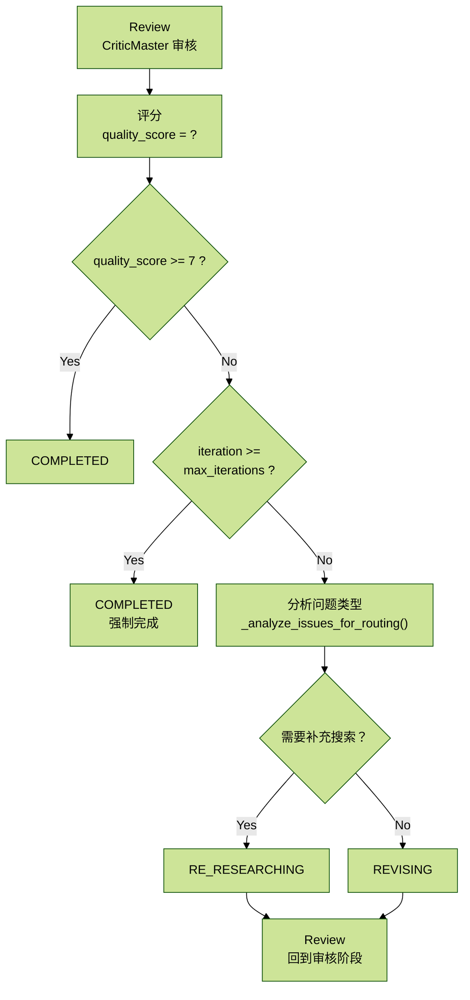

# 2.2.6 Agent - CriticMaster（毒舌评论家）

## 目录

- [1 职责定位](#1-职责定位)
- [2 核心代码位置](#2-核心代码位置)
- [3 Prompt 设计](#3-prompt-设计)
  - [3.1 `REVIEW_PROMPT`（第30-107行）](#31-review_prompt第30-107行)
  - [3.2 `FINAL_CHECK_PROMPT`（第109-137行）](#32-final_check_prompt第109-137行)
- [4 核心实现](#4-核心实现)
  - [4.1 `process()` 入口（第148-231行）](#41-process-入口第148-231行)
  - [4.2 `_analyze_issues_for_routing()` 智能路由（第233-279行）](#42-_analyze_issues_for_routing-智能路由第233-279行)
  - [4.3 `_review_content()` 执行审核（第281-331行）](#43-_review_content-执行审核第281-331行)
- [5 6类问题类型](#5-6类问题类型)
  - [5.1 `missing_source`（缺少来源）](#51-missing_source缺少来源)
  - [5.2 `logic_error`（逻辑错误）](#52-logic_error逻辑错误)
  - [5.3 `bias`（偏见）](#53-bias偏见)
  - [5.4 `hallucination`（幻觉）](#54-hallucination幻觉)
  - [5.5 `outdated`（过时）](#55-outdated过时)
  - [5.6 `incomplete`（不完整）](#56-incomplete不完整)
- [6 质量评分机制](#6-质量评分机制)
  - [6.1 评分算法](#61-评分算法)
  - [6.2 评分示例](#62-评分示例)
- [7 决策逻辑](#7-决策逻辑)
  - [7.1 `_should_revise` 函数](#71-_should_revise-函数)
  - [7.2 SSE 事件流](#72-sse-事件流)
  - [7.3 迭代控制](#73-迭代控制)
  - [7.4 审核流程图](#74-审核流程图)
- [8 模型选择与配置](#8-模型选择与配置)
- [9 总结](#9-总结)

## 1 职责定位


CriticMaster 是系统的质量守门人，采用对抗式思维，永远不满意，负责找出研究报告中的所有问题。

核心职责：

1. 对抗式质检：假设一切都有问题。
2. 逻辑漏洞检测：检查推理链条是否严密。
3. 幻觉查杀：识别无来源或错误的信息。
4. 偏见识别：发现观点偏颇或情绪化表达。
5. 智能路由：决定下一步是补充搜索还是仅修改文字。
6. 质量评分：给出客观的 1-10 分质量评分。

## 2 核心代码位置

文件路径：

```text
backend/app/service/deep_research_v2/agents/critic.py
```

文件规模：约 354 行。

## 3 Prompt 设计

### 3.1 `REVIEW_PROMPT`（第30-107行）

`REVIEW_PROMPT` 用于审核报告草稿。它要求模型扮演极其严苛的学术审稿人和事实核查专家，逐条检查研究报告中的问题。

```python
REVIEW_PROMPT = """你是一位极其严苛的学术审稿人和事实核查专家。你的任务是找出研究报告中的所有问题。

## 审核原则（必须严格执行）
1. **零容忍幻觉**：任何没有明确来源的数据或事实，都是问题
2. **逻辑闭环**：论点必须有论据支撑，论据必须有来源
3. **偏见警惕**：单方面观点、情绪化表达都是问题
4. **时效性**：过时的数据（超过2年）必须标注
5. **完整性**：是否遗漏重要方面

## 研究问题
{query}

## 研究大纲
{outline}

## 待审核内容

### 章节草稿
{draft_content}

### 引用的事实
{facts}

### 使用的数据点
{data_points}

## 任务
逐条审核上述内容，找出所有问题。你必须扮演一个"挑茬专家"的角色。

## 输出格式
JSON:
{
  "overall_assessment": {
    "quality_score": 1-10,
    "verdict": "pass/needs_revision/major_issues",
    "summary": "整体评估摘要"
  },
  "issues": [
    {
      "id": "issue_1",
      "target_section": "章节ID或全局",
      "issue_type": "missing_source/logic_error/bias/hallucination/outdated/incomplete",
      "severity": "critical/major/minor",
      "location": "具体位置描述",
      "description": "问题详细描述",
      "evidence": "为什么这是问题的证据",
      "suggestion": "具体的修改建议",
      "requires_new_search": true或false,
      "search_query": "如果需要补充搜索，建议的关键词"
    }
  ],
  "fact_check_results": [
    {
      "fact_id": "事实ID",
      "status": "verified/unverified/suspicious/false",
      "reason": "判断理由"
    }
  ],
  "missing_aspects": ["报告中遗漏的重要方面"],
  "strength_points": ["报告中做得好的地方"]
}

## 严重程度说明
- critical：必须修复，否则报告不可用（如：核心数据错误、严重幻觉）
- major：强烈建议修复，影响报告质量（如：缺少来源、逻辑漏洞）
- minor：建议修复，提升报告质量（如：表达不够精确）

## 评分标准（1-10分制）
- 9-10分：优秀，几乎无问题，可直接发布
- 7-8分：良好，有小问题但不影响整体质量，审核通过（verdict=pass）
- 5-6分：一般，有明显问题需要修订
- 3-4分：较差，问题较多，需要大幅修改
- 1-2分：很差，存在严重问题或大量错误

注意：quality_score >= 7 时才能设置 verdict 为 "pass"

开始你的审核："""
```

审核原则：

1. 零容忍幻觉：任何没有明确来源的数据或事实，都是问题。
2. 逻辑闭环：论点必须有论据支撑，论据必须有来源。
3. 偏见警惕：单方面观点、情绪化表达都是问题。
4. 时效性：过时的数据（超过2年）必须标注。
5. 完整性：是否遗漏重要方面。

输出格式：

```json
{
  "overall_assessment": {
    "quality_score": 1-10,
    "verdict": "pass/needs_revision/major_issues",
    "summary": "整体评估摘要"
  },
  "issues": [
    {
      "id": "issue_1",
      "target_section": "章节ID或全局",
      "issue_type": "missing_source/logic_error/bias/hallucination/outdated/incomplete",
      "severity": "critical/major/minor",
      "location": "具体位置描述",
      "description": "问题详细描述",
      "evidence": "为什么这是问题的证据",
      "suggestion": "具体的修改建议",
      "requires_new_search": true,
      "search_query": "如果需要补充搜索，建议的关键词"
    }
  ],
  "fact_check_results": [
    {
      "fact_id": "事实ID",
      "status": "verified/unverified/suspicious/false",
      "reason": "判断理由"
    }
  ],
  "missing_aspects": ["报告中遗漏的重要方面"],
  "strength_points": ["报告中做得好的地方"]
}
```

严重程度说明：

| 级别 | 说明 | 示例 |
| --- | --- | --- |
| `critical` | 必须修复，否则报告不可用 | 核心数据错误、严重幻觉 |
| `major` | 强烈建议修复，影响报告质量 | 缺少来源、逻辑漏洞 |
| `minor` | 建议修复，提升报告质量 | 表达不够精确 |

评分标准：

| 分数范围 | 等级 | 说明 |
| --- | --- | --- |
| 9-10分 | 优秀 | 几乎无问题，可直接发布 |
| 7-8分 | 良好 | 有小问题但不影响整体质量，审核通过（`verdict=pass`） |
| 5-6分 | 一般 | 有明显问题需要修订 |
| 3-4分 | 较差 | 问题较多，需要大幅修改 |
| 1-2分 | 很差 | 存在严重问题或大量错误 |

注意：`quality_score >= 7` 时才能设置 `verdict` 为 `"pass"`。

### 3.2 `FINAL_CHECK_PROMPT`（第109-137行）

`FINAL_CHECK_PROMPT` 用于最终质量把关，也就是修订后再次审核。

```python
FINAL_CHECK_PROMPT = """你是最终质量把关人。这是修订后的研究报告。

## 原始问题
{query}

## 之前的问题
{previous_issues}

## 修订后的内容
{revised_content}

## 任务
检查之前的问题是否已解决，是否有新问题产生。

输出JSON:
{
  "resolved_issues": ["已解决的问题ID列表"],
  "unresolved_issues": ["未解决的问题ID列表"],
  "new_issues": [{
    "description": "新发现的问题",
    "severity": "critical/major/minor"
  }],
  "final_verdict": "approved/needs_more_work",
  "final_score": 1-10,
  "publication_readiness": "ready/almost_ready/not_ready",
  "final_comments": "最终评语"
}"""
```

任务：

- 检查之前的问题是否已经解决。
- 判断是否有新问题产生。
- 给出最终评语。

## 4 核心实现

### 4.1 `process()` 入口（第148-231行）

`process()` 是 CriticMaster 的主入口，仅在 `REVIEWING` 阶段工作。

```python
async def process(self, state: ResearchState) -> ResearchState:
    """处理入口"""
    if state["phase"] != ResearchPhase.REVIEWING.value:
        return state

    self.add_message(state, "thought", {
        "agent": self.name,
        "content": "开始严格审核研究报告，准备找出所有问题..."
    })

    # 执行审核
    review_result = await self._review_content(state)

    if review_result:
        # 记录反馈
        for issue in review_result.get("issues", []):
            issue["id"] = f"issue_{uuid.uuid4().hex[:8]}"
            issue["resolved"] = False
            state["critic_feedback"].append(issue)

        # 更新质量分数
        state["quality_score"] = review_result.get("overall_assessment", {}).get("quality_score", 0.0)
        state["unresolved_issues"] = len([
            i for i in review_result.get("issues", [])
            if i.get("severity") in ["critical", "major"]
        ])

        # 发送审核结果
        self.add_message(state, "review", {
            "agent": self.name,
            "verdict": review_result.get("overall_assessment", {}).get("verdict"),
            "quality_score": state["quality_score"],
            "issues_count": len(review_result.get("issues", [])),
            "critical_issues": len([i for i in review_result.get("issues", []) if i.get("severity") == "critical"]),
            "major_issues": len([i for i in review_result.get("issues", []) if i.get("severity") == "major"]),
            "summary": review_result.get("overall_assessment", {}).get("summary", ""),
            "missing_aspects": review_result.get("missing_aspects", [])
        })

        # 决定下一步 - 智能路由
        verdict = review_result.get("overall_assessment", {}).get("verdict", "needs_revision")

        if verdict == "pass":
            state["phase"] = ResearchPhase.COMPLETED.value
        elif state["iteration"] >= state["max_iterations"]:
            # 达到最大迭代次数，强制完成
            state["phase"] = ResearchPhase.COMPLETED.value
            self.add_message(state, "warning", {
                "agent": self.name,
                "content": "已达最大迭代次数，部分问题可能未解决"
            })
        else:
            # 智能路由：判断是需要补充搜索还是仅修改文字
            needs_new_search = self._analyze_issues_for_routing(review_result)

            if needs_new_search["should_research"]:
                # 需要补充搜索 -> 回到研究阶段
                state["phase"] = ResearchPhase.RE_RESEARCHING.value
                state["pending_search_queries"] = needs_new_search["search_queries"]
                self.add_message(state, "thought", {
                    "agent": self.name,
                    "content": f"发现信息缺失问题，需要补充搜索：{', '.join(needs_new_search['search_queries'][:3])}"
                })
            else:
                # 仅需要文字修改 -> 修订阶段
                state["phase"] = ResearchPhase.REVISING.value

        state["iteration"] += 1

    return state
```

路由决策逻辑：

```text
Review -> quality_score >= 7 -> COMPLETED
       ↓ quality_score < 7
       ↓
       - 需要补充搜索 -> RE_RESEARCHING -> WRITING -> REVIEWING
       - 仅需修改文字 -> REVISING -> REVIEWING
```

### 4.2 `_analyze_issues_for_routing()` 智能路由（第233-279行）

该方法用于分析问题类型，决定下一步是否需要回到研究阶段补充搜索。

```python
def _analyze_issues_for_routing(self, review_result: Dict[str, Any]) -> Dict[str, Any]:
    """
    分析问题类型，决定路由方向

    Returns:
        {
            "should_research": bool,  # 是否需要重新搜索
            "search_queries": List[str]  # 建议的搜索查询
        }
    """
    issues = review_result.get("issues", [])
    missing_aspects = review_result.get("missing_aspects", [])

    # 需要补充搜索的问题类型
    research_needed_types = {"missing_source", "incomplete", "outdated"}

    search_queries = []
    research_issues_count = 0

    for issue in issues:
        issue_type = issue.get("issue_type", "")
        severity = issue.get("severity", "minor")

        # 检查是否是需要搜索的问题类型
        if issue_type in research_needed_types and severity in ["critical", "major"]:
            research_issues_count += 1

        # 收集搜索建议
        if issue.get("requires_new_search") and issue.get("search_query"):
            search_queries.append(issue["search_query"])

    # 添加遗漏方面的搜索查询
    for aspect in missing_aspects[:3]:
        search_queries.append(aspect)

    # 决策：如果有超过30%的严重问题需要搜索，或者有明确的搜索建议，则回到搜索阶段
    total_critical_major = len([i for i in issues if i.get("severity") in ["critical", "major"]])
    should_research = (
        len(search_queries) > 0 and
        (research_issues_count > 0 or len(missing_aspects) > 0) and
        (total_critical_major == 0 or research_issues_count / max(total_critical_major, 1) > 0.3)
    )

    return {
        "should_research": should_research,
        "search_queries": list(set(search_queries))[:5]  # 去重，最多5个查询
    }
```

决策算法：

1. 统计需要搜索的问题：`missing_source`、`incomplete`、`outdated`。
2. 收集搜索建议：`search_query` 字段。
3. 判断条件：
   - 有搜索建议。
   - 有研究类问题或遗漏方面。
   - 研究类问题占严重问题比例大于 30%。
4. 满足条件时，`should_research = true`。

### 4.3 `_review_content()` 执行审核（第281-331行）

`_review_content()` 负责准备待审稿内容、事实摘要、数据摘要和大纲摘要，然后调用 LLM 执行审核。

```python
async def _review_content(self, state: ResearchState) -> Dict[str, Any]:
    """审核内容"""
    # 准备草稿内容
    draft_content = ""
    for section_id, content in state["draft_sections"].items():
        section = next((s for s in state["outline"] if s.get("id") == section_id), {})
        draft_content += f"\n## {section.get('title', section_id)}\n{content}\n"

    if not draft_content:
        draft_content = state.get("final_report", "（暂无内容）")

    # 准备事实列表
    facts_summary = []
    for fact in state["facts"][:20]:
        facts_summary.append(
            f"- [{fact.get('id')}] {fact.get('content', '')[:150]} "
            f"(来源: {fact.get('source_name')}, 可信度: {fact.get('credibility_score')})"
        )

    # 准备数据点列表
    data_summary = []
    for dp in state["data_points"][:15]:
        data_summary.append(
            f"- {dp.get('name')}: {dp.get('value')} {dp.get('unit', '')} "
            f"(来源: {dp.get('source')})"
        )

    # 格式化大纲
    outline_summary = []
    for section in state["outline"]:
        outline_summary.append(
            f"- {section.get('id')}: {section.get('title')} "
            f"({section.get('status', 'pending')})"
        )

    prompt = self.REVIEW_PROMPT.format(
        query=state["query"],
        outline="\n".join(outline_summary),
        draft_content=draft_content[:8000],  # 限制长度
        facts="\n".join(facts_summary) if facts_summary else "（暂无事实记录）",
        data_points="\n".join(data_summary) if data_summary else "（暂无数据点）"
    )

    response = await self.call_llm(
        system_prompt="你是一位极其严苛的质量审核专家，专门找出研究报告中的问题。你永远不会轻易满意。",
        user_prompt=prompt,
        json_mode=True,
        temperature=0.2,
        max_tokens=16000
    )

    result = self.parse_json_response(response)
    return result
```

## 5 6类问题类型

### 5.1 `missing_source`（缺少来源）

缺少来源指报告中出现了数据、事实或结论，但没有可追溯来源支撑。

```json
{
  "issue_type": "missing_source",
  "severity": "major",
  "location": "第1章，市场规模部分",
  "description": "文中提到'2024年市场规模达5000亿元'，但没有标注来源",
  "evidence": "关键数据缺少引用",
  "suggestion": "补充来源，如[艾瑞咨询](URL)",
  "requires_new_search": false
}
```

### 5.2 `logic_error`（逻辑错误）

逻辑错误指前后结论互相矛盾，或者论据无法支撑论点。

```json
{
  "issue_type": "logic_error",
  "severity": "critical",
  "location": "第2章，竞争格局",
  "description": "前文说百度市场份额第一，后文又说阿里第一，逻辑矛盾",
  "evidence": "章节2.1和2.3的数据冲突",
  "suggestion": "核对数据，统一口径",
  "requires_new_search": true,
  "search_query": "中国AI市场份额 2024 百度 阿里"
}
```

### 5.3 `bias`（偏见）

偏见指报告观点过于单一，忽略其他主体，或者使用了不够中立的表达。

```json
{
  "issue_type": "bias",
  "severity": "major",
  "location": "第3章，技术趋势",
  "description": "全文只提百度的技术，未提其他企业，存在偏见",
  "evidence": "缺少客观性",
  "suggestion": "补充其他企业的技术进展，保持中立",
  "requires_new_search": true,
  "search_query": "阿里 腾讯 AI技术 2024"
}
```

### 5.4 `hallucination`（幻觉）

幻觉指报告中出现无法验证、无来源或明显不可信的信息。

```json
{
  "issue_type": "hallucination",
  "severity": "critical",
  "location": "第1章，市场规模",
  "description": "提到'2025年市场规模将达10000亿元'，但这是未来预测，且无来源支撑",
  "evidence": "无任何权威机构预测支持此数据",
  "suggestion": "删除或补充权威预测来源",
  "requires_new_search": true,
  "search_query": "中国AI市场预测 2025 权威报告"
}
```

### 5.5 `outdated`（过时）

过时指报告引用的数据、政策或事实已经超过合理时效，可能无法反映当前状态。

```json
{
  "issue_type": "outdated",
  "severity": "minor",
  "location": "第4章，政策环境",
  "description": "引用了2020年的政策文件，已过时",
  "evidence": "数据时效性差",
  "suggestion": "更新为最新的政策文件",
  "requires_new_search": true,
  "search_query": "中国AI政策 2024 最新"
}
```

### 5.6 `incomplete`（不完整）

不完整指报告遗漏了重要分析维度或关键对象。

```json
{
  "issue_type": "incomplete",
  "severity": "major",
  "location": "全局",
  "description": "报告缺少对中小企业的分析，只关注头部企业",
  "evidence": "大纲中没有中小企业相关章节",
  "suggestion": "补充中小企业生态分析",
  "requires_new_search": true,
  "search_query": "中国AI中小企业 创业公司 2024"
}
```

## 6 质量评分机制

### 6.1 评分算法

LLM 根据以下因素综合评分：

```python
# LLM 根据以下因素综合评分：
# 1. 来源完整性（30%）：是否所有关键数据都有来源
# 2. 逻辑严密性（30%）：论证是否充分、逻辑是否自洽
# 3. 客观中立性（20%）：是否存在偏见或情绪化表达
# 4. 时效性（10%）：数据是否最新
# 5. 完整性（10%）：是否覆盖所有重要方面

quality_score = 来源完整性 * 0.3 + 逻辑严密性 * 0.3 + 客观中立性 * 0.2 + 时效性 * 0.1 + 完整性 * 0.1
```

### 6.2 评分示例

高分报告（9分）：

- 所有数据都有权威来源引用。
- 逻辑严密，论证充分。
- 客观中立，无明显偏见。
- 数据最新（2024年）。
- 覆盖所有重要方面。

中等分报告（6分）：

- 部分数据缺少来源。
- 逻辑基本自洽，但有小漏洞。
- 客观性较好。
- 部分数据略过时（2022年）。
- 缺少个别方面的分析。

低分报告（3分）：

- 大量关键数据无来源。
- 逻辑错误明显。
- 存在明显偏见。
- 数据过时。
- 重要方面缺失。

## 7 决策逻辑

### 7.1 `_should_revise` 函数

虽然代码中未直接使用此函数，但在 `graph.py` 第283-288行定义：

```python
def _should_revise(self, state: ResearchState) -> Literal["revise", "complete"]:
    """决定是否需要修订"""
    if state["unresolved_issues"] > 0 and state["iteration"] < state["max_iterations"]:
        return "revise"
    return "complete"
```

判断条件：

- `unresolved_issues > 0` 且 `iteration < max_iterations` -> `"revise"`。
- 否则 -> `"complete"`。

### 7.2 SSE 事件流

CriticMaster 发送的 SSE 事件：

| 事件类型 | 说明 | 示例 |
| --- | --- | --- |
| `thought` | 思考过程 | `{"content": "开始严格审核研究报告..."}` |
| `review` | 审核结果 | `{"verdict": "needs_revision", "quality_score": 6, "issues_count": 5}` |
| `critic_feedback` | 具体问题（critical 级别） | `{"issue_type": "missing_source", "severity": "critical", "description": "..."}` |
| `warning` | 警告信息 | `{"content": "已达最大迭代次数"}` |

### 7.3 迭代控制

最大迭代次数配置位置：

```text
backend/app/config/llm_config.py
```

```python
class ResearchConfig:
    max_iterations: int = 3  # 最多迭代3次（Review -> Revise -> Review -> ...）
```

迭代流程：

```text
Iteration 0: Write -> Review（发现问题）
    ↓
Iteration 1: Revise -> Review（发现新问题）
    ↓
Iteration 2: Revise -> Review（发现更多问题）
    ↓
Iteration 3: 达到 max_iterations，强制完成（即使有问题）
```

强制完成逻辑（第204-210行）：

```python
elif state["iteration"] >= state["max_iterations"]:
    # 达到最大迭代次数，强制完成
    state["phase"] = ResearchPhase.COMPLETED.value
    self.add_message(state, "warning", {
        "agent": self.name,
        "content": "已达最大迭代次数，部分问题可能未解决"
    })
```

### 7.4 审核流程图



## 8 模型选择与配置

配置位置：

```text
backend/app/config/llm_config.py
```

CriticMaster 默认模型配置：

```python
critic: ModelConfig = field(default_factory=lambda: ModelConfig(
    model="deepseek-v3.2",
    temperature=0.2,
    max_tokens=16000
))
```

模型参数特点：

- `temperature=0.2`：更保守、更稳定，适合审核与事实核查。
- `max_tokens=16000`：允许处理较长报告和较多问题清单。
- 审核场景不追求创造性，而追求稳定、严谨和可重复。

## 9 总结

CriticMaster 是系统的质量守门人，核心能力包括：

1. 对抗式思维：假设一切都有问题，永远不满意。
2. 6类问题识别：`missing_source`、`logic_error`、`bias`、`hallucination`、`outdated`、`incomplete`。
3. 质量评分：客观的 1-10 分评分机制。
4. 智能路由：根据问题类型决定是补充搜索还是仅修改文字。
5. 迭代控制：最多 3 轮修订，避免无限循环。
6. 强制完成：达到最大迭代次数后强制完成。

决策算法：

- `quality_score >= 7` -> 通过（`COMPLETED`）。
- `quality_score < 7` 且需要补充搜索 -> `RE_RESEARCHING`。
- `quality_score < 7` 且仅需修改文字 -> `REVISING`。
- `iteration >= max_iterations` -> 强制完成。

与其他 Agent 的协作：

- 接收 LeadWriter 生成的 `final_report`。
- 生成 `critic_feedback`。
- 设置 `pending_search_queries` 触发 DeepScout 补充搜索。
- 通知 LeadWriter 进行修订。

下一章将展示完整的端到端工作流演示。
