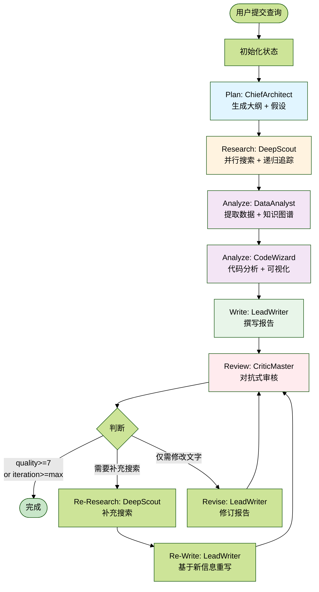
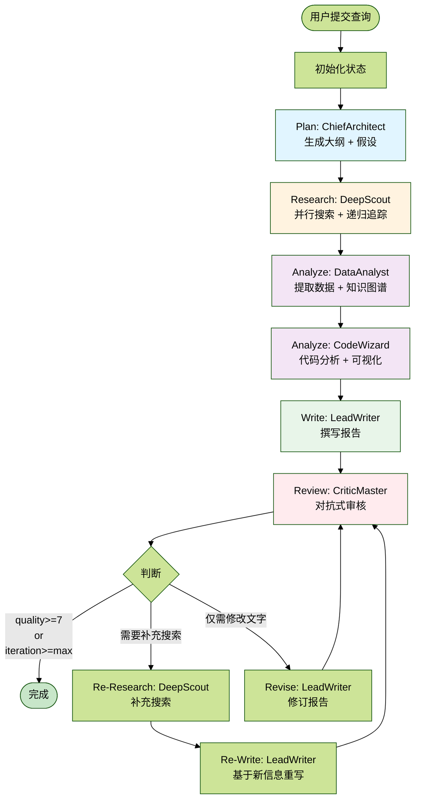

# 2.1 LangGraph 状态机基础

## 1. 概述

LangGraph 是一个用于构建多智能体工作流的状态机框架。本系统虽然导入了 LangGraph，但实际采用了简化版（非真的简化，更加落地和复杂，但是用户体验感更好）执行流程以实现实时 SSE 流式输出。可以进行切换。

---

### 1.1 LangGraph 版本

方法名：`_run_with_langgraph`（第 355-375 行）

```python
async def _run_with_langgraph(self, state: ResearchState) -> AsyncGenerator[Dict[str, Any], None]:
    """使用 LangGraph 执行"""
    yielded_count = 0
    async for output in self.graph.astream(state):
        for node_name, node_state in output.items():
            if isinstance(node_state, dict) and "messages" in node_state:
                messages = node_state["messages"]
                new_messages = messages[yielded_count:]
                for message in new_messages:
                    yield message
                yielded_count = len(messages)
```

特点：

- 使用 StateGraph 构建状态机（第 197-232 行）
- 通过 `graph.astream()` 流式执行
- 批量输出：只能在节点完成后获取 messages 数组，无法实时逐条输出
- 状态转换由 LangGraph 框架管理

---

### 1.2 简化版本（核心，非真的简化，更加落地和复杂，但是用户体验感更好）

方法名：`_run_simplified`（第 377-738 行）

```python
async def _run_simplified(self, state: ResearchState) -> AsyncGenerator[Dict[str, Any], None]:
    # 创建消息队列用于实时输出
    message_queue = asyncio.Queue()
    state["_message_queue"] = message_queue

    async def run_agent_with_streaming(agent):
        task = asyncio.create_task(agent.process(state))
        while not task.done():
            msg = await asyncio.wait_for(message_queue.get(), timeout=0.5)
            yield msg  # 实时输出每条消息
```

特点：

- 使用 `asyncio.Queue` 实现实时流式输出
- Agent 执行时通过队列逐条发送消息，前端可立即收到
- 手动控制流程：Plan → Research → Analyze → Write → Review → Revise 循环
- 支持取消检查（每个阶段前检查 `is_research_cancelled`）
- 支持检查点保存（每个阶段后调用 `save_checkpoint_async`）

---

### 1.3 核心差异总结

简化版并非简化，而是更加工程化，只是我这么命名。

| 特性 | LangGraph 版本 | 简化版本 |
| --- | --- | --- |
| 消息输出 | ❌ 批量（节点完成后） | ✅ 实时（逐条输出） |
| 流式体验 | ❌ 延迟较高 | ✅ 用户可实时看到进度 |
| 取消支持 | ❌ 无 | ✅ 每阶段检查 |
| 检查点 | ❌ 无 | ✅ 每阶段保存 |
| 流程控制 | ❌ 框架管理 | ✅ 手动管理 |
| 代码复杂度 | ❌ 低（20 行） | ✅ 高（360 行） |
| 分析阶段 | 只调用 wizard | ✅ 用 data_analyst + wizard |
| 审核后路由 | 只有 revise 一条路径 | ✅ 智能路由：RE_RESEARCHING（补充搜索）或 REVISING（修订） |
| 补充搜索 | ❌ 不支持 | ✅ 审核发现信息不足时回到 scout 补充搜索 |

---

### 1.4 为什么选择简化版本

注释已说明（第 346-347 行）：

> 始终使用手写版本执行（支持实时 SSE 流式输出）。LangGraph 版本会批量处理消息，无法实现实时流式输出。

关键原因：LangGraph 的 `astream()` 是节点级别的流，每个 Agent 节点执行完才能拿到输出。而简化版本通过 `asyncio.Queue`，Agent 内部每产生一条消息就立即 `put()` 到队列，主循环立即 `yield` 给前端，实现真正的实时流式输出。

---

## 2. 核心组件

### 2.1 ResearchState TypedDict 定义

完整定义位于：`backend/app/service/deep_research_v2/state.py`

```python
class ResearchState(TypedDict):
    """
    全局工作记忆 - 所有 Agent 共享此状态
    使用 TypedDict 确保类型安全
    """
    # === 基础信息 ===
    query: str                                      # 用户原始问题
    session_id: str                                 # 会话ID
    phase: str                                      # 当前阶段（ResearchPhase枚举）
    iteration: int                                  # 当前迭代轮次
    max_iterations: int                             # 最大迭代次数（默认3）

    # === 搜索模式配置 ===
    search_web: bool                                # 是否启用网络搜索
    search_local: bool                              # 是否启用本地知识库搜索

    # === 规划输出（ChiefArchitect 生成）===
    outline: List[Dict[str, Any]]                   # 动态大纲（Section序列化）
    mind_map: Dict[str, Any]                        # 思维导图
    key_entities: List[str]                         # 关键实体列表
    research_questions: List[str]                   # 待研究的子问题
    hypotheses: List[Dict[str, Any]]                # 研究假设（假设驱动研究）
    knowledge_graph: Dict[str, Any]                 # 知识图谱 {nodes: [], edges: []}

    # === 知识库（DeepScout 收集）===
    facts: List[Dict[str, Any]]                     # 结构化事实库
    data_points: List[Dict[str, Any]]               # 数据点
    raw_sources: List[Dict[str, Any]]               # 原始来源（网页内容）

    # === 分析输出（DataAnalyst & CodeWizard 生成）===
    charts: List[Dict[str, Any]]                    # 生成的图表
    code_executions: List[Dict[str, Any]]           # 代码执行记录
    insights: List[str]                             # 数据洞察

    # === 写作输出（LeadWriter 生成）===
    draft_sections: Dict[str, str]                  # 章节草稿 {section_id: content}
    final_report: str                               # 最终报告（Markdown格式）
    references: List[Dict[str, Any]]                # 参考文献

    # === 审核反馈（CriticMaster 生成）===
    critic_feedback: List[Dict[str, Any]]           # 评论家反馈
    unresolved_issues: int                          # 未解决问题数
    quality_score: float                            # 质量评分（0-10）
    pending_search_queries: List[str]               # 待执行的补充搜索查询

    # === 元数据 ===
    logs: List[Dict[str, Any]]                      # 执行日志
    errors: List[str]                               # 错误记录
    messages: List[Dict[str, Any]]                  # Agent间消息（用于SSE流式输出）
```

### 2.2 ResearchPhase 状态枚举

```python
class ResearchPhase(str, Enum):
    """研究阶段状态机"""
    INIT = "init"                       # 初始化
    PLANNING = "planning"               # 规划阶段
    RESEARCHING = "researching"         # 深度探索阶段
    ANALYZING = "analyzing"             # 数据分析阶段
    WRITING = "writing"                 # 撰写阶段
    REVIEWING = "reviewing"             # 对抗审核阶段
    RE_RESEARCHING = "re_researching"   # 补充搜索阶段
    REVISING = "revising"               # 修订阶段
    COMPLETED = "completed"             # 完成
```

### 2.3 辅助数据结构

#### Section（章节）

```python
@dataclass
class Section:
    id: str                                      # 章节ID（如 "sec_1"）
    title: str                                   # 章节标题
    description: str                             # 章节描述
    section_type: Literal["qualitative", "quantitative", "mixed"]
    status: Literal["pending", "researching", "drafted", "reviewed", "final"]
    content: str = ""                            # 章节内容
    sources: List[str] = []                      # 引用来源
    subsections: List["Section"] = []            # 子章节
    requires_data: bool = False                  # 是否需要数据
    requires_chart: bool = False                 # 是否需要图表
```

#### Fact（结构化事实）

```python
@dataclass
class Fact:
    id: str                                      # 事实ID
    content: str                                 # 事实内容
    source_url: str                              # 来源URL
    source_name: str                             # 来源名称
    source_type: Literal["official", "academic", "news", "report", "self_media"]
    credibility_score: float                     # 可信度评分（0-1）
    extracted_at: datetime                       # 提取时间
    related_sections: List[str] = []             # 关联章节ID
    verified: bool = False                       # 是否已验证
    metadata: Dict[str, Any] = {}                # 元数据
```

#### Chart（图表配置）

```python
@dataclass
class Chart:
    id: str                                      # 图表ID
    title: str                                   # 图表标题
    chart_type: Literal["line", "bar", "pie", "scatter", "table", "heatmap"]
    data: Dict[str, Any]                         # 图表数据
    code: str                                    # 生成图表的Python代码
    image_path: Optional[str] = None             # 图片路径
    section_id: Optional[str] = None             # 关联章节ID
```

---

## 3. LangGraph 工作流构建

### DAG 工作流图

虽然系统实际使用简化版执行流程，但 LangGraph 图的定义仍保留在代码中，可以进行切换。



ASCII 版流程：

```text
┌─────────────┐
│   START     │
└──────┬──────┘
       │
       v
┌─────────────┐
│   Plan      │  ChiefArchitect: 问题解码、大纲规划
└──────┬──────┘
       │
       v
┌─────────────┐
│ Research    │  DeepScout: 并行搜索、递归追踪
└──────┬──────┘
       │
       v
┌─────────────┐
│ Analyze     │  DataAnalyst + CodeWizard: 数据分析、可视化
└──────┬──────┘
       │
       v
┌─────────────┐
│ Write       │  LeadWriter: 撰写报告
└──────┬──────┘
       │
       v
┌─────────────┐
│ Review      │  CriticMaster: 对抗式审核
└──────┬──────┘
       │
       v
     ┌───┐
     │ ? │ 条件判断
     └─┬─┘
       │
 ┌─────┴─────────────┐
 │                   │
 v                   v
┌─────────┐     ┌────────────┐
│ Revise  │     │    END     │
│(仅修改) │     │(quality>=7 │
└────┬────┘     │  or 达到   │
     │          │ max_iter)  │
     │          └────────────┘
     │
     └───────> 回到 Review
```

### 代码实现（`graph.py` 第 197-232 行）

```python
def _build_langgraph(self):
    """构建 LangGraph 状态图"""
    workflow = StateGraph(ResearchState)

    # 添加节点
    workflow.add_node("plan", self._plan_node)
    workflow.add_node("research", self._research_node)
    workflow.add_node("analyze", self._analyze_node)
    workflow.add_node("write", self._write_node)
    workflow.add_node("review", self._review_node)
    workflow.add_node("revise", self._revise_node)

    # 设置入口
    workflow.set_entry_point("plan")

    # 添加边（顺序执行）
    workflow.add_edge("plan", "research")
    workflow.add_edge("research", "analyze")
    workflow.add_edge("analyze", "write")
    workflow.add_edge("write", "review")

    # 条件边：审核后决定下一步
    workflow.add_conditional_edges(
        "review",
        self._should_revise,
        {
            "revise": "revise",
            "complete": END
        }
    )

    # 修订后回到审核
    workflow.add_edge("revise", "review")

    return workflow.compile()
```

### 节点、边、条件边

#### 1. 节点（Node）

节点代表一个处理单元，每个节点对应一个 Agent 的 `process()` 方法：

```python
async def _plan_node(self, state: ResearchState) -> Dict[str, Any]:
    """规划节点"""
    state = dict(state)  # 复制状态避免直接修改
    state["phase"] = ResearchPhase.INIT.value
    result = await self.architect.process(state)
    return dict(result)
```

#### 2. 边（Edge）

边定义节点之间的转换关系：

```python
# 无条件边：完成 plan 后自动进入 research
workflow.add_edge("plan", "research")
```

#### 3. 条件边（Conditional Edge）

条件边根据状态判断下一步：

```python
def _should_revise(self, state: ResearchState) -> Literal["revise", "complete"]:
    """决定是否需要修订"""
    if state["unresolved_issues"] > 0 and state["iteration"] < state["max_iterations"]:
        return "revise"
    return "complete"

workflow.add_conditional_edges(
    "review",
    self._should_revise,
    {
        "revise": "revise",
        "complete": END
    }
)
```

---

## 4. 检查点机制

### 检查点服务

系统集成了检查点服务用于保存/恢复研究进度：

```python
def _save_checkpoint(
    self,
    state: Dict[str, Any],
    user_id: str = None,
    ui_state: Dict[str, Any] = None
) -> bool:
    """保存检查点（包含后端状态和 UI 状态）"""
    if not self.checkpoint_service:
        return False

    session_id = state.get("session_id", "")
    if not session_id:
        return False

    try:
        checkpoint_id = self.checkpoint_service.save_checkpoint(
            session_id=session_id,
            state=state,
            user_id=user_id,
            ui_state=ui_state,
            final_report=state.get("final_report")
        )

        if checkpoint_id:
            logger.info(f"Checkpoint saved: {checkpoint_id}")
            return True

    except Exception as e:
        logger.warning(f"Failed to save checkpoint: {e}")

    return False
```

### 检查点保存时机

系统在以下时机自动保存检查点：

1. Planning 完成后（第 566-573 行）
2. Research 完成后（第 584-594 行）
3. Analyze 完成后（第 608-615 行）
4. Write 完成后（第 626-633 行）

示例代码：

```python
# Phase 1: Plan
state["phase"] = ResearchPhase.INIT.value
async for msg in run_agent_with_streaming(self.architect):
    yield msg
state["messages"] = []

# 保存检查点
cp_event = await save_checkpoint_async({
    "type": "planning",
    "status": "completed",
    "stats": {"sections": len(state.get("outline", []))}
})
if cp_event:
    yield cp_event
```

### 恢复检查点

```python
async def run(
    self,
    query: str,
    session_id: str,
    resume: bool = False,
    user_id: str = None,
    search_web: bool = True,
    search_local: bool = False,
) -> AsyncGenerator[Dict[str, Any], None]:
    """执行研究流程（流式输出）"""

    # 尝试从检查点恢复
    state = None
    if resume and session_id:
        state = self._load_checkpoint(session_id)
        if state:
            yield {
                "type": "research_resumed",
                "phase": state.get("phase", ""),
                "session_id": session_id,
                "timestamp": datetime.now().isoformat()
            }

    # 如果没有检查点，创建初始状态
    if not state:
        state = create_initial_state(
            query,
            session_id,
            search_web=search_web,
            search_local=search_local
        )
```

---

## 5. DAG 可视化图

截图中的可视化图对应的 Mermaid 定义如下：



原始代码块版本：

```text
graph TD
    START([用户提交查询]) --> INIT[初始化状态]
    INIT --> PLAN[Plan: ChiefArchitect<br/>生成大纲+假设]

    PLAN --> RESEARCH[Research: DeepScout<br/>并行搜索+递归追踪]

    RESEARCH --> ANALYZE_DATA[Analyze: DataAnalyst<br/>提取数据+知识图谱]
    ANALYZE_DATA --> ANALYZE_CODE[Analyze: CodeWizard<br/>代码分析+可视化]

    ANALYZE_CODE --> WRITE[Write: LeadWriter<br/>撰写报告]

    WRITE --> REVIEW[Review: CriticMaster<br/>对抗式审核]

    REVIEW --> DECISION{判断}

    DECISION -->|quality>=7<br/>or<br/>iteration>=max| COMPLETE([完成])
    DECISION -->|需要补充搜索| RE_RESEARCH[Re-Research: DeepScout<br/>补充搜索]
    RE_RESEARCH --> REWRITE[Re-Write: LeadWriter<br/>基于新信息重写]
    REWRITE --> REVIEW

    DECISION -->|仅需修改文字| REVISE[Revise: LeadWriter<br/>修订报告]
    REVISE --> REVIEW

    style PLAN fill:#e1f5ff
    style RESEARCH fill:#fff3e0
    style ANALYZE_DATA fill:#f3e5f5
    style ANALYZE_CODE fill:#f3e5f5
    style WRITE fill:#e8f5e9
    style REVIEW fill:#ffebee
    style COMPLETE fill:#c8e6c9
```

### 状态流转示例

#### 正常流程（无修订）

```text
INIT → PLANNING → RESEARCHING → ANALYZING → WRITING → REVIEWING → COMPLETED
```

#### 需要修订流程

```text
INIT → PLANNING → RESEARCHING → ANALYZING → WRITING → REVIEWING
     → REVISING → REVIEWING → COMPLETED
```

#### 需要补充搜索流程

```text
INIT → PLANNING → RESEARCHING → ANALYZING → WRITING → REVIEWING
     → RE_RESEARCHING → WRITING → REVIEWING → COMPLETED
```

### 关键文件位置

| 文件 | 路径 | 说明 |
| --- | --- | --- |
| `state.py` | `backend/app/service/deep_research_v2/state.py` | ResearchState 定义（235 行） |
| `graph.py` | `backend/app/service/deep_research_v2/graph.py` | 工作流构建（793 行） |
| `checkpoint_service.py` | `backend/app/service/checkpoint_service.py` | 检查点保存/恢复服务 |

## 总结

1. TypedDict 确保类型安全：ResearchState 使用 TypedDict，提供完整的类型提示。
2. 状态驱动：所有 Agent 共享同一个 ResearchState，通过修改状态推进流程。
3. 检查点机制：每个阶段完成后自动保存，支持断点恢复。
4. 简化版执行：虽然定义了 LangGraph 图，但实际使用 asyncio.Queue 实现实时流式输出。
5. 智能路由：CriticMaster 审核后，根据问题类型智能决定是补充搜索还是仅修改文字。

下一章节将深入讲解第一个 Agent：ChiefArchitect（总架构师）。
