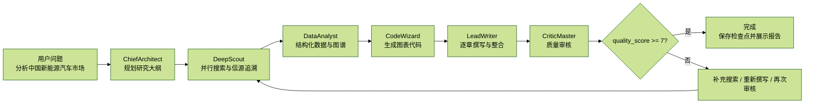
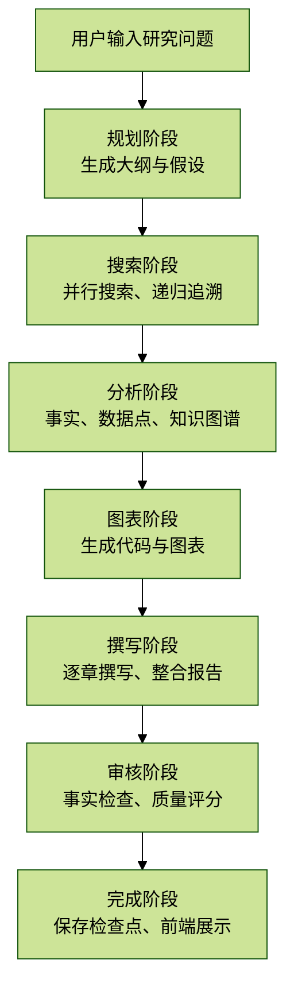

# 2.3 完整工作流演示

## 目录

- 演示场景
- Step 1: ChiefArchitect - 规划阶段
  - 输入
  - Agent 执行
  - 输出（SSE 事件）
- Step 2: DeepScout - 深度搜索阶段
  - 输入
  - Agent 执行
  - 2.1 并行搜索 3 个章节
  - 2.2 章节 1：市场概况
  - 2.3 递归搜索：信源追溯
  - 输出（SSE 事件）
- Step 3: DataAnalyst - 数据分析阶段
  - 输入
  - Agent 执行
  - 3.1 提取结构化数据
  - 3.2 构建知识图谱
  - 3.3 生成 ECharts 配置
  - 输出（SSE 事件）
- Step 4: CodeWizard - 代码生成阶段
  - 输入
  - Agent 执行
  - 输出（SSE 事件）
- Step 5: LeadWriter - 撰写阶段
  - 输入
  - Agent 执行
  - 5.1 逐章节撰写
  - 5.2 整合报告
  - 输出（SSE 事件）
- Step 6: CriticMaster - 审核阶段
  - 输入
  - Agent 执行
  - 输出（SSE 事件）
- Step 7: 完成（quality_score >= 7）
  - 最终状态
  - 检查点已保存
  - 前端展示
- 修订流程演示（quality_score < 7）
- SSE 事件流完整时间线
- 总结

## 演示场景



## Step 1: ChiefArchitect - 规划阶段

### 输入

```json
{
  "query": "分析中国新能源汽车市场",
  "session_id": "session_20240131_145020",
  "phase": "init",
  "search_web": true,
  "search_local": false
}
```

### Agent 执行

```python
# ChiefArchitect.process(state)
# 1. 调用 LLM 生成规划
prompt = """研究课题：分析中国新能源汽车市场

请为该课题生成研究大纲和研究假设..."""

# 2. LLM 返回扁平格式 JSON
{
    "hypothesis_1": "中国新能源汽车市场将持续快速增长，CAGR 超过 25%",
    "hypothesis_2": "比亚迪、特斯拉占据市场前两位",
    "hypothesis_3": "政策补贴退坡但基础设施建设加速",
    "sec_1_title": "市场概况",
    "sec_1_desc": "描述市场规模、增速、渗透率",
    "sec_1_query": "中国新能源汽车市场规模 2024",
    "sec_2_title": "竞争格局",
    "sec_2_desc": "主要车企市场份额和竞争策略",
    "sec_2_query": "比亚迪 特斯拉 市场份额",
    ...
}

# 3. 转换为标准格式
result = _convert_flat_to_outline(flat_result)

# 4. 更新状态
state["outline"] = [
    {
        "id": "sec_1",
        "title": "市场概况",
        "description": "描述市场规模、增速、渗透率",
        "section_type": "mixed",
        "requires_data": true,
        "requires_chart": true,
        "search_queries": ["中国新能源汽车市场规模 2024", "新能源汽车渗透率"],
        "status": "pending"
    },
    ... 共 6 个章节 ...
]

state["hypotheses"] = [
    {"id": "h_1", "content": "中国新能源汽车市场将持续快速增长...", "status": "unverified"},
    {"id": "h_2", "content": "比亚迪、特斯拉占据市场前两位", "status": "unverified"},
    {"id": "h_3", "content": "政策补贴退坡但基础设施建设加速", "status": "unverified"}
]

state["research_questions"] = [
    "中国新能源汽车市场的主要增长驱动因素是什么？",
    "比亚迪和特斯拉的竞争优势各是什么？",
    "政策退坡对市场的影响如何？"
]
```

### 输出（SSE 事件）

```json
{
  "type": "research_step",
  "step_type": "planning",
  "title": "研究计划",
  "subtitle": "分析问题，制定大纲",
  "status": "completed",
  "stats": {
    "sections_count": 6,
    "questions_count": 3
  }
}
```

```json
{
  "type": "outline",
  "outline": [
    {"id": "sec_1", "title": "市场概况", "...": "..."},
    {"id": "sec_2", "title": "竞争格局", "...": "..."}
  ],
  "research_questions": [...]
}
```

## Step 2: DeepScout - 深度搜索阶段

### 输入

```json
{
  "outline": [
    {
      "id": "sec_1",
      "title": "市场概况",
      "search_queries": ["中国新能源汽车市场规模 2024", "新能源汽车渗透率"],
      "status": "pending"
    },
    ...
  ],
  "hypotheses": [
    {"id": "h_1", "content": "中国新能源汽车市场将持续快速增长...", "status": "unverified"},
    ...
  ]
}
```

### Agent 执行

#### 2.1 并行搜索 3 个章节

```python
# DeepScout.process(state)
tasks = []
for section in pending_sections[:3]:
    tasks.append(self._research_section(state, section))

await asyncio.gather(*tasks)
```

#### 2.2 章节 1：市场概况

```python
# _research_section(state, sec_1)
search_queries = ["中国新能源汽车市场规模 2024", "新能源汽车渗透率"]

for query in search_queries:
    # 网络搜索
    results = await _execute_search(query)  # Bocha API
    # 返回 10 条结果

    # 立即发送搜索结果到前端
    self.add_message(state, "search_results", {
        "results": [
            {
                "title": "2024年中国新能源汽车市场分析 - 艾瑞咨询",
                "url": "https://www.iresearch.cn/...",
                "snippet": "2024年中国新能源汽车销量达950万辆...",
                "source": "艾瑞咨询"
            },
            ...
        ],
        "isIncremental": true
    })

# 分析搜索结果
analysis = await _analyze_search_results(
    state["query"],
    section,
    all_results,
    hypotheses=state["hypotheses"]
)

# LLM 返回
{
    "extracted_facts": [
        {
            "content": "2024年中国新能源汽车销量达950万辆，同比增长36.7%",
            "source_name": "艾瑞咨询",
            "source_url": "https://www.iresearch.cn/...",
            "source_type": "report",
            "credibility_score": 0.85,
            "data_points": [
                {"name": "2024年新能源汽车销量", "value": 950, "unit": "万辆", "year": 2024}
            ],
            "related_hypothesis": "h_1",
            "hypothesis_support": "supports"
        },
        {
            "content": "新能源汽车渗透率达到35.2%",
            "source_name": "中汽协",
            "source_url": "http://www.caam.org.cn/...",
            "source_type": "official",
            "credibility_score": 0.95,
            "data_points": [
                {"name": "新能源汽车渗透率", "value": 35.2, "unit": "%", "year": 2024}
            ]
        }
    ],
    "hypothesis_evidence": [
        {
            "hypothesis_id": "h_1",
            "evidence_type": "supports",
            "evidence_summary": "销量同比增长36.7%，支持快速增长假设"
        }
    ],
    "source_tracing_queries": ["中汽协 2024 新能源汽车数据"],
    "follow_up_queries": ["新能源汽车增长驱动因素"]
}

# 添加事实到状态
state["facts"].append({
    "id": "fact_a3f2b1c5",
    "content": "2024年中国新能源汽车销量达950万辆，同比增长36.7%",
    "source_url": "https://www.iresearch.cn/...",
    "source_name": "艾瑞咨询",
    "source_type": "report",
    "credibility_score": 0.85,
    "related_sections": ["sec_1"],
    "related_hypothesis": "h_1",
    "hypothesis_support": "supports"
})

state["data_points"].append({
    "id": "dp_001",
    "name": "2024年新能源汽车销量",
    "value": 950,
    "unit": "万辆",
    "year": 2024,
    "source": "艾瑞咨询",
    "confidence": 0.85
})

# 更新假设状态
state["hypotheses"][0]["evidence_for"].append("销量同比增长36.7%")
state["hypotheses"][0]["status"] = "supported"
```

#### 2.3 递归搜索：信源追溯

```python
# 发现 LLM 建议信源追溯数据源
source_tracing = ["中汽协 2024 新能源汽车数据"]

await _execute_deep_search(
    state,
    section_id="sec_1",
    queries=source_tracing,
    search_type="source_tracing",
    depth=1,
    max_depth=2
)

# 执行搜索 -> 分析结果 -> 添加事实
# 如果发现更深层线索，继续递归（depth=2）
```

### 输出（SSE 事件）

```json
{
  "type": "search_progress",
  "query": "中国新能源汽车市场规模 2024",
  "results_count": 10,
  "total_so_far": 10,
  "section": "市场概况"
}
```

```json
{
  "type": "search_results",
  "results": [
    {"title": "...", "url": "...", "snippet": "..."}
  ],
  "isIncremental": true
}
```

```json
{
  "type": "observation",
  "agent": "DeepScout",
  "section": "市场概况",
  "facts_count": 15,
  "data_points_count": 8,
  "hypothesis_updates": 1
}
```

```json
{
  "type": "research_step",
  "step_type": "searching",
  "status": "completed",
  "stats": {
    "results_count": 45,
    "sources_count": 12
  }
}
```

## Step 3: DataAnalyst - 数据分析阶段

### 输入

```json
{
  "facts": [
    {"content": "2024年销量950万辆", "source_name": "艾瑞咨询", "...": "..."},
    {"content": "渗透率35.2%", "source_name": "中汽协", "...": "..."},
    "...共45条事实..."
  ],
  "data_points": [
    {"name": "2024年新能源汽车销量", "value": 950, "unit": "万辆", "year": 2024},
    {"name": "新能源汽车渗透率", "value": 35.2, "unit": "%", "year": 2024},
    "...共8个数据点..."
  ]
}
```

### Agent 执行

#### 3.1 提取结构化数据

```python
# DataAnalyst._extract_data(state)
prompt = """从以下搜索结果中提取结构化数据...

## 搜索结果
- 2024年销量950万辆（来源：艾瑞咨询）
- 渗透率35.2%（来源：中汽协）
..."""

# LLM 返回
{
    "data_points": [...],
    "time_series": [
        {
            "id": "ts_001",
            "metric": "新能源汽车销量",
            "unit": "万辆",
            "data": [
                {"year": 2020, "value": 136.7},
                {"year": 2021, "value": 352.1},
                {"year": 2022, "value": 688.7},
                {"year": 2023, "value": 694.8},
                {"year": 2024, "value": 950}
            ],
            "source": "艾瑞咨询"
        }
    ],
    "distributions": [
        {
            "id": "dist_001",
            "name": "2024年车企市场份额",
            "year": 2024,
            "data": [
                {"category": "比亚迪", "value": 32.5, "unit": "%"},
                {"category": "特斯拉", "value": 8.2, "unit": "%"},
                {"category": "理想", "value": 5.1, "unit": "%"},
                {"category": "蔚来", "value": 4.3, "unit": "%"},
                {"category": "其他", "value": 49.9, "unit": "%"}
            ],
            "source": "中汽协"
        }
    ],
    "insights": [
        "中国新能源汽车市场规模在2024年突破900万辆",
        "比亚迪市场份额达32.5%，遥遥领先"
    ]
}
```

#### 3.2 构建知识图谱

```json
{
  "nodes": [
    {"id": "ev", "name": "新能源汽车", "type": "core", "importance": 10, "size": 50},
    {"id": "byd", "name": "比亚迪", "type": "company", "importance": 9, "size": 47},
    {"id": "tesla", "name": "特斯拉", "type": "company", "importance": 8, "size": 44},
    {"id": "battery", "name": "动力电池", "type": "tech", "importance": 7, "size": 41}
  ],
  "edges": [
    {"source": "byd", "target": "ev", "relation": "生产"},
    {"source": "tesla", "target": "ev", "relation": "生产"},
    {"source": "battery", "target": "ev", "relation": "核心零部件"}
  ]
}
```

#### 3.3 生成 ECharts 配置

```json
{
  "charts": [
    {
      "id": "chart_001",
      "title": "中国新能源汽车销量趋势",
      "subtitle": "2020-2024年销量（万辆）",
      "type": "line",
      "echarts_option": {
        "grid": {"left": "3%", "right": "4%", "bottom": "3%", "containLabel": true},
        "xAxis": {
          "type": "category",
          "data": ["2020", "2021", "2022", "2023", "2024"]
        },
        "yAxis": {"type": "value"},
        "series": [
          {
            "type": "line",
            "data": [136.7, 352.1, 688.7, 694.8, 950],
            "smooth": true,
            "itemStyle": {"color": "#1677ff"},
            "areaStyle": {...}
          }
        ]
      }
    },
    {
      "id": "chart_002",
      "title": "2024年车企市场份额",
      "type": "horizontal_bar",
      "echarts_option": {...}
    }
  ]
}
```

### 输出（SSE 事件）

```json
{
  "type": "knowledge_graph",
  "graph": {
    "nodes": [...],
    "edges": [...]
  },
  "stats": {
    "entities_count": 12,
    "relations_count": 8
  }
}
```

```json
{
  "type": "charts",
  "charts": [
    {"id": "chart_001", "title": "中国新能源汽车销量趋势", "echarts_option": {...}},
    {"id": "chart_002", "title": "2024年车企市场份额", "echarts_option": {...}}
  ]
}
```

## Step 4: CodeWizard - 代码生成阶段

### 输入

```json
{
  "data_points": [...共8个数据点...]
}
```

### Agent 执行

```python
# CodeWizard._analyze_data(state)
prompt = """根据上述数据，生成Python代码完成以下任务...

## 可用数据
- 2024年新能源汽车销量：950 万辆（2024）
- 新能源汽车渗透率：35.2 %（2024）
..."""

# LLM 返回
{
    "analysis_plan": "绘制销量趋势图",
    "code": "sns.set_theme(style='whitegrid')\ndata = {'Year': [2020, 2021, 2022, 2023, 2024], 'Sales': [136.7, 352.1, 688.7, 694.8, 950]}\ndf = pd.DataFrame(data)\ndf['Sales'] = pd.to_numeric(df['Sales'], errors='coerce')\nplt.figure(figsize=(12, 7), dpi=200)\nplt.plot(df['Year'], df['Sales'], linewidth=2.5, marker='o', markersize=8, color='#6366f1')\nplt.fill_between(df['Year'], df['Sales'], alpha=0.15, color='#6366f1')\nplt.title('中国新能源汽车销量趋势', fontsize=18, fontweight='bold')\nplt.xlabel('年份', fontsize=14)\nplt.ylabel('销量（万辆）', fontsize=14)\nsns.despine()\nplt.savefig('chart.png', dpi=200, bbox_inches='tight', facecolor='white')"
}

# 清理代码
cleaned_code = _clean_code(result["code"])

# 输出
"""
sns.set_theme(style='whitegrid')
data = {'Year': [2020, 2021, 2022, 2023, 2024], 'Sales': [136.7, 352.1, 688.7, 694.8, 950]}
df = pd.DataFrame(data)
df['Sales'] = pd.to_numeric(df['Sales'], errors='coerce')
plt.figure(figsize=(12, 7), dpi=200)
plt.plot(df['Year'], df['Sales'], linewidth=2.5, marker='o', markersize=8, color='#6366f1')
plt.fill_between(df['Year'], df['Sales'], alpha=0.15, color='#6366f1')
plt.title('中国新能源汽车销量趋势', fontsize=18, fontweight='bold')
plt.xlabel('年份', fontsize=14)
plt.ylabel('销量（万辆）', fontsize=14)
sns.despine()
plt.savefig('chart.png', dpi=200, bbox_inches='tight', facecolor='white')
"""

# 执行代码（沙箱）
result = await _execute_code(cleaned_code)

# 生成 base64 图片
{
    "success": true,
    "charts": ["iVBORw0KGgoAAAANSUhEUgAABL...（base64编码）"]
}

# 添加到状态
state["charts"].append({
    "id": "chart_analysis_a3f2b1c5",
    "title": "数据分析图表 1",
    "chart_type": "generated",
    "image_base64": "iVBORw0KGgoAAAANSUhEUgAABL...",
    "section_id": "analysis"
})
```

### 输出（SSE 事件）

```json
{
  "type": "code",
  "agent": "CodeWizard",
  "language": "python",
  "code": "sns.set_theme(style='whitegrid')\n...",
  "purpose": "数据分析"
}
```

```json
{
  "type": "code_result",
  "agent": "CodeWizard",
  "success": true,
  "has_chart": true
}
```

```json
{
  "type": "chart",
  "agent": "CodeWizard",
  "title": "数据分析图表 1",
  "chart_type": "generated",
  "image_base64": "iVBORw0KGgoAAAANSUhEUgAABL..."
}
```

## Step 5: LeadWriter - 撰写阶段

### 输入

```json
{
  "outline": [...6个章节...],
  "facts": [...45条事实...],
  "data_points": [...8个数据点...],
  "charts": [...3个图表...]
}
```

### Agent 执行

#### 5.1 逐章节撰写

```python
# LeadWriter._write_report(state)
for section in state["outline"]:
    await _write_section(state, section)

# 章节 1：市场概况
prompt = """你是一位顶级投行研究部的首席分析师...

## 研究主题
分析中国新能源汽车市场

## 当前章节信息
标题：市场概况
描述：描述市场规模、增速、渗透率

## 可用素材
### 相关事实
- 2024年中国新能源汽车销量达950万辆，同比增长36.7%（来源：艾瑞咨询，可信度：0.85）
- 新能源汽车渗透率达到35.2%（来源：中汽协，可信度：0.95）
...

### 数据点
- 2024年新能源汽车销量：950 万辆（2024）
- 新能源汽车渗透率：35.2 %（2024）
...

### 相关图表
- 图表：中国新能源汽车销量趋势（ID: chart_001）

开始撰写："""

# LLM 返回
{
    "content": "2024年，中国新能源汽车市场迎来里程碑式突破。根据[艾瑞咨询](https://www.iresearch.cn/...)数据，全年销量达到950万辆，同比增长36.7%，市场规模持续扩大。\n\n从渗透率角度看，新能源汽车占乘用车市场的比例已达35.2%（[中汽协](http://www.caam.org.cn/...)），较2023年提升8.4个百分点。这一数据表明新能源汽车已从小众市场进入主流阵营。\n\n\n\n从图中可以看出，中国新能源汽车市场自2020年以来保持高速增长态势，年均复合增长率达62.5%，远超全球平均水平。",
    "key_points": [
        "2024年销量突破950万辆，同比增长36.7%",
        "渗透率达35.2%，进入主流市场",
        "年均复合增长率62.5%"
    ],
    "citations": [
        {"source": "艾瑞咨询", "url": "https://www.iresearch.cn/..."},
        {"source": "中汽协", "url": "http://www.caam.org.cn/..."}
    ]
}

state["draft_sections"]["sec_1"] = "2024年，中国新能源汽车市场迎来里程碑式突破..."
```

#### 5.2 整合报告

```python
# LeadWriter._synthesize_report(state)
sections_content = [
    "## 市场概况\n\n2024年，中国新能源汽车市场迎来里程碑式突破...",
    "## 竞争格局\n\n市场竞争日趋激烈...",
    ...
]

prompt = """你是首席笔杆，需要将各章节整合成完整的研究报告...

## 各章节内容
## 市场概况
2024年，中国新能源汽车市场迎来里程碑式突破...

## 竞争格局
市场竞争日趋激烈...

..."""

# LLM 返回
{
    "executive_summary": "2024年中国新能源汽车市场实现跨越式发展，销量突破950万辆，同比增长36.7%，渗透率达35.2%。比亚迪以32.5%的市场份额稳居第一，特斯拉紧随其后。尽管政策补贴退坡，但充电基础设施建设加速，市场增长动能依然强劲。预计2025年销量将突破1100万辆。",
    "full_report": "## 执行摘要\n\n2024年中国新能源汽车市场实现跨越式发展（略）\n\n## 市场概况\n\n2024年，中国新能源汽车市场迎来里程碑式突破（略）\n\n## 竞争格局\n\n根据艾瑞咨询数据（略）\n\n---\n\n## 结论与展望\n\n### 核心结论\n1. 市场规模持续扩大，年复合增长率62.5%\n2. 比亚迪市场份额遥遥领先\n3. 政策红利期结束，市场化竞争加剧\n\n## 参考文献\n1. 艾瑞咨询2024年中国新能源汽车市场研究报告 - 艾瑞咨询，2024-03-15\n2. 中汽协新能源汽车产销数据 - 中汽协，2024-01-10\n（略）",
    "conclusions": [
        "市场规模持续扩大，年复合增长率62.5%",
        "比亚迪市场份额遥遥领先",
        "政策红利期结束，市场化竞争加剧"
    ],
    "references": [...]
}

state["final_report"] = "## 执行摘要\n\n2024年中国新能源汽车市场实现跨越式发展..."
```

### 输出（SSE 事件）

```json
{
  "type": "section_content",
  "agent": "LeadWriter",
  "section_id": "sec_1",
  "section_title": "市场概况",
  "content": "2024年，中国新能源汽车市场迎来里程碑式突破...",
  "word_count": 800,
  "key_points": [...]
}
```

```json
{
  "type": "report_draft",
  "agent": "LeadWriter",
  "content": "## 执行摘要\n\n2024年中国新能源汽车市场实现跨越式发展...",
  "executive_summary": "...",
  "word_count": 5000,
  "references_count": 12
}
```

## Step 6: CriticMaster - 审核阶段

### 输入

```json
{
  "final_report": "## 执行摘要\n\n2024年中国新能源汽车市场实现跨越式发展...",
  "facts": [...45条事实...],
  "iteration": 0,
  "max_iterations": 3
}
```

### Agent 执行

```python
# CriticMaster._review_content(state)
prompt = """你是一位极其严苛的学术审稿人...

## 待审核内容
## 执行摘要
2024年中国新能源汽车市场实现跨越式发展...

## 1 市场概况
2024年，中国新能源汽车市场迎来里程碑式突破..."""

# LLM 返回
{
    "overall_assessment": {
        "quality_score": 8,
        "verdict": "pass",
        "summary": "报告整体质量良好，数据来源充分，逻辑严密。有小问题但不影响整体质量。"
    },
    "issues": [
        {
            "id": "issue_1",
            "target_section": "sec_3",
            "issue_type": "missing_source",
            "severity": "minor",
            "location": "第3章，技术趋势部分",
            "description": "提到固态电池技术即将商业化，但没有标注来源",
            "evidence": "关键技术预测缺少引用",
            "suggestion": "补充来源或删除",
            "requires_new_search": false
        }
    ],
    "fact_check_results": [
        {"fact_id": "fact_a3f2b1c5", "status": "verified", "reason": "数据与官方来源一致"}
    ],
    "missing_aspects": [],
    "strength_points": [
        "数据来源充分，多为官方和权威机构",
        "逻辑严密，论证充分",
        "图表使用恰当"
    ]
}

# 更新状态
state["quality_score"] = 8
state["unresolved_issues"] = 0  # 只有 minor 问题
state["critic_feedback"] = [
    {
        "id": "issue_a3f2b1c5",
        "target_section": "sec_3",
        "issue_type": "missing_source",
        "severity": "minor",
        "description": "提到固态电池技术即将商业化，但没有标注来源",
        "resolved": false
    }
]

# 决定下一步
if state["quality_score"] >= 7:
    state["phase"] = ResearchPhase.COMPLETED.value
```

### 输出（SSE 事件）

```json
{
  "type": "review",
  "agent": "CriticMaster",
  "verdict": "pass",
  "quality_score": 8,
  "issues_count": 1,
  "critical_issues": 0,
  "major_issues": 0,
  "summary": "报告整体质量良好，数据来源充分，逻辑严密。有小问题但不影响整体质量。"
}
```

```json
{
  "type": "research_complete",
  "final_report": "## 执行摘要\n\n...",
  "quality_score": 8,
  "facts_count": 45,
  "charts_count": 3,
  "iterations": 0,
  "references": [...]
}
```

## Step 7: 完成（quality_score >= 7）

### 最终状态

```json
{
  "query": "分析中国新能源汽车市场",
  "session_id": "session_20240131_145020",
  "phase": "completed",
  "iteration": 0,
  "quality_score": 8,
  "outline": [...6个章节...],
  "facts": [...45条事实...],
  "data_points": [...8个数据点...],
  "charts": [...3个图表...],
  "final_report": "## 执行摘要\n\n2024年中国新能源汽车市场实现跨越式发展...",
  "references": [...12个参考文献...],
  "unresolved_issues": 0
}
```

### 检查点已保存

```text
/backend/checkpoints/session_20240131_145020.json
```

### 前端展示

```markdown
# 中国新能源汽车市场分析报告

## 执行摘要

2024年中国新能源汽车市场实现跨越式发展，销量突破950万辆，同比增长36.7%，渗透率达35.2%。比亚迪以32.5%的市场份额稳居第一...

---

## 1 市场概况

### 1.1 市场规模

2024年，中国新能源汽车市场迎来里程碑式突破。根据[艾瑞咨询](https://www.iresearch.cn/...)数据，全年销量达到950万辆...

【图表：中国新能源汽车销量趋势】（ECharts 渲染）

---

## 参考文献

1. [艾瑞咨询2024年中国新能源汽车市场研究报告](https://www.iresearch.cn/...) - 艾瑞咨询，2024-03-15
2. [中汽协新能源汽车产销数据](http://www.caam.org.cn/...) - 中汽协，2024-01-10
...
```

## 修订流程演示（quality_score < 7）

### 场景：发现严重问题

假设 CriticMaster 返回：

```json
{
  "overall_assessment": {
    "quality_score": 5,
    "verdict": "needs_revision",
    "summary": "报告缺少对充电基础设施的分析，这是重要的增长驱动因素"
  },
  "issues": [
    {
      "issue_type": "incomplete",
      "severity": "major",
      "description": "缺少充电基础设施分析",
      "requires_new_search": true,
      "search_query": "中国充电桩建设 2024"
    }
  ],
  "missing_aspects": ["充电基础设施建设情况"]
}
```

### 智能路由

```python
# CriticMaster._analyze_issues_for_routing(review_result)
{
    "should_research": true,  # 需要补充搜索
    "search_queries": ["中国充电桩建设 2024", "充电基础设施建设情况"]
}

# 设置状态
state["phase"] = ResearchPhase.RE_RESEARCHING.value
state["pending_search_queries"] = ["中国充电桩建设 2024"]
state["iteration"] = 1
```

### 补充搜索

```python
# DeepScout._supplementary_research(state)
for query in state["pending_search_queries"]:
    results = await _execute_search(query)
    analysis = await _analyze_supplementary_results(...)
    # 添加新事实...

state["pending_search_queries"] = []
state["phase"] = ResearchPhase.WRITING.value
```

### 重新撰写

```python
# LeadWriter._rewrite_report(state)
# 基于新收集的事实，重新撰写报告
# 添加新章节或更新现有章节
```

### 再次审核

```python
# CriticMaster._review_content(state)
# 如果 quality_score >= 7，完成
# 否则继续修订，直到达到 max_iterations
```

## SSE 事件流完整时间线

```text
1. research_start
   query: 分析中国新能源汽车市场

2. research_step
   step_type: planning
   status: started

3. outline
   sections_count: 6

4. research_step
   step_type: planning
   status: completed

5. search_progress
   query: 中国新能源汽车市场规模 2024
   results_count: 10

6. search_results
   results: [...]
   isIncremental: true

7. observation
   agent: DeepScout
   facts_count: 15

8. research_step
   step_type: searching
   status: completed

9. knowledge_graph
   nodes_count: 12
   edges_count: 8

10. charts
    charts_count: 2

11. code
    agent: CodeWizard
    language: python

12. code_result
    success: true
    has_chart: true

13. chart
    chart_type: generated

14. section_content
    section_id: sec_1
    word_count: 800

15. report_draft
    word_count: 5000

16. review
    verdict: pass
    quality_score: 8

17. research_complete
    quality_score: 8
    facts_count: 45
    charts_count: 3
```

## 总结

展示了完整的端到端流程：



## 关键特性

| 特性 | 说明 |
| --- | --- |
| 流式反馈 | 每一步通过 SSE 实时推送给前端 |
| 状态驱动 | 所有 Agent 共享并更新同一个研究状态 |
| 并行搜索 | DeepScout 可同时处理多个章节，提高整体效率 |
| 递归追溯 | 对关键事实继续追溯信源，提升可信度 |
| 图表生成 | DataAnalyst 生成结构化配置，CodeWizard 生成可执行图表 |
| 质量闭环 | CriticMaster 根据分数决定完成或进入修订流程 |
| 检查点 | 最终状态和中间状态可保存，便于恢复和前端展示 |
