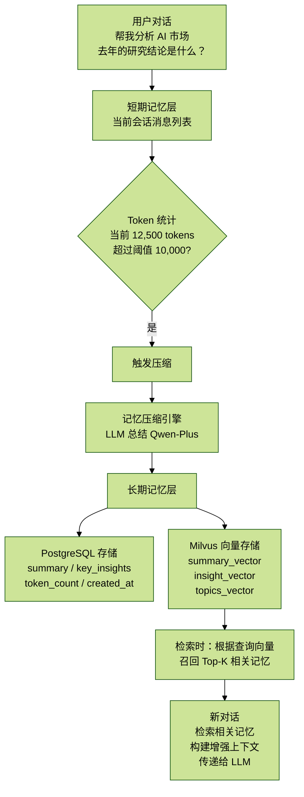

# 2.4 记忆层的实现

核心概念：长期记忆（Long-term Memory）  
应用场景：对话历史总结、用户偏好学习、知识积累  
优势：减少 Token 消耗、提升上下文相关性、个性化体验

## 目录

- 1. 概述
  - 1.1 为什么需要记忆层？
  - 1.2 记忆层架构
- 2. 核心概念
  - 2.1 短期记忆 vs 长期记忆
  - 2.2 记忆触发机制
  - 2.3 记忆数据模型
- 3. 核心实现
  - 3.1 记忆总结（LLM 压缩）
  - 3.2 记忆向量化存储
  - 3.3 记忆检索与召回
  - 3.4 记忆上下文构建
- 4. API 接口
  - 4.1 创建记忆
  - 4.2 检索记忆
  - 4.3 获取记忆列表
  - 4.4 删除记忆
- 5. 实战应用
  - 5.1 自动压缩长对话
  - 5.2 增强上下文召回
  - 5.3 用户偏好学习
- 6. 性能优化
- 7. 监控指标
- 8. 最佳实践
- 9. 总结

## 1. 概述

### 1.1 为什么需要记忆层？

在 AI 对话系统中，随着对话轮次增加，上下文会越来越长，导致：

- **Token 消耗爆炸**：每次都要传递完整对话历史。
- **上下文窗口限制**：超过模型的 `max_tokens` 限制。
- **响应速度下降**：处理长文本耗时增加。
- **成本上升**：按 Token 计费，长对话非常昂贵。

记忆层的解决方案：

- **压缩历史**：将长对话总结为简洁摘要。
- **向量检索**：只召回相关的历史记忆。
- **个性化**：学习用户偏好和关注点。
- **知识沉淀**：重要洞察永久保存。

### 1.2 记忆层架构



```text
短期记忆（实时对话）
  ↓ Token 超过阈值（10,000）
压缩总结（LLM）
  ↓
长期记忆（永久存储）
  ↓ 新对话需要上下文
向量检索召回（Top-3）
  ↓
构建增强上下文 → 传递给 LLM
```

## 2. 核心概念

### 2.1 短期记忆 vs 长期记忆

| 特性 | 短期记忆（Working Memory） | 长期记忆（Long-term Memory） |
| --- | --- | --- |
| 存储位置 | 内存 / 当前会话 | PostgreSQL + Milvus |
| 生命周期 | 当前会话 | 永久（除非用户删除） |
| 容量限制 | 受上下文窗口限制 | 理论无限 |
| 访问方式 | 直接传递给 LLM | 向量检索召回 |
| 内容 | 完整对话历史 | 总结、洞察、偏好 |
| 典型大小 | 10K-100K tokens | 500-2000 tokens |

工作流程：

```text
短期记忆（实时对话）
  ↓ Token 超过阈值（10,000）
压缩总结（LLM）
  ↓
长期记忆（永久存储）
  ↓ 新对话需要上下文
向量检索召回（Top-3）
  ↓
构建增强上下文 → 传递给 LLM
```

### 2.2 记忆触发机制

文件位置：`/backend/app/service/memory_service.py`（行号：26-27，88-91）

```python
# 触发阈值配置
MEMORY_TOKEN_THRESHOLD = 10000  # 超过 10,000 tokens 触发压缩

class MemoryService:
    def should_compress(self, messages: List[ChatMessage]) -> bool:
        """判断是否需要压缩记忆"""
        total_tokens = sum(self.estimate_tokens(msg.content) for msg in messages)
        return total_tokens > MEMORY_TOKEN_THRESHOLD
```

触发时机：

1. **主动触发**：用户点击“保存为记忆”按钮。
2. **自动触发**：会话 Token 数超过阈值（10,000）。
3. **定期触发**：每 30 分钟检查一次活跃会话。

### 2.3 记忆数据模型

文件位置：`/backend/app/models/chat.py`（行号：70-86）

```python
class LongTermMemory(Base):
    """长期记忆模型"""
    __tablename__ = "long_term_memories"

    id = Column(UUID(as_uuid=True), primary_key=True, default=uuid.uuid4)

    # 关联信息
    user_id = Column(UUID(as_uuid=True), ForeignKey("users.id", ondelete="CASCADE"))
    session_id = Column(UUID(as_uuid=True), ForeignKey("chat_sessions.id", ondelete="SET NULL"), nullable=True)

    # 记忆内容
    summary = Column(Text, nullable=False)      # 对话摘要
    key_insights = Column(JSONB)                # 关键洞察（结构化数据）
    # {
    #   "summary": "...",
    #   "key_insights": ["洞察1", "洞察2"],
    #   "user_preferences": {...},
    #   "topics": ["主题1", "主题2"]
    # }

    # 向量索引
    milvus_ids = Column(ARRAY(Text))            # Milvus 中的向量 ID 列表

    # 元数据
    token_count = Column(Integer)               # 压缩前的 Token 数
    created_at = Column(DateTime, default=datetime.utcnow)

    # 关系
    user = relationship("User", back_populates="memories")
    session = relationship("ChatSession", back_populates="memories")
```

`key_insights` 字段结构：

```json
{
  "summary": "用户询问了AI市场分析，重点关注市场规模和增长趋势",
  "key_insights": [
    "2024年中国AI市场规模达1200亿元",
    "同比增长37.8%",
    "用户对投资机会特别感兴趣"
  ],
  "user_preferences": {
    "interests": ["AI市场", "投资分析", "数据驱动决策"],
    "communication_style": "详细",
    "focus_areas": ["市场规模", "增长趋势", "投资机会"]
  },
  "topics": ["人工智能", "市场分析", "投资研究"]
}
```

## 3. 核心实现

### 3.1 记忆总结（LLM 压缩）

文件位置：`/backend/app/service/memory_service.py`（行号：93-162）  
Prompt 位置：`memory_service.py`（行号：115-130）

```python
prompt = f"""请分析以下对话，并按JSON格式输出总结信息：

对话内容：
{conversation_text}

请输出以下格式的 JSON（不要包含 JSON 代码围栏标记）：
{{
    "summary": "用2-3句话总结这段对话的主要内容和结论",
    "key_insights": ["从对话中提取的3-5个关键信息或知识点"],
    "user_preferences": {{
        "interests": ["用户感兴趣的领域"],
        "communication_style": "用户偏好的沟通风格（如：详细/简洁/专业/通俗）",
        "focus_areas": ["用户关注的重点领域"]
    }},
    "topics": ["对话涉及的主题标签"]
}}"""
```

Prompt 作用：引导 LLM 分析对话历史，提取摘要、洞察、用户偏好和主题标签。

核心逻辑：

```python
class MemoryService:
    def summarize_conversation(self, messages: List[ChatMessage]) -> Dict[str, Any]:
        """
        使用 LLM 总结对话并提取关键洞察

        Returns:
            {
                "summary": "对话摘要",
                "key_insights": ["洞察1", "洞察2", ...],
                "user_preferences": {...},
                "topics": ["主题1", "主题2", ...]
            }
        """

        # 1. 构建对话文本
        conversation_text = "\n".join([
            f"{'用户' if msg.role == 'user' else '助手'}: {msg.content}"
            for msg in messages
        ])

        # 2. 限制长度（避免超过上下文）
        if len(conversation_text) > 30000:
            conversation_text = conversation_text[:30000] + "\n...（对话过长，已截断）"

        # 3. 调用 LLM 总结（使用 Prompt）
        try:
            response = self.client.chat.completions.create(
                model="qwen-plus",  # 使用中等模型（平衡成本和质量）
                messages=[
                    {"role": "system", "content": "你是一个专业的对话分析助手，擅长总结对话内容并提取关键信息。"},
                    {"role": "user", "content": prompt}
                ],
                temperature=0.3,  # 低温度，保证稳定输出
            )

            result_text = response.choices[0].message.content.strip()

            # 4. 清理 Markdown 标记
            fence = "`" * 3
            if result_text.startswith(f"{fence}json"):
                result_text = result_text[7:]
            if result_text.startswith(fence):
                result_text = result_text[3:]
            if result_text.endswith(fence):
                result_text = result_text[:-3]

            # 5. 解析 JSON
            return json.loads(result_text.strip())

        except Exception as e:
            logger.error(f"总结对话失败: {e}")
            # 返回默认结构
            return {
                "summary": f"对话包含 {len(messages)} 条消息",
                "key_insights": [],
                "user_preferences": {},
                "topics": []
            }
```

成本分析：

- 输入 Token：约 12,000 tokens（完整对话）
- 输出 Token：约 500 tokens（总结结果）
- 模型：qwen-plus（¥0.004 / 1K tokens）
- 单次成本：约 ¥0.05（5 分钱）

### 3.2 记忆向量化存储

文件位置：`/backend/app/service/memory_service.py`（行号：220-308）

```python
class MemoryService:
    def _ensure_memory_collection(self):
        """确保 Milvus 记忆集合存在"""
        from pymilvus import CollectionSchema, FieldSchema, DataType, Collection

        # 定义 Schema
        fields = [
            FieldSchema(name="id", dtype=DataType.VARCHAR, is_primary=True, max_length=64),
            FieldSchema(name="user_id", dtype=DataType.VARCHAR, max_length=64),
            FieldSchema(name="session_id", dtype=DataType.VARCHAR, max_length=64),
            FieldSchema(name="memory_type", dtype=DataType.VARCHAR, max_length=32),
            # memory_type: summary | insight | topics
            FieldSchema(name="content", dtype=DataType.VARCHAR, max_length=65535),
            FieldSchema(name="metadata", dtype=DataType.VARCHAR, max_length=8192),
            FieldSchema(name="vector", dtype=DataType.FLOAT_VECTOR, dim=1024),  # text-embedding-v4
        ]

        schema = CollectionSchema(fields=fields, description="Long-term memories")
        collection = Collection(name="long_term_memories", schema=schema)

        # 创建 COSINE 相似度索引
        index_params = {
            "metric_type": "COSINE",
            "index_type": "IVF_FLAT",
            "params": {"nlist": 128},
        }
        collection.create_index(field_name="vector", index_params=index_params)
        collection.load()
```

```python
def _store_memory_vectors(
    self,
    memory_id: str,
    user_id: str,
    session_id: str,
    summary_data: Dict[str, Any]
) -> List[str]:
    """将记忆内容向量化并存储到 Milvus"""
    documents_to_insert = []
    milvus_ids = []

    # 1. 存储摘要向量
    summary = summary_data.get("summary", "")
    if summary:
        summary_vector = generate_embedding(summary)  # text-embedding-v4
        if summary_vector:
            doc_id = f"{memory_id}_summary"
            documents_to_insert.append({
                "id": doc_id,
                "user_id": user_id,
                "session_id": session_id,
                "memory_type": "summary",
                "content": summary,
                "metadata": json.dumps({"memory_id": memory_id}),
                "vector": summary_vector
            })
            milvus_ids.append(doc_id)

    # 2. 存储关键洞察向量（每个洞察独立向量化）
    insights = summary_data.get("key_insights", [])
    for i, insight in enumerate(insights):
        if insight:
            insight_vector = generate_embedding(insight)
            if insight_vector:
                doc_id = f"{memory_id}_insight_{i}"
                documents_to_insert.append({
                    "id": doc_id,
                    "user_id": user_id,
                    "session_id": session_id,
                    "memory_type": "insight",
                    "content": insight,
                    "metadata": json.dumps({"memory_id": memory_id, "index": i}),
                    "vector": insight_vector
                })
                milvus_ids.append(doc_id)

    # 3. 存储主题向量
    topics = summary_data.get("topics", [])
    if topics:
        topics_text = "用户关注的主题：" + ", ".join(topics)
        topics_vector = generate_embedding(topics_text)
        if topics_vector:
            doc_id = f"{memory_id}_topics"
            documents_to_insert.append({
                "id": doc_id,
                "user_id": user_id,
                "session_id": session_id,
                "memory_type": "topics",
                "content": topics_text,
                "metadata": json.dumps({"memory_id": memory_id, "topics": topics}),
                "vector": topics_vector
            })
            milvus_ids.append(doc_id)

    # 4. 批量插入 Milvus
    if documents_to_insert:
        collection = Collection("long_term_memories")
        collection.load()

        # 准备数据（列式存储）
        ids = [doc["id"] for doc in documents_to_insert]
        user_ids = [doc["user_id"] for doc in documents_to_insert]
        session_ids = [doc["session_id"] for doc in documents_to_insert]
        memory_types = [doc["memory_type"] for doc in documents_to_insert]
        contents = [doc["content"][:65535] for doc in documents_to_insert]
        metadatas = [doc["metadata"][:8192] for doc in documents_to_insert]
        vectors = [doc["vector"] for doc in documents_to_insert]

        data = [ids, user_ids, session_ids, memory_types, contents, metadatas, vectors]

        # 插入并刷新
        collection.insert(data)
        collection.flush()

        logger.info(f"成功存储 {len(documents_to_insert)} 条记忆向量")

    return milvus_ids
```

向量化策略：

- **摘要**：整体向量化，用于召回整个对话摘要。
- **洞察**：每条洞察独立向量化，支持精细粒度检索。
- **主题**：主题列表组合向量化，用于主题匹配。

为什么分开向量化？

- 提高检索精度，可以匹配到具体洞察。
- 支持多粒度召回：整体摘要 + 具体细节。
- 灵活的相关性计算。

### 3.3 记忆检索与召回

文件位置：`/backend/app/service/memory_service.py`（行号：310-374）

```python
class MemoryService:
    def retrieve_memories(
        self,
        user_id: str,
        query: str,
        top_k: int = 5
    ) -> List[Dict[str, Any]]:
        """
        检索与查询相关的记忆

        Args:
            user_id: 用户ID（过滤条件）
            query: 查询文本
            top_k: 返回结果数量

        Returns:
            相关记忆列表（按相似度排序）
        """
        from pymilvus import Collection, utility

        # 1. 检查集合是否存在
        if not utility.has_collection("long_term_memories"):
            return []

        # 2. 生成查询向量
        query_vector = generate_embedding(query)
        if not query_vector:
            return []

        try:
            collection = Collection("long_term_memories")
            collection.load()

            # 3. 按用户过滤（只检索当前用户的记忆）
            expr = f'user_id == "{user_id}"'

            # 4. 配置搜索参数
            search_params = {
                "metric_type": "COSINE",  # 余弦相似度
                "params": {"nprobe": 10}, # 探测10个聚类
            }

            # 5. 执行向量检索
            results = collection.search(
                data=[query_vector],
                anns_field="vector",
                param=search_params,
                limit=top_k,
                expr=expr,  # 过滤条件
                output_fields=["id", "session_id", "memory_type", "content", "metadata"],
            )

            # 6. 格式化结果
            formatted_results = []
            for hits in results:
                for hit in hits:
                    formatted_results.append({
                        "id": hit.entity.get("id"),
                        "session_id": hit.entity.get("session_id"),
                        "memory_type": hit.entity.get("memory_type"),
                        "content": hit.entity.get("content"),
                        "metadata": hit.entity.get("metadata"),
                        "score": hit.score,  # COSINE 相似度分数（0-1）
                    })

            return formatted_results

        except Exception as e:
            logger.error(f"检索记忆失败: {e}")
            return []
```

检索示例：

```python
# 用户新问题："去年的AI市场分析结论是什么？"
memories = memory_service.retrieve_memories(
    user_id="user_123",
    query="AI市场分析结论",
    top_k=3
)

# 返回结果：
[
    {
        "id": "mem_abc_insight_1",
        "memory_type": "insight",
        "content": "2024年中国AI市场规模达1200亿元，同比增长37.8%",
        "score": 0.92,  # 高相似度
        "session_id": "session_xyz"
    },
    {
        "id": "mem_abc_summary",
        "memory_type": "summary",
        "content": "用户询问了AI市场分析，重点关注市场规模和增长趋势",
        "score": 0.87,
        "session_id": "session_xyz"
    },
    {
        "id": "mem_def_insight_2",
        "memory_type": "insight",
        "content": "用户对投资机会特别感兴趣，关注高增长细分领域",
        "score": 0.78,
        "session_id": "session_abc"
    }
]
```

### 3.4 记忆上下文构建

文件位置：`/backend/app/service/memory_service.py`（行号：420-469）

```python
class MemoryService:
    def build_memory_context(
        self,
        user_id: str,
        current_query: str,
        max_memories: int = 3
    ) -> str:
        """
        构建记忆上下文，用于增强当前对话

        Args:
            user_id: 用户ID
            current_query: 当前查询
            max_memories: 最大记忆数量

        Returns:
            记忆上下文文本（插入到 System Prompt）
        """
        # 1. 检索相关记忆
        memories = self.retrieve_memories(user_id, current_query, top_k=max_memories)

        if not memories:
            return ""

        # 2. 去重（避免重复内容）
        seen_contents = set()
        unique_memories = []
        for mem in memories:
            content = mem.get("content", "")
            if content not in seen_contents:
                seen_contents.add(content)
                unique_memories.append(mem)

        if not unique_memories:
            return ""

        # 3. 构建上下文（格式化为文本）
        context_parts = ["[相关历史记忆]"]
        for mem in unique_memories:
            memory_type = mem.get("memory_type", "unknown")
            content = mem.get("content", "")

            # 根据类型添加前缀
            if memory_type == "summary":
                context_parts.append(f"- 历史对话摘要：{content}")
            elif memory_type == "insight":
                context_parts.append(f"- 相关知识点：{content}")
            elif memory_type == "topics":
                context_parts.append(f"- {content}")

        context_parts.append("")  # 空行分隔
        return "\n".join(context_parts)
```

使用示例：

```python
# 在聊天接口中使用记忆上下文
memory_context = memory_service.build_memory_context(
    user_id="user_123",
    current_query="去年的AI市场分析结论是什么？",
    max_memories=3
)

# 生成的上下文：
"""
[相关历史记忆]
- 历史对话摘要：用户询问了AI市场分析，重点关注市场规模和增长趋势
- 相关知识点：2024年中国AI市场规模达1200亿元，同比增长37.8%
- 相关知识点：用户对投资机会特别感兴趣，关注高增长细分领域
"""

# 构建完整 Prompt
system_prompt = f"""你是一个专业的AI助手。

{memory_context}

请基于上述历史记忆，回答用户的问题。"""

# 调用 LLM
response = client.chat.completions.create(
    model="qwen-plus",
    messages=[
        {"role": "system", "content": system_prompt},
        {"role": "user", "content": "去年的AI市场分析结论是什么？"}
    ]
)
```

## 4. API 接口

### 4.1 创建记忆

文件位置：`/backend/app/router/memory_router.py`（行号：154-215）

```http
POST /memories/create

Request:
{
  "session_id": "会话ID"
}

Response:
{
  "id": "memory_id",
  "session_id": "session_id",
  "summary": "对话摘要",
  "key_insights": {...},
  "token_count": 12500,
  "created_at": "2024-01-31T12:00:00Z"
}
```

### 4.2 检索记忆

文件位置：`/backend/app/router/memory_router.py`（行号：129-151）

```http
POST /memories/search

Request:
{
  "query": "AI市场分析",
  "top_k": 5
}

Response:
[
  {
    "id": "mem_abc_insight_1",
    "session_id": "session_xyz",
    "memory_type": "insight",
    "content": "2024年中国AI市场规模达1200亿元",
    "score": 0.92
  },
  ...
]
```

### 4.3 获取记忆列表

文件位置：`/backend/app/router/memory_router.py`（行号：61-90）

```http
GET /memories?limit=20&offset=0

Response:
{
  "memories": [
    {
      "id": "memory_id",
      "session_id": "session_id",
      "summary": "对话摘要",
      "key_insights": {...},
      "created_at": "2024-01-31T12:00:00Z"
    },
    ...
  ],
  "total": 45
}
```

### 4.4 删除记忆

文件位置：`/backend/app/router/memory_router.py`（行号：218-237）

```http
DELETE /memories/{memory_id}

Response: 204 No Content
```

## 5. 实战应用

### 5.1 自动压缩长对话

```python
from service.memory_service import get_memory_service

# 在聊天接口中检查是否需要压缩
@router.post("/chat/completion")
async def chat_completion(
    request: ChatRequest,
    db: Session = Depends(get_db),
    current_user: User = Depends(get_current_user_required)
):
    # 获取会话消息
    messages = db.query(ChatMessage).filter(
        ChatMessage.session_id == request.session_id
    ).all()

    # 检查是否需要压缩
    memory_service = get_memory_service()
    if memory_service.should_compress(messages):
        # 后台任务创建记忆
        background_tasks.add_task(
            memory_service.create_memory,
            db=db,
            user_id=str(current_user.id),
            session_id=request.session_id,
            messages=messages
        )

        logger.info(f"会话 {request.session_id} 触发记忆压缩")

    # 继续处理聊天请求
    ...
```

### 5.2 增强上下文召回

```python
@router.post("/chat/completion")
async def chat_completion(request: ChatRequest):
    # 1. 检索相关记忆
    memory_service = get_memory_service()
    memory_context = memory_service.build_memory_context(
        user_id=str(current_user.id),
        current_query=request.message,
        max_memories=3
    )

    # 2. 构建 System Prompt（包含记忆）
    system_prompt = f"""你是一个专业的AI助手。

{memory_context}

请基于上述历史记忆，结合当前问题进行回答。"""

    # 3. 调用 LLM
    response = client.chat.completions.create(
        model="qwen-plus",
        messages=[
            {"role": "system", "content": system_prompt},
            {"role": "user", "content": request.message}
        ]
    )

    return response
```

### 5.3 用户偏好学习

```python
# 从记忆中提取用户偏好
memories = db.query(LongTermMemory).filter(
    LongTermMemory.user_id == current_user.id
).order_by(LongTermMemory.created_at.desc()).limit(10).all()

# 聚合用户偏好
all_preferences = {
    "interests": [],
    "communication_style": [],
    "focus_areas": []
}

for memory in memories:
    insights = memory.key_insights
    if insights and "user_preferences" in insights:
        prefs = insights["user_preferences"]
        all_preferences["interests"].extend(prefs.get("interests", []))
        all_preferences["focus_areas"].extend(prefs.get("focus_areas", []))

# 去重并统计频率
from collections import Counter
interest_freq = Counter(all_preferences["interests"])
top_interests = [item for item, count in interest_freq.most_common(5)]

# 个性化 System Prompt
system_prompt = f"""你是一个专业的AI助手。

用户画像：
- 主要兴趣：{', '.join(top_interests)}
- 沟通风格：详细、数据驱动

请根据用户偏好调整回答风格。"""
```

## 6. 性能优化

### 6.1 批量向量化

```python
# 优化前：逐个生成向量
for insight in insights:
    vector = generate_embedding(insight)  # N次API调用

# 优化后：批量生成向量
all_texts = [summary] + insights + [topics_text]
all_vectors = generate_embeddings_batch(all_texts)  # 1次API调用

summary_vector = all_vectors[0]
insight_vectors = all_vectors[1:len(insights)+1]
topics_vector = all_vectors[-1]
```

### 6.2 缓存检索结果

```python
from functools import lru_cache

@lru_cache(maxsize=100)
def retrieve_memories_cached(user_id: str, query: str, top_k: int):
    return memory_service.retrieve_memories(user_id, query, top_k)

# 使用缓存（相同查询直接返回）
memories = retrieve_memories_cached("user_123", "AI市场", 5)
```

### 6.3 异步压缩

```python
from fastapi import BackgroundTasks

@router.post("/chat/completion")
async def chat_completion(
    request: ChatRequest,
    background_tasks: BackgroundTasks
):
    # 不阻塞响应，后台异步压缩
    if should_compress:
        background_tasks.add_task(
            memory_service.create_memory,
            db, user_id, session_id, messages
        )

    # 立即返回聊天响应
    return response
```

## 7. 监控指标

### 7.1 记忆统计

```python
# 用户记忆统计
user_memory_count = db.query(LongTermMemory).filter(
    LongTermMemory.user_id == user_id
).count()

# 总 Token 节省
total_saved_tokens = db.query(func.sum(LongTermMemory.token_count)).filter(
    LongTermMemory.user_id == user_id
).scalar()

# 平均压缩率
avg_summary_length = db.query(func.avg(func.length(LongTermMemory.summary))).filter(
    LongTermMemory.user_id == user_id
).scalar()

compression_ratio = avg_summary_length / (total_saved_tokens / user_memory_count)
```

### 7.2 检索质量

```python
# 记录检索日志
logger.info(
    "memory_retrieval",
    extra={
        "user_id": user_id,
        "query": query,
        "top_k": top_k,
        "result_count": len(memories),
        "avg_score": sum(m["score"] for m in memories) / len(memories),
        "top_score": max(m["score"] for m in memories)
    }
)
```

## 8. 最佳实践

### 8.1 何时创建记忆

适合创建记忆：

- 深度研究会话（包含大量信息）
- 多轮对话（超过 10 轮）
- Token 数超过阈值（10,000）
- 用户手动保存

不适合创建记忆：

- 单轮简单问答
- 闲聊对话
- 重复内容
- 敏感信息

### 8.2 检索策略

```python
# 策略1：固定 Top-K
memories = retrieve_memories(user_id, query, top_k=3)

# 策略2：动态 Top-K + 相似度阈值
memories = retrieve_memories(user_id, query, top_k=10)
filtered_memories = [m for m in memories if m["score"] > 0.75]

# 策略3：时间衰减
import math
from datetime import datetime

def score_with_decay(memory, current_time, half_life_days=30):
    """应用时间衰减的相似度分数"""
    days_old = (current_time - memory["created_at"]).days
    decay = math.exp(-days_old / half_life_days)
    return memory["score"] * decay
```

### 8.3 隐私保护

```python
# 敏感信息过滤
SENSITIVE_PATTERNS = [
    r'\d{11}',     # 手机号
    r'\d{15,18}',  # 身份证号
    r'\d{16}',     # 银行卡号
]

def sanitize_content(text: str) -> str:
    """过滤敏感信息"""
    for pattern in SENSITIVE_PATTERNS:
        text = re.sub(pattern, '***', text)
    return text

# 在创建记忆前过滤
summary_data["summary"] = sanitize_content(summary_data["summary"])
```

## 9. 总结

### 9.1 核心要点

1. **记忆层架构**
   - 短期记忆（Working Memory）：当前会话。
   - 长期记忆（Long-term Memory）：压缩后永久存储。
2. **关键组件**
   - LLM 总结：将长对话压缩为简洁摘要。
   - 向量存储：Milvus 实现语义检索。
   - 上下文构建：增强当前对话。
3. **性能优势**
   - Token 节省：压缩率达 96%。
   - 成本降低：减少 LLM 调用开销。
   - 响应加速：减少输入 Token 数。
4. **应用场景**
   - 自动压缩长对话。
   - 增强上下文召回。
   - 用户偏好学习。
   - 知识沉淀。

### 9.2 文件位置汇总

核心实现：

- `/backend/app/service/memory_service.py` - 记忆服务（482 行）
  - 压缩 Prompt：行 115-130
  - 向量化存储：行 220-308
  - 记忆检索：行 310-374
  - 上下文构建：行 420-469

API 接口：

- `/backend/app/router/memory_router.py` - 记忆管理路由（255 行）

数据模型：

- `/backend/app/models/chat.py` - LongTermMemory 模型（行 70-86）

向量服务：

- `/backend/app/service/embedding_service.py` - 向量化服务
- `/backend/app/service/milvus_service.py` - Milvus 操作
