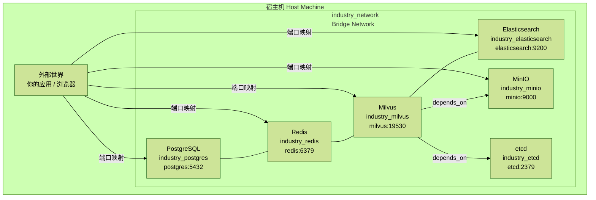

# 3.1 Docker容器化部署

> 核心价值：一键启动完整的微服务栈，实现开发环境与生产环境的一致性。

## 目录

- [概述](#概述)
- [1 docker-compose.yml 完整解析](#1-docker-composeyml-完整解析)
  - [1.1 整体架构](#11-整体架构)
  - [1.2 PostgreSQL 配置详解](#12-postgresql-配置详解)
  - [1.3 Redis 配置详解](#13-redis-配置详解)
  - [1.4 Milvus 向量数据库（三个容器）](#14-milvus-向量数据库三个容器)
  - [1.5 Elasticsearch 配置详解](#15-elasticsearch-配置详解)
  - [1.6 数据卷持久化策略](#16-数据卷持久化策略)
  - [1.7 网络隔离配置](#17-网络隔离配置)
- [2 start-services.sh 脚本详解](#2-start-servicessh-脚本详解)
  - [2.1 脚本功能](#21-脚本功能)
  - [2.2 核心逻辑解析](#22-核心逻辑解析)
- [3 生产环境部署（Kubernetes）](#3-生产环境部署kubernetes)
- [4 监控和日志集成](#4-监控和日志集成)
- [5 常见问题与解决方案](#5-常见问题与解决方案)
- [6 最佳实践](#6-最佳实践)

## 概述

本项目采用 Docker Compose 编排 6 个核心中间件服务，实现了：

- **环境隔离**：每个服务独立容器
- **数据持久化**：卷挂载保证数据不丢失
- **健康检查**：自动重启和服务探活
- **网络隔离**：自定义 bridge 网络
- **一键管理**：Shell 脚本自动化运维

## 1 docker-compose.yml 完整解析

### 1.1 整体架构



```yaml
version: '3.8'

services:
  # 6个核心服务
  - postgres      # 关系型数据库（主数据存储）
  - redis         # 缓存和会话存储
  - etcd          # Milvus元数据存储
  - minio         # Milvus对象存储
  - milvus        # 向量数据库
  - elasticsearch # 全文检索引擎

volumes:
  # 6个持久化卷
  postgres_data, redis_data, etcd_data, minio_data, milvus_data, es_data

networks:
  industry_network:  # 自定义网络
```

### 1.2 PostgreSQL 配置详解

文件位置：`/docker-compose.yml`（第5-25行）

```yaml
postgres:
  image: postgres:15-alpine
  container_name: industry_postgres
  restart: unless-stopped
  environment:
    POSTGRES_USER: postgres
    POSTGRES_PASSWORD: postgres123
    POSTGRES_DB: industry_assistant
    TZ: Asia/Shanghai  # 时区设置
  ports:
    - "5432:5432"
  volumes:
    - postgres_data:/var/lib/postgresql/data  # 数据持久化
    - ./docker/init-db:/docker-entrypoint-initdb.d  # 初始化脚本
  healthcheck:
    test: ["CMD-SHELL", "pg_isready -U postgres"]
    interval: 10s
    timeout: 5s
    retries: 5
  networks:
    - industry_network
```

关键配置说明：

1. **镜像选择**：`postgres:15-alpine`
   - Alpine Linux 基础镜像，体积小（约 200MB）
   - PostgreSQL 15 LTS 版本，稳定可靠

2. **环境变量**
   - `POSTGRES_DB`：自动创建 `industry_assistant` 数据库
   - `TZ: Asia/Shanghai`：解决时区问题，避免时间偏差 8 小时

3. **数据持久化**
   - 卷挂载：`postgres_data:/var/lib/postgresql/data`
   - 即使容器删除，数据仍保留在宿主机

4. **健康检查**

```bash
pg_isready -U postgres  # 检查PostgreSQL是否接受连接
interval: 10s           # 每10秒检查一次
retries: 5              # 失败5次才标记为unhealthy
```

### 1.3 Redis 配置详解

文件位置：`/docker-compose.yml`（第27-43行）

```yaml
redis:
  image: redis:7-alpine
  container_name: industry_redis
  restart: unless-stopped
  command: redis-server --appendonly yes  # 启用AOF持久化
  ports:
    - "6379:6379"
  volumes:
    - redis_data:/data
  healthcheck:
    test: ["CMD", "redis-cli", "ping"]
    interval: 10s
    timeout: 5s
    retries: 5
  networks:
    - industry_network
```

关键配置说明：

1. **持久化策略**
   - `--appendonly yes`：启用 AOF（Append Only File）
   - 每次写操作都追加到日志，保证数据安全
   - 数据文件：`/data/appendonly.aof`

2. **健康检查**

```bash
redis-cli ping  # 返回PONG则健康
```

### 1.4 Milvus 向量数据库（三个容器）

Milvus 采用分布式架构，需要 3 个依赖服务：

#### 1.4.1 etcd（元数据存储）

文件位置：`/docker-compose.yml`（第45-64行）

```yaml
etcd:
  image: quay.io/coreos/etcd:v3.5.5
  container_name: industry_etcd
  restart: unless-stopped
  environment:
    - ETCD_AUTO_COMPACTION_MODE=revision
    - ETCD_AUTO_COMPACTION_RETENTION=1000
    - ETCD_QUOTA_BACKEND_BYTES=4294967296  # 4GB配额
    - ETCD_SNAPSHOT_COUNT=50000
  volumes:
    - etcd_data:/etcd
  command: etcd --advertise-client-urls=http://127.0.0.1:2379 --listen-client-urls http://0.0.0.0:2379 --data-dir /etcd
  healthcheck:
    test: ["CMD", "etcdctl", "endpoint", "health"]
    interval: 30s
    timeout: 20s
    retries: 3
  networks:
    - industry_network
```

作用：

- 存储 Milvus 集合的元数据（Schema、索引配置等）
- 协调分布式节点

#### 1.4.2 MinIO（对象存储）

文件位置：`/docker-compose.yml`（第66-85行）

```yaml
minio:
  image: minio/minio:RELEASE.2023-03-20T20-16-18Z
  container_name: industry_minio
  restart: unless-stopped
  environment:
    MINIO_ACCESS_KEY: minioadmin
    MINIO_SECRET_KEY: minioadmin
  ports:
    - "9001:9001"  # Web管理界面
    - "9000:9000"  # API端口
  volumes:
    - minio_data:/minio_data
  command: minio server /minio_data --console-address ":9001"
  healthcheck:
    test: ["CMD", "curl", "-f", "http://localhost:9000/minio/health/live"]
    interval: 30s
    timeout: 20s
    retries: 3
  networks:
    - industry_network
```

作用：

- 存储向量数据的原始文件
- Web UI 访问：`http://localhost:9001`（账号/密码：`minioadmin/minioadmin`）

#### 1.4.3 Milvus 核心服务

文件位置：`/docker-compose.yml`（第87-109行）

```yaml
milvus:
  image: milvusdb/milvus:v2.3.3
  container_name: industry_milvus
  restart: unless-stopped
  command: ["milvus", "run", "standalone"]
  environment:
    ETCD_ENDPOINTS: etcd:2379
    MINIO_ADDRESS: minio:9000
  volumes:
    - milvus_data:/var/lib/milvus
  ports:
    - "19530:19530"  # gRPC端口（客户端连接）
    - "9091:9091"    # HTTP健康检查端口
  depends_on:
    - etcd
    - minio
  healthcheck:
    test: ["CMD", "curl", "-f", "http://localhost:9091/healthz"]
    interval: 30s
    timeout: 20s
    retries: 3
  networks:
    - industry_network
```

关键配置：

- `depends_on`：确保 etcd 和 minio 先启动
- `19530`：PyMilvus 客户端连接端口
- 健康检查：`/healthz` 端点

### 1.5 Elasticsearch 配置详解

文件位置：`/docker-compose.yml`（第111-130行）

```yaml
elasticsearch:
  image: docker.elastic.co/elasticsearch/elasticsearch:8.11.3
  container_name: industry_elasticsearch
  restart: unless-stopped
  environment:
    - discovery.type=single-node  # 单节点模式
    - xpack.security.enabled=false  # 关闭安全认证（开发环境）
    - "ES_JAVA_OPTS=-Xms512m -Xmx512m"  # 限制内存
  ports:
    - "1200:9200"  # 注意端口映射为1200（避免冲突）
  volumes:
    - es_data:/usr/share/elasticsearch/data
  healthcheck:
    test: ["CMD-SHELL", "curl -f http://localhost:9200/_cluster/health || exit 1"]
    interval: 30s
    timeout: 10s
    retries: 5
  networks:
    - industry_network
```

注意事项：

- **端口映射**：`1200:9200`（外部访问用 1200）
- **内存限制**：512MB 堆内存（生产环境建议 2GB+）
- **安全性**：开发环境关闭了 X-Pack 认证

### 1.6 数据卷持久化策略

文件位置：`/docker-compose.yml`（第132-138行）

```yaml
volumes:
  postgres_data:  # PostgreSQL数据
  redis_data:     # Redis AOF文件
  etcd_data:      # etcd元数据
  minio_data:     # MinIO对象文件
  milvus_data:    # Milvus向量索引
  es_data:        # Elasticsearch索引
```

数据存储位置（macOS）：

```text
/var/lib/docker/volumes/industry_information_assistant_postgres_data/_data
```

备份命令：

```bash
# 备份PostgreSQL
docker exec industry_postgres pg_dump -U postgres industry_assistant > backup.sql

# 备份Redis
docker exec industry_redis redis-cli SAVE
docker cp industry_redis:/data/dump.rdb ./backup_redis.rdb

# 备份Milvus（导出collection）
# 使用 pymilvus API导出
```

### 1.7 网络隔离配置

文件位置：`/docker-compose.yml`（第140-142行）

```yaml
networks:
  industry_network:
    driver: bridge
```

网络拓扑：

```text
Host（宿主机）
  ↓ 端口映射
industry_network (172.18.0.0/16)
  ├── postgres      (172.18.0.2)
  ├── redis         (172.18.0.3)
  ├── etcd          (172.18.0.4)
  ├── minio         (172.18.0.5)
  ├── milvus        (172.18.0.6)
  └── elasticsearch (172.18.0.7)
```

容器间通信：

```python
# Python后端连接配置（使用容器名）
POSTGRES_HOST = "postgres"  # 而不是 localhost
REDIS_HOST = "redis"
MILVUS_HOST = "milvus"
```

## 2 start-services.sh 脚本详解

文件位置：`/start-services.sh`（195行）

### 2.1 脚本功能

```bash
./start-services.sh start    # 启动所有服务
./start-services.sh stop     # 停止所有服务
./start-services.sh restart  # 重启服务
./start-services.sh status   # 查看服务状态
./start-services.sh logs     # 查看日志
./start-services.sh clean    # 清理数据（危险！）
```

### 2.2 核心逻辑解析

#### 2.2.1 Docker检查机制

位置：`/start-services.sh`（第36-42行）

```bash
check_docker() {
    if ! docker info > /dev/null 2>&1; then
        log_error "Docker 未运行，请启动 Docker Desktop"
        exit 1
    fi
    log_success "Docker 运行正常"
}
```

作用：避免在 Docker 未启动时执行命令。

#### 2.2.2 服务启动流程

位置：`/start-services.sh`（第45-67行）

```bash
start_services() {
    log_info "正在启动中间件服务 (PostgreSQL, Redis, Milvus, Elasticsearch)..."
    docker-compose up -d  # -d 后台运行

    log_info "等待服务启动完成..."
    sleep 10  # 等待10秒让服务初始化

    check_service_health  # 健康检查

    log_success "所有中间件服务已启动!"
    echo ""
    echo "服务访问地址:"
    echo "  - PostgreSQL: localhost:5432"
    echo "  - Redis: localhost:6379"
    echo "  - Milvus: localhost:19530"
    echo "  - Elasticsearch: localhost:1200"
    echo "  - MinIO Console: localhost:9001 (admin/minioadmin)"
    echo ""
    log_info "现在可以启动前后端服务了"
    echo "  - 后端: cd backend && python app/app-main.py"
    echo "  - 前端: cd frontend && npm run dev"
}
```

#### 2.2.3 健康检查实现

位置：`/start-services.sh`（第84-114行）

```bash
check_service_health() {
    log_info "检查服务健康状态..."

    # PostgreSQL
    if docker exec industry_postgres pg_isready -U postgres > /dev/null 2>&1; then
        log_success "PostgreSQL: 运行中"
    else
        log_warning "PostgreSQL: 启动中..."
    fi

    # Redis
    if docker exec industry_redis redis-cli ping > /dev/null 2>&1; then
        log_success "Redis: 运行中"
    else
        log_warning "Redis: 启动中..."
    fi

    # Milvus
    if curl -s http://localhost:9091/healthz > /dev/null 2>&1; then
        log_success "Milvus: 运行中"
    else
        log_warning "Milvus: 启动中..."
    fi

    # Elasticsearch
    if curl -s http://localhost:1200/_cluster/health > /dev/null 2>&1; then
        log_success "Elasticsearch: 运行中"
    else
        log_warning "Elasticsearch: 启动中..."
    fi
}
```

技术细节：

- PostgreSQL：使用 `pg_isready` 工具
- Redis：使用 `redis-cli ping`
- Milvus/ES：使用 HTTP 健康检查端点

#### 2.2.4 日志查看

位置：`/start-services.sh`（第125-131行）

```bash
show_logs() {
    if [ -z "$2" ]; then
        docker-compose logs -f --tail=100  # 所有服务最后100行
    else
        docker-compose logs -f --tail=100 "$2"  # 指定服务
    fi
}
```

使用示例：

```bash
./start-services.sh logs           # 所有服务日志
./start-services.sh logs postgres  # 仅PostgreSQL日志
./start-services.sh logs milvus    # 仅Milvus日志
```

#### 2.2.5 数据清理（危险操作）

位置：`/start-services.sh`（第134-144行）

```bash
clean_data() {
    log_warning "警告：此操作将删除所有数据，包括数据库、缓存和向量数据！"
    read -p "确定要继续吗? (yes/no): " confirm
    if [ "$confirm" = "yes" ]; then
        stop_services
        docker-compose down -v  # -v 删除所有volume
        log_success "所有数据已清理"
    else
        log_info "操作已取消"
    fi
}
```

危险点：

- `down -v` 会永久删除所有数据卷
- 无法恢复，需要二次确认

## 3 生产环境部署（Kubernetes）

### 3.1 Kubernetes清单示例

`postgres-deployment.yaml`

```yaml
apiVersion: apps/v1
kind: StatefulSet
metadata:
  name: postgres
  namespace: industry-assistant
spec:
  serviceName: postgres
  replicas: 1
  selector:
    matchLabels:
      app: postgres
  template:
    metadata:
      labels:
        app: postgres
    spec:
      containers:
        - name: postgres
          image: postgres:15-alpine
          env:
            - name: POSTGRES_USER
              valueFrom:
                secretKeyRef:
                  name: postgres-secret
                  key: username
            - name: POSTGRES_PASSWORD
              valueFrom:
                secretKeyRef:
                  name: postgres-secret
                  key: password
            - name: POSTGRES_DB
              value: "industry_assistant"
          ports:
            - containerPort: 5432
          volumeMounts:
            - name: postgres-data
              mountPath: /var/lib/postgresql/data
          resources:
            requests:
              memory: "512Mi"
              cpu: "500m"
            limits:
              memory: "2Gi"
              cpu: "2000m"
          livenessProbe:
            exec:
              command:
                - pg_isready
                - -U
                - postgres
            initialDelaySeconds: 30
            periodSeconds: 10
          readinessProbe:
            exec:
              command:
                - pg_isready
                - -U
                - postgres
            initialDelaySeconds: 5
            periodSeconds: 5
  volumeClaimTemplates:
    - metadata:
        name: postgres-data
      spec:
        accessModes: [ "ReadWriteOnce" ]
        storageClassName: "standard"
        resources:
          requests:
            storage: 50Gi
---
apiVersion: v1
kind: Service
metadata:
  name: postgres
  namespace: industry-assistant
spec:
  ports:
    - port: 5432
      targetPort: 5432
  selector:
    app: postgres
  clusterIP: None  # Headless Service
```

关键配置说明：

1. **StatefulSet vs Deployment**
   - 数据库使用 StatefulSet 保证稳定的网络标识
   - 持久化卷绑定到特定 Pod

2. **资源配额**

```yaml
requests:
  memory: "512Mi"  # 最小需求
  cpu: "500m"
limits:
  memory: "2Gi"    # 最大限制
  cpu: "2000m"
```

3. **健康检查**
   - `livenessProbe`：存活探针（失败则重启 Pod）
   - `readinessProbe`：就绪探针（未就绪则不转发流量）

4. **持久化存储**
   - `volumeClaimTemplates`：自动创建 PVC
   - `storageClassName: standard`：使用标准存储类

### 3.2 配置管理（ConfigMap & Secret）

`postgres-secret.yaml`

```yaml
apiVersion: v1
kind: Secret
metadata:
  name: postgres-secret
  namespace: industry-assistant
type: Opaque
data:
  username: cG9zdGdyZXM=      # base64编码的 "postgres"
  password: cG9zdGdyZXMxMjM=  # base64编码的 "postgres123"
```

生成 base64 编码：

```bash
echo -n "postgres" | base64
# cG9zdGdyZXM=

echo -n "postgres123" | base64
# cG9zdGdyZXMxMjM=
```

`backend-configmap.yaml`

```yaml
apiVersion: v1
kind: ConfigMap
metadata:
  name: backend-config
  namespace: industry-assistant
data:
  POSTGRES_HOST: "postgres.industry-assistant.svc.cluster.local"
  POSTGRES_PORT: "5432"
  POSTGRES_DB: "industry_assistant"
  REDIS_HOST: "redis.industry-assistant.svc.cluster.local"
  REDIS_PORT: "6379"
  MILVUS_HOST: "milvus.industry-assistant.svc.cluster.local"
  MILVUS_PORT: "19530"
  ES_HOST: "elasticsearch.industry-assistant.svc.cluster.local"
  ES_PORT: "9200"
```

### 3.3 Helm Chart结构

```text
industry-assistant/
├── Chart.yaml
├── values.yaml
├── templates/
│   ├── postgres/
│   │   ├── statefulset.yaml
│   │   ├── service.yaml
│   │   └── pvc.yaml
│   ├── redis/
│   │   ├── deployment.yaml
│   │   └── service.yaml
│   ├── milvus/
│   │   ├── etcd.yaml
│   │   ├── minio.yaml
│   │   └── milvus.yaml
│   ├── elasticsearch/
│   │   ├── statefulset.yaml
│   │   └── service.yaml
│   └── backend/
│       ├── deployment.yaml
│       ├── service.yaml
│       └── ingress.yaml
└── values/
    ├── dev.yaml
    ├── staging.yaml
    └── production.yaml
```

`values.yaml` 示例：

```yaml
postgres:
  enabled: true
  image:
    repository: postgres
    tag: 15-alpine
  persistence:
    enabled: true
    size: 50Gi
  resources:
    requests:
      memory: 512Mi
      cpu: 500m
    limits:
      memory: 2Gi
      cpu: 2000m

redis:
  enabled: true
  image:
    repository: redis
    tag: 7-alpine
  persistence:
    enabled: true
    size: 10Gi

milvus:
  enabled: true
  standalone:
    replicas: 1
  etcd:
    persistence:
      size: 10Gi
  minio:
    persistence:
      size: 50Gi

elasticsearch:
  enabled: true
  replicas: 1
  minimumMasterNodes: 1
  persistence:
    size: 50Gi

backend:
  replicas: 3  # 多副本
  image:
    repository: industry-assistant-backend
    tag: latest
  resources:
    requests:
      memory: 1Gi
      cpu: 500m
    limits:
      memory: 4Gi
      cpu: 2000m
  autoscaling:
    enabled: true
    minReplicas: 3
    maxReplicas: 10
    targetCPUUtilizationPercentage: 70
```

部署命令：

```bash
# 安装
helm install industry-assistant ./industry-assistant -f values/production.yaml

# 升级
helm upgrade industry-assistant ./industry-assistant -f values/production.yaml

# 回滚
helm rollback industry-assistant 1
```

## 4 监控和日志集成

### 4.1 Prometheus监控

`docker-compose.monitoring.yml`

```yaml
version: '3.8'

services:
  prometheus:
    image: prom/prometheus:latest
    container_name: prometheus
    volumes:
      - ./monitoring/prometheus.yml:/etc/prometheus/prometheus.yml
      - prometheus_data:/prometheus
    ports:
      - "9090:9090"
    networks:
      - industry_network

  grafana:
    image: grafana/grafana:latest
    container_name: grafana
    volumes:
      - grafana_data:/var/lib/grafana
      - ./monitoring/grafana/dashboards:/etc/grafana/provisioning/dashboards
    ports:
      - "3000:3000"
    environment:
      - GF_SECURITY_ADMIN_PASSWORD=admin
    networks:
      - industry_network

volumes:
  prometheus_data:
  grafana_data:

networks:
  industry_network:
    external: true
```

`prometheus.yml` 配置：

```yaml
global:
  scrape_interval: 15s

scrape_configs:
  - job_name: 'postgres'
    static_configs:
      - targets: ['postgres-exporter:9187']

  - job_name: 'redis'
    static_configs:
      - targets: ['redis-exporter:9121']

  - job_name: 'milvus'
    static_configs:
      - targets: ['milvus:9091']

  - job_name: 'backend'
    static_configs:
      - targets: ['backend:8000']
```

### 4.2 日志聚合（ELK Stack）

`filebeat` 配置：

```yaml
filebeat.inputs:
  - type: container
    paths:
      - '/var/lib/docker/containers/*/*.log'
    processors:
      - add_docker_metadata:
          host: "unix:///var/run/docker.sock"

output.elasticsearch:
  hosts: ["elasticsearch:9200"]
  index: "docker-logs-%{+yyyy.MM.dd}"

setup.kibana:
  host: "kibana:5601"
```

## 5 常见问题与解决方案

### 5.1 端口冲突

问题：`ERROR: for postgres Cannot start service postgres: Ports are not available`

解决方案：

```bash
# 查看端口占用
lsof -i :5432

# 修改docker-compose.yml端口映射
ports:
  - "15432:5432"  # 改为15432

# 更新后端配置
POSTGRES_PORT=15432
```

### 5.2 Milvus启动失败

问题：`Milvus etcd connection refused`

解决方案：

```bash
# 检查etcd日志
docker logs industry_etcd

# 确保启动顺序
docker-compose up -d etcd minio
sleep 10
docker-compose up -d milvus
```

### 5.3 数据卷权限问题

问题：`Permission denied` 错误

解决方案：

```bash
# 检查卷权限
docker volume inspect industry_information_assistant_postgres_data

# 修复权限（慎用）
docker run --rm -v postgres_data:/data alpine chown -R 999:999 /data
```

### 5.4 内存不足

问题：Elasticsearch 频繁 OOM

解决方案：

```yaml
# 增加内存限制
environment:
  - "ES_JAVA_OPTS=-Xms1g -Xmx1g"  # 改为1GB

# 或关闭不需要的服务
docker-compose up -d postgres redis milvus  # 不启动ES
```

## 6 最佳实践

### 6.1 开发环境

```bash
# 1. 首次启动
./start-services.sh start

# 2. 初始化数据库
cd backend
alembic upgrade head
python scripts/seed_data.py

# 3. 启动后端
python app/app-main.py

# 4. 启动前端
cd ../frontend
npm run dev
```

### 6.2 生产环境检查清单

- [ ] 修改所有默认密码
- [ ] 启用 Redis 密码认证
- [ ] 配置 PostgreSQL SSL 连接
- [ ] 限制 Elasticsearch 内存（建议 2GB+）
- [ ] 配置 Milvus 持久化参数
- [ ] 设置资源限制（CPU/内存）
- [ ] 配置日志轮转
- [ ] 设置健康检查和自动重启
- [ ] 配置备份策略
- [ ] 启用监控告警

### 6.3 备份策略

自动备份脚本：

```bash
#!/bin/bash
# backup.sh

BACKUP_DIR="/backups/$(date +%Y%m%d)"
mkdir -p $BACKUP_DIR

# 备份PostgreSQL
docker exec industry_postgres pg_dump -U postgres industry_assistant | gzip > $BACKUP_DIR/postgres.sql.gz

# 备份Redis
docker exec industry_redis redis-cli SAVE
docker cp industry_redis:/data/dump.rdb $BACKUP_DIR/redis.rdb

# 备份Milvus（导出collection列表）
python backup_milvus.py > $BACKUP_DIR/milvus_collections.json

# 保留最近30天备份
find /backups -type d -mtime +30 -exec rm -rf {} \;
```

crontab 配置：

```cron
# 每天凌晨2点执行备份
0 2 * * * /path/to/backup.sh >> /var/log/backup.log 2>&1
```

## 总结

本章介绍了项目的 Docker 容器化部署方案：

1. **docker-compose.yml**：6 个服务的完整配置
2. **start-services.sh**：一键管理脚本
3. **Kubernetes部署**：生产环境方案
4. **监控和日志**：可观测性集成
5. **最佳实践**：开发和生产环境配置

关键文件：

- `/docker-compose.yml`：服务编排配置
- `/start-services.sh`：自动化脚本

下一章：3.2 PostgreSQL 数据库设计，深入讲解 12 张表的 Schema 设计和 JSONB 的用法。
