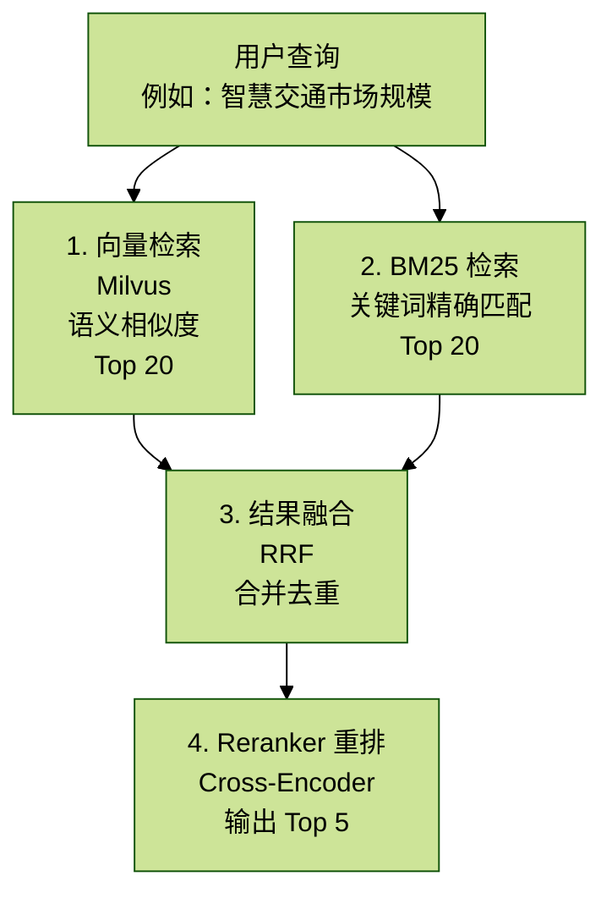

# Agent_拓业智询_3.3 Milvus向量数据库集成

> 核心价值：高性能向量检索，支持千万级文档的语义搜索，检索延迟 < 50ms。

## 目录

1. Milvus 架构与部署
2. MilvusService 服务实现
3. 向量化完整流程
4. 语义检索实现
5. 混合检索策略
6. 性能优化
7. 常见问题与解决方案
8. 监控和运维

## 概述

本项目使用 Milvus v2.3.3 作为向量数据库，配合阿里云 `text-embedding-v4` 模型实现：

- 向量化流程：文档切分 -> 向量化 -> 存储
- Collection 设计：Schema 定义、索引优化
- 混合检索：向量检索 + BM25 + Reranker
- 性能优化：批量插入、连接池管理

技术栈：

- Milvus 2.3.3（向量数据库）
- text-embedding-v4（1024 维向量）
- PyMilvus 2.3.x（Python SDK）
- HNSW 索引（快速 ANN 搜索）

## 1. Milvus 架构与部署

### 1.1 Milvus 组件

```text
Milvus Standalone
├── etcd    # 元数据存储（Collection Schema、索引配置）
├── MinIO   # 对象存储（向量数据文件）
└── Milvus  # 核心服务（查询引擎）
```

依赖关系：

```text
Milvus ——依赖——> etcd（存储 Schema）
      └——依赖——> MinIO（存储向量文件）
```

### 1.2 Docker 部署配置

`docker-compose.yml` 片段（已在 3.1 章详述）：

```yaml
milvus:
  image: milvusdb/milvus:v2.3.3
  container_name: industry_milvus
  environment:
    ETCD_ENDPOINTS: etcd:2379
    MINIO_ADDRESS: minio:9000
  ports:
    - "19530:19530"  # gRPC 端口
    - "9091:9091"    # HTTP 端口（健康检查）
  volumes:
    - milvus_data:/var/lib/milvus
  depends_on:
    - etcd
    - minio
```

## 2. MilvusService 服务实现

### 2.1 服务初始化

文件位置：`/backend/app/service/milvus_service.py`（第 14-34 行）

```python
"""Milvus 向量存储服务"""

import os
from typing import List, Dict, Any, Optional

from pymilvus import (
    connections,
    Collection,
    CollectionSchema,
    FieldSchema,
    DataType,
    utility,
)

class MilvusService:
    """Milvus 向量存储服务"""

    def __init__(self):
        self.host = os.getenv("MILVUS_HOST", "localhost")
        self.port = int(os.getenv("MILVUS_PORT", "19530"))
        self.vector_dim = 1024  # text-embedding-v4 维度
        self._connect()

    def _connect(self):
        """连接到 Milvus"""
        try:
            connections.connect(
                alias="default",
                host=self.host,
                port=self.port,
            )
            print(f"已连接到 Milvus: {self.host}:{self.port}")
        except Exception as e:
            print(f"连接 Milvus 失败: {e}")
            raise
```

关键配置：

- `alias="default"`：连接别名，全局共享
- `vector_dim=1024`：`text-embedding-v4` 的输出维度

### 2.2 Collection Schema 设计

文件位置：`/backend/app/service/milvus_service.py`（第 36-79 行）

```python
def create_collection(self, collection_name: str) -> Collection:
    """
    创建集合（如果不存在）

    Args:
        collection_name: 集合名称（通常为 knowledge_base_id）

    Returns:
        Collection 对象
    """
    if utility.has_collection(collection_name):
        print(f"集合 {collection_name} 已存在")
        collection = Collection(collection_name)
        collection.load()
        return collection

    fields = [
        FieldSchema(name="id", dtype=DataType.VARCHAR, is_primary=True, max_length=64),
        FieldSchema(name="doc_id", dtype=DataType.VARCHAR, max_length=64),
        FieldSchema(name="kb_id", dtype=DataType.VARCHAR, max_length=128),
        FieldSchema(name="filename", dtype=DataType.VARCHAR, max_length=512),
        FieldSchema(name="content", dtype=DataType.VARCHAR, max_length=65535),
        FieldSchema(name="chunk_index", dtype=DataType.INT64),
        FieldSchema(name="vector", dtype=DataType.FLOAT_VECTOR, dim=self.vector_dim),
    ]

    schema = CollectionSchema(
        fields=fields,
        description=f"Knowledge base: {collection_name}"
    )
    collection = Collection(name=collection_name, schema=schema)

    index_params = {
        "metric_type": "COSINE",  # 余弦相似度
        "index_type": "IVF_FLAT",
        "params": {"nlist": 128},
    }
    collection.create_index(field_name="vector", index_params=index_params)

    collection.load()

    print(f"集合 {collection_name} 创建成功")
    return collection
```

Schema 字段说明：

| 字段名 | 类型 | 说明 |
| --- | --- | --- |
| `id` | `VARCHAR(64)` | 主键 |
| `doc_id` | `VARCHAR(64)` | 原始文档 ID |
| `kb_id` | `VARCHAR(128)` | 知识库 ID |
| `filename` | `VARCHAR(512)` | 文件名 |
| `content` | `VARCHAR(65535)` | 文本内容 |
| `chunk_index` | `INT64` | 切片索引 |
| `vector` | `FLOAT_VECTOR(dim=1024)` | 向量字段 |

为什么 `content` 用 `VARCHAR` 而不是 `TEXT`？

- Milvus 2.3 不支持 `TEXT` 类型
- `VARCHAR` 限制 65535 字符（约 64KB），足够单个 chunk

### 2.3 索引类型选择

`IVF_FLAT vs HNSW vs FLAT` 的对比表在截图中不可完整辨认，以下保留截图中明确可见的选型结论。

项目选择 `IVF_FLAT` 的原因：

- 数据规模：预计 100 万向量以内
- 平衡性能和成本
- `nlist=128`：将向量空间划分为 128 个聚类

升级到 `HNSW`（生产环境推荐）：

```python
index_params = {
    "metric_type": "COSINE",
    "index_type": "HNSW",
    "params": {
        "M": 16,               # 每个节点的邻居数（越大精度越高）
        "efConstruction": 200  # 构建时的搜索深度
    },
}
```

## 3. 向量化完整流程

### 3.1 text-embedding-v4 使用

配置方式（遵循用户指令）：

```python
import os
from typing import List
from openai import OpenAI

client = OpenAI(
    api_key=os.getenv("DASHSCOPE_API_KEY"),  # 从环境变量获取
    base_url="https://dashscope.aliyuncs.com/compatible-mode/v1"
)

def get_embedding(text: str, dimensions: int = 1024) -> List[float]:
    """
    获取文本的向量表示

    Args:
        text: 输入文本
        dimensions: 向量维度（1024/768/512）

    Returns:
        向量列表
    """
    completion = client.embeddings.create(
        model="text-embedding-v4",
        input=text,
        dimensions=dimensions,
        encoding_format="float"
    )
    return completion.data[0].embedding
```

调用示例：

```python
# 单条文本
text = "智慧交通2024年市场规模达到3200亿元"
vector = get_embedding(text)
print(len(vector))  # 1024

# 批量文本（推荐）
texts = ["文本1", "文本2", "文本3"]
completion = client.embeddings.create(
    model="text-embedding-v4",
    input=texts,  # 支持列表
    dimensions=1024,
    encoding_format="float"
)
vectors = [item.embedding for item in completion.data]
```

### 3.2 文档切分策略

`RecursiveCharacterTextSplitter`（LangChain）：

```python
from langchain.text_splitter import RecursiveCharacterTextSplitter
```

```python
def split_document(text: str, chunk_size: int = 500, chunk_overlap: int = 50) -> List[str]:
    """
    递归切分文档

    Args:
        text: 原始文本
        chunk_size: 每块大小（字符数）
        chunk_overlap: 重叠字符数

    Returns:
        切片列表
    """
    splitter = RecursiveCharacterTextSplitter(
        chunk_size=chunk_size,
        chunk_overlap=chunk_overlap,
        separators=["\n\n", "\n", "。", "！", "？", "；", "，", ""],
        length_function=len,
    )

    chunks = splitter.split_text(text)
    return chunks
```

示例：

```python
text = """
智慧交通行业在2024年呈现快速增长态势。
市场规模达到3200亿元，同比增长12.3%。
主要驱动因素包括政策支持和技术进步。
海康威视作为行业领军企业，市场份额达到15.2%。
"""

chunks = split_document(text, chunk_size=100, chunk_overlap=20)
# 结果：
# ["智慧交通行业在2024年呈现快速增长态势。\n市场规模达到3200亿元，同比增长12.3%。",
#  "同比增长12.3%。\n主要驱动因素包括政策支持和技术进步。",
#  "政策支持和技术进步。\n海康威视作为行业领军企业，市场份额达到15.2%。"]
```

`chunk_size / chunk_overlap` 的参数对照表在截图中不可完整辨认。

### 3.3 批量插入优化

文件位置：`/backend/app/service/milvus_service.py`（第 81-120 行）

```python
def insert_documents(
    self,
    collection_name: str,
    documents: List[Dict[str, Any]],
) -> int:
    """
    插入文档

    Args:
        collection_name: 集合名称
        documents: 文档列表，每个文档包含：
            - id: 文档 ID
            - doc_id: 原始文档 ID
            - kb_id: 知识库 ID
            - filename: 文件名
            - content: 文本内容
            - chunk_index: 切片索引
            - vector: 向量

    Returns:
        插入的文档数量
    """
    collection = self.create_collection(collection_name)

    # 准备数据（列式存储）
    ids = [doc["id"] for doc in documents]
    doc_ids = [doc["doc_id"] for doc in documents]
    kb_ids = [doc["kb_id"] for doc in documents]
    filenames = [doc["filename"] for doc in documents]
    contents = [doc["content"][:65535] for doc in documents]  # 截断过长内容
    chunk_indices = [doc["chunk_index"] for doc in documents]
    vectors = [doc["vector"] for doc in documents]

    # 插入数据
    data = [ids, doc_ids, kb_ids, filenames, contents, chunk_indices, vectors]
    collection.insert(data)
    collection.flush()  # 强制刷新

    print(f"成功插入 {len(documents)} 条文档到 {collection_name}")
    return len(documents)
```

性能优化技巧：

1. 批量插入：

```python
# 错误：逐条插入
for doc in documents:
    collection.insert([[doc["id"]], [doc["vector"]], ...])  # 1000次数据库操作

# 正确：批量插入
collection.insert([all_ids, all_vectors, ...])  # 1次数据库操作
```

2. 数据分批：

```python
batch_size = 100
for i in range(0, len(documents), batch_size):
    batch = documents[i:i + batch_size]
    insert_documents(collection_name, batch)
```

3. `flush()` 时机：

- 插入后立即 `flush`：数据立即可查询，但性能低
- 延迟 `flush`：性能高，但需等待（默认 1 秒）

## 4. 语义检索实现

### 4.1 基础向量检索

文件位置：`/backend/app/service/milvus_service.py`（第 122-180 行）

```python
def search(
    self,
    collection_name: str,
    query_vector: List[float],
    top_k: int = 5,
    kb_id: Optional[str] = None,
) -> List[Dict[str, Any]]:
    """
    向量搜索

    Args:
        collection_name: 集合名称
        query_vector: 查询向量（1024维）
        top_k: 返回结果数量
        kb_id: 知识库 ID（可选，用于过滤）

    Returns:
        搜索结果列表
    """
    if not utility.has_collection(collection_name):
        print(f"集合 {collection_name} 不存在")
        return []

    collection = Collection(collection_name)
    collection.load()

    # 构建过滤表达式
    expr = f'kb_id == "{kb_id}"' if kb_id else None

    # 搜索参数
    search_params = {
        "metric_type": "COSINE",
        "params": {"nprobe": 10},  # 搜索10个聚类
    }

    results = collection.search(
        data=[query_vector],
        anns_field="vector",
        param=search_params,
        limit=top_k,
        expr=expr,
        output_fields=["id", "doc_id", "kb_id", "filename", "content", "chunk_index"],
    )

    # 格式化结果
    formatted_results = []
    for hits in results:
        for hit in hits:
            formatted_results.append({
                "id": hit.entity.get("id"),
                "doc_id": hit.entity.get("doc_id"),
                "kb_id": hit.entity.get("kb_id"),
                "filename": hit.entity.get("filename"),
                "content": hit.entity.get("content"),
                "chunk_index": hit.entity.get("chunk_index"),
                "score": hit.score,  # 余弦相似度（0-1）
            })

    return formatted_results
```

使用示例：

```python
# 1. 获取查询向量
query = "智慧交通市场规模"
query_vector = get_embedding(query)

# 2. 搜索
results = milvus_service.search(
    collection_name="kb_12345",
    query_vector=query_vector,
    top_k=5
)

# 3. 处理结果
for result in results:
    print(f"相似度：{result['score']:.3f}")
    print(f"内容：{result['content'][:100]}...")
    print(f"文件：{result['filename']}\n")
```

输出示例：

```text
相似度：0.923
内容：智慧交通2024年市场规模达到3200亿元，同比增长12.3%。主要驱动因素包括政策支持、技术进步和城市化进程加速...
文件：智慧交通行业报告2024.pdf

相似度：0.887
内容：根据IDC数据，中国智慧交通市场规模在2023年达到2850亿元，预计2025年将突破4000亿元...
文件：市场预测报告.docx
```

### 4.2 过滤表达式

支持的运算符对照表在截图中不可完整辨认。

复杂过滤示例：

```python
# 多条件过滤
expr = 'kb_id == "kb_001" and chunk_index < 100 and filename like "%2024%"'

results = collection.search(
    data=[query_vector],
    anns_field="vector",
    param=search_params,
    limit=10,
    expr=expr,
    output_fields=["content", "filename", "chunk_index"]
)
```

## 5. 混合检索策略

### 5.1 架构设计



向量检索实现（已有）：

```python
vector_results = milvus_service.search(
    collection_name=kb_id,
    query_vector=query_embedding,
    top_k=20
)
```

### 5.3 BM25 关键词检索

安装依赖：

```bash
pip install rank-bm25
```

实现代码：

```python
from rank_bm25 import BM25Okapi
import jieba

class HybridSearch:
    def __init__(self, documents: List[Dict[str, Any]]):
        """
        Args:
            documents: 文档列表，每个包含 `id` 和 `content`
        """
        self.documents = documents
        self.corpus = [jieba.lcut(doc["content"]) for doc in documents]
        self.bm25 = BM25Okapi(self.corpus)

    def search(self, query: str, top_k: int = 20) -> List[Dict[str, Any]]:
        """BM25 搜索"""
        query_tokens = jieba.lcut(query)
        scores = self.bm25.get_scores(query_tokens)

        ranked_indices = sorted(
            range(len(scores)),
            key=lambda i: scores[i],
            reverse=True
        )[:top_k]

        results = []
        for idx in ranked_indices:
            results.append({
                **self.documents[idx],
                "bm25_score": scores[idx]
            })

        return results
```

### 5.4 结果融合（RRF）

`Reciprocal Rank Fusion` 算法：

```python
def reciprocal_rank_fusion(
    results_list: List[List[Dict]],
    k: int = 60
) -> List[Dict]:
    """
    RRF 融合多个排序结果

    Args:
        results_list: 多个搜索结果列表
        k: RRF 参数（默认 60）

    Returns:
        融合后的结果
    """
    scores = {}

    for results in results_list:
        for rank, result in enumerate(results, start=1):
            doc_id = result["id"]
            if doc_id not in scores:
                scores[doc_id] = {
                    "doc": result,
                    "rrf_score": 0
                }
            # RRF 公式：1 / (k + rank)
            scores[doc_id]["rrf_score"] += 1 / (k + rank)

    # 按 RRF 分数排序
    sorted_results = sorted(
        scores.values(),
        key=lambda x: x["rrf_score"],
        reverse=True
    )

    return [item["doc"] for item in sorted_results]
```

使用示例：

```python
# 1. 向量检索
vector_results = milvus_service.search(query_vector, top_k=20)

# 2. BM25 检索
bm25_search = HybridSearch(all_documents)
bm25_results = bm25_search.search(query, top_k=20)

# 3. RRF 融合
fused_results = reciprocal_rank_fusion([vector_results, bm25_results])
print(f"融合后结果数：{len(fused_results)}")
```

### 5.5 Reranker 重排序

使用 BGE Reranker 模型：

```python
from sentence_transformers import CrossEncoder

class Reranker:
    def __init__(self, model_name: str = "BAAI/bge-reranker-base"):
        """
        Args:
            model_name: Reranker 模型名称
        """
        self.model = CrossEncoder(model_name, max_length=512)

    def rerank(
        self,
        query: str,
        documents: List[Dict[str, Any]],
        top_k: int = 5,
    ) -> List[Dict[str, Any]]:
        """
        重排序

        Args:
            query: 查询文本
            documents: 文档列表
            top_k: 返回 top 结果

        Returns:
            重排序后的文档
        """
        # 构造 query-doc 对
        pairs = [[query, doc["content"]] for doc in documents]

        # 计算相关性分数
        scores = self.model.predict(pairs)

        # 排序
        ranked_indices = sorted(
            range(len(scores)),
            key=lambda i: scores[i],
            reverse=True
        )[:top_k]

        results = []
        for idx in ranked_indices:
            doc = documents[idx].copy()
            doc["rerank_score"] = float(scores[idx])
            results.append(doc)

        return results
```

完整混合检索流程：

```python
def hybrid_search(query: str, kb_id: str, top_k: int = 5) -> List[Dict]:
    # 1. 向量检索
    query_vector = get_embedding(query)
    vector_results = milvus_service.search(kb_id, query_vector, top_k=20)

    # 2. BM25 检索
    all_docs = load_all_documents(kb_id)
    bm25_search = HybridSearch(all_docs)
    bm25_results = bm25_search.search(query, top_k=20)

    # 3. RRF 融合
    fused_results = reciprocal_rank_fusion([vector_results, bm25_results])

    # 4. Reranker 重排序
    reranker = Reranker()
    final_results = reranker.rerank(query, fused_results[:50], top_k=top_k)

    return final_results
```

## 6. 性能优化

### 6.1 连接池管理

```python
from pymilvus import connections

class MilvusConnectionPool:
    """Milvus 连接池"""
    _instance = None
    _pool = []
    _max_connections = 10

    def __new__(cls):
        if cls._instance is None:
            cls._instance = super().__new__(cls)
        return cls._instance

    def get_connection(self):
        """获取连接"""
        if not self._pool:
            connections.connect(
                alias=f"conn_{len(self._pool)}",
                host="localhost",
                port="19530"
            )
        return connections

    def release_connection(self, conn):
        """释放连接"""
        pass
```

### 6.2 缓存策略

```python
from functools import lru_cache
import hashlib

@lru_cache(maxsize=1000)
def get_embedding_cached(text: str) -> tuple:
    """缓存向量化结果"""
    embedding = get_embedding(text)
    return tuple(embedding)  # list 不可哈希，转为 tuple

# 使用
vector = list(get_embedding_cached("智慧交通"))
```

### 6.3 批量查询优化

```python
def batch_search(
    queries: List[str],
    collection_name: str,
    top_k: int = 5
) -> List[List[Dict]]:
    """批量查询"""
    # 1. 批量向量化
    query_vectors = []
    for query in queries:
        query_vectors.append(get_embedding(query))

    # 2. 批量搜索
    collection = Collection(collection_name)

    results = collection.search(
        data=query_vectors,  # 多个向量
        anns_field="vector",
        param={"metric_type": "COSINE", "params": {"nprobe": 10}},
        limit=top_k
    )

    return results
```

## 7. 常见问题与解决方案

### 7.1 向量维度不匹配

问题：

```text
ValueError: The dimension of query entities (768) should be equal to index's (1024)
```

原因：向量化模型维度与 Collection Schema 不一致。

解决方案：

```python
# 确保维度一致
vector_dim = 1024
embedding = get_embedding(text, dimensions=vector_dim)
```

### 7.2 连接超时

问题：

```text
MilvusException: <TimeoutError>
```

解决方案：

```python
connections.connect(
    alias="default",
    host="localhost",
    port="19530",
    timeout=30  # 30秒超时
)
```

### 7.3 内存溢出

问题：插入大量数据时内存不足。

解决方案：

```python
# 分批插入
batch_size = 1000
for i in range(0, len(documents), batch_size):
    batch = documents[i:i + batch_size]
    milvus_service.insert_documents(collection_name, batch)
    time.sleep(0.1)  # 给 Milvus 时间处理
```

## 8. 监控和运维

### 8.1 Collection 统计信息

文件位置：`/backend/app/service/milvus_service.py`（第 225-243 行）

```python
def get_collection_stats(self, collection_name: str) -> Dict[str, Any]:
    """
    获取集合统计信息

    Args:
        collection_name: 集合名称

    Returns:
        统计信息
    """
    if not utility.has_collection(collection_name):
        return {"exists": False}

    collection = Collection(collection_name)

    return {
        "exists": True,
        "name": collection_name,
        "num_entities": collection.num_entities,  # 向量数量
    }
```

### 8.2 健康检查

```bash
# HTTP 健康检查
curl http://localhost:9091/healthz
# 返回：OK
```

### 8.3 性能指标

```python
import time

def benchmark_search(query: str, iterations: int = 100):
    """搜索性能基准测试"""
    query_vector = get_embedding(query)

    times = []
    for _ in range(iterations):
        start = time.time()
        results = milvus_service.search("kb_001", query_vector, top_k=10)
        end = time.time()
        times.append((end - start) * 1000)  # 毫秒

    print(f"平均延迟：{sum(times) / len(times):.2f}ms")
    print(f"P50：{sorted(times)[len(times) // 2]:.2f}ms")
    print(f"P99：{sorted(times)[int(len(times) * 0.99)]:.2f}ms")
```

## 总结

本章详细讲解了 Milvus 向量数据库的集成方案：

1. 向量化流程：`text-embedding-v4 -> 1024 维向量`
2. Collection 设计：7 字段 Schema + `IVF_FLAT` 索引
3. 语义检索：余弦相似度 + 过滤表达式
4. 混合检索：向量 + BM25 + RRF + Reranker
5. 性能优化：批量插入、连接池、缓存

关键文件：

- `/backend/app/service/milvus_service.py`：核心服务实现
- `/backend/app/service/embedding_service.py`：向量化服务

下一章预告：`3.4 Redis应用场景`，讲解会话取消信号、分布式锁、限流等实战场景。
