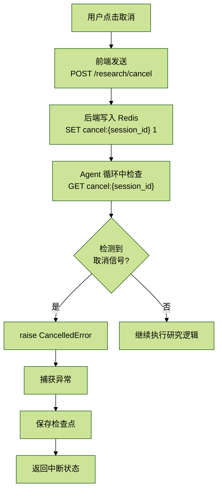
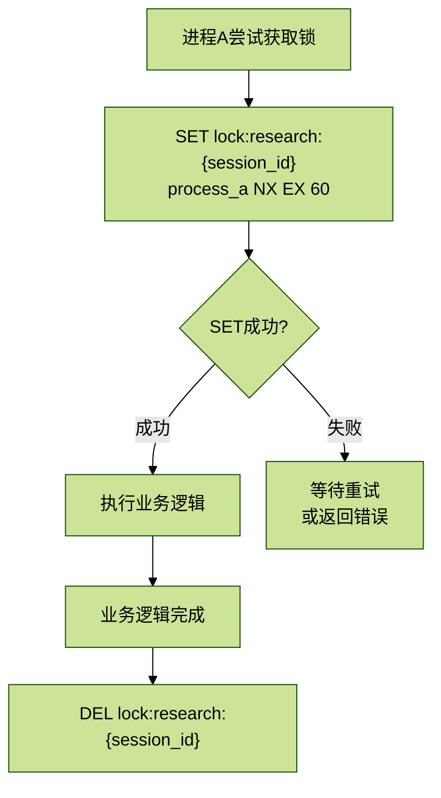
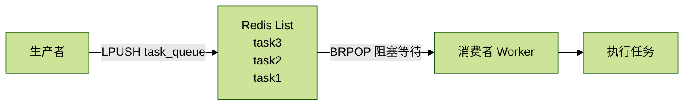
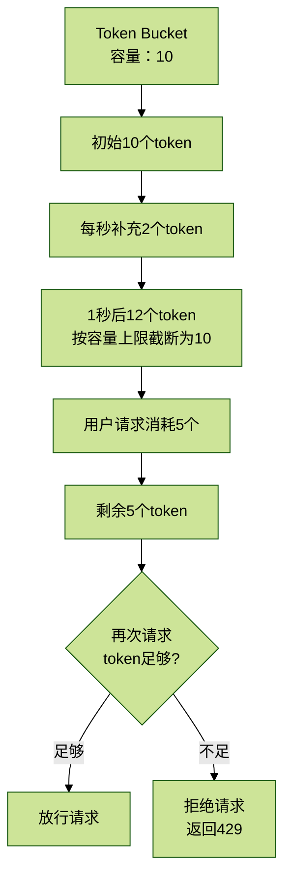

# 3.4 Redis应用场景

> 核心价值：高性能缓存、分布式锁、会话管理、限流，支撑系统的高并发和可靠性。

## 目录

- [1. 概述](#1-概述)
- [2. Redis部署与连接](#2-redis部署与连接)
  - [2.1 Docker配置](#21-docker配置)
  - [2.2 Python连接配置](#22-python连接配置)
- [3. 场景1：会话取消信号](#3-场景1会话取消信号)
  - [3.1 需求背景](#31-需求背景)
  - [3.2 实现原理](#32-实现原理)
  - [3.3 完整代码实现](#33-完整代码实现)
  - [3.4 使用Pub/Sub优化（可选）](#34-使用pubsub优化可选)
- [4. 场景2：分布式锁](#4-场景2分布式锁)
  - [4.1 需求背景](#41-需求背景)
  - [4.2 实现原理](#42-实现原理)
  - [4.3 完整代码实现](#43-完整代码实现)
  - [4.4 Redlock算法（高可用）](#44-redlock算法高可用)
- [5. 场景3：任务队列](#5-场景3任务队列)
  - [5.1 需求背景](#51-需求背景)
  - [5.2 实现原理](#52-实现原理)
  - [5.3 完整代码实现](#53-完整代码实现)
- [6. 场景4：限流（Token Bucket算法）](#6-场景4限流token-bucket算法)
  - [6.1 需求背景](#61-需求背景)
  - [6.2 Token Bucket算法原理](#62-token-bucket算法原理)
  - [6.3 完整代码实现](#63-完整代码实现)
- [7. RedisCache工具类](#7-rediscache工具类)
- [8. 性能优化与最佳实践](#8-性能优化与最佳实践)
- [9. 总结](#9-总结)

## 1. 概述

本项目使用 Redis 作为缓存和辅助存储，实现了 4 大核心场景：

- **场景1：会话取消信号**（研究中断）
- **场景2：分布式锁**（并发控制）
- **场景3：任务队列**（异步处理）
- **场景4：限流**（Token Bucket算法）

技术栈：

- Redis 7-alpine（约 10MB 镜像）
- redis-py 4.x（Python 客户端）
- 连接池管理（最大 20 连接）

## 2. Redis部署与连接

### 2.1 Docker配置

`docker-compose.yml` 片段：

```yaml
redis:
  image: redis:7-alpine
  container_name: industry_redis
  restart: unless-stopped
  command: redis-server --appendonly yes  # AOF持久化
  ports:
    - "6379:6379"
  volumes:
    - redis_data:/data
  healthcheck:
    test: ["CMD", "redis-cli", "ping"]
    interval: 10s
    timeout: 5s
    retries: 5
  networks:
    - industry_network
```

AOF持久化说明：

- `--appendonly yes`：启用AOF（Append Only File）
- 每次写操作追加到日志文件
- 重启时从日志恢复数据
- 文件路径：`/data/appendonly.aof`

### 2.2 Python连接配置

文件位置：`/backend/app/core/redis_client.py`

```python
"""Redis 客户端"""
import os
import json
from typing import Optional, Any
import redis

# 环境变量配置
REDIS_HOST = os.getenv("REDIS_HOST", "localhost")
REDIS_PORT = int(os.getenv("REDIS_PORT", "6379"))
REDIS_PASSWORD = os.getenv("REDIS_PASSWORD", "") or None

# 创建 Redis 连接池
redis_pool = redis.ConnectionPool(
    host=REDIS_HOST,
    port=REDIS_PORT,
    password=REDIS_PASSWORD,
    decode_responses=True,  # 自动解码为字符串
    max_connections=20      # 最大连接数
)


def get_redis_client() -> redis.Redis:
    """获取 Redis 客户端"""
    return redis.Redis(connection_pool=redis_pool)
```

连接池优势：

- 避免每次请求创建新连接
- 复用 TCP 连接，减少握手开销
- 线程安全

## 3. 场景1：会话取消信号

### 3.1 需求背景

在深度研究过程中，用户可能需要**中断当前研究**：

- 前端点击“取消”按钮
- 后端正在执行多智能体循环（可能运行数分钟）
- 需要立即停止所有 Agent

挑战：

- FastAPI 是异步框架，HTTP 请求已关闭
- Agent 运行在独立的异步任务中
- 如何传递取消信号？

解决方案：Redis 发布/订阅（Pub/Sub）

### 3.2 实现原理



```text
用户点击"取消"
    ↓
前端发送POST /research/cancel
    ↓
后端写入Redis: SET cancel:{session_id} "1"
    ↓
Agent循环中检查: GET cancel:{session_id}
    ↓
检测到取消信号 → raise CancelledError
    ↓
捕获异常 → 保存检查点 → 返回中断状态
```

### 3.3 完整代码实现

#### 3.3.1 设置取消信号

```python
from core.redis_client import get_redis_client


def set_cancel_signal(session_id: str, expire_seconds: int = 600):
    """
    设置研究会话的取消信号

    Args:
        session_id: 研究会话ID
        expire_seconds: 过期时间（秒），默认10分钟
    """
    redis_client = get_redis_client()
    key = f"cancel:{session_id}"
    redis_client.setex(key, expire_seconds, "1")
    print(f"[Redis] 设置取消信号: {key}")
```

#### 3.3.2 检查取消信号

```python
def check_cancel_signal(session_id: str) -> bool:
    """
    检查是否有取消信号

    Args:
        session_id: 研究会话ID

    Returns:
        True表示需要取消
    """
    redis_client = get_redis_client()
    key = f"cancel:{session_id}"
    result = redis_client.get(key)
    return result is not None
```

#### 3.3.3 清除取消信号

```python
def clear_cancel_signal(session_id: str):
    """清除取消信号"""
    redis_client = get_redis_client()
    key = f"cancel:{session_id}"
    redis_client.delete(key)
    print(f"[Redis] 清除取消信号: {key}")
```

#### 3.3.4 Agent中使用

```python
async def research_loop(state: ResearchState):
    """研究主循环"""
    session_id = state.get("session_id")

    for iteration in range(5):
        # 每次迭代开始时检查取消信号
        if check_cancel_signal(session_id):
            print(f"[研究] 检测到取消信号，中断研究")
            raise CancelledError("用户取消了研究")

        # 执行研究逻辑
        await planner_agent.invoke(state)
        await scout_agent.invoke(state)

        # 长时间操作中也定期检查
        for i in range(10):
            if check_cancel_signal(session_id):
                raise CancelledError("用户取消了研究")
            await asyncio.sleep(1)

    return state
```

#### 3.3.5 API端点

```python
from fastapi import APIRouter, HTTPException

router = APIRouter()


@router.post("/research/cancel")
async def cancel_research(session_id: str):
    """取消研究"""
    # 设置取消信号
    set_cancel_signal(session_id)

    # 更新检查点状态
    checkpoint_service.update_status(
        session_id=session_id,
        status="cancelled"
    )

    return {"success": True, "message": "已发送取消信号"}
```

### 3.4 使用Pub/Sub优化（可选）

Redis Pub/Sub模式：

```python
import threading


class CancelSignalListener:
    """取消信号监听器"""

    def __init__(self):
        self.redis_client = get_redis_client()
        self.pubsub = self.redis_client.pubsub()
        self.cancelled_sessions = set()

    def start_listening(self):
        """启动监听线程"""
        self.pubsub.subscribe('cancel_channel')
        thread = threading.Thread(target=self._listen, daemon=True)
        thread.start()

    def _listen(self):
        """监听消息"""
        for message in self.pubsub.listen():
            if message['type'] == 'message':
                session_id = message['data']
                self.cancelled_sessions.add(session_id)
                print(f"[Pub/Sub] 收到取消信号: {session_id}")

    def is_cancelled(self, session_id: str) -> bool:
        """检查是否已取消"""
        return session_id in self.cancelled_sessions

    def clear_cancel(self, session_id: str):
        """清除取消状态"""
        self.cancelled_sessions.discard(session_id)


# 发布取消信号
def publish_cancel_signal(session_id: str):
    redis_client = get_redis_client()
    redis_client.publish('cancel_channel', session_id)
```

## 4. 场景2：分布式锁

### 4.1 需求背景

并发冲突场景：

- 用户同时提交多个相同的研究请求
- 两个 Worker 同时处理同一个文档的向量化
- 多个进程同时更新检查点

解决方案：Redis 分布式锁

### 4.2 实现原理



```text
进程A尝试获取锁
    ↓
SET lock:research:{session_id} "process_a" NX EX 60
    ↓
成功 → 执行业务逻辑
失败 → 等待重试或返回错误
    ↓
业务逻辑完成 → DEL lock:research:{session_id}
```

关键命令：

- `SET key value NX EX seconds`
  - `NX`：Not Exist，仅当 key 不存在时设置
  - `EX seconds`：设置过期时间
- 原子操作，避免竞态条件

### 4.3 完整代码实现

#### 4.3.1 基础分布式锁

```python
import time
import uuid
from typing import Optional


class RedisLock:
    """Redis分布式锁"""

    def __init__(
        self,
        key: str,
        expire_seconds: int = 60,
        retry_times: int = 3,
        retry_delay: float = 0.1
    ):
        """
        Args:
            key: 锁的key
            expire_seconds: 过期时间（秒）
            retry_times: 重试次数
            retry_delay: 重试间隔（秒）
        """
        self.key = f"lock:{key}"
        self.expire_seconds = expire_seconds
        self.retry_times = retry_times
        self.retry_delay = retry_delay
        self.redis_client = get_redis_client()
        self.lock_value = str(uuid.uuid4())  # 唯一标识，防止误删

    def acquire(self) -> bool:
        """
        获取锁

        Returns:
            True表示获取成功
        """
        for _ in range(self.retry_times):
            # SET key value NX EX seconds
            result = self.redis_client.set(
                self.key,
                self.lock_value,
                nx=True,  # Only set if not exists
                ex=self.expire_seconds
            )
            if result:
                print(f"[锁] 获取成功: {self.key}")
                return True

            # 获取失败，等待后重试
            time.sleep(self.retry_delay)

        print(f"[锁] 获取失败: {self.key}")
        return False

    def release(self) -> bool:
        """
        释放锁（使用Lua脚本确保原子性）

        Returns:
            True表示释放成功
        """
        # Lua脚本：检查value是否匹配，匹配则删除
        lua_script = """
        if redis.call("get", KEYS[1]) == ARGV[1] then
            return redis.call("del", KEYS[1])
        else
            return 0
        end
        """
        result = self.redis_client.eval(lua_script, 1, self.key, self.lock_value)
        if result:
            print(f"[锁] 释放成功: {self.key}")
            return True
        else:
            print(f"[锁] 释放失败（可能已过期）: {self.key}")
            return False

    def __enter__(self):
        """上下文管理器：进入"""
        if not self.acquire():
            raise RuntimeError(f"Failed to acquire lock: {self.key}")
        return self

    def __exit__(self, exc_type, exc_val, exc_tb):
        """上下文管理器：退出"""
        self.release()
```

#### 4.3.2 使用示例

```python
# 方式1：手动获取和释放
lock = RedisLock(key="research:session_123", expire_seconds=60)
if lock.acquire():
    try:
        # 执行业务逻辑
        perform_research()
    finally:
        lock.release()
else:
    print("无法获取锁，可能有其他进程正在处理")

# 方式2：使用上下文管理器（推荐）
try:
    with RedisLock(key="research:session_123", expire_seconds=60):
        # 执行业务逻辑
        perform_research()
except RuntimeError as e:
    print(f"获取锁失败: {e}")
```

#### 4.3.3 实战应用：防止重复研究

你开了两个浏览器，问同一个问题。

```python
@router.post("/research/start")
async def start_research(query: str, session_id: str):
    """启动研究（防重复）"""
    lock_key = f"research:{session_id}"

    # 尝试获取锁
    lock = RedisLock(key=lock_key, expire_seconds=300)  # 5分钟
    if not lock.acquire():
        raise HTTPException(
            status_code=409,
            detail="该研究正在进行中，请勿重复提交"
        )

    try:
        # 执行研究
        result = await deep_research_service.run_research(query, session_id)
        return result
    finally:
        lock.release()
```

### 4.4 Redlock算法（高可用）

单节点 Redis 的问题：

- Redis 宕机 → 锁失效
- 主从切换 → 可能导致双重加锁

Redlock 解决方案：

- 使用多个独立 Redis 实例（至少 3 个）
- 在大多数节点上成功获取锁才算成功

```python
from redlock import Redlock

# 配置多个Redis节点
redlock_client = Redlock([
    {"host": "redis1", "port": 6379},
    {"host": "redis2", "port": 6379},
    {"host": "redis3", "port": 6379},
])

# 获取锁
lock = redlock_client.lock("resource_key", 10000)  # 10秒TTL
if lock:
    try:
        # 业务逻辑
        pass
    finally:
        redlock_client.unlock(lock)
```

## 5. 场景3：任务队列

### 5.1 需求背景

异步任务场景：

- 文档向量化（耗时操作）
- 资讯定时采集
- 邮件发送

解决方案：Redis List + Worker 模式

### 5.2 实现原理



```text
生产者                  Redis List                 消费者Worker
  |                         |                           |
  ├─ LPUSH task_queue ----> | task3                     |
  ├─ LPUSH task_queue ----> | task2     |<-- BRPOP -----|
  └─ LPUSH task_queue ----> | task1     |（阻塞等待）    |
                            |                           |
                            |                           ↓
                                                    执行任务
```

### 5.3 完整代码实现

#### 5.3.1 任务队列管理器

```python
import json
from enum import Enum


class TaskStatus(Enum):
    """任务状态"""
    PENDING = "pending"
    PROCESSING = "processing"
    COMPLETED = "completed"
    FAILED = "failed"


class TaskQueue:
    """Redis任务队列"""

    def __init__(self, queue_name: str = "task_queue"):
        self.queue_name = queue_name
        self.redis_client = get_redis_client()

    def push(self, task_data: dict) -> str:
        """
        添加任务到队列

        Args:
            task_data: 任务数据（字典）

        Returns:
            任务ID
        """
        task_id = str(uuid.uuid4())
        task = {
            "task_id": task_id,
            "status": TaskStatus.PENDING.value,
            "created_at": datetime.utcnow().isoformat(),
            **task_data
        }

        # 推送到队列
        self.redis_client.lpush(self.queue_name, json.dumps(task))

        # 保存任务状态
        self._save_task_status(task_id, task)

        print(f"[队列] 添加任务: {task_id}")
        return task_id

    def pop(self, timeout: int = 0) -> Optional[dict]:
        """
        从队列获取任务

        Args:
            timeout: 阻塞超时时间（秒），0表示永久阻塞

        Returns:
            任务字典，无任务则返回None
        """
        result = self.redis_client.brpop(self.queue_name, timeout=timeout)
        if result:
            _, task_json = result
            task = json.loads(task_json)
            task['status'] = TaskStatus.PROCESSING.value
            self._save_task_status(task['task_id'], task)
            return task
        return None

    def get_task_status(self, task_id: str) -> Optional[dict]:
        """获取任务状态"""
        key = f"task_status:{task_id}"
        task_json = self.redis_client.get(key)
        return json.loads(task_json) if task_json else None

    def update_task_status(
        self,
        task_id: str,
        status: TaskStatus,
        result: Optional[dict] = None
    ):
        """更新任务状态"""
        task = self.get_task_status(task_id)
        if task:
            task['status'] = status.value
            task['updated_at'] = datetime.utcnow().isoformat()
            if result:
                task['result'] = result
            self._save_task_status(task_id, task)

    def _save_task_status(self, task_id: str, task: dict):
        """保存任务状态（24小时过期）"""
        key = f"task_status:{task_id}"
        self.redis_client.setex(key, 86400, json.dumps(task))

    def get_queue_length(self) -> int:
        """获取队列长度"""
        return self.redis_client.llen(self.queue_name)
```

#### 5.3.2 Worker实现

```python
import time
import traceback


class TaskWorker:
    """任务Worker"""

    def __init__(self, queue_name: str = "task_queue"):
        self.queue = TaskQueue(queue_name)
        self.running = True

    def register_handler(self, task_type: str, handler: callable):
        """注册任务处理器"""
        self.handlers = getattr(self, 'handlers', {})
        self.handlers[task_type] = handler

    def start(self):
        """启动Worker"""
        print("[Worker] 启动，等待任务...")
        while self.running:
            try:
                # 阻塞等待任务（30秒超时）
                task = self.queue.pop(timeout=30)
                if task:
                    self._process_task(task)
            except KeyboardInterrupt:
                print("[Worker] 收到停止信号")
                self.running = False
            except Exception as e:
                print(f"[Worker] 错误: {e}")
                traceback.print_exc()
                time.sleep(1)

    def _process_task(self, task: dict):
        """处理任务"""
        task_id = task['task_id']
        task_type = task.get('type')

        print(f"[Worker] 处理任务: {task_id}, 类型: {task_type}")

        try:
            # 查找处理器
            handler = self.handlers.get(task_type)
            if not handler:
                raise ValueError(f"未知任务类型: {task_type}")

            # 执行处理器
            result = handler(task)

            # 更新状态为完成
            self.queue.update_task_status(
                task_id,
                TaskStatus.COMPLETED,
                result=result
            )
            print(f"[Worker] 任务完成: {task_id}")

        except Exception as e:
            print(f"[Worker] 任务失败: {task_id}, 错误: {e}")
            traceback.print_exc()

            # 更新状态为失败
            self.queue.update_task_status(
                task_id,
                TaskStatus.FAILED,
                result={"error": str(e)}
            )
```

#### 5.3.3 使用示例

```python
# 1. 定义任务处理器
def handle_vectorize_document(task: dict) -> dict:
    """文档向量化处理器"""
    doc_id = task['doc_id']
    kb_id = task['kb_id']

    # 执行向量化
    document = load_document(doc_id)
    chunks = split_document(document.content)
    vectors = [get_embedding(chunk) for chunk in chunks]

    # 存储到Milvus
    milvus_service.insert_documents(kb_id, ...)

    return {"doc_id": doc_id, "chunk_count": len(chunks)}


# 2. 启动Worker
worker = TaskWorker(queue_name="vectorize_queue")
worker.register_handler("vectorize_document", handle_vectorize_document)
worker.start()  # 阻塞运行


# 3. 生产者推送任务
queue = TaskQueue(queue_name="vectorize_queue")
task_id = queue.push({
    "type": "vectorize_document",
    "doc_id": "doc_123",
    "kb_id": "kb_456"
})


# 4. 查询任务状态
status = queue.get_task_status(task_id)
print(status['status'])  # processing / completed / failed
```

## 6. 场景4：限流（Token Bucket算法）

### 6.1 需求背景

API限流场景：

- 防止用户频繁调用昂贵的 API（LLM、搜索）
- 保护后端服务不被滥用
- 公平分配资源

解决方案：Token Bucket 算法

### 6.2 Token Bucket算法原理



```text
Token Bucket（容量：10）
┌─────────────────────────┐
│ ●●●●●●●●●●              │  初始10个token
└─────────────────────────┘
        ↓ 每秒补充2个token
┌─────────────────────────┐
│ ●●●●●●●●●●●●            │  1秒后12个token
└─────────────────────────┘
        ↓ 用户请求消耗5个
┌─────────────────────────┐
│ ●●●●●●●                 │  剩余7个token
└─────────────────────────┘
        ↓ 再次请求但token不足
```

核心参数：

- `capacity`：桶容量（最大 token 数）
- `refill_rate`：补充速率（token/秒）

### 6.3 完整代码实现

#### 6.3.1 Token Bucket限流器

```python
import time


class TokenBucketRateLimiter:
    """Token Bucket限流器"""

    def __init__(
        self,
        key: str,
        capacity: int = 10,
        refill_rate: float = 1.0
    ):
        """
        Args:
            key: 限流key（如user_id）
            capacity: 桶容量
            refill_rate: 补充速率（token/秒）
        """
        self.key = f"rate_limit:{key}"
        self.capacity = capacity
        self.refill_rate = refill_rate
        self.redis_client = get_redis_client()

    def allow_request(self, tokens: int = 1) -> bool:
        """
        检查是否允许请求

        Args:
            tokens: 消耗的token数

        Returns:
            True表示允许
        """
        now = time.time()

        # Lua脚本实现原子操作
        lua_script = """
        local key = KEYS[1]
        local capacity = tonumber(ARGV[1])
        local refill_rate = tonumber(ARGV[2])
        local tokens_requested = tonumber(ARGV[3])
        local now = tonumber(ARGV[4])

        -- 获取当前状态
        local bucket = redis.call('HMGET', key, 'tokens', 'last_refill')
        local tokens = tonumber(bucket[1])
        local last_refill = tonumber(bucket[2])

        -- 初始化
        if tokens == nil then
            tokens = capacity
            last_refill = now
        end

        -- 计算补充的token数
        local elapsed = now - last_refill
        local refill_amount = elapsed * refill_rate
        tokens = math.min(capacity, tokens + refill_amount)

        -- 检查是否有足够的token
        if tokens >= tokens_requested then
            tokens = tokens - tokens_requested
            -- 更新状态
            redis.call('HMSET', key, 'tokens', tokens, 'last_refill', now)
            redis.call('EXPIRE', key, 3600)  -- 1小时过期
            return 1
        else
            return 0
        end
        """

        result = self.redis_client.eval(
            lua_script,
            1,  # 1个key
            self.key,
            self.capacity,
            self.refill_rate,
            tokens,
            now
        )

        return bool(result)

    def get_remaining_tokens(self) -> float:
        """获取剩余token数"""
        bucket = self.redis_client.hmget(self.key, 'tokens', 'last_refill')
        if not bucket[0]:
            return self.capacity

        tokens = float(bucket[0])
        last_refill = float(bucket[1])
        now = time.time()

        # 计算当前token数
        elapsed = now - last_refill
        refill_amount = elapsed * self.refill_rate
        return min(self.capacity, tokens + refill_amount)
```

#### 6.3.2 FastAPI中间件

```python
from fastapi import Request, HTTPException
from starlette.middleware.base import BaseHTTPMiddleware


class RateLimitMiddleware(BaseHTTPMiddleware):
    """限流中间件"""

    async def dispatch(self, request: Request, call_next):
        # 提取用户标识（这里简化为IP）
        user_id = request.client.host

        # 某些路径需要限流
        if request.url.path.startswith("/api/research"):
            limiter = TokenBucketRateLimiter(
                key=f"user:{user_id}",
                capacity=10,
                refill_rate=0.5  # 每2秒补充1个token
            )

            if not limiter.allow_request(tokens=1):
                remaining = limiter.get_remaining_tokens()
                raise HTTPException(
                    status_code=429,
                    detail=f"请求过于频繁，请稍后再试。剩余token: {remaining:.2f}"
                )

        response = await call_next(request)
        return response


# 添加到FastAPI应用
app.add_middleware(RateLimitMiddleware)
```

#### 6.3.3 装饰器方式

```python
from functools import wraps


def rate_limit(capacity: int = 10, refill_rate: float = 1.0):
    """限流装饰器"""
    def decorator(func):
        @wraps(func)
        async def wrapper(*args, **kwargs):
            # 从请求中获取用户ID
            request = kwargs.get('request')
            user_id = request.state.user.id if hasattr(request.state, 'user') else request.client.host

            limiter = TokenBucketRateLimiter(
                key=f"user:{user_id}:{func.__name__}",
                capacity=capacity,
                refill_rate=refill_rate
            )

            if not limiter.allow_request():
                raise HTTPException(status_code=429, detail="请求过于频繁")

            return await func(*args, **kwargs)
        return wrapper
    return decorator


# 使用
@router.post("/research/start")
@rate_limit(capacity=5, refill_rate=0.1)  # 5次/50秒
async def start_research(query: str, request: Request):
    return await deep_research_service.run_research(query)
```

## 7. RedisCache工具类

文件位置：`/backend/app/core/redis_client.py`（第26-102行）

```python
class RedisCache:
    """Redis 缓存工具类"""

    def __init__(self):
        self.client = get_redis_client()

    def get(self, key: str) -> Optional[Any]:
        """获取缓存"""
        try:
            value = self.client.get(key)
            if value:
                return json.loads(value)
            return None
        except Exception as e:
            print(f"Redis get error: {e}")
            return None

    def set(self, key: str, value: Any, expire: int = 3600) -> bool:
        """设置缓存，默认过期时间 1 小时"""
        try:
            self.client.setex(key, expire, json.dumps(value, ensure_ascii=False))
            return True
        except Exception as e:
            print(f"Redis set error: {e}")
            return False

    def delete(self, key: str) -> bool:
        """删除缓存"""
        try:
            self.client.delete(key)
            return True
        except Exception as e:
            print(f"Redis delete error: {e}")
            return False

    def exists(self, key: str) -> bool:
        """检查 key 是否存在"""
        try:
            return bool(self.client.exists(key))
        except Exception as e:
            print(f"Redis exists error: {e}")
            return False

    def set_session(self, session_id: str, data: dict, expire: int = 86400) -> bool:
        """设置会话数据，默认过期时间 24 小时"""
        key = f"session:{session_id}"
        return self.set(key, data, expire)

    def get_session(self, session_id: str) -> Optional[dict]:
        """获取会话数据"""
        key = f"session:{session_id}"
        return self.get(key)

    def delete_session(self, session_id: str) -> bool:
        """删除会话"""
        key = f"session:{session_id}"
        return self.delete(key)

    def add_to_list(self, key: str, value: Any, max_length: int = 100) -> bool:
        """添加到列表（用于短期记忆）"""
        try:
            self.client.lpush(key, json.dumps(value, ensure_ascii=False))
            self.client.ltrim(key, 0, max_length - 1)
            return True
        except Exception as e:
            print(f"Redis add_to_list error: {e}")
            return False

    def get_list(self, key: str, start: int = 0, end: int = -1) -> list:
        """获取列表"""
        try:
            items = self.client.lrange(key, start, end)
            return [json.loads(item) for item in items]
        except Exception as e:
            print(f"Redis get_list error: {e}")
            return []


# 全局缓存实例
cache = RedisCache()
```

使用示例：

```python
from core.redis_client import cache

# 缓存研究结果
cache.set("research:session_123", {"status": "completed", "result": "..."}, expire=3600)

# 获取缓存
result = cache.get("research:session_123")

# 会话管理
cache.set_session("user_456", {"user_id": "456", "name": "张三"})
session_data = cache.get_session("user_456")

# 短期记忆（最近10条消息）
cache.add_to_list("chat:messages:session_123", {"role": "user", "content": "..."}, max_length=10)
messages = cache.get_list("chat:messages:session_123")
```

## 8. 性能优化与最佳实践

### 8.1 Pipeline批量操作

```python
def batch_set_cache(items: dict):
    """批量设置缓存"""
    redis_client = get_redis_client()
    pipe = redis_client.pipeline()

    for key, value in items.items():
        pipe.setex(key, 3600, json.dumps(value))

    pipe.execute()  # 一次性提交所有命令
```

### 8.2 Lua脚本原子操作

```python
def atomic_incr_with_limit(key: str, max_value: int = 100) -> int:
    """原子递增（带上限）"""
    lua_script = """
    local current = redis.call('GET', KEYS[1])
    current = tonumber(current) or 0

    if current < tonumber(ARGV[1]) then
        return redis.call('INCR', KEYS[1])
    else
        return current
    end
    """
    redis_client = get_redis_client()
    result = redis_client.eval(lua_script, 1, key, max_value)
    return int(result)
```

### 8.3 连接池监控

```python
def get_pool_info():
    """获取连接池信息"""
    pool = redis_pool
    return {
        "max_connections": pool.max_connections,
        "connection_kwargs": pool.connection_kwargs,
        "pid": pool.pid
    }
```

## 9. 总结

本章深入讲解了 Redis 的 4 大应用场景：

1. **会话取消信号**：SET/GET + 定期检查
2. **分布式锁**：SET NX EX + Lua脚本
3. **任务队列**：LPUSH/BRPOP + Worker
4. **限流**：Token Bucket + Lua脚本

关键文件：

- `/backend/app/core/redis_client.py`：Redis客户端和工具类

下一章预告：3.5 Text2SQL服务实现，讲解 Schema 感知、Prompt 设计、SQL 安全检查。
