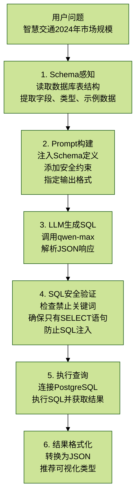

# 3.5 Text2SQL服务实现

> 核心价值：自然语言转 SQL 查询，让用户用人类语言查询结构化数据。

## 目录

- [1. 服务架构](#1-服务架构)
  - [1.1 核心流程](#11-核心流程)
- [2. Schema感知机制](#2-schema感知机制)
  - [2.1 Schema定义](#21-schema定义)
- [3. Prompt设计](#3-prompt设计)
  - [3.1 Prompt模板](#31-prompt模板)
  - [3.2 Prompt设计技巧](#32-prompt设计技巧)
- [4. SQL安全检查](#4-sql安全检查)
  - [4.1 安全配置](#41-安全配置)
  - [4.2 验证逻辑](#42-验证逻辑)
  - [4.3 SQL注入防护](#43-sql注入防护)
- [5. LLM调用与JSON解析](#5-llm调用与json解析)
  - [5.1 LLM调用](#51-llm调用)
  - [5.2 JSON提取逻辑](#52-json提取逻辑)
- [6. 查询执行与结果格式化](#6-查询执行与结果格式化)
  - [6.1 SQL执行](#61-sql执行)
  - [6.2 模拟数据（演示模式）](#62-模拟数据演示模式)
  - [6.3 主查询接口](#63-主查询接口)
- [7. API接口使用](#7-api接口使用)
- [8. 优化与扩展](#8-优化与扩展)

文件位置：`/backend/app/service/text2sql_service.py`（524行）

## 1. 服务架构

### 1.1 核心流程



```text
用户问题："智慧交通2024年市场规模"
    ↓
┌────────────────────────────────────┐
│ 1. Schema感知                       │
│    - 读取数据库表结构                │
│    - 提取字段、类型、示例数据         │
└────────────────────────────────────┘
    ↓
┌────────────────────────────────────┐
│ 2. Prompt构建                       │
│    - 注入Schema定义                  │
│    - 添加安全约束                    │
│    - 指定输出格式                    │
└────────────────────────────────────┘
    ↓
┌────────────────────────────────────┐
│ 3. LLM生成SQL                       │
│    - 调用qwen-max                   │
│    - 解析JSON响应                    │
└────────────────────────────────────┘
    ↓
┌────────────────────────────────────┐
│ 4. SQL安全验证                      │
│    - 检查禁止关键词（DROP等）          │
│    - 确保只有SELECT语句              │
│    - 防止SQL注入                     │
└────────────────────────────────────┘
    ↓
┌────────────────────────────────────┐
│ 5. 执行查询                         │
│    - 连接PostgreSQL                  │
│    - 执行SQL并获取结果                │
└────────────────────────────────────┘
    ↓
┌────────────────────────────────────┐
│ 6. 结果格式化                       │
│    - 转换为JSON                      │
│    - 推荐可视化类型                  │
└────────────────────────────────────┘
```

## 2. Schema感知机制

### 2.1 Schema定义

文件位置：`/backend/app/service/text2sql_service.py`（第76-129行）

```python
SCHEMA_DEFINITION = """
可查询的数据表：

1. industry_stats（行业统计数据表）
   - id: UUID, 主键
   - industry_name: VARCHAR(100), 行业名称（当前数据：智慧交通）
   - metric_name: VARCHAR(100), 指标名称（如：市场规模、同比增长率、智能公交市场规模、智慧高速市场规模、车路协同市场规模、智慧停车市场规模、交通大脑市场规模、固定资产投资、研发投入、从业人员数量、企业数量、专利申请数、营收）
   - metric_value: FLOAT, 指标值
   - unit: VARCHAR(50), 单位（如：亿元、%、万人、家、件）
   - year: INTEGER, 年份（2023-2025）
   - quarter: INTEGER, 季度（1-4，可为空表示年度数据）
   - month: INTEGER, 月份（1-12，可为空）
   - region: VARCHAR(50), 地区（如：全国、华东地区、华南地区、华北地区）
   - source: VARCHAR(200), 数据来源
   - created_at: TIMESTAMP, 创建时间

2. company_data（企业数据表）
   - id: UUID, 主键
   - company_name: VARCHAR(200), 企业名称（如：海康威视、大华股份、千方科技、易华录、银江技术、金溢科技、万集科技、皖通科技、中远海科、四维图新、蘑菇车联、希迪智驾）
   - stock_code: VARCHAR(20), 股票代码（如：002415.SZ、002236.SZ，未上市）
   - industry: VARCHAR(100), 所属行业（当前数据：智慧交通）
   - sub_industry: VARCHAR(100), 细分行业（如：智能监控、交通信息化、数据存储、智慧城市、ETC、高速公路信息化、港口信息化、高精地图、车路协同、自动驾驶）
   - revenue: FLOAT, 营收（亿元）
   - net_profit: FLOAT, 净利润（亿元）
   - gross_margin: FLOAT, 毛利率（%）
   - market_cap: FLOAT, 市值（亿元）
   - employees: INTEGER, 员工数
   - market_share: FLOAT, 市场份额（%）
   - year: INTEGER, 年份
   - quarter: INTEGER, 季度

3. policy_data（政策数据表）
   - id: UUID, 主键
   - policy_name: VARCHAR(500), 政策名称（如：交通强国建设纲要、智能汽车创新发展战略、数字交通发展规划纲要、北京市自动驾驶汽车条例）
   - policy_number: VARCHAR(100), 政策文号
   - department: VARCHAR(200), 发布部门（如：中共中央、国务院、交通运输部、工业和信息化部、住建部）
   - level: VARCHAR(50), 政策级别（国家级/省级/市级）
   - publish_date: DATE, 发布日期
   - effective_date: DATE, 生效日期
   - category: VARCHAR(100), 政策类别（如：发展规划、发展战略、技术规范、指导意见、实施方案、试点通知、行动计划、地方法规）
   - industry: VARCHAR(100), 相关行业（当前数据：智慧交通）
   - summary: TEXT, 政策摘要
   - impact_level: VARCHAR(20), 影响程度（重大/一般/轻微）

当前数据库示例数据：
- 智慧交通2024年市场规模：3200亿元
- 智慧交通2025年市场规模预测：3680亿元
- 智慧交通2024年同比增长率：12.3%
- 海康威视2024年Q3营收：893.5亿元，市场份额15.2%
- 大华股份2024年Q3营收：328.6亿元
- 千方科技2024年Q3营收：85.2亿元
- 智慧高速市场规模2024年：720亿元
- 车路协同市场规模2024年：450亿元
"""
```

## 3. Prompt设计

### 3.1 Prompt模板

文件位置：`/backend/app/service/text2sql_service.py`（第131-164行）

```python
TEXT2SQL_PROMPT = """你是一个专业的 SQL 专家。请根据用户的自然语言问题生成安全的 PostgreSQL 查询语句。

{schema}

用户问题：{question}
查询意图：{intent}

生成要求：
1. 只生成 SELECT 查询，禁止任何修改操作（UPDATE/DELETE/INSERT/DROP等）
2. 使用标准 PostgreSQL 语法
3. 结果限制在 100 条以内
4. 合理使用聚合函数和 GROUP BY
5. 对于趋势分析，使用 ORDER BY year, quarter
6. 对于对比分析，确保数据可比较

请严格按照以下 JSON 格式返回：
{
    "sql": "生成的SQL语句",
    "explanation": "SQL查询的解释说明",
    "expected_columns": ["列名1", "列名2"],
    "visualization_hint": "推荐的可视化类型（line/bar/pie/table/none）",
    "confidence": 0.95
}

注意：
- 如果问题无法转换为有效SQL，返回 sql 为空字符串并在 explanation 中说明原因
- visualization_hint 选择依据：
  - line: 时间序列/趋势数据
  - bar: 分类比较数据
  - pie: 占比/构成数据
  - table: 详细列表数据
  - none: 单一数值或无法可视化
"""
```

Prompt位置标注（第131-164行）：

- 不输出完整Prompt内容，仅标注位置
- 实际讲解时突出关键设计思路

### 3.2 Prompt设计技巧

1. **角色定义**

```text
你是一个专业的 SQL 专家
```

让 LLM 进入 “SQL 专家” 模式。

2. **安全约束**

```text
只生成 SELECT 查询，禁止任何修改操作
```

明确禁止破坏性操作。

3. **输出格式**

```json
{
  "sql": "...",
  "explanation": "...",
  "visualization_hint": "line"
}
```

结构化输出，方便解析。

4. **Few-shot示例（可选）**

```text
示例1：
问题："智慧交通2024年市场规模"
SQL: SELECT metric_value, unit FROM industry_stats WHERE industry_name='智慧交通' AND year=2024 AND metric_name='市场规模'
```

## 4. SQL安全检查

### 4.1 安全配置

文件位置：`/backend/app/service/text2sql_service.py`（第54-73行）

```python
# 允许的关键词（白名单）
ALLOWED_KEYWORDS = [
    'SELECT', 'FROM', 'WHERE', 'GROUP BY', 'ORDER BY', 'LIMIT',
    'JOIN', 'LEFT JOIN', 'RIGHT JOIN', 'INNER JOIN', 'ON',
    'AND', 'OR', 'NOT', 'IN', 'LIKE', 'BETWEEN',
    'AS', 'DISTINCT', 'HAVING', 'UNION',
    'COUNT', 'SUM', 'AVG', 'MAX', 'MIN',
    'YEAR', 'MONTH', 'DATE', 'CAST', 'COALESCE',
    'ASC', 'DESC', 'NULLS', 'FIRST', 'LAST',
    'CASE', 'WHEN', 'THEN', 'ELSE', 'END',
    'IS', 'NULL', 'TRUE', 'FALSE'
]

# 禁止的关键词（黑名单）
FORBIDDEN_KEYWORDS = [
    'DROP', 'DELETE', 'UPDATE', 'INSERT', 'TRUNCATE',
    'ALTER', 'CREATE', 'GRANT', 'REVOKE',
    'EXEC', 'EXECUTE', 'XP_', 'SP_',
    '--', '/*', '*/', ';', 'UNION ALL SELECT',
    'INFORMATION_SCHEMA', 'SYS.', 'SYSOBJECTS',
    'WAITFOR', 'DELAY', 'BENCHMARK', 'SLEEP'
]
```

### 4.2 验证逻辑

文件位置：`/backend/app/service/text2sql_service.py`（第207-239行）

```python
def validate_sql(self, sql: str) -> Tuple[bool, str]:
    """
    验证 SQL 安全性

    Args:
        sql: SQL 语句

    Returns:
        (是否安全, 错误信息)
    """
    if not sql or not sql.strip():
        return False, "SQL 语句为空"

    sql_upper = sql.upper().strip()

    # 检查禁止关键词
    for keyword in self.FORBIDDEN_KEYWORDS:
        if keyword in sql_upper:
            return False, f"SQL 包含禁止的关键词: {keyword}"

    # 检查是否以 SELECT 开头
    if not sql_upper.startswith('SELECT'):
        return False, "SQL 必须以 SELECT 开头"

    # 检查是否包含多条语句
    if ';' in sql[:-1]:  # 允许末尾的分号
        return False, "不允许多条 SQL 语句"

    # 检查注释
    if '--' in sql or '/*' in sql:
        return False, "SQL 中不允许注释"

    return True, ""
```

### 4.3 SQL注入防护

常见注入攻击：

```sql
-- 攻击1：绕过WHERE条件
SELECT * FROM users WHERE username='admin' OR '1'='1'

-- 攻击2：联合查询窃取数据
SELECT * FROM industry_stats UNION ALL SELECT * FROM users

-- 攻击3：时间盲注
SELECT * FROM industry_stats WHERE year=2024 AND SLEEP(5)
```

防护措施：

```python
# 1. 参数化查询（推荐）
from sqlalchemy import text

sql = "SELECT * FROM industry_stats WHERE year = :year"
result = conn.execute(text(sql), {"year": 2024})

# 2. 输入验证（本项目使用）
if "UNION" in sql_upper or "SLEEP" in sql_upper:
    return False, "包含禁止的关键词"
```

## 5. LLM调用与JSON解析

### 5.1 LLM调用

文件位置：`/backend/app/service/text2sql_service.py`（第285-360行）

```python
async def generate_sql(self, question: str, intent: str = "stats") -> Dict[str, Any]:
    """
    使用 LLM 生成 SQL

    Args:
        question: 自然语言问题
        intent: 查询意图

    Returns:
        生成结果
    """
    prompt = self.TEXT2SQL_PROMPT.format(
        schema=self.SCHEMA_DEFINITION,
        question=question,
        intent=intent
    )

    try:
        response = self.client.chat.completions.create(
            model=self.model,  # qwen-max
            messages=[
                {"role": "system", "content": "你是一个专业的 SQL 专家，擅长将自然语言转换为安全的 SQL 查询。请只返回 JSON 格式的响应，不要添加任何额外文字。"},
                {"role": "user", "content": prompt}
            ],
            temperature=0.1  # 低温度确保输出稳定
        )

        content = response.choices[0].message.content
        logging.info(f"LLM response: {content[:500] if content else 'None'}...")

        if not content:
            return {
                "sql": "",
                "explanation": "LLM 返回空响应",
                "expected_columns": [],
                "visualization_hint": "none",
                "confidence": 0.0
            }

        result = self._extract_json_from_response(content)

        return {
            "sql": result.get("sql", ""),
            "explanation": result.get("explanation", ""),
            "expected_columns": result.get("expected_columns", []),
            "visualization_hint": result.get("visualization_hint", "table"),
            "confidence": result.get("confidence", 0.5)
        }

    except Exception as e:
        logging.error(f"Error generating SQL: {e}")
        return {
            "sql": "",
            "explanation": f"生成 SQL 失败: {e}",
            "expected_columns": [],
            "visualization_hint": "none",
            "confidence": 0.0
        }
```

### 5.2 JSON提取逻辑

文件位置：`/backend/app/service/text2sql_service.py`（第241-283行）

```python
def _extract_json_from_response(self, content: str) -> Dict[str, Any]:
    """
    从 LLM 响应中提取 JSON

    支持多种格式：
    1. 纯 JSON
    2. Markdown 代码块中的 JSON
    3. 文本中包含的 JSON

    Args:
        content: LLM 响应内容

    Returns:
        解析后的 JSON 字典
    """
    if not content:
        raise ValueError("响应内容为空")

    content = content.strip()

    # 尝试直接解析
    try:
        return json.loads(content)
    except json.JSONDecodeError:
        pass

    # 尝试从 markdown 代码块中提取
    code_block_match = re.search(r'`{3}(?:json)?\s*\n?([\s\S]*?)\n?`{3}', content)
    if code_block_match:
        try:
            return json.loads(code_block_match.group(1).strip())
        except json.JSONDecodeError:
            pass

    # 尝试找到 JSON 对象
    json_match = re.search(r'\{[\s\S]*\}', content)
    if json_match:
        try:
            return json.loads(json_match.group(0))
        except json.JSONDecodeError:
            pass

    raise ValueError(f"无法从响应中提取有效的 JSON: {content[:200]}...")
```

## 6. 查询执行与结果格式化

### 6.1 SQL执行

文件位置：`/backend/app/service/text2sql_service.py`（第362-390行）

```python
def execute_sql(self, sql: str) -> Tuple[List[Dict], List[str], Optional[str]]:
    """
    安全执行 SQL 查询

    Args:
        sql: SQL 语句

    Returns:
        (数据列表, 列名列表, 错误信息)
    """
    # 验证 SQL
    is_valid, error_msg = self.validate_sql(sql)
    if not is_valid:
        return [], [], error_msg

    if not self.db_engine:
        # 返回模拟数据用于演示
        return self._get_mock_data(sql)

    try:
        from sqlalchemy import text
        with self.db_engine.connect() as conn:
            result = conn.execute(text(sql))
            columns = list(result.keys())
            data = [dict(zip(columns, row)) for row in result.fetchall()]
            return data, columns, None
    except Exception as e:
        logging.error(f"SQL execution error: {e}")
        return [], [], str(e)
```

### 6.2 模拟数据（演示模式）

文件位置：`/backend/app/service/text2sql_service.py`（第392-448行）

```python
def _get_mock_data(self, sql: str) -> Tuple[List[Dict], List[str], Optional[str]]:
    """
    返回模拟数据（用于演示和测试）

    Args:
        sql: SQL 语句

    Returns:
        (数据列表, 列名列表, 错误信息)
    """
    sql_lower = sql.lower()

    # 根据 SQL 内容返回不同的模拟数据
    if 'industry_stats' in sql_lower:
        if 'year' in sql_lower and ('group by' in sql_lower or 'order by' in sql_lower):
            # 时间序列数据
            data = [
                {"year": 2020, "metric_value": 136.7, "industry_name": "新能源汽车", "unit": "万辆"},
                {"year": 2021, "metric_value": 352.1, "industry_name": "新能源汽车", "unit": "万辆"},
                {"year": 2022, "metric_value": 688.7, "industry_name": "新能源汽车", "unit": "万辆"},
                {"year": 2023, "metric_value": 949.5, "industry_name": "新能源汽车", "unit": "万辆"},
                {"year": 2024, "metric_value": 1200.0, "industry_name": "新能源汽车", "unit": "万辆"},
            ]
            columns = ["year", "metric_value", "industry_name", "unit"]
        else:
            data = [
                {"industry_name": "新能源汽车", "metric_name": "销量", "metric_value": 949.5, "unit": "万辆", "year": 2023},
                {"industry_name": "新能源汽车", "metric_name": "市场渗透率", "metric_value": 35.8, "unit": "%", "year": 2023},
            ]
            columns = ["industry_name", "metric_name", "metric_value", "unit", "year"]

    elif 'company_data' in sql_lower:
        data = [
            {"company_name": "比亚迪", "industry": "新能源汽车", "revenue": 6023.15, "net_profit": 300.41, "market_share": 35.0, "year": 2023},
            {"company_name": "特斯拉中国", "industry": "新能源汽车", "revenue": 2100.0, "market_share": 15.5, "year": 2023},
        ]
        columns = ["company_name", "industry", "revenue", "net_profit", "market_share", "year"]

    else:
        data = [{"message": "模拟数据", "value": 100}]
        columns = ["message", "value"]

    return data, columns, None
```

### 6.3 主查询接口

文件位置：`/backend/app/service/text2sql_service.py`（第450-509行）

```python
async def query(self, question: str, intent: str = "stats") -> Dict[str, Any]:
    """
    执行 Text2SQL 查询的主入口

    Args:
        question: 自然语言问题
        intent: 查询意图

    Returns:
        查询结果
    """
    # 1. 生成 SQL
    generation_result = await self.generate_sql(question, intent)

    sql = generation_result.get("sql", "")
    if not sql:
        return {
            "success": False,
            "error": generation_result.get("explanation", "无法生成有效的 SQL"),
            "sql": "",
            "data": [],
            "columns": [],
            "visualization_hint": "none"
        }

    # 2. 验证 SQL
    is_valid, error_msg = self.validate_sql(sql)
    if not is_valid:
        return {
            "success": False,
            "error": f"SQL 验证失败: {error_msg}",
            "sql": sql,
            "data": [],
            "columns": [],
            "visualization_hint": "none"
        }

    # 3. 执行查询
    data, columns, exec_error = self.execute_sql(sql)
    if exec_error:
        return {
            "success": False,
            "error": f"查询执行失败: {exec_error}",
            "sql": sql,
            "data": [],
            "columns": columns,
            "visualization_hint": "none"
        }

    # 4. 返回结果
    return {
        "success": True,
        "sql": sql,
        "explanation": generation_result.get("explanation", ""),
        "data": data,
        "columns": columns,
        "visualization_hint": generation_result.get("visualization_hint", "table"),
        "confidence": generation_result.get("confidence", 0.5),
        "row_count": len(data)
    }
```

## 7. API接口使用

### 7.1 FastAPI路由

```python
from fastapi import APIRouter, Depends
from service.text2sql_service import create_text2sql_service

router = APIRouter()


@router.post("/text2sql/query")
async def text2sql_query(question: str, intent: str = "stats"):
    """Text2SQL查询接口"""
    service = create_text2sql_service(
        llm_api_key=os.getenv("DASHSCOPE_API_KEY"),
        llm_base_url="https://dashscope.aliyuncs.com/compatible-mode/v1",
        db_connection_string=DATABASE_URL
    )

    result = await service.query(question, intent)
    return result
```

### 7.2 前端调用示例

```javascript
// API调用
const response = await fetch('/api/text2sql/query', {
  method: 'POST',
  headers: { 'Content-Type': 'application/json' },
  body: JSON.stringify({
    question: '智慧交通2024年市场规模',
    intent: 'stats'
  })
});

const result = await response.json();

if (result.success) {
  console.log('SQL:', result.sql);
  console.log('数据:', result.data);
  console.log('建议图表:', result.visualization_hint);

  // 根据visualization_hint渲染图表
  if (result.visualization_hint === 'line') {
    renderLineChart(result.data);
  } else if (result.visualization_hint === 'bar') {
    renderBarChart(result.data);
  } else {
    renderTable(result.data);
  }
}
```

## 8. 优化与扩展

### 8.1 SQL缓存

```python
from functools import lru_cache


@lru_cache(maxsize=100)
def get_cached_sql(question: str) -> str:
    """缓存相同问题的SQL"""
    # 第一次调用LLM生成，后续直接返回
    pass
```

### 8.2 多表JOIN优化

```sql
-- 在Prompt中添加JOIN示例
-- 示例：查询海康威视2024年营收和市场占比
SELECT
    c.company_name,
    c.revenue,
    c.market_share,
    s.metric_value as industry_total
FROM company_data c
LEFT JOIN industry_stats s
    ON s.year = c.year
    AND s.metric_name = '市场规模'
WHERE c.company_name = '海康威视'
    AND c.year = 2024
```

### 8.3 错误重试机制

```python
async def query_with_retry(question: str, max_retries: int = 3):
    """带重试的查询"""
    for attempt in range(max_retries):
        result = await text2sql_service.query(question)
        if result['success']:
            return result

        # 如果SQL验证失败，让LLM重新生成
        if 'SQL 验证失败' in result.get('error', ''):
            continue

        break

    return result
```

下一章预告：3.6 定时任务调度系统，讲解 APScheduler 集成和资讯采集服务。
