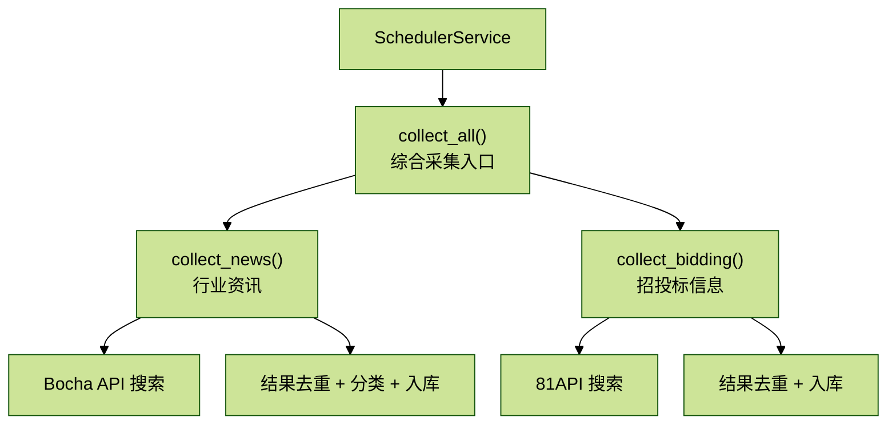

# Agent_拓业智询_3.6 定时任务调度系统

> 核心价值：自动化资讯采集，每天 12 点定时更新行业动态和招投标信息。

## 目录

1. APScheduler 集成
2. 资讯采集服务
3. FastAPI 生命周期管理
4. Cron 表达式配置
5. 任务监控与管理
6. 错误处理与重试
7. 性能优化

## 概述

本项目使用 APScheduler 实现定时任务调度，核心功能包括：

- 每日定时采集：中午 12 点自动采集行业资讯和招投标信息
- 初始化检查：启动时检测数据库是否为空，空则立即采集
- FastAPI 生命周期集成：随应用启动/停止
- 任务状态管理：记录采集历史和错误信息

关键文件：

- `/backend/app/service/scheduler_service.py`：调度器服务
- `/backend/app/service/news_collection_service.py`：资讯采集服务

## 1 APScheduler 集成

### 1.1 安装依赖

```bash
pip install apscheduler
```

### 1.2 调度器服务实现

文件位置：`/backend/app/service/scheduler_service.py`（第 1-133 行）

```python
"""
定时任务调度服务
- 每天12点自动采集行业资讯和招投标信息
"""

import asyncio
import logging
from datetime import datetime, time
from typing import Optional
from apscheduler.schedulers.asyncio import AsyncIOScheduler
from apscheduler.triggers.cron import CronTrigger
from sqlalchemy.orm import Session

from core.database import SessionLocal
from service.news_collection_service import NewsCollectionService

logger = logging.getLogger(__name__)

class SchedulerService:
    """定时任务调度服务"""

    _instance: Optional['SchedulerService'] = None
    _scheduler: Optional[AsyncIOScheduler] = None

    def __new__(cls):
        """单例模式"""
        if cls._instance is None:
            cls._instance = super().__new__(cls)
        return cls._instance

    def __init__(self):
        if self._scheduler is None:
            self._scheduler = AsyncIOScheduler()

    def start(self):
        """启动调度器"""
        if not self._scheduler.running:
            # 添加每日12点执行的任务
            self._scheduler.add_job(
                self._daily_collection_task,
                CronTrigger(hour=12, minute=0),
                id="daily_news_collection",
                name="每日资讯采集",
                replace_existing=True
            )

            self._scheduler.start()
            logger.info("定时任务调度器已启动")
            logger.info("已添加每日12:00资讯采集任务")

    def stop(self):
        """停止调度器"""
        if self._scheduler and self._scheduler.running:
            self._scheduler.shutdown()
            logger.info("定时任务调度器已停止")

    async def _daily_collection_task(self):
        """每日采集任务"""
        logger.info(f"开始执行每日资讯采集任务 - {datetime.now()}")

        db = SessionLocal()
        try:
            service = NewsCollectionService(db)
            result = await service.collect_all(max_news=20, max_bidding=20)

            logger.info(f"每日资讯采集完成: {result}")
        except Exception as e:
            logger.error(f"每日资讯采集失败: {e}")
        finally:
            db.close()

    async def run_collection_now(self, db: Session) -> dict:
        """立即执行采集任务"""
        logger.info(f"手动触发资讯采集任务 - {datetime.now()}")

        try:
            service = NewsCollectionService(db)
            result = await service.collect_all(max_news=20, max_bidding=20)
            logger.info(f"手动采集完成: {result}")
            return result
        except Exception as e:
            logger.error(f"手动采集失败: {e}")
            return {"success": False, "error": str(e)}

    def get_jobs_info(self) -> list:
        """获取所有任务信息"""
        jobs = []
        if self._scheduler:
            for job in self._scheduler.get_jobs():
                jobs.append({
                    "id": job.id,
                    "name": job.name,
                    "next_run_time": str(job.next_run_time) if job.next_run_time else None,
                    "trigger": str(job.trigger)
                })
        return jobs

# 全局调度器实例
_scheduler_service: Optional[SchedulerService] = None

def get_scheduler_service() -> SchedulerService:
    """获取调度器服务单例"""
    global _scheduler_service
    if _scheduler_service is None:
        _scheduler_service = SchedulerService()
    return _scheduler_service
```

```python
async def init_scheduler_and_check_data():
    """
    初始化调度器并检查数据
    - 启动定时任务
    - 如果数据库没有数据则立即采集
    """
    scheduler = get_scheduler_service()
    scheduler.start()

    # 检查是否需要初始化数据
    db = SessionLocal()
    try:
        service = NewsCollectionService(db)
        if not service.has_data():
            logger.info("数据库中没有资讯数据，开始初始采集...")
            result = await scheduler.run_collection_now(db)
            logger.info(f"初始采集结果: {result}")
        else:
            logger.info("数据库中已有资讯数据，跳过初始采集")
    except Exception as e:
        logger.error(f"初始化检查失败: {e}")
    finally:
        db.close()
```

### 1.3 核心特性

1. 单例模式：

```python
_instance: Optional['SchedulerService'] = None

def __new__(cls):
    if cls._instance is None:
        cls._instance = super().__new__(cls)
    return cls._instance
```

确保全局只有一个调度器实例。

2. Cron 触发器：

```python
CronTrigger(hour=12, minute=0)
```

每天 12:00 执行。

3. 任务替换：

```python
replace_existing=True
```

重启应用时覆盖旧任务，避免重复。

## 2 资讯采集服务

### 2.1 服务架构



### 2.2 Bocha API 资讯搜索

文件位置：`/backend/app/service/news_collection_service.py`（第 34-97 行）

```python
async def _bocha_search(self, query: str, count: int = 10) -> List[Dict]:
    """
    使用 Bocha API 进行搜索

    Args:
        query: 搜索关键词
        count: 返回数量

    Returns:
        搜索结果列表
    """
    logger.info(f"[_bocha_search] 搜索: query='{query}', count={count}")

    if not self.bocha_api_key:
        logger.error("[_bocha_search] Bocha API key not configured")
        return []

    url = "https://api.bochaai.com/v1/web-search"
    payload = {
        "query": query,
        "summary": True,
        "count": count,
        "page": 1
    }
    headers = {
        'Authorization': f"Bearer {self.bocha_api_key}",
        'Content-Type': 'application/json'
    }

    try:
        async with httpx.AsyncClient(timeout=30.0) as client:
            response = await client.post(url, headers=headers, json=payload)
            response.raise_for_status()
            data = response.json()

            webpages_data = data.get('data', {}).get('webPages', {})
            value_list = webpages_data.get('value', [])

            results = []
            for item in value_list:
                if item.get('url') and (item.get('snippet') or item.get('summary')):
                    results.append({
                        'url': item.get('url', ''),
                        'title': item.get('name', ''),
                        'summary': item.get('summary', '') or item.get('snippet', ''),
                        'snippet': item.get('snippet', ''),
                        'siteName': item.get('siteName', ''),
                        'datePublished': item.get('datePublished', ''),
                    })

            logger.info(f"[_bocha_search] 返回 {len(results)} 条有效结果")
            return results

    except Exception as e:
        logger.error(f"[_bocha_search] Bocha search error for '{query}': {e}", exc_info=True)
        return []
```

### 2.3 资讯采集流程

文件位置：`/backend/app/service/news_collection_service.py`（第 99-220 行）

```python
async def collect_news(self, max_items: int = 20, industry_id: Optional[str] = None) -> Dict[str, Any]:
    """
    采集行业资讯

    Args:
        max_items: 最大采集数量
        industry_id: 行业ID，用于获取对应的搜索关键词

    Returns:
        采集结果
    """
    # 获取行业配置
    industry_config = get_industry_config(industry_id)
    news_keywords = industry_config.news_keywords
    logger.info(f"[collect_news] 使用行业: {industry_config.name}, 关键词数量: {len(news_keywords)}")

    # 创建采集任务记录
    task = NewsCollectionTask(
        task_type="news",
        status="running",
        started_at=datetime.utcnow()
    )
    self.db.add(task)
    self.db.commit()

    collected = []
    errors = []

    try:
        items_per_keyword = max(2, max_items // len(news_keywords))

        for keyword in news_keywords:
            if len(collected) >= max_items:
                break

            try:
                # 使用Bocha搜索
                results = await self._bocha_search(keyword, count=items_per_keyword + 2)
```

```python
                if not results:
                    errors.append(f"搜索 '{keyword}' 无结果")
                    continue

                count = 0
                for item in results:
                    if count >= items_per_keyword:
                        break
                    if len(collected) >= max_items:
                        break

                    source_url = item.get('url', '')
                    if not source_url:
                        continue

                    # 检查是否已存在（去重）
                    existing = self.db.query(IndustryNews).filter(
                        IndustryNews.source_url == source_url
                    ).first()

                    if existing:
                        continue

                    # 解析发布时间
                    publish_time = self._parse_datetime(item.get('datePublished', ''))
                    if not publish_time:
                        publish_time = self._extract_date_from_snippet(item.get('snippet', ''))

                    # 判断分类
                    title = item.get('title', '')
                    content = item.get('summary', '') or item.get('snippet', '')
                    category = self._categorize_news(title, content)

                    # 创建资讯记录
                    news = IndustryNews(
                        industry_id=industry_id or "smart_transportation",
                        title=title[:500] if title else "无标题",
                        content=content,
                        source=item.get('siteName', '') or self._extract_source_from_link(source_url),
                        source_url=source_url,
                        category=category,
                        department=self._extract_department(title, content),
                        publish_time=publish_time,
                        keywords=keyword,
                        collected_at=datetime.utcnow()
                    )

                    self.db.add(news)
                    collected.append(news)
                    count += 1

                    # 避免请求过于频繁
                    await asyncio.sleep(0.3)

            except Exception as e:
                errors.append(f"处理关键词 '{keyword}' 时出错: {str(e)}")
                logger.error(f"Error processing keyword '{keyword}': {e}")

        self.db.commit()

        # 更新任务状态
        task.status = "completed"
        task.total_collected = len(collected)
        task.completed_at = datetime.utcnow()
        if errors:
            task.error_message = "; ".join(errors[:5])
        self.db.commit()

        return {
            "success": True,
            "collected": len(collected),
            "errors": errors
        }

    except Exception as e:
        task.status = "failed"
        task.error_message = str(e)
        task.completed_at = datetime.utcnow()
        self.db.commit()
        logger.error(f"News collection failed: {e}")

        return {
            "success": False,
            "error": str(e),
            "collected": len(collected)
        }
```

### 2.4 招投标信息采集

文件位置：`/backend/app/service/news_collection_service.py`（第 222-372 行）

核心逻辑类似资讯采集，但调用 81API：

```python
async def collect_bidding(self, max_items: int = 20, industry_id: Optional[str] = None) -> Dict[str, Any]:
    """
    采集招投标信息

    Args:
        max_items: 最大采集数量
        industry_id: 行业ID，用于获取对应的搜索关键词

    Returns:
        采集结果
    """
    # 获取行业配置
    industry_config = get_industry_config(industry_id)
    bidding_keywords = industry_config.bidding_keywords

    # ... 任务记录创建 ...

    for keyword in bidding_keywords:
        # 查询招标信息
        bid_result = await self.bidding_service.search_bid_notices(
            keyword=keyword,
            page=1
        )

        if bid_result.get("success"):
            for item in bid_result.get("results", [])[:items_per_keyword]:
                # 检查去重
                existing = self.db.query(BiddingInfo).filter(
                    BiddingInfo.bid_id == item.get("id")
                ).first()

                if not existing:
                    bidding = BiddingInfo(
                        industry_id=industry_id or "smart_transportation",
                        bid_id=item.get("id"),
                        title=item.get("title", "")[:500],
                        notice_type=item.get("notice_type", "招标"),
                        province=item.get("province"),
                        city=item.get("city"),
                        publish_time=self._parse_datetime(item.get("publish_time")),
                        source=item.get("source", "81api"),
                        collected_at=datetime.utcnow()
                    )
                    self.db.add(bidding)
                    collected.append(bidding)
```

### 2.5 辅助方法

分类判断（第 616-627 行）：

```python
def _categorize_news(self, title: str, content: str) -> str:
    """判断资讯分类"""
    text = f"{title} {content}".lower()

    if any(kw in text for kw in ["政策", "通知", "意见", "办法", "规定", "条例", "规划", "法规"]):
        return "政策"
    if any(kw in text for kw in ["纪要", "会议", "座谈", "研讨"]):
        return "纪要"
    if any(kw in text for kw in ["研报", "研究报告", "分析报告", "白皮书", "行业报告"]):
        return "研报"

    return "新闻"
```

日期解析（第 568-614 行）：

```python
def _parse_datetime(self, date_str: str) -> Optional[datetime]:
    """解析日期时间字符串"""
    if not date_str:
        return None

    formats = [
        "%Y-%m-%dT%H:%M:%S",
        "%Y-%m-%d %H:%M:%S",
        "%Y-%m-%d",
        "%Y/%m/%d",
        "%Y年%m月%d日",
    ]

    for fmt in formats:
        try:
            return datetime.strptime(date_str.split('+')[0].split('Z')[0], fmt)
        except:
            pass

    return None
```

## 3 FastAPI 生命周期管理

### 3.1 应用启动事件

文件位置：`/backend/app/app_main.py`

```python
from fastapi import FastAPI
from service.scheduler_service import init_scheduler_and_check_data

app = FastAPI()

@app.on_event("startup")
async def startup_event():
    """应用启动时执行"""
    logger.info("应用启动中...")

    # 初始化调度器
    await init_scheduler_and_check_data()

    logger.info("应用启动完成")

@app.on_event("shutdown")
async def shutdown_event():
    """应用关闭时执行"""
    logger.info("应用关闭中...")

    # 停止调度器
    from service.scheduler_service import get_scheduler_service
    scheduler = get_scheduler_service()
    scheduler.stop()

    logger.info("应用已关闭")
```

### 3.2 初始化检查逻辑

文件位置：`/backend/app/service/scheduler_service.py`（第 110-133 行）

```python
async def init_scheduler_and_check_data():
    """
    初始化调度器并检查数据
    - 启动定时任务
    - 如果数据库没有资讯数据则立即采集
    """
    scheduler = get_scheduler_service()
    scheduler.start()

    db = SessionLocal()
    try:
        service = NewsCollectionService(db)
        if not service.has_data():
            logger.info("数据库中没有资讯数据，开始初始采集...")
            result = await scheduler.run_collection_now(db)
            logger.info(f"初始化采集结果: {result}")
        else:
            logger.info("数据库中已有资讯数据，跳过初始采集")
    except Exception as e:
        logger.error(f"初始化检查失败: {e}")
    finally:
        db.close()
```

`has_data()` 方法（第 562-566 行）：

```python
def has_data(self) -> bool:
    """检查是否有数据"""
    news_count = self.db.query(IndustryNews).count()
    bidding_count = self.db.query(BiddingInfo).count()
    return news_count > 0 or bidding_count > 0
```

## 4 Cron 表达式配置

### 4.1 基础语法

```python
from apscheduler.triggers.cron import CronTrigger

# 每天12:00执行
CronTrigger(hour=12, minute=0)

# 每小时执行
CronTrigger(minute=0)

# 每周一9:00执行
CronTrigger(day_of_week='mon', hour=9, minute=0)

# 每月1号0:00执行
CronTrigger(day=1, hour=0, minute=0)

# 工作日18:00执行
CronTrigger(day_of_week='mon-fri', hour=18, minute=0)

# 每30分钟执行
CronTrigger(minute='*/30')
```

### 4.2 实战示例

```python
class SchedulerService:
    def start(self):
        # 任务1：每天12:00采集资讯
        self._scheduler.add_job(
            self._daily_collection_task,
            CronTrigger(hour=12, minute=0),
            id="daily_news_collection",
            name="每日资讯采集"
        )

        # 任务2：每小时检查过期数据
        self._scheduler.add_job(
            self._cleanup_expired_data,
            CronTrigger(minute=0),
            id="hourly_cleanup",
            name="每小时清理过期数据"
        )

        # 任务3：每周一生成周报
        self._scheduler.add_job(
            self._generate_weekly_report,
            CronTrigger(day_of_week='mon', hour=9, minute=0),
            id="weekly_report",
            name="每周报告生成"
        )

        self._scheduler.start()
```

## 5 任务监控与管理

### 5.1 查询任务信息

```python
def get_jobs_info(self) -> list:
    """获取所有任务信息"""
    jobs = []
    if self._scheduler:
        for job in self._scheduler.get_jobs():
            jobs.append({
                "id": job.id,
                "name": job.name,
                "next_run_time": str(job.next_run_time) if job.next_run_time else None,
                "trigger": str(job.trigger)
            })
    return jobs
```

### 5.2 API 接口

```python
@router.get("/scheduler/jobs")
async def get_scheduler_jobs():
    """获取所有定时任务"""
    scheduler = get_scheduler_service()
    jobs = scheduler.get_jobs_info()
    return {"jobs": jobs}

@router.post("/scheduler/trigger/{job_id}")
async def trigger_job(job_id: str):
    """手动触发任务"""
    scheduler = get_scheduler_service()
```

```python
    scheduler._scheduler.get_job(job_id).modify(next_run_time=datetime.now())
    return {"success": True, "message": f"任务 {job_id} 已触发"}

@router.post("/scheduler/pause/{job_id}")
async def pause_job(job_id: str):
    """暂停任务"""
    scheduler = get_scheduler_service()
    scheduler._scheduler.pause_job(job_id)
    return {"success": True, "message": f"任务 {job_id} 已暂停"}

@router.post("/scheduler/resume/{job_id}")
async def resume_job(job_id: str):
    """恢复任务"""
    scheduler = get_scheduler_service()
    scheduler._scheduler.resume_job(job_id)
    return {"success": True, "message": f"任务 {job_id} 已恢复"}
```

### 5.3 采集历史查询

```python
@router.get("/news/collection-tasks")
async def get_collection_tasks(
    task_type: Optional[str] = None,
    limit: int = 20,
    db: Session = Depends(get_db)
):
    """查询采集任务历史"""
    query = db.query(NewsCollectionTask).order_by(
        NewsCollectionTask.started_at.desc()
    )

    if task_type:
        query = query.filter(NewsCollectionTask.task_type == task_type)

    tasks = query.limit(limit).all()

    return {
        "tasks": [
            {
                "id": str(task.id),
                "task_type": task.task_type,
                "status": task.status,
                "total_collected": task.total_collected,
                "started_at": task.started_at.isoformat(),
                "completed_at": task.completed_at.isoformat() if task.completed_at else None,
                "error_message": task.error_message
            }
            for task in tasks
        ]
    }
```

## 6 错误处理与重试

### 6.1 任务失败处理

```python
@scheduler.scheduled_job(CronTrigger(hour=12, minute=0), max_instances=1)
async def daily_collection_with_retry():
    """带重试的每日采集"""
    max_retries = 3

    for attempt in range(max_retries):
        try:
            db = SessionLocal()
            try:
                service = NewsCollectionService(db)
                result = await service.collect_all(max_news=20, max_bidding=20)

                if result.get("success"):
                    logger.info(f"采集成功: {result}")
                    break
                else:
                    raise Exception(f"采集失败: {result.get('error')}")

            finally:
                db.close()

        except Exception as e:
            logger.error(f"采集失败（尝试 {attempt+1}/{max_retries}）: {e}")
            if attempt < max_retries - 1:
                await asyncio.sleep(60)  # 等待1分钟后重试
            else:
                # 发送告警通知
                send_alert(f"资讯采集连续失败 {max_retries} 次")
```

### 6.2 并发限制

```python
# max_instances=1 确保同一任务不会并发执行
scheduler.add_job(
    daily_collection_task,
    CronTrigger(hour=12, minute=0),
    max_instances=1  # 如果上次任务未完成，跳过本次
)
```

## 7 性能优化

### 7.1 批量数据库操作

```python
# 错误做法：逐条提交
for news in news_list:
    db.add(news)
    db.commit()  # 1000次数据库操作

# 正确做法：批量提交
for news in news_list:
    db.add(news)
db.commit()  # 1次数据库操作
```

### 7.2 并发采集

```python
import asyncio

async def collect_all_concurrent(keywords: List[str]):
    """并发采集多个关键词"""
    tasks = [
        bocha_search(keyword, count=10)
        for keyword in keywords
    ]

    results = await asyncio.gather(*tasks, return_exceptions=True)

    # 处理结果
    for result in results:
        if isinstance(result, Exception):
            logger.error(f"采集失败: {result}")
        else:
            # 存储数据
            pass
```

## 总结

本章深入讲解了定时任务调度系统：

1. APScheduler 集成：单例模式、Cron 触发器
2. 资讯采集服务：Bocha API + 81API
3. 初始化检查：启动时检测并填充数据
4. FastAPI 生命周期：startup/shutdown 事件
5. 任务监控：状态查询、手动触发
6. 错误处理：重试机制、告警通知

关键文件：

- `/backend/app/service/scheduler_service.py`：调度器服务（133 行）
- `/backend/app/service/news_collection_service.py`：资讯采集服务（685 行）

下一章预告：`3.7 检查点与状态恢复`，讲解 JSONB 序列化、状态恢复、暂停/恢复研究。
