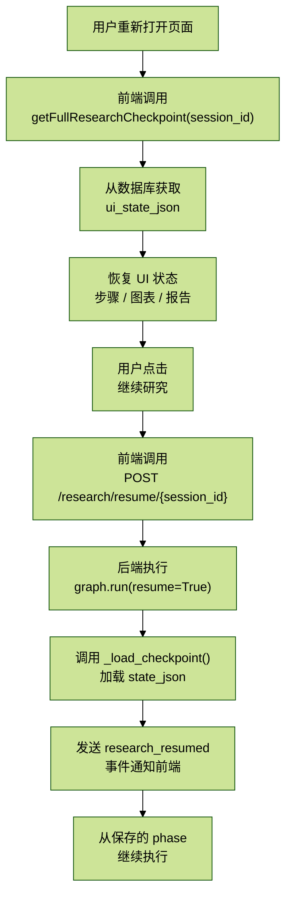
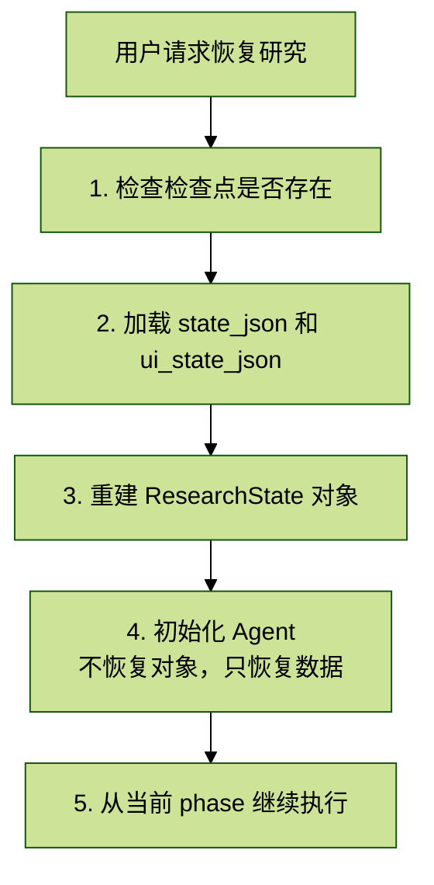

# Agent_拓业智询_3.7 检查点与状态恢复

> 核心价值：保存多智能体研究进度，支持暂停/恢复/失败重试，确保长时间任务的可靠性。

## 目录

- 研究任务的断点续传机制
  - 0.1 为什么需要断点续传？
  - 0.2 状态保存
  - 0.3 恢复执行的流程
  - 0.4 后端恢复逻辑
  - 0.5 前端恢复逻辑
  - 0.6 关键设计点
  - 0.7 类比理解
- 1. 概述
- 2. 检查点模型设计
  - 2.1 表结构
  - 2.2 字段说明
- 3. 检查点服务实现
  - 3.1 服务初始化
  - 3.2 保存检查点
  - 3.3 加载检查点
- 4. JSONB 序列化处理
- 5. 状态恢复实现
- 6. 暂停/恢复研究
- 7. 失败重试机制
- 8. 检查点管理 API
- 9. 性能优化
- 10. 总结

## 研究任务的断点续传机制

这个文档描述的是一个研究任务如何保存进度、中断后如何恢复继续执行的完整机制。

### 0.1 为什么需要断点续传？

研究任务可能运行很长时间（几分钟甚至几十分钟），期间可能发生：

- 用户关闭浏览器
- 网络断开
- 服务器重启
- 用户主动暂停

如果没有断点续传，一切都要从头开始，用户体验很差。

### 0.2 状态保存

保存在哪里？

数据库的 `research_checkpoints` 表，包含三个核心字段：

```text
state_json     → 后端完整状态（大纲、事实、图表、报告等）
ui_state_json  → 前端 UI 状态（研究步骤、搜索结果、图表显示）
phase          → 当前阶段（planning / researching / analyzing / writing / reviewing）
```

什么时候保存？

每个阶段完成后自动保存：

```python
# graph.py:538-565
await save_checkpoint_async({
    "type": "planning",
    "status": "completed",
    ...
})
```

### 0.3 恢复执行的流程

完整流程图：



### 0.4 后端恢复逻辑

```python
# graph.py:290-342
async def run(query, session_id, resume=False, ...):

    # 如果是恢复模式，尝试加载检查点
    if resume and session_id:
        state = self._load_checkpoint(session_id)  # 从数据库加载
        if state:
            yield {"type": "research_resumed", "phase": state.get("phase")}

    # 如果没有检查点（新任务或加载失败），则创建初始状态
    if not state:
        state = create_initial_state(...)
```

### 0.5 前端恢复逻辑

```ts
// chat/index.tsx:1228-1420

// 页面加载时自动恢复
const res = await api.session.getFullResearchCheckpoint(id)

// 恢复步骤、图表、报告等 UI 状态
setResearchSteps(res.ui_state.steps)
setCharts(res.ui_state.charts)
setReport(res.ui_state.report)
```

### 0.6 关键设计点

1. 双重状态存储

```text
state_json     → 给后端用，包含完整的计算状态
ui_state_json  → 给前端用，包含显示相关的状态
```

两者分开存储，各取所需。

2. 阶段性保存

不是实时保存，而是每完成一个阶段保存一次：

```text
planning 完成 → 保存
researching 完成 → 保存
analyzing 完成 → 保存
writing 完成 → 保存
reviewing 完成 → 保存
```

3. 恢复策略

恢复时会重新执行所有阶段，但使用已保存的数据作为基础，避免重复计算。

4. 通过 `session_id` 关联

前端和后端通过同一个 `session_id` 找到对应的检查点，确保状态一致。

### 0.7 类比理解

就像玩游戏：

1. 游戏自动存档（每过一关保存一次）
2. 关闭游戏
3. 下次打开，读取存档
4. 从上次的关卡继续玩

研究任务也是一样：

1. 每完成一个阶段自动保存
2. 用户离开
3. 用户回来，加载检查点
4. 从上次的阶段继续执行

## 1. 概述

> 检查点服务是深度研究系统的核心组件，实现了：

- 自动保存：每个 Agent 执行后自动保存状态
- 状态恢复：从检查点恢复研究进度
- 暂停/恢复：用户可中断并继续研究
- JSONB 存储：灵活存储复杂对象
- 版本管理：记录每次迭代的状态

关键文件：

- `/backend/app/service/checkpoint_service.py`：检查点服务（340 行）
- `/backend/app/models/research.py`：检查点模型

## 2. 检查点模型设计

### 2.1 表结构

文件位置：`/backend/app/models/research.py`（第 11-51 行）

```python
class ResearchCheckpoint(Base):
    """研究检查点模型 - 用于保存和恢复深度研究状态"""
    __tablename__ = "research_checkpoints"

    # 主键和标识
    id = Column(UUID(as_uuid=True), primary_key=True, default=uuid.uuid4)
    session_id = Column(String(64), index=True, nullable=False)  # 研究会话 ID
    user_id = Column(UUID(as_uuid=True), ForeignKey("users.id", ondelete="CASCADE"), nullable=True)

    # 基本信息
    query = Column(Text, nullable=False)  # 原始查询
    phase = Column(String(32), nullable=False)  # planning/researching/analyzing/writing/reviewing/completed
    iteration = Column(Integer, default=0)  # 当前迭代次数

    # 核心字段：JSONB 存储复杂对象
    state_json = Column(JSONB, nullable=False)  # 完整的 ResearchState（后端状态）
    ui_state_json = Column(JSONB)  # 前端 UI 状态（研究步骤、搜索结果、图表等）

    # 结果和状态
    final_report = Column(Text)  # 最终报告内容
    status = Column(String(16), default="running")  # running/paused/completed/failed
    error_message = Column(Text)  # 错误信息（如果失败）

    # 时间戳
    created_at = Column(DateTime, default=datetime.utcnow)
    updated_at = Column(DateTime, default=datetime.utcnow, onupdate=datetime.utcnow)

    # 关系
    user = relationship("User", backref="research_checkpoints")
```

### 2.2 字段说明

截图里这块是空白表格，没有可辨认内容；从代码可以确认的字段如下：

| 字段 | 类型 | 作用 |
| --- | --- | --- |
| `id` | `UUID` | 检查点主键 |
| `session_id` | `String(64)` | 研究会话 ID |
| `user_id` | `UUID` | 用户 ID |
| `query` | `Text` | 原始查询 |
| `phase` | `String(32)` | 当前研究阶段 |
| `iteration` | `Integer` | 当前迭代次数 |
| `state_json` | `JSONB` | 后端完整状态 |
| `ui_state_json` | `JSONB` | 前端 UI 状态 |
| `final_report` | `Text` | 最终报告 |
| `status` | `String(16)` | `running/paused/completed/failed` |
| `error_message` | `Text` | 错误信息 |
| `created_at` | `DateTime` | 创建时间 |
| `updated_at` | `DateTime` | 更新时间 |

## 3. 检查点服务实现

### 3.1 服务初始化

文件位置：`/backend/app/service/checkpoint_service.py`（第 15-23 行）

```python
class CheckpointService:
    """检查点服务"""

    def __init__(self):
        pass

    def _get_db(self) -> Session:
        """获取数据库会话"""
        return SessionLocal()
```

### 3.2 保存检查点

文件位置：`/backend/app/service/checkpoint_service.py`（第 25-107 行）

```python
def save_checkpoint(
    self,
    session_id: str,
    state: Dict[str, Any],
    user_id: Optional[str] = None,
    ui_state: Optional[Dict[str, Any]] = None,
    final_report: Optional[str] = None,
) -> Optional[str]:
    """
    保存检查点

    Args:
        session_id: 研究会话 ID
        state: ResearchState 字典（后端状态）
        user_id: 用户 ID（可选）
        ui_state: 前端 UI 状态（研究步骤、搜索结果、图表等）
        final_report: 最终报告内容

    Returns:
        检查点 ID，失败返回 None
    """
    db = self._get_db()
    try:
        # 提取关键信息
        query = state.get("query", "")
        phase = state.get("phase", "planning")
        iteration = state.get("iteration", 0)

        # 清理 state 中不可序列化的内容
        clean_state = self._clean_state_for_storage(state)
        clean_ui_state = self._clean_state_for_storage(ui_state) if ui_state else None

        # 查找现有检查点
        existing = db.query(ResearchCheckpoint).filter(
            ResearchCheckpoint.session_id == session_id
        ).first()

        if existing:
            # 更新现有检查点
            existing.phase = phase
            existing.iteration = iteration
            existing.state_json = clean_state
            if clean_ui_state:
                existing.ui_state_json = clean_ui_state
            if final_report:
                existing.final_report = final_report
            existing.status = "running"
            existing.updated_at = datetime.utcnow()
            checkpoint_id = str(existing.id)
        else:
            # 创建新检查点
            checkpoint = ResearchCheckpoint(
                session_id=session_id,
                user_id=UUID(user_id) if user_id else None,
                query=query,
                phase=phase,
                iteration=iteration,
                state_json=clean_state,
                ui_state_json=clean_ui_state,
                final_report=final_report,
                status="running",
            )
            db.add(checkpoint)
            db.flush()
            checkpoint_id = str(checkpoint.id)

        db.commit()

        # 详细日志
```

```python
        ui_steps = clean_ui_state.get("research_steps", []) if clean_ui_state else []
        ui_search = clean_ui_state.get("search_results", []) if clean_ui_state else []
        ui_charts = clean_ui_state.get("charts", []) if clean_ui_state else []
        ui_kg = clean_ui_state.get("knowledge_graph", {}) if clean_ui_state else {}

        logger.info(
            f"[CheckpointService] 保存成功: session={session_id}, phase={phase}, "
            f"ui_state=[steps={len(ui_steps)}, search_results={len(ui_search)}, "
            f"charts={len(ui_charts)}, kg_nodes={len(ui_kg.get('nodes', [])) if ui_kg else []}]"
        )
        return checkpoint_id

    except Exception as e:
        logger.error(f"Failed to save checkpoint: {e}")
        db.rollback()
        return None
    finally:
        db.close()
```

保存逻辑要点：

1. 增量更新：检查点是否已存在，存在则更新而非新建
2. 状态清理：调用 `_clean_state_for_storage` 移除不可序列化对象
3. 详细日志：记录 UI 状态的各项统计（steps、charts、kg 等）

### 3.3 加载检查点

文件位置：`/backend/app/service/checkpoint_service.py`（第 109-174 行）

```python
def load_checkpoint(self, session_id: str) -> Optional[Dict[str, Any]]:
    """
    加载最新的检查点（后端状态）

    Args:
        session_id: 研究会话 ID

    Returns:
        ResearchState 字典，未找到返回 None
    """
    db = self._get_db()
    try:
        checkpoint = db.query(ResearchCheckpoint).filter(
            ResearchCheckpoint.session_id == session_id
        ).order_by(ResearchCheckpoint.updated_at.desc()).first()

        if not checkpoint:
            return None

        return checkpoint.state_json

    except Exception as e:
        logger.error(f"Failed to load checkpoint: {e}")
        return None
    finally:
        db.close()
```

```python
def load_full_checkpoint(self, session_id: str) -> Optional[Dict[str, Any]]:
    """
    加载完整的检查点（包含后端状态、UI状态和报告）

    Args:
        session_id: 研究会话 ID

    Returns:
        完整检查点数据，包含 state_json、ui_state_json、final_report 等
    """
    db = self._get_db()
    try:
        checkpoint = db.query(ResearchCheckpoint).filter(
            ResearchCheckpoint.session_id == session_id
        ).order_by(ResearchCheckpoint.updated_at.desc()).first()

        if not checkpoint:
            logger.info(f"[CheckpointService] 未找到检查点: session={session_id}")
            return None

        result = checkpoint.to_dict(include_state=True)

        # 详细日志
        ui_state = result.get("ui_state_json", {})
        if ui_state:
            logger.info(
                f"[CheckpointService] 加载成功: session={session_id}, "
                f"phase={result.get('phase')}, "
                f"ui_state=[steps={len(ui_state.get('research_steps', []))}, "
                f"search_results={len(ui_state.get('search_results', []))}, "
                f"charts={len(ui_state.get('charts', []))}, "
                f"kg_nodes={len((ui_state.get('knowledge_graph') or {}).get('nodes', []))}]"
            )
        else:
            logger.info(f"[CheckpointService] 加载成功但无ui_state: session={session_id}, phase={result.get('phase')}")

        return result

    except Exception as e:
        logger.error(f"Failed to load full checkpoint: {e}")
        return None
    finally:
        db.close()
```

加载方式：

截图里这块是空白表格，没有可辨认内容；从代码可知至少包含两种加载方式：

- `load_checkpoint()`：只加载后端 `state_json`
- `load_full_checkpoint()`：加载完整检查点，包含 `state_json`、`ui_state_json`、`final_report`

## 4. JSONB 序列化处理

> 核心问题：Python 对象无法直接存入数据库  
> 数据库的 JSONB 字段只能存储标准 JSON 数据类型

### 4.1 不可序列化问题

常见问题：

```python
import datetime

state = {
    "query": "智慧交通分析",
    "created_at": datetime.datetime.now(),  # 不可序列化
    "callback": lambda x: x,                # 函数不可序列化
    "agent": PlannerAgent(),                # 对象不可序列化
}

json.dumps(state)  # TypeError: Object of type datetime is not JSON serializable
```

### 4.2 清理逻辑

文件位置：`/backend/app/service/checkpoint_service.py`（第 307-327 行）

```python
def _clean_state_for_storage(self, state: Dict[str, Any]) -> Dict[str, Any]:
    """
    清理状态以便存储

    移除不可序列化的内容，保留可恢复的数据
    """
    clean = {}
    for key, value in state.items():
        try:
            # 尝试序列化测试
            json.dumps(value, default=str)
            clean[key] = value
        except (TypeError, ValueError):
            # 跳过不可序列化的值，或转换为字符串
            if isinstance(value, (list, tuple)):
                clean[key] = [str(v) for v in value]
            elif isinstance(value, dict):
                clean[key] = self._clean_state_for_storage(value)  # 递归清理
            else:
                clean[key] = str(value)
    return clean
```

处理策略：

1. 尝试序列化：`json.dumps(value, default=str)`
2. 列表/元组：逐项转为字符串
3. 字典：递归清理
4. 其他对象：直接 `str(value)`

### 4.3 清理示例

```python
# 原始 state
state = {
    "query": "智慧交通分析",
    "created_at": datetime.datetime(2024, 1, 31, 10, 30, 0),
    "search_results": [
        {
            "title": "标题",
            "score": 0.95,
            "timestamp": datetime.datetime.now()
        }
    ],
    "agent": PlannerAgent(),
    "callback": lambda x: x
}

# 清理后
clean_state = {
    "query": "智慧交通分析",
    "created_at": "2024-01-31 10:30:00",  # 转为字符串
    "search_results": [
        {
            "title": "标题",
            "score": 0.95,
            "timestamp": "2024-01-31 10:30:00"  # 递归清理
        }
    ],
    "agent": "<PlannerAgent object at 0x...>",  # 对象 repr
    "callback": "<function <lambda> at 0x...>"  # 函数 repr
}
```

## 5. 状态恢复实现

### 5.1 恢复流程



### 5.2 恢复代码示例

```python
from service.checkpoint_service import get_checkpoint_service
from service.deep_research_v2.service import DeepResearchService

async def resume_research(session_id: str):
    """恢复研究"""
    # 1. 加载检查点
    checkpoint_service = get_checkpoint_service()
    full_checkpoint = checkpoint_service.load_full_checkpoint(session_id)

    if not full_checkpoint:
        raise ValueError(f"未找到检查点: {session_id}")

    # 2. 提取状态
    state_json = full_checkpoint.get("state_json", {})
    ui_state_json = full_checkpoint.get("ui_state_json", {})
    phase = full_checkpoint.get("phase")
    iteration = full_checkpoint.get("iteration", 0)

    # 3. 重建 ResearchState
    state = ResearchState(
        query=state_json.get("query"),
        phase=phase,
        iteration=iteration,
        search_history=state_json.get("search_history", []),
        analysis_results=state_json.get("analysis_results", {}),
        messages=state_json.get("messages", []),
        # ... 其他字段
    )

    # 4. 继续执行
    research_service = DeepResearchService()
    result = await research_service.continue_research(state, session_id)

    return result
```

### 5.3 部分恢复（跳过已完成阶段）

```python
async def continue_research(self, state: ResearchState, session_id: str):
    """从检查点继续研究"""
    current_phase = state.get("phase")

    # 跳过已完成阶段
    if current_phase == "planning":
        await planner_agent.invoke(state)
        await scout_agent.invoke(state)
        await analyst_agent.invoke(state)
        await writer_agent.invoke(state)
        await reviewer_agent.invoke(state)

    elif current_phase == "researching":
        # 跳过 planning，直接从 scout 开始
        await scout_agent.invoke(state)
        await analyst_agent.invoke(state)
        await writer_agent.invoke(state)
        await reviewer_agent.invoke(state)

    elif current_phase == "analyzing":
        await analyst_agent.invoke(state)
        await writer_agent.invoke(state)
        await reviewer_agent.invoke(state)

    # ... 其他阶段

    return state
```

## 6. 暂停/恢复研究

### 6.1 暂停研究

```python
@router.post("/research/pause")
async def pause_research(session_id: str):
    """暂停研究"""
    # 1. 设置取消信号（Redis）
    set_cancel_signal(session_id)

    # 2. 更新检查点状态
    checkpoint_service = get_checkpoint_service()
    success = checkpoint_service.update_status(
        session_id=session_id,
        status="paused"
    )

    if success:
        return {"success": True, "message": "研究已暂停"}
    else:
        raise HTTPException(status_code=404, detail="未找到检查点")
```

### 6.2 恢复研究

```python
@router.post("/research/resume")
async def resume_research_endpoint(session_id: str):
    """恢复研究"""
    # 1. 清除取消信号
    clear_cancel_signal(session_id)

    # 2. 加载检查点
    checkpoint_service = get_checkpoint_service()
    full_checkpoint = checkpoint_service.load_full_checkpoint(session_id)

    if not full_checkpoint:
        raise HTTPException(status_code=404, detail="未找到检查点")

    if full_checkpoint["status"] != "paused":
        raise HTTPException(status_code=400, detail="研究未处于暂停状态")

    # 3. 恢复执行
    state_json = full_checkpoint["state_json"]
    result = await resume_research(session_id)

    # 4. 更新状态为 running
    checkpoint_service.update_status(session_id, "running")

    return {"success": True, "result": result}
```

### 6.3 前端 UI 示例

```ts
// 暂停按钮
const handlePause = async () => {
  const response = await fetch(`/api/research/pause?session_id=${sessionId}`, {
    method: 'POST'
  });
  const result = await response.json();
  if (result.success) {
    message.success('研究已暂停');
    setStatus('paused');
  }
};

// 恢复按钮
const handleResume = async () => {
  const response = await fetch(`/api/research/resume?session_id=${sessionId}`, {
    method: 'POST'
  });
  const result = await response.json();
  if (result.success) {
    message.success('研究已恢复');
    setStatus('running');
    // 重新建立 SSE 连接监听进度
    listenToProgress(sessionId);
  }
};
```

## 7. 失败重试机制

### 7.1 异常捕获与保存

```python
async def research_with_checkpoint(query: str, session_id: str):
    """带检查点的研究流程"""
    state = ResearchState(query=query, phase="planning")
    checkpoint_service = get_checkpoint_service()

    try:
        # 执行研究
        for phase in ["planning", "researching", "analyzing", "writing", "reviewing"]:
            state["phase"] = phase

            # 执行 Agent
            if phase == "planning":
                state = await planner_agent.invoke(state)
            elif phase == "researching":
                state = await scout_agent.invoke(state)
            # ... 其他阶段

            # 每个阶段后保存检查点
            checkpoint_service.save_checkpoint(
                session_id=session_id,
                state=state
            )

        # 标记完成
        checkpoint_service.update_status(session_id, "completed")
        return state

    except Exception as e:
        logger.error(f"研究失败: {e}")

        # 保存失败状态
        checkpoint_service.update_status(
            session_id=session_id,
            status="failed",
            error_message=str(e)
        )

        raise
```

### 7.2 自动重试

```python
@router.post("/research/retry")
async def retry_failed_research(session_id: str, max_retries: int = 3):
    """重试失败的研究"""
    checkpoint_service = get_checkpoint_service()
    full_checkpoint = checkpoint_service.load_full_checkpoint(session_id)

    if not full_checkpoint:
        raise HTTPException(status_code=404, detail="未找到检查点")

    if full_checkpoint["status"] != "failed":
        raise HTTPException(status_code=400, detail="研究未处于失败状态")

    # 获取失败阶段
    failed_phase = full_checkpoint.get("phase")
    logger.info(f"重试研究，失败阶段: {failed_phase}")

    # 重试逻辑
    for attempt in range(max_retries):
        try:
            # 从失败阶段继续
            result = await resume_research(session_id)

            # 成功则返回
            return {"success": True, "result": result}

        except Exception as e:
            logger.error(f"重试失败（尝试 {attempt+1}/{max_retries}）: {e}")
            if attempt < max_retries - 1:
                await asyncio.sleep(10)  # 等待10秒后重试
            else:
                # 最后一次重试也失败
                return {
                    "success": False,
                    "error": f"重试{max_retries}次后仍失败: {e}"
                }
```

## 8. 检查点管理 API

### 8.1 列出检查点

文件位置：`/backend/app/service/checkpoint_service.py`（第 202-238 行）

```python
def list_checkpoints(
    self,
    user_id: Optional[str] = None,
    status: Optional[str] = None,
    limit: int = 20,
) -> List[Dict[str, Any]]:
    """
    列出检查点

    Args:
        user_id: 用户 ID（可选，用于过滤）
        status: 状态过滤
        limit: 限制数量

    Returns:
        检查点列表
    """
    db = self._get_db()
    try:
        query = db.query(ResearchCheckpoint)

        if user_id:
            query = query.filter(ResearchCheckpoint.user_id == UUID(user_id))
        if status:
            query = query.filter(ResearchCheckpoint.status == status)

        checkpoints = query.order_by(
            ResearchCheckpoint.updated_at.desc()
        ).limit(limit).all()

        return [cp.to_dict() for cp in checkpoints]

    except Exception as e:
        logger.error(f"Failed to list checkpoints: {e}")
        return []
    finally:
        db.close()
```

### 8.2 更新状态

文件位置：`/backend/app/service/checkpoint_service.py`（第 240-279 行）

```python
def update_status(
    self,
    session_id: str,
    status: str,
    error_message: Optional[str] = None,
) -> bool:
    """
    更新检查点状态

    Args:
        session_id: 研究会话 ID
        status: 新状态（running/paused/completed/failed）
        error_message: 错误信息（可选）

    Returns:
        是否成功
    """
    db = self._get_db()
    try:
        checkpoint = db.query(ResearchCheckpoint).filter(
            ResearchCheckpoint.session_id == session_id
        ).first()

        if not checkpoint:
            return False

        checkpoint.status = status
        if error_message:
            checkpoint.error_message = error_message
        checkpoint.updated_at = datetime.utcnow()

        db.commit()
        return True

    except Exception as e:
        logger.error(f"Failed to update checkpoint status: {e}")
        db.rollback()
        return False
    finally:
        db.close()
```

### 8.3 删除检查点

文件位置：`/backend/app/service/checkpoint_service.py`（第 281-305 行）

```python
def delete_checkpoint(self, session_id: str) -> bool:
    """
    删除检查点

    Args:
        session_id: 研究会话 ID

    Returns:
        是否成功
    """
    db = self._get_db()
    try:
        deleted = db.query(ResearchCheckpoint).filter(
            ResearchCheckpoint.session_id == session_id
        ).delete()

        db.commit()
        return deleted > 0

    except Exception as e:
        logger.error(f"Failed to delete checkpoint: {e}")
        db.rollback()
        return False
    finally:
        db.close()
```

## 9. 性能优化

### 9.1 增量更新

```python
# 只更新必要字段，避免全量更新
checkpoint.phase = new_phase
checkpoint.iteration = new_iteration
checkpoint.updated_at = datetime.utcnow()
# 不更新 state_json，减少数据库负载
db.commit()
```

### 9.2 异步保存

```python
import asyncio
from concurrent.futures import ThreadPoolExecutor

executor = ThreadPoolExecutor(max_workers=5)

async def save_checkpoint_async(session_id: str, state: Dict):
    """异步保存检查点"""
    loop = asyncio.get_event_loop()
    await loop.run_in_executor(
        executor,
        checkpoint_service.save_checkpoint,
        session_id,
        state
    )
```

### 9.3 批量清理

```python
def cleanup_old_checkpoints(days: int = 30):
    """清理30天前的检查点"""
    cutoff_date = datetime.utcnow() - timedelta(days=days)

    db = SessionLocal()
    try:
        deleted = db.query(ResearchCheckpoint).filter(
            ResearchCheckpoint.created_at < cutoff_date,
            ResearchCheckpoint.status.in_(["completed", "failed"])
        ).delete()

        db.commit()
        logger.info(f"清理了 {deleted} 个旧检查点")
    finally:
        db.close()
```

## 10. 总结

> 本章深入讲解了检查点与状态恢复机制：

1. 检查点模型：JSONB 存储 + 状态管理
2. 保存逻辑：增量更新 + 状态清理
3. 加载逻辑：后端状态 + 前端状态
4. JSONB 序列化：递归清理不可序列化对象
5. 暂停/恢复：Redis 取消信号 + 状态恢复
6. 失败重试：异常捕获 + 自动重试

关键文件：

- `/backend/app/service/checkpoint_service.py`：检查点服务（340 行）
- `/backend/app/models/research.py`：检查点模型

下一章预告：`3.8 可观测性与监控`，讲解 Prometheus Metrics、ELK 日志、Jaeger 追踪。
