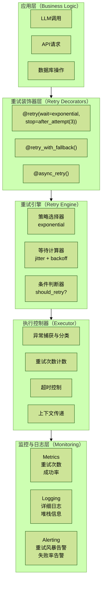

# 4.1 Retry重试机制

## 目录

- [概述](#概述)
- [核心概念](#核心概念)
  - [重试策略类型](#重试策略类型)
- [架构设计](#架构设计)
  - [重试机制架构图](#重试机制架构图)
- [核心实现](#核心实现)
  - [1 基础重试装饰器](#1-基础重试装饰器)
  - [2 异步重试装饰器](#2-异步重试装饰器)
  - [3 使用Tenacity库的高级重试](#3-使用tenacity库的高级重试)
  - [4 幂等性设计](#4-幂等性设计)
  - [5 完整的重试系统](#5-完整的重试系统)
- [最佳实践](#最佳实践)
  - [1 异常分类](#1-异常分类)
  - [2 重试策略选择指南](#2-重试策略选择指南)
- [监控与告警](#监控与告警)
  - [重试监控指标](#重试监控指标)
- [总结](#总结)

## 概述

在分布式系统中，网络抖动、服务暂时不可用、限流等问题不可避免。重试机制通过自动重新执行失败的操作，提高系统的可靠性和容错能力。本文档详细介绍如何设计和实现企业级的重试机制。

## 核心概念

### 重试策略类型

| 策略 | 间隔示例 | 适用场景 | 风险 |
| --- | --- | --- | --- |
| 固定间隔重试 | `1s -> 1s -> 1s -> 1s` | 简单但可能加重服务压力 | 容易同步重试 |
| 线性退避 | `1s -> 2s -> 3s -> 4s` | 适合轻度故障 | 增长较慢 |
| 指数退避 | `1s -> 2s -> 4s -> 8s` | 业务最佳实践 | 需要最大延迟限制 |
| 斐波那契退避 | `1s -> 1s -> 2s -> 3s -> 5s -> 8s` | 平滑指数增长 | 实现略复杂 |
| 随机抖动 | `1s -> 2.3s -> 4.7s -> 7.2s` | 避免惊群效应，防止重试风暴 | 需要控制随机范围 |

## 架构设计

### 重试机制架构图



## 核心实现

### 1 基础重试装饰器

```python
# app/core/retry_decorator.py

import functools
import time
import random
import logging
from typing import Callable, TypeVar, Optional, Type, Tuple
from datetime import datetime

logger = logging.getLogger(__name__)

T = TypeVar('T')


class RetryConfig:
    """重试配置类"""

    def __init__(
        self,
        max_attempts: int = 3,
        base_delay: float = 1.0,
        max_delay: float = 60.0,
        exponential_base: float = 2.0,
        jitter: bool = True,
        jitter_ratio: float = 0.1,
        timeout: Optional[float] = None,
        retryable_exceptions: Tuple[Type[Exception], ...] = (Exception,),
        non_retryable_exceptions: Tuple[Type[Exception], ...] = (),
    ):
        self.max_attempts = max_attempts
        self.base_delay = base_delay
        self.max_delay = max_delay
        self.exponential_base = exponential_base
        self.jitter = jitter
        self.jitter_ratio = jitter_ratio
        self.timeout = timeout
        self.retryable_exceptions = retryable_exceptions
        self.non_retryable_exceptions = non_retryable_exceptions

    def calculate_delay(self, attempt: int) -> float:
        """计算重试延迟时间（指数退避 + 随机抖动）"""
        # 指数退避
        delay = min(
            self.base_delay * (self.exponential_base ** attempt),
            self.max_delay
        )

        # 添加随机抖动，避免惊群效应
        if self.jitter:
            jitter_amount = delay * self.jitter_ratio
            delay += random.uniform(-jitter_amount, jitter_amount)

        return max(0, delay)

    def should_retry(self, exception: Exception, attempt: int) -> bool:
        """判断是否应该重试"""
        # 超过最大重试次数
        if attempt >= self.max_attempts:
            return False

        # 非可重试异常
        if self.non_retryable_exceptions and isinstance(
            exception, self.non_retryable_exceptions
        ):
            return False

        # 可重试异常
        if self.retryable_exceptions and isinstance(
            exception, self.retryable_exceptions
        ):
            return True

        return False


def retry(config: Optional[RetryConfig] = None):
    """
    重试装饰器

    使用示例：
        @retry(RetryConfig(max_attempts=5, base_delay=2.0))
        def call_api():
            ...
    """
    if config is None:
        config = RetryConfig()

    def decorator(func: Callable[..., T]) -> Callable[..., T]:
        @functools.wraps(func)
        def wrapper(*args, **kwargs) -> T:
            attempt = 0
            start_time = time.time()
            last_exception = None

            while True:
                try:
                    # 检查超时
                    if config.timeout and (time.time() - start_time) > config.timeout:
                        raise TimeoutError(
                            f"Retry timeout after {config.timeout}s"
                        )

                    # 执行函数
                    logger.debug(
                        f"Executing {func.__name__}, attempt {attempt + 1}/{config.max_attempts}"
                    )
                    result = func(*args, **kwargs)

                    # 成功执行
                    if attempt > 0:
                        logger.info(
                            f"{func.__name__} succeeded after {attempt + 1} attempts"
                        )

                    return result

                except Exception as e:
                    last_exception = e
                    attempt += 1

                    # 判断是否应该重试
                    if not config.should_retry(e, attempt):
                        logger.error(
                            f"{func.__name__} failed after {attempt} attempts: {e}",
                            exc_info=True
                        )
                        raise

                    # 计算延迟时间
                    delay = config.calculate_delay(attempt - 1)

                    logger.warning(
                        f"{func.__name__} attempt {attempt} failed: {e}. "
                        f"Retrying in {delay:.2f}s..."
                    )

                    # 等待后重试
                    time.sleep(delay)

            # 不应该到达这里
            if last_exception:
                raise last_exception

        return wrapper

    return decorator
```

### 2 异步重试装饰器

```python
# app/core/async_retry_decorator.py

import asyncio
import functools
import logging
from typing import Callable, TypeVar, Awaitable

from .retry_decorator import RetryConfig

logger = logging.getLogger(__name__)

T = TypeVar('T')


def async_retry(config: RetryConfig = None):
    """
    异步重试装饰器

    使用示例：
        @async_retry(RetryConfig(max_attempts=3))
        async def call_async_api():
            ...
    """
    if config is None:
        config = RetryConfig()

    def decorator(func: Callable[..., Awaitable[T]]) -> Callable[..., Awaitable[T]]:
        @functools.wraps(func)
        async def wrapper(*args, **kwargs) -> T:
            attempt = 0
            start_time = asyncio.get_event_loop().time()
            last_exception = None

            while True:
                try:
                    # 检查超时
                    if config.timeout:
                        elapsed = asyncio.get_event_loop().time() - start_time
                        if elapsed > config.timeout:
                            raise TimeoutError(
                                f"Retry timeout after {config.timeout}s"
                            )

                    # 执行异步函数
                    logger.debug(
                        f"Executing async {func.__name__}, "
                        f"attempt {attempt + 1}/{config.max_attempts}"
                    )

                    result = await func(*args, **kwargs)

                    if attempt > 0:
                        logger.info(
                            f"Async {func.__name__} succeeded after {attempt + 1} attempts"
                        )

                    return result

                except Exception as e:
                    last_exception = e
                    attempt += 1

                    if not config.should_retry(e, attempt):
                        logger.error(
                            f"Async {func.__name__} failed after {attempt} attempts: {e}",
                            exc_info=True
                        )
                        raise

                    delay = config.calculate_delay(attempt - 1)

                    logger.warning(
                        f"Async {func.__name__} attempt {attempt} failed: {e}. "
                        f"Retrying in {delay:.2f}s..."
                    )

                    await asyncio.sleep(delay)

            if last_exception:
                raise last_exception

        return wrapper

    return decorator
```

### 3 使用Tenacity库的高级重试

```python
# app/core/tenacity_retry.py

from tenacity import (
    retry,
    stop_after_attempt,
    wait_exponential,
    wait_random_exponential,
    retry_if_exception_type,
    retry_if_result,
    before_sleep_log,
    after_log,
    RetryError,
)
import logging
from typing import Callable, TypeVar, Optional
import openai

logger = logging.getLogger(__name__)

T = TypeVar('T')


class LLMRetryHandler:
    """LLM调用重试处理器"""

    # LLM相关的可重试异常
    RETRYABLE_EXCEPTIONS = (
        openai.RateLimitError,
        openai.APITimeoutError,
        openai.APIConnectionError,
        openai.InternalServerError,
    )

    # 非可重试异常
    NON_RETRYABLE_EXCEPTIONS = (
        openai.AuthenticationError,
        openai.PermissionDeniedError,
        openai.BadRequestError,
    )

    @staticmethod
    def create_llm_retry_decorator(
        max_attempts: int = 5,
        min_wait: float = 1.0,
        max_wait: float = 60.0,
    ):
        """
        创建LLM调用重试装饰器

        特点：
        - 指数退避 + 随机抖动
        - 只重试特定异常
        - 详细日志记录
        """
        return retry(
            # 停止条件：最多重试5次
            stop=stop_after_attempt(max_attempts),

            # 等待策略：指数退避 + 随机抖动
            wait=wait_random_exponential(
                multiplier=1,
                min=min_wait,
                max=max_wait
            ),

            # 重试条件：只重试特定异常
            retry=retry_if_exception_type(LLMRetryHandler.RETRYABLE_EXCEPTIONS),

            # 重试前日志
            before_sleep=before_sleep_log(logger, logging.WARNING),

            # 完成后日志
            after=after_log(logger, logging.INFO),

            # 重新抛出原异常
            reraise=True,
        )

    @staticmethod
    def create_conditional_retry_decorator(
        should_retry_result: Optional[Callable[[T], bool]] = None,
        max_attempts: int = 3,
    ):
        """
        创建基于结果的条件重试装饰器

        使用场景：
        - LLM返回空结果
        - LLM返回格式错误
        - 需要验证结果质量
        """
        retry_conditions = []

        # 基于异常的重试
        retry_conditions.append(
            retry_if_exception_type(LLMRetryHandler.RETRYABLE_EXCEPTIONS)
        )

        # 基于结果的重试
        if should_retry_result:
            retry_conditions.append(retry_if_result(should_retry_result))

        return retry(
            stop=stop_after_attempt(max_attempts),
            wait=wait_exponential(multiplier=1, min=1, max=10),
            retry=retry_conditions[0] if len(retry_conditions) == 1
            else (retry_conditions[0] | retry_conditions[1]),
            before_sleep=before_sleep_log(logger, logging.WARNING),
            reraise=True,
        )


# 使用示例

@LLMRetryHandler.create_llm_retry_decorator(max_attempts=5)
def call_openai_with_retry(prompt: str) -> str:
    """
    调用OpenAI API（带重试）
    """
    from openai import OpenAI
    import os

    client = OpenAI(api_key=os.getenv("OPENAI_API_KEY"))

    response = client.chat.completions.create(
        model="gpt-4",
        messages=[{"role": "user", "content": prompt}],
        timeout=30.0,
    )

    return response.choices[0].message.content


def is_empty_or_invalid(result: Optional[str]) -> bool:
    """判断结果是否为空或无效"""
    return not result or len(result.strip()) < 10


@LLMRetryHandler.create_conditional_retry_decorator(
    should_retry_result=is_empty_or_invalid,
    max_attempts=3
)
def call_llm_with_validation(prompt: str) -> str:
    """
    调用LLM并验证结果质量

    如果结果为空或过短，会自动重试
    """
    result = call_openai_with_retry(prompt)
    return result
```

### 4 幂等性设计

```python
# app/core/idempotency.py

import hashlib
import json
import logging
from typing import Any, Callable, Optional, TypeVar
from datetime import datetime, timedelta
from functools import wraps

from redis import Redis

logger = logging.getLogger(__name__)

T = TypeVar('T')


class IdempotencyManager:
    """幂等性管理器"""

    def __init__(self, redis_client: Redis, ttl: int = 3600):
        """
        Args:
            redis_client: Redis客户端
            ttl: 幂等性记录的生存时间（秒）
        """
        self.redis = redis_client
        self.ttl = ttl
        self.key_prefix = "idempotency:"

    def generate_key(self, func_name: str, args: tuple, kwargs: dict) -> str:
        """
        生成幂等性键

        将函数名和参数序列化后哈希，确保相同的调用生成相同的键
        """
        # 构建参数字符串
        params = {
            "func": func_name,
            "args": args,
            "kwargs": kwargs,
        }

        # 序列化并哈希
        params_str = json.dumps(params, sort_keys=True, default=str)
        hash_value = hashlib.sha256(params_str.encode()).hexdigest()

        return f"{self.key_prefix}{func_name}:{hash_value}"

    def get_cached_result(self, key: str) -> Optional[Any]:
        """获取缓存的结果"""
        cached = self.redis.get(key)
        if cached:
            logger.info(f"Idempotency hit: {key}")
            return json.loads(cached)
        return None

    def cache_result(self, key: str, result: Any):
        """缓存结果"""
        self.redis.setex(
            key,
            self.ttl,
            json.dumps(result, default=str)
        )
        logger.info(f"Idempotency cached: {key}")

    def idempotent(self, func: Callable[..., T]) -> Callable[..., T]:
        """
        幂等性装饰器

        使用示例：
            @idempotency_manager.idempotent
            def create_order(user_id: str, items: list):
                ...
        """
        @wraps(func)
        def wrapper(*args, **kwargs) -> T:
            # 生成幂等性键
            key = self.generate_key(func.__name__, args, kwargs)

            # 检查是否已执行过
            cached_result = self.get_cached_result(key)
            if cached_result is not None:
                return cached_result

            # 执行函数
            result = func(*args, **kwargs)

            # 缓存结果
            self.cache_result(key, result)

            return result

        return wrapper


# 使用示例
from redis import Redis

redis_client = Redis(host='localhost', port=6379, decode_responses=True)
idempotency_manager = IdempotencyManager(redis_client, ttl=3600)


@idempotency_manager.idempotent
def create_research_task(
    user_id: str,
    query: str,
    config: dict
) -> dict:
    """
    创建研究任务（幂等）

    即使重试多次，也只会创建一个任务
    """
    from app.models.research import ResearchTask
    from app.database import get_db

    task = ResearchTask(
        user_id=user_id,
        query=query,
        config=json.dumps(config),
        status="pending",
        created_at=datetime.now(),
    )

    db = next(get_db())
    db.add(task)
    db.commit()
    db.refresh(task)

    logger.info(f"Created research task: {task.id}")

    return {
        "task_id": task.id,
        "status": task.status,
        "created_at": task.created_at.isoformat(),
    }
```

### 5 完整的重试系统

```python
# app/core/retry_system.py

import logging
from typing import Optional, Callable, TypeVar, Any
from dataclasses import dataclass
from datetime import datetime
import asyncio

from .retry_decorator import retry, RetryConfig
from .async_retry_decorator import async_retry
from .tenacity_retry import LLMRetryHandler
from .idempotency import IdempotencyManager

logger = logging.getLogger(__name__)

T = TypeVar('T')


@dataclass
class RetryMetrics:
    """重试指标"""
    function_name: str
    total_attempts: int
    successful_attempts: int
    failed_attempts: int
    total_delay: float
    last_error: Optional[str]
    timestamp: datetime


class RetrySystem:
    """统一的重试系统"""

    def __init__(
        self,
        idempotency_manager: Optional[IdempotencyManager] = None,
        metrics_enabled: bool = True,
    ):
        self.idempotency_manager = idempotency_manager
        self.metrics_enabled = metrics_enabled
        self.metrics: dict[str, RetryMetrics] = {}

    def record_metrics(
        self,
        func_name: str,
        attempts: int,
        success: bool,
        delay: float,
        error: Optional[Exception] = None,
    ):
        """记录重试指标"""
        if not self.metrics_enabled:
            return

        if func_name not in self.metrics:
            self.metrics[func_name] = RetryMetrics(
                function_name=func_name,
                total_attempts=0,
                successful_attempts=0,
                failed_attempts=0,
                total_delay=0.0,
                last_error=None,
                timestamp=datetime.now(),
            )

        metric = self.metrics[func_name]
        metric.total_attempts += attempts
        metric.total_delay += delay
        metric.timestamp = datetime.now()

        if success:
            metric.successful_attempts += 1
        else:
            metric.failed_attempts += 1
            metric.last_error = str(error) if error else None

    def get_metrics(self, func_name: Optional[str] = None) -> dict:
        """获取重试指标"""
        if func_name:
            metric = self.metrics.get(func_name)
            if metric:
                return {
                    "function_name": metric.function_name,
                    "total_attempts": metric.total_attempts,
                    "successful_attempts": metric.successful_attempts,
                    "failed_attempts": metric.failed_attempts,
                    "success_rate": (
                        metric.successful_attempts / metric.total_attempts
                        if metric.total_attempts > 0 else 0
                    ),
                    "avg_delay": (
                        metric.total_delay / metric.total_attempts
                        if metric.total_attempts > 0 else 0
                    ),
                    "last_error": metric.last_error,
                    "last_update": metric.timestamp.isoformat(),
                }
            return {}

        return {
            name: {
                "total_attempts": m.total_attempts,
                "success_rate": (
                    m.successful_attempts / m.total_attempts
                    if m.total_attempts > 0 else 0
                ),
                "avg_delay": (
                    m.total_delay / m.total_attempts
                    if m.total_attempts > 0 else 0
                ),
            }
            for name, m in self.metrics.items()
        }

    def create_retry_decorator(
        self,
        config: Optional[RetryConfig] = None,
        idempotent: bool = False,
    ):
        """
        创建带监控的重试装饰器

        Args:
            config: 重试配置
            idempotent: 是否启用幂等性
        """
        if config is None:
            config = RetryConfig()

        def decorator(func: Callable[..., T]) -> Callable[..., T]:
            # 应用重试装饰器
            retried_func = retry(config)(func)

            # 如果需要幂等性，应用幂等性装饰器
            if idempotent and self.idempotency_manager:
                retried_func = self.idempotency_manager.idempotent(retried_func)

            # 包装以记录指标
            def wrapper(*args, **kwargs) -> T:
                import time
                start_time = time.time()
                attempts = 0
                success = False
                error = None

                try:
                    result = retried_func(*args, **kwargs)
                    success = True
                    return result
                except Exception as e:
                    error = e
                    raise
                finally:
                    elapsed = time.time() - start_time
                    self.record_metrics(
                        func.__name__,
                        attempts + 1,
                        success,
                        elapsed,
                        error
                    )

            return wrapper

        return decorator


# 使用示例
from redis import Redis

redis_client = Redis(host='localhost', port=6379, decode_responses=True)
idempotency_manager = IdempotencyManager(redis_client)

retry_system = RetrySystem(
    idempotency_manager=idempotency_manager,
    metrics_enabled=True,
)


# 示例1：带重试和幂等性的API调用
@retry_system.create_retry_decorator(
    config=RetryConfig(
        max_attempts=5,
        base_delay=1.0,
        max_delay=30.0,
        jitter=True,
    ),
    idempotent=True,
)
def create_order(user_id: str, items: list) -> dict:
    """创建订单（幂等 + 重试）"""
    import requests

    response = requests.post(
        "https://api.example.com/orders",
        json={"user_id": user_id, "items": items},
        timeout=10,
    )
    response.raise_for_status()

    return response.json()


# 示例2：LLM调用（重试 + 降级）
@LLMRetryHandler.create_llm_retry_decorator(max_attempts=5)
def call_llm_with_fallback(prompt: str, model: str = "gpt-4") -> str:
    """
    调用LLM（带重试）

    如果gpt-4失败，会自动重试
    外层可以配合降级策略使用
    """
    from openai import OpenAI
    import os

    client = OpenAI(api_key=os.getenv("OPENAI_API_KEY"))

    response = client.chat.completions.create(
        model=model,
        messages=[{"role": "user", "content": prompt}],
        timeout=60.0,
    )

    return response.choices[0].message.content


# 示例3：查看重试指标
def print_retry_metrics():
    """打印重试指标"""
    metrics = retry_system.get_metrics()

    print("\n=== Retry Metrics ===")
    for func_name, stats in metrics.items():
        print(f"\n{func_name}:")
        print(f"  Total Attempts: {stats['total_attempts']}")
        print(f"  Success Rate: {stats['success_rate']:.2%}")
        print(f"  Avg Delay: {stats['avg_delay']:.2f}s")
```

## 最佳实践

### 1 异常分类

```python
# app/core/exceptions.py

class RetryableException(Exception):
    """可重试异常基类"""
    pass


class NonRetryableException(Exception):
    """不可重试异常基类"""
    pass


# 网络相关异常（可重试）
class NetworkError(RetryableException):
    pass


class TimeoutError(RetryableException):
    pass


class RateLimitError(RetryableException):
    pass


# 业务异常（不可重试）
class ValidationError(NonRetryableException):
    pass


class AuthenticationError(NonRetryableException):
    pass


class PermissionError(NonRetryableException):
    pass
```

### 2 重试策略选择指南

```python
# app/core/retry_strategies.py

from .retry_decorator import RetryConfig


class RetryStrategies:
    """预定义的重试策略"""

    # 快速重试（轻量操作）
    FAST = RetryConfig(
        max_attempts=3,
        base_delay=0.5,
        max_delay=5.0,
        exponential_base=2.0,
        jitter=True,
    )

    # 标准重试（API调用）
    STANDARD = RetryConfig(
        max_attempts=5,
        base_delay=1.0,
        max_delay=30.0,
        exponential_base=2.0,
        jitter=True,
    )

    # 慢速重试（LLM调用）
    SLOW = RetryConfig(
        max_attempts=5,
        base_delay=2.0,
        max_delay=60.0,
        exponential_base=2.0,
        jitter=True,
        timeout=300.0,  # 5分钟总超时
    )

    # 激进重试（关键操作）
    AGGRESSIVE = RetryConfig(
        max_attempts=10,
        base_delay=1.0,
        max_delay=60.0,
        exponential_base=1.5,
        jitter=True,
        timeout=600.0,  # 10分钟总超时
    )


# 使用示例

@retry(RetryStrategies.FAST)
def query_cache(key: str):
    """查询缓存（快速重试）"""
    pass


@retry(RetryStrategies.STANDARD)
def call_external_api(url: str):
    """调用外部API（标准重试）"""
    pass


@retry(RetryStrategies.SLOW)
def call_llm(prompt: str):
    """调用LLM（慢速重试）"""
    pass


@retry(RetryStrategies.AGGRESSIVE)
def critical_database_operation():
    """关键数据库操作（激进重试）"""
    pass
```

## 监控与告警

### 重试监控指标

```python
# app/monitoring/retry_monitor.py

import logging
from prometheus_client import Counter, Histogram, Gauge
from typing import Optional

logger = logging.getLogger(__name__)

# Prometheus指标
retry_attempts_total = Counter(
    'retry_attempts_total',
    'Total number of retry attempts',
    ['function', 'status']
)

retry_duration_seconds = Histogram(
    'retry_duration_seconds',
    'Time spent in retry logic',
    ['function']
)

retry_failures_total = Counter(
    'retry_failures_total',
    'Total number of retry failures',
    ['function', 'exception_type']
)

active_retries = Gauge(
    'active_retries',
    'Number of currently active retries',
    ['function']
)


class RetryMonitor:
    """重试监控器"""

    @staticmethod
    def record_attempt(func_name: str, success: bool):
        """记录重试尝试"""
        status = "success" if success else "failure"
        retry_attempts_total.labels(
            function=func_name,
            status=status
        ).inc()

    @staticmethod
    def record_duration(func_name: str, duration: float):
        """记录重试耗时"""
        retry_duration_seconds.labels(function=func_name).observe(duration)

    @staticmethod
    def record_failure(func_name: str, exception_type: str):
        """记录重试失败"""
        retry_failures_total.labels(
            function=func_name,
            exception_type=exception_type
        ).inc()

    @staticmethod
    def increment_active(func_name: str):
        """增加活跃重试数"""
        active_retries.labels(function=func_name).inc()

    @staticmethod
    def decrement_active(func_name: str):
        """减少活跃重试数"""
        active_retries.labels(function=func_name).dec()

    @staticmethod
    def check_retry_storm(func_name: str, threshold: int = 100) -> bool:
        """
        检测重试风暴

        Returns:
            True if retry storm detected
        """
        metric = active_retries.labels(function=func_name)
        if metric._value._value > threshold:
            logger.error(
                f"Retry storm detected for {func_name}: "
                f"{metric._value._value} active retries"
            )
            return True
        return False
```

## 总结

重试机制是构建可靠分布式系统的基石。本文档提供了从基础到高级的完整实现方案，包括：

1. **指数退避算法**：避免服务过载
2. **随机抖动**：防止惊群效应
3. **异常分类**：智能判断可重试性
4. **幂等性保证**：确保重试安全
5. **完整监控**：及时发现重试风暴

在实际应用中，应根据具体场景选择合适的重试策略，并配合熔断、降级等机制使用。
