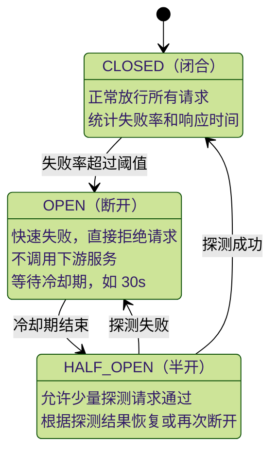
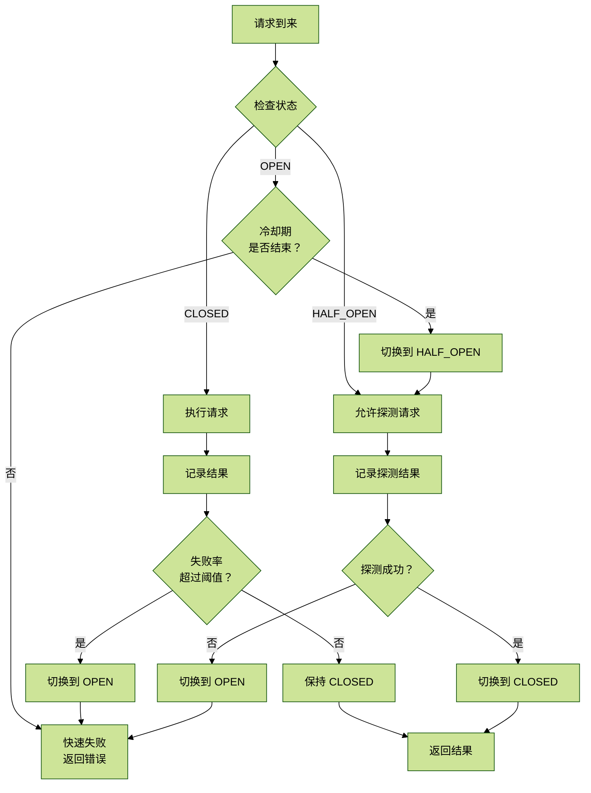

# 4.2 CircuitBreaker熔断器

## 目录

- [1. 概述](#1-概述)
- [2. 核心概念](#2-核心概念)
  - [2.1 熔断器状态机](#21-熔断器状态机)
  - [2.2 熔断决策流程](#22-熔断决策流程)
- [3. 核心实现](#3-核心实现)
  - [3.1 熔断器基础实现](#31-熔断器基础实现)
  - [3.2 装饰器用法](#32-装饰器用法)
  - [3.3 熔断器管理器](#33-熔断器管理器)
  - [3.4 与Retry组合使用](#34-与retry组合使用)
  - [3.5 实战案例：LLM调用熔断](#35-实战案例llm调用熔断)
- [4. 监控与告警](#4-监控与告警)
  - [4.1 熔断器监控端点](#41-熔断器监控端点)
- [5. 最佳实践](#5-最佳实践)
  - [5.1 熔断器配置建议](#51-熔断器配置建议)
  - [5.2 熔断恢复策略](#52-熔断恢复策略)
- [6. 总结](#6-总结)

## 1. 概述

熔断器（Circuit Breaker）是一种用于防止系统雪崩的保护机制。当下游服务出现故障或响应缓慢时，熔断器会自动切断请求，快速失败，避免故障扩散。本文档详细介绍熔断器的设计原理和企业级实现。

## 2. 核心概念

### 2.1 熔断器状态机



三种状态的含义：

| 状态 | 行为 | 转移条件 |
| --- | --- | --- |
| CLOSED（闭合） | 正常放行所有请求，并持续统计失败率和响应时间 | 失败次数或失败率超过阈值后进入 OPEN |
| OPEN（断开） | 快速失败，直接拒绝请求，不再调用下游服务 | 冷却期结束后进入 HALF_OPEN |
| HALF_OPEN（半开） | 允许少量探测请求通过 | 探测成功进入 CLOSED，探测失败回到 OPEN |

### 2.2 熔断决策流程



## 3. 核心实现

### 3.1 熔断器基础实现

```python
# app/core/circuit_breaker.py

import time
import threading
from enum import Enum
from typing import Callable, Optional, TypeVar, Any
from dataclasses import dataclass, field
from datetime import datetime
import logging

logger = logging.getLogger(__name__)

T = TypeVar("T")


class CircuitState(Enum):
    CLOSED = "closed"
    OPEN = "open"
    HALF_OPEN = "half_open"


@dataclass
class CircuitBreakerConfig:
    """熔断器配置"""

    failure_threshold: int = 5          # 连续失败阈值
    failure_rate_threshold: float = 0.5 # 失败率阈值
    min_calls: int = 10                 # 最小调用次数
    window_size: int = 60               # 统计窗口，单位秒
    open_timeout: int = 30              # OPEN 状态持续时间，单位秒
    half_open_max_calls: int = 3        # HALF_OPEN 最大探测请求数
    timeout: Optional[float] = None     # 单次调用超时时间
    excluded_exceptions: tuple = ()     # 不计入失败的异常


@dataclass
class CallRecord:
    """调用记录"""

    timestamp: float
    success: bool
    duration: float
    exception: Optional[Exception] = None


class CircuitBreakerOpenError(Exception):
    """熔断器处于打开状态"""

    pass


class CircuitBreaker:
    """企业级熔断器实现"""

    def __init__(self, name: str, config: Optional[CircuitBreakerConfig] = None):
        self.name = name
        self.config = config or CircuitBreakerConfig()
        self._state = CircuitState.CLOSED
        self._lock = threading.RLock()
        self._calls: list[CallRecord] = []
        self._last_failure_time: Optional[float] = None
        self._half_open_calls = 0
        self._state_changed_at = time.time()

    @property
    def state(self) -> CircuitState:
        with self._lock:
            self._update_state()
            return self._state

    def _update_state(self) -> None:
        """根据时间和统计结果更新状态"""

        now = time.time()

        if self._state == CircuitState.OPEN:
            if self._last_failure_time and now - self._last_failure_time >= self.config.open_timeout:
                self._change_state(CircuitState.HALF_OPEN)
                self._half_open_calls = 0

        elif self._state == CircuitState.CLOSED:
            self._clean_old_calls()
            if self._should_open():
                self._change_state(CircuitState.OPEN)
                self._last_failure_time = now

    def _change_state(self, new_state: CircuitState) -> None:
        """切换熔断器状态"""

        old_state = self._state
        self._state = new_state
        self._state_changed_at = time.time()
        logger.warning(
            "Circuit breaker %s state changed: %s -> %s",
            self.name,
            old_state.value,
            new_state.value,
        )

    def _clean_old_calls(self) -> None:
        """清理统计窗口外的调用记录"""

        cutoff = time.time() - self.config.window_size
        self._calls = [call for call in self._calls if call.timestamp >= cutoff]

    def _record_call(
        self,
        success: bool,
        duration: float,
        exception: Optional[Exception] = None,
    ) -> None:
        """记录一次调用结果"""

        record = CallRecord(
            timestamp=time.time(),
            success=success,
            duration=duration,
            exception=exception,
        )
        self._calls.append(record)
        self._clean_old_calls()

    def _get_failure_rate(self) -> float:
        """计算当前统计窗口内的失败率"""

        if not self._calls:
            return 0.0

        failures = sum(1 for call in self._calls if not call.success)
        return failures / len(self._calls)

    def _get_failure_count(self) -> int:
        """计算当前统计窗口内的失败次数"""

        return sum(1 for call in self._calls if not call.success)

    def _should_open(self) -> bool:
        """判断是否应该打开熔断器"""

        if len(self._calls) < self.config.min_calls:
            return False

        failure_count = self._get_failure_count()
        failure_rate = self._get_failure_rate()

        return (
            failure_count >= self.config.failure_threshold
            or failure_rate >= self.config.failure_rate_threshold
        )

    def _is_excluded_exception(self, exception: Exception) -> bool:
        """判断异常是否不计入失败"""

        return isinstance(exception, self.config.excluded_exceptions)

    def call(self, func: Callable[..., T], *args: Any, **kwargs: Any) -> T:
        """通过熔断器执行函数"""

        with self._lock:
            current_state = self.state

            if current_state == CircuitState.OPEN:
                raise CircuitBreakerOpenError(
                    f"Circuit breaker {self.name} is OPEN"
                )

            if current_state == CircuitState.HALF_OPEN:
                if self._half_open_calls >= self.config.half_open_max_calls:
                    raise CircuitBreakerOpenError(
                        f"Circuit breaker {self.name} is HALF_OPEN and probe limit reached"
                    )
                self._half_open_calls += 1

        start_time = time.time()

        try:
            result = func(*args, **kwargs)
            duration = time.time() - start_time

            with self._lock:
                self._record_call(success=True, duration=duration)

                if self._state == CircuitState.HALF_OPEN:
                    if self._half_open_calls >= self.config.half_open_max_calls:
                        self._change_state(CircuitState.CLOSED)
                        self._calls.clear()
                        self._half_open_calls = 0

            return result

        except Exception as exc:
            duration = time.time() - start_time

            with self._lock:
                if self._is_excluded_exception(exc):
                    self._record_call(success=True, duration=duration, exception=exc)
                else:
                    self._record_call(success=False, duration=duration, exception=exc)

                    if self._state == CircuitState.HALF_OPEN:
                        self._change_state(CircuitState.OPEN)
                        self._last_failure_time = time.time()
                    elif self._state == CircuitState.CLOSED and self._should_open():
                        self._change_state(CircuitState.OPEN)
                        self._last_failure_time = time.time()

            raise

    def __call__(self, func: Callable[..., T]) -> Callable[..., T]:
        """装饰器用法"""

        def wrapper(*args: Any, **kwargs: Any) -> T:
            return self.call(func, *args, **kwargs)

        wrapper.circuit_breaker = self
        return wrapper

    def get_metrics(self) -> dict[str, Any]:
        """获取熔断器指标"""

        with self._lock:
            self._clean_old_calls()

            total_calls = len(self._calls)
            failure_count = self._get_failure_count()
            success_count = total_calls - failure_count

            avg_duration = (
                sum(call.duration for call in self._calls) / total_calls
                if total_calls > 0
                else 0
            )

            return {
                "name": self.name,
                "state": self._state.value,
                "state_changed_at": datetime.fromtimestamp(
                    self._state_changed_at
                ).isoformat(),
                "total_calls": total_calls,
                "success_count": success_count,
                "failure_count": failure_count,
                "failure_rate": self._get_failure_rate(),
                "avg_duration": avg_duration,
                "half_open_calls": self._half_open_calls,
                "config": {
                    "failure_threshold": self.config.failure_threshold,
                    "failure_rate_threshold": self.config.failure_rate_threshold,
                    "min_calls": self.config.min_calls,
                    "window_size": self.config.window_size,
                    "open_timeout": self.config.open_timeout,
                    "half_open_max_calls": self.config.half_open_max_calls,
                },
            }
```

### 3.2 装饰器用法

```python
# app/core/circuit_breaker_decorator.py

from functools import wraps
from typing import Callable, Optional

from app.core.circuit_breaker import (
    CircuitBreaker,
    CircuitBreakerConfig,
    CircuitBreakerOpenError,
)


def circuit_breaker(
    name: Optional[str] = None,
    failure_threshold: int = 5,
    failure_rate_threshold: float = 0.5,
    min_calls: int = 10,
    window_size: int = 60,
    open_timeout: int = 30,
    half_open_max_calls: int = 3,
    excluded_exceptions: tuple = (),
) -> Callable:
    """熔断器装饰器"""

    def decorator(func: Callable) -> Callable:
        breaker_name = name or f"{func.__module__}.{func.__name__}"
        config = CircuitBreakerConfig(
            failure_threshold=failure_threshold,
            failure_rate_threshold=failure_rate_threshold,
            min_calls=min_calls,
            window_size=window_size,
            open_timeout=open_timeout,
            half_open_max_calls=half_open_max_calls,
            excluded_exceptions=excluded_exceptions,
        )
        breaker = CircuitBreaker(breaker_name, config)

        @wraps(func)
        def wrapper(*args, **kwargs):
            return breaker.call(func, *args, **kwargs)

        wrapper.circuit_breaker = breaker
        return wrapper

    return decorator


@circuit_breaker(
    failure_threshold=5,
    failure_rate_threshold=0.5,
    open_timeout=30,
)
def call_unstable_api(url: str) -> dict:
    import requests

    response = requests.get(url, timeout=10)
    response.raise_for_status()
    return response.json()


def check_circuit_breaker_status() -> dict:
    """查看装饰器绑定的熔断器状态"""

    breaker = call_unstable_api.circuit_breaker
    return breaker.get_metrics()
```

### 3.3 熔断器管理器

```python
# app/core/circuit_breaker_manager.py

import threading
from typing import Optional

from app.core.circuit_breaker import CircuitBreaker, CircuitBreakerConfig, CircuitState


class CircuitBreakerManager:
    """全局熔断器管理器"""

    _instance = None
    _lock = threading.Lock()

    def __new__(cls):
        if cls._instance is None:
            with cls._lock:
                if cls._instance is None:
                    cls._instance = super().__new__(cls)
                    cls._instance._breakers = {}
        return cls._instance

    def register(
        self,
        name: str,
        config: Optional[CircuitBreakerConfig] = None,
    ) -> CircuitBreaker:
        """注册熔断器"""

        if name in self._breakers:
            return self._breakers[name]

        breaker = CircuitBreaker(name, config)
        self._breakers[name] = breaker
        return breaker

    def get(self, name: str) -> Optional[CircuitBreaker]:
        """获取熔断器"""

        return self._breakers.get(name)

    def get_or_create(
        self,
        name: str,
        config: Optional[CircuitBreakerConfig] = None,
    ) -> CircuitBreaker:
        """获取或创建熔断器"""

        breaker = self.get(name)
        if breaker is None:
            breaker = self.register(name, config)
        return breaker

    def get_all_metrics(self) -> dict:
        """获取所有熔断器指标"""

        return {
            name: breaker.get_metrics()
            for name, breaker in self._breakers.items()
        }

    def get_open_breakers(self) -> list[str]:
        """获取所有打开状态的熔断器"""

        return [
            name
            for name, breaker in self._breakers.items()
            if breaker.state.value == "open"
        ]

    def reset(self, name: str) -> bool:
        """重置指定熔断器"""

        breaker = self.get(name)
        if breaker is None:
            return False

        breaker._state = CircuitState.CLOSED
        breaker._calls.clear()
        breaker._half_open_calls = 0
        breaker._last_failure_time = None
        return True

    def reset_all(self) -> None:
        """重置全部熔断器"""

        for name in list(self._breakers.keys()):
            self.reset(name)


circuit_breaker_manager = CircuitBreakerManager()


def call_service_a():
    breaker = circuit_breaker_manager.get_or_create(
        "service_a",
        CircuitBreakerConfig(
            failure_threshold=3,
            failure_rate_threshold=0.4,
            open_timeout=60,
        ),
    )
    return breaker.call(lambda: "service_a_result")


def call_service_b():
    breaker = circuit_breaker_manager.get_or_create(
        "service_b",
        CircuitBreakerConfig(
            failure_threshold=5,
            failure_rate_threshold=0.5,
            open_timeout=30,
        ),
    )
    return breaker.call(lambda: "service_b_result")


def monitor_all_breakers() -> dict:
    """统一监控所有熔断器"""

    return {
        "metrics": circuit_breaker_manager.get_all_metrics(),
        "open_breakers": circuit_breaker_manager.get_open_breakers(),
    }
```

### 3.4 与Retry组合使用

熔断器通常与重试机制组合使用，但二者的顺序很重要：

1. 先检查熔断器状态。
2. 如果熔断器打开，快速失败。
3. 如果熔断器闭合，执行重试逻辑。
4. 根据执行结果更新熔断器状态。

```python
# app/core/retry_with_circuit_breaker.py

from functools import wraps
from typing import Callable, Optional

from app.core.retry import RetryConfig, retry
from app.core.circuit_breaker import CircuitBreaker, CircuitBreakerConfig


def retry_with_circuit_breaker(
    retry_config: Optional[RetryConfig] = None,
    breaker_config: Optional[CircuitBreakerConfig] = None,
    name: Optional[str] = None,
) -> Callable:
    """重试 + 熔断组合装饰器"""

    def decorator(func: Callable) -> Callable:
        breaker_name = name or f"{func.__module__}.{func.__name__}"
        breaker = CircuitBreaker(breaker_name, breaker_config)
        retry_decorator = retry(retry_config)

        @wraps(func)
        def wrapper(*args, **kwargs):
            retry_wrapped_func = retry_decorator(func)
            return breaker.call(retry_wrapped_func, *args, **kwargs)

        wrapper.circuit_breaker = breaker
        return wrapper

    return decorator


@retry_with_circuit_breaker(
    retry_config=RetryConfig(
        max_attempts=3,
        base_delay=1.0,
        exponential_base=2.0,
    ),
    breaker_config=CircuitBreakerConfig(
        failure_threshold=5,
        failure_rate_threshold=0.5,
        open_timeout=30,
    ),
)
def call_critical_api(endpoint: str) -> dict:
    import requests

    response = requests.get(endpoint, timeout=10)
    response.raise_for_status()
    return response.json()
```

### 3.5 实战案例：LLM调用熔断

```python
# app/service/llm_circuit_breaker.py

import os
from typing import Optional

from openai import OpenAI

from app.core.circuit_breaker import (
    CircuitBreaker,
    CircuitBreakerConfig,
    CircuitBreakerOpenError,
)


class LLMCircuitBreaker:
    """LLM 调用熔断保护"""

    def __init__(self):
        self.gpt4_breaker = CircuitBreaker(
            "llm_gpt4",
            CircuitBreakerConfig(
                failure_threshold=3,
                failure_rate_threshold=0.3,
                open_timeout=60,
                min_calls=5,
                excluded_exceptions=(ValueError, TypeError),
            ),
        )

        self.deepseek_breaker = CircuitBreaker(
            "llm_deepseek",
            CircuitBreakerConfig(
                failure_threshold=5,
                failure_rate_threshold=0.5,
                open_timeout=30,
                min_calls=10,
            ),
        )

        self.openai_client = OpenAI(api_key=os.getenv("OPENAI_API_KEY"))
        self.deepseek_client = OpenAI(
            api_key=os.getenv("DASHSCOPE_API_KEY"),
            base_url="https://dashscope.aliyuncs.com/compatible-mode/v1",
        )

    def call_gpt4(self, prompt: str, model: str = "gpt-4") -> str:
        """调用 GPT-4"""

        def _call():
            response = self.openai_client.chat.completions.create(
                model=model,
                messages=[{"role": "user", "content": prompt}],
                temperature=0.7,
            )
            return response.choices[0].message.content

        return self.gpt4_breaker.call(_call)

    def call_deepseek(self, prompt: str, model: str = "deepseek-v3") -> str:
        """调用 DeepSeek"""

        def _call():
            response = self.deepseek_client.chat.completions.create(
                model=model,
                messages=[{"role": "user", "content": prompt}],
                temperature=0.7,
            )
            return response.choices[0].message.content

        return self.deepseek_breaker.call(_call)

    def call_with_fallback(self, prompt: str) -> str:
        """优先 GPT-4，熔断后降级到 DeepSeek"""

        try:
            return self.call_gpt4(prompt)
        except CircuitBreakerOpenError:
            return self.call_deepseek(prompt)
        except Exception:
            try:
                return self.call_deepseek(prompt)
            except CircuitBreakerOpenError:
                return "LLM service is temporarily unavailable"

    def get_status(self) -> dict:
        """获取 LLM 熔断器状态"""

        return {
            "gpt4": self.gpt4_breaker.get_metrics(),
            "deepseek": self.deepseek_breaker.get_metrics(),
        }


llm_circuit_breaker = LLMCircuitBreaker()


def analyze_with_llm(content: str) -> str:
    """业务调用入口"""

    prompt = f"请分析以下内容：\n\n{content}"
    return llm_circuit_breaker.call_with_fallback(prompt)
```

## 4. 监控与告警

### 4.1 熔断器监控端点

```python
# app/api/circuit_breaker_monitor.py

from fastapi import APIRouter, HTTPException

from app.core.circuit_breaker_manager import circuit_breaker_manager

router = APIRouter(prefix="/api/circuit-breakers", tags=["monitoring"])


@router.get("/")
async def get_all_circuit_breakers():
    """获取所有熔断器状态"""

    return circuit_breaker_manager.get_all_metrics()


@router.get("/{name}")
async def get_circuit_breaker(name: str):
    """获取指定熔断器状态"""

    breaker = circuit_breaker_manager.get(name)
    if breaker is None:
        raise HTTPException(status_code=404, detail="Circuit breaker not found")

    return breaker.get_metrics()


@router.post("/{name}/reset")
async def reset_circuit_breaker(name: str):
    """重置指定熔断器"""

    success = circuit_breaker_manager.reset(name)
    if not success:
        raise HTTPException(status_code=404, detail="Circuit breaker not found")

    return {"message": f"Circuit breaker {name} reset successfully"}


@router.get("/status/open")
async def get_open_circuit_breakers():
    """获取所有打开状态的熔断器"""

    open_breakers = circuit_breaker_manager.get_open_breakers()
    return {
        "count": len(open_breakers),
        "breakers": open_breakers,
    }
```

## 5. 最佳实践

### 5.1 熔断器配置建议

```python
# app/config/circuit_breaker_profiles.py

from app.core.circuit_breaker import CircuitBreakerConfig


class CircuitBreakerProfiles:
    """常用熔断器配置预设"""

    SENSITIVE = CircuitBreakerConfig(
        failure_threshold=3,
        failure_rate_threshold=0.3,
        min_calls=5,
        window_size=30,
        open_timeout=60,
    )

    STANDARD = CircuitBreakerConfig(
        failure_threshold=5,
        failure_rate_threshold=0.5,
        min_calls=10,
        window_size=60,
        open_timeout=30,
    )

    TOLERANT = CircuitBreakerConfig(
        failure_threshold=10,
        failure_rate_threshold=0.7,
        min_calls=20,
        window_size=120,
        open_timeout=20,
    )
```

配置预设对比：

| 配置 | 适用服务 | failure_threshold | failure_rate_threshold | min_calls | window_size | open_timeout |
| --- | --- | ---: | ---: | ---: | ---: | ---: |
| SENSITIVE | 敏感服务（快速熔断） | 3 | 0.3 | 5 | 30 | 60 |
| STANDARD | 标准服务 | 5 | 0.5 | 10 | 60 | 30 |
| TOLERANT | 容错服务（慢速熔断） | 10 | 0.7 | 20 | 120 | 20 |

### 5.2 熔断恢复策略

```python
# app/core/circuit_breaker_recovery.py

import random
import logging

from app.core.circuit_breaker import (
    CircuitBreaker,
    CircuitBreakerConfig,
    CircuitBreakerOpenError,
    CircuitState,
)

logger = logging.getLogger(__name__)


class GradualRecoveryCircuitBreaker(CircuitBreaker):
    """渐进式恢复熔断器"""

    def __init__(self, name: str, config: CircuitBreakerConfig):
        super().__init__(name, config)
        self._recovery_percentage = 0.1

    def call(self, func, *args, **kwargs):
        with self._lock:
            current_state = self.state

            if current_state == CircuitState.HALF_OPEN:
                if random.random() > self._recovery_percentage:
                    raise CircuitBreakerOpenError(
                        "In gradual recovery, request rejected"
                    )

        try:
            result = super().call(func, *args, **kwargs)

            with self._lock:
                if self._state == CircuitState.HALF_OPEN:
                    self._recovery_percentage = min(
                        1.0,
                        self._recovery_percentage + 0.1,
                    )
                    logger.info(
                        "Circuit breaker %s recovery percentage increased to %.0f%%",
                        self.name,
                        self._recovery_percentage * 100,
                    )

            return result

        except Exception:
            with self._lock:
                self._recovery_percentage = 0.1
            raise
```

恢复策略建议：

| 策略 | 说明 | 适用场景 |
| --- | --- | --- |
| 固定冷却期 | OPEN 状态持续固定时间后进入 HALF_OPEN | 简单服务、故障恢复时间相对稳定 |
| 渐进式恢复 | HALF_OPEN 阶段逐步增加放行比例 | 下游服务可能刚恢复、需要避免瞬时压垮 |
| 分级降级 | 熔断后走备用模型、缓存或静态结果 | LLM、搜索、推荐等用户体验敏感链路 |
| 人工干预 | 熔断长时间未恢复时触发告警和人工处理 | 核心链路、资金链路、生产关键依赖 |

## 6. 总结

熔断器是防止系统雪崩的关键机制。本文档提供了完整的企业级实现，包括：

1. 三态状态机：CLOSED / OPEN / HALF_OPEN。
2. 智能决策：基于失败率和失败次数。
3. 渐进恢复：HALF_OPEN 状态的探测机制。
4. 全局管理：统一的熔断器管理器。
5. 组合使用：与重试、降级机制配合。

在实际应用中，应根据服务特点调整熔断参数，并配合完善的监控告警体系。
