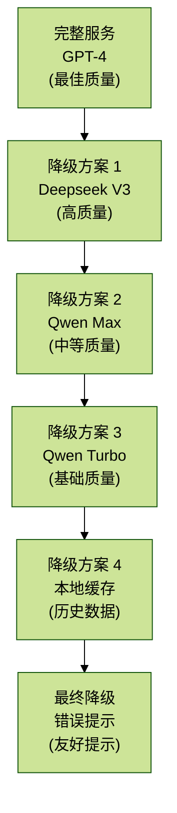
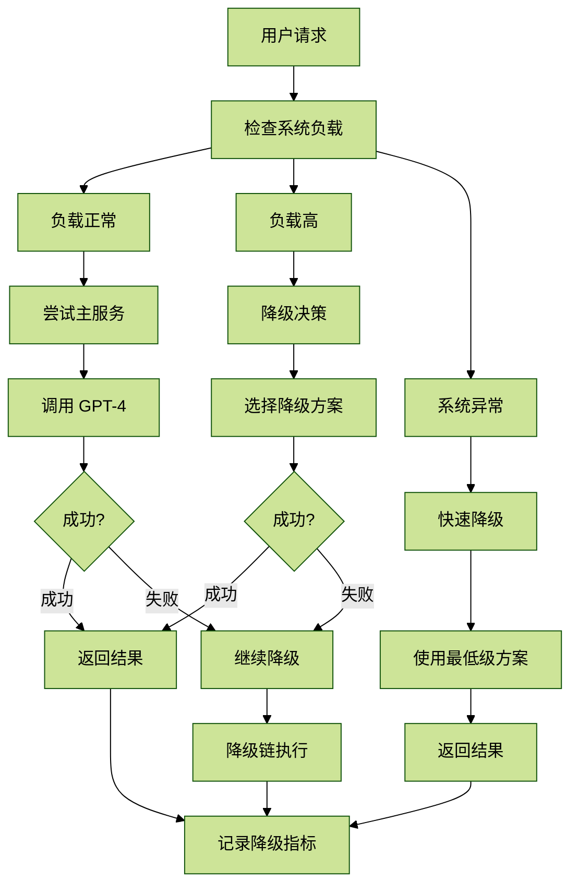

# 4.3 Fallback降级策略

## 目录

- [概述](#概述)
- [核心概念](#核心概念)
  - [降级策略层次](#降级策略层次)
  - [降级决策流程](#降级决策流程)
- [核心实现](#核心实现)
  - [1. 降级策略基础框架](#1-降级策略基础框架)
  - [2. LLM模型降级链](#2-llm模型降级链)
  - [3. 服务降级策略](#3-服务降级策略)
  - [4. 数据降级策略](#4-数据降级策略)
  - [5. 智能降级决策](#5-智能降级决策)
- [监控与告警](#监控与告警)
  - [降级监控面板](#降级监控面板)
- [最佳实践](#最佳实践)
  - [1. 降级策略选择指南](#1-降级策略选择指南)
- [总结](#总结)

## 概述

降级（Fallback）是一种保护机制，当主要服务不可用时，自动切换到备用方案，确保系统基本功能可用。本文档详细介绍多层次降级策略的设计与实现，包括模型降级、服务降级、数据降级等。

## 核心概念

### 降级策略层次



### 降级决策流程



## 核心实现

### 1. 降级策略基础框架

```python
# app/core/fallback.py

import logging
from typing import Callable, TypeVar, Optional, List, Any
from dataclasses import dataclass
from abc import ABC, abstractmethod
from enum import Enum

logger = logging.getLogger(__name__)

T = TypeVar('T')


class FallbackLevel(Enum):
    """降级级别"""
    PRIMARY = "primary"        # 主服务
    SECONDARY = "secondary"    # 次级服务
    TERTIARY = "tertiary"      # 第三级
    CACHE = "cache"            # 缓存
    STATIC = "static"          # 静态数据
    ERROR = "error"            # 错误响应


@dataclass
class FallbackResult:
    """降级结果"""
    success: bool
    level: FallbackLevel
    data: Any
    error: Optional[Exception] = None
    execution_time: float = 0.0
    attempts: int = 1


class FallbackStrategy(ABC):
    """降级策略抽象基类"""

    def __init__(self, name: str, level: FallbackLevel):
        self.name = name
        self.level = level

    @abstractmethod
    def execute(self, *args, **kwargs) -> Any:
        """执行降级策略"""
        pass

    def __call__(self, *args, **kwargs) -> Any:
        """使策略可调用"""
        return self.execute(*args, **kwargs)


class FallbackChain:
    """降级链"""

    def __init__(self, strategies: Optional[List[FallbackStrategy]] = None):
        self.strategies = strategies or []

    def add_strategy(self, strategy: FallbackStrategy):
        """添加降级策略"""
        self.strategies.append(strategy)
        # 按级别排序
        self.strategies.sort(key=lambda s: list(FallbackLevel).index(s.level))

    def execute(self, *args, **kwargs) -> FallbackResult:
        """
        执行降级链
        按顺序尝试每个策略，直到成功或全部失败
        """
        import time

        total_start = time.time()
        attempts = 0

        for strategy in self.strategies:
            attempts += 1
            start = time.time()

            try:
                logger.info(
                    f"Trying fallback strategy: {strategy.name} "
                    f"(level: {strategy.level.value})"
                )

                result = strategy.execute(*args, **kwargs)
                execution_time = time.time() - start

                logger.info(
                    f"Fallback strategy {strategy.name} succeeded "
                    f"in {execution_time:.2f}s"
                )

                return FallbackResult(
                    success=True,
                    level=strategy.level,
                    data=result,
                    execution_time=time.time() - total_start,
                    attempts=attempts,
                )

            except Exception as e:
                execution_time = time.time() - start
                logger.warning(
                    f"Fallback strategy {strategy.name} failed "
                    f"in {execution_time:.2f}s: {e}"
                )

                # 如果是最后一个策略，返回失败结果
                if strategy == self.strategies[-1]:
                    return FallbackResult(
                        success=False,
                        level=FallbackLevel.ERROR,
                        data=None,
                        error=e,
                        execution_time=time.time() - total_start,
                        attempts=attempts,
                    )

        # 不应该到达这里
        return FallbackResult(
            success=False,
            level=FallbackLevel.ERROR,
            data=None,
            error=Exception("No fallback strategies available"),
            execution_time=time.time() - total_start,
            attempts=0,
        )


class FallbackDecorator:
    """降级装饰器"""

    def __init__(self, chain: FallbackChain):
        self.chain = chain

    def __call__(self, func: Callable[..., T]) -> Callable[..., FallbackResult]:
        """装饰器"""
        def wrapper(*args, **kwargs) -> FallbackResult:
            return self.chain.execute(*args, **kwargs)

        return wrapper
```

### 2. LLM模型降级链

```python
# app/service/llm_fallback.py

import logging
from typing import Optional, Dict, Any
import os
from openai import OpenAI

from app.core.fallback import (
    FallbackStrategy,
    FallbackChain,
    FallbackLevel,
    FallbackResult,
)

logger = logging.getLogger(__name__)


class GPT4Strategy(FallbackStrategy):
    """GPT策略（最高质量）"""

    def __init__(self):
        super().__init__("GPT-4", FallbackLevel.PRIMARY)
        self.client = OpenAI(api_key=os.getenv("OPENAI_API_KEY"))

    def execute(self, prompt: str, **kwargs) -> str:
        """执行GPT调用"""
        response = self.client.chat.completions.create(
            model="gpt-5",
            messages=[{"role": "user", "content": prompt}],
            temperature=kwargs.get("temperature", 0.7),
            max_tokens=kwargs.get("max_tokens", 2000),
            timeout=60.0,
        )

        return response.choices[0].message.content


class DeepseekStrategy(FallbackStrategy):
    """Deepseek策略（高质量）"""

    def __init__(self):
        super().__init__("Deepseek V3", FallbackLevel.SECONDARY)
        self.client = OpenAI(
            api_key=os.getenv("DASHSCOPE_API_KEY"),
            base_url="https://dashscope.aliyuncs.com/compatible-mode/v1"
        )

    def execute(self, prompt: str, **kwargs) -> str:
        """执行Deepseek调用"""
        response = self.client.chat.completions.create(
            model="deepseek-chat",
            messages=[{"role": "user", "content": prompt}],
            temperature=kwargs.get("temperature", 0.7),
            max_tokens=kwargs.get("max_tokens", 2000),
            timeout=60.0,
        )

        return response.choices[0].message.content


class QwenMaxStrategy(FallbackStrategy):
    """Qwen Max策略（中等质量）"""

    def __init__(self):
        super().__init__("Qwen-Max", FallbackLevel.TERTIARY)
        self.client = OpenAI(
            api_key=os.getenv("DASHSCOPE_API_KEY"),
            base_url="https://dashscope.aliyuncs.com/compatible-mode/v1"
        )

    def execute(self, prompt: str, **kwargs) -> str:
        """执行Qwen Max调用"""
        response = self.client.chat.completions.create(
            model="qwen-max",
            messages=[{"role": "user", "content": prompt}],
            temperature=kwargs.get("temperature", 0.7),
            max_tokens=kwargs.get("max_tokens", 2000),
            timeout=45.0,
        )

        return response.choices[0].message.content


class QwenTurboStrategy(FallbackStrategy):
    """Qwen Turbo策略（基础质量）"""

    def __init__(self):
        super().__init__("Qwen-Turbo", FallbackLevel.TERTIARY)
        self.client = OpenAI(
            api_key=os.getenv("DASHSCOPE_API_KEY"),
            base_url="https://dashscope.aliyuncs.com/compatible-mode/v1"
        )

    def execute(self, prompt: str, **kwargs) -> str:
        """执行Qwen Turbo调用"""
        response = self.client.chat.completions.create(
            model="qwen-turbo",
            messages=[{"role": "user", "content": prompt}],
            temperature=kwargs.get("temperature", 0.7),
            max_tokens=kwargs.get("max_tokens", 2000),
            timeout=30.0,
        )

        return response.choices[0].message.content


class CacheStrategy(FallbackStrategy):
    """缓存策略"""

    def __init__(self, cache_backend):
        super().__init__("Cache", FallbackLevel.CACHE)
        self.cache = cache_backend

    def execute(self, prompt: str, **kwargs) -> str:
        """从缓存获取结果"""
        import hashlib

        # 生成缓存键
        cache_key = hashlib.sha256(prompt.encode()).hexdigest()

        # 查询缓存
        cached_result = self.cache.get(f"llm_cache:{cache_key}")

        if cached_result:
            logger.info(f"Cache hit for prompt: {prompt[:50]}...")
            return cached_result

        raise Exception("Cache miss")


class StaticResponseStrategy(FallbackStrategy):
    """静态响应策略（兜底）"""

    def __init__(self):
        super().__init__("Static Response", FallbackLevel.STATIC)

    def execute(self, prompt: str, **kwargs) -> str:
        """返回静态响应"""
        return (
            "抱歉，当前所有AI服务暂时不可用。"
            "我们正在努力恢复服务，请稍后重试。\n\n"
            "您也可以：\n"
            "1. 查看历史研究报告\n"
            "2. 使用基础搜索功能\n"
            "3. 联系客服获取帮助"
        )


class LLMFallbackService:
    """LLM降级服务"""

    def __init__(self, cache_backend=None):
        # 构建降级链
        self.chain = FallbackChain()

        # 添加策略（按优先级）
        self.chain.add_strategy(GPT4Strategy())
        self.chain.add_strategy(DeepseekStrategy())
        self.chain.add_strategy(QwenMaxStrategy())
        self.chain.add_strategy(QwenTurboStrategy())

        if cache_backend:
            self.chain.add_strategy(CacheStrategy(cache_backend))

        # 最后的兜底策略
        self.chain.add_strategy(StaticResponseStrategy())

    def call(
        self,
        prompt: str,
        temperature: float = 0.7,
        max_tokens: int = 2000,
    ) -> FallbackResult:
        """
        调用LLM（带降级）

        Returns:
            FallbackResult包含：
            - success: 是否成功
            - level: 使用的降级级别
            - data: 返回的数据
            - execution_time: 执行时间
            - attempts: 尝试次数
        """
        result = self.chain.execute(
            prompt=prompt,
            temperature=temperature,
            max_tokens=max_tokens,
        )

        # 记录降级指标
        self._record_metrics(result)

        return result

    def _record_metrics(self, result: FallbackResult):
        """记录降级指标"""
        logger.info(
            f"LLM Fallback Result: "
            f"level={result.level.value}, "
            f"success={result.success}, "
            f"attempts={result.attempts}, "
            f"time={result.execution_time:.2f}s"
        )

        # TODO: 发送到监控系统
        # prometheus_counter.inc(labels={"level": result.level.value})


# 使用示例
from redis import Redis

redis_client = Redis(host='localhost', port=6379, decode_responses=True)
llm_fallback = LLMFallbackService(cache_backend=redis_client)


def analyze_industry_with_fallback(industry: str, query: str) -> str:
    """
    使用LLM分析行业（带降级）
    """
    prompt = f"""
    请分析以下行业和问题：

    行业: {industry}
    问题: {query}

    请提供详细的分析报告。
    """

    result = llm_fallback.call(prompt, temperature=0.7, max_tokens=2000)

    if result.success:
        logger.info(f"Analysis completed using {result.level.value}")
        return result.data
    else:
        logger.error(f"Analysis failed after {result.attempts} attempts")
        return result.data or "分析失败，请稍后重试"
```

### 3. 服务降级策略

```python
# app/core/service_fallback.py

import logging
from typing import Optional, Callable, TypeVar, Any, List
from functools import wraps
import time

from app.core.fallback import FallbackStrategy, FallbackChain, FallbackLevel

logger = logging.getLogger(__name__)

T = TypeVar('T')


class ServiceDegradation:
    """服务降级管理器"""

    def __init__(self):
        self._degraded_services: set[str] = set()
        self._degradation_config: dict[str, dict] = {}

    def register_service(
        self,
        service_name: str,
        primary_func: Callable,
        fallback_func: Callable,
        degradation_threshold: float = 0.5,
    ):
        """
        注册服务降级配置

        Args:
            service_name: 服务名称
            primary_func: 主服务函数
            fallback_func: 降级函数
            degradation_threshold: 降级阈值（失败率）
        """
        self._degradation_config[service_name] = {
            "primary": primary_func,
            "fallback": fallback_func,
            "threshold": degradation_threshold,
            "failure_count": 0,
            "success_count": 0,
        }

    def is_degraded(self, service_name: str) -> bool:
        """检查服务是否已降级"""
        return service_name in self._degraded_services

    def degrade_service(self, service_name: str):
        """降级服务"""
        if service_name not in self._degraded_services:
            self._degraded_services.add(service_name)
            logger.warning(f"Service {service_name} degraded")

    def restore_service(self, service_name: str):
        """恢复服务"""
        if service_name in self._degraded_services:
            self._degraded_services.remove(service_name)
            logger.info(f"Service {service_name} restored")

    def call_with_degradation(
        self,
        service_name: str,
        *args,
        **kwargs
    ) -> Any:
        """
        调用服务（带降级）
        """
        if service_name not in self._degradation_config:
            raise ValueError(f"Service {service_name} not registered")

        config = self._degradation_config[service_name]

        # 如果已降级，直接使用降级函数
        if self.is_degraded(service_name):
            logger.info(f"Using fallback for degraded service: {service_name}")
            return config["fallback"](*args, **kwargs)

        # 尝试主要服务
        try:
            result = config["primary"](*args, **kwargs)
            config["success_count"] += 1

            # 检查是否可以恢复
            total = config["success_count"] + config["failure_count"]
            if total > 10:  # 至少10次调用后才考虑恢复
                success_rate = config["success_count"] / total
                if success_rate > 0.9:  # 成功率超过90%
                    self.restore_service(service_name)
                    # 重置计数器
                    config["success_count"] = 0
                    config["failure_count"] = 0

            return result

        except Exception as e:
            config["failure_count"] += 1
            logger.warning(f"Service {service_name} call failed: {e}")

            # 检查是否需要降级
            total = config["success_count"] + config["failure_count"]
            if total > 5:  # 至少5次调用后才考虑降级
                failure_rate = config["failure_count"] / total
                if failure_rate >= config["threshold"]:
                    self.degrade_service(service_name)

            # 使用降级函数
            logger.info(f"Using fallback for service: {service_name}")
            return config["fallback"](*args, **kwargs)


# 全局实例
service_degradation = ServiceDegradation()


# 使用示例
def get_real_time_data(stock_code: str) -> dict:
    """获取实时股票数据（主服务）"""
    import requests

    response = requests.get(
        f"https://api.example.com/stock/{stock_code}",
        timeout=5
    )
    response.raise_for_status()
    return response.json()


def get_cached_data(stock_code: str) -> dict:
    """获取缓存数据（降级服务）"""
    from redis import Redis

    redis_client = Redis(host='localhost', port=6379, decode_responses=True)
    cached = redis_client.get(f"stock:{stock_code}")

    if cached:
        import json
        return json.loads(cached)

    return {
        "code": stock_code,
        "price": "N/A",
        "message": "数据暂时不可用，请稍后重试",
    }


# 注册服务降级配置
service_degradation.register_service(
    "stock_data",
    primary_func=get_real_time_data,
    fallback_func=get_cached_data,
    degradation_threshold=0.5,
)


def fetch_stock_data(stock_code: str) -> dict:
    """获取股票数据（带自动降级）"""
    return service_degradation.call_with_degradation(
        "stock_data",
        stock_code=stock_code
    )
```

### 4. 数据降级策略

```python
# app/core/data_fallback.py

import logging
from typing import Optional, Any, List, Dict
from datetime import datetime, timedelta
from enum import Enum

logger = logging.getLogger(__name__)


class DataQuality(Enum):
    """数据质量等级"""
    REAL_TIME = "real_time"          # 实时数据
    NEAR_REAL_TIME = "near_real_time"  # 准实时（延迟<1分钟）
    RECENT = "recent"                # 最近数据（延迟<1小时）
    CACHED = "cached"                # 缓存数据（延迟<24小时）
    HISTORICAL = "historical"        # 历史数据
    STATIC = "static"                # 静态数据


class DataFallbackStrategy:
    """数据降级策略"""

    def __init__(self, redis_client, db_session):
        self.redis = redis_client
        self.db = db_session

    def get_data_with_fallback(
        self,
        data_key: str,
        fetch_func: Optional[callable] = None,
        max_age: int = 3600,
    ) -> tuple[Any, DataQuality]:
        """
        获取数据（带降级）

        降级顺序：
        1. 实时获取
        2. Redis缓存
        3. 数据库历史数据
        4. 静态默认值

        Args:
            data_key: 数据键
            fetch_func: 获取实时数据的函数
            max_age: 最大缓存时间（秒）

        Returns:
            (数据, 数据质量等级)
        """
        # 1. 尝试实时获取
        if fetch_func:
            try:
                data = fetch_func()
                # 缓存到Redis
                self._cache_data(data_key, data)
                logger.info(f"Fetched real-time data for {data_key}")
                return data, DataQuality.REAL_TIME
            except Exception as e:
                logger.warning(f"Failed to fetch real-time data: {e}")

        # 2. 尝试Redis缓存
        try:
            cached = self._get_cached_data(data_key)
            if cached:
                cache_age = cached.get("_cache_age", 0)
                if cache_age < 60:
                    logger.info(f"Using near-real-time cached data for {data_key}")
                    return cached, DataQuality.NEAR_REAL_TIME
                elif cache_age < 3600:
                    logger.info(f"Using recent cached data for {data_key}")
                    return cached, DataQuality.RECENT
                elif cache_age < max_age:
                    logger.info(f"Using cached data for {data_key}")
                    return cached, DataQuality.CACHED
        except Exception as e:
            logger.warning(f"Failed to get cached data: {e}")

        # 3. 尝试数据库历史数据
        try:
            historical = self._get_historical_data(data_key)
            if historical:
                logger.info(f"Using historical data for {data_key}")
                return historical, DataQuality.HISTORICAL
        except Exception as e:
            logger.warning(f"Failed to get historical data: {e}")

        # 4. 返回静态默认值
        logger.warning(f"Using static fallback for {data_key}")
        return self._get_static_fallback(data_key), DataQuality.STATIC

    def _cache_data(self, key: str, data: Any):
        """缓存数据到Redis"""
        import json

        data_with_timestamp = {
            **data,
            "_cached_at": datetime.now().isoformat(),
        }

        self.redis.setex(
            f"data:{key}",
            3600,  # 1小时过期
            json.dumps(data_with_timestamp, default=str)
        )

    def _get_cached_data(self, key: str) -> Optional[dict]:
        """从Redis获取缓存数据"""
        import json

        cached = self.redis.get(f"data:{key}")
        if not cached:
            return None

        data = json.loads(cached)

        # 计算缓存年龄
        cached_at = datetime.fromisoformat(data.get("_cached_at", datetime.now().isoformat()))
        cache_age = (datetime.now() - cached_at).total_seconds()
        data["_cache_age"] = cache_age

        return data

    def _get_historical_data(self, key: str) -> Optional[dict]:
        """从数据库获取历史数据"""
        # TODO: 实现数据库查询逻辑
        return None

    def _get_static_fallback(self, key: str) -> dict:
        """获取静态默认值"""
        return {
            "error": "数据暂时不可用",
            "message": "系统正在维护中，请稍后重试",
            "timestamp": datetime.now().isoformat(),
        }


# 使用示例
from redis import Redis
from app.database import get_db

redis_client = Redis(host='localhost', port=6379, decode_responses=True)
db = next(get_db())

data_fallback = DataFallbackStrategy(redis_client, db)


def get_market_overview() -> dict:
    """
    获取市场概况（带数据降级）
    """
    def fetch_real_time():
        import requests
        response = requests.get("https://api.example.com/market/overview", timeout=5)
        response.raise_for_status()
        return response.json()

    data, quality = data_fallback.get_data_with_fallback(
        data_key="market_overview",
        fetch_func=fetch_real_time,
        max_age=3600,
    )

    # 在响应中标注数据质量
    data["_data_quality"] = quality.value

    return data
```

### 5. 智能降级决策

```python
# app/core/smart_fallback.py

import logging
from typing import Optional, Callable, TypeVar, Any
from dataclasses import dataclass
from datetime import datetime, timedelta
import time

logger = logging.getLogger(__name__)

T = TypeVar('T')


@dataclass
class SystemMetrics:
    """系统指标"""
    cpu_usage: float
    memory_usage: float
    request_rate: float
    error_rate: float
    avg_response_time: float


class SmartFallbackManager:
    """智能降级管理器"""

    def __init__(self):
        self._current_level = 0  # 0=正常，1-5=降级级别
        self._degradation_history: list[dict] = []

    def get_system_metrics(self) -> SystemMetrics:
        """获取系统指标"""
        import psutil

        cpu_percent = psutil.cpu_percent(interval=1)
        memory_percent = psutil.virtual_memory().percent

        # TODO: 从监控系统获取其他指标
        return SystemMetrics(
            cpu_usage=cpu_percent,
            memory_usage=memory_percent,
            request_rate=0.0,
            error_rate=0.0,
            avg_response_time=0.0,
        )

    def calculate_degradation_level(self, metrics: SystemMetrics) -> int:
        """
        根据系统指标计算降级级别

        级别：
        0 - 正常
        1 - 轻度降级（降低部分非关键功能）
        2 - 中度降级（关闭部分功能）
        3 - 重度降级（只保留核心功能）
        4 - 极度降级（只读模式）
        5 - 停服（维护模式）
        """
        level = 0

        # CPU使用率
        if metrics.cpu_usage > 90:
            level = max(level, 3)
        elif metrics.cpu_usage > 80:
            level = max(level, 2)
        elif metrics.cpu_usage > 70:
            level = max(level, 1)

        # 内存使用率
        if metrics.memory_usage > 90:
            level = max(level, 3)
        elif metrics.memory_usage > 80:
            level = max(level, 2)

        # 错误率
        if metrics.error_rate > 0.5:
            level = max(level, 4)
        elif metrics.error_rate > 0.3:
            level = max(level, 3)
        elif metrics.error_rate > 0.1:
            level = max(level, 2)

        # 响应时间
        if metrics.avg_response_time > 10:
            level = max(level, 2)
        elif metrics.avg_response_time > 5:
            level = max(level, 1)

        return level

    def should_degrade(self, feature_priority: int) -> bool:
        """
        判断某个功能是否应该降级

        Args:
            feature_priority: 功能优先级（1=核心，5=非核心）

        Returns:
            True if should degrade
        """
        metrics = self.get_system_metrics()
        current_level = self.calculate_degradation_level(metrics)

        # 更新当前降级级别
        if current_level != self._current_level:
            self._current_level = current_level
            self._degradation_history.append({
                "timestamp": datetime.now().isoformat(),
                "level": current_level,
                "metrics": {
                    "cpu": metrics.cpu_usage,
                    "memory": metrics.memory_usage,
                    "error_rate": metrics.error_rate,
                },
            })
            logger.warning(f"Degradation level changed to {current_level}")

        # 判断是否降级该功能
        return feature_priority > (5 - current_level)

    def adaptive_fallback(
        self,
        primary_func: Callable[..., T],
        fallback_func: Callable[..., T],
        feature_priority: int = 3,
    ) -> Callable[..., T]:
        """
        自适应降级装饰器

        Args:
            primary_func: 主要函数
            fallback_func: 降级函数
            feature_priority: 功能优先级（1-5）
        """
        def wrapper(*args, **kwargs) -> T:
            # 检查是否应该降级
            if self.should_degrade(feature_priority):
                logger.info(
                    f"Using fallback for {primary_func.__name__} "
                    f"(priority={feature_priority}, level={self._current_level})"
                )
                return fallback_func(*args, **kwargs)

            # 尝试主要函数
            try:
                return primary_func(*args, **kwargs)
            except Exception as e:
                logger.warning(
                    f"Primary function {primary_func.__name__} failed: {e}, "
                    f"using fallback"
                )
                return fallback_func(*args, **kwargs)

        return wrapper


# 全局实例
smart_fallback = SmartFallbackManager()


# 使用示例
def generate_detailed_report(query: str) -> str:
    """生成详细报告（资源密集型）"""
    # 调用多个LLM，生成详细报告
    return f"详细报告：{query}"


def generate_simple_report(query: str) -> str:
    """生成简单报告（降级版本）"""
    # 只使用缓存和模板
    return f"简单报告：{query}"


# 创建自适应降级函数
adaptive_report_generator = smart_fallback.adaptive_fallback(
    primary_func=generate_detailed_report,
    fallback_func=generate_simple_report,
    feature_priority=4,  # 非核心功能，容易被降级
)


def create_research_report(query: str) -> str:
    """创建研究报告（自动适应系统负载）"""
    return adaptive_report_generator(query)
```

## 监控与告警

### 降级监控面板

```python
# app/api/fallback_monitor.py

from fastapi import APIRouter
from typing import Dict, Any

from app.service.llm_fallback import llm_fallback
from app.core.service_fallback import service_degradation
from app.core.smart_fallback import smart_fallback

router = APIRouter(prefix="/api/fallback", tags=["monitoring"])


@router.get("/status")
def get_fallback_status() -> Dict[str, Any]:
    """获取降级状态总览"""
    return {
        "degradation_level": smart_fallback._current_level,
        "degraded_services": list(service_degradation._degraded_services),
        "system_metrics": smart_fallback.get_system_metrics().__dict__,
        "degradation_history": smart_fallback._degradation_history[-10:],  # 最近10条
    }


@router.get("/llm-stats")
def get_llm_fallback_stats():
    """获取LLM降级统计"""
    # TODO: 实现统计逻辑
    return {
        "primary_usage": 0.7,
        "secondary_usage": 0.2,
        "cache_usage": 0.1,
    }


@router.post("/restore/{service_name}")
def restore_degraded_service(service_name: str):
    """手动恢复降级服务"""
    service_degradation.restore_service(service_name)
    return {"message": f"Service {service_name} restored"}
```

## 最佳实践

### 1. 降级策略选择指南

```python
# app/config/fallback_policies.py

from app.core.fallback import FallbackChain, FallbackLevel


class FallbackPolicies:
    """降级策略配置"""

    # 关键业务（最多降级）
    CRITICAL = {
        "max_degradation_level": FallbackLevel.CACHE,
        "auto_restore": True,
        "restore_threshold": 0.95,
    }

    # 重要业务
    IMPORTANT = {
        "max_degradation_level": FallbackLevel.STATIC,
        "auto_restore": True,
        "restore_threshold": 0.90,
    }

    # 一般业务
    NORMAL = {
        "max_degradation_level": FallbackLevel.ERROR,
        "auto_restore": False,
    }
```

## 总结

降级策略是保障系统可用性的最后一道防线。本文档提供了完整的降级体系，包括：

1. 多层降级链：从高质量到低质量逐步降级
2. 智能决策：根据系统负载自动降级
3. 服务降级：保护关键服务
4. 数据降级：提供多级数据质量
5. 优雅降级：确保用户体验

在实际应用中，应该根据业务优先级制定降级策略，并配合完善的监控告警体系。
