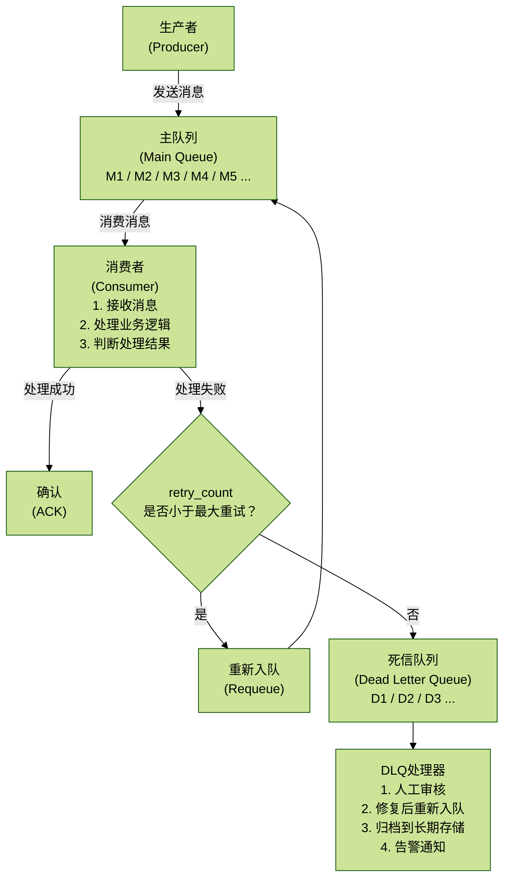
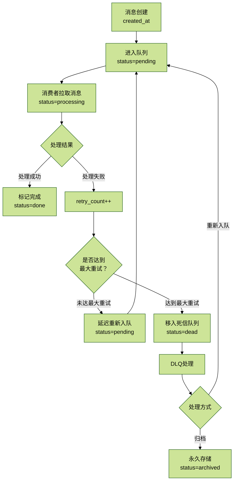

# 4.4 DLQ死信队列

> 核心价值：处理无法正常消费的消息，避免阻塞正常消息流，保留失败消息以便后续分析和重处理。

## 目录

- [1. 概述](#1-概述)
- [2. 核心概念](#2-核心概念)
  - [2.1 死信队列架构](#21-死信队列架构)
  - [2.2 消息生命周期](#22-消息生命周期)
- [3. 核心实现](#3-核心实现)
  - [3.1 死信队列基础实现](#31-死信队列基础实现)
  - [3.2 消费者Worker](#32-消费者worker)
  - [3.3 DLQ管理界面](#33-dlq管理界面)
  - [3.4 监控与告警](#34-监控与告警)
  - [3.5 DLQ自动化处理](#35-dlq自动化处理)
- [4. 最佳实践](#4-最佳实践)
  - [4.1 DLQ配置建议](#41-dlq配置建议)
- [5. 总结](#5-总结)

## 1. 概述

死信队列（Dead Letter Queue, DLQ）是用于处理无法正常消费的消息的特殊队列。当消息处理失败达到一定次数后，会被移入死信队列，避免阻塞正常消息流，同时保留失败消息以便后续分析和重处理。本文档详细介绍死信队列的设计与实现。

## 2. 核心概念

### 2.1 死信队列架构



架构中的核心角色：

| 组件 | 职责 |
| --- | --- |
| Producer | 生产业务消息，写入主队列 |
| Main Queue | 保存待消费消息，通常按优先级或时间排序 |
| Consumer | 拉取消息并执行业务处理 |
| Retry Queue | 保存延迟重试消息，避免立即重试造成压力 |
| DLQ | 保存超过最大重试次数或不可修复的失败消息 |
| DLQ Processor | 负责人工审核、自动修复、重新入队、归档和告警 |

### 2.2 消息生命周期



消息状态说明：

| 状态 | 含义 | 典型触发点 |
| --- | --- | --- |
| pending | 等待处理 | 消息创建、延迟重试回流 |
| processing | 处理中 | 消费者从主队列拉取消息 |
| done | 已完成 | 业务处理成功并确认 |
| failed | 失败 | 单次处理失败，准备重试或转入 DLQ |
| dead | 死信 | 超过最大重试次数 |
| archived | 已归档 | DLQ 消息确认不再重试后进入长期保存 |

## 3. 核心实现

### 3.1 死信队列基础实现

```python
# app/core/dead_letter_queue.py

import json
import logging
from typing import Optional, Callable, Any, Dict
from datetime import datetime, timedelta
from dataclasses import dataclass, asdict
from enum import Enum
import uuid

from redis import Redis

logger = logging.getLogger(__name__)


class MessageStatus(Enum):
    """消息状态"""

    PENDING = "pending"       # 等待处理
    PROCESSING = "processing" # 处理中
    DONE = "done"             # 已完成
    FAILED = "failed"         # 失败
    DEAD = "dead"             # 死信
    ARCHIVED = "archived"     # 已归档


@dataclass
class Message:
    """消息结构"""

    id: str
    payload: dict
    created_at: str
    status: str = MessageStatus.PENDING.value
    retry_count: int = 0
    max_retries: int = 3
    last_error: Optional[str] = None
    last_retry_at: Optional[str] = None
    processing_started_at: Optional[str] = None

    def to_dict(self) -> dict:
        """转换为字典"""

        return asdict(self)

    @classmethod
    def from_dict(cls, data: dict) -> "Message":
        """从字典创建"""

        return cls(**data)


class DeadLetterQueue:
    """死信队列"""

    def __init__(
        self,
        redis_client: Redis,
        queue_name: str = "main",
        max_retries: int = 3,
        retry_delay: int = 60,
    ):
        """
        Args:
            redis_client: Redis客户端
            queue_name: 队列名称
            max_retries: 最大重试次数
            retry_delay: 重试延迟（秒）
        """
        self.redis = redis_client
        self.queue_name = queue_name
        self.max_retries = max_retries
        self.retry_delay = retry_delay

        # Redis键
        self.main_queue_key = f"queue:{queue_name}"
        self.processing_queue_key = f"queue:{queue_name}:processing"
        self.dlq_key = f"queue:{queue_name}:dlq"
        self.retry_queue_key = f"queue:{queue_name}:retry"
        self.message_data_key = f"queue:{queue_name}:messages"

    def enqueue(self, payload: dict, priority: int = 0) -> str:
        """
        入队消息

        Args:
            payload: 消息内容
            priority: 优先级（数字越小优先级越高）

        Returns:
            消息ID
        """
        message = Message(
            id=str(uuid.uuid4()),
            payload=payload,
            created_at=datetime.now().isoformat(),
            max_retries=self.max_retries,
        )

        # 保存消息数据
        self.redis.hset(
            self.message_data_key,
            message.id,
            json.dumps(message.to_dict()),
        )

        # 加入主队列（使用 sorted set 实现优先级）
        self.redis.zadd(
            self.main_queue_key,
            {message.id: priority},
        )

        logger.info(f"Enqueued message {message.id} with priority {priority}")

        return message.id

    def dequeue(self, timeout: int = 0) -> Optional[Message]:
        """
        出队消息

        Args:
            timeout: 阻塞超时时间（秒），0表示非阻塞

        Returns:
            消息对象，如果队列为空则返回None
        """
        # 从主队列取出优先级最高的消息
        result = self.redis.zpopmin(self.main_queue_key, count=1)

        if not result:
            return None

        message_id, _ = result[0]

        # 获取消息数据
        message_data = self.redis.hget(self.message_data_key, message_id)
        if not message_data:
            logger.error(f"Message data not found for {message_id}")
            return None

        message = Message.from_dict(json.loads(message_data))

        # 更新状态
        message.status = MessageStatus.PROCESSING.value
        message.processing_started_at = datetime.now().isoformat()

        # 保存到处理队列
        self.redis.zadd(
            self.processing_queue_key,
            {message.id: datetime.now().timestamp()},
        )

        # 更新消息数据
        self.redis.hset(
            self.message_data_key,
            message.id,
            json.dumps(message.to_dict()),
        )

        logger.debug(f"Dequeued message {message.id}")

        return message

    def ack(self, message_id: str):
        """
        确认消息处理成功

        Args:
            message_id: 消息ID
        """
        # 从处理队列移除
        self.redis.zrem(self.processing_queue_key, message_id)

        # 更新消息状态
        message_data = self.redis.hget(self.message_data_key, message_id)
        if message_data:
            message = Message.from_dict(json.loads(message_data))
            message.status = MessageStatus.DONE.value

            self.redis.hset(
                self.message_data_key,
                message_id,
                json.dumps(message.to_dict()),
            )

        logger.info(f"Message {message_id} acknowledged")

    def nack(self, message_id: str, error: Optional[str] = None):
        """
        标记消息处理失败

        Args:
            message_id: 消息ID
            error: 错误信息
        """
        # 获取消息
        message_data = self.redis.hget(self.message_data_key, message_id)
        if not message_data:
            logger.error(f"Message {message_id} not found")
            return

        message = Message.from_dict(json.loads(message_data))

        # 更新重试信息
        message.retry_count += 1
        message.last_error = error
        message.last_retry_at = datetime.now().isoformat()
        message.status = MessageStatus.FAILED.value

        # 从处理队列移除
        self.redis.zrem(self.processing_queue_key, message_id)

        # 判断是否超过最大重试次数
        if message.retry_count >= message.max_retries:
            # 移入死信队列
            self._move_to_dlq(message)
        else:
            # 延迟重新入队
            self._schedule_retry(message)

        # 更新消息数据
        self.redis.hset(
            self.message_data_key,
            message_id,
            json.dumps(message.to_dict()),
        )

        logger.warning(
            f"Message {message_id} nacked "
            f"(retry {message.retry_count}/{message.max_retries})"
        )

    def _move_to_dlq(self, message: Message):
        """移动消息到死信队列"""

        message.status = MessageStatus.DEAD.value

        # 加入死信队列
        self.redis.zadd(
            self.dlq_key,
            {message.id: datetime.now().timestamp()},
        )

        logger.error(
            f"Message {message.id} moved to DLQ after "
            f"{message.retry_count} retries"
        )

    def _schedule_retry(self, message: Message):
        """调度重试"""

        # 计算重试时间（指数退避）
        delay = self.retry_delay * (2 ** (message.retry_count - 1))
        retry_at = datetime.now() + timedelta(seconds=delay)

        message.status = MessageStatus.PENDING.value

        # 加入重试队列
        self.redis.zadd(
            self.retry_queue_key,
            {message.id: retry_at.timestamp()},
        )

        logger.info(
            f"Message {message.id} scheduled for retry at "
            f"{retry_at.isoformat()} "
            f"(delay={delay}s)"
        )

    def process_retry_queue(self):
        """
        处理重试队列

        将到期的消息移回主队列
        """
        current_time = datetime.now().timestamp()

        # 获取所有到期的消息
        expired_messages = self.redis.zrangebyscore(
            self.retry_queue_key,
            0,
            current_time,
        )

        for message_id in expired_messages:
            # 移回主队列
            self.redis.zrem(self.retry_queue_key, message_id)
            self.redis.zadd(self.main_queue_key, {message_id: 0})

            logger.info(f"Message {message_id} moved from retry queue to main queue")

        return len(expired_messages)

    def get_dlq_messages(self, limit: int = 100) -> list[Message]:
        """
        获取死信队列中的消息

        Args:
            limit: 返回数量限制

        Returns:
            消息列表
        """
        message_ids = self.redis.zrange(self.dlq_key, 0, limit - 1)

        messages = []
        for message_id in message_ids:
            message_data = self.redis.hget(self.message_data_key, message_id)
            if message_data:
                messages.append(Message.from_dict(json.loads(message_data)))

        return messages

    def requeue_from_dlq(self, message_id: str, reset_retry_count: bool = True):
        """
        从死信队列重新入队

        Args:
            message_id: 消息ID
            reset_retry_count: 是否重置重试计数
        """
        # 获取消息
        message_data = self.redis.hget(self.message_data_key, message_id)
        if not message_data:
            raise ValueError(f"Message {message_id} not found")

        message = Message.from_dict(json.loads(message_data))

        if reset_retry_count:
            message.retry_count = 0

        message.status = MessageStatus.PENDING.value

        # 从DLQ移除
        self.redis.zrem(self.dlq_key, message_id)

        # 加入主队列
        self.redis.zadd(self.main_queue_key, {message_id: 0})

        # 更新消息数据
        self.redis.hset(
            self.message_data_key,
            message_id,
            json.dumps(message.to_dict()),
        )

        logger.info(f"Message {message_id} requeued from DLQ")

    def archive_dlq_message(self, message_id: str):
        """
        归档死信消息

        Args:
            message_id: 消息ID
        """
        # 获取消息
        message_data = self.redis.hget(self.message_data_key, message_id)
        if not message_data:
            raise ValueError(f"Message {message_id} not found")

        message = Message.from_dict(json.loads(message_data))
        message.status = MessageStatus.ARCHIVED.value

        # 从DLQ移除
        self.redis.zrem(self.dlq_key, message_id)

        # 保存到归档（实际项目中应该保存到数据库或对象存储）
        archive_key = f"queue:{self.queue_name}:archived"
        self.redis.hset(
            archive_key,
            message_id,
            json.dumps(message.to_dict()),
        )

        # 从消息数据中移除
        self.redis.hdel(self.message_data_key, message_id)

        logger.info(f"Message {message_id} archived")

    def get_stats(self) -> dict:
        """获取队列统计信息"""

        return {
            "main_queue_size": self.redis.zcard(self.main_queue_key),
            "processing_queue_size": self.redis.zcard(self.processing_queue_key),
            "retry_queue_size": self.redis.zcard(self.retry_queue_key),
            "dlq_size": self.redis.zcard(self.dlq_key),
            "total_messages": self.redis.hlen(self.message_data_key),
        }


# 使用示例

redis_client = Redis(host="localhost", port=6379, decode_responses=True)
dlq = DeadLetterQueue(
    redis_client=redis_client,
    queue_name="research_tasks",
    max_retries=3,
    retry_delay=60,
)


def producer_example():
    """生产者示例"""

    # 发送消息
    message_id = dlq.enqueue({
        "task_type": "industry_research",
        "industry": "AI",
        "query": "市场规模分析",
    })

    print(f"Enqueued message: {message_id}")


def consumer_example():
    """消费者示例"""

    while True:
        # 获取消息
        message = dlq.dequeue()

        if not message:
            break

        try:
            # 处理消息
            print(f"Processing message {message.id}: {message.payload}")

            # 模拟处理
            result = process_task(message.payload)

            # 确认成功
            dlq.ack(message.id)
            print(f"Message {message.id} processed successfully")

        except Exception as e:
            # 标记失败
            dlq.nack(message.id, str(e))
            print(f"Message {message.id} failed: {e}")


def process_task(payload: dict):
    """处理任务（示例）"""

    import random

    # 模拟随机失败
    if random.random() < 0.3:
        raise Exception("Random processing error")

    return {"result": "success"}
```

### 3.2 消费者Worker

```python
# app/workers/dlq_consumer.py

import logging
import time
import signal
from typing import Callable, Optional, Any
from threading import Thread, Event

from app.core.dead_letter_queue import DeadLetterQueue, Message

logger = logging.getLogger(__name__)


class DLQConsumer:
    """死信队列消费者"""

    def __init__(
        self,
        dlq: DeadLetterQueue,
        handler: Callable[[dict], Any],
        num_workers: int = 4,
        poll_interval: int = 1,
    ):
        """
        Args:
            dlq: 死信队列实例
            handler: 消息处理函数
            num_workers: 工作线程数
            poll_interval: 轮询间隔（秒）
        """
        self.dlq = dlq
        self.handler = handler
        self.num_workers = num_workers
        self.poll_interval = poll_interval

        self._workers: list[Thread] = []
        self._stop_event = Event()
        self._retry_scheduler_thread: Optional[Thread] = None

    def start(self):
        """启动消费者"""

        logger.info(f"Starting DLQ consumer with {self.num_workers} workers")

        # 启动工作线程
        for i in range(self.num_workers):
            worker = Thread(target=self._worker_loop, args=(i,), daemon=True)
            worker.start()
            self._workers.append(worker)

        # 启动重试调度器
        self._retry_scheduler_thread = Thread(
            target=self._retry_scheduler_loop,
            daemon=True,
        )
        self._retry_scheduler_thread.start()

        # 注册信号处理
        signal.signal(signal.SIGINT, self._signal_handler)
        signal.signal(signal.SIGTERM, self._signal_handler)

        logger.info("DLQ consumer started")

    def stop(self):
        """停止消费者"""

        logger.info("Stopping DLQ consumer...")
        self._stop_event.set()

        # 等待所有工作线程结束
        for worker in self._workers:
            worker.join(timeout=10)

        if self._retry_scheduler_thread:
            self._retry_scheduler_thread.join(timeout=10)

        logger.info("DLQ consumer stopped")

    def _signal_handler(self, signum, frame):
        """信号处理器"""

        logger.info(f"Received signal {signum}, shutting down...")
        self.stop()

    def _worker_loop(self, worker_id: int):
        """工作线程循环"""

        logger.info(f"Worker {worker_id} started")

        while not self._stop_event.is_set():
            try:
                # 获取消息
                message = self.dlq.dequeue()

                if not message:
                    # 队列为空，等待
                    time.sleep(self.poll_interval)
                    continue

                # 处理消息
                self._process_message(message, worker_id)

            except Exception as e:
                logger.error(f"Worker {worker_id} error: {e}", exc_info=True)
                time.sleep(self.poll_interval)

        logger.info(f"Worker {worker_id} stopped")

    def _process_message(self, message: Message, worker_id: int):
        """处理消息"""

        logger.info(f"Worker {worker_id} processing message {message.id}")

        try:
            # 调用处理函数
            result = self.handler(message.payload)

            # 确认成功
            self.dlq.ack(message.id)

            logger.info(
                f"Worker {worker_id} successfully processed message "
                f"{message.id}"
            )

        except Exception as e:
            # 标记失败
            error_msg = f"{type(e).__name__}: {str(e)}"
            self.dlq.nack(message.id, error_msg)

            logger.error(
                f"Worker {worker_id} failed to process message {message.id}: "
                f"{e}",
                exc_info=True,
            )

    def _retry_scheduler_loop(self):
        """重试调度器循环"""

        logger.info("Retry scheduler started")

        while not self._stop_event.is_set():
            try:
                # 处理重试队列
                count = self.dlq.process_retry_queue()

                if count > 0:
                    logger.info(f"Moved {count} messages from retry queue to main queue")

                # 等待
                time.sleep(self.poll_interval)

            except Exception as e:
                logger.error(f"Retry scheduler error: {e}", exc_info=True)
                time.sleep(self.poll_interval)

        logger.info("Retry scheduler stopped")


# 使用示例

def my_message_handler(payload: dict):
    """消息处理函数"""

    task_type = payload.get("task_type")

    if task_type == "industry_research":
        # 处理行业研究任务
        return handle_industry_research(payload)
    else:
        raise ValueError(f"Unknown task type: {task_type}")


def handle_industry_research(payload: dict):
    """处理行业研究任务"""

    industry = payload.get("industry")
    query = payload.get("query")

    logger.info(f"Researching {industry}: {query}")

    # 实际处理逻辑
    # ...

    return {"status": "completed"}


# 启动消费者
from redis import Redis
from app.core.dead_letter_queue import DeadLetterQueue

redis_client = Redis(host="localhost", port=6379, decode_responses=True)
dlq = DeadLetterQueue(redis_client, queue_name="research_tasks")

consumer = DLQConsumer(
    dlq=dlq,
    handler=my_message_handler,
    num_workers=4,
    poll_interval=1,
)

if __name__ == "__main__":
    consumer.start()

    # 保持主线程运行
    try:
        while True:
            time.sleep(1)
    except KeyboardInterrupt:
        consumer.stop()
```

### 3.3 DLQ管理界面

```python
# app/api/dlq_admin.py

from fastapi import APIRouter, HTTPException, BackgroundTasks
from typing import Optional, List
from pydantic import BaseModel

from app.core.dead_letter_queue import DeadLetterQueue, Message
from redis import Redis

router = APIRouter(prefix="/api/dlq", tags=["dead-letter-queue"])

# 初始化DLQ
redis_client = Redis(host="localhost", port=6379, decode_responses=True)
dlq = DeadLetterQueue(redis_client, queue_name="research_tasks")


class MessageResponse(BaseModel):
    """消息响应模型"""

    id: str
    payload: dict
    created_at: str
    status: str
    retry_count: int
    max_retries: int
    last_error: Optional[str] = None
    last_retry_at: Optional[str] = None


class QueueStatsResponse(BaseModel):
    """队列统计响应"""

    main_queue_size: int
    processing_queue_size: int
    retry_queue_size: int
    dlq_size: int
    total_messages: int


@router.get("/stats", response_model=QueueStatsResponse)
def get_queue_stats():
    """获取队列统计信息"""

    stats = dlq.get_stats()
    return QueueStatsResponse(**stats)


@router.get("/messages", response_model=List[MessageResponse])
def get_dlq_messages(limit: int = 100):
    """获取死信队列中的消息"""

    messages = dlq.get_dlq_messages(limit=limit)
    return [MessageResponse(**msg.to_dict()) for msg in messages]


@router.post("/messages/{message_id}/requeue")
def requeue_message(message_id: str, reset_retry: bool = True):
    """从死信队列重新入队消息"""

    try:
        dlq.requeue_from_dlq(message_id, reset_retry_count=reset_retry)
        return {"message": f"Message {message_id} requeued successfully"}
    except ValueError as e:
        raise HTTPException(status_code=404, detail=str(e))


@router.post("/messages/{message_id}/archive")
def archive_message(message_id: str):
    """归档死信消息"""

    try:
        dlq.archive_dlq_message(message_id)
        return {"message": f"Message {message_id} archived successfully"}
    except ValueError as e:
        raise HTTPException(status_code=404, detail=str(e))


@router.post("/messages/batch-requeue")
def batch_requeue_messages(message_ids: List[str], reset_retry: bool = True):
    """批量重新入队消息"""

    results = []

    for message_id in message_ids:
        try:
            dlq.requeue_from_dlq(message_id, reset_retry_count=reset_retry)
            results.append({"message_id": message_id, "status": "success"})
        except Exception as e:
            results.append({"message_id": message_id, "status": "failed", "error": str(e)})

    return {"results": results}


@router.delete("/messages/purge")
def purge_dlq(background_tasks: BackgroundTasks):
    """清空死信队列（谨慎使用）"""

    def _purge():
        messages = dlq.get_dlq_messages(limit=10000)
        for message in messages:
            dlq.archive_dlq_message(message.id)

    background_tasks.add_task(_purge)

    return {"message": "DLQ purge started in background"}
```

### 3.4 监控与告警

```python
# app/monitoring/dlq_monitor.py

import logging
from typing import Optional
from datetime import datetime, timedelta

from prometheus_client import Gauge, Counter, Histogram

from app.core.dead_letter_queue import DeadLetterQueue

logger = logging.getLogger(__name__)

# Prometheus指标
dlq_size = Gauge(
    "dlq_size",
    "Number of messages in dead letter queue",
    ["queue_name"],
)

dlq_messages_total = Counter(
    "dlq_messages_total",
    "Total number of messages moved to DLQ",
    ["queue_name", "reason"],
)

message_processing_duration = Histogram(
    "message_processing_duration_seconds",
    "Time spent processing messages",
    ["queue_name", "status"],
)

retry_attempts = Histogram(
    "message_retry_attempts",
    "Number of retry attempts before success or DLQ",
    ["queue_name"],
)


class DLQMonitor:
    """死信队列监控器"""

    def __init__(self, dlq: DeadLetterQueue, alert_threshold: int = 100):
        self.dlq = dlq
        self.alert_threshold = alert_threshold
        self._last_alert_time: Optional[datetime] = None
        self._alert_cooldown = timedelta(minutes=5)

    def check_and_alert(self):
        """检查DLQ大小并告警"""

        stats = self.dlq.get_stats()
        dlq_count = stats["dlq_size"]

        # 更新指标
        dlq_size.labels(queue_name=self.dlq.queue_name).set(dlq_count)

        # 检查是否需要告警
        if dlq_count >= self.alert_threshold:
            self._send_alert(dlq_count)

    def _send_alert(self, dlq_count: int):
        """发送告警"""

        # 检查冷却时间
        if self._last_alert_time:
            if datetime.now() - self._last_alert_time < self._alert_cooldown:
                return

        logger.critical(
            f"DLQ alert: {dlq_count} messages in dead letter queue "
            f"(threshold: {self.alert_threshold})"
        )

        # 后续可接入邮件、短信、钉钉等告警
        # send_email_alert(...)
        # send_sms_alert(...)
        # send_dingtalk_alert(...)

        self._last_alert_time = datetime.now()

    def get_dlq_health(self) -> dict:
        """获取DLQ健康状态"""

        stats = self.dlq.get_stats()
        dlq_count = stats["dlq_size"]

        if dlq_count == 0:
            health = "healthy"
        elif dlq_count < self.alert_threshold:
            health = "warning"
        else:
            health = "critical"

        return {
            "health": health,
            "dlq_size": dlq_count,
            "threshold": self.alert_threshold,
            "stats": stats,
        }


# 使用示例

from redis import Redis

redis_client = Redis(host="localhost", port=6379, decode_responses=True)
dlq = DeadLetterQueue(redis_client, queue_name="research_tasks")

monitor = DLQMonitor(dlq, alert_threshold=100)


def periodic_check():
    """定期检查（可以用APScheduler调度）"""

    monitor.check_and_alert()
    health = monitor.get_dlq_health()
    logger.info(f"DLQ Health: {health}")
```

### 3.5 DLQ自动化处理

```python
# app/services/dlq_automation.py

import logging
from typing import Callable, Optional, Dict, Any
from datetime import datetime
import json

from app.core.dead_letter_queue import DeadLetterQueue, Message

logger = logging.getLogger(__name__)


class DLQAutomation:
    """DLQ自动化处理"""

    def __init__(self, dlq: DeadLetterQueue):
        self.dlq = dlq
        self.fix_handlers: Dict[str, Callable] = {}

    def register_fix_handler(
        self,
        error_pattern: str,
        handler: Callable[[Message], bool],
    ):
        """
        注册自动修复处理器

        Args:
            error_pattern: 错误模式（用于匹配）
            handler: 修复处理函数，返回True表示修复成功
        """
        self.fix_handlers[error_pattern] = handler

    def auto_fix_dlq_messages(self, limit: int = 100) -> dict:
        """
        自动修复DLQ中的消息

        Returns:
            修复统计信息
        """
        messages = self.dlq.get_dlq_messages(limit=limit)

        stats = {
            "total": len(messages),
            "fixed": 0,
            "failed": 0,
            "requeued": 0,
        }

        for message in messages:
            try:
                # 尝试修复
                fixed = self._try_fix_message(message)

                if fixed:
                    # 重新入队
                    self.dlq.requeue_from_dlq(
                        message.id,
                        reset_retry_count=True,
                    )
                    stats["fixed"] += 1
                    stats["requeued"] += 1
                    logger.info(f"Auto-fixed and requeued message {message.id}")
                else:
                    stats["failed"] += 1

            except Exception as e:
                logger.error(f"Failed to auto-fix message {message.id}: {e}")
                stats["failed"] += 1

        return stats

    def _try_fix_message(self, message: Message) -> bool:
        """
        尝试修复消息

        Returns:
            True if fixed successfully
        """
        if not message.last_error:
            return False

        # 遍历所有修复处理器
        for pattern, handler in self.fix_handlers.items():
            if pattern in message.last_error:
                try:
                    logger.info(
                        f"Trying to fix message {message.id} with handler for "
                        f"'{pattern}'"
                    )
                    return handler(message)
                except Exception as e:
                    logger.error(f"Fix handler failed: {e}")
                    return False

        return False


# 使用示例

from redis import Redis

redis_client = Redis(host="localhost", port=6379, decode_responses=True)
dlq = DeadLetterQueue(redis_client, queue_name="research_tasks")

automation = DLQAutomation(dlq)


# 注册修复处理器
def fix_invalid_json(message: Message) -> bool:
    """修复无效JSON"""

    try:
        # 尝试修复payload中的JSON
        payload = message.payload

        # 示例：修复常见的JSON格式问题
        if isinstance(payload, str):
            # 如果payload是字符串，尝试解析
            payload = json.loads(payload)
            message.payload = payload
            return True

        return True

    except Exception as e:
        logger.error(f"Failed to fix invalid JSON: {e}")
        return False


def fix_missing_field(message: Message) -> bool:
    """修复缺失字段"""

    payload = message.payload

    # 添加缺失的默认值
    if "industry" not in payload:
        payload["industry"] = "未知"

    if "query" not in payload:
        payload["query"] = "默认查询"

    message.payload = payload

    return True


# 注册处理器
automation.register_fix_handler("JSON", fix_invalid_json)
automation.register_fix_handler("missing required field", fix_missing_field)


# 定期自动修复
def run_auto_fix():
    """运行自动修复"""

    stats = automation.auto_fix_dlq_messages(limit=100)
    logger.info(f"Auto-fix completed: {stats}")
    return stats
```

## 4. 最佳实践

### 4.1 DLQ配置建议

```python
# app/config/dlq_config.py

from app.core.dead_letter_queue import DeadLetterQueue


class DLQProfiles:
    """DLQ配置预设"""

    # 关键任务（少重试，快速进DLQ）
    CRITICAL = {
        "max_retries": 2,
        "retry_delay": 30,
    }

    # 标准任务
    STANDARD = {
        "max_retries": 3,
        "retry_delay": 60,
    }

    # 容错任务（多重试）
    TOLERANT = {
        "max_retries": 5,
        "retry_delay": 120,
    }
```

配置建议：

| 配置 | 适用场景 | max_retries | retry_delay |
| --- | --- | ---: | ---: |
| CRITICAL | 关键任务，少重试，快速进入 DLQ | 2 | 30 |
| STANDARD | 标准任务 | 3 | 60 |
| TOLERANT | 容错任务，允许更多重试 | 5 | 120 |

## 5. 总结

死信队列是消息队列系统的重要组成部分，提供：

1. **失败隔离**：防止失败消息阻塞正常流量。
2. **可观测性**：集中管理和分析失败原因。
3. **自动修复**：自动化处理常见错误。
4. **监控告警**：及时发现系统问题。
5. **灵活重处理**：支持人工审核和批量重试。

在实际应用中，应根据业务特点调整重试策略，并建立完善的 DLQ 监控和处理机制。
