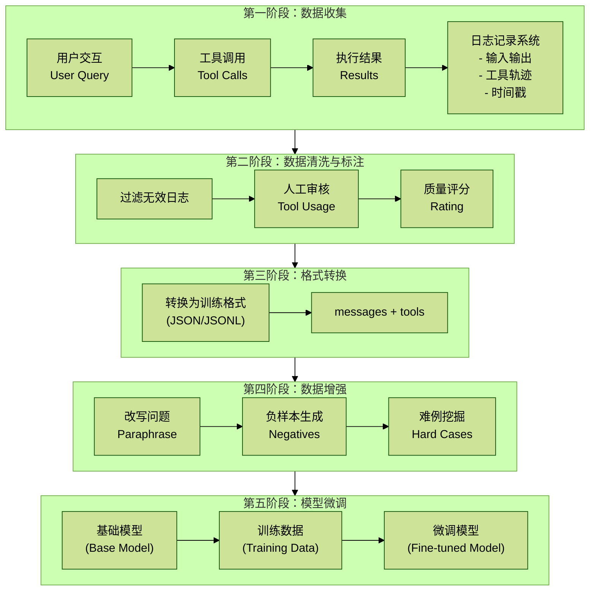

# 4.5 Agent SFT微调数据

## 目录

- [概述](#概述)
- [核心概念](#核心概念)
  - [SFT数据流程](#sft数据流程)
  - [训练数据格式](#训练数据格式)
- [核心实现](#核心实现)
  - [1. 日志收集系统](#1-日志收集系统)
  - [2. 训练数据格式化](#2-训练数据格式化)
  - [3. 数据增强](#3-数据增强)
  - [4. 模型微调](#4-模型微调)
- [最佳实践](#最佳实践)
  - [1. 数据质量控制](#1-数据质量控制)
  - [2. 数据质量过滤条件](#2-数据质量过滤条件)
- [总结](#总结)

## 概述

Supervised Fine-Tuning (SFT) 是提升Agent能力的关键手段。通过收集工具使用日志、构建高质量训练数据集，可以让基础模型学习特定领域的Agent行为模式，提升工具调用的准确性和推理能力。本文档详细介绍从日志收集到模型微调的完整流程。

## 核心概念

### SFT数据流程



### 训练数据格式

```json
{
  "messages": [
    {
      "role": "system",
      "content": "You are a helpful assistant with access..."
    },
    {
      "role": "user",
      "content": "帮我分析AI行业的市场规模"
    },
    {
      "role": "assistant",
      "content": null,
      "tool_calls": [
        {
          "id": "call_abc123",
          "type": "function",
          "function": {
            "name": "search_industry_data",
            "arguments": "{\"industry\": \"AI\", ...}"
          }
        }
      ]
    },
    {
      "role": "tool",
      "tool_call_id": "call_abc123",
      "content": "{\"market_size\": \"1000亿\", ...}"
    },
    {
      "role": "assistant",
      "content": "根据数据分析，AI行业市场规模为..."
    }
  ]
}
```

## 核心实现

### 1. 日志收集系统

```python
# app/core/agent_logger.py

import json
import logging
from typing import Optional, List, Dict, Any
from datetime import datetime
from dataclasses import dataclass, asdict
from pathlib import Path
import uuid

logger = logging.getLogger(__name__)


@dataclass
class ToolCall:
    """工具调用记录"""
    id: str
    name: str
    arguments: dict
    result: Optional[Any] = None
    error: Optional[str] = None
    duration: float = 0.0
    timestamp: str = ""


@dataclass
class AgentInteraction:
    """Agent交互记录"""
    id: str
    session_id: str
    user_query: str
    system_prompt: str
    tool_calls: List[ToolCall]
    final_response: str
    total_duration: float
    timestamp: str
    metadata: Optional[dict] = None

    # 质量标注
    quality_score: Optional[float] = None
    is_correct: Optional[bool] = None
    human_feedback: Optional[str] = None


class AgentLogger:
    """Agent日志记录器"""

    def __init__(self, log_dir: str = "./logs/agent_interactions"):
        self.log_dir = Path(log_dir)
        self.log_dir.mkdir(parents=True, exist_ok=True)

        # 当前交互上下文
        self._current_interaction: Optional[AgentInteraction] = None
        self._tool_calls: List[ToolCall] = []

    def start_interaction(
        self,
        user_query: str,
        system_prompt: str,
        session_id: Optional[str] = None,
        metadata: Optional[dict] = None,
    ) -> str:
        """
        开始记录一次交互

        Returns:
            interaction_id
        """
        interaction_id = str(uuid.uuid4())

        self._current_interaction = AgentInteraction(
            id=interaction_id,
            session_id=session_id or str(uuid.uuid4()),
            user_query=user_query,
            system_prompt=system_prompt,
            tool_calls=[],
            final_response="",
            total_duration=0.0,
            timestamp=datetime.now().isoformat(),
            metadata=metadata,
        )

        self._tool_calls = []

        logger.info(f"Started interaction {interaction_id}")

        return interaction_id

    def log_tool_call(
        self,
        tool_name: str,
        arguments: dict,
        result: Optional[Any] = None,
        error: Optional[str] = None,
        duration: float = 0.0,
    ) -> str:
        """
        记录工具调用

        Returns:
            tool_call_id
        """
        tool_call_id = str(uuid.uuid4())

        tool_call = ToolCall(
            id=tool_call_id,
            name=tool_name,
            arguments=arguments,
            result=result,
            error=error,
            duration=duration,
            timestamp=datetime.now().isoformat(),
        )

        self._tool_calls.append(tool_call)

        logger.debug(f"Logged tool call: {tool_name}")

        return tool_call_id

    def end_interaction(
        self,
        final_response: str,
        total_duration: float,
        quality_score: Optional[float] = None,
        is_correct: Optional[bool] = None,
    ):
        """结束交互并保存日志"""
        if not self._current_interaction:
            logger.warning("No active interaction to end")
            return

        self._current_interaction.tool_calls = self._tool_calls
        self._current_interaction.final_response = final_response
        self._current_interaction.total_duration = total_duration
        self._current_interaction.quality_score = quality_score
        self._current_interaction.is_correct = is_correct

        # 保存到文件
        self._save_interaction()

        # 清理
        self._current_interaction = None
        self._tool_calls = []

    def _save_interaction(self):
        """保存交互记录到文件"""
        if not self._current_interaction:
            return

        # 按日期分组
        date_str = datetime.now().strftime("%Y%m%d")
        log_file = self.log_dir / f"interactions_{date_str}.jsonl"

        # 追加写入
        with open(log_file, "a", encoding="utf-8") as f:
            interaction_dict = asdict(self._current_interaction)
            f.write(json.dumps(interaction_dict, ensure_ascii=False) + "\n")

        logger.info(
            f"Saved interaction {self._current_interaction.id} to {log_file}"
        )

    def load_interactions(
        self,
        start_date: Optional[str] = None,
        end_date: Optional[str] = None,
        min_quality_score: Optional[float] = None,
        correct_only: bool = False,
    ) -> List[AgentInteraction]:
        """
        加载交互记录

        Args:
            start_date: 开始日期（YYYYMMDD）
            end_date: 结束日期（YYYYMMDD）
            min_quality_score: 最小质量分数
            correct_only: 只加载正确的交互

        Returns:
            交互记录列表
        """
        interactions = []

        # 获取所有日志文件
        log_files = sorted(self.log_dir.glob("interactions_*.jsonl"))

        for log_file in log_files:
            # 提取日期
            date_str = log_file.stem.replace("interactions_", "")

            # 日期过滤
            if start_date and date_str < start_date:
                continue
            if end_date and date_str > end_date:
                continue

            # 读取文件
            with open(log_file, "r", encoding="utf-8") as f:
                for line in f:
                    try:
                        data = json.loads(line)

                        # 重构对象
                        interaction = AgentInteraction(**data)

                        # 质量过滤
                        if min_quality_score and (
                            interaction.quality_score is None or
                            interaction.quality_score < min_quality_score
                        ):
                            continue

                        if correct_only and not interaction.is_correct:
                            continue

                        interactions.append(interaction)

                    except Exception as e:
                        logger.error(f"Failed to parse line: {e}")

        logger.info(f"Loaded {len(interactions)} interactions")

        return interactions


# 使用示例
agent_logger = AgentLogger(log_dir="./logs/agent_interactions")


def research_with_logging(query: str, industry: str):
    """带日志记录的研究流程"""
    import time

    # 开始记录
    interaction_id = agent_logger.start_interaction(
        user_query=query,
        system_prompt="You are a helpful research assistant...",
        metadata={"industry": industry},
    )

    start_time = time.time()

    try:
        # 第一步：搜索行业数据
        search_start = time.time()
        search_result = search_industry_data(industry=industry)
        search_duration = time.time() - search_start

        agent_logger.log_tool_call(
            tool_name="search_industry_data",
            arguments={"industry": industry},
            result=search_result,
            duration=search_duration,
        )

        # 第二步：分析数据
        analyze_start = time.time()
        analysis_result = analyze_market_data(search_result)
        analyze_duration = time.time() - analyze_start

        agent_logger.log_tool_call(
            tool_name="analyze_market_data",
            arguments={"data": search_result},
            result=analysis_result,
            duration=analyze_duration,
        )

        # 生成最终响应
        final_response = f"根据分析，{industry}行业的市场规模为..."

        # 结束记录
        total_duration = time.time() - start_time
        agent_logger.end_interaction(
            final_response=final_response,
            total_duration=total_duration,
            quality_score=0.9,  # 可以通过LLM评估
            is_correct=True,
        )

        return final_response

    except Exception as e:
        # 记录错误
        agent_logger.end_interaction(
            final_response=f"处理失败: {e}",
            total_duration=time.time() - start_time,
            quality_score=0.0,
            is_correct=False,
        )
        raise


def search_industry_data(industry: str):
    """搜索行业数据（示例）"""
    return {"market_size": "1000亿", "growth_rate": "25%"}


def analyze_market_data(data: dict):
    """分析市场数据（示例）"""
    return {"trend": "上升", "forecast": "2000亿"}
```

### 2. 训练数据格式化

```python
# app/core/sft_data_formatter.py

import json
import logging
from typing import List, Dict, Any, Optional
from pathlib import Path

from app.core.agent_logger import AgentInteraction, ToolCall

logger = logging.getLogger(__name__)


class SFTDataFormatter:
    """SFT数据格式化器"""

    def __init__(self, tool_definitions: Dict[str, dict]):
        """
        Args:
            tool_definitions: 工具定义（OpenAI Function Calling格式）
        """
        self.tool_definitions = tool_definitions

    def format_interaction(
        self,
        interaction: AgentInteraction,
        include_system_prompt: bool = True,
    ) -> dict:
        """
        将交互记录转换为SFT训练格式

        Returns:
            OpenAI messages格式
        """
        messages = []

        # 系统提示
        if include_system_prompt:
            messages.append({
                "role": "system",
                "content": interaction.system_prompt,
            })

        # 用户查询
        messages.append({
            "role": "user",
            "content": interaction.user_query,
        })

        # 工具调用序列
        for tool_call in interaction.tool_calls:
            # Assistant的工具调用
            messages.append({
                "role": "assistant",
                "content": None,
                "tool_calls": [
                    {
                        "id": tool_call.id,
                        "type": "function",
                        "function": {
                            "name": tool_call.name,
                            "arguments": json.dumps(
                                tool_call.arguments,
                                ensure_ascii=False,
                            ),
                        },
                    }
                ],
            })

            # 工具返回结果
            result_content = (
                json.dumps(tool_call.result, ensure_ascii=False)
                if tool_call.result is not None
                else json.dumps({"error": tool_call.error}, ensure_ascii=False)
            )

            messages.append({
                "role": "tool",
                "tool_call_id": tool_call.id,
                "content": result_content,
            })

        # 最终响应
        messages.append({
            "role": "assistant",
            "content": interaction.final_response,
        })

        return {
            "messages": messages,
            "tools": list(self.tool_definitions.values()),
        }

    def format_batch(
        self,
        interactions: List[AgentInteraction],
        output_file: str,
        include_system_prompt: bool = True,
    ):
        """
        批量格式化并保存

        Args:
            interactions: 交互记录列表
            output_file: 输出文件路径
            include_system_prompt: 是否包含系统提示
        """
        output_path = Path(output_file)
        output_path.parent.mkdir(parents=True, exist_ok=True)

        with open(output_path, "w", encoding="utf-8") as f:
            for interaction in interactions:
                try:
                    formatted = self.format_interaction(
                        interaction,
                        include_system_prompt=include_system_prompt
                    )

                    f.write(json.dumps(formatted, ensure_ascii=False) + "\n")

                except Exception as e:
                    logger.error(
                        f"Failed to format interaction {interaction.id}: {e}"
                    )

        logger.info(
            f"Formatted {len(interactions)} interactions to {output_file}"
        )

    def validate_format(self, data: dict) -> bool:
        """
        验证数据格式是否正确

        Returns:
            True if valid
        """
        try:
            # 检查messages字段
            if "messages" not in data:
                return False

            messages = data["messages"]

            # 检查角色顺序
            roles = [msg["role"] for msg in messages]

            # 必须以system或user开始
            if roles[0] not in ["system", "user"]:
                return False

            # 检查tool_calls和tool的配对
            for i, msg in enumerate(messages):
                if msg.get("tool_calls"):
                    # 下一条消息应该是tool
                    if i + 1 >= len(messages):
                        return False

                    next_msg = messages[i + 1]
                    if next_msg["role"] != "tool":
                        return False

            return True

        except Exception as e:
            logger.error(f"Validation error: {e}")
            return False


# 工具定义示例
TOOL_DEFINITIONS = {
    "search_industry_data": {
        "type": "function",
        "function": {
            "name": "search_industry_data",
            "description": "搜索行业数据，包括市场规模、增长率等信息",
            "parameters": {
                "type": "object",
                "properties": {
                    "industry": {
                        "type": "string",
                        "description": "行业名称，如'AI'、'新能源汽车'",
                    },
                    "metrics": {
                        "type": "array",
                        "items": {"type": "string"},
                        "description": "需要查询的指标，如['market_size', 'growth_rate']",
                    },
                    "year": {
                        "type": "integer",
                        "description": "年份，如2024",
                    },
                },
                "required": ["industry"],
            },
        },
    },
    "analyze_market_data": {
        "type": "function",
        "function": {
            "name": "analyze_market_data",
            "description": "分析市场数据，生成趋势预测和洞察",
            "parameters": {
                "type": "object",
                "properties": {
                    "data": {
                        "type": "object",
                        "description": "市场数据",
                    },
                    "analysis_type": {
                        "type": "string",
                        "enum": ["trend", "forecast", "comparison"],
                        "description": "分析类型",
                    },
                },
                "required": ["data"],
            },
        },
    },
}


# 使用示例
formatter = SFTDataFormatter(tool_definitions=TOOL_DEFINITIONS)


def prepare_training_data():
    """准备训练数据"""
    from app.core.agent_logger import AgentLogger

    # 加载日志
    agent_logger = AgentLogger(log_dir="./logs/agent_interactions")

    interactions = agent_logger.load_interactions(
        start_date="20250101",
        end_date="20250131",
        min_quality_score=0.7,   # 只使用高质量数据
        correct_only=True,       # 只使用正确的交互
    )

    logger.info(f"Loaded {len(interactions)} high-quality interactions")

    # 格式化并保存
    formatter.format_batch(
        interactions=interactions,
        output_file="./data/sft_training_data.jsonl",
        include_system_prompt=True,
    )

    # 验证
    with open("./data/sft_training_data.jsonl", "r") as f:
        valid_count = 0
        for line in f:
            data = json.loads(line)
            if formatter.validate_format(data):
                valid_count += 1

    logger.info(f"Validated {valid_count}/{len(interactions)} samples")
```

### 3. 数据增强

```python
# app/core/sft_data_augmentation.py

import json
import logging
from typing import List, Dict, Any
import random
from openai import OpenAI
import os

logger = logging.getLogger(__name__)


class SFTDataAugmentation:
    """SFT数据增强"""

    def __init__(self):
        self.client = OpenAI(api_key=os.getenv("OPENAI_API_KEY"))

    def paraphrase_query(self, original_query: str, num_variants: int = 3) -> List[str]:
        """
        改写用户查询

        生成多个语义相同但表达不同的查询
        """
        prompt = f"""
        请将以下查询改写成{num_variants}个不同的表达方式，保持语义不变：

        原始查询：{original_query}

        要求：
        1. 每个改写都要表达相同的意思
        2. 使用不同的词汇和句式
        3. 保持自然流畅

        请以JSON数组格式返回：["改写1", "改写2", ...]
        """

        response = self.client.chat.completions.create(
            model="gpt-4",
            messages=[{"role": "user", "content": prompt}],
            temperature=0.8,
        )

        result = response.choices[0].message.content.strip()

        # 解析JSON
        try:
            variants = json.loads(result)
            return variants[:num_variants]
        except:
            logger.error(f"Failed to parse paraphrase result: {result}")
            return [original_query]

    def generate_negative_samples(
        self,
        correct_sample: dict,
        num_negatives: int = 2,
    ) -> List[dict]:
        """
        生成负样本

        通过错误的工具选择或参数生成负样本，帮助模型学习区分
        """
        negatives = []

        messages = correct_sample["messages"]
        tools = correct_sample.get("tools", [])

        # 找到正确的tool_calls
        correct_tool_calls = None
        for msg in messages:
            if msg.get("tool_calls"):
                correct_tool_calls = msg["tool_calls"]
                break

        if not correct_tool_calls or not tools:
            return []

        # 生成负样本1：错误的工具选择
        if len(tools) > 1:
            wrong_tool = random.choice(
                [t for t in tools if t["function"]["name"] !=
                 correct_tool_calls[0]["function"]["name"]]
            )

            negative1 = {
                "messages": messages[:2],  # system + user
                "tools": tools,
                "is_negative": True,
                "error_type": "wrong_tool",
            }

            # 添加错误的工具调用
            negative1["messages"].append({
                "role": "assistant",
                "content": None,
                "tool_calls": [
                    {
                        "id": "neg_" + correct_tool_calls[0]["id"],
                        "type": "function",
                        "function": {
                            "name": wrong_tool["function"]["name"],
                            "arguments": "{}",
                        },
                    }
                ],
            })

            negatives.append(negative1)

        # 生成负样本2：错误的参数
        wrong_args = {}
        correct_args = json.loads(correct_tool_calls[0]["function"]["arguments"])

        # 随机修改一个参数
        if correct_args:
            key = random.choice(list(correct_args.keys()))
            wrong_args = correct_args.copy()
            wrong_args[key] = "WRONG_VALUE"

            negative2 = {
                "messages": messages[:2],  # system + user
                "tools": tools,
                "is_negative": True,
                "error_type": "wrong_arguments",
            }

            negative2["messages"].append({
                "role": "assistant",
                "content": None,
                "tool_calls": [
                    {
                        "id": "neg_" + correct_tool_calls[0]["id"],
                        "type": "function",
                        "function": {
                            "name": correct_tool_calls[0]["function"]["name"],
                            "arguments": json.dumps(wrong_args, ensure_ascii=False),
                        },
                    }
                ],
            })

            negatives.append(negative2)

        return negatives[:num_negatives]

    def augment_dataset(
        self,
        input_file: str,
        output_file: str,
        paraphrase: bool = True,
        negatives: bool = True,
    ):
        """
        增强数据集

        Args:
            input_file: 输入文件（JSONL格式）
            output_file: 输出文件
            paraphrase: 是否生成改写样本
            negatives: 是否生成负样本
        """
        augmented_data = []

        # 读取原始数据
        with open(input_file, "r", encoding="utf-8") as f:
            original_data = [json.loads(line) for line in f]

        for sample in original_data:
            # 添加原始样本
            augmented_data.append(sample)

            # 生成改写样本
            if paraphrase:
                try:
                    user_msg = next(
                        msg for msg in sample["messages"]
                        if msg["role"] == "user"
                    )
                    original_query = user_msg["content"]

                    variants = self.paraphrase_query(original_query, num_variants=2)

                    for variant in variants:
                        variant_sample = json.loads(json.dumps(sample))  # 深拷贝

                        for msg in variant_sample["messages"]:
                            if msg["role"] == "user":
                                msg["content"] = variant
                                break

                        variant_sample["is_augmented"] = True
                        variant_sample["augmentation_type"] = "paraphrase"
                        augmented_data.append(variant_sample)

                except Exception as e:
                    logger.error(f"Failed to paraphrase: {e}")

            # 生成负样本
            if negatives:
                try:
                    negative_samples = self.generate_negative_samples(sample, num_negatives=2)
                    augmented_data.extend(negative_samples)
                except Exception as e:
                    logger.error(f"Failed to generate negatives: {e}")

        # 保存
        with open(output_file, "w", encoding="utf-8") as f:
            for sample in augmented_data:
                f.write(json.dumps(sample, ensure_ascii=False) + "\n")

        logger.info(
            f"Augmented dataset: {len(original_data)} -> {len(augmented_data)} samples"
        )


# 使用示例
augmentor = SFTDataAugmentation()


def augment_training_data():
    """增强训练数据"""
    augmentor.augment_dataset(
        input_file="./data/sft_training_data.jsonl",
        output_file="./data/sft_training_data_augmented.jsonl",
        paraphrase=True,
        negatives=True,
    )
```

### 4. 模型微调

```python
# app/core/sft_training.py

import json
import logging
from typing import Optional, Dict, Any
from pathlib import Path
import os
from openai import OpenAI

logger = logging.getLogger(__name__)


class SFTTrainer:
    """SFT训练器"""

    def __init__(self):
        self.client = OpenAI(api_key=os.getenv("OPENAI_API_KEY"))

    def upload_training_file(self, file_path: str) -> str:
        """
        上传训练文件到OpenAI

        Returns:
            file_id
        """
        logger.info(f"Uploading training file: {file_path}")

        with open(file_path, "rb") as f:
            response = self.client.files.create(
                file=f,
                purpose="fine-tune"
            )

        file_id = response.id
        logger.info(f"Uploaded file: {file_id}")

        return file_id

    def create_fine_tuning_job(
        self,
        training_file_id: str,
        model: str = "gpt-3.5-turbo",
        validation_file_id: Optional[str] = None,
        hyperparameters: Optional[Dict[str, Any]] = None,
        suffix: Optional[str] = None,
    ) -> str:
        """
        创建微调任务

        Args:
            training_file_id: 训练文件ID
            model: 基础模型名称
            validation_file_id: 验证文件ID（可选）
            hyperparameters: 超参数配置
            suffix: 模型后缀名

        Returns:
            job_id
        """
        if hyperparameters is None:
            hyperparameters = {
                "n_epochs": 3,
                "batch_size": "auto",
                "learning_rate_multiplier": "auto",
            }

        logger.info(f"Creating fine-tuning job for model: {model}")

        response = self.client.fine_tuning.jobs.create(
            training_file=training_file_id,
            validation_file=validation_file_id,
            model=model,
            hyperparameters=hyperparameters,
            suffix=suffix,
        )

        job_id = response.id
        logger.info(f"Created fine-tuning job: {job_id}")

        return job_id

    def monitor_fine_tuning_job(self, job_id: str):
        """
        监控微调任务

        Args:
            job_id: 任务ID
        """
        import time

        while True:
            response = self.client.fine_tuning.jobs.retrieve(job_id)

            status = response.status
            logger.info(f"Job {job_id} status: {status}")

            if status in ["succeeded", "failed", "cancelled"]:
                break

            # 打印事件
            events = self.client.fine_tuning.jobs.list_events(
                fine_tuning_job_id=job_id,
                limit=10
            )

            for event in events.data:
                logger.info(f"  {event.created_at}: {event.message}")

            time.sleep(60)  # 每分钟检查一次

        if status == "succeeded":
            logger.info(f"Fine-tuning succeeded! Model: {response.fine_tuned_model}")
            return response.fine_tuned_model
        else:
            logger.error(f"Fine-tuning failed with status: {status}")
            return None

    def evaluate_model(
        self,
        model_name: str,
        test_file: str,
    ) -> Dict[str, float]:
        """
        评估微调模型

        Args:
            model_name: 模型名称
            test_file: 测试文件路径

        Returns:
            评估指标
        """
        logger.info(f"Evaluating model: {model_name}")

        correct = 0
        total = 0

        with open(test_file, "r", encoding="utf-8") as f:
            for line in f:
                sample = json.loads(line)
                messages = sample["messages"]
                tools = sample.get("tools", [])

                # 提取用户查询和正确答案
                user_msg = next(msg for msg in messages if msg["role"] == "user")

                correct_tool_call = next(
                    msg for msg in messages
                    if msg.get("tool_calls")
                )

                # 调用微调模型
                try:
                    response = self.client.chat.completions.create(
                        model=model_name,
                        messages=[user_msg],
                        tools=tools,
                        tool_choice="auto",
                    )

                    predicted_tool_call = response.choices[0].message.tool_calls

                    # 比较预测和正确答案
                    if predicted_tool_call:
                        predicted_name = predicted_tool_call[0].function.name
                        correct_name = correct_tool_call["tool_calls"][0]["function"]["name"]

                        if predicted_name == correct_name:
                            correct += 1

                    total += 1

                except Exception as e:
                    logger.error(f"Evaluation error: {e}")
                    total += 1

        accuracy = correct / total if total > 0 else 0

        metrics = {
            "accuracy": accuracy,
            "correct": correct,
            "total": total,
        }

        logger.info(f"Evaluation results: {metrics}")

        return metrics


# 完整的微调流程
def run_sft_pipeline():
    """运行完整的SFT流程"""
    trainer = SFTTrainer()

    # 1. 上传训练文件
    training_file_id = trainer.upload_training_file(
        "./data/sft_training_data_augmented.jsonl"
    )

    # 2. 上传验证文件（可选）
    validation_file_id = trainer.upload_training_file(
        "./data/sft_validation_data.jsonl"
    )

    # 3. 创建微调任务
    job_id = trainer.create_fine_tuning_job(
        training_file_id=training_file_id,
        validation_file_id=validation_file_id,
        model="gpt-3.5-turbo",
        hyperparameters={
            "n_epochs": 3,
            "batch_size": 4,
            "learning_rate_multiplier": 1.0,
        },
        suffix="industry-agent-v1",
    )

    # 4. 监控训练
    fine_tuned_model = trainer.monitor_fine_tuning_job(job_id)

    # 5. 评估模型
    if fine_tuned_model:
        metrics = trainer.evaluate_model(
            model_name=fine_tuned_model,
            test_file="./data/sft_test_data.jsonl"
        )

        logger.info(f"Final metrics: {metrics}")

        return fine_tuned_model

    return None


# 使用微调模型
def use_fine_tuned_model(model_name: str, query: str):
    """使用微调模型"""
    client = OpenAI(api_key=os.getenv("OPENAI_API_KEY"))

    response = client.chat.completions.create(
        model=model_name,
        messages=[
            {"role": "system", "content": "You are a helpful research assistant..."},
            {"role": "user", "content": query},
        ],
        tools=[...],  # 工具定义
        tool_choice="auto",
    )

    return response.choices[0].message
```

## 最佳实践

### 1. 数据质量控制

```python
# app/core/data_quality_control.py

import logging
from typing import List, Dict, Any
from app.core.agent_logger import AgentInteraction

logger = logging.getLogger(__name__)


class DataQualityControl:
    """数据质量控制"""

    @staticmethod
    def filter_high_quality(
        interactions: List[AgentInteraction],
        min_quality_score: float = 0.7,
        min_duration: float = 1.0,
        max_duration: float = 300.0,
    ) -> List[AgentInteraction]:
        """过滤高质量数据"""
        filtered = []

        for interaction in interactions:
            # 质量分数检查
            if interaction.quality_score and interaction.quality_score < min_quality_score:
                continue

            # 时长检查（过短或过长的可能有问题）
            if interaction.total_duration < min_duration or interaction.total_duration > max_duration:
                continue

            # 必须有工具调用
            if not interaction.tool_calls:
                continue

            # 必须有最终响应
            if not interaction.final_response or len(interaction.final_response.strip()) < 10:
                continue

            filtered.append(interaction)

        logger.info(
            f"Filtered {len(filtered)}/{len(interactions)} high-quality interactions"
        )

        return filtered
```

### 2. 数据质量过滤条件

> 原截图中的该表格为空白，未提供可识别内容，因此这里不额外补写表格内容。

## 总结

Agent SFT微调是提升Agent能力的关键手段。本文档提供了完整的流程：

1. 日志收集：记录用户查询、工具调用和最终响应
2. 数据格式化：转换为OpenAI Function Calling训练格式
3. 数据增强：通过改写和负样本提升鲁棒性
4. 模型微调：上传数据、创建任务、监控训练和评估模型
5. 质量控制：过滤高质量交互样本

通过持续收集和微调，可以让Agent在特定领域达到更高的准确性和可靠性。
