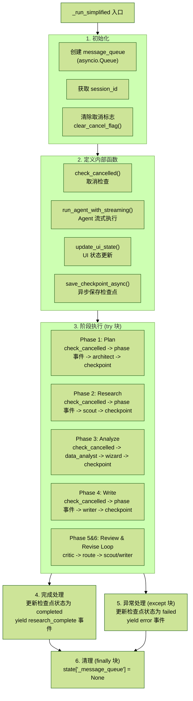

# 5.1 工作流引擎核心解读

## 目录

- [1 文件概览](#1-文件概览)
- [2 _run_simplified 核心流程](#2-_run_simplified-核心流程)
  - [2.1 方法签名](#21-方法签名)
  - [2.2 初始化阶段](#22-初始化阶段)
  - [2.3 执行流程概览](#23-执行流程概览)
- [3 关键内部函数](#3-关键内部函数)
  - [3.1 check_cancelled - 取消检查](#31-check_cancelled---取消检查)
  - [3.2 run_agent_with_streaming - Agent 流式执行](#32-run_agent_with_streaming---agent-流式执行)
  - [3.3 update_ui_state - UI 状态更新](#33-update_ui_state---ui-状态更新)
  - [3.4 save_checkpoint_async - 异步保存检查点](#34-save_checkpoint_async---异步保存检查点)
- [4 阶段执行流程](#4-阶段执行流程)
  - [4.1 Phase 1: Plan (规划阶段)](#41-phase-1-plan-规划阶段)
  - [4.2 Phase 2: Research (搜索阶段)](#42-phase-2-research-搜索阶段)
  - [4.3 Phase 3: Analyze (分析阶段)](#43-phase-3-analyze-分析阶段)
  - [4.4 Phase 4: Write (写作阶段)](#44-phase-4-write-写作阶段)
  - [4.5 Phase 5 & 6: Review & Revise Loop (审核修订循环)](#45-phase-5--6-review--revise-loop-审核修订循环)
- [5 检查点与状态管理](#5-检查点与状态管理)
  - [5.1 UI 状态结构](#51-ui-状态结构)
  - [5.2 检查点保存时机](#52-检查点保存时机)
  - [5.3 完成事件](#53-完成事件)
- [6 流程图](#6-流程图)
  - [6.1 整体执行流程](#61-整体执行流程)
  - [6.2 run_agent_with_streaming 内部流程](#62-run_agent_with_streaming-内部流程)
  - [6.3 审核修订循环决策图](#63-审核修订循环决策图)
- [总结](#总结)

## 1 文件概览

- 路径：`app/service/deep_research_v2/graph.py`
- 代码行数：约 600 行

> 核心职责：
>
> - 实现多智能体协作的状态机图
> - 管理研究流程的生命周期
> - 支持检查点恢复和取消机制
> - 提供 SSE 实时流式输出

## 2 _run_simplified 核心流程

`_run_simplified` 是整个工作流的核心执行方法，使用 `asyncio.Queue` 实现实时流式输出。

### 2.1 方法签名

```python
async def _run_simplified(self, state: ResearchState) -> AsyncGenerator[Dict[str, Any], None]:
    """
    （不依赖 LangGraph）
    使用 asyncio.Queue 实现实时流式输出
    """
```

### 2.2 初始化阶段

```python
# 1. 创建消息队列用于实时输出
message_queue = asyncio.Queue()
state["_message_queue"] = message_queue

# 2. 获取 session_id 用于取消检查
session_id = state.get("session_id", "")

# 3. 清除之前的取消标志
if session_id:
    clear_cancel_flag(session_id)
```

### 2.3 执行流程概览

```python
try:
    # Phase 1: Plan (ChiefArchitect)
    # Phase 2: Research (DeepScout) - 最需要实时输出的阶段
    # Phase 3: Analyze (DataAnalyst + CodeWizard)
    # Phase 4: Write (LeadWriter)
    # Phase 5 & 6: Review & Revise/Re-Research Loop (CriticMaster + LeadWriter/DeepScout)

    # 完成后输出 research_complete 事件
    yield {
        "type": "research_complete",
        "final_report": state.get("final_report", ""),
        "quality_score": state.get("quality_score", 0.0),
        ...
    }

except Exception as e:
    # 错误处理：更新检查点状态为失败
    yield {"type": "error", "content": str(e)}

finally:
    # 清理队列
    state["_message_queue"] = None
```

## 3 关键内部函数

### 3.1 check_cancelled - 取消检查

```python
async def check_cancelled():
    """检查是否已取消"""
    if session_id and is_research_cancelled(session_id):
        return True
    return False
```

作用：每个阶段开始前调用，支持用户实时取消研究任务。

### 3.2 run_agent_with_streaming - Agent 流式执行

```python
async def run_agent_with_streaming(agent):
    """执行 agent 并实时 yield 消息"""
    # 检查是否已取消
    if await check_cancelled():
        logger.info(f"Research cancelled before starting agent: {agent.name}")
        return

    logger.info(f"Starting agent: {agent.name}")

    # 启动 agent 处理任务
    task = asyncio.create_task(agent.process(state))

    msg_count = 0
    # 在任务执行期间持续从队列获取消息
    while not task.done():
        # 定期检查是否已取消
        if await check_cancelled():
            logger.info(f"Research cancelled during agent: {agent.name}")
            task.cancel()
            try:
                await task
            except asyncio.CancelledError:
                pass
            return

        try:
            # 非阻塞获取消息，超时 0.5 秒
            msg = await asyncio.wait_for(message_queue.get(), timeout=0.5)
            msg_count += 1
            yield msg
        except asyncio.TimeoutError:
            # 继续等，不发送心跳
            continue

    # 等待任务完成
    try:
        await task
    except Exception as e:
        logger.error(f"Agent {agent.name} error: {e}")

    # 清空剩余的消息
    while not message_queue.empty():
        msg = message_queue.get_nowait()
        yield msg
```

设计亮点：

1. 异步任务：使用 `asyncio.create_task` 创建 agent 处理任务
2. 非阻塞轮询：`wait_for(timeout=0.5)` 避免永久等待
3. 取消检测：任务执行期间定期检查取消标志
4. 双重清空：任务完成后再次清空队列，确保消息不丢失

### 3.3 update_ui_state - UI 状态更新

```python
def update_ui_state():
    """更新 UI 状态 - 保留已有数据，只有新数据才更新"""
    # 同步图表数据
    new_charts = state.get("charts", [])
    if new_charts:
        ui_state["charts"] = new_charts

    # 同步报告内容
    new_report = state.get("final_report", "")
    if new_report:
        ui_state["streaming_report"] = new_report

    # 同步知识图谱
    new_kg = state.get("knowledge_graph", {})
    if new_kg and (new_kg.get("nodes") or new_kg.get("edges")):
        ui_state["knowledge_graph"] = new_kg

    # 从 facts 构建 UI 友好的搜索结果
    facts = state.get("facts", [])
    if facts:
        search_results_for_ui = []
        for fact in facts:
            search_results_for_ui.append({
                "id": fact.get("id", ""),
                "title": fact.get("source_name", "")[:50],
                "url": fact.get("source_url", ""),
                "snippet": fact.get("content", "")[:200],
            })
        ui_state["search_results"] = search_results_for_ui

    # 构建前端友好的 references
    # ...
```

作用：将后端状态转换为前端可用的 UI 状态，用于检查点恢复。

### 3.4 save_checkpoint_async - 异步保存检查点

```python
async def save_checkpoint_async(step_info: dict = None):
    """异步保存检查点"""
    # 更新 UI 状态
    update_ui_state()

    # 添加研究步骤
    if step_info:
        existing = next(
            (s for s in ui_state["research_steps"] if s.get("type") ==
             step_info.get("type")),
            None
        )
        if existing:
            existing.update(step_info)
        else:
            ui_state["research_steps"].append(step_info)

    # 保存检查点
    if self._save_checkpoint(state, user_id, ui_state):
        return {"type": "checkpoint_saved", "phase": state.get("phase", ""),
                "session_id": session_id}
    return None
```

作用：每个阶段完成后保存检查点，支持断点恢复。

## 4 阶段执行流程

### 4.1 Phase 1: Plan (规划阶段)

```python
# 检查取消
if await check_cancelled():
    yield {"type": "research_cancelled", "message": "研究已取消"}
    return

# 发送阶段开始事件
yield {"type": "phase", "phase": "planning", "content": "开始规划研究..."}

# 设置阶段状态
state["phase"] = ResearchPhase.INIT.value

# 执行 ChiefArchitect
async for msg in run_agent_with_streaming(self.architect):
    yield msg

# 清空消息列表
state["messages"] = []

# 保存检查点
cp_event = await save_checkpoint_async({
    "type": "planning",
    "status": "completed",
    "stats": {"sections": len(state.get("outline", []))}
})
if cp_event:
    yield cp_event
```

### 4.2 Phase 2: Research (搜索阶段)

```python
if await check_cancelled():
    yield {"type": "research_cancelled", "message": "研究已取消"}
    return

yield {"type": "phase", "phase": "researching", "content": "开始深度搜索..."}
state["phase"] = ResearchPhase.RESEARCHING.value

# 执行 DeepScout - 最需要实时输出的阶段
async for msg in run_agent_with_streaming(self.scout):
    yield msg

state["messages"] = []

cp_event = await save_checkpoint_async({
    "type": "researching",
    "status": "completed",
    "stats": {
        "facts": len(state.get("facts", [])),
        "sources": len(state.get("references", []))
    }
})
if cp_event:
    yield cp_event
```

### 4.3 Phase 3: Analyze (分析阶段)

```python
if await check_cancelled():
    yield {"type": "research_cancelled", "message": "研究已取消"}
    return

yield {"type": "phase", "phase": "analyzing", "content": "开始数据分析..."}
state["phase"] = ResearchPhase.ANALYZING.value

# 先执行 DataAnalyst
async for msg in run_agent_with_streaming(self.data_analyst):
    yield msg
state["messages"] = []

# 再执行 CodeWizard
async for msg in run_agent_with_streaming(self.wizard):
    yield msg
state["messages"] = []

cp_event = await save_checkpoint_async({
    "type": "analyzing",
    "status": "completed",
    "stats": {"charts": len(state.get("charts", []))}
})
if cp_event:
    yield cp_event
```

### 4.4 Phase 4: Write (写作阶段)

```python
if await check_cancelled():
    yield {"type": "research_cancelled", "message": "研究已取消"}
    return

yield {"type": "phase", "phase": "writing", "content": "开始撰写报告..."}
state["phase"] = ResearchPhase.WRITING.value

# 执行 LeadWriter
async for msg in run_agent_with_streaming(self.writer):
    yield msg

state["messages"] = []

cp_event = await save_checkpoint_async({
    "type": "writing",
    "status": "completed",
    "stats": {"report_length": len(state.get("final_report", ""))}
})
if cp_event:
    yield cp_event
```

### 4.5 Phase 5 & 6: Review & Revise Loop (审核修订循环)

```python
while state["iteration"] < state["max_iterations"]:
    if await check_cancelled():
        yield {"type": "research_cancelled", "message": "研究已取消"}
        return

    # 审核阶段
    yield {"type": "phase", "phase": "reviewing", "content": f"审核中（第 {state['iteration'] + 1} 轮）..."}
    state["phase"] = ResearchPhase.REVIEWING.value
    async for msg in run_agent_with_streaming(self.critic):
        yield msg
    state["messages"] = []

    # 检查是否完成
    if state["phase"] == ResearchPhase.COMPLETED.value:
        break

    # 智能路由：需要补充搜索
    if state["phase"] == ResearchPhase.RE_RESEARCHING.value:
        yield {"type": "phase", "phase": "re-researching", "content": "根据审核反馈补充搜索..."}
        async for msg in run_agent_with_streaming(self.scout):
            yield msg
        state["messages"] = []

        yield {"type": "phase", "phase": "rewriting", "content": "基于新信息重新撰写..."}
        state["phase"] = ResearchPhase.WRITING.value
        async for msg in run_agent_with_streaming(self.writer):
            yield msg
        state["messages"] = []

    # 仅需要文字修订
    elif state["phase"] == ResearchPhase.REVISING.value:
        yield {"type": "phase", "phase": "revising", "content": "根据反馈修订报告..."}
        async for msg in run_agent_with_streaming(self.writer):
            yield msg
        state["messages"] = []
    else:
        break
```

## 5 检查点与状态管理

### 5.1 UI 状态结构

```python
ui_state = {
    "research_steps": [],      # 研究步骤列表
    "search_results": [],      # 搜索结果
    "charts": [],              # 图表数据
    "knowledge_graph": None,   # 知识图谱
    "streaming_report": "",    # 流式报告内容
    "references": [],          # 参考文献
}
```

### 5.2 检查点保存时机

> 原截图中的该表格为空白，未提供可识别内容，因此这里不额外补写表格内容。

### 5.3 完成事件

```python
yield {
    "type": "research_complete",
    "final_report": state.get("final_report", ""),
    "quality_score": state.get("quality_score", 0.0),
    "facts_count": len(state.get("facts", [])),
    "charts_count": len(state.get("charts", [])),
    "iterations": state.get("iteration", 0),
    "references": final_ui_refs
}
```

## 6 流程图

### 6.1 整体执行流程



### 6.2 run_agent_with_streaming 内部流程

```mermaid
%%{init: {"theme": "forest", "flowchart": {"nodeSpacing": 24, "rankSpacing": 34, "padding": 16, "htmlLabels": true, "curve": "basis"}}}%%
flowchart TB
    start["run_agent_with_streaming(agent)"]
    c1["1. 检查取消标志"]
    c2{"已取消?"}
    t1["2. 创建异步任务<br/>task = create_task(agent.process)"]
    loop["3. 消息轮询循环<br/>while not task.done()"]
    c3["3.1 再次检查取消标志"]
    c4{"执行中取消?"}
    cancel["task.cancel()<br/>await task<br/>return"]
    poll["3.2 非阻塞获取消息<br/>wait_for(queue.get, timeout=0.5)"]
    c5{"有消息?"}
    yieldMsg["yield msg"]
    timeout["TimeoutError<br/>continue"]
    awaitTask["4. 等待任务完成<br/>await task"]
    flush["5. 清空剩余消息<br/>while not empty -> yield msg"]
    end["结束"]

    start --> c1 --> c2
    c2 -->|是| end
    c2 -->|否| t1 --> loop --> c3 --> c4
    c4 -->|是| cancel --> end
    c4 -->|否| poll --> c5
    c5 -->|有消息| yieldMsg --> loop
    c5 -->|超时| timeout --> loop
    loop -->|task.done| awaitTask --> flush --> end
```

### 6.3 审核修订循环决策图

```mermaid
%%{init: {"theme": "forest", "flowchart": {"nodeSpacing": 24, "rankSpacing": 34, "padding": 16, "htmlLabels": true, "curve": "basis"}}}%%
flowchart TB
    review["Review<br/>(CriticMaster)"]
    check["检查 phase"]

    completed["COMPLETED"]
    rerearch["RE_RESEARCHING"]
    revising["REVISING"]

    scout["Scout<br/>(补充搜索)"]
    writer1["Writer<br/>(重写)"]
    writer2["Writer<br/>(修订)"]
    end["END<br/>(完成)"]

    review --> check
    check --> completed --> end
    check --> rerearch --> scout --> writer1 --> review
    check --> revising --> writer2 --> review
```

## 总结

`_run_simplified` 方法是整个深度研究工作流的核心，其设计要点：

1. 异步队列通信：使用 `asyncio.Queue` 实现 Agent 与主流程的解耦
2. 非阻塞轮询：0.5 秒超时避免永久等待，保持响应性
3. 取消检测：每个阶段开始前和执行中都检查取消标志
4. 检查点保存：每个阶段完成后保存状态，支持断点恢复
5. 智能路由：审核后根据结果决定补充搜索还是直接修订
6. 错误处理：完整的 try/except/finally 结构确保资源清理

轮询机制核心片段：

```python
while not task.done():
    try:
        msg = await asyncio.wait_for(message_queue.get(), timeout=0.5)
        yield msg
    except asyncio.TimeoutError:
        continue
```

### 核心问题

Agent（如 `DeepScout`）在执行搜索时，会持续产生消息（搜索进度、搜索结果等），这些消息需要实时发送给前端，而不是等 Agent 执行完才一次性返回。

### 数据流向

```text
Agent (DeepScout) --put--> message_queue (asyncio.Queue) --get--> 主流程 (yield SSE)
```
